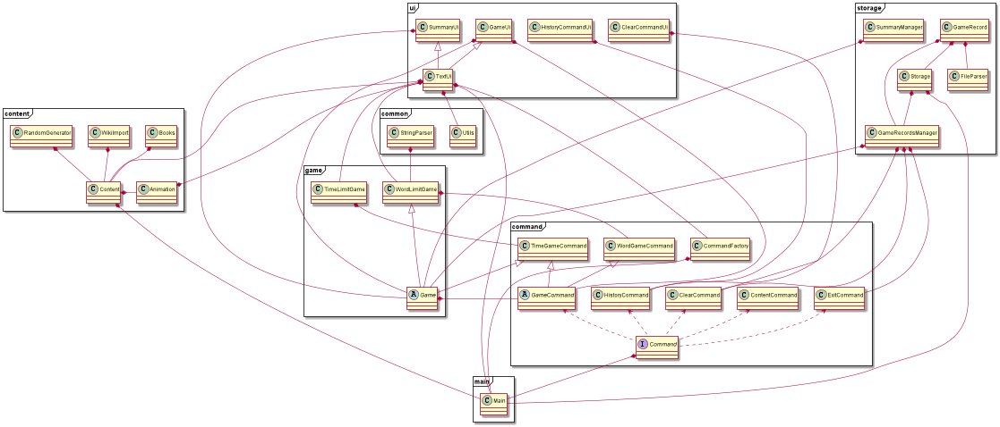
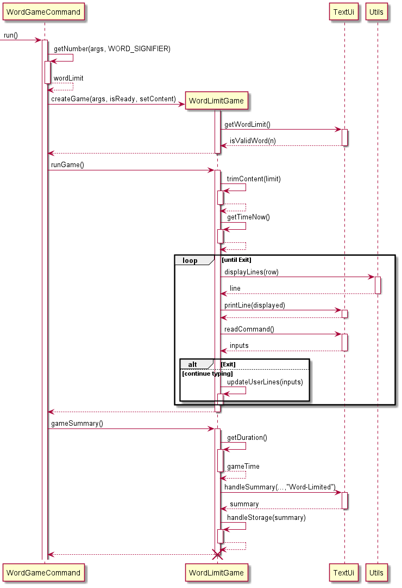
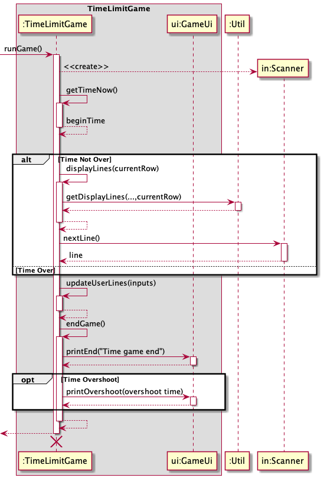
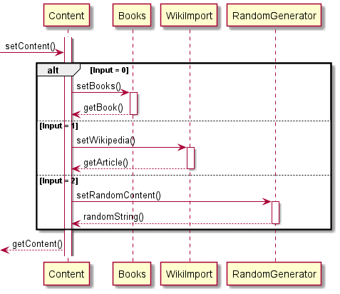

# Developer Guide

* [Acknowledgements](#acknowledgements)
* [Setting Up, getting started](#setting-up-getting-started)
* [Design](#design)
  * [Architecture](#architecture)
  * [Command Component](#command-component)
  * [Game Component](#game-component)
  * [Content Component](#choose-the-game-content)
* [Implementation](#implementation)
* [Product Scope](#product-scope)
* [User Stories](#user-stories)
* [Glossary](#glossary)
* [Manual Testing](#instructions-for-manual-testing)

## Acknowledgements

* [reference code for testing System.out.println()](https://www.baeldung.com/java-testing-system-out-println)
* [reference code for accessing wiki](https://github.com/fastily/jwiki)
* [SE-EDU AB3 Developer Guide Format](https://se-education.org/addressbook-level3/DeveloperGuide.html)

## Design

> :bulb: **Tip:** The `.puml` files used to create diagrams in this document 
> can be found in the [diagrams](https://github.com/se-edu/addressbook-level3/tree/master/docs/diagrams/) folder. 

### Architecture

The Architecture diagram above explains the high-level design of the Typists app.  
Given below is a quick overview of main components and how they interact with each other.

**Main Components of the architecture**
The `Main` class is the entry point of Typist. It is responsible for parsing and running various user's command.

The other core components of Typist:
* `ui`: The Ui of the app.
* `command`: Consists of `CommandFactory` which parses user inputs, and various `command` objects.
* `common`: A collection of classes used by multiple other components.
* `content`: Holder for the content and logic for `content` command
* `game`: Game, game summary and game record executor.
* `storage`: Game storage executor.

### Command Component
**API:** `CommandFactory.java`  

The `Command` component implements the Factory Design Pattern to parse user commands.

Here’s a (partial) class diagram of the `Command` component:  

How the `Command` component works:
1. Typists `Main` calls upon the `CommandFactory` class to parse the user input.
2. The `CommandFactory` returns a `Command` object (more precisely, an object that implements it e.g., `GameCommand`).
3. `Main` will then execute the `Command` by calling `.run(args)` method of the `Command`.

### Game Component

**How the Game Component works:**
* The `Game` component consists of 2 parts: 
  1. The actual game execution classes;
  2. and the game record classes
* For 1: When for a `Game` object, the `.runGame()` is the main method that runs the game until termination and 
the`.gameSummary()` displays the summary and stores game data. 
* For 2: Game Record Management, which interacts with record storage, will be explained with further detail in [later section](#proposed-view-statistics-feature).

For instance:
When game is running from the CLI: 
* The `.run(args)` of `TimeGameCommand` is called, a `TimeLimitGame` object is created. 
* Then, `.run()` method of `TimeLimitCommand` is executed, a Time Limit Game will start running 
until game ends(i.e. timer's up).
* `.gameSummary()` method will then generate the summary of the game. 

The (partial) Class Diagram bellow illustrates the structure of `game` component:
{some class diagram}

There are 2 constructors in `TimeModeGame` class, each handling different number of parameters specified.

As from the diagram, `WordLimitGame` and `TimeLimitGame`, the 2 major game execution classes inherits from the `Game` Class.
However, their implementations and functionality varies on many parts due to them being 2 different games. 
Hence, The section below explains in greater detail how [Word Mode](#word-limit-game) and [Time Mode](#time-limit-game) of Typist game are implemented.  

### Word Limit Game

Sequence Diagram for Word Mode Game:  

The Sequence Diagram above illustrates the working process of the `WordLimitGame` class.

### Time Limit Game

The Sequence Diagram below illustrates the working process of the `TimeLimitGame` when the `.runGame` method is called:  

### Choose the game content

Once the game starts, the main class instantiates a Content object containing a string, which is set to a default 
value (lorem ipsum paragraph). The string can only be changed through the setContent() method.

Users can input the 'content' command to start the text selection.

There are 3 types:

    1. Opening paragraphs from famous books
    2. Custom Wikipedia article
    3. Random words

The following UML diagram illustrates the way content selection works in the program.

There only exists one private content string for all sessions. Each time a set method is called, the string is changed 
depending on the choices that the user made throughout the process. Whenever the user starts a game, the getContent() 
method is called and the text is set accordingly.

## Implementation

### \[Proposed\] View Statistics feature
#### \[Proposed Implementation\]
The top-level logic of view statistics feature resides in ViewCommand. It implements the Command
interface. The key method of the class is `executeCommand()`.  
`executeCommand()` logic:
1. Calls the retrieveStatistics() method of StatisticsManager to get the statistics.
2. Calls the displayStatistics() method of ViewCommandUi to display the statistics retrieved.
<!-- -->
StatisticsManager performs the logic for processing the game records to obtain the statistics.  
Its key methods are:  
* `retrieveStatistics()` - Decides which of the three methods below to run
* `calculateBestStatistics()` - Returns the best statistics over the past n games
* `calculateWorstStatistics()` - Returns the worst statistics over the past n games
* `calculateAverageStatistics()` - Returns the average statistics over the past n games
<!-- -->
Given below is an example usage scenario and how the program implements the feature.

Step 1: The user launches the application (scenario assumes that there are several game records already stored in the text files). 

Step 2: The user executes `view -m best -g time -n 4` to view his/her best statistics for the time-limited game mode over the past 4 games. 

Step 3: A ViewCommand object is then instantiated.  

Step 4. ViewCommand calls the retrieveStatistics() method of StatisticsManager.  

Step 5: StatisticsManager creates a GameRecordsManager object.
* The constructor of GameRecordsManager calls the readGameRecords() method of the Storage class to retrieve the gamer's past game records from the text files.
<!-- -->
  
Step 6. StatisticsManager then calls getGamesRecords() method of GameRecordsManager() and self-invokes calculateBestStatistics().
* Calculated statistics is returned.

Step 7. ViewCommand calls the displayStatistics() method of the ViewCommandUi class to display the statistics.

The following sequence diagram shows how the above scenario is executed.

#### Alternative Implementation
* One implementation considered is to do away with the retrieveStatistics() method and immediately call one of calculateBestStatistics,
calculateWorstStatistics() or calculateAverageStatistics() based on the gamer's imput using a switch statement. This implementation choice 
was not used because it violates the Single Responsibility Principle and does not do SLAP well.
* Another implementation considered was for GameRecordsManager to do the main logic. This implementation was not done as it violates the
Single Responsibility Principle.
<!-- -->

## Product scope
Our product is a typing game, intent to provide enjoyment for people who are familiar with the CML.

### Target user profile

The target user profile includes bored people who are looking for a fun way to entertain themselves while working on the command line.

### Value proposition

It solves the lack of entertainment alternatives on the CLI.

## User Stories

|Version| As a ... | I want to ... | So that I can ...|
|--------|----------|---------------|------------------|
|v1.0|new user|see usage instructions|refer to them when I forget how to use the application|
|v1.0|user|customize the time limit to finish a game|train myself to type faster|
|v1.0|user|customize the word limit, in multiples of 100|have an optimal gaming experience by being able to choose my preferred length of text for the game|
|v1.0|user|choose text from famous books, randomly generated text or customized text for my game|make my gaming experience more fun and fulfilling|
|v1.0|typist|view my error rate|know on average, what my error rate is|
|v1.0|typist|see my word per minute after I've finished a game|know my typing speed|
|v2.0|gamer|view my past records|see how I have improved over time|
|v2.0|gamer|clear my past records|have a fresh start|
|v2.0|typist|see the words I typed wrongly after I've finished a game|know which words I have to practice more|

## Glossary

* Mainstream OS: Windows, Linux, Unix, OS-X 
* Time Limit Game: A game that ends only when timer stops.
* Word Limit Game: A game that ends only when all the words has been inputted.

## Instructions for manual testing

### Launch and Shutdown
1. Initial Launch
   1. Download the jar file and copy into an empty folder
   2. Double-click the jar file.  
      Expected: shows the starting page and current version of Typist
2. Obtaining past game records 
   1. Exit the game through command `bye`.
   2. Re-launch the app by double-clicking hte jar file.  
      Expected: The record of previous games is retained. 
   
### Opening a game
1. Opening a game with optional operands
   1. Test case: `game -time 0`  
      Expected: A warning message about error on limit input is shown. 
      The game will still start as if no time limit is specified. 
      User will be asked to "Enter how long you want the game to run: ".
   2. Test case: `game -time 30 -sn`
      Expected: A game will start running. Timer starts immediately together the first line of sentence to be typed is displayed.
      