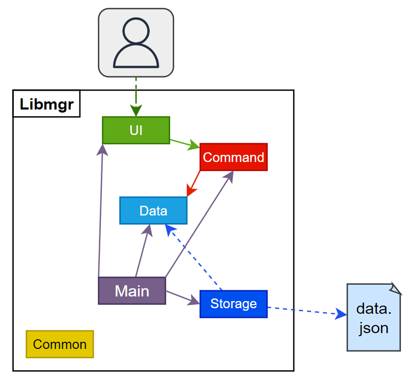
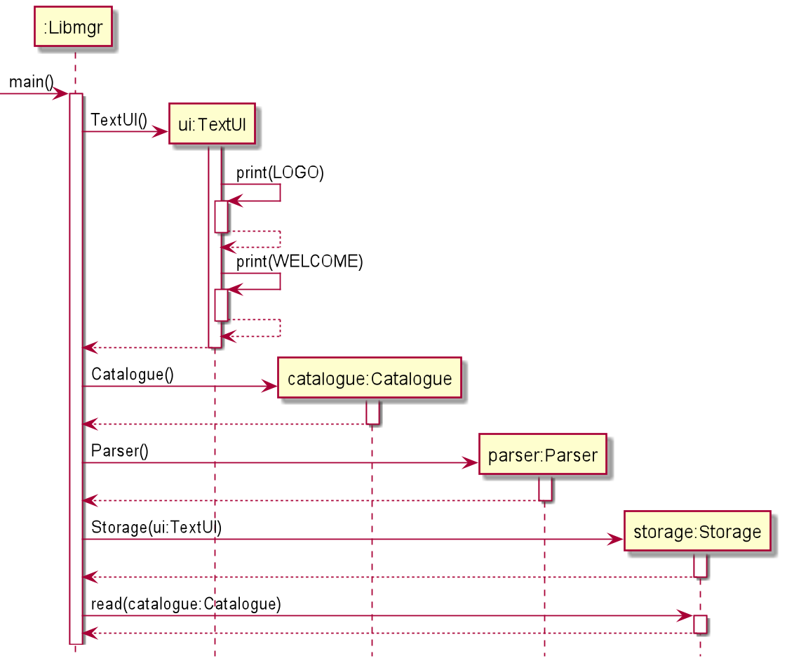
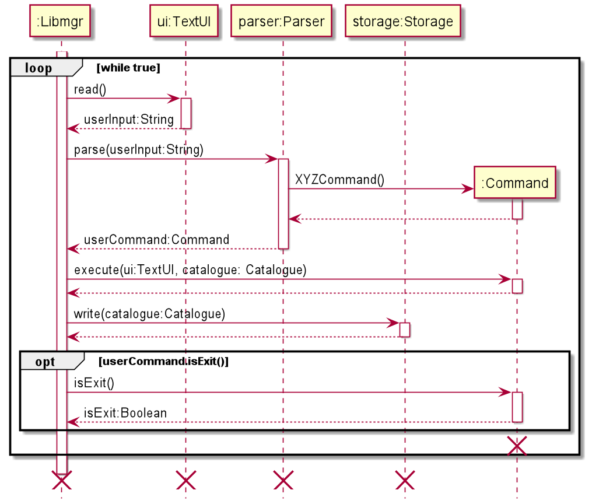
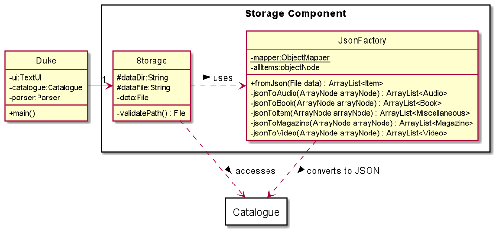

# Developer Guide

Libmgr is a desktop app for managing the inventory of libraries, optimised for use via a Command Line Interface (CLI). 
Designed for fast typists, it can help to augment the day-to-day tasks of a librarian and can help them to get tasks done in an efficient manner.

This document is meant to assist developers in better understanding the inner workings of the program.

- [Acknowledgements](#acknowledgements)
- [Setting up the project](#setting-up-the-project)
- [Design](#design)
  - [Architecture](#architecture)
  - [Commands Component](#commands-component)
  - [Data Component](#data-component)
  - [Storage Component](#storage-component)
  - [UI Component](#ui-component)
  - [Common Package](#common-component)
- [Implementation](#implementation)

## Acknowledgements

The format of this developer guide was adapted from [SE-EDU AddressBook Level 3 Developer Guide](https://github.com/se-edu/addressbook-level3/blob/master/docs/DeveloperGuide.md)

Libmgr also makes use of the following third-party libraries:
- [Jackson Databind](https://mvnrepository.com/artifact/com.fasterxml.jackson.core/jackson-databind/2.13.0) (Apache 2 License)
- [Jackson Annotations](https://mvnrepository.com/artifact/com.fasterxml.jackson.core/jackson-annotations/2.13.0) (Apache 2 License)
- [Jackson Datatype JSR310](https://mvnrepository.com/artifact/com.fasterxml.jackson.datatype/jackson-datatype-jsr310/2.13.0) (Apache 2 License)

## Setting up the project

> ⚠ **Caution**: Follow the steps in the following guide precisely. Things will not work out if you deviate in some steps.
> 
First, **fork** this repo, and **clone** the fork into your computer.

If you plan to use Intellij IDEA (highly recommended):

1. **Configure the JDK**: Follow the guide _[[se-edu/guides] IDEA: Configuring the JDK](https://se-education.org/guides/tutorials/intellijJdk.html)_ to ensure Intellij is configured to use **JDK 11**.
2. **Import the project as a Gradle project**: Follow the guide _[[se-edu/guides] IDEA: Importing a Gradle project](https://se-education.org/guides/tutorials/intellijImportGradleProject.html)_ 
to import the project into IDEA.
   _⚠ Note: Importing a Gradle project is slightly different from importing a normal Java project._
3. **Verify the setup**:
   1. Run the `seedu.libmgr.Libmgr` and try a few commands. 
   2. Run the tests to ensure they all pass.

## Design

This section provides an overview of the design architecture and design of the various components of Libmgr. 

### Architecture

The following __*Architecture Diagram*__ provides a high level visualization of the interaction between the various components of the app.
Further elaboration  is given below.

The base `Duke` class consists of the main method which is responsible for:
- Application launch: initializing the components in the correct order and setting up the data containers effectively.
- Applicaiton teardown: shutting down the components, perform cleaning up and closing of processes where necessary.

Beyond that, the libmgr application contains a number of other components:
- `ui`: Contains TextUI, the class which handles user interaction through the command line UI .
- `data`: Contains the library catalogue and various item classes that form the data of the app along with all relevant operations.
- `commands`: Contains various command classes that facilitate the execution of commands and a parser class that parses user inputs.
- `storage`: Reads data from, and writes data to the hard disk.
- `common`: Contains a collection of classes used by multiple other components, such as exceptions and messages.

#### Application Launch

The above sequence diagram depicts how the components interact with each other when the program is first started.

1. A `TextUI` object is created which then prints the logo and a welcome message.
2. The `Catalogue` container is created in order to store all items.
3. A `Parser` object is created.
4. A `Storage` handler is created, before having `read()` called to load in existing data from `data/data.json` (if applicable).

#### Component Interaction

The above sequence diagram shows the interactions occurring each time a command is issued by the user.

1. `Libmgr` uses the `TextUI` class to obtain the user input.
2. `Libmgr` then uses `Parser` to parse the user input.
3. A `Command` object is returned based on the user input.
4. `Libmgr` then calls the `execute()` method of the `Command` object which performs all the logic as defined by the command
5. `Libmgr` lastly calls the `write()` method of the `Storage` object which writes the current state of teh items in the `Catalogue` container to `data/data.json`
6. The exit condition is checked by computing whether the `isExit()` method of the current `Command` object returns true. If it is computed as true, the loop is broken out of and the program quits.

### Commands component

The commands component consists of a `commands` package. Inside the package are the following classes: 
1. A main `Parser` class to process all the commands 
2. Individual Command classes, each corresponding to a specific command 
   1. `AddAudioCommand`
   2. `AddBookCommand`
   3. `AddCommand`
   4. `AddMagazineCommand`
   5. `AddVideoCommand`
   6. `DeadlineCommand`
   7. `EditCommand`
   8. `ExitCommand`
   9. `ListCommand`
   10. `LoanCommand`
   11. `RemoveCommand`
   12. `ReserveCommand`
   13. `ReturnCommand`
   14. `SearchCommand`
   15. `UnknownCommand`
   16. `UnreserveCommand`

The individual Command classes inherit from an abstract `Command` class.

### Data Component

The data component consists of a `data` package which holds classes that allows the categorisation of items into different types.
- Audio
- Books
- Magazines
- Videos
- Miscellaneous

Additionally, this component also holds a `Catalogue` class, which acts as a container for all items and also provides functionality to perform operations on them.

### Storage Component

The storage component contains the `Storage` and `JsonFactory` classes.
- `Storage` holds the functionality to write the current state of the catalogue to the `data.json` file. It also reads from the `data.json` file if one is found, if not a new empty file is created
- `JsonFactory` contains all the logic for deserializing the `Catalogue` object into JSON so that it can be written into a file. Likewise, it also contains the logic for serializing the `Catalogue` object when provided JSON.
Furthermore, it also contains error checking to ensure that malformed or corrupted data is not processed.

> :grey_exclamation: The directory and filename of the JSON file is defined within the `Storage` class 
The default value is set to `./data/data.json`

### UI Component

_todo_

### Common component

Classes used by multiple components are located in the `common` package.
- `LibmgrException` is the main exception class for the app.
- `Status` enumeration contains the possible values for `Status` of items, which include `AVAILABLE`, `RESERVED` and `LOANED`
- `Messages` contains information, warning and error messages

## Implementation

#### Edit Command

The Edit Command class handles the functionality to change a specific detail of an item in the catalogue.

#### Search Command 

---
## Product scope
### Target user profile

Library staff who prefer keyboard inputs and require a text based application to quickly track and update 
the details of library items within their catalogue.

### Value proposition

This product aims to streamline the process of managing the book catalogues within their library. 
It will allow library staff to track their items, such as finding out their status, as well as update their 
catalogue quickly. Designed for fast typists, it also allows staff to track, update and manage their 
inventory more efficiently.

## User Stories

|Version| As a ... | I want to ... | So that I can ...|
|--------|----------|---------------|------------------|
|v1.0|librarian|add items to the catalogue|keep the full catalogue up to date|
|v1.0|librarian|remove items from the catalogue|keep the full catalogue up to date|
|v1.0|librarian|update the status of an item when it is loaned out|keep the full catalogue up to date|
|v1.0|librarian|update the status of an item when it is returned|keep the full catalogue up to date|
|v1.0|librarian|check the list of items available in the library||
|v1.0|librarian|check the list of items on loan||
|v1.0|librarian|check the list of all items in the library||
|v2.0|librarian|categorise different items into media forms. (E.g. book, magazine, audio, video)|better manage my catalogue
|v2.0|librarian|edit the details of existing items on the catalogue|keep the full catalogue up to date||
|v2.0|librarian|reserve and unreserve an item by updating its status|keep the full catalogue up to date||
|v2.0|librarian|search for specific items by their title or ID|retrieve the details of items I need||
|v2.0|librarian|check the list of items on reservation||
|v2.0|librarian|loan an item for a person specified by their username||
|v2.0|librarian|reserve an item for a person specified by their username||
|v2.0|librarian|view what items are due to be returned today|| 
|v2.0|librarian|view the list of overdue items|inform people to return them|| 

## Non-Functional Requirements

1. Should work on Windows, macOSX and Linux as long as it has Java 11 or above installed.
2. A user with above average typing speed for regular English text (i.e. not code, not system admin commands) should be able to accomplish most of the tasks faster using commands than using the mouse.

## Glossary

* *glossary item* - Definition

## Instructions for manual testing

{Give instructions on how to do a manual product testing e.g., how to load sample data to be used for testing}
