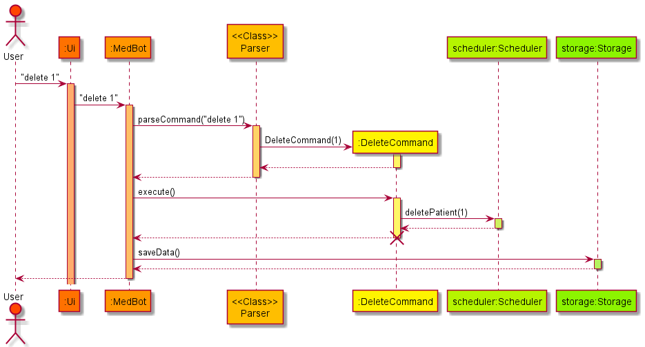

# Developer Guide

## Table of Content

- [1. Acknowledgements](#1-acknowledgements)
- [2. Introduction](#2-introduction)
- [3. Design](#3-design)
    - [3.1 Architecture](#31-architecture)
        - [3.1.1 Main Components](#311-main-components)
        - [3.1.2 Component Interaction](#312-component-interaction)
    - [3.2 Ui Component](#32-ui-component)
    - [3.3 Parser Component](#33-parser-component)
    - [3.4 Scheduler Component](#34-scheduler-component)
    - [3.5 Storage Component](#35-storage-component)
    - [3.6 Command Class](#36-command-class)
- [4. Implementation](#4-implementation)
    - [4.1 Switch View Feature](#41-switch-view-feature)
    - [4.2 Find Feature](#42-find-feature)
    - [4.3 Edit Feature](#43-edit-feature)
    - [4.4 Appointment Management](#44-appointment-management)
- [Appendix A: Product Scope](#appendix-a-product-scope)

## 1. Acknowledgements

* Inspiration for Developer Guide: https://se-education.org/addressbook-level3/DeveloperGuide.html

## 2. Introduction

MedBot is a Command Line Interface (CLI) application for head nurses to manage patients’ personal information, and
scheduler appointments between them and medical staff.

## 3. Design

### 3.1 Architecture

Given below is a quick overview of the main components of MedBot and how they interact with one another.

#### 3.1.1 Main Components

The main class of MedBot is the `MedBot` class. It is responsible for initialising the other core components of MedBot
at application startup and for handling the interactions between these components.

The 4 core components of MedBot are:

* `Ui`: Handles the UI of MedBot.
* `Parser`: Parses user inputs and creates `Command` objects.
* `Scheduler`: Holds data in memory and contains the methods to read and write to it.
* `Storage`: Loads data from, and stores data to the hard disk.

In addition, the `Command` class facilitates the execution of user instructions.

#### 3.1.2 Component Interaction

Given below is a simplified sequence diagram of how the core components of MedBot interact with each other when the user
inputs the command `delete 1`.

### 3.2 Ui Component

The Ui Component is handled by the `Ui` class. It is the main class that a user directly interacts with. This class is
responsible for reading user inputs and printing outputs to users.

The `Ui` class serves as an abstraction over these smaller classes:

* `PersonUi`: Handles the Ui for persons
    * `PatientUi`: Inherits `PersonUi` to handle patient-related Ui
    * `StaffUi`: Inherits `PersonUi` to handle staff-related Ui
* `SchedulerUi`: Handles the Ui for schedulers.

Given below is a sequence diagram of how the `Ui` component works after the `Parser`
parses `help delete` input given by a user.

### 3.3 Parser Component

The Parser Component is responsible for parsing the user input and returning the corresponding command class to be
executed.

Here's a partial class diagram to better illustrate the Parser Component:

How the `Parser` component works:

* When `Parser` is called by MedBot to parse the user input, it will call the view specific parser `XYZCommandParser`
  depending on the current view type (`XYZ` is a placeholder for the specific command name eg. `PatientCommandParser`).
* The `XYZCommandParser` will then create and return the corresponding
  `XYZcommand` object by utilising the `ParserUtils` to help it process the user input.

The sequence diagram below better illustrates the working process described above:

<em>(User is trying to add a patient's information in the PatientInfoView)</em>

### 3.4 Scheduler Component

The Scheduler Component is responsible for the storage and modification of patient, staff and appointment information.

Here is a partial class diagram to better illustrate the Scheduler Component.

#### Scheduler Class

The `Scheduler` class consists of 3 internal lists, `patientList`, `medicalStaffList` and `schedulerAppointmentList`,
that store patient, staff and appointment information respectively. It has various public methods for the viewing and
modification of the information stored in the lists, and for the interfacing between the Scheduler and Storage
components. A `Scheduler` class object is instantiated upon MedBot startup.

#### How the Scheduler component works:

* When MedBot calls the `.execute(Scheduler, Ui)` method of a `Command` object, a corresponding method of the
  `Scheduler` object will be called.
* This method will then view or modify the patient, staff or appointment information as specified.

For example:

* When the `.execute(Scheduler, Ui)` method of an `AddStaffCommand` object is called, the `addStaff(Person)` method of
  the `Scheduler` object will be called.
* The `addStaff(Person)` method will then add the `Person` to the `medicalStaffList`

### 3.5 Storage Component

The Storage component is responsible for the storage of all patient and staff personal information, and appointment
details. It creates a directory MedBotData (if it doesn't already exist), and the text files MedBotData/patient.txt,
MedBotData/staff.txt and MedBotData/appointment.txt.

Here's a partial class diagram to better illustrate the Storage component:

#### How the Storage component works:

* When MedBot calls its `interactWithUser()` method, it initializes the `StorageManager` class
    * this initializes the `PatientStorage`, `StaffStorage` and `AppointmentStorage` classes.
* These three classes inherit from the `Storage` class.
* The `PatientStorage`, `StaffStorage` and `AppointmentStorage` objects will call the inherited `loadStorage()` method
  and read their respective text data files and read them back into the corresponding objects.
* After a command is executed, the object of `StorageManager` will call its `saveToStorage` method and thus call
  the `saveData()` method for all three inherited `Storage` objects, thus writing the storage data into the respective
  data text files.

### 3.6 Command Class

The Command class and its subclasses are responsible for handling the execution of user input.

Each individual Command object includes:

* `isExit()`: Return true only if it is an `ExitCommand` .
* `execute(Scheduler, Ui)`: Using the `Ui` class and data from the `Scheduler` to execute and print out the result to
  the user.
* Various attributes specific to the command, some common ones:
    * `id`: The id of `Person`/`Appointment` object to execute the command on.
    * `viewType`: The current `ViewType` of the program.

Three major types of Commands:

1. `Person` commands: to interact with person objects.
2. `Appointment` commands: to interact with the appointment between doctors/nurses and patients.
3. General commands: included are `help`, `exit`, `switch`, `getCurrentView`.

Given below are class diagrams of how the `Command` class and its subclasses are implemented.

#### Command class and general commands

#### Person-related commands

#### Appointment-related commands

## 4. Implementation

This section describes some noteworthy details on how certain features are implemented.

### 4.1 Switch view feature

#### Implementation

The switch view mechanism is heavily linked to the `Parser` class. By having a
`ViewType` enumeration property in `Parser`, the view of the console can be switched by executing the
appropriate `SwitchCommand` class, which modifies the corresponding `ViewType`
of the `Parser`. The 3 possible views and the corresponding user input commands are as follows:

* `switch p` or `switch 1` - switches to the patient info view.
* `switch m` or `switch 2` - switches to the medical staff info view.
* `switch s` or `switch 3` - switches to the scheduler view.
* `switch` - will switch to another view depending on the current view.

Each command evokes the `Parser#setViewType(ViewType)` method, which will set the corresponding
`ViewType` property in the `Parser` class.

[Design Considerations to be added]

### 4.2 Find feature

#### Functionality

This command will find a list of `Person` that match the given attributes in a table format.

#### Implementation

The `find` feature is facilitated by the `FindPersonCommand` class. It extends from `Command` class and overrides
the `execute()` method to achieve the desired functionality.

The example below gives a direction on how this command behaves.

Step 1.
 
A User execute the `find n/John` command. The `Parser#parseCommand()` method will parse this command and eventually
returns a `new FindPatientCommand()` object.

Step 2.
 
The `MedBot#interactWithUser()` method will run the `execute()` method in the `new FindPatientCommand()` object.

Step 3.
 
The `execute()` method will call `PersonList#findPersons()` method with the parameter `n/John` passed in.

Step 4.
 
`PersonList#findPersons()` will check all the `persons` list and returns all `Person` in the list whose name contains
the string `john`. The attribute match is case-insensitive.

Step 5.
 
The filtered `Person` list is then passed into the `Ui` class to be displayed into a table format through
`Ui#getFindPatientsMessage()`.

### 4.3 Edit feature

#### Functionality

This command will edit a specified `Person` object with the attributes given in the command.

#### Implementation

The `edit` feature is facilitated by the `EditPersonCommand` class. It extends from `Command` class and overrides
the `execute()` method to achieve the desired functionality.

The example below gives a direction on how this command behaves.

Step 1.
 
A User execute the `edit n/John` command when the attribute `Parser#viewType` is `PATIENT_INFO`.
The `Parser#parseCommand()` method will parse this command and eventually returns a `new EditPatientCommand()` object.

Step 2.
 
The `MedBot#interactWithUser()` method will run the `execute()` method in the `new EditPatientCommand()` object.

Step 3.
 
The `execute()` method will call `PersonList#editPerson()` method with the new `Person` object having the parameter
`n/John` passed in. (All other attributes of the object are set to `null`)

Step 4.
 
`PersonList#editPerson()` will attempt to replace all attributes of the old `Person`
object with the non-null attributes given in the new `Person`.

Step 5.
 
The edited `Person` is then passed into the `Ui` class to be displayed through`Ui#getEditPatientMessage()`.

### 4.4 Appointment management

#### Functionality

The appointment management feature is designed to allow head nurses to schedule appointments between medical staff and
patients while ensuring that there are no appointment clashes for both staff and patients.

Below is a list of key design considerations for this feature:

* Upon adding/editing an appointment, MedBot will check if the new appointment clash with an existing appointment and
  prevent such additions/edits.
* Users should be able to edit the date/time of appointments to reschedule appointments, or to fix mistakes.
    * Users should also be able to change the staff involved in that appointment for cases where the original staff is
      not available, or to fix mistakes.
    * Users should also be able to change the patient involved in that appointment to allow for the rearranging of
      appointments, or to fix mistakes.
* Users should be able to view a list of all appointments in the system.
* Users should be able to view a list of all appointments for a particular patient/staff.

#### Implementation

Appointment management is performed by the `Scheduler` class and involves the storage and modification of `Appointment`
class objects. Appointments are managed on an hourly basis.

The `Appointment` class is an association class between `Patient` and `Staff`, with additional `appointmentId` and
`dateTimeCode` attributes. It is stored in the `SchedulerAppointmentList` class object in the `Scheduler` class and in
`PersonalAppointmentList` class objects in each `Person` class object.

The `SchedulerAppointmentList` object keeps track of all appointments in the system. This allows for the viewing of all
appointments in the system. The object consists of a `HashMap` that stores `Appointment` objects with their
`appointmentId` as their key, this prevents the system having multiple `Appointment` objects of the same
`appointmentId`.

The `PersonalAppointmentList` object in each `Person` class object keeps track of the appointments of that person. This
allows for the viewing of all appointments of that person. The object consists of a `TreeSet` that stores `Appointment`
objects with their `dateTimeCode` as the comparable value. This prevents the system from adding clashing appointments to
a patient/staff and allows their appointments to be listed by their date.

Below is a simplified sequence diagram of the `addAppointment(Appointment)` method in the `Scheduler` class:

## Appendix A: Product scope

### Target user profile

Head nurses who prefer using Command Line Interface(CLI) instead of traditional Graphical User Interface (GUI)
for their daily jobs

### Value proposition

1. Easily manage patient info, consultation requirements
2. Easily manage nurse/doctor schedules
3. Assign nurses/doctors to visit patients at specific times

## User Stories

|Version| As a ... | I want to ... | So that I can ...|
|--------|----------|---------------|------------------|
|v1.0|new user|see usage instructions|refer to them when I forget how to use the application|
|v2.0|user|find a to-do item by name|locate a to-do without having to go through the entire list|

## Non-Functional Requirements

{Give non-functional requirements}

## Glossary

* *glossary item* - Definition

## Instructions for manual testing

{Give instructions on how to do a manual product testing e.g., how to load sample data to be used for testing}
