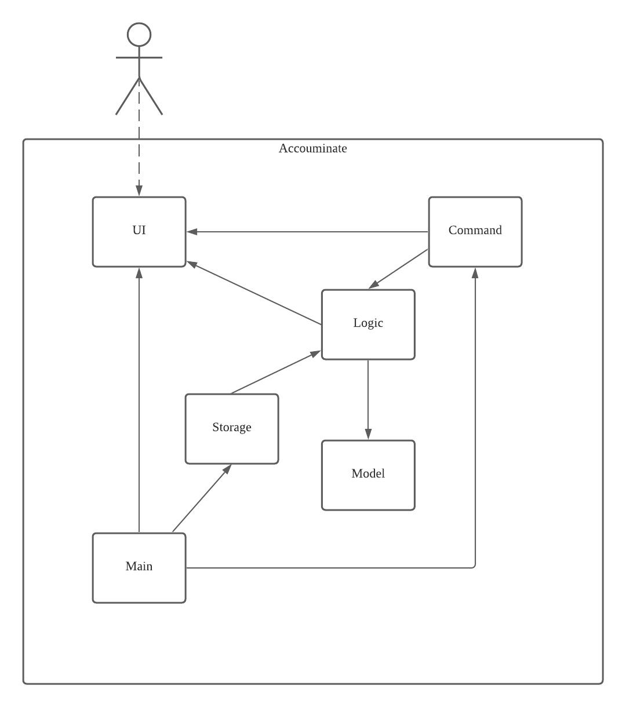
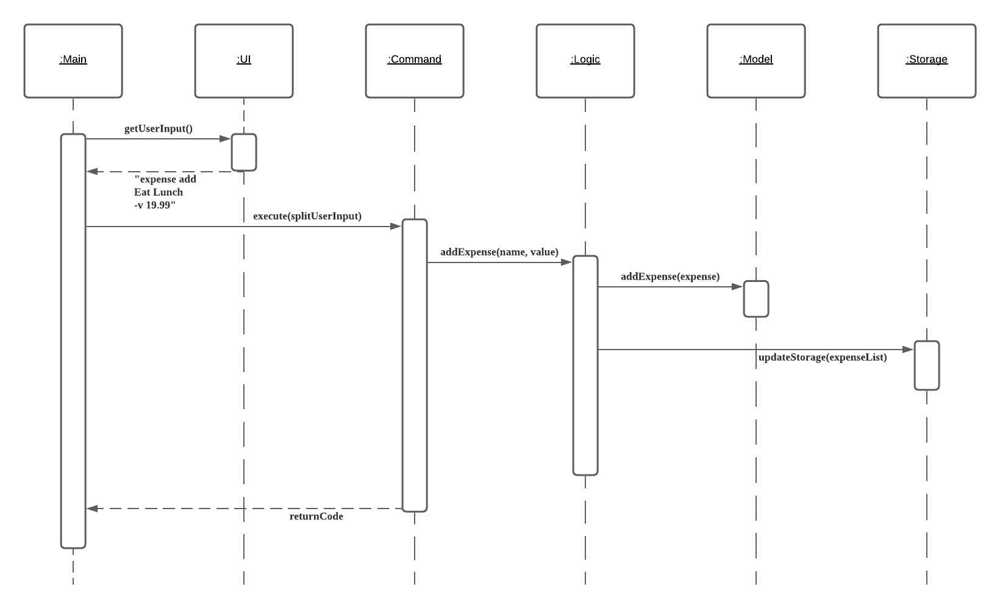
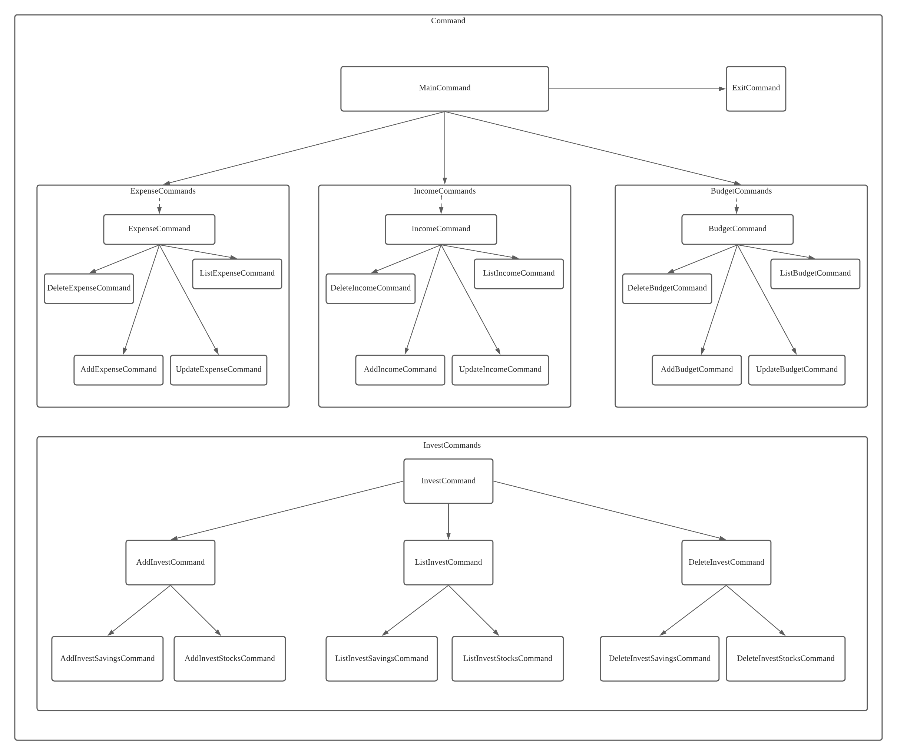
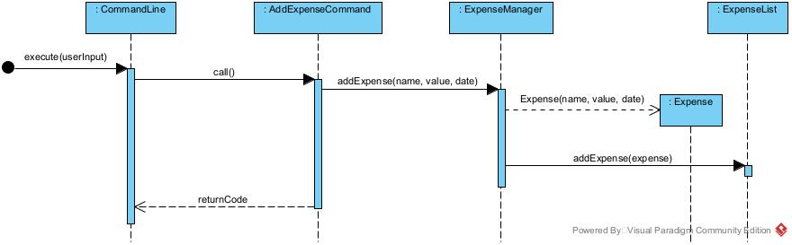
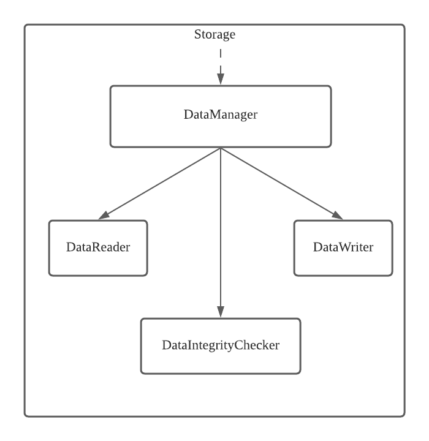
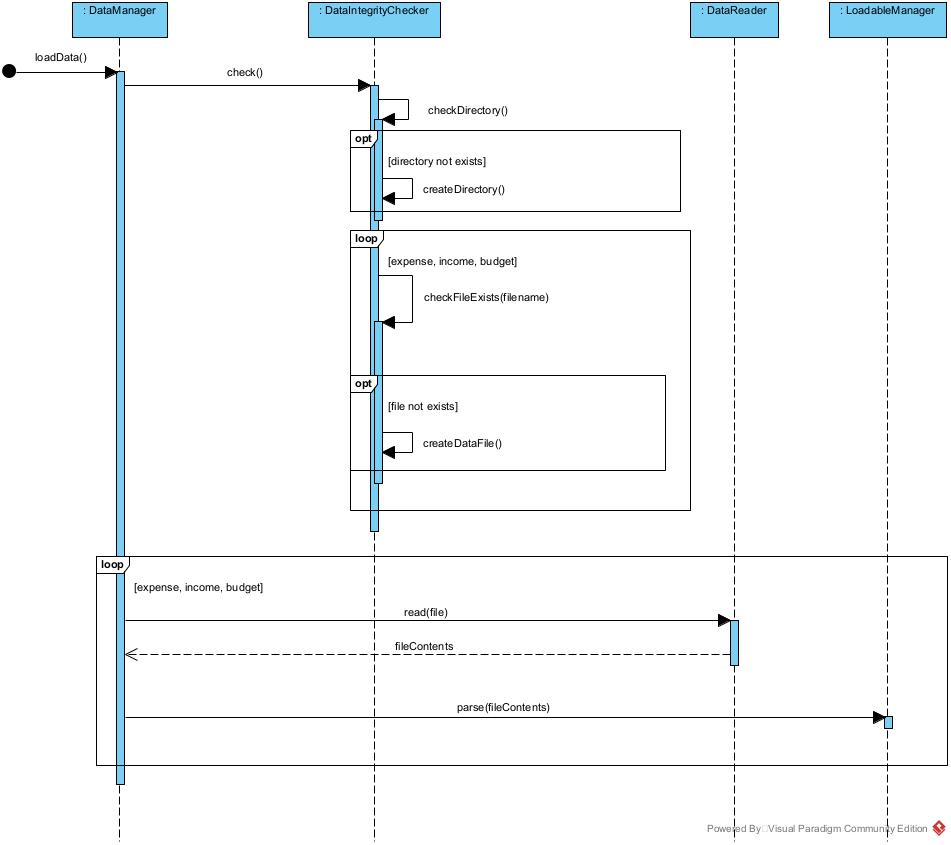
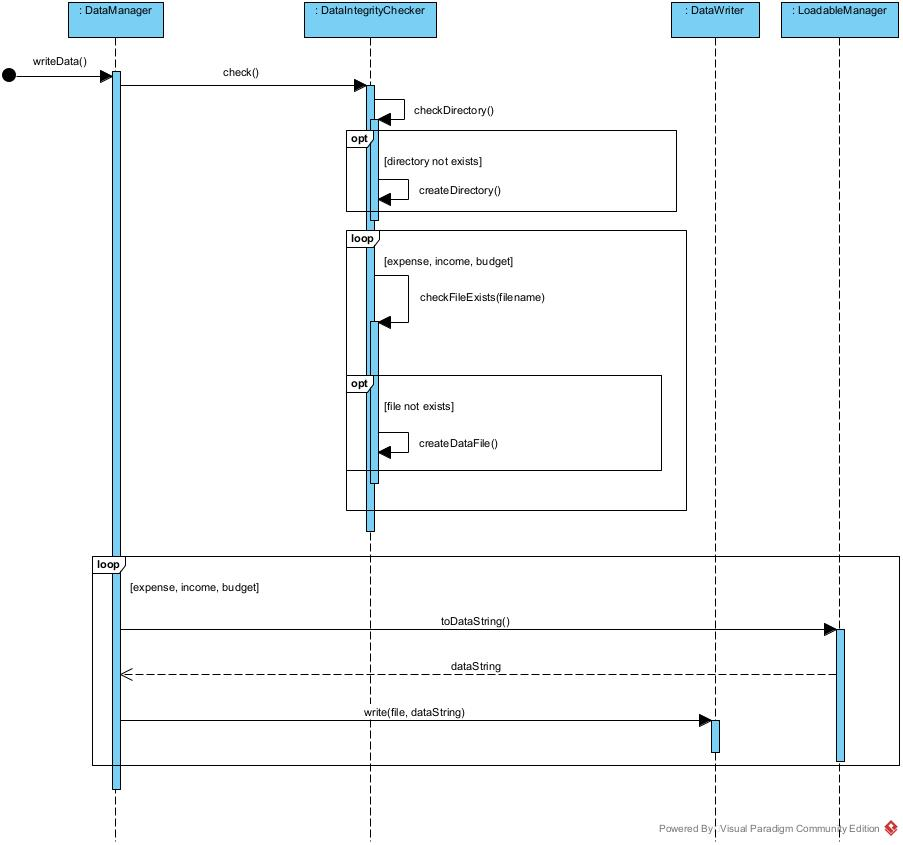

# Developer Guide

## Acknowledgements

In the development of **Accouminate**, [picocli](https://picocli.info) is used. 

**Picocli** is a third-party library for parsing and process the command line.

## Design & implementation

### Architecture

The diagram above shows how each component interacts with one another.

The 5 core components of the application are:
- `Ui` - Handles the I/O of the terminal
- `Command` - Provides an interface for various commands, arguments and flags
- `Logic` - Handles the execution of the user commands
- `Storage` - Reads and writes data to the hard disk
- `Model` (or Data Persistence) - Holds the user data in memory

 

**How the architecture components interact with each other**

The sequence diagram below shows how the core components of Accouminate interact with each other, when the user enters the command `expense add Eat Lunch -v 19.99`.

#### UI component
The Ui component handles all the inputs from the user (i.e. commands) and the outputs from the application.

Currently, the Ui component only composes of a single class - `Ui.java`. The following methods facilitate I/O:
- `getUserInput`: Use a `Scanner` to get a line of user input
- `printErrorMessage`: Prints error, exceptions encountered, prepended with the "Error" header.
- `printSuccessMessage`: Prints a success confirmation message, prepended with the "Success" header.

#### Command component
The Command component is partially delegated to the **picocli** third-party library. The **picocli** library contains an extremely powerful parser and command handler.

The family of the `Command` classes is as follows:
- `MainCommand`: First to invoke when a command is executed. Passes the rest of the command to the appropriate command family. For example, `expense add` will cause this command to be passed to the `ExpenseCommand`.
- `ExitCommand`: A command to handle the case when the user wants to exit the application.
- `ExpenseCommands`: Handles all the expense commands
- `IncomeCommands`: Handles all the income commands
- `BudgetCommands`: Handles all the budget commands.

#### Logic component
The Logic component contains all the `Manager` classes.
1. `BudgetManager.java`
2. `ExpenseManager.java`
3. `IncomeManager.java`

Each `Manager` class handles the logic when adding the respective entities into the data persistence, as well as throwing any exceptions encountered back to the command handler.

Below shows the sequence diagram of how an `Expense` item is added to the `ExpenseList`.

#### Storage component
The Storage component handles the reading and writing of user data onto the hard disk.

- `DataManager` is the facade class to the Storage component, handling requests to write and read user data.
- The `DataReader` and `DataWriter` handles the actual reading and writing of user data to the hard disk.
- `DataIntegrityChecker` checks if the user data exists on the hard disk before the actual file I/O.
- In the case where the user data does not exist, the `StorageGenerator` generates a directory for user data and the respective data files.

#### Model component
The Model component consists of all the entities, as well as the aggregation of the entities as a list.
- Stores the budget data
- Stores the expense data
- Stores the income data

## Implementation

This section describes some noteworthy details on how certain features are implemented.

### Reading user data

The read user data feature is implemented by `DataManager`. 

The reading of user data follows these steps:
1. `DataManager` will call `DataIntegrityChecker#check()` to check if the specified directory and the data files for storing user data exists. If the directory or any of the data files does not exist, `DataIntegrityChecker` will call `StorageGenerator` to create the necessary file or directory.
2. `DataManager` will call `DataReader#read()` to read the contents of each data file.
3. After reading one data file, `DataManager` will pass the data (in string format) to the relevant logic handler for parsing and loading of the models.

Below is the sequence diagram for this feature.

### Writing user data

The write user data feature is implemented by `DataManager`. 

The writing of user data follows these steps:
1. `DataManager` will call `DataIntegrityChecker#check()` to check if the specified directory and the data files for storing user data exists. If the directory or any of the data files does not exist, `DataIntegrityChecker` will call `StorageGenerator` to create the necessary file or directory.
2. For each logic handler, `DataManager` will call `LoadableManager#toDataString()`. This will return a parsable string that can be saved in the data file, and can be parsed into models after reading the user data.
3. `DataManager` will then call `DataWriter#write()` to write the data string into each data file.

Below is the sequence diagram for this feature.

## Appendix: Requirements

### Product scope

**Target user profile**:
- University students
- Able to type fast
- Comfortable with CLI apps
- Prefer desktop apps to other types (i.e mobile)

### Value proposition

Accouminate helps university students to keep track of their finances to aid them in attaining better financial literacy. It is designed to clearly show the users their budgets, expenses and income to illuminate their paths towards financial literacy.

## User Stories

|Version| As a ... | I want to ... | So that I can ...|
|--------|----------|---------------|------------------|
|v1.0|user|add an expense|keep track of all my expenses|
|v1.0|user|delete an expense|can correct my input mistakes|
|v1.0|user|view all my expenses for the current month|understand my expenses for the current month|
|v1.0|user|add my gross income/allowance|later track how I use my income|
|v1.0|user|delete my gross income/allowance|correct my input mistakes|
|v1.0|user|view my total income/allowance|see how much money I can use|
|v1.0|user|add a saving plan / budget|have a rough expense plan|
|v1.0|user|delete a saving plan / budget|correct my input mistakes|
|v1.0|user|view my saving plan / budget for the current month|have a rough expense plan|
|v1.0|user|view my remaining budget for the current month|keep my spendings under the budget limit|
|v2.0|user|update an expense|correct my input mistakes|
|v2.0|user|view all my expenses for the current month by category|be clear about my expenses in each category|
|v2.0|user|receive warnings when adding expenses if my spending is close to exceeding my monthly budget|know that I am close to the limit|
|v2.0|user|update my gross income/allowance|correct my input mistakes|
|v2.0|user|view all my income/allowance for the current month by category|be clear about my income/allowance in each category|
|v2.0|user|sort the categories in the monthly income report that have the most income|know where most of my money come from|
|v2.0|user|update a saving plan / budget|correct my input mistakes and change the plan accordingly when there is a sudden huge amount of expense / income|
|v2.0|user|view my remaining budget for the current month|keep my spendings under the budget limit|
|v2.0|user|record investments that I have made|track their cost price and the profits separately|
|v2.0|user|add a loan expense item|track the debts that I have owed|
|v2.0|user|store my previously entered data on my computer|continue to keep track of my finances after exiting the application|

## Non-Functional Requirements
1. Should work on any mainstream operating systems (OS).
2. A user should be able to use the application after 5 minutes of exploration.
3. Should the application crash, any user data should already been saved and able to be retrieved without error.

## Glossary

- Mainstream OS: Windows, MacOS, Ubuntu and other modern flavors of Linux
- Exploration: Usage of the application without any external assistance or reference to the user guide

## Instructions for manual testing

{Give instructions on how to do a manual product testing e.g., how to load sample data to be used for testing}
