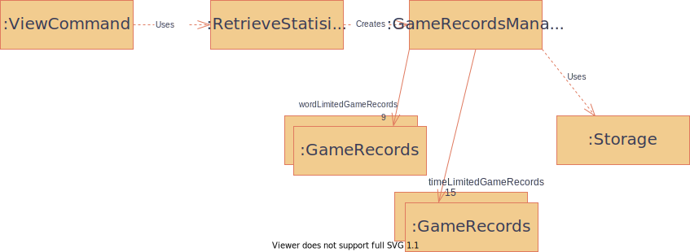
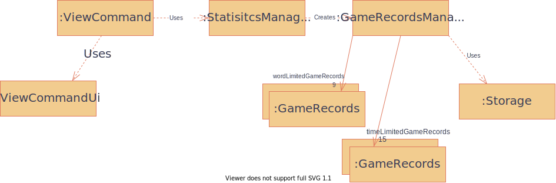
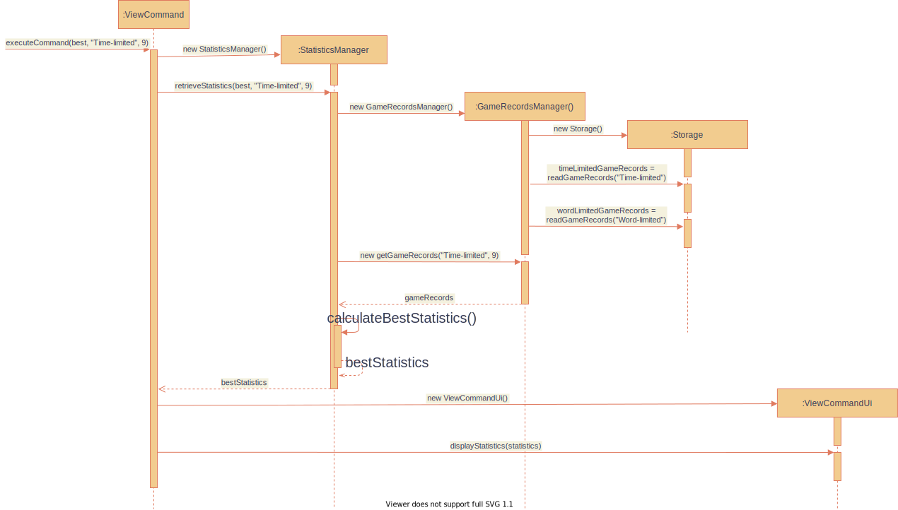

# Developer Guide
* [Acknowledgements](#acknowledgements)
* [Design & Implementation](#design-&-implementation)

* [Acknoledgements](#acknowledgements)

## Acknowledgements

{list here sources of all reused/adapted ideas, code, documentation, and third-party libraries -- include links to the original source as well}
* https://www.baeldung.com/java-testing-system-out-println

##Architecture

(Some architecture diagram)

## Design & implementation

{Describe the design and implementation of the product. Use UML diagrams and short code snippets where applicable.}

### Choose game mode

### Choose the game content

### Word Limit Game

Once the CommandFactory reads a 'word' command, a word limit game will begin.

Gonna to change this .puml diagram later - zhansen

### Time Limit Game

### \[Proposed\] View Statistics feature
#### \[Proposed Implementation\]
The top-level logic of view statistics feature resides in ViewCommand. It implements the Command
interface. The key method of the class is `executeCommand()`.  
`executeCommand()` logic:
1. Calls the retrieveStatistics() method of StatisticsManager to get the statistics.
2. Calls the displayStatistics() method of ViewCommandUi to display the statistics retrieved.
<!-- -->
StatisticsManager performs the logic for processing the game records to obtain the statistics.  
Its key methods are:  
* `retrieveStatistics()` - Decides which of the three methods below to run
* `calculateBestStatistics()` - Returns the best statistics over the past n games
* `calculateWorstStatistics()` - Returns the worst statistics over the past n games
* `calculateAverageStatistics()` - Returns the average statistics over the past n games
<!-- -->
Given below is an example usage scenario and how the program implements the feature.

Step 1: The user launches the application (scenario assumes that there are several game records already stored in multiple files). 

Step 2: The user executes `view -m best -g time -n 9` to view his/her best statistics for the error game mode over the past 9 games. 

Step 3: A ViewCommand object is then instantiated.  

Step 4. ViewCommand calls the retrieveStatistics() method of StatisticsManager.  

Step 5: StatisticsManager creates a GameRecordsManager object.
* The constructor of GameRecordsManager calls the readGameRecords() method of the Storage class to retrieve the gamer's past game records from the text files.
<!-- -->

Step 6. StatisticsManager then calls getGamesRecords() method of GameRecordsManager() and self-invokes calculateBestStatistics().
* Calculated statistics is returned.

Step 7. ViewCommand calls the displayStatistics() method of the ViewCommandUi class to display the statistics.

The following sequence diagram shows how the above scenario is executed.

#### Alternative Implementation
* One implementation considered is to do away with the retrieveStatistics() method and immediately call one of calculateBestStatistics,
calculateWorstStatistics() or calculateAverageStatistics() based on the gamer's imput using a switch statement. This implementation choice 
was not used because it violates the Single Responsibility Principle and does not do SLAP well.
* Another implementation considered was for GameRecordsManager to do the main logic. This implementation was not done as it violates the
Single Responsibility Principle.
<!-- -->

## Product scope

Our product is a typing game, intent to provide enjoyment for people who are familiar with the CML.

### Target user profile

{Describe the target user profile}

### Value proposition

{Describe the value proposition: what problem does it solve?}

## User Stories

|Version| As a ... | I want to ... | So that I can ...|
|--------|----------|---------------|------------------|
|v1.0|new user|see usage instructions|refer to them when I forget how to use the application|
|v2.0|user|find a to-do item by name|locate a to-do without having to go through the entire list|

## Non-Functional Requirements

{Give non-functional requirements}
### Animation

## Glossary

* *glossary item* - Definition

## Instructions for manual testing

{Give instructions on how to do a manual product testing e.g., how to load sample data to be used for testing}

