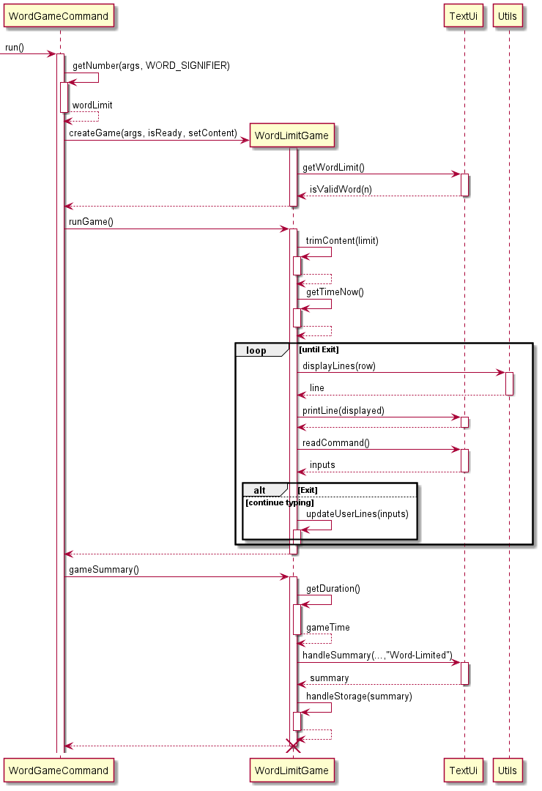
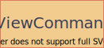
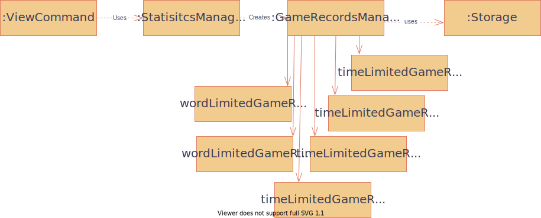
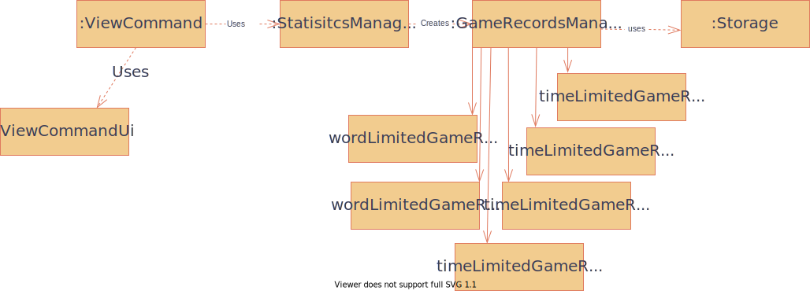
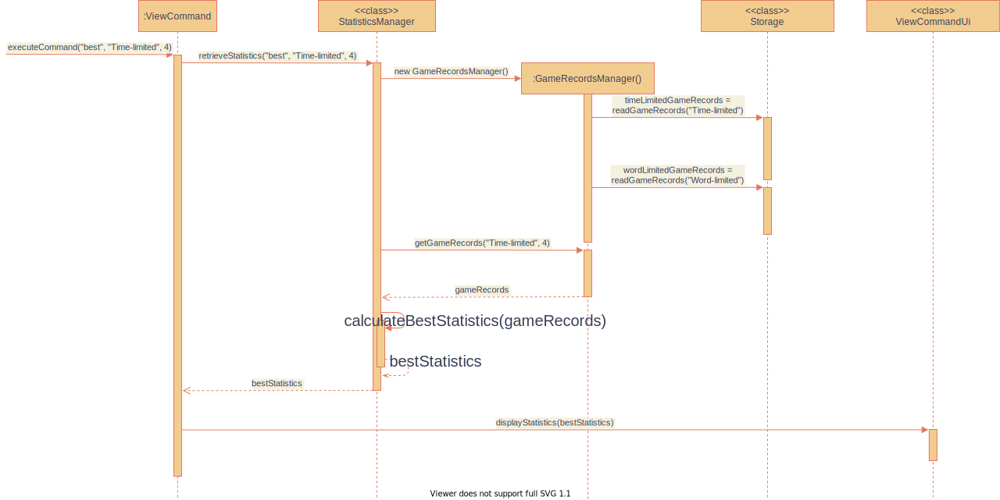

# Developer Guide
* Table of Contents
  {:toc}

* [Acknowledgements](#acknowledgements)
* [Setting Up, getting started](#setting-up-getting-started)
* [Design](#design)
  * [Architecture](#architecture)
* [Implementation](#implementation)
* [Product Scope](#product-scope)
* [User Stories](#user-stories)
* [Non-functional Requirements](#non-functional-requirements)
* [Glossary](#glossary)

## Acknowledgements

{list here sources of all reused/adapted ideas, code, documentation, 
and third-party libraries -- include links to the original source as well}
* https://www.baeldung.com/java-testing-system-out-println
* https://github.com/fastily/jwiki

## Setting Up, getting started
{Instruction to set up project in intellij}

## Design

> :bulb: **Tip:** The `.puml` files used to create diagrams in this document 
> can be found in the [diagrams](https://github.com/se-edu/addressbook-level3/tree/master/docs/diagrams/) folder. 

### Architecture
(Some architecture diagram)
The Architecture diagram above explains the high-level design of the Typists app.  
Given below is a quick overview of main components and how they interact with each other.

**Main Components of the architecture**
The `Main` class is the entry point of Typist. It is responsible for parsing and running various user's command.

The other core components of Typist:
* `ui`: The Ui of the app.
* `command`: Consists of `CommandFactory` which parses user inputs, and various `command` objects.
* `common`: A collection of classes used by multiple other components.
* `content`: holds the content and logic for `content` command
* `exception`: holds the 

## Implementation

{Describe the design and implementation of the product. Use UML diagrams and short code snippets where applicable.}

### Choose the game content

Once the game starts, the main class instantiates a Content object containing a string, which is set to a default 
value (lorem ipsum paragraph). The string can only be changed through the setContent() method.

Users can input the 'content' command to start the text selection.

There are 3 types:

    1. Opening paragraphs from famous books
    2. Custom Wikipedia article
    3. Random words

The following UML diagram illustrates the way content selection works in the program.

There only exists one private content string for all sessions. Each time a set method is called, the string is changed 
depending on the choices that the user made throughout the process. Whenever the user starts a game, the getContent() 
method is called and the text is set accordingly.

### Word Limit Game

Once the CommandFactory reads a 'word' command, a word limit game will begin.

Gonna to change this .puml diagram later - zhansen

### Time Limit Game
Sequence Diagram for Time Mode Game:

### \[Proposed\] View Statistics feature
#### \[Proposed Implementation\]
The top-level logic of view statistics feature resides in ViewCommand. It implements the Command
interface. The key method of the class is `executeCommand()`.  
`executeCommand()` logic:
1. Calls the retrieveStatistics() method of StatisticsManager to get the statistics.
2. Calls the displayStatistics() method of ViewCommandUi to display the statistics retrieved.
<!-- -->
StatisticsManager performs the logic for processing the game records to obtain the statistics.  
Its key methods are:  
* `retrieveStatistics()` - Decides which of the three methods below to run
* `calculateBestStatistics()` - Returns the best statistics over the past n games
* `calculateWorstStatistics()` - Returns the worst statistics over the past n games
* `calculateAverageStatistics()` - Returns the average statistics over the past n games
<!-- -->
Given below is an example usage scenario and how the program implements the feature.

Step 1: The user launches the application (scenario assumes that there are several game records already stored in the text files). 

Step 2: The user executes `view -m best -g time -n 4` to view his/her best statistics for the time-limited game mode over the past 4 games. 

Step 3: A ViewCommand object is then instantiated.  

Step 4. ViewCommand calls the retrieveStatistics() method of StatisticsManager.  

Step 5: StatisticsManager creates a GameRecordsManager object.
* The constructor of GameRecordsManager calls the readGameRecords() method of the Storage class to retrieve the gamer's past game records from the text files.
<!-- -->
  
Step 6. StatisticsManager then calls getGamesRecords() method of GameRecordsManager() and self-invokes calculateBestStatistics().
* Calculated statistics is returned.

Step 7. ViewCommand calls the displayStatistics() method of the ViewCommandUi class to display the statistics.

The following sequence diagram shows how the above scenario is executed.

#### Alternative Implementation
* One implementation considered is to do away with the retrieveStatistics() method and immediately call one of calculateBestStatistics,
calculateWorstStatistics() or calculateAverageStatistics() based on the gamer's imput using a switch statement. This implementation choice 
was not used because it violates the Single Responsibility Principle and does not do SLAP well.
* Another implementation considered was for GameRecordsManager to do the main logic. This implementation was not done as it violates the
Single Responsibility Principle.
<!-- -->

## Product scope
Our product is a typing game, intent to provide enjoyment for people who are familiar with the CML.

### Target user profile

{Describe the target user profile}

### Value proposition

{Describe the value proposition: what problem does it solve?}

## User Stories

|Version| As a ... | I want to ... | So that I can ...|
|--------|----------|---------------|------------------|
|v1.0|new user|see usage instructions|refer to them when I forget how to use the application|
|v1.0|user|customize the time limit to finish a game|train myself to type faster|
|v1.0|user|customize the word limit, in multiples of 100|have an optimal gaming experience by being able to choose my preferred length of text for the game|
|v1.0|user|choose text from famous books, randomly generated text or customized text for my game|make my gaming experience more fun and fulfilling|
|v1.0|typist|view my error rate|know on average, what my error rate is|
|v1.0|typist|see my word per minute after I've finished a game|know my typing speed|
|v2.0|gamer|view my past records|see how I have improved over time|
|v2.0|gamer|clear my past records|have a fresh start|
|v2.0|typist|see the words I typed wrongly after I've finished a game|know which words I have to practice more|

## Non-Functional Requirements

{Give non-functional requirements}
### Animation

## Glossary

* *glossary item* - Definition

## Instructions for manual testing

{Give instructions on how to do a manual product testing e.g., how to load sample data to be used for testing}

