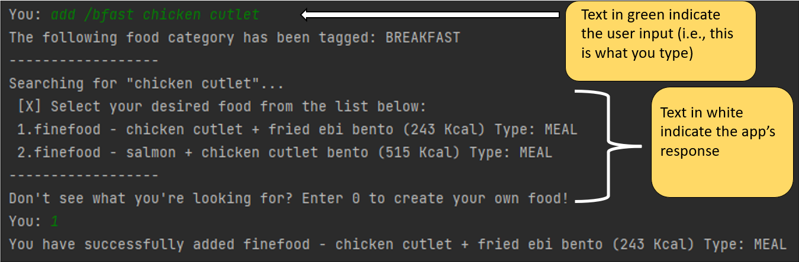

# Developer Guide

## Acknowledgements
Snippets of code from Baeldung’s guide to unit testing of system.out.println() with junit were used.

Source: https://www.baeldung.com/java-testing-system-out-println

Snippets of code from addressbook-level2’s Parser.java were used.

Source: https://github.com/se-edu/addressbook-level2/blob/master/src/seedu/addressbook/parser/Parser.java

## Design & implementation

{Describe the design and implementation of the product. Use UML diagrams and short code snippets where applicable.}
### Ui Component
Ui contains a Scanner object that takes in user inputs from the command line.
The Ui’s main role is to provide feedback whenever the user enters a command through the form of messages. It also 
handles the indexing of each element in the listing methods before printing out to the standard output for users to see.

### Data Saving Component
The saving and loading of data is handled by the `DataManager` class. Data will be saved and loaded from 
`StonksXD_Data.csv`, which is located in the same directory as the program. DataManager requires an instance of the 
`Parser`, `FinancialTracker` and `Ui` class to function. 

- When saving data into the csv file, `DataManager` uses Java's `FileWriter` and `BufferedWriter` class to 
interact with the csv file.
- When loading data from the csv file, `DataManager` uses Java's `FileInputStream` and `Scanner` to interact with 
the csv file. 

The image below illustrates the class diagram in the context of data saving and loading.

The image below illustrates the sequence diagram in the context of saving data into `StonksXD_Data.csv`.

-Work in progress-

The image below illustrates the sequence diagram in the context of loading data from `StonksXD_Data.csv` into the 
program.

-Work in progress-

## Product scope
### Target user profile

{Describe the target user profile}

### Value proposition

{Describe the value proposition: what problem does it solve?}

## User Stories

|Version| As a ... (role)| I want to ... (Function)| So that I can … (Benefit)|
|--------|----------|---------------|------------------|
|v1.0|New User|List out all possible commands|Know what I can key into the CLI interface|
|v1.0|User|Be able to record my spendings|Keep track of all my expenses|
|v1.0|User|View all expense entries|See which spending I can cut down on and better manage my finances|
|v1.0|User|Delete my expense entries|Delete wrong entries due to possible typos|
|v1.0|User|View total expense|See if I need to reduce my spending in the future|
|v1.0|User|Delete my income entries|Delete wrong entries due to possible typos|
|v1.0|Worker|Create income entries|Keep track of my total income and not spend more than that amount|
|v1.0|User|See all income entries|Have an understanding of income history|
|v1.0|User|View total income|Know what my spending limits are|
|v2.0|User|Have my entries saved into the hard disk automatically|My data would not be lost when I close the application|
|v2.0|User|Convert income / expense entries to different currencies|Do not have to manually convert currencies|
|v2.0|User|View my expenditure in the form of bar charts|Gain more useful insights on my overall financial situation|
|v2.0|Frugal spender|Set monthly budgets (overall budget and categorical budgets)|Plan my spending in advance|
|v2.0|Large spender|Receive reminders when I am about to overspend|Cut back on my spending|
|v2.0|Big spender|Get assistance readjusting my budget when I overspend|Can minimize the damage of spending too much|
|v2.0|Financially conscious user|Receive daily tips on saving, budgeting and spending|Can be more frugal and wiser with my financial decisions|
|v2.0|Long term user|See my account net balance|Can make appropriate plans / adjustments for the future|
|v2.0|User|Find expense / income entry with keyword search|Narrow down the entries I want to see|
|v2.0|User|See expenditure each month|Budget how much I need each month|
|v2.0|User|See income earned each month|Be more motivated to save|
|v2.0|User|Clear all my entries|Start afresh|

## Non-Functional Requirements

{Give non-functional requirements}

## Glossary

* *glossary item* - Definition

## Instructions for manual testing

{Give instructions on how to do a manual product testing e.g., how to load sample data to be used for testing}
