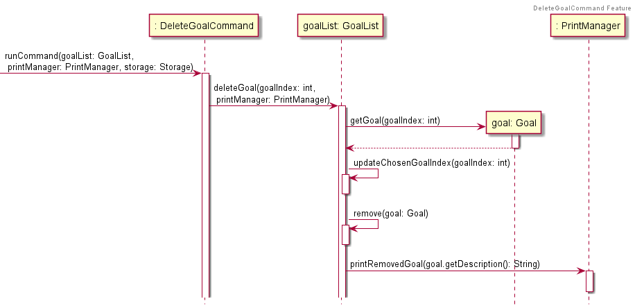
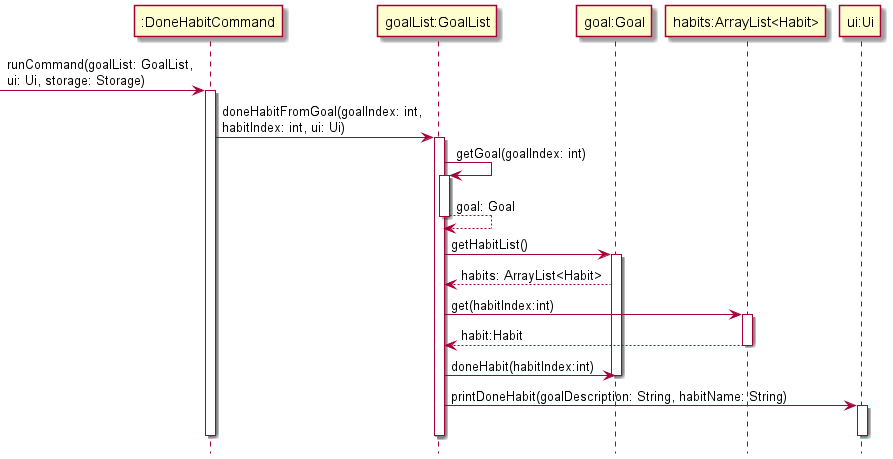
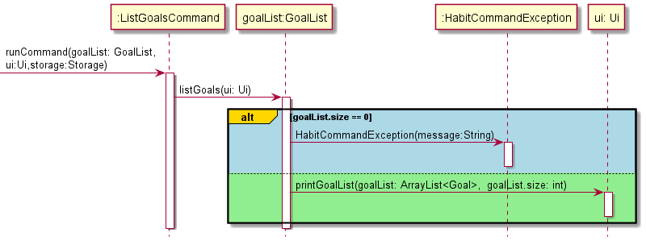
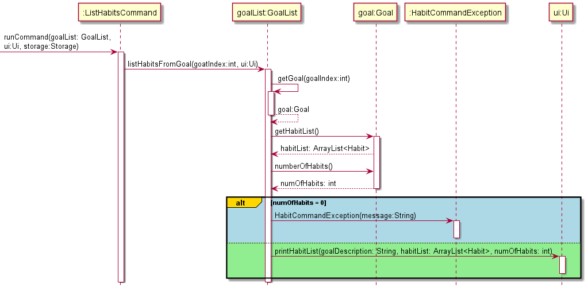

# Developer Guide

This document describes the architecture and software implementation of the application, _Ha(ppy)Bit_. The document is 
meant for developers who wish to gain insight into the design considerations and implementation of features, and 
possibly expand on the application.

* [Acknowledgements](#acknowledgements)
* [Design and Implementation](#3-design-and-implementation)
  * [Architecture](#31-overall-architecture)
  * [UI component](#32-ui-component)
  * [Command component](#command-component)
  * [Parser logic component](#parser-logic-component)
  * [GoalList component](#goallist-component)
  * [Storage component](#storage-component)
* [Appendix A: Product Scope](#appendix-a-product-scope)
  * [Target user profile](#target-user-profile)
  * [Value proposition](#value-proposition)
* [Appendix B: User Stories](#appendix-b-user-stories)
* [Appendix C: Non-Functional Requirements](#appendix-c-non-functional-requirements)
* [Appendix D: Glossary](#appendix-d-glossary)
* [Appendix E: Instructions for Manual Testing](#appendix-e-instructions-for-manual-testing)

---------------------------------------------------------------------------------------------------------

## Acknowledgements

This application reused some parts of the code from:
* Developer's name: Daren Tan (find his profile [here](AboutUs.md))
* Code source: CS2113T Individual Project
* Link to code: <https://github.com/DJ-Tan/ip.git>

This application referenced some parts of the code from:
* Developer team: find the team [here](https://se-education.org/addressbook-level3/AboutUs.html)
* Code source: AB-3
* Link to code: <https://github.com/se-edu/addressbook-level3.git>

This application adapted the Developer Guide and User Guide from:
* Developer team: find the team [here](https://se-education.org/addressbook-level3/AboutUs.html)
* Link to Developer Guide: <https://se-education.org/addressbook-level3/DeveloperGuide.html>
* Link to User Guide: <https://se-education.org/addressbook-level3/UserGuide.html#quick-start>

---------------------------------------------------------------------------------------------------------

## 1. Introduction

### 1.1. Overview of Ha(ppy)Bit

Ha(ppy)Bit is a desktop application aimed to empower students to achieve their goals—whether personal, academical, or 
health—amidst the hectic and stressful university life, through cultivating good habits. The application operates on a 
Command Line Interface (CLI) while still comprising features typically found in a Graphical User Interface (GUI). 
Students who type fast will find that Ha(ppy)Bit performs habit tracking more efficiently than your conventional GUI 
applications.

### 1.2. Terminology

Name     | Description                                                 | Example
-----    | ----------------------------------------------------------- | ---------------------
Goal     | A long term achievement you wish to accomplish.             |`Lose 5kg by Dec`
Habit    | Small, actionable tasks to be done to achieve goal.         |`Run 5km`
Interval | The frequency (in days) which you want the habit to recur.  |`Run 5km every 7 days`

One goal can have one or more habits.\
One habit can have one or more intervals.

### 1.3. Icons and Format

> 📃 **Notes**: important information you should take note off (especially if you encounter input errors)

> ⚠ **Warning**: avoid doing the things mentioned here at all costs (unless you're feeling lucky)

> 💡 **Pro-Tip!** additional information that may make your tracking journey easier

> 😀 &#8594; Used to show the developers' exuberance!!!

> 👍 &#8594; Used to show the developers' love and support for you.

## 2. Setting Up

### 2.1. Application Requirements

1. Ensure that you have installed Java SE Development Kit (JDK) 11 on your computer. If you do not have it installed, 
   you may download it from [here](https://docs.aws.amazon.com/corretto/latest/corretto-11-ug/downloads-list.html).
2. Recommended to use [IntelliJ IDEA](https://www.jetbrains.com/idea/download/).
3. Fork this [repository](https://github.com/AY2122S1-CS2113T-F14-1/tp), and clone the fork to your computer.

### 2.2. Project Set-Up

> ⚠ Follow the steps in the following guide exactly. Any deviations may result in the code failing to run as intended.

1. Start IntelliJ IDEA.
2. If you are currently on a project, close the project.
3. Navigate to `Plugins` and ensure that the Gradle plugin is enabled (Gradle is installed by default).
4. Open the project that was forked to your computer.
5. Set-up JDK 
   * Navigate to `File` > `Project Structure...` > `Project` 
   * Under `Project SDK`, add the JDK installed in Section 2.1.1
   * Under `Project Language Level`, choose `11 - Local variable syntax for lambda parameters`
6. Navigate to `Project` > `tp` > `src` > `main` > `happybit` > `HappyBit`
7. Locate the `main` method and click the green triangle on the left of it
8. If the code builds and runs with no issues, you are good.

## 3. Design and Implementation

### 3.1. Overall Architecture

The architecture diagram below describes the high-level design of the application.

The 5 main components of the architecture diagram are:
1. `Ui` : User interface of the application
2. `Parser` : Parses user inputs (checks if input is valid and logic is correct)
3. `Command` : Executes the user commands
4. `Goal` : Contains the data of all goals, habits and intervals, as well as the logic to update them
5. `Storage` : Facilitates transfer of data between the application and external storage files

The sequence diagram below shows how the components interact with each other for the scenario where the user issues the
command `remove g/1` to remove the goal at index 1.

### 3.2. UI component

**API:** `Ui.java`

How the `Ui` component works:
1. The `Ui` is called in 2 main classes - `GoalList` and `UiOverall`
2. For `GoalList`, functions that require printing of information will call `Ui`
   1. confirmation message of `addGoal()`
   2. confirmation message of `addHabitToGoal()`
   3. removed goal of `deleteGoal()`
   4. removed habit of `deleteHabitFromGoal()`
   5. confirmation message of `doneHabitFromGoal()`
   6. update message of `updateGoalName()`
   7. list of goals of `listGoals()`
   8. list of habits of `listHabitsFromGoal()`
3. For `UiOverall`, there is an inheritance of 2 classes - `UiStartup` and `UiMain`
   1. `UiStartup` handles the interface that provides a brief introduction to the application, and links to external 
      documentation.
   2. `UiMain` handles the interface for the main application.
4. The `Ui` is responsible for printing error messages raised by exceptions.

The Sequence Diagram below illustrates the interactions within the `Ui` component when `run()` is called in the main
class `HappyBit.java`

While the Sequence Diagram represents the normal flow of logic, there is a recursive definition that is not represented.
1. `:HappyBit` calls the method `handleState()` in `:State`
2. `handleState()` calls another method `mainState()` also in `:State`
3. `mainState()` will create a new `:UiMain` and calls a method `run()` on itself
4. `run()` returns a boolean value equivalent to whether the recursive call should be made
5. If the boolean value is true, `handleState()` would recursively call itself
6. If the boolean value is false, `handleState()` would pass the call back to `:HappyBit`

### Command component

When the user runs the Program, the main function dealing with the user's inputs is the `handleUserInput()` function
which obtains a `Command` object after parsing the input using the `Parser` component.

`Command` objects available are:
* `AddGoalCommand` - Adds a new Goal to the GoalList.
* `AddHabitCommand` - Adds a new Habit object to a specified Goal set by the user.
* `UpdateGoalNameCommand` - Updates the name of a Goal specified by the user.
* `DeleteGoalCommand` - Deletes a Goal from the GoalList
* `DeleteHabitCommand` - Deletes a Habit object from a specified Goal set by the user.
* `DoneHabitCommand` - Marks a Habit object under a Goal as done.
* `ListGoalCommand` - Lists out all the Goals set by the user.
* `ListHabitCommand` - Lists out all the Habits set under a Goal.
* `HelpCommand` - Prints out message indicating all the available Commands

The respective `runCommand` functions of the returned command object is then executed.
In the sections below we will be providing implementation details for each of the commands.

#### `AddGoalCommand`

When the `runCommand` function is executed for the `AddGoalCommand` object, the following steps as indicated by the
sequence diagram below is carried out:

#### `AddHabitCommand`

#### `UpdateGoalNameCommand`

#### `DeleteGoalCommand`

When the `runCommand` function is executed for the `DeleteGoalCommand` object, the following steps as indicated by the
sequence diagram below is carried out:

#### `DeleteHabitCommand`

When the `runCommand` function is executed for the `DeleteHabitCommand` object, the following steps as indicated by the
sequence diagram below is carried out:

#### `DoneHabitCommand`

When the `runCommand` function is executed for the `DoneHabitCommand` object, the following steps as indicated by the 
sequence diagram below is carried out:

#### `ListGoalCommand`

When the `runCommand` function is executed for the `ListGoalsCommand` object, the following steps as indicated by the
sequence diagram below is carried out:

#### `ListHabitCommand`

When the `runCommand` function is executed for the `ListHabitsCommand` object, the following steps as indicated by the
sequence diagram below is carried out:

#### `HelpCommand`

When the `runCommand` function is executed for the `HelpCommand` object, it instantiates a `PrintManager` object and 
calls the `printCommandList` method which prints out a pre-set message informing the user of all the inputs they
can type to execute a certain command.

### Parser logic component

The `Parser` logic component handles the parsing of the input passed in by the user and returns a suitable `Command` 
object that will be executed. Within the component itself, there are more specific and detailed `Parser` classes for 
handling various inputs from the user.

* `AddParser` - Handles the parsing of inputs starting with `set` and `add` keywords
* `DeleteParser` - Handles the parsing of inputs starting with `remove` and `delete`
* `DoneParser` - Handles the parsing of inputs starting with `done`
* `ListParser` - Handles the parsing of inputs starting with `view`
* `SetParser` - Handles the parsing of inputs starting with `goal`

For inputs of `bye`, `help` `list` their respective functions are run immediately without the need to parse further.

For any other invalid inputs that do not start with the listed keywords, the `HelpCommand` functionality is invoked.

### GoalList component

The `GoalList` component is the component that holds and manipulates the list of all the Goals set by the user.
All `runCommands` of all of the `Command` objects directly access the `GoalList` component to retrieve and change      
the user's data.

### Storage component

The `Storage` class allows data to be read from and saved to a storage file.
The class diagram shows the interactions between the different classes.

The sequence diagram shows how the program imports data from storage file.

The program uses `Storage` class to import data from the storage file.
* `Storage` interacts with `Import` to access the data stored in storage file.
* `Import` will depend on `ImportParser` to decipher the data stored, and return 
  a `Goal`, `Habit` or `Interval` object back to `Import` correspondingly.
* `Import` will then populate `GoalList` accordingly
  before returning `GoalList` back to `Storage` and back to user.

The sequence diagram shows how the program exports data to storage file.

`Storage` class can also export data to storage file with `Export` class.
It takes in a `GoalList` object and converts the data into string to be stored in storage file.

---------------------------------------------------------------------------------------------------------

## Appendix A: Product Scope

### Target user profile:
* wants to have a work-life balance but is often consumed by work/school
* have goals and aspirations but falls short of them; lacklustre commitment or game plan for action
* doesn't want to rely on smartphone (They're doing everything these days, sheesh!)
* prefers desktop app, 
* familiar and comfortable with CLI apps, or willing to learn to use

### Value proposition

Users with _Ha(ppy)Bit_ will find themselves cultivating good habits and breaking bad habits despite hectic 
workload or commitments. 

## Appendix B: User Stories

|Version| As a ... | I want to ... | So that I can ...|
|--------|----------|---------------|------------------|
|v1.0|new user|see usage instructions|refer to them when I forget how to use the application| 
|v1.0|user|set a new goal I wish to accomplish|start working towards completing the goal|
|v1.0|user|add habits i wish to carry out in the process of accomplishing my goal|break down the journey of achieving my goal into smaller manageable steps
|v1.0|user|remove a goal from my list of goals|remove goals that I no longer wish to work towards|
|v1.0|user|delete a habit added under a goal|remove a habit that I no longer wish to carry out|
|v1.0|user|mark a habit as done|indicate that I have completed that habit|
|v1.0|user|list out all the goals I have|remind myself of the goals I am working towards|
|v1.0|user|view all the habits I have set for each goal|check which habits I have yet to complete|
|v1.0|user|have import and export functionality in the program|access goals and habits previously set from a local data storage
|v2.0|user|have recurring habits at a regular interval|habitually carry out the habits I set for myself|
|v2.0|user|be able to view my progress for any goal|motivate myself in the process|
|v2.0|user|view all my habits due for the day upon entering the program|remember to carry out these habits by the end of the day|

## Appendix C: Non-Functional Requirements

|Non-Functional Requirements | Requirement Type |
| :---------- | :---: |
|App should be operable on Windows, macOS, and Ubuntu running Java `11` or above.|Technical|
|App can be learned anyone who is familiar with computer within minutes of use.|Quality|
|App should be a helpful, encouraging, and a joy to use.|Quality|
| |Performance|

## Appendix D: Glossary

* **Goal**: A long term achievement you wish to accomplish
* **Habit**: Checkpoints; actionable tasks to be done to achieve goal

## Appendix E: Instructions for Manual Testing

{Someone shall give instructions on how to do a manual product testing 
e.g., how to load sample data to be used for testing}
