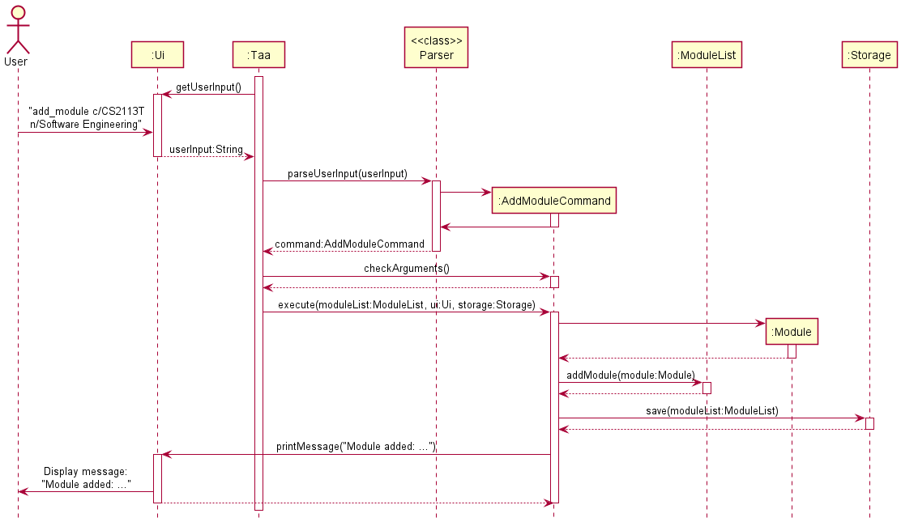

# Developer Guide
* [Acknowledgements](#acknowledgements)
* [Design](#design)
* [Implementation](#implementation)
  * [Add Module](#add-module)
  * [Add Student](#add-student)
  * [Add Assessment](#add-assessment)
  * [Set Marks](#set-marks)
  * [Set Attendance](#set-attendance)
* [Project scope](#product-scope)
* [User Stories](#user-stories)
* [Non-Functional Requirements](#non-functional-requirements)
* [Glossary](#glossary)

## Acknowledgements

{list here sources of all reused/adapted ideas, code, documentation, and third-party libraries -- include links to the original source as well}

## Design
### Architecture

The _Architecture Diagram_ shown above illustrates the high-level design of the Application.

**Overview of components**
* `Main`
  * On app launch: Creates and runs an instance of `Taa`.
* `UI`
  * Handles UI operations.
* `Taa`
  * On creation: Initializes the `UI` and `Storage` components.
  * On run: Loads persistent data from `Storage`, receives user input from `UI`, and uses `Parser` to parse the user input.
* `Parser`
  * Handles input parsing and determines which command to run.
* `Command`
  * Defines how a command is to be executed.
* `ModuleList`
  * Contains a list of `Module` objects currently being managed by the app.
* `Util`
  * Contains useful methods (e.g. Check if a string is integer/double, convert string to integer/double).
* `Storage`
  * Handles data storage operations (e.g. Reading from and writing to data file).

 

**Interaction between components**

The _Architecture Sequence Diagram_ shown above shows how the components usually interact with each other. 

## Implementation
### Add Module
The sequence diagram shown below illustrates how the `add_module` command works:

Steps:
1. The `Taa` instance reads in a user input through the `Ui.getUserInput()` method.
2. The user input is then parsed using the `Parser.parseUserInput(userInput:String)` static method and a `Command` object
is returned.
3. `AddModuleCommand.checkArguments()` is then called to check if the arguments are valid.
4. After checking the arguments, `Command.execute(moduleList:ModuleList, ui:Ui, storage:Storage)` will be called. A new
`Module` object is created and the `ModuleList.addModule(module:Module)` method is invoked to add the `Module`
object into the list of modules.
5. Lastly, a message indicating that the module has been added will be printed out.

 

### Add Student
The add student mechanism is facilitated by `AddStudentCommand`. It extends `Command` and uses `StudentList` which
stores student internally as an ArrayList `students`.
   

`AddStudentCommand` implements the following methods:
* `AddStudentCommand#execute(moduleList:ModuleList, ui:Ui, storage:Storage)` - Performs operations for the command.

`StudentList` implements the following methods:
* `StudentList#getSize()` - Returns the no. of students currently in the list.
* `StudentList#getStudents()` - Returns an ArrayList containing all the students.
* `StudentList#getStudentAt(index:int)` - Returns a student with the particular index.
* `StudentList#isValidIndex(index:int)` - Checks if an index is valid w.r.t the `students` ArrayList.
* `StudentList#addStudent(student:Student)` - Adds a student to the `students` ArrayList.
* `StudentList#deleteStudent(index:int)` - Deletes the `student` object at the specified `index` within the `students` 
ArrayList.
* `StudentList#findStudent(keyword:String)` - Returns an ArrayList of students containing the keyword

Below is an example scenario of how the add student feature behaves at each step: 
* Step 1 - The user executes `add_student c/CS2113T i/a0217978j n/jonny` to add a student. The `add_student` command 
calls the `AddStudentCommand#execute` method. Within `AddStudentCommand#execute`, `ModuleList#getModule("CS2113T")` is 
called to ensure that there is an existing module with code `CS2113T`.
* Step 2 - If an existing module with code `CS2113T` is found, a new `Student` object with id and name set to 
`a0217978j` and `jonny` respectively. Then, `StudentList#addModule` is called to add the newly created `Student` 
object into the `students` ArrayList within `StudentList`.

 

### Add Assessment
The add assessment mechanism is facilitated by `AddAssessmentCommand`. It extends `Command` and uses `AssessmentList`
which stores assessment internally as an ArrayList `assessments`. 

`AddAssessmentCommand` implements the following methods:
* `AddAssessmentCommand#execute(moduleList:ModuleList, ui:Ui, storage:Storage)` - Performs operations for the command.

`AssessmentList` implements the following methods:
* `AssessmentList#getSize()` - Returns the no. of assessments currently in the list.
* `AssessmentList#getAssessments()` - Returns an ArrayList containing all the assessments.
* `AssessmentList#getAssessment(assessmentName:String)` - Returns an assessment with a particular name specified by the
  user.
* `AssessmentList#addAssessment(assessment:Assessment)` - Adds an assessment to the `assessments` ArrayList.
* `AssessmentList#deleteAssessment(assessmentName:String)` - Deletes an assessment with the name specified by the user
  from the `assessments` ArrayList.

Below is an example scenario of how the add assessment feature behaves at each step:
* Step 1 - The user executes `add_assessment c/cs2113t n/midterms m/20 w/10` to add an assessment. The `add_assessment`
  command calls the `AddAssessmentCommand#execute` method. Within `AddAssessmentCommand#execute`,
  `ModuleList#getModuleWithCode("cs2113t")` is called to ensure that there is an existing module with code `cs2113t`.
* Step 2 - If an existing module with code `cs2113t` is found, the `MAXIMUM_MARKS` and `WEIGHTAGE` arguments are checked
  to ensure that they are valid.
* Step 3 - If the `MAXIMUM_MARKS` and `WEIGHTAGE` arguments are valid, a new `Assessment` object with name,
  maximum marks and weightage set to `midterms`, `20` and `10` respectively is created under the existing `Module` with
  code `cs2113t`. Then, `AssessmentList#addAssessment` is called to add the newly created `Assessment` object into the
  `assessments` ArrayList within `AssessmentList`.
* Step 4 - Within `AssessmentList#addAssessment`, the name of the newly created `Assessment` object is checked to ensure
  there is no existing assessment with name `midterms`. At the same time, the weightage of the newly created
  `Assessment` object is also checked to ensure that the total weightage of the assessments in the `cs2113t` module
  will not exceed 100 with the addition of the weightage of the newly created `Assessment` object.
* Step 5 - If the name and weightage of the newly created `Assessment` object are valid, the newly created `Assessment`
  object is added into the `assessments` ArrayList within `AssessmentList`.

 

### Set Marks
The set marks mechanism is facilitated by `SetMarksCommand`. It extends `Command` and uses a `results` HashMap to store
`assessmentName` and the `marks` for it as a key-value pair. 

`SetMarksCommand` implements the following methods:
* `SetMarksCommand#execute(moduleList:ModuleList, ui:Ui, storage:Storage)` - Checks input for errors before calling the
  `setMarks` command and saving the data.
* `SetMarksCommand#setMarks(ui:Ui, student:Student, assessmentName:String, marks:double)` - Puts a key-value pair with
  `assessmentName` as key and `marks` as the value into the `results` HashMap of `student`.

Below is an example scenario of how the set marks mechanism behaves at each step:
* Precursor Step - The user must have executed the commands to create `module`, `assessment`, and `student` entities.
  For purpose of this example, the user will have created `CS2113T` as the `module`, `Midterms` as the `assessment` with
  a maximum mark of `100`, and `Jim Ho` as the `student`.
* Step 1 - The user executes the `set_marks c/CS2113T s/1 a/Midterms m/50` command to set marks for student at index `1`
  for the `Midterms` assessment under the `CS2113T` module. The `set_marks` command calls the  `SetMarksCommand#execute`
  method. Within  `SetMarksCommand#execute`, `StudentList#getStudentAt("1")` is called to ensure that the student to be
  marked (in this case student at index `1`) exists.
* Step 2 - `AssessmentList#getAssessment(Midterms)` is then called to ensure that the `Midterms` assessment exists and
  that the student has yet to be marked for it.
* Step 3 - `Assessment#getMaximumMarks();` is then called to ensure that the marks to be given for the `Midterms`
  assessment do not exceed the maximum marks attributed to it.
* Step 4 - If the above steps do not output an error, the `SetMarksCommand#setMarks` command is then called, which in
  turn calls the `Student#setMarks` command to put the key-value pair into the `results` HashMap of the student at index
  `1`.

 

### Set Attendance
The set attendance mechanism is facilitated by SetAttendanceCommand. It extends `Command` and
uses  `AttendanceList` which stores a student's lessons attendance as an
ArrayList `attendances`.
 

`SetAttendanceCommand` implements the following methods:
* `SetAttendanceCommand#execute(moduleList:ModuleList, ui:Ui, storage:Storage)` - Performs operations for the command.

`AttendanceList` implements the following methods:
* `AttendanceList#getSize()` - Returns the no. of attendance currently in the list.
* `AttendanceList#getAttendances()` - Returns an ArrayList containing all the attendances.
* `AttendanceList#getAttendance(lessonNumber:String)` - Returns an attendance with a particular lesson number.
* `AttendanceList#isValidIndex(index:int)` - Checks if an index is valid w.r.t the `attendances` ArrayList.
* `AttendanceList#addAttendance(attendance:Attendance)` - Adds an attendance to the `attendances` ArrayList.
* `AttendnaceList#getAttendnaceIndex(lessonNumInput:String)` - Returns the attendance index in the `attendances` 
ArrayList.
* `AttendanceList#deleteAttendance(lessonNumInput:String)` - Deletes an attendance with a particular lesson number.
* `AttendanceList#sortAttendances` - Sorts the attendance in the `attendances` ArrayList in ascending order based on 
lesson number.

Below is an example scenario of how the set attendance feature behaves at each step:
* Step 1 - The user executes `set_attendance c/CS2113T s/1 l/1 p/1` to set an attendance to `Present` for student at 
index `1`, lesson number `1` to set a student's attendance for a lesson. The `set_attendance` command calls the 
`SetAttendanceCommand#execute` method. Within `SetAttendanceCommand#execute`, `AttendanceList#getAttendance("1")` is 
called to ensure that there is no existing attendance with the
lesson number `1`for student at index `1`.
* Step 2 - If no existing attendance object with lesson number `1` for student at index `1` is found, a new 
`Attendance` object
with lesson number `1` and attendance record `Present` is set as its lesson number and attendance record respectively.
Then, `AttendanceList#addAttendance` is called to add the newly created `Attendance` object into the `attendances` 
ArrayList within `AttendanceList`.

 

## Product scope
### Target user profile

* Teaching assistant who has a need to manage a significant number of students and their information.
* Prefers desktop app over other types of apps.
* Can type fast.
* Prefers typing to mouse interactions.
* Reasonably comfortable using CLI apps.

### Value proposition

* Manage student information faster than a typical mouse/GUI driven app.

## User Stories

|Version| As a ... | I want to ... | So that I can ...|
|--------|----------|---------------|------------------|
|v1.0|Teaching Assistant|Add module|Keep track of all the modules that I am teaching|
|v1.0|Teaching Assistant|Add student|Keep track of students taking the module|
|v1.0|Teaching Assistant|Add assessment|Monitor what assessments there are in the module|
|v1.0|Teaching Assistant|Set marks|Record how much marks students score for the assessment|
|v1.0|Teaching Assistant|Set attendance|Monitor the attendance of students|
|v1.0|Teaching Assistant|Calculate the average marks of an assessment|Estimate the capabilities of students|
|v2.0|Teaching Assistant|Edit module|Change module details (e.g. code and name)|
|v2.0|Teaching Assistant|Delete module|Remove unnecessary data and reduce clutter|
|v2.0|Teaching Assistant|Edit student|Change any student's information|
|v2.0|Teaching Assistant|Delete student|Remove students who are no longer part of the class|
|v2.0|Teaching Assistant|Edit assessment|Change the name or weightage of the assessment|
|v2.0|Teaching Assistant|Delete assessment|Remove a particular assessment from the module|
|v2.0|Teaching Assistant|Edit marks|Modify the marks of the student for a particular assessment|
|v2.0|Teaching Assistant|Delete marks|Remove the marks entry of a student for a particular assessment|
|v2.0|Teaching Assistant|Delete attendance|Remove the attendance entry of a student|

## Non-Functional Requirements
1. Should work on any mainstream OS as long as it has `Java 11` installed.
2. A user with above average typing speed for regular English text (i.e. not code, not system admin commands) should 
be able to accomplish most of the tasks faster using commands than using the mouse.

## Glossary
* Mainstream OS: Windows, Linux, Unix, OS-X
