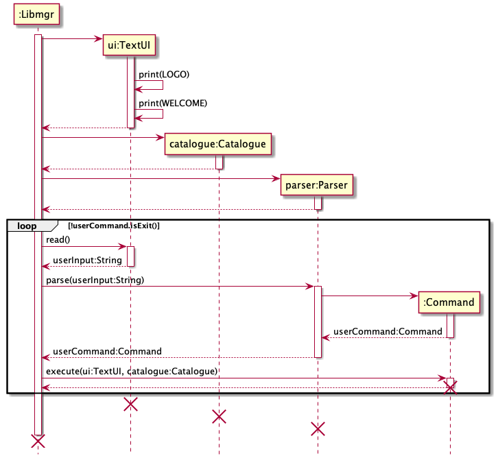
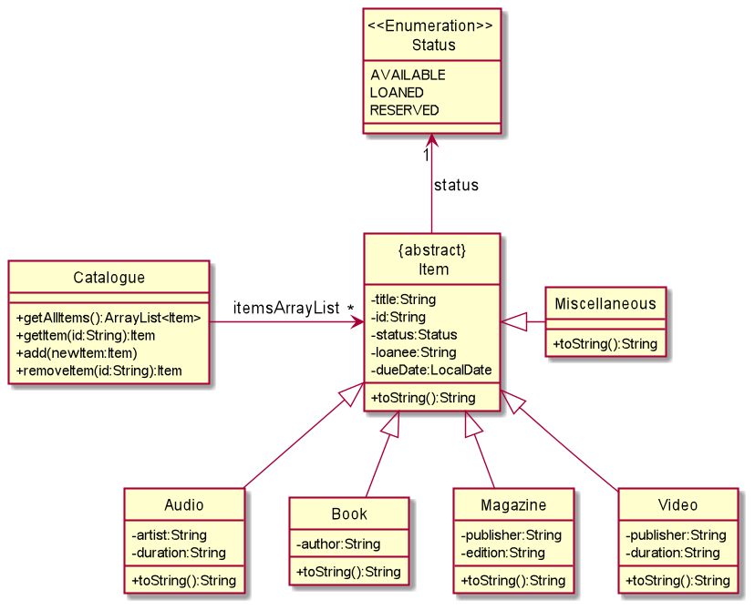
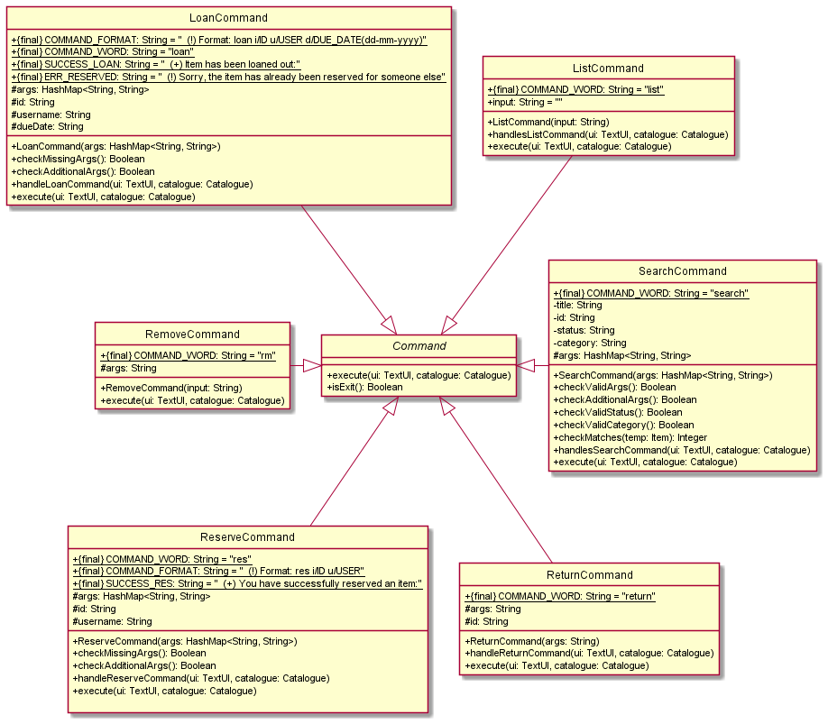
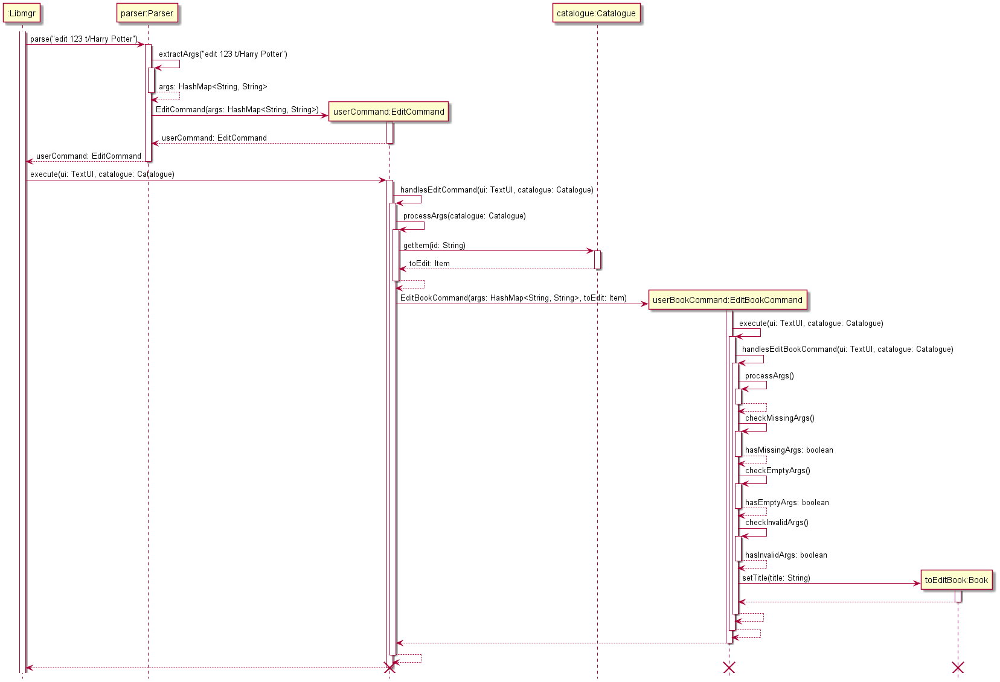
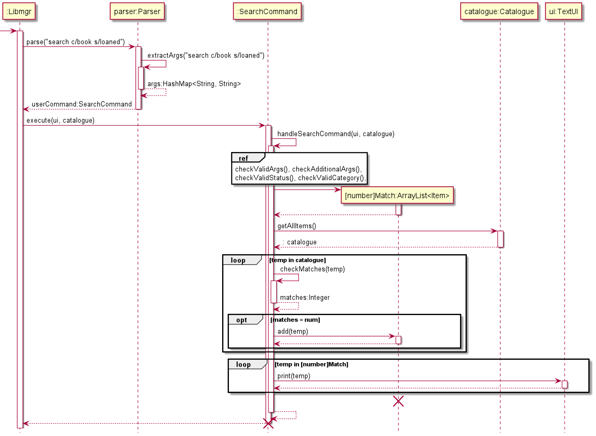

# Developer Guide

## Acknowledgements

{list here sources of all reused/adapted ideas, code, documentation, and third-party libraries -- include links to the original source as well}

## Setting up the project in your computer

## Design & implementation

This section provides an overview of the design architecture and implementation of Libmgr. 
Each sub-section provides a detailed explanation of the architecture and design of each component.

### Architecture

Libmgr is a Command-Line-Interface (CLI) application that is designed for librarians to manage library inventory efficiently. 
Its main architecture consists of a few components:
- ui: Contains TextUI, the class which manages the UI of the app 
- data: Contains the library catalogue and various item classes that hold the data of the app 
- commands: Contains various command classes and a Parser class that handles the execution of user commands
- common: Contains a collection of classes used by multiple other components, such as exceptions and messages
- storage: Reads data from, and writes data to the hard disk

#### Entrypoint of Libmgr

The sequence diagram below shows an overview how the components and classes interact with each other in the application.

When the app is launched, the `ui` component is first invoked to print a logo and welcome message to the user. 
Subsequently, the `data` component (Catalogue class) is invoked to manage and add items to the library inventory. 
The `commands` component (Parser class) is then invoked to process the commands given by the user, 
which is read in by the `ui` component. The individual command classes are then invoked to execute the respective command.

---
### UI Component

_todo_

### Data Component

The data component consists of a `data` package which holds classes that aim to allow the categorisation of items into different types.

### Commands component

The commands component consists of a `commands` package. Inside the package are the following classes: 
1. A main `Parser` class to process all the commands 
2. Individual Command classes, each corresponding to a specific command 
   1. `AddAudioCommand`
   2. `AddBookCommand`
   3. `AddCommand`
   4. `AddMagazineCommand`
   5. `AddVideoCommand`
   6. `DeadlineCommand`
   7. `EditCommand`
   8. `ExitCommand`
   9. `ListCommand`
   10. `LoanCommand`
   11. `RemoveCommand`
   12. `ReserveCommand`
   13. `ReturnCommand`
   14. `SearchCommand`
   15. `UnknownCommand`
   16. `UnreserveCommand`

The individual Command classes inherit from an abstract `Command` class.

#### Edit Command

The Edit Command class handles the functionality to change a specific detail of an item in the catalogue.

#### Search Command 

### Common component
Classes used by multiple components are located in the `common` package. 
For example, the `LibmgrException` class which is the main exception class for the app. 

---
## Product scope
### Target user profile

Library staff who prefer keyboard inputs and require a text based application to quickly track and update 
the details of library items within their catalogue.

### Value proposition

This product aims to streamline the process of managing the book catalogues within their library. 
It will allow library staff to track their items, such as finding out their status, as well as update their 
catalogue quickly. Designed for fast typists, it also allows staff to track, update and manage their 
inventory more efficiently.

## User Stories

|Version| As a ... | I want to ... | So that I can ...|
|--------|----------|---------------|------------------|
|v1.0|librarian|add items to the catalogue|keep the full catalogue up to date|
|v1.0|librarian|remove items from the catalogue|keep the full catalogue up to date|
|v1.0|librarian|update the status of an item when it is loaned out|keep the full catalogue up to date|
|v1.0|librarian|update the status of an item when it is returned|keep the full catalogue up to date|
|v1.0|librarian|check the list of items available in the library||
|v1.0|librarian|check the list of items on loan||
|v1.0|librarian|check the list of all items in the library||
|v2.0|librarian|categorise different items into media forms. (E.g. book, magazine, audio, video)|better manage my catalogue
|v2.0|librarian|edit the details of existing items on the catalogue|keep the full catalogue up to date||
|v2.0|librarian|reserve and unreserve an item by updating its status|keep the full catalogue up to date||
|v2.0|librarian|search for specific items by their title or ID|retrieve the details of items I need||
|v2.0|librarian|check the list of items on reservation||
|v2.0|librarian|loan an item for a person specified by their username||
|v2.0|librarian|reserve an item for a person specified by their username||
|v2.0|librarian|view what items are due to be returned today|| 
|v2.0|librarian|view the list of overdue items|inform people to return them|| 

## Non-Functional Requirements

1. Should work on Windows, macOSX and Linux as long as it has Java 11 or above installed.
2. A user with above average typing speed for regular English text (i.e. not code, not system admin commands) should be able to accomplish most of the tasks faster using commands than using the mouse.

## Glossary

* *glossary item* - Definition

## Instructions for manual testing

{Give instructions on how to do a manual product testing e.g., how to load sample data to be used for testing}
