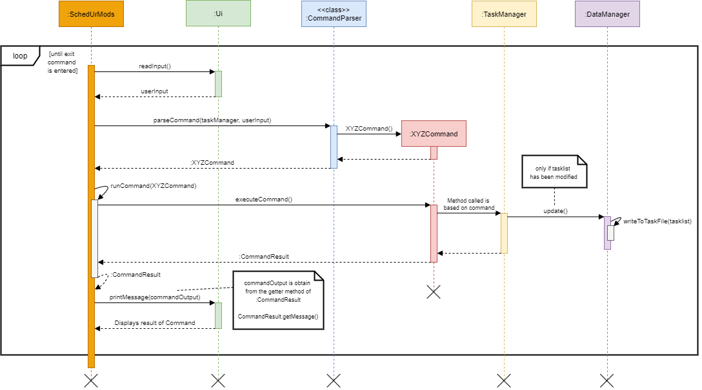

# SchedUrMods Developer Guide

- [1. Introduction](#1-introduction)
  - [1.1 Purpose](#11-purpose)
  - [1.2 Acknowledgments](#12-acknowledgements)
- [2. Setting up, getting started](#2-setting-up-getting-started)
  - [2.1 Pre-requisites](#21-pre-requisites)
  - [2.2 Download the project on your computer](#22-download-the-project-on-your-computer)
  - [2.3 Setting up the project in IntelliJ](#23-setting-up-the-project-in-intellij)
- [3. Design](#3-design)
  - [3.1 Architecture](#31-architecture)
  - [3.2 UI Component](#32-ui-component)
  - [3.3 Parser Component](#33-parser-component)
  - [3.4 Command Component](#34-command-component)
  - [3.5 TaskManager Component](#35-taskmanager-component)
  - [3.5 Storage Component](#36-storage-component)
  - [3.6 Utility Component](#37-utility-component)
  - [3.7 Logger Component](#38-logger-component)
  - [3.8 NUSMods API Component](#39-nusmods-api-component)
- [4. Implementation](#4-implementation)
  - [4.1 Adding Tasks](#41-adding-tasks)
  - [4.2 Filtering the tasklist](#42-filtering-the-tasklist)
  - [4.3 Sorting the tasklist](#43-sorting-the-tasklist)
- [5. Appendix: Requirements](#5-appendix-requirements)
  - [5.1 Product scope](#51-product-scope)
  - [5.2 User stories](#52-user-stories)
  - [5.3 Use cases](#53-use-cases)
  - [5.4 Non-Functional Requirements](#54-non-functional-requirements)
  - [5.5 Glossary](#55-glossary)
- [6. Appendix: Instructions for manual testing](#6-appendix-instructions-for-manual-testing)
  
# 1. Introduction
**SchedUrMods** is a desktop application for NUS students who wish to manage 
their assignments and semester-related information via CLI (command-line interface).

**SchedUrMods** is written in `Java 11` and utilises the **Object-Oriented Programming (OOP)** 
paradigm to provide the following benefits during the development of the application. 

- Modularity for easier troubleshooting
- Reuse of code through inheritance 
- Flexibility through polymorphism

## 1.1 Purpose
This developer guide is intended for software developers, designers, or testers who wish
to contribute to the development of the **SchedUrMods** application. 

The guide provides an overall architectural view of **SchedUrMods** and describes the 
implementation of key features of the application that is supplemented with easy to understand
UML diagrams.

## 1.2 Acknowledgements
This section provides a list 3rd-party libraries adapted in the development of **SchedUrMods**.

1. [iCal4J](http://ical4j.github.io/)
2. [Gson](https://github.com/google/gson)
3. [Apache Commons IO](https://commons.apache.org/proper/commons-io/)
4. [Checkstyle](https://checkstyle.sourceforge.io/)
5. [JUnit](https://junit.org)

# 2. Setting up, getting started
This section provides instructions on how to set up the development environment of the **SchedUrMods** application.

## 2.1 Pre-requisites
Please ensure that you have the following software installed, prior to setting up the project:

1. IDE: [`IntelliJ IDEA`](https://www.jetbrains.com/idea/download/)
   1. Development platform used for the development for the application.
2. JDK: [`Java 11`](https://docs.aws.amazon.com/corretto/latest/corretto-11-ug/downloads-list.html)
   1. Programming language the application is written in.
3. Revision Control: [`SourceTree`](https://www.sourcetreeapp.com/)
   1. Version control software used by development team.

## 2.2 Download the project on your computer
Please follow the following steps below to download the project file on your computer:

1. Click [here](https://github.com/AY2122S1-CS2113T-W13-3/tp) to access the Github repository of the **SchedUrMods** application. 
2. **Fork** and **Clone** the repository using `SourceTree`.

## 2.3 Setting up the project in IntelliJ
Please follow the following steps below to set up the project in `IntelliJ`:

1. Launch `IntelliJ` application.
   1. On the toolbar, click on `file` and then `Open...`.
   2. Find and select the project folder that was previously downloaded.
2. Configure the **Project SDK** to use `Java 11`
   1. On the toolbar, click on `file` and then `Project Structure...`
   2. Select `Project`
      1. Configure `Project SDK:` to use `Java 11`.
      2. Configure `Project language level:` to use `SDK default`.
3. Verify the setup:
   1. After completing steps **1** and **2**, right-click on the following java class 
   `\src\main\java\seedu\SchedUrMods.java` and select `Run SchedUrMods.main()`
   2. Assuming the project is set up correctly, you should see the following display in the terminal:
   
```
 _____        _                _  _   _       ___  ___            _
/  ___|      | |              | || | | |      |  \/  |           | |
\ `--.   ___ | |__    ___   __| || | | | _ __ | .  . |  ___    __| | ___
 `--. \ / __|| '_ \  / _ \ / _` || | | || '__|| |\/| | / _ \  / _` |/ __|
/\__/ /| (__ | | | ||  __/| (_| || |_| || |   | |  | || (_) || (_| |\__ \
\____/  \___||_| |_| \___| \__,_| \___/ |_|   \_|  |_/ \___/  \__,_||___/
-------------------------------------------------------------------------
Command-Line Interface for NUSMODS                               (v2.1.0)
-------------------------------------------------------------------------
[user]:
```
      
# 3. Design
## 3.1 Architecture
<p align="center">
    
</p>

The Architecture Diagram above shows the high-level design of **SchedUrMods** 
and how **SchedUrMods** main components are connected.

**Main components of the architecture**

`SchedUrMods` contains the main method of the application. It is responsible for,
- **At app launch**: Initializes the components in the correct sequence, and connects them up with each other.
- **While app is running**: Reads user input and outputs the appropriate command result.
- **At shut down**: Shuts down the components and invokes cleanup methods where necessary.

The rest of the App consists of five main components.
- `UI`: Handles user input and displaying of messages on the terminal.
- `Parser`: Interpret user input and decides which `Command` is to be executed.
- `Command`: Collection of user command classes + Handles command execution
- `Storage`: Reads data from, and writes data to, the hard disk.
- `Utility`: Collection of classes used by multiple other components.
- `Logger`: Handles the logging throughout all classes
- `NUSMods API`: Communicate with NUSMods server to pull module related information.

**How the architecture components interact with each other**

The **Sequence Diagram** below shows how the components interact with each other for the 
scenario where the **user inputs any valid command** in to the application.

<p align="center">
    
</p>

## 3.2 UI Component

## 3.3 Parser Component

## 3.4 Command Component

## 3.5 TaskManager Component

## 3.6 Storage Component

## 3.7 Utility Component

## 3.8 Logger Component

## 3.9 NUSMods API Component


# 4. Implementation

## 4.1 Adding Tasks
Tasks are managed by the `TaskManager` class and are all stored in memory using a `private static ArrayList<Task>`.
The TaskManager provides functionality such as:
* listing the tasks `listTaskList(HashMap<String, String> filter)`.
* getting the taskList size `getTaskListSize()`.
* checking whether the list is empty `isEmpty()`.
* and adding Tasks `addTask()`.

The Class diagrams for the different Tasks:  
  

Fixed values such as priority and recurrence are stored as an enum to ensure standardisation and that there are no invalid values being stored. The TaskTypes are also stored as an enum so that we can easily get the taskType when we have the task (and by extension the name of the task) for anything to do with parsing.  
  

The creation of tasks with the td, deadline r event cmmands are done using their respecive Task Factories  
  
The sequence diagram above shows the creation of a Todo Task using TodoFactory.
1. It checks if it has the required arguments and then throws an exception for any required argument that does not exist e.g. description.
1. After that it parses the dates, priority and recurrence arguments into the appropriate objects that are stored in the Task object
1. Finally, it calls getConstructor() with the parameters. getConstructor()'s logic will find and call the appropriate Task constructor and return the Task created.  

The same logical structure is used in the Deadline and Event factories.  

## 4.2 Filtering the tasklist

## 4.3 Sorting the tasklist

# 5. Appendix: Requirements

## 5.1 Product scope
**Target User Profile**

The target user profile of **SchedUrMods** are NUS students from all faculties.

**Needs of Target Users**

- Prefer CLI interface as opposed to GUI interface.
- Needs a quick way to manage their homework and assignments.
- Needs a quick way to launch lesson zoom links.
- Needs a quick way to view semester timetable.

## 5.2 User stories
**Priorities**: High (must have) - `* * *`, Medium (nice to have) - `* *`, Low (unlikely to have) - `*`

| Priority | As a ... | I want to ... | So that I can ...|
|----------|----------|---------------|------------------|
|v1.0|new user|see usage instructions|refer to them when I forget how to use the application|
|v2.0|user|find a to-do item by name|locate a to-do without having to go through the entire list|

## 5.3 Use cases
{Describe the use cases}

## 5.4 Non-Functional Requirements

1. Should work on any mainstream OS as long as it has Java 11 or above installed.
2. A user with above average typing speed for regular English text (i.e. not code, not system admin commands) 
should be able to accomplish most of the tasks faster using commands than using the mouse.

## 5.5 Glossary

* *Mainstream OS* - Windows, Linux, Unix, OS-X

# 6. Appendix: Instructions for manual testing

{Give instructions on how to do a manual product testing e.g., how to load sample data to be used for testing}
