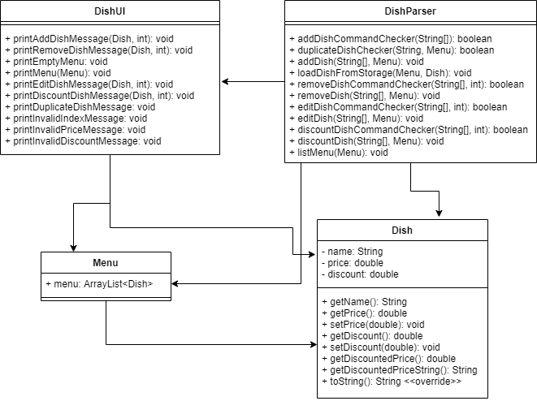
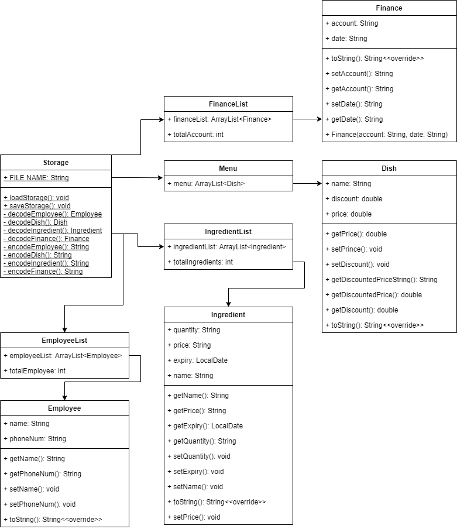
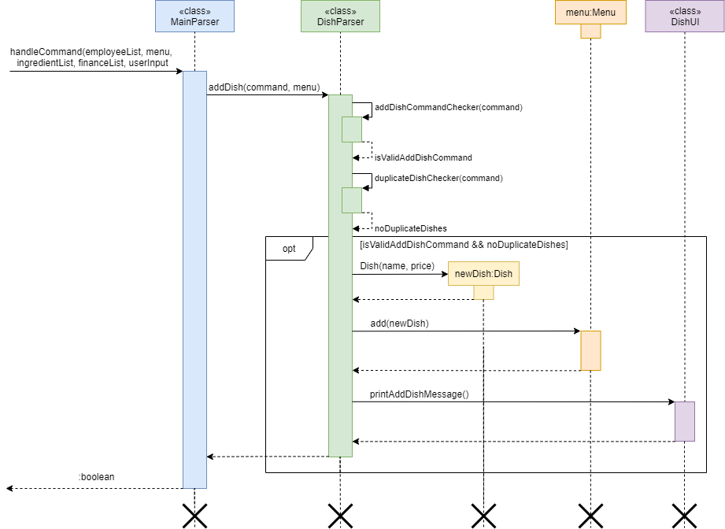
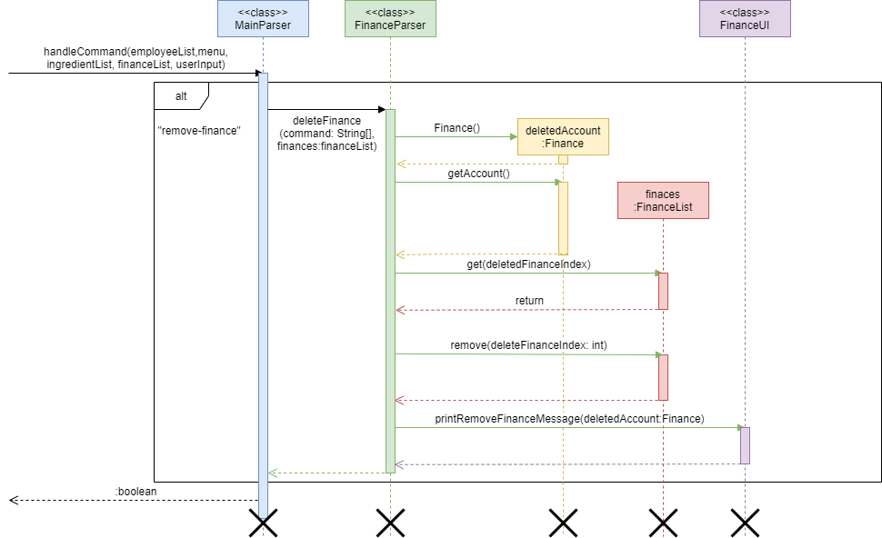
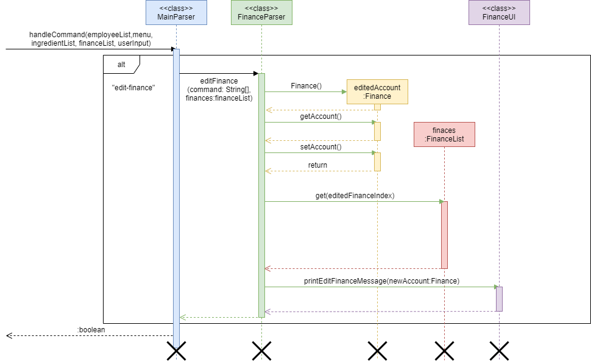

# Developer Guide Draft

## Introduction
Restaurant Buddy is a command-line-interface (CLI) application for **restaurant managers** to 
help **keep track of restaurant data** such as its employees, dishes and ingredients in storage.

## Purpose
?

## How to use
?

## Contents
1. [Design](#1-design)
   1. [Architecture](#11-architecture)
   2. [Employee Component](#12-employee-component)
   3. [Dish Component](#13-dish-component)
   4. [Ingredient Component](#14-ingredient-component)
   6. [Storage Component](#16-storage-component)
2. [Implementation](#2-implementation)
   1. Employee
      1. [Add Employee](#2ia-add-employee)
      2. [Remove Employee](#2ib-remove-employee)
      3. [List Employees](#2ic-list-employees)
   2. Dish
      1. [Add Dish](#2iia-add-dishes)
      2. [Remove Dish](#2iib-remove-dish)
      3. [Edit Dish](#2iic-edit-dish)
      4. [Discount Dish](#2iid-discount-dish)
      5. [List Dishes](#2iie-list-dishes)
   3. Ingredient
      1. [Add Ingredient](#2iiia-add-ingredient)
      2. [Remove Ingredient](#2iiib-remove-ingredient)
      3. [Find Expired Ingredients](#2iiic-find-expired-ingredients)
      4. [List Ingredients](#2iiid-list-ingredients)
   4. Finance
      1. [Add Finance](#2iva-add-finance)
      2. [Remove Finance](#2ivb-remove-finance)
      3. [Edit Finance](#2ivc-edit-finance)
      4. [Show Finance](#2ivd-show-finance-feature)
      5. [List Finances](#2ive-list-finances)
   5. Storage
      1. [Save Storage](#2va-save-storage)
      2. [Load Storage](#2vb-load-storage)
3. [Appendix](#3-appendix)
   1. [Product Scope](#3i-product-scope)
   2. [User Stories](#3ii-user-stories)
   3. [Non Functional Requirements](#3iii-non-functional-requirements)
   4. [Glossary](#3iv-glossary)
   5. [Instructions for Manual Testing](#3v-instructions-for-manual-testing)

## 1. Design

### 1.1 Architecture
The Main component has 2 classes, `MainParser` and `MainUI`. It is responsible for parsing user commands and 
displaying messages to interact with the user.

The rest of the app consists of 4 components:
1. Employee: Modify data related to employee classes
2. Dish: Modify data related to dish classes
3. Ingredient: Modify data related to ingredient classes
4. Storage: Reads and writes data to and from the hard disk

### 1.2 Employee Component
The employee component consists of the following four classes: `Employee`, `EmployeeList`, `EmployeeParser` 
and `EmployeeUI`.

* `Employee` stores the name and phone number of an individual employee working at the restaurant, as well as methods 
to retrieve employee information.
* `EmployeeList` is an array list of Employees.
* `EmployeeParser` contains operations that decode user inputs into meaningful commands, and modifies the list of 
employees accordingly.
* `EmployeeUI` contains methods that display messages that interacts with the user.

### 1.3 Dish Component

The dish component consists of the `Dish`, `Menu`, `DishParser`, and `DishUI` classes.

* `Dish` stores the name, price and discount of a certain dish sold by the restaurant and the methods used to retrieve
  them.
* `Menu` is an array list of Dish.
* `DishParser` contains methods that parses user inputs into meaningful parameters and modify the menu accordingly.
* `DishUI` contains methods that display messages to interact with the user.

### 1.4 Ingredient Component
The ingredient component consists of the `Ingredient`, `IngredientList`, `IngredientParser`, and `IngredientUI` classes.  

* `Ingredient` stores the name and quantity of a particular ingredient used by the restaurant, as well as methods to 
retrieve ingredient data.
* `IngredientList` is an array list of Ingredient.
* `IngredientParser` contains operations that decode user inputs into meaningful commands, and modifies the list of 
ingredients accordingly.
* `IngredientUI` contains methods that display messages to interact with the user.  

### 1.5 Finance Component
The Finance component consists of the `Finance`, `FinanceList`, `FinanceParser`, `FinanceUI` classes. 

* `Finance` stores the date, account of a certain days earn and methods to retrieve them.
* `FinanceList` is the arrayList of Finance.
* `FinanceParser` contains methods that decode user inputs to meaningful parameters and modify the finance accordingly.
* `FinanceUI` contains methods that display messages to interact with the user.

### 1.6 Storage Component

The storage component has a `Storage` class which can load data from the file and save data into the file with the 
methods to encode and decode data.  

## 2. Implementation  

### 2.i.a Add Employee
The mechanism of adding an employee into the list of employees is facilitated by `EmployeeParser`. It first creates a 
new instance of `Employee`, and adds it to the existing instance of `EmployeeList`. A confirmation message is then 
displayed to the user.

### 2.i.b Remove Employee
The mechanism of removing an employee from the employee list is facilitated by `EmployeeParser`. It identifies the
index of the employee to be removed from the current instance of `EmployeeList`, and removes that instance of
`Employee` from the list. It then displays a message to the user to inform them of the successful deletion.

### 2.i.c List Employees
The mechanism for listing all current employees in the list of employees is facilitated by `EmployeeParser`. It checks 
if the current instance of `EmployeeList` is empty, and if it is, displays a message to inform the user that the 
employee list is empty. Otherwise, it displays all employees and their information in the list to the user.

### 2.ii.a Add Dishes
The `add-dish` feature is designed to allow users to add dishes to their menu for keeping track of. The details of the 
dishes stored include the dish name, price and discount. The following depicts the procedure for when a dish is added:
  1. User executes the `add-dish` command by typing `add-dish/DISH_NAME/DISH_PRICE`.
  2. This invokes the `MainParser` class which then calls for the `addDish` function in the `DishParser` class.
  3. Next, `addDish` calls for the functions `addDishCommandChecker` and `duplicateDishChecker` in the same class to 
     ensure that the user's input is valid.
  4. If it is valid, `addDish` creates a new instance of `Dish` and adds it to the `menu` in the `Menu` class.
  5. Lastly, `printAddDishMessage` in the `DishUI` class is called to display a confirmation message to the user.

This is also illustrated in the sequence diagram below.

### 2.ii.b Remove Dish
The `remove-dish` feature is designed to allow users to remove dishes from their menu that are no longer needed. The 
following depicts the procedure for when a dish is removed:
   1. User executes the `remove-dish` command by typing `remove-dish/DISH_INDEX`. 
   2. This invokes the `MainParser` class which then calls for the `removeDish` function in the `DishParser` class.
   3. Next, `removeDish` calls for the functions `removeDishCommandChecker` in the same class to ensure that the 
      user's input is valid.
   4. If it is valid, `removeDish` removes the instance of `Dish` at `DISH_INDEX` from the `menu` in the `Menu` class.
   5. Lastly, `printRemoveDishMessage` in the `DishUI` class is called to display a confirmation message to the user.

This is also illustrated in the sequence diagram below.

### 2.ii.c Edit Dish
The `edit-dish` feature is designed to allow users to edit the prices of the dishes in their menu. The following 
depicts the procedure for when a dish's price is edited:
   1. User executes the `edit-dish` command by typing `edit-dish/DISH_INDEX/NEW_PRICE`. 
   2. This invokes the `MainParser` class which then calls for the `editDish` function in the `DishParser` class.
   3. Next, `editDish` calls for the functions `editDishCommandChecker` in the same class to ensure that the
      user's input is valid.
   4. If it is valid, `editDish` calls for the `setPrice` function in the `Dish` class to set the price of the
      instance of `Dish` at `DISH_INDEX` to `NEW_PRICE`.
   5. Lastly, `printEditDishMessage` in the `DishUI` class is called to display a confirmation message to the user.

This is also illustrated in the sequence diagram below.

### 2.ii.d Discount Dish
The `discount-dish` feature is designed to allow users to add discounts to the dishes in their menu. The following
depicts the procedure for when a discount is added to a dish:
1. User executes the `discount-dish` command by typing `discount-dish/DISH_INDEX/DISCOUNT`.
2. This invokes the `MainParser` class which then calls for the `discountDish` function in the `DishParser` class.
3. Next, `discountDish` calls for the functions `discountDishCommandChecker` in the same class to ensure that the
   user's input is valid.
4. If it is valid, `discountDish` calls for the `setDiscount` function in the `Dish` class to set the discount of the
   instance of `Dish` at `DISH_INDEX` to `DISCOUNT`.
5. Lastly, `printDiscountDishMessage` in the `DishUI` class is called to display a confirmation message to the user.

This is also illustrated in the sequence diagram below.

### 2.ii.e List Dishes
The `list-dish` feature is designed to allow users view all the dishes in their menu. The prices of each dish are also
displayed. The following depicts the procedure for when a dish's price is edited:
1. User executes the `list-dish` command by typing `list-dish`.
2. This invokes the `MainParser` class which then calls for the `listDish` function in the `DishParser` class.
3. Next, `listDish` calls for either the function `printMenu` or the function `printEmptyMenu` in the `DishUI` class 
   depending on whether the user's menu is empty.
4. `printMenu` displays all the dishes in the menu while `printEmptyMenu` displays an empty menu.

### 2.iii.a Add Ingredient
The mechanism of adding an ingredient into the ingredient list is facilitated by `IngredientParser`. It creates a new
instance of `Ingredient`, and adds it to the existing instance of `IngredientList`. It then calls a method from
`IngredientUI` to display a confirmation message to the user.

### 2.iii.b Remove Ingredient
The mechanism of removing an ingredient from the ingredient list is facilitated by `IngredientParser`. It identifies
the index of the ingredient to be removed from the existing instance of `IngredientList` and removes that instance of
`Ingredient` from the list. It then calls a method from `IngredientUI` which displays to the user that the deletion was
successful.

### 2.iii.c Find Expired Ingredients
The mechanism of finding expired ingredients is facilitated by `IngredientParser` as well as the Java `LocalDate`
class. `IngredientParser` converts the input String into a `LocalDate` object and calls a method from `IngredientUI`.
This method loops through the current `IngredientList` and finds all instances of `Ingredient` with an expiry date
before the input `LocalDate` object. It then displays to the user the list of ingredients that are expired, or informs
the user that no ingredients are expired.

### 2.iii.d List Ingredients
The mechanism for listing all existing ingredients in the ingredient list is facilitated by `IngredientParser`. It
checks if the existing instance of `IngredientList` is empty or not, and calls a method from `IngredientUI` to
display the entire list of ingredients and their quantities to the user.

### 2.iv.a Add Finance
The mechanism of adding an account into the financeList is facilitated by `FinanceParser`. It is firstly identified 
by mainParser to handle add finance command. Then, it creates new `Finance` object with user command. Next, it will add
the Finance object to the FinanceList and add the account number to the totalAccount. Lastly, it will call 
printAddFinanceMessage() of FinanceUI to show the result.

### 2.iv.b Remove Finance
The mechanism of removing an account from the financeList is facilitated by `FinanceParser`. It is firstly identified 
by mainParser to handle remove finance command. Then, it generates the deletedFinanceIndex with user command. Next, it 
will get the deletedAccount using get method from the financeList. Besides, it will remove the deletedAccount from the 
financeList and the totalAccount will minus the account number of deletedAccount. Lastly, it will call
printRemoveFinanceMessage() of FinanceUI to show the result.

### 2.iv.c Edit Finance
The mechanism of editing an account form the financeList is facilitated by `FinanceParser`. It is firstly identified 
by mainParser to handle edit finance command. Then, it generates the editedFinanceIndex with user command. Next, it
will get the editedAccount using get method from the financeList. Besides,it will edit the editedAccount using setAccount
method and change the totalAccount number. Lastly, it will call printEditFinanceMessage() of FinanceUI to 
show the result.

### 2.iv.d Show Finance Feature
The mechanism of showing total account from the financeList is facilitated by `FinanceParser`. It is firstly
identified by MainParser to handle show finance command. Then, it will call printTotalAccount() of FinanceUI to
show the total account to the user.

### 2.iv.e List Finances
The mechanism of listing the accounts from the financeList is facilitated by `FinanceParser`. It is firstly 
identified by MainParser to handle list finance command. Then, it will check the list size. If the size is 0, then
it will call printEmptyListMessage() of FinanceUI. If the size is larger than 0, it will call printFinanceListMessage()
of FinanceUI and print all the accounts in financeList to the user.

### 2.v.a Save Storage
The mechanism of saving all the data is facilitated by `Storage`. After executing the bye command, the 
program goes into saving data stage automatically. It will call saveStorage() method whose parameters are the lists need
to save to file in the `Storage` and open a default file with fileWriter. Next, it goes in a loop to get each target object
in the list. In `Storage`, it will encode the target object based its toString format and then write into the file.
Lastly, it will have four loops for the four different lists. Given below is the sequence diagram when storing
employeeList and ingredientList.

### 2.v.b Load Storage
The mechanism of loading all the data from the storage file is facilitated by `Storage`. It will firstly create a file 
object with the default path. Secondly, it will check whether the save file exists. If the file does not exist, it will print 
the file not found Message. If exists, it will create a scanner to read the file and generate four different parsers. 
It goes in a loop until there are no more lines to read. Then, it will create new object according to the lines start with. 
Lastly, it will use `loadEmployeeFromStorage` method to different object to add them into target lists. Given below
is the sequence diagram of loading `Employee` from the Storage.

## 3. Appendix

### 3.i Product Scope

**Target user profile:**
* needs to manage a significant amount of different types of restaurant data
* prefers using a desktop application
* is able to type quickly
* prefers typing as compared to mouse interactions
* is reasonably comfortable using CLI apps

**Value proposition:** manage restaurant data faster than a typical mouse/_graphical user interface (GUI)_ driven 
application

### 3.ii User Stories

Priorities: High (must have) - `* * *`, Medium (nice to have) - `* *`, Low (unlikely to have) - `*`

| **Priority**	| **As a ...** | **I want to ...** | **So that I can ...** |
| ------------ | ------------- | ------------- | ------------- |
| `* * *` | restaurant manager | view all my current employees | keep track of them |
| `* * *` | restaurant manager | add new employees | keep track of newly hired employees |
| `* * *` | restaurant manager | delete employees | remove entries I no longer need |
| `* * *` | restaurant manager | keep track of the ingredients I have left | know when to order more |
| `* * *` | restaurant manager | add new ingredients | adjust to changes in my menu |
| `* * *` | restaurant manager | delete ingredients | remove entries I no longer need |
| `* * *` | restaurant manager | view my menu | keep track of it |
| `* * *` | restaurant manager | add new dishes into my menu | increase the variety of my menu |
| `* * *` | restaurant manager | remove dishes from my menu | focus more on my other dishes |
| `* *` | restaurant manager | view all my employees' salaries | better manage my finances |
| `* *` | restaurant manager | increase my employees' salaries | give them a raise when they are performing well |
| `* *` | restaurant manager | decrease my employees' salaries | reduce my expenses when the cash flow is tight |
| `* *` | restaurant manager | keep track of my employees' offs | plan my manpower effectively |
| `* *` | restaurant manager | change the price of a dish |  adjust it according to other external factors |
| `* *` | restaurant manager | add a discount to a dish | organise promotions to attract more customers |
| `* *` | restaurant manager | add daily earnings and expenditure | keep track of my finances |
| `*` | restaurant manager | check for loss of utensils | account for them and order more accordingly |
| `*` | restaurant manager | check the prices for advertisements | evaluate the benefits they bring |
| `*` | restaurant manager | view customer complaints | improve my restaurant based on their feedback |
| `*` | restaurant manager | keep track of popular dishes | plan the menu in the way that maximises my revenue |

### 3.iii Non Functional Requirements
1. You need to have a _mainstream operating system (OS)_ with Java `11` or above installed.
2. For normal usage without noticeable lag, total data entries stored should be less than 1000.
3. To be faster than a typical mouse/GUI driven application, you need to have an above average typing speed for regular 
   English text (i.e. not code, not system admin commands).

### 3.iv Glossary
* **Mainstream OS:** Windows, Linux, Unix, macOS
* **GUI:** A type of user interface that allows users to interact with applications through graphical icons.

### 3.v Instructions for Manual Testing
?

