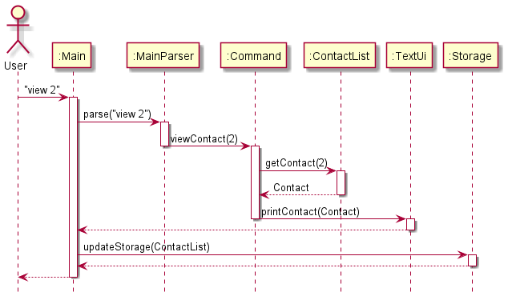
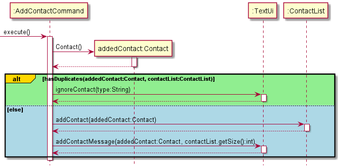
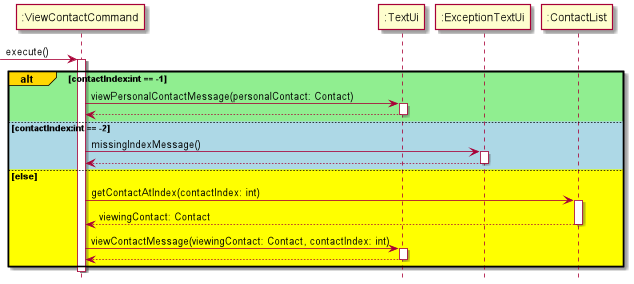
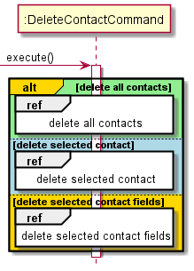
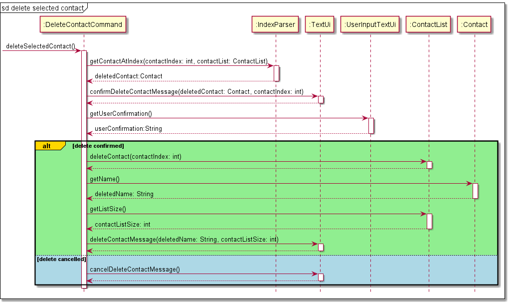

# Developer Guide

### Table of Content
- [Acknowledgements](#acknowledgements)
- [Common Notations In DG](#notations)
- [Design](#design)
  - [System Architecture](#sys-arch)
  - [TextUi](#text-ui)
  - [MainParser](#main-parser)
  - [Command](#command)
  - [ContactList](#contact-list)
  - [Storage](#storage)
- [Implementation](#implementation)
  - [Supported contact details](#supported-details) 
  - [Adding a contact](#Add)
  - [Viewing a contact](#View)
  - [Editing a contact](#Edit)
  - [Deleting a contact](#Delete)
  - [Searching a contact](#Search)
  - [Listing all contacts](#List)
  - [Importing contacts](#Import)
- [Product Scope](#scope)
  - [Target user profile](#target)
  - [Value proposition](#value)
- [User Stories](#stories)
- [Non-Function Requirements](#nf-req)
- [Glossary](#glossary)
- [Instructions for manual testing](#manual-test)
  - [Launch and Shutdown](#launch-and-shutdown)
  - [Adding a contact](#testing-add)
  - [Viewing a contact](#testing-view)
  - [Editing a contact](#testing-edit)
  - [Deleting a contact](#testing-delete)  

## <a name="acknowledgements"></a>Acknowledgements

- Inspiration for App Idea and OOP Structure: [AddressBook (Level 2)](https://github.com/se-edu/addressbook-level2) <br />
- Inspiration for User Guide and Developer Guide: AddressBook (Level 3) [[DG]](https://se-education.org/addressbook-level3/DeveloperGuide.html) <br />
  [[UG]](https://se-education.org/addressbook-level3/UserGuide.html)
- [Converting text for ConTech](https://patorjk.com/software/taag/#p=display&f=Graffiti&t=Type%20Something%20) <br />
- [GitHub Markdown Emoji Syntax](https://github.com/ikatyang/emoji-cheat-sheet/blob/master/README.md) for User Guide: <br />
- [PlantUML Tutorial](https://se-education.org/guides/tutorials/plantUml.html) <br />

## <a name="notations"></a>Common Notations in DG
The common notations listed below will be used throughout the Developer Guide.
- Words in `UPPER_CASE` are meant to be parameters that can be supplied to the commands.
  - e.g. When adding a contact, in the command `add -n NAME -g GITHUB`, `NAME` and `GITHUB` are parameters which
    can be specified, such as `add -n Le Zong -g lezongmun`.
  - e.g. When viewing a contact's details, in the command `view INDEX`, `INDEX` is a number (integer) representing
    the contact's index in the **ConTech** book which can be specified, such as `view 2`.
- Items in curly braces `{}` are optional.
- Items in angle braces `<>` are mandatory.
  - e.g. When specified in the format `<-n> <NAME> {-g <GITHUB>}`, it means that:
    - The `-n` flag and `NAME` detail are mandatory fields, without which the command would not execute.
    - The `-g` flag is optional, however, if used, a `GITHUB` detail would have to be specified.
- Items specified with a pipe `|` denote an either-or field.
  - e.g. For `{-n | -g | -l | -te | -tw | -e}`, only **up to** one `flag` is allowed, but there are **six** choices.

## <a name="design"></a>Design

### <a name="sys-arch"></a>System Architecture


The above **System Architecture** diagram shows the high-level design of ConTech.

On launch, the `Main` class initialises the app components in the correct sequence and links them up
with each other, in the correct sequence.

ConTech comprises five main components, namely:
- `TextUi`: Command Line User Interface of ConTech.
- `MainParser`: Parser to parser user inputs from `TextUi` for `Command`.
- `Command`: Command to be executed upon input parsing.
- `ContactList`: Data structure to store `Contact`s while running ConTech.
- `Storage`: Reads from and writes to [`LocalStorage`](#local-storage).

**How the architecture components interact with each other**

The five main components interact with each other, as shown in the sequence diagram below
for the example: `view 2`




### <a name="text-ui"></a>TextUi
The `TextUi` component is responsible for displaying all outputs to the Command Line User Interface. After a user's input
has been processed and ConTech has performed its commands depending on the input, in order to output the results of the
commands, a relevant method in the `TextUi` class will be called. 

Methods for printing **error messages** have been separated
from the main feature outputs. These methods have been placed in the `ExceptionTextUi` class within the same `ui` package
as `TextUi`. 

### <a name="main-parser"></a>MainParser
The `MainParser` component is responsible for making sense of the user's inputs. It functions as the
not only the identifier for commands, but also calls its relevant sub-parsers to further destructure
the inputs, allowing ConTech to perform its commands.

The diagram below shows a sequence diagram of how `MainParser` works, and a reference diagram is used
to indicate that further parsing is done by sub-parsers for each different command type. This reference diagram
will be referred to later on.


### <a name="command"></a>Command

The `Command` component represents a collection of classes with their names in the form of `XYZCommand`. The `XYZCommand` 
classes are executed in `ConTech.java` by calling on their corresponding `execute()` function. 

### <a name="contact-list"></a>ContactList

The `ContactList` component contains all the contacts stored in an arraylist. It deals with operations that interact with 
the contacts in the `ContactList`, such as adding or editing contacts. The contacts stored in the `ContactList` are sorted
according to their names in alphabetical order.

### <a name="storage"></a>Storage
**API** :`Storage.java`


The `Storage` component consists of the `Storage`, `ContactsDecoder`, and `ContactsEncoder`. This component is 
responsible for interacting with the user's local storage files. The user's contacts data and personal contact data 
are stored locally inside the file paths, `data/contacts.txt` and `data/me.txt`.

Firstly, the `Storage` class checks if the user has existing data, or if they are first time users. Next, it will 
make use of the `ContactsDecoder` class to decode the storage file and load the contacts into the `ContactList` as 
`Contacts`. After every command execution, to ensure data integrity, the `Contacts` in the `ContactList` will be 
saved using the `ContactsEncoder` class.

As the `Storage` component is also responsible for loading these data into their corresponding `ContactList` and 
`Contact` objects, it is dependent on the classes, `ContactList` and `Contact`.


## <a name="implementation"></a>Implementation

### <a name="supported-details"></a>Supported Contact Details
The currently supported contact details are provided in the table below:

|Flag|Detail of contact|
|----|------|
|`-n`|Name|
|`-g`|Github username|
|`-l`|LinkedIn handle|
|`-te`|Telegram handle|
|`-tw`|Twitter handle|
|`-e`|Email|

### <a name="Add"></a>Adding a contact: `add`
This feature is processed using `AddContactCommand`. This feature allows a user to add a contact to their contact list.
The user is able to add a contact by entering a command in the form of `add <-n> <NAME> {-g <GITHUB>} {-l <LINKEDIN>} 
{-te <TELEGRAM>} {-tw <TWITTER>} {-e <EMAIL>}`.

The user's input is parsed in `MainParser` and `AddContactParser`, the latter which inherits `ContactParser`. 
`ContactParser` inherits `RegexParser` (for regex checks regarding each detail) and implements the `ContactDetails`
interface (which uniquely allows the parsers to easily identify each detail based on their indexes). The class 
diagram for this is displayed below.


As the contacts are identified by their names, the name field is made **compulsory** at the `MainParser` level.
The diagram below shows the process of parsing the user's input.


Upon parsing the user's input, the details are passed to an `AddContactCommand`, and this command will be 
executed in `ConTech`. The sequence diagram below illustrates the process of executing `AddContactCommand`.



### <a name="View"></a>Viewing a contact: `view`
This feature is processed using `ViewContactCommand`. Whenever a user wants to view a specific contact from the
contact list, user can input `view INDEX` with the index of the desired contact displayed from the `list` feature. 
`ViewContactCommand` is then created in the `MainParser` and executed in `ConTech`.

The sequence diagram below illustrates the `execute()` function in `ViewContactCommand`.



### <a name="Edit"></a>Editing a contact: `edit`
This feature is processed using `EditContactParser` under `MainParser`. In order to edit a contact in the contact list,
a user must enter a command in the form `edit <INDEX> {-n <NAME>} {-g <GITHUB>} {-l <LINKEDIN>} {-te <TELEGRAM>} 
{-tw <TWITTER>} {-e <EMAIL>}`. The user input will be parsed by `EditContactParser` methods `getIndexToStore` and 
`parseContactDetails` to obtain a String array with the details to be edited. An `EditContactCommand` 
with the specified parameters will then be created and executed in `ConTech`. The sequence diagram below 
shows how the whole process is carried out.


### <a name="Delete"></a>Deleting contacts: `rm`
This feature is processed using the `DeleteContactCommand`. `DeleteContactCommand` is created 
in the `MainParser`and executed in`ConTech`. Users can either delete a specified contact
or delete all contacts at once.



To delete all contacts, a user must enter the command `rm all`. The sequence diagram below
shows how the removal of all contacts works. Before any deletion, the user will be
prompted with a message to confirm deletion. If the user confirms deletion for all contacts,
deletion will be executed, along with a message to show that deletion has been executed.
If user cancels deletion, a message is printed to show that the deletion has been cancelled.

 

To delete a selected contact, a user must enter a command in the form `rm <INDEX>`. The sequence diagram below
shows how the removal of a contact works. Before any deletion, details of the contact with the specified`INDEX` 
will be displayed to the user, along with a prompt to confirm deletion. If the user confirms deletion, 
deletion of the selected contact will be executed, along with a message to show that deletion has been executed.
If user cancels deletion, a message is printed to show that the deletion has been cancelled.



To delete specific details of a selected contact, a user must enter a command in the form `rm <INDEX> {-g} {-l} {-te}
{-tw} {-e}`. The sequence diagram below shows how the removal of a contact's fields works. Before any
deletion, details of the contact fields specified will be displayed to the user, along with a prompt to confirm 
deletion. If the user confirms deletion, deletion of the selected contact will be executed, along with a message to show
that deletion has been executed. If user cancels, deletion, a message is printed to show that the deletion has been
cancelled.


### <a name="Search"></a>Searching a contact: `search`
This feature is processed using `SearchContactParser` under `MainParser`. In order to edit a contact in the contact list,
a user must enter a command in the form `search {-n | -g | -l | -te | -tw | -e} <SEARCH QUERY>`. If no flag is specified, the search will be done
on contact names buy default. From the user input, the search query and the search flag are obtained from the 
`parseSearchQuery` and the `getDetailFlag` methods respectively. A `SearchContactCommand` with the specified parameters
will be created and executed in `ConTech`. The sequence diagram below shows how the whole process is carried out.


### <a name="List"></a>Listing all contacts: `ls`
This feature is processed using `MainParser`. The control is sent to `ListContactsCommand` under `Command` to execute the
command which uses a loop to get the Contact object at every available index and print it using the `printContactWithIndex`
function in `TextUi` class.


## <a name="scope"></a>Product scope
### <a name="target"></a>Target user profile
- Has a need to store a significant amount of computing-related contacts
- Prefers and is familiar with Command Line Interface (CLI) applications
- Has many contacts that use common computing platforms, such as: Github, Linkedin, Twitter, Telegram, and Email
- Can type fast and prefers typing to mouse interactions

### <a name="value"></a>Value proposition

As computing professionals are often on their computer, ConTech allows them to have a platform to 
manage their computing-related contacts locally and efficiently, without the need to use 
additional devices or platforms.

## <a name="stories"></a>User Stories

|Version| As a ... | I want to ... | So that I can ...|
|--------|----------|---------------|------------------|
|v1.0|programmer|add my colleague's account usernames|easily access it|
|v1.0|programmer|edit my colleague's account usernames|update it if there is a change|
|v1.0|programmer|save contact data locally on my hard drive|access it without internet|
|v1.0|programmer|view various contact details of my colleague|contact him easily on different platforms|
|v1.0|programmer|see the names and index of saved contacts|know the contacts I have saved|
|v1.0|programmer|delete a specific contact||
|v1.0|programmer|be able to copy and paste the displayed contact's URLs|visit the contact's accounts|
|v2.0|programmer|save my personal details|the application is aware of the user|
|v2.0|forgetful user|be able to search for my contacts by name|find their contact details|
|v2.0|programmer|import a list of contacts quickly from an input txt file|save time typing each contact

## <a name="nf-req"></a>Non-Functional Requirements

- App should work on any [*mainstream Operating Systems*](#os) as long as Java `11` or higher has been installed on it
- App should be easily usable by a novice who does not have much CLI experience
- Format of details of contacts should follow requirements stated by Github, LinkedIn, Telegram, Twitter, and general Emails
- Importing hundreds of contacts should be instantaneous

## <a name="glossary"></a>Glossary

* <a name="os"></a>**Mainstream Operating Systems** - Windows, macOS, *NIX
* <a name="local-storage"></a>**LocalStorage** - Refers to user's hard disk storage

## <a name="manual-test"></a>Instructions for manual testing

{Give instructions on how to do a manual product testing e.g., how to load sample data to be used for testing}
Given below are instructions to test the app manually.

**Note:** These instructions only provide a starting point for testers to work on; testers are expected to do more
exploratory testing.

### <a name="launch-and-shutdown"></a>Launch and Shutdown

1. Initial launch
    1. Ensure that you have Java `11` or above installed in your Computer.
    2. Download the latest version of `contech.jar` from **[here](https://github.com/AY2122S1-CS2113T-T09-1/tp/releases)**.
    3. Copy the `contech.jar` file to the folder you want to use as the _home folder_ for **ConTech**.
    4. Open your desired _Command Line Interface_ from the folder with `contech.jar` and enter the following code:
       `java -jar contech.jar`.
       
    
2. First time user
    1. For a first time user, you would be required to type in your personal details.
    2. Entering your name will be **mandatory**. The other 5 fields (GitHub, Telegram, Twitter, Email and LinkedIn) are 
       **optional**. You will be prompted to enter each detail accordingly. For the optional fields, you can press ENTER
       to skip.
       

3. Regular user
    1. For regular users, ConTech will simply greet you and you are ready to input your command.
       Expected:
       ```
       ____________________________________________________________
       Hello, John.
       Welcome back to ConTech, your personal contact tracker.
       ____________________________________________________________
       ```

4. Shutting down ConTech
    1. Once you are done with your tasks and would like to shutdown ConTech, simply input `exit`.
    2. Test case: `exit`<br>
       Expected:
       ```
       ____________________________________________________________
       ConTech will now shutdown.
       We hope you have enjoyed using it.
       ____________________________________________________________
       ```

