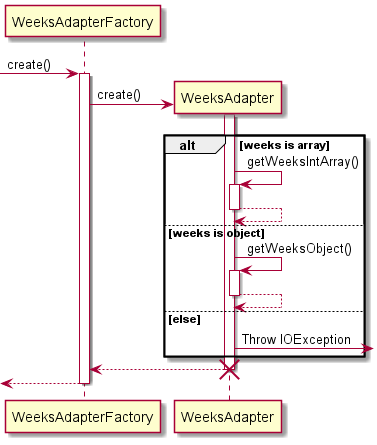
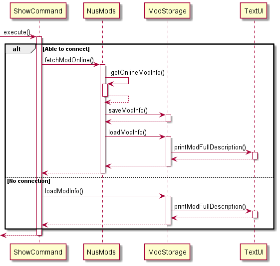
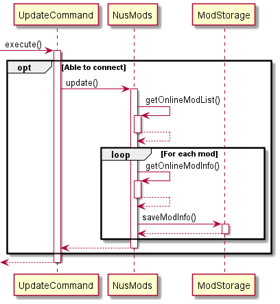

# Developer Guide

## UNIMods


**UNIMods** is a light-weight Command Line Interface (CLI) Application that provides a means for students to plan for
their academic journey in NUS. This guide details the implementation design and architecture that Unimods was built
upon.

## Contents

- [Acknowledgements](#acknowledgements)
- [Setting up, getting started](#setting-up-getting-started)
- [Design](#design)
    * [Architecture](#architecture)
    * [UI component](#ui-component)
    * [Logic component](#logic-component)
    * [Online component](#online-component)
    * [Timetable component](#timetable-component)
    * [Storage component](#storage-component)
    * [Common classes](#common-classes)
- [Implementation](#implementation)
    * [Fetching Module Data](#fetching-module-data)
      * [Parsing of weeks via Gson](#parsing-and-saving-of-weeks-via-gson)
    * [Search/ Show/ Update Functions](#searchshowupdate-module-feature)
      * [Search](#search)
      * [Show](#show)
      * [Update](#update)
- [Documentation, logging, testing, configuration, dev-ops]()
- [Appendix: Requirements]()
    * [Product scope]()
    * [User stories]()
    * [Use cases]()
    * [Non-Functional Requirements]()
    * [Glossary]()
- [Appendix: Instructions for manual testing]()
    * [Launch and shutdown]()
    * [Deleting a person]()
    * [Saving data]()

## Acknowledgements

## Setting up, getting started

1. Ensure you have Java 11 or above installed in your Computer.
2. Download the latest unimods.jar from [here](https://github.com/AY2122S1-CS2113T-W12-2/tp/releases).
3. Copy the file to the folder you want to use as the home folder for your NUS Mods Lite.
4. Double-click the file to start the app.
5. Type the command in the command box and press Enter to execute it. Some example commands you can try:
    - `help` : to list all the commands with their description
    - `search <module_code>` : lists module code based on the given partial regex
    - `show <module_code>`: displays the module information
    - `add <module_code>` : to add the module to the timetable
    - `delete <module_code>` : to remove the module from the timetable
    - `timetable` : lists all modules added to the timetable
    - `exit` : Exits the app.
    - Refer to the [User Guide](https://ay2122s1-cs2113t-w12-2.github.io/tp/UserGuide.html) for details of each command.

## Design

### Architecture

The Architecture Diagram given below explains the high-level design of the App. 
Given below is a quick overview of main components and how they interact with each other.


#### Main components of the architecture
**Unimods**

>  **Unimods** one class called `Duke`. It is responsible for
>  - At app launch: Initializes the components in the correct sequence, and connects them up with each other.

<br>

**Commons**
> **Commons** represents a collection of classes used by multiple other components.
The rest of the App consists of five components:
> - **UI**: The UI of the App.
> - **Logic**: The command executor.
> - **Timetable**: Holds the timetable data in memory
> - **Storage**: Reads data from, and writes data to, the hard disk.
> - **Online**: Fetches data from the NUSMods API online for up to date information

<br>

### UI component

<br>

### Logic component
The **Logic** component consists of the `CommandParser` , as well as all the valid commands : 
`AddCommand`,  `ClearCommand`, `DeleteCommand`, `ExitCommand`, `HelpCommand`, `SearchCommand`, 
`ShowCommand`, `TimetableCommand` and the `UpdateCommand` classes.


The **Logic** component. </br>
Consists of the `CommandParser` and `FlagParser` classes.
> Converts user input into a `Command` object using the `CommandParser` component.
>
> If the user inputs a search command with **flags**, convert **flags** into a `SearchFlags` object using the `FlagParser` component.
>
>Instantiates `Commands` through `CommandParser` which each have unique `execute()` methods that execute their function.


<br>

### Online component

<br>

### Timetable component

<br>

### Storage component

### Common classes

## Implementation
This section covers the important details on how some features are implemented.

<br>

### Fetching Module Data
Each module is converted from the json fetched from the **NUSMods API** into a Java Object using the gson library.
Since the json format utilized by the API contains nested objects, the final implementation of the `Module` objects 
emulates that of the json, with each `Module` containing an `Attributes` object and an array of `Semester` objects, 
`Semester` containing an array of `Lesson` objects, and  `Lesson` containing an array of `Weeks` objects.


####Parsing and Saving of Weeks via Gson
Gson was unable to parse the weeks key as provided by the NUSMods API as the value expected for the key can be of two different data types.

```
{
"classNo": "16",
"startTime": "1600",
"endTime": "1700",
"weeks": [1, 2, 3, 4, 5, 6, 7, 8, 9, 10, 11, 12, 13],
"venue": "E-Learn_C",
"day": "Friday",
"lessonType": "Tutorial",
"size": 21,
"covidZone": "Unknown"
}
```

An example of a lesson in the *timetable* array in a normal semester, where *weeks* contains an array.

```
{
"classNo": "03",
"startTime": "1530",
"endTime": "1730",
"weeks": {
"start": "2022-06-23",
"end": "2022-07-28"
},
"venue": "E-Learn_C",
"day": "Thursday",
"lessonType": "Laboratory",
"size": 25,
"covidZone": "Unknown"
}
```

An example of a lesson in the *timetable* array in the special term, where *weeks* contains an object with its own 
*start* and *end* keys.

By default Gson does not handle keys that have multiple data types. If `Weeks` is defined as an object, Gson will throw 
an error when parsing normal semester lessons as it expects an array, and similarly, if weeks is defined as an array 
in `Lessons` then Gson will throw an error when parsing Special term lessons as it expects an object instead.

```
@JsonAdapter(WeeksAdapterFactory.class)
private Weeks weeks
```

By utilizing a TypeAdapter for Weeks in Lessons, a  custom deserialization method for Gson to use for this specific key 
was implemented.



Using `peek()`, Gson checks if *weeks* is an array or an object. From there it utilizes the deserialization method for 
the specific data type. The key difference is that while *weeks* can be an array in the json, when deserialized it is 
always an object that contains three variables, *weeks*, *start* and *end*. If it was originally an array, then the 
array be written into the *weeks* array in the object itself, and *start* and *end* will be null. If it was an object, 
then *start* and *end* will be written, but *weeks* will be null.


Similarly for saving weeks for the `Timetable` json, a custom serialization method is used that checks which specific 
data type to serialize it as. If *weeks* is not null, then Gson writes it as an array despite it being an object. 
This is to maintain consistency with the json format retrieved from the **NUSMods API** which allows Gson to 
successfully deserialize the timetable json when it is loaded.  Otherwise it writes it as an object as usual.

<br>

### Search/Show/Update module feature
This feature is implemented using the `ModStorage` and the `NusMods` classes.

The following implemented functions are utilized heavily:
`NusMods`:
* `getOnlineModList()` : gets a list of mods from the NUSMods API.
* `getOnlineModInfo()` : using a module code, get detailed information about that

`ModStorage`:
* `saveModInfo()` : saves a fetched json into local storage.
* `searchFiles()` : attempts to search from all jsons in the local data folder.
* `loadModInfo()` : directly loads the json with the specified module code.

#### Search


*Fetch, Save and Load Mod*


Utilizes `getOnlineModList()` to get all mods from online. If the module code contains the search term or matches the 
level flag if inputted, `getOnlineModInfo()` is used to fetch the full data for further comparison with the remaining 
flags. `saveModInfo()` is always used after fetching a json to keep the local database as up to date as possible. 
If the module matches the search term and all flags, then it is printed. If either `getOnlineModList()` or 
`getOnlineModInfo()` fail at the start, then `searchFiles()` will execute instead to fetch data locally.

#### Show



Similar to search, except it directly uses `getOnlineModInfo()` instead. If the module exists, then it will be printed. 
Again, `saveModInfo()` is always used after fetching a json to keep the local database as up to date as possible. 
If `getOnlineModInfo()` fails at the start, then `loadModInfo()` will execute instead.

#### Update



Fetches the json from all mods in the NUSMods database. Utilizes `getOnlineModList()` to get all mods from online. 
`getOnlineModInfo()` and `saveModInfo()` is run for every mod in the list to update all mods in the local database.

### Maintaining Timetable

#### Initialization


Fetches locally stored timetable json, utilizing Gson to convert it to a `TimetableDto` object. `toTimetable()` function is then called to convert `TimetableDto` to a `Timetable` object, where schedule info is merged to easier access.

In the event that the json save file is empty or does not exist, a new empty `Timetable` object is created

#### Save


`Timetable` is converted to a `TimetableDto` object in order to separate different `TimetableItem` types. The `TimetableDto` object is then saved to a local json file via Gson.

#### Add
Utilizes `getLessonDetails` for each LessonType found in the Semester of the module. 
Details of all lessons will be displayed and sorted based on classNo. 
In the event where the lesson conflicts (another lesson is within the same time slot) 
with any existing lessons, a `<CONFLICT>` line will be displayed beside the lesson. 
For each lessonType, `getCommand` is utilized to collect input of the Lesson to be added into the timetable. 
The `addModuleToList()` and `addLesson()` functions are called, and the modules are added to the module 
list and each applicable timetable slot.
#### Delete

#### Clear Timetable

#### Show Timetable

