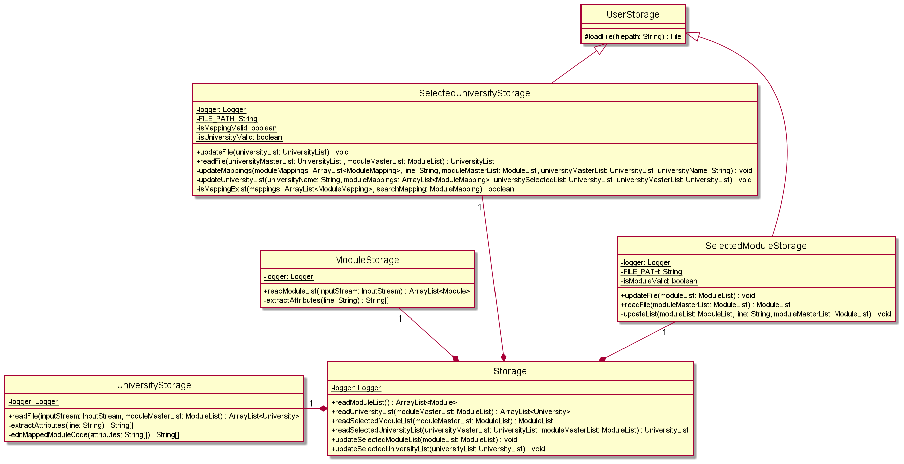

## Contents 
* [About SEPlanner](#About-SEPanner)
* [Acknowledgements](#acknowledgements)
* [Getting Started](#getting-started)
* [Design & Implementation](#design--implementation)
  * [Main Components](#main-components) 
  * [Command Implementation](#command-implementation)
  * [User Interface](#user-interface)
  * [Storage](#storage)
  * [University and module related classes](#university-and-module-related-classes)
    * [University](#university)
    * [UniversityList](#universitylist)
    * [Module](#module)
    * [ModuleList](#modulelist)
    * [ModuleMapping](#modulemapping)
  * [Parser Component](#parser-component)
    * [Parser](#parser)
    * [AddCommandParser](#addcommandparser)
    * [RemoveCommandParser](#removecommandparser)
    * [FindCommandParser](#findcommandparser)
    * [SearchMapCommandParser](#searchmapcommandparser)
    * [HelpCommandParser](#helpcommandparser)
    * [ExitCommandParser](#exitcommandparser)
* [Product Scope](#product-scope)
  * [Target User Profile](#target-user-profile)
  * [Value Proposition](#value-proposition)
* [User Stories](#user-stories)
* [Non-Functional Requirements](#non-functional-requirements)
* [Glossary](#glossary)
* [Instructions for manual testing](#instructions-for-manual-testing)

## About SEPlanner
SEPlanner is a lightweight desktop application for Computer Engineering undergraduates from the National University of Singapore
to plan for their Student Exchange Programme, optimised for use via Command Line Interface (CLI).

## Acknowledgements

* __EduRec:__ For the list of possible module mappings
* __AB3:__ For the format of user guide and developer guide

## Getting started 

Refer to our user guide [here](https://ay2122s1-cs2113t-t09-2.github.io/tp/UserGuide.html#quick-start)

## Design & implementation

  

The ***Architecture Diagram*** above explains the high-level design of the App. 

### Main Components

The main class of SEPlanner is the `Duke` class. It is responsible for initializing the other components when the program 
gets started while handling interactions between the other components.  
The other core components of SEPlanner are:  
`Ui` : Handles the UI of SEPlanner and prints outputs to the user.  
`Parser`: Handles user inputs and pass them down to the `Command` class.  
`Command` : Handles output passed down from `Parser` based on the user inputs and execute user instructions.  
`Storage` : Loads data from, and stores data back to the user's local machine.  
`UniversityList` and `ModuleList` : Stores information about Universities and modules as well as the methods to amend and filter them.

### Command Interaction 

The sequence diagram above illustrates the flow through our program structure when the user input `add /uni 1` 
is entered.  

When the user runs the `add /uni 1` action on the parser class, the parser class calls the `addUniCommand` method 
in the `addUniCommand` class by passing the university with master index `1` to it.  

The `addUniCommand` class then  
1. calls the `selectedUniversityList#addUniversity` method in the model class 
by passing the university to implement the action.
2. calls the `updateSelectedUniversity` method in the storage class 
by passing the selected university list to update the stored selected list
3. calls `printUniversity` in the UI class.
by passing the university to display the message of adding the selected university to the user.
 
### Command Implementation

####AddModCommand
When the `AddModCommand` method is called in the `AddModCommand` class. It will call the `addModule` method in the `moduleList` class under Model, adding the module in the selected module list. Then it will call the `updateSelectedModuleList` method in the storage class to update the selected list with the new module added. Finally, it will call the `printModule` method in the `UiModule` class to print the message of adding the module to the user.

####AddUniCommand
When the `AddUniCommand` method is called in the `AddUniCommand` class. It will call `addUniversity` method in the `universityList` class under Model, adding the university in the selected university list. Then it will call the `updateSelectedUniversityList` method in the storage class to update the selected list with the new university added. Finally, it will call the `printUniversity` method in the `UiUniversity` class to print the message of adding the university to the user.

####AddMapCommand
When the `addMapCommand` method is called in the `AddMapCommand` class. It will call the `addMapping` method in the `university` class under Model, adding the mapping under the selected university in the selected university list. Then it will call the `updateSelectedUniversity` method in the storage class to update the selected list with the new mapping added. Finally, it will call the `printUniversity` method in the `UiMapping` class to print the message of adding the mapping to the user.

####RemoveModCommand
When the `RemoveModCommand` method is called in the `RemoveModCommand` class. It will call the `removeModule` method in the `moduleList` class under Model, removing the module in the selected module list. Then it will call the `updateSelectedModuleList` method in the storage class to update the selected list with the module removed. Finally, it will call the `printModule` method in the `UiModule` class to print the message of removing the module to the user.

####RemoveUniCommand
When the `RemoveUniCommand` method is called in the `RemoveUniCommand` class. It will call `removeUniversity` method in the `universityList` class under Model, removing the university in the selected university list. Then it will call the `updateSelectedUniversityList` method in the storage class to update the selected list with the university removed. Finally, it will call the `printUniversity` method in the `UiUniversity` class to print the message of removing the university to the user.

####RemoveMapCommand
When the `RemoveMapCommand` method is called in the `RemoveMapCommand` class. It will call the `removeMapping` method in the `university` class under Model, removing the mapping under the selected university in the selected university list. Then it will call the `updateSelectedUniversity` method in the storage class to update the selected list with the mapping removed. Finally, it will call the `printUniversity` method in the `UiMapping` class to print the message of removing the mapping to the user.

####ListModCommand
When the `ListModCommand` method is called in the `ListModCommand` class. It will call the `getSize()` method in the `moduleList` class to check if the list is empty: if the list is empty, it prints the error message. If the list is not empty, it calls the `printModule` method in the `UiModule` class in a loop to print all modules found.

####ListUniCommand
When the `ListUniCommand` method is called in the `ListUniCommand` class. It will call the `getSize()` method in the `UniversityList` class to check if the list is empty: if the list is empty, it prints the error message. If the list is not empty, it checks the type of university list chosen. If the master list is chosen, the `printMasterList` method is called, which calls `printUniversity` method in the `UiUniversity` class to print out all universities in the master list. If the selected list is chosen, `printSelectedList` is called, which calls `printUniversity` method in the `UiUniversity` class to print out all universities in the selected list and calls `listAllMappings` method in the `universityList` class to print all module mappings under each university as well.

####FindModCommand
When the `FindModCommand` method is called in the `FindModCommand` class. It will get the list of module results by searching in the `moduleMasterList`. Then it checks if the result list is empty: if the result list is empty, it calls the `printFindModNull` method in the `UiInvalid` class to print the error message. If the result list is not empty, it calls the `printModule` method in the `UiModule` class in a loop to print all modules found.

####FindUniCommand
When the `FindUniCommand` method is called in the `FindUniCommand` class. It will get the list of university results by searching in the `universityMasterList`. Then it checks if the result list is empty: if the result list is empty, it calls the `printFindUniNull` method in the `UiInvalid` class to print the error message. If the result list is not empty, it calls the `printUniversity` method in the `UiUniversity` class in a loop to print all universities found.

####SearchMapCommand
When the `SearchMapCommand` method is called in the `SearchMapCommand` class, it will check if `isAll` is true. If `isAll` is true, the `printMappings` method will be called, which prints all mappings from the selected module list for all universities in the selected university list by calling the `printIndex` method in the Ui class and `listSelectedMappings` method in the University class. If isAll is false, it will call the `printMappings` method to print out only the mappings for the selected university only.

####HelpCommand
When the `HelpCommand` method is called in the `HelpCommand` class. It will print out all commands available for SEPlanner.

####ExitCommand
When the `ExitCommand` method is called in the `ExitCommand` class. It will call the `printExit` method in the `UiGeneral` class to exit the program.

### User Interface

The Ui component consolidates and formats the output of the program before displaying it to the user
in the command line. 

The above class diagram illustrates the relationship between the classes within the Ui components.

The Ui class is the parent of every other class in the package.
* Contains helper methods for the other Ui classes.
* Provides means of printing constants.

The UiInvalid class contains methods for printing messages from the Parser component.

The UiMapping class contains methods for printing Module Mappings. 

The UiModule class contains methods for printing Modules. 

The UiUniversity class contains methods for printing Universities. 

The UiWelcome class contains a method for printing the welcome greeting. 

The UiInvalid class contains methods to display error messages to the user. 

The UiStorage class contains methods to display error messages from the Storage component to the user. 

The sequence diagram above illustrates how the classes in the Ui package interact when a printUniversity() call is made from outside the package.
In the printUniversity Method,
1. `printIndex` is called from the Ui class.
2. Within `printIndex`, we display the index, then do a self invocation on stringPadder within the Ui class to pad the string to line up the text after. 
3. After printing the index, print the university name, then depending on the boolean printMC, we pad it again with stringPadder before displaying the Module Credits. 

### Storage

#### API : [`Storage.java`](https://github.com/AY2122S1-CS2113T-T09-2/tp/blob/master/src/main/java/seedu/duke/storage/Storage.java)

The storage component can implement the below features:

* Read the list of module mappings offered by each university from the CSV file.
* Read the list of NUS modules which can be mapped from the CSV file.
* Save both user's module mappings for each university and their selected NUS modules in text
  file and read them back into corresponding objects.

The purpose of each class in the storage component, except the `Storage` class, is to handle a specific file. The `Storage` 
class is used to link all the other classes. This is done by creating an object of other classes, to access all the necessary
methods required.

The classes `SelectedUniversityStorage` and `SelectedModuleStorage` are responsible for reading and updating the text files
storing your selected university list and your selected module list. These classes inherit from the `UserStorage` class as the `loadFile` function
is identical other than the file path. The private methods in both the classes filters out the invalid data found while reading the 
text files.

The classes `UniversityStorage` and `ModuleStorage` are responsible for extracting the Master University List and Master Module List
from the CSV type files (`University.csv` and `modules.csv`) stored in the resources root.

### University and module related classes

The following diagrams are the class diagrams of the classes:  

  
  

This component consist of the following classes: 

#### University 

* Stores basic information of a university.
* Stores the unique index for each university in `index`, this index can be used to refer to a specific university in the commands.
* Stores the university name in `name`.
* Stores `ModuleMapping` objects associated to this university in an array list `list`.
* For `University` objects under the master list, `list` stores all possible module mappings from this university for the user to choose from.
* For `University` objects under the selected list by the user, `list` stores all the module mappings the user has chosen to add to this university for their SEP application.

#### UniversityList

* Stores `University` objects.
* Can be used under the following 2 circumstances:
  * Stores the master list containing all universities available for CEG SEP application. This list is directly read from an external file `University.csv`.
  * Stores the selected list containing all universities added by the user. This list can be amended by the user, and all change to it will be stored under `data/selectedUniversities.txt`.
* Contains methods to search, filter, or amend the list based on command from the user. 

#### Module 

* Stores basic information of a module.
* For NUS modules, stores the unique index for each module in `index`, this index can be used to refer to a specific module in the commands.
* Stores the module code in `moduleCode`.
* Stores the module name in `moduleName`.
* Stores the modular credits of this module in `moduleCredits`.

#### ModuleList

* Stores `Module` objects.
* Can be used under the following 2 circumstances:
  * Stores the master list of all NUS modules available for the users to choose from.
  * Stores the selected list unique to each user based on the modules they choose to take.

#### ModuleMapping 

* Stores 2 `Module` objects as a pair of module mapping.
* Stores the local NUS module in `localModule`.
* Stores the partner university module in `mappedModule`.

### Parser Component

The parser component is made up of the following classes:
* Identify the command word and invoke the respective argument parser for the command.
* Handle the arguments and return the respective Command object.
* Ensures that the command, flags and arguments are entered in the correct format.  

#### Parser

* This is the main parser class that will handle raw inputs and identify command words and invoke the respective command parsers instance and return the respective `Command` object.

#### ParseCondition

* This class contains methods used by various parser classes to verify that the inputs are valid.

#### AddCommandParser

* This object when invoked, will first identify the flag `/uni`, `/mod` or `/map`. Once the flag is identified, the arguments corresponding to the flags will be extracted.
* For `/uni` the argument should either be an integer representing `<UNI_INDEX>` or a String representing `<UNI_NAME>`.
A new `University` object will be created and passed as an argument to the constructor for `AddUniCommand`.
* For `/mod` the argument should either be an integer representing `<MOD_INDEX>` or a String representing `<MODULE_CODE>`.
A `Module` object will be duplicated from the Master Module List and passed as an argument to the constructor for `AddModCommand`.
* Both the `/uni` and `/mod` flag will be checking for the type of inputs passes in and handle them accordingly.
* For `/map` the argument should be two integers representing `<UNI_INDEX>` and `<MAPPING_INDEX>` and will be passed into the constructor for `AddMapCommand`.

#### RemoveCommandParser

* This object when invoked, will first identify the flag `/uni`, `/mod` or `/map`. Once the flag is identified, the arguments corresponding to the flags will be extracted.
* For `/uni` the argument should either be an integer representing `<UNI_INDEX>` or a String representing `<UNI_NAME>`.
The `University` object representing the particular university from the Selected University List will be passed as an argument to the constructor for `RemoveUniCommand`.
* For `/mod` the argument should either be an integer representing `<MOD_INDEX>` or a String representing `<MODULE_CODE>`.
The `Module` object representing the particular module from Selected Module List and passed as an argument to the constructor for `RemoveModCommand`.
* Both the `/uni` and `/mod` flag will be checking for the type of inputs passes in and handle them accordingly.
* For `/map` the argument should be two integers representing `<UNI_INDEX>` and `<MAPPING_INDEX>` and will be passed into the constructor for `RemoveMapCommand`.

#### FindCommandParser

* This object when invoked, will first identify the flag `/uni`, `/code` or `/mod`. Once the flag is identified, a String representing `<KEYWORD>` is extracted and passed as an argument to the constructor for `FindUniCommand` or `FindModCommand`.

#### SearchMapCommandParser

* This object when invoked, will take the first argument and convert it into an integer representing `<UNI_INDEX>` and pass it to the constructor for `SearchMapCommand`.

#### HelpCommandParser

This object will return an instance of `HelpCommand`.

#### ExitCommandParser

This object will return an instance of `ExitCommand`.

#### ParserClassException

* This is an abstract class inherited from Java 11's `ParseException` and its children objects are thrown when an input is detected as invalid. 
* Each command word has its respective `ParserClassException` with its format inside.
* On top of the parameters for `ParseException`, and additional boolean variable is required to identify when the user has made a format error in the command and the correct format will be output to the user.
* Any instance of this exception will be caught in the main method of `Seplanner` class.

## Product scope

### Target User Profile

__SEPlanner__ is targeted at Computer Engineering students in the National University of Singapore planning for their Student Exchange Program (SEP). 

### Value Proposition

Student Exchange Program is one of the most stressful and difficult things to plan for in a NUS students life. 
With multiple sources of information and a frustrating webpage to navigate, SEPlanner aims to organise 
a list of potential exchange Universities based on the users study plan, module requirements and personal preference.

## User Stories

|Version| As a ... | I want to ... | So that I can ...|
|--------|----------|---------------|------------------|
|v1.0|new user|see the list of possible schools for exchange|view my options for SEP|
|v1.0|new user|see the list of available NUS modules|decide on which NUS modules I want to complete during SEP|
|v1.0|beginner user|add a University to my preferred list|view the Universities that I am interested in|
|v1.0|beginner user|add a NUS Module to my preferred list|save my module preferences for the future|
|v1.0|beginner user|list down all Universities in my preferred list|keep track of my target schools for SEP|
|v1.0|beginner user|list down all NUS modules in my preferred list|keep track of the list of NUS modules I want to complete during SEP|
|v1.0|beginner user|delete a University from the selected list|remove the University that I am not interested in|
|v1.0|beginner user|delete a module from the selected list|remove the module that I do not consider to enrol in the future|
|v1.0|user|enter commands and arguments to the application|interact with the application on the command line in an efficient way
|v2.0|familiar user|save my university and module information|maintain access to my information when I restart the application|
|v2.0|new user|view the program instructions|refer to them when I forget how to use the application|
|v2.0|familiar user|find a University by name|locate a University without having to go through the entire list|
|v2.0|familiar user|search the available module mappings for a University based on the selected module list|get a list of module mappings for this university based on my selected modules|
|v2.0|familiar user|add a pair of module mapping for a university|save a module mapping under the university that I selected|
|v2.0|familiar user|delete a mapping pair of module for a university|remove a module mapping under a selected university|
|v2.0|familiar user|pass in University as command argument using its index in the master list|access the exact University I want without having to type out its full name and facing bugs caused by typo|

## Non-Functional Requirements

* SEPlanner must operate with full functionality on all mainstream operating systems: Windows, MacOS and Ubuntu with Java 11 installed. 
* It should offer a streamlined experience using the command line interface primarily. 
* It should be fast and responsive (No more than 1000ms between user input and program output).
* It should be significantly faster than the default Student Exchange Program application portal on myEduRec. 

## Glossary

* *Master University List* The list of all partner universities.
* *Master Module List* - The list of all NUS modules available for mapping.
* *Selected University List* - The list of partner universities the user selected along with the user's selected module mappings
                               for each university
* *Selected Module List* - The list of NUS modules the user selected.
* *CSV* - Comma-separated Values
* *SEP* - Student Exchange Programme
* *NUS* - National University of Singapore

## Instructions for manual testing

 :information_source: **Note:**
These instructions only provide a starting point for testers to work on; testers are expected to do more exploratory testing.

### Launch and shutdown

1. Initial launch
   1. Download the jar file and copy into an empty folder.
   2. Open a terminal at the folder containing the jar file.
   3. Run the command `java -jar seplanner.jar`
      Expected: The welcome ascii art will display.
   4. Resize the terminal to fit the welcome ascii.

2. Shutdown
   1. Enter the command `exit`.
      Expected: The exit ascii art will display.

### Getting help
1. Get help for user the program.
   1. Test case: `help`

      Expected: The command list will be printed to console.

### Getting university list and module list
1. Listing the Master University List.
   1. Test case: `list /muni`

      Expected: The entire list of universities are printed.

2. Listing the Master Module List
   1. Test case: `list /mmod`

      Expected: The entire list of modules are printed.

3. Listing the Selected University List.
   1. Test case: `list /suni`

      Expected: The user selected university list are displayed.

4. Listing the Selected Module List.
   1. Test case: `list /smod`

      Expected: The user selected module list are displayed.

5. Dealing with wrong flags.
   1. Test case: `list /mod`

      Expected: No list will be printed. Error message indicating wrong flags is shown, together with the correct format for `list` command.

6. Dealing with incorrect format.
   1. Test case: `list`

      Expected: No list will be printed. Error message indicating missing flags is shown, together with the correct format for `list` command.

### Finding a university
1. Finding a university by name.
    1. Test case: `find /uni Boston University`

       Expected: The related information for Boston University is printed.
   2. Test case: `find /uni abc`

      Expected: No university is found. Error message is printed to indicate university is not available.
   
2. Dealing with wrong flags.
    1. Test case: `find /uniname`

       Expected: Error message indicating wrong flags is shown, together with the correct format for `find` command.

3. Dealing with incorrect format.
    1. Test case: `find`

       Expected: Error message indicating missing flags is shown, together with the correct format for `list` command.

### Finding a module
1. Finding a module by name.
    1. Test case: `find /mod Discrete Structures`

       Expected: The related information for Discrete Structures is printed.
    2. Test case: `find /mod abc`

       Expected: No module is found. Error message is printed to indicate university is not available.
2. Finding a module by code.
    1. Test case: `find /code CS1231`

       Expected: The related information for CS1231 is printed.
    2. Test case: `find /mod abc`

    Expected: No module is found. Error message is printed to indicate university is not available.

2. Dealing with wrong flags.
    1. Test case: `find /modname`

       Expected: Error message indicating wrong flags is shown, together with the correct format for `find` command.

3. Dealing with incorrect format.
    1. Test case: `find`

       Expected: Error message indicating missing flags is shown, together with the correct format for `list` command.

### Adding a university

1. Adding a university by index.
   1. Prerequisites: Delete the data folder and restart the program.
   2. Test case: `add /uni 1`
      
      Expected: University with index 1 is added to the Selected University List. Success message is shown.
   3. Test case: `add /uni 0`

      Expected: No university is added. Error message is printed to indicate university is not available.

   4. Test case: `add /uni 81`

      Expected: No university is added. Error message is printed to indicate university is not available.

2. Adding a university by university name.
   1. Prerequisites: Delete the data folder and restart the program.
   2. Test case: `add /uni University of California`
   
      Expected: University of California is added into Selected University List. Success message is shown.

   3. Test case: `add /uni random_string`

      Expected: No university is added. Error message is printed to indicate university is not available.

3. Adding a duplicate university by index.
   1. Prerequisites: Delete the data folder and restart the program. Run the command `add /uni 34`.
   2. Test case: `add /uni 34`
      
      Expected: No university is added. Error message indicating duplicate university is shown.
    
4. Adding a duplicate university by university name.
   1. Prerequisites: Delete the data folder and restart the program. Run the command `add /uni University of Toronto`.
   2. Test case: `add /uni University of Toronto`

      Expected: No university is added. Error message indicating duplicate university is shown.
   
5. Dealing with missing argument.
    1. Test case: `add /uni`

       Expected: No university will be added. Error message indicating missing arguments is shown, together with the correct format for `add` command.

    2. Test case: `add`
  
       Expected: No university will be added. Error message indicating missing arguments is shown, together with the correct format for `add` command.

6. Dealing with incorrect flag.
   1. Test case: `add /muni 34`

      Expected: No university will be added. Error message indicating wrong flags is shown, together with the correct format for `add` command.

### Adding a module

1. Adding a module by index.
   1. Prerequisites: Delete the data folder and restart the program.
   2. Test case: `add /mod 1`

       Expected: Module with index 1 is added to the Selected Module List. Success message is shown.
   
   3. Test case: `add /mod 0`

       Expected: No module is added. Error message is printed to indicate module is not available.

   4. Test case: `add /mod 806`

      Expected: No module is added. Error message is printed to indicate module is not available.

2. Adding a module by module code.
   1. Prerequisites: Delete the data folder and restart the program.
   2. Test case: `add /mod CS1010`

      Expected: University of California is added into Selected Module List. Success message is shown.

   3. Test case: `add /mod random_string`

      Expected: No module is added. Error message is printed to indicate module is not available.

3. Adding a duplicate module by index.
   1. Prerequisites: Delete the data folder and restart the program. Run the command `add /mod 34`.
   2. Test case: `add /mod 34`

      Expected: No module is added. Error message indicating duplicate module is shown.

4. Adding a duplicate module by module code.
   1. Prerequisites: Delete the data folder and restart the program. Run the command `add /mod CS3230`.
   2. Test case: `add /uni CS3230`

      Expected: No module is added. Error message indicating duplicate module is shown.

5. Dealing with missing argument.
   1. Test case: `add /mod`

      Expected: No module will be added. Error message indicating missing arguments is shown, together with the correct format for `add` command.

   2. Test case: `add`

      Expected: No module will be added. Error message indicating missing arguments is shown, together with the correct format for `add` command.

6. Dealing with incorrect flag.
   1. Test case: `add /mmod 34`

      Expected: No module will be added. Error message indicating wrong flags is shown, together with the correct format for `add` command.
   
### Adding a mapping (rmb to verify the commands with actual test case)

   1. Adding a mapping for a selected university and module
      1. Prerequisites: Module and University has been added and potential mapping is available via `searchmap` command. Run the command `add /uni 75` and `add /mod 77`
      2. Test case: `add /map 75 1`

         Expected: Mapping will be added to the Selected University List under the respective university. Success message is shown. Run the command `list /suni` to verify.
   
   2. Adding a mapping to an unselected university and selected module. 
      1. Prerequisites: Delete the data folder and restart the program. Run the command `add /mod 34`
      2. Test case: 
      
         Expected:
   
   3. Adding a non-existent mapping to a university. 
      1. Prerequisites: Module and University has been added and potential mapping is available via `searchmap` command. Run the command `add /uni 75`
      2. Test Case: `add /map 75 1`
      
         Expected: No mapping wil be added. Error message indicating invalid mapping is shown.
       
   4. Dealing with missing argument.
       1. Test case: `add /map`

          Expected: No mapping will be added. Error message indicating missing arguments is shown, together with the correct format for `add` command.

       2. Test case: `add`

          Expected: No module will be added. Error message indicating missing arguments is shown, together with the correct format for `add` command.
      
   5. Dealing with incorrect flag.
       1. Test case: `add /mmap 34 3`

          Expected: No module will be added. Error message indicating wrong flags is shown, together with the correct format for `add` command.

### Searching for a mapping (rmb to verify test case)

1. Searching for a mapping for a university with mappings to user selected modules.
   1. Prerequisite: Modules must be added to the Selected Module List with the `add` command. Run the command `add /mod 234`.
   2. Test case: `searchmap 75`

      Expected: List of potential mappings for the particular university is displayed.
   3. Test case: `searchmap 0`
   
      Expected: No mappings will be listed. Error message indicating invalid university is shown. 
   4. Test case: `searchmap 81`

      Expected: No mappings will be listed. Error message indicating invalid university is shown.
2. Dealing with missing arguments.
   1. Test case: `searchmap`
   
      Expected: No mappings will be listed. Error message indicating missing arguments is shown, together with the correct format for `searchmap` command.

### Removing a university

1. Removing a university by index.
    1. Prerequisites: Run the command `add /uni 1`
    2. Test case: `remove /uni 1`

       Expected: University with index 1 is removed from the Selected University List. Success message is shown.
    3. Test case: `remove /uni 0`

       Expected: No university is removed. Error message is printed to indicate university is not available.

    4. Test case: `remove /uni 81`

       Expected: No university is removed. Error message is printed to indicate university is not available.

2. Removing a university by university name.
    1. Prerequisites: Run the command `add /uni University of California`
    2. Test case: `remove /uni University of California`

       Expected: University of California is removed from Selected University List. Success message is shown.

    3. Test case: `remove /uni random_string`

       Expected: No university is removed. Error message is printed to indicate university is not available.

3. Removing an unselected university by index.
    1. Prerequisites: Delete the data folder and restart the program.
    2. Test case: `remove /uni 34`

       Expected: No university is removed. Error message is printed to indicate university is not available.

4. Removing an unselected university by university name.
    1. Prerequisites: Delete the data folder and restart the program.
    2. Test case: `remove /uni University of Toronto`

       Expected: No university is removed. Error message is printed to indicate university is not available.

5. Dealing with missing argument.
    1. Test case: `remove /uni`

       Expected: No university will be removed. Error message indicating missing arguments is shown, together with the correct format for `remove` command.

    2. Test case: `remove`

       Expected: No university will be removed. Error message indicating missing arguments is shown, together with the correct format for `remove` command.

6. Dealing with incorrect flag.
    1. Test case: `remove /muni 34`

       Expected: No university will be removed. Error message indicating wrong flags is shown, together with the correct format for `remove` command.

### Removing a module

1. Removing a module by index.
    1. Prerequisites: Run the command `add /mod 1`
    2. Test case: `remove /mod 1`

       Expected: University with index 1 is removed from the Selected Module List. Success message is shown.
    3. Test case: `remove /mod 0`

       Expected: No module is removed. Error message is printed to indicate module is not available.

    4. Test case: `remove /mod 810`

       Expected: No module is removed. Error message is printed to indicate module is not available.

2. Removing a module by module code.
    1. Prerequisites: Run the command `add /mod CS3230`
    2. Test case: `remove /mod CS3230`

       Expected: University of California is removed from Selected Module List. Success message is shown.

    3. Test case: `remove /mod random_string`

       Expected: No module is removed. Error message is printed to indicate module is not available.

3. Removing an unselected module by index.
    1. Prerequisites: Delete the data folder and restart the program.
    2. Test case: `remove /mod 34`

       Expected: No module is removed. Error message is printed to indicate module is not available.

4. Removing an unselected module by module code.
    1. Prerequisites: Delete the data folder and restart the program.
    2. Test case: `remove /mod CS1010`

       Expected: No module is removed. Error message is printed to indicate module is not available.

5. Dealing with missing argument.
    1. Test case: `remove /mod`

       Expected: No module will be removed. Error message indicating missing arguments is shown, together with the correct format for `remove` command.

    2. Test case: `remove`

       Expected: No module will be removed. Error message indicating missing arguments is shown, together with the correct format for `remove` command.

6. Dealing with incorrect flag.
    1. Test case: `remove /mmod 34`

       Expected: No module will be removed. Error message indicating wrong flags is shown, together with the correct format for `remove` command.

### Removing a mapping (rmb to verify test case with actual data)

1. Removing a mapping for a selected university and module
    1. Prerequisites: Module and University has been removed and potential mapping is available via `searchmap` command. Run the command `remove /uni 75` and `remove /mod 77`
    2. Test case: `remove /map 75 1`

       Expected: Mapping will be removed to the Selected University List under the respective university. Success message is shown. Run the command `list /suni` to verify.

2. Removing a non-existent mapping from a selected university.
    1. Prerequisites: Delete the data folder and restart the program. Run the command `add /uni 34`
    2. Test case: `remove /map 34 2`

       Expected: No mapping is removed. Error message indicating invalid mapping is shown.

3. Removing a mapping from an unselected university.
    1. Prerequisites: Delete the data folder and restart the program.
    2. Test case: `remove /map 34 2`

       Expected: No mapping is removed. Error message indicating university not selected is shown.

4. Dealing with missing argument.
    1. Test case: `remove /map`

       Expected: No mapping will be removed. Error message indicating missing arguments is shown, together with the correct format for `remove` command.

    2. Test case: `remove`

       Expected: No module will be removed. Error message indicating missing arguments is shown, together with the correct format for `remove` command.

5. Dealing with incorrect flag.
    1. Test case: `remove /mmap 34 3`

       Expected: No module will be removed. Error message indicating wrong flags is shown, together with the correct format for `remove` command.

### Saving data

