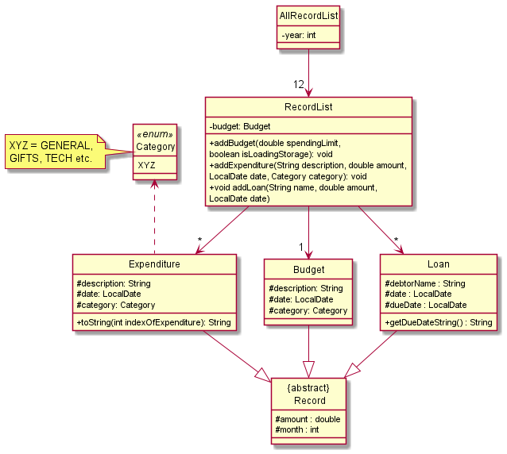
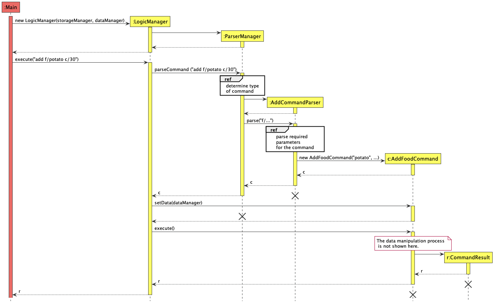
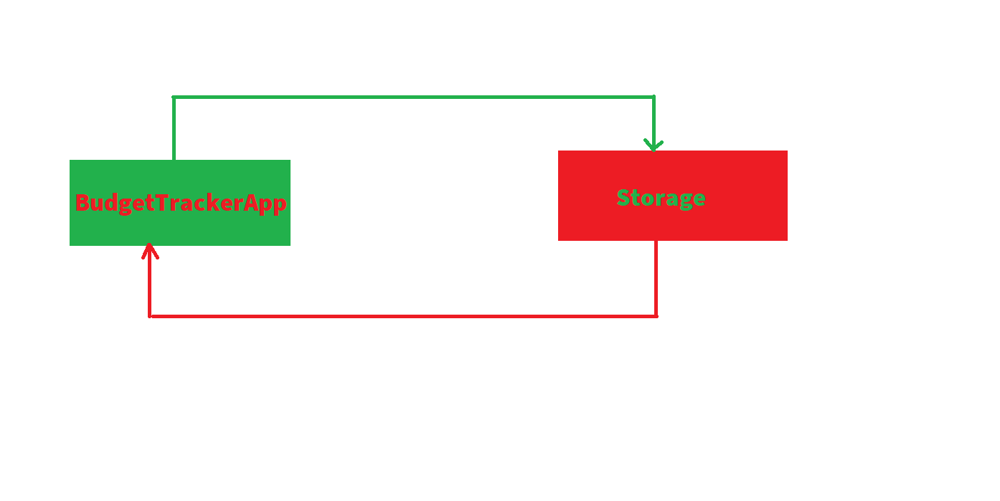
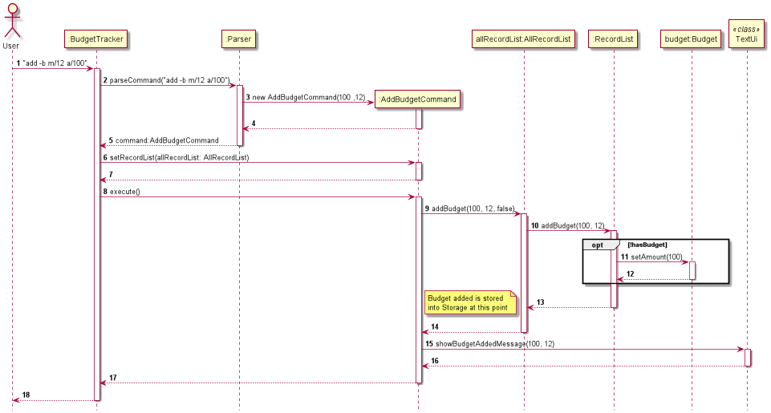
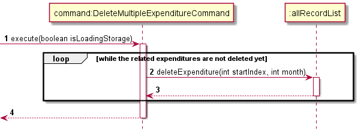
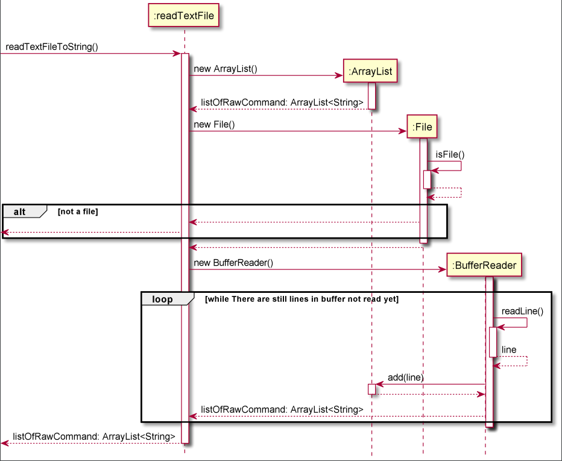
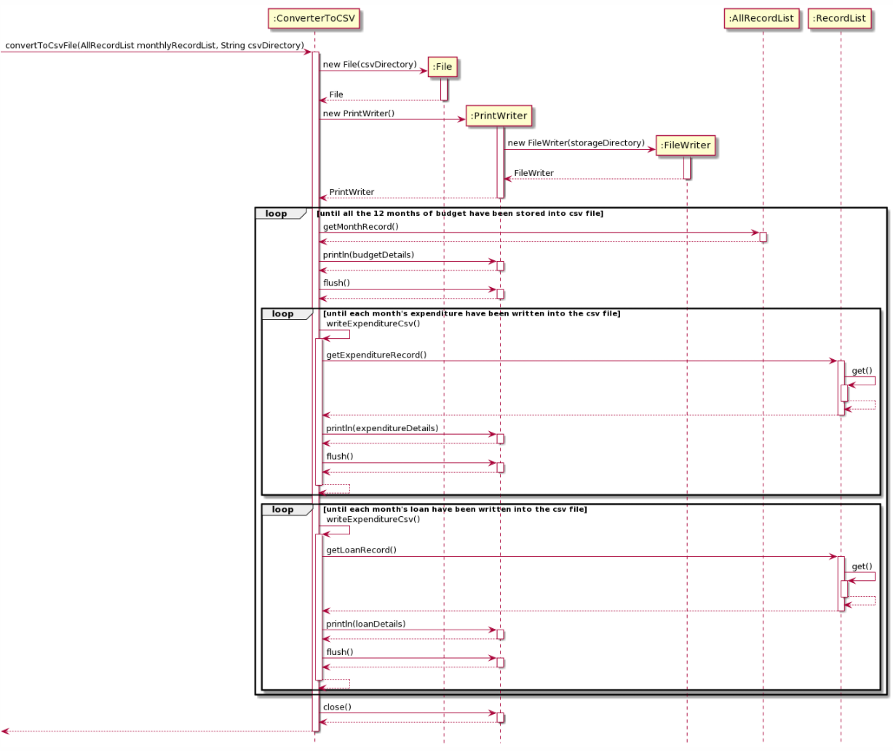

# Developer Guide

Budget Tracker is a desktop app for managing expenses, budget and loans, optimized for use via a Command Line Interface (CLI)
for tech-savvy students who have trouble keeping track of their expenses.


## Table of Content
* [Acknowledgements](#acknowledgements)
* [Getting started](#getting-started)
* [Design](#design)
  * [Architecture](#architecture)
  * [UI Component](#ui-component)
  * [Data Component](#data-component)
* [Implementation](#implementation)
  * [Delete feature](#delete-feature)
* [Product scope](#product-scope)
  * [Target user profile](#Target-user-profile)
  * [Value proposition](#value-proposition)
* [User Stories](#user-stories)
* [Non-Functional Requirements](#non-functional-requirements)
* [Glossary](#glossory)
* [Instructions for manual testing](#Instructions-for-manual-testing)

## <a id="acknowledgements"></a> Acknowledgements
* Inspiration for User Guide and Developer Guide: AddressBook (Level 3)
  * https://se-education.org/addressbook-level3/UserGuide.html
  * https://se-education.org/addressbook-level3/DeveloperGuide.html
* The ParserUtil class under our logic component was inspired from AddressBook (Level 3)'s [ParserUtil class](https://github.com/se-edu/addressbook-level3/blob/ba53b8cea3aa025d17094dbd6c541b046a5f5d7a/src/main/java/seedu/address/logic/parser/ParserUtil.java). We followed the same naming style but use our own unique methods.
  
{list here sources of all reused/adapted ideas, code, documentation, and third-party libraries -- include links to the
  original source as well}

## <a id="getting-started"></a> Getting started

### Setting up IDE and Repository

1) Forking and Cloning
Fork our repository from this [link](https://github.com/AY2122S1-CS2113T-F11-2/tp).
Then, clone your fork into your local computer. 

2) Editor
[Intellij](https://www.jetbrains.com/idea/download/download-thanks.html?platform=windows&code=IIC) 
is the recommended IDE to view and edit our source code. 

3) Configure JDK
Ensure that the correct version of JDK is downloaded and installed as our app is only tested on Java 11.
You may run the following command: `java -version` to check for the current Java version which your 
computer is running. If you are using Intellij, please check that your project structure's project 
SDK is set to Java 11 and Project Language Level is set to default SDK.


4) Adding Exception to your Anti-Virus
Add an exception to the directory which you will be cloning the forked project to your anti-virus.

5) Importing Project
Right click on the Repository folder that you have clone into your machine and select "Open Folder 
as Intellij IDEA Community Edition Project". When you are asked whether to trust and open gradle 
project, click trust. 


6) Verifying BudgetTracker Runs
Right click on BudgetTracker then click on run to test our BudgetTracker App. 


### Additional Considerations

_________________________________________________________
<br />

## <a id="design"></a> Design 

### Architecture


The ***Architecture Diagram*** given above explains the high-level design of the App.

Given below is a quick overview of main components and how they interact with each other.

**Main components of the architecture**

At app launch, **`BudgetTracker`** is in charge of initializing the components and linking them by passing some 
initialized components into others as parameters. 

For example, an initialized variable of `Data` is passed into an initialized variable of `Storage` for
the `Storage` component to load hard disk information into the data memory.

[**`Commons`**](#common-classes) consists of the exception classes for exception handling and messages used by other classes.

The rest of the App consists of four components.

* [**`UI`**](#ui-component): The User Interface of the App -- Reads User Input and displays queried data.
* [**`Logic`**](#logic-component): Parses User Input and executes the corresponding command.
* [**`Data`**](#data-component): Holds the data of the App in memory.
* [**`Storage`**](#storage-component): Reads data from, and writes data to, the hard disk.


**How the architecture components interact with each other**

The *Sequence Diagram* below shows how the components interact with each other for the scenario where the user issues the command `add -e m/1 a/500`.


<br />

### <a id="ui-component"></a> UI Component
**API**: [`ui.java`](https://github.com/AY2122S1-CS2113T-F11-2/tp/tree/master/src/main/java/seedu/budgettracker/ui)


The `Ui` component:
- Reads in user input from the Command Line Interface (CLI).
- Prints welcome screen, database information and messages prompting the user for input.
- Other components call methods in Ui class to print corresponding output on the terminal.

<br />

### <a id="data-component"></a> Data Component
Below is a partial class diagram that shows an overview of the `Data` component.


How `Data` component works:
 * Each instance of `AllRecordList` represents the year in which the user is working on and upon instantiation,
instantiates 12 instances of `RecordList` which is stored in a _Hashtable_. 
 * Each instance of `RecordList` stores the 
records `XYZ` (i.e. `Budget`, `Expenditure`, `Loan`) of a particular month.

 * All `XYZ` classes inherit from the `Record` class
as they have similar characteristics.

Given below is a more detailed class diagram showing the association between the `AllRecordList`,
the `RecordList`, and the `XYZ` Classes.



<br />

### <a id=""></a> Logic Component (Parser and Commands)

Figure 3. Structure of the program's logic

1. `BudgetTracker` uses `Parser` to parse user input into a `Command`.
2. This results in the creation of an `XYZParser` (where 'XYZ' represents 'AddBudget', 'EditLoan', etc.) which in turn creates a `XYZCommand`.
3. The `XYZCommand` being executed affects the `Data` component.
4. Additionally, during execution of `XYZCommand`, `Ui` (not shown) will display helpful messages to the user.

Given below is the Sequence Diagram for interactions with the Parser and Command components for the `parseCommand("add -b a/400")` call.

<br />


Figure 4. Sequence Diagram of program's logic with a `add -b a/400` call.

<br />

### <a id=""></a> Storage Component (Loading and Storing Data)

The Storage component consists of:

The `Storage` component:

1) What it does?
- During the first launch of the app, it creates a new current year database text file if there isn't any. 
It will load any existing data from the database text file into the app. 
- Allows user to change the database to the year he wants. 
- Allows the conversion of a database into CSV format so that the user can perform more sophisticated statistical analysis.
- Upon performing any commands that will change records in the database, such as `add`, `edit`, or `delete`,
Storage will reload the data in the app into the database text file. 

2) Architecture of the Storage component



The Storage component continuously save every changes to the data in the app and the app loads the 
data from storage everytime during start up.


- Initially, when BudgetTracker App is started, it will create new Parser and Storage object. Storage's 
makeStorageTextFile() method will be called to either create a new database text file of the current year
for example "2021.txt" if it does not exist, or it will load the existing "2021.txt" into the App by calling 
loadStorage() method of the Storage Class.
- Then a while loop will be initialized to check for User Input in the command line to check for user's 
command. Whenever any command that changes the data in the App is called such as `add`, `edit` and `delete` 
is called, reloadArrayToStorage() method of the WriteToTextFile class must be called to refresh the data text
file to the new state of the data in the App. 
- Then the loop will continue. For commands that will not change the data in the app such as `list`, `find`...
The reloadArrayToStorage() method will not be called. 

3) Class Diagram of the Storage component


- All the multiplicity of the BudgetTracker to Storage, Command and Parser are 1 to 1. 
- The multiplicity of Storage to ReadTextFile is 1 to 1. 
- The multiplicity of Command to WriteToTextFile is 1 to 1. 
- There is BudgetTracker consist of Storage, Command and Parser. Storage consist of ReadTextFile and Command
consist of WriteToTextFile. 

------------------------------------------------------
<br />

## <a id="implementation"></a> Implementation

<br />

### Add Feature
The add mechanism allows the user to add records into the Budget Tracker and is needed in order for basic functionality. 

This mechanism is facilitated by AllRecordList which extends from RecordList. It implements the following operations:

* _AllRecordList#addBudget()_  — Adds a budget to the record list.
* _AllRecordList#addExpenditure()_  —  Adds an expenditure to the record list.
* _AllRecordList#addLoan()_  — Adds a loan record to the record list.


These operations are exposed in the subclasses of the Command Class, specifically the _AddBudgetCommand#execute(), AddExpenditureCommand#execute()_
and _AddLoanCommand#execute()_ respectively.

Given below is an example usage scenario and how the add mechanism behaves at each step.

**Step 1.** The user launches the application for the first time. An instance of AllRecordList will be initialized in `BudgetTracker` class.

**Step 2.** The user executes `add ...`  to add a new record into the record list. The full command is passed into _Parser#parseCommand()_,
which parses the user input and identifies the type of record to be added based on the first prefix after add.

**Step 3.** Based on the type of record to be added, _Parser#parseCommand()_ returns an instance of _AddBudgetCommand,  AddExpenditureCommand_
or  _AddLoanCommand_ back to the main function. 

**Step 4.** The AllRecordList attribute of the returned *Command* instance is set to the currently initialized AllRecordList in _BudgetTracker_ class. 

**Step 5.** The _execute()_ function of the *Command* instance will then be called to add the record into the AllRecordList.

**Step 6.**

Below is a _sequence diagram_ which shows the calling of `add -b m/12 a/100` during **runtime**.



<br />

### <a id="delete-feature"></a> Delete feature

The delete feature collaborates with other classes like Parser, RecordList, etc. Basically it contains three usages which are deletion of Budget, Expenditure(s), and Loan(s).

For example, when user keys ```delete -b m/MONTH```, The Parser class will analyse the whole command, and extract “b/” and “MONTH”. Then the class DeleteBudgetCommand will execute the deletion by using recordList.deleteBudget(MONTH).

A more specific example with sequence diagram will be given at the end of this section.

Similarly, we have our Parser to parse the commands for deletion of expenditures and loans:
* ```delete -e m/MONTH``` — If there's no index value specified in the input, we use for loop to delete all expenditures within a month.
* ```delete -e m/MONTH i/INDEX``` — If the value at the position after ‘i/’ is an integer, we use DeleteSingleExpenditureCommand to delete this specific expenditure in this specific month.
* ```delete -e m/MONTH i/INDEX-INDEX``` — If the value at the position after ‘i/’ is a range of integers, we firstly use split[] to extract the starting and ending integers, and then we use DeleteMultipleExpenditureCommand to delete the expenditures in this range in this specific month. (also by using for loop)

<br/>

All the delete command classes (DeleteAllExpenditureCommand, DeleteSingleExpenditureCommand, DeleteMultipleExpenditureCommand, and DeleteBudgetCommand) extend from DeleteCommand class, and DeleteCommand class extends from Command class. Inside each command class, we have a constructor and an override function called execute to execute the specific deletion task assigned to them.

<br/>

Given below is an example usage scenario and how the delete feature behaves at each step.

<br/>

**Step 1**. The user launches the application for the first time.

**Step 2**. The user adds a budget and some expenditures to the current month.

**Step 3**. The user finds that the budget is a bit insufficient, thus the user wants to delete some expenditures.

**Step 4**. After consideration, the user decides to delete expenditure 3-5, so he keys ```delete -e m/10 i/3-5``` for Parser class to parse:
 * ```parseCommand(String userInput)``` specifies the user input as a delete command, then calls the method ```prepareDeleteCommand(String commandParams)``` inside the class.
 * By using substring method, description, indexes, and month of the expenditures are extracted in ```deleteParams```, ```prepareDeleteCommand(commandParams)``` calls ```DeleteExpenditureParser.parse(deleteParams)``` to parse the params more specifically.
 * Method ```parse(String args)``` in class ```DeleteExpenditureParser``` returns newly created object ```DeleteMultipleExpenditureCommand(startIndex, endIndex, month)```.

<br />

  

**Step 5**. The newly created object ```DeleteExpenditureCommand``` will execute the deletion:
* ```execute(boolean isLoadinStorage)``` runs a for loop to delete the related expenditures in the expenditure ArrayList.
* ```for(int i = startIndex; i <= endIndex; i++)``` iterates the 3 expenditures, everytime it just calls ```allRecordList.deleteExpenditure(startIndex, month)``` to delete each expenditure.

<br />

  

<br />

### <a id=""></a> Edit feature

The edit mechanism is facilitated by AllRecordList which extends from RecordList. It implements the following operations:
* ```AllRecordList#editBudget()``` — Edits a budget to the record list.
* ```AllRecordList#editExpenditure()``` — Edits an expenditure to the record list.
* ```AllRecordList#editLoan()``` —Edits a loan record to the record list.

<br/>

These operations are exposed in the ```EditBudgetCommand```, ```EditExpenditureCommand``` and ```EditLoanCommand``` classes, which extend from the ```Command``` subclass as ```EditBudget#execute()```, ```EditExpenditure#execute()``` and ```EditLoan#execute()``` respectively.

<br/>

Given below is an example usage scenario and how the ```edit``` mechanism behaves at each step.

<br/>

**Step 1**. The user launches the application for the first time. The ```AllRecordList``` will be initialized with the initial record list state.

**Step 2**. The user executes add …  to ```add``` a new record into the record list. The add command also calls Storage#saveToStorage(), causing a modified record list state to be saved into the storage file.

**Step 3**. The user now realises that there was a mistake in the record added, and decides to edit the record by executing the ```edit``` command. The edit command will call ```AllRecordList#edit…``` based on the record type.

<br />

### <a id=""></a> List Feature

The list feature works with `Parser`, `Recordlist` and `TextUi`, and allows users to see the listing of the budget and expenditures in either a specific month 
or the entire year.

When user keys ```list m/Month [c/CATEGORY]```, The Parser class will analyse the whole command, extract "m/", "MONTH", "c/" and "CATEGORY", analyse whether MONTH is an integer or “all”, and check whether CATEGORY has been assigned. The boolean isListAll will be assigned as true if the value after “m/” is “all”. Then the class ListRecordsCommand will execute the listing by using TextUi.showRecordsListView(recordList, MONTH, isListAll)).

Similarly, we have our Parser to parse the commands for listing of expenditures
* ```list m/Month [c/CATEGORY]``` — If the value at the position after ‘m/’ is an integer, we use hashtable to list the budget and all expenditures of a  specific month.
* ```list m/all [[c/CATEGORY]``` — If the value at the position after ‘m/’ is “all”, we use for loop to list all the budget and expenditures of every month.

Given below is an example usage scenario and how the list feature behaves at each step.

**Step 1**. The user launches the application for the first time.

**Step 2**. The user adds a budget and some expenditures to the current month.

**Step 3**. The user forgets what the budget and expenditures added, thus the user wants to see the budget and the list of the expenditures.

**Step 4**. After consideration, the user decides to see the budget and list of May, so he keys ```list m/5```

**Step 5**. The Parser starts to parse the command, it extracts month 5. As this is a specific month to be listed, the Parser class calls ListRecordsCommand to work. By finding May, the expenditures list and budget of May are successfully found and prints out a showRecordsListView from TextUi class.

<br />

### <a id=""></a> Storage 

1) How is the data stored?

The storage stores the exact `add` command of budget, expenditures and loan into the text 
file containing in the current AllRecordList. Everytime a deleted, edit or add command is called, 
the txt file is automatically wiped and re-written from the ArrayList to ensure that data is saved 
at every step. 


2)  Why is the data stored in such a manner?

The reason it is implemented in this manner is so that we could reuse code that have been written 
for adding of budget and expenditures directly when loading from storage.

This implementation makes `Storage` very versatile even when there are substantial changes in 
the architecture of our app. Some examples are the changes to `Parser` and `Commands`. 
Even with changes to these classes, `Storage` needs very little tweaks for it 
to work with the new implementation. 

The reason is that `Storage` uses the code in `Parser` to load the data into the app. 
For the saving of data, only the reloading method needs to be edited to adhere to the 
new changes such that the add command stored is of the correct format.

The way the database is organized is that each yearly Records is stored in the form of 
_YYYY.txt_. Each year contains all the monthly budget as well as all the expenditure and 
loan tied to that month. 

3)  How do some key methods work?

`readTextFileToString()`



This method reads the list of command in the data text file converts them into 
a ArrayList of String. _readTextFileToString()_ method will first create a new ArrayList 
which will later be used to store all the commands in the data text file into 1 Strings 
per command. A BufferReader object is then created to read the data text file in the 
specified directory. The BufferReader object will read the content of the data text file 
line by line or command by command (since each command is separated by a "\n" character).

The BufferReader continues reading until the end of the data text-file and then returns the 
filled ArrayList of String. 

This ArrayList of String will later be passed into the `Logic` component which will parse and execute all the 
commands, thus loading data into the App.

`reloadArrayToStorage() & convertToCsvFile()`




When _reloadArrayToStorage()_ method is called, it creates a new File object into the specified directory
(file directory to reload data files). The _isFile()_ method of the File Class is called to check if the data file
exist. If it doesn't, a error message will be shown to the user and the method terminates. Otherwise, it 
continues to create a new FileWrite object which will clear the existing data text file first. The FileWrite 
object will then be passed into the new PrintWriter object that will be created. 

Next, a for loop is used to loop through the 12 months of the RecordList to obtain the amount for each
month and convert it into a command such as `add -b a/1000.00 m/10`. Each of these command will be "flush" into 
the text file with 1 line per command. 

2 inner for loops are used to loop through all the expenditure and loan of a particular month respectively and 
convert them into their respective add commands. For example, `add -e n/Chicken Rice a/100.0 d/2021-10-10 c/FOOD` or 
`add -l n/Benjamin a/1000.00 d/2021-10-27`.

Both _reloadArrayToStorage()_ and _convertToCsvFile()_ methods are similar in the way they read 
data from the App and save it into the data files. The main difference lies is on the type of file they
save into. _reloadArrayToStorage()_ saves into _".txt"_ type files while _convertToCsvFile()_ saves into 
_".csv"_ type files. 

4) Why does `edit` and `delete` command work with reloadArrayToStorage() method? 

`edit` command can change the attribute of budget, expenditure and loan such as description, amount... 
Reloading the data text files after the `edit` will just update the `add` command attribute's value to their
attribute's value after the edit. That is the reason why it _reloadArrayToStorage()_ can still work. 

`delete` command on the other hand just removes a particular budget, expenditure or loan entry. Thus
reloading the data text files after the `delete` command will just remove a particular `add` line 
of command from the data text file. 

5)How does switching database work?

When the `year <SELECTED DATABASE YEAR>` command is called eg. `year 2020`, the Parser will 
call the YearCommand, and it will run the _execute()_ method. _execute()_ first clears the 
allRecordList by calling _clearAll()_ from the AllRecordList class followed by _setYear(2020)_ method 
to set the year to 2020. Then. the _loadStorage()_ method of Storage Class will be called to load 
the datafile _"2020.txt"_ into the app.  

## <a id=""></a> List of Commands

## <a id=""></a> Appendix A: Product scope

### <a id=""></a> Target user profile

- has a need to manage a significant number of expenditures
- prefer desktop apps over other types
- can type fast
- prefers typing to mouse interactions
- is reasonably comfortable using CLI apps

### <a id=""></a> Value proposition

This application allows users to record and track expenses more conveniently,
and thereby encourages them to have greater control over their finances.

## <a id=""></a> Appendix B: User Stories

|Version| As a ... | I want to ... | So that I can ...|
|--------|----------|---------------|------------------|
|v1.0|student|record/add my outgoing and incoming expenses|track my expenses, see how I spent my money and I can also learn how to plan and manage my money wisely.|
|v1.0|financially handicapped|see my spendings over a period of time|won’t overspend.|
|v1.0|user|delete my spending records|remove unwanted or incorrect records.|
|v1.0|user|set a budget target|see whether my spendings exceeds my budget.|
|v1.0|financially strained student|view my budget target|know the limit to not overspend.|
|v1.0|user|delete my budget target|discard incorrect budget entries.|
|v1.2|new user|see a list of available commands so that I know how to use the APP|like a help list similar to cmd’s “help” command|
|v1.2|user|record down the money I have lent out to the correspondents|take note of who to collect money from.|
|v1.2|user|see the amount of money I have loaned out and to whom I have loaned it to |track who owe me money.|
|v2.0|analytical person|see the specifics on the statistics of when I spent too much on what exactly|make an amendment to my habits. / As a user trying to cut down on my expenses, I want to see the category(s) which I have spent the most money on in the past 3/6months so that I can cut down on those expenses.|
|v2.0|budget minded person|see the stats (mean, sd, median… of my yearly expenditure) of my overall expenditure and overall net income|know when to cut down on expenses|
|v2.0|person who always overspends|a warning on overspending|be more mindful and be reminded not to overspent my money.|
|v2.0|user|categorize my spendings|see what I spend most money on|
|v2.0|user|analyze my spendings with a chart|get my spendings components in a more direct and easier way|

## <a id=""></a> Appendix C: Non-Functional Requirements

**1**. Should work on any mainstream OS as long as it has Java 11 or above installed.
<br/> **2**. 
{Give non-functional requirements}

## <a id=""></a> Appendix D: Glossary

* *Mainstream OS*: Windows, Linux, Unix, OS-X

## <a id=""></a> Appendix E: Instructions for manual testing

{Give instructions on how to do a manual product testing e.g., how to load sample data to be used for testing}
