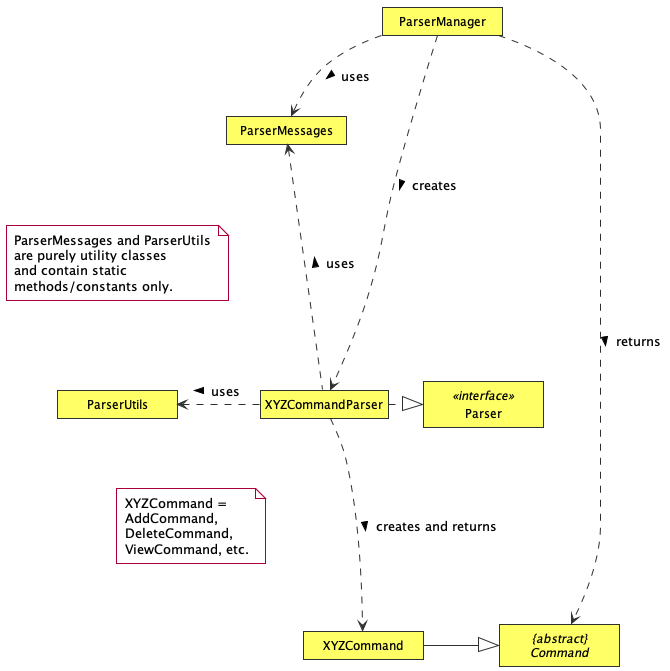

# Developer Guide

## Acknowledgements

Third party library used: GSON under Apache License 2.0

## Design 

### Architecture

The ***Architecture Diagram*** given above explains the high-level design of the App.

Given below is a quick overview of main components and how they interact with each other.

**Main components of the architecture**

`Main` is responsible for initialising the different components correctly at app launch, and connecting them with one another.

`Commons` represents a collection of classes used by multiple components.
The major classes in `Commons` are `Trip`, `Expense` and `Person`.  
Further elaboration on these classes will be in the following sections later.

The remaining components are as follows:

`Ui`: The User Interface of the App.

`Parser`: The command handler and executor. Holds the main logic for handling any command.

`Storage`: Holds the data of the App in memory, and also reads and writes data to the hard disk.

**How the architecture components interact with one another**

The ***Sequence Diagram*** below shows a brief overview of how the components interact with each other.
For this particular interaction, the user has issued the command
`create` with the correct input parameters.

The sections below provide more details of the components and classes in them.

### `Trip` Class

The `Trip` class contains attributes storing the details of trips added by the user, 
and is a container class for the expenses (each expense being represented by an 
instance of the `Expense` class) and persons (each person being represented by an 
instance of the `Person` class) tagged to the trip.

A trip is created when the `Parser` class calls its `executeCreate()` method to instantiate 
a new instance of `Trip`. The newly-created trip is then added to the `ArrayList<Trip>` 
in the Storage class

Although the program is able to store zero trips, in order for it to work at any appreciable level,
there must be at least one trip added by the user (either through input or through loading from the
save file) in order for any other features to be available. If there are no trips added, the program 
will repeatedly prompt the user to add a new trip.

### `Person` Class
Below details the UML diagram for the `Person` class.

The  Person Class,
Represents an individual that participated in an expense or a whole trip.
* A user-defined amount of `Person` objects will be created by the user during the create function of the `Trip` Class.
* Every time an object is created of the `Expense` Class, the user may define the people who were involved in the expense, however the people who are added to the expense must be already a `Person` object in the `Trip` object that the expense was made.
* One `Person` object who was involved in the expense will then be appointed as the payer of the group, the user will then have to indicate how much (in foreign currency) each of the participating persons spent for that particular expense. This is then stored and updated in each of the respective `Person` object’s `moneyOwed` HashMap,  where a positive double refers to how much the person owes the respective Person object (i.e. the key of the HashMap) and a negative double refers to how much the Person object (i.e. the key of the HashMap) owes to that instance of the Person object.
  * Example: If the HashMap = {person2 = 22, person3 = -11} in the person1 object, then person1 owes person2 $22 and person3 owes person1 $11.

### `Ui` Class

The `Ui` class handles everything that the user sees, which includes exception handling messages, outputs to users and feedback.

`Ui` class consists of multiple print methods, where some are listed above in the UML diagram. `Ui` depends on other classes, 
such as `Storage`, `Parser`, `Trip` and `Expense` to obtain information stored in these classes.

The `Ui` class,
- Obtains information from Storage, Parser, Trip and Expense components.
- Prints the information through the terminal.

### `Parser` Class

The `Parser` class handles all input and executes the corresponding actions based on the user input. 
It consists of methods that will execute commands that is input by the user which is crucial to the functionality 
of our program.

`Parser` depends on other classes for the respective inputs and outputs.`Duke` calls the `Parser` class in order for the 
necessary commands to be executed. However, not all functionality is stored here. Rather, `Parser` acts like an interface 
that handles all the logic required to pass in the correct information into the different classes to execute.

The following partial class diagram depicts the relation of the Parser class with other classes that it interacts wtih.

The `Parser` class,
- Reads in the user input and determines if the command entered is valid.
- Parser class will then pass it to the abstract class CommandHandler which will then pass it to CommandExecutor, any 
exceptions thrown here will be caught by the CommandHandler.
- The CommandExecutor will then execute the commands provided with the relevant method calls from the other classes in the 
program, again if there is an exception thrown at this stage, it will be caught in the CommandHandler class.

The following partial sequence diagram dictates the flow of events when the user enters a command into the program.

### `Expense` Class
The `Expense` class deals with most functionalities related to adding an expense inside a trip. The sequence diagram below shows how an expense is initialised.

When `Parser` calls the `executeExpense` method, it creates an expense object, and also calls the `promptDate` method to set that expense object’s date. `promptDate` calls `isDateValid` to validate user input.

### `Storage` Component

The `Storage` component consists of two classes - the `Storage` class, which stores data for the current instance of the program,
and `FileStorage` class, which interacts with the save file.

The interaction between the two classes is illustrated in the diagram below:

(insert diagram)

- The `Storage` class stores the user data after it has been read from the save file. It also stores the list of supported 
currencies, the current open trip (set to `null` if there is no open trip), and the trip which the user last interacted with and
(set to `null` if the trip was deleted).
- The `FileStorage` class contains methods to read from and write to a save file, and to create a new save file.

The sequence diagram illustrating the process of reading from a save file is below:

The sequence diagram illustrating the process of writing to a save file is below:

#### `FileStorage` implementation

The  Gson library we use to serialise and deserialise data to and from the JSON format tdoes not properly parse LocalDate
objects, given that LocalDate cannot be directly instantiated. As a result, using the default implementation of Gson 
to serialise LocalDate causes an `InaccessibleObjectException` when attempting to deserialise a LocalDate object. To overcome
this, we implemented a custom serialiser and deserialiser specifically for LocalDate, adapted from the Gson User Guide 
[here](https://github.com/google/gson/blob/master/UserGuide.md#TOC-Custom-Serialization-and-Deserialization).

The custom serialiser and deserialiser is implemented as inner classes within the `FileStorage` class.

The code for the custom serialiser is:

The code for the custom deserialiser is:

## Appendix: Requirements

### Target user profile

{Describe the target user profile}

### Value proposition

{Describe the value proposition: what problem does it solve?}

### Appendix A: Product scope

### Appendix B: User Stories

|Version| As a ... | I want to ... | So that I can ...|
|--------|----------|---------------|------------------|
|v1.0|new user|see usage instructions|refer to them when I forget how to use the application|
|v2.0|user|find a to-do item by name|locate a to-do without having to go through the entire list|

### Appendix C: Non-Functional Requirements

{Give non-functional requirements}

### Appendix D: Glossary

* *glossary item* - Definition

### Appendix E: Instructions for manual testing

{Give instructions on how to do a manual product testing e.g., how to load sample data to be used for testing}
