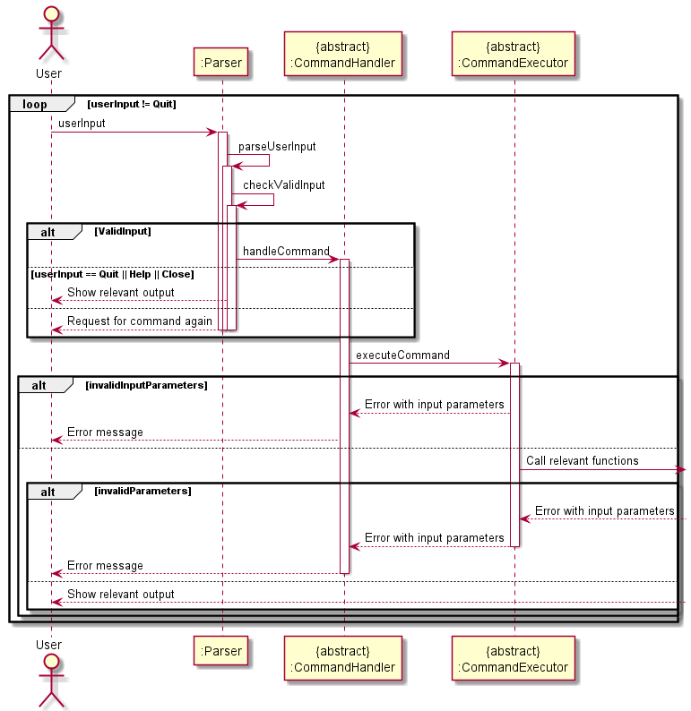

# Developer Guide

## Acknowledgements

Third party library used: GSON under Apache License 2.0 (repo [here](https://github.com/google/gson))

## Design 

### Architecture


The ***Architecture Diagram*** given above explains the high-level design of the App.

Given below is a quick overview of main components and how they interact with each other.

**Main components of the architecture**

`Main` is responsible for initialising the different components correctly at app launch, and connecting them with one another.

`Commons` represents a collection of classes used by multiple components.
The major classes in `Commons` are `Trip`, `Expense` and `Person`.  
Further elaboration on these classes will be in the following sections later.

The remaining components are as follows:

`Ui`: The User Interface of the App.

`Parser`: The command handler and executor. Holds the main logic for handling any command.

`Storage`: Holds the data of the App in memory, and also reads and writes data to the hard disk.

**How the architecture components interact with one another**

The ***Sequence Diagram*** below shows a brief overview of how the components interact with each other.
For this particular interaction, the user has issued the command
`create` with the correct input parameters.


The sections below provide more details of the components and classes in them.


### `Trip` Class

The `Trip` class contains attributes storing the details of trips added by the user, 
and is a container class for the expenses (each expense being represented by an 
instance of the `Expense` class) and persons (each person being represented by an 
instance of the `Person` class) tagged to the trip. The class diagram below illustrates
the interactions of the `Trip` class with other classes.


A trip is created when the `Parser` class calls its `executeCreate()` method to instantiate 
a new instance of `Trip`. The newly-created trip is then added to the `ArrayList<Trip>` 
in the Storage class.

Although the program is able to store zero trips, in order for it to work at any appreciable level,
there must be at least one trip added by the user (either through input or through loading from the
save file) in order for any other features to be available. If there are no trips added, the program 
will repeatedly prompt the user to add a new trip.

The sequence diagram below shows what happens when the user creates a new trip. If a duplicate
trip is input, the app will confirm with the user if he/she wishes to add the duplicate trip.


### `Person` Class
Below details the UML diagram for the `Person` class.


The  Person Class,
Represents an individual that participated in an expense or a whole trip.
* A user-defined amount of `Person` objects will be created by the user during the create function of the `Trip` Class.
* Every time an object is created of the `Expense` Class, the user may define the people who were involved in the expense, however the people who are added to the expense must be already a `Person` object in the `Trip` object that the expense was made.
* One `Person` object who was involved in the expense will then be appointed as the payer of the group, the user will then have to indicate how much (in foreign currency) each of the participating persons spent for that particular expense. This is then stored and updated in each of the respective `Person` object’s `moneyOwed` HashMap,  where a positive double refers to how much the person owes the respective Person object (i.e. the key of the HashMap) and a negative double refers to how much the Person object (i.e. the key of the HashMap) owes to that instance of the Person object.
  * Example: If the HashMap = {person2 = 22, person3 = -11} in the person1 object, then person1 owes person2 $22 and person3 owes person1 $11.

### `Ui` Class

The `Ui` class handles everything that the user sees, which includes feedback, error messages, user prompts, and displaying help. All of Ui's methods are static, and are meant to be called by other classes.

<br />

**Methods of 'Ui' can be broadly categorised into 2 types:**
1. Error and feedback messages, which do not contain references to other classes, and are mainly `System.out.println` statements.
   
2. Methods that calculates and prints the state of the program. These methods contain references 
   to other classes, and may require input parameters. An example will be 
   `public static void printAmount(Person person, Trip trip)`, which generates the total amount 
   spent and the repayment instructions for `person` in that `trip`.

<br />

The `help` command is implemented by `Ui.displayHelp()`, and has 3 different states, as shown in the diagram below:


### `Parser` Class

The `Parser` class handles all input and executes the corresponding actions based on the user input. 
It consists of methods that will execute commands that is input by the user which is crucial to the functionality 
of our program.

`Parser` depends on other classes for the respective inputs and outputs.`Duke` calls the `Parser` class in order for the 
necessary commands to be executed. However, not all functionality is stored here. Rather, `Parser` acts like an interface 
that handles all the logic required to pass in the correct information into the different classes to execute.

The following partial class diagram depicts the relation of the Parser class with other classes that it interacts with:


The `Parser` class,
- Reads in the user input and determines if the command entered is valid.
- Parser class will then pass it to the abstract class CommandHandler which will then pass it to CommandExecutor, any 
exceptions thrown here will be caught by the CommandHandler.
- The CommandExecutor will then execute the commands provided with the relevant method calls from the other classes in the 
program, again if there is an exception thrown at this stage, it will be caught in the CommandHandler class.

The following partial sequence diagram dictates the flow of events when the user enters a command into the program.



### `Expense` Class
The `Expense` class deals with most functionalities related to adding an expense inside a trip. The following partial class diagram
shows the interactions between the `Expense` class and other classes and interfaces.


The `Expense` class,
- Stores amount spent
- Stores description
- Stores category
- Stores persons involved

The sequence diagram below shows how an expense is initialised.


When `CommandExecutor` calls the `executeCreateExpense()` function, the open trip will be retrieved, and an expense will be initialized.
During the initialization fo a new `Expense`, the amount spent for the expense is set using `setAmountSpent()`, the category is set
using `setCategory` and the date of the `Expense` is being prompted using `promptDate()`. 

In `promptDate()`, the date is checked if it is valid and will only return if it is. Otherwise, the program will keep prompting the user.

If no date is entered, `LocalDate` will return the date which the user entered the expense. 
Otherwise, `LocalDate` will parse the date according to the given format.

If there is only 1 `Person` in the expense, then `Expense` will call the corresponding methods in `ExpenseSplitter`. `CommandExecutor` will
call `addExpense()` and `setLastExpense` to add the expense to the trip and set it as the last expense added. Then, a success message is printed using
`printExpensesAddedSuccess()` of `Ui`.


### `Storage` Component

The `Storage` component consists of two classes - the `Storage` class, which stores data for the current instance of the program,
and `FileStorage` class, which interacts with the save file.

The interaction between the two classes is illustrated in the diagram below:


- The `Storage` class stores the user data after it has been read from the save file. It also stores the list of supported 
currencies, the current open trip (set to `null` if there is no open trip), and the trip which the user last interacted with and
(set to `null` if the trip was deleted).
- The `FileStorage` class contains methods to read from and write to a save file, and to create a new save file.

The sequence diagram illustrating the process of reading from a save file is below:


The sequence diagram illustrating the process of writing to a save file is below:


#### `FileStorage` implementation

The Gson library we use to serialise and deserialise data to and from the JSON format does not properly parse LocalDate
objects, given that LocalDate cannot be directly instantiated. As a result, using the default implementation of Gson 
to serialise LocalDate causes an `InaccessibleObjectException` when attempting to deserialise a LocalDate object. To overcome
this, we implemented a custom serialiser and deserialiser specifically for LocalDate, adapted from the Gson User Guide 
[here](https://github.com/google/gson/blob/master/UserGuide.md#TOC-Custom-Serialization-and-Deserialization).

The custom serialiser and deserialiser is implemented as inner classes within the `FileStorage` class.

## Appendix: Requirements

### Appendix A: Product scope

**Target user profile**
- Students who are travelling overseas and sharing expenses with a group
- Comfortable with CLI desktop apps
- Prefers typing to mouse interaction for data input

**Value proposition**
- Suitable for batch input of expenses
- PayMeBack data is in JSON, which is lightweight and easily transferable

### Appendix B: User Stories

| As a ... | I want to ... | So that I can ...|
|----------|---------------|------------------|
New user|See help instructions|refer to them when I forget how to use the application
User|See my nett expenses|I can manage my budget
User|Enter my name|I can keep track of whose expenses it is
User|Enter names of other people|I can track who I went where with
User|Enter the category of my expenses|I can see how much I spent in certain areas
User|Enter the location of my expenses|I can see where I spent my money
User|Edit the location|I can change the location later on if i need to be more specific
User|Enter the exchange rate of the currency of country I am visiting|I can repay people back in my local currency correctly
User|Filter the expenses based on categories|I can better categorise my own spending
User|Filter the expenses based on who is involved|I can better settle expenses with individual person(s)
User|Start a new trip and save the previous one|I can record all my travels
User|Delete wrong entries|In case I added something wrongly
User|Delete whole trips|In case I don’t want to remember the trips
User|See history of my expenses, classified into trips|I can have a record to refer to
User|Display total amount spent in local and foreign currency|For accounting purposes
User|Know how much my friends has to pay me at the end of the trip|I will not go broke
User|Cancel an operation instead of re-entering my data when prompted|save time and run other commands immediately


### Appendix C: Non-Functional Requirements

- The app should work on all mainstream OSes (Windows, macOS, Linux) with Java 11 or later installed.
- The app should be able to store 1000 trips, each with 1000 expenses, without any noticeable slowdown in performance.
- A user with an above-average typing speed in English should be able to complete tasks on the app quicker than using a 
GUI.
- The app should be able to handle corrupted save files.
- An advanced user should be able to manipulate the save file directly, and the app must be able to handle this scenario
without error.


### Appendix D: Instructions for manual testing

#### Setting up

1. Ensure that you have Java 11 or above installed.
2. Download the latest version of `PayMeBack` from [here](https://github.com/AY2122S1-CS2113T-T12-2/tp/releases),
   and move the downloaded file to your preferred folder.
3. Open any command-line application (such as Terminal, Command Prompt, or Powershell) and navigate to the folder
   containing your downloaded copy of `PayMeBack`.
4. In the command-line interface, type `java -jar PayMeBack.jar`.
5. If the program starts successfully, you should see the following on your screen:


```
Welcome to
    ____              __  ___     ____             __  
   / __ \____ ___  __/  |/  ___  / __ )____ ______/ /__
  / /_/ / __ `/ / / / /|_/ / _ \/ __  / __ `/ ___/ //_/
 / ____/ /_/ / /_/ / /  / /  __/ /_/ / /_/ / /__/ ,<   
/_/    \__,_/\__, /_/  /_/\___/_____/\__,_/\___/_/|_|  
            /____/                                     

```


#### Manual Testing

The following is a non-exhaustive list of common commands that may be used to operate the program, and
the expected behaviour for each. For more information on commands, please refer to the [User Guide](https://ay2122s1-cs2113t-t12-2.github.io/tp/UserGuide.html).

#### Creating Trip

- `create` syntax with missing attribute (e.g. missing date `create /USA /USD /0.74 /ben, jerry`)
<br>
Expected: an error message shows, providing the input syntax for creating a trip.


- `create` syntax with incorrect type/format (e.g. incorrect date format `create /USA /hello /USD /0.74 /ben, jerry`)
  <br>
  Expected:
  - For some errors, the program will prompt the user to correct the input for that attribute on the spot.
  - For other errors, the program will display an error message, and the user will need to re-enter the full command again.

- `create` with a new trip with the same attributes as an already existing trip.
<br>
Expected: the program will warn the user, and asks for confirmation from the user on whether to add the duplicate trip.

#### Opening and deleting trip 

- `open` or `delete` with an incorrect trip number (wrong format/trip number doesn't exist 
e.g. `open something` or `delete 1000` when only 2 trips are stored.)
<br>
Expected: An error will inform the user that the trip number does not exist.

#### Editing trip

- `edit` syntax with incorrect or missing attribute (e.g. edit 1 -location).
<br>
Expected: An error will inform the user, providing the input syntax for editing a trip.

#### Viewing summary of expenses

- `summary` with a random string or a name that does not exist in the trip
e.g. 'summary abcdefg' or 'summary %32!3'.
<br>
Expected: An error will inform the user that the string or name does not exist in the trip.

#### Creating expenses
- Create an expense inside a trip. When prompted for date, enter an input like `testing123`, or enter an invalid date like `31-02-2021`
  <br>
  Expected: Program will prompt you to re-enter date in DD-MM-YYYY format.

- Create an Expense with the people with identical names (case-insensitive). e.g. `expense 2113 food duke, dUkE /nice dinner`.
  <br>
  Expected: An error will inform the user that they have entered people with the same name.

- Create an Expense with invalid parameters (negative, zero or non-number). e.g. `expense -2113 category Duke, Duke2 /description` or
  `expense 0 category Duke, Duke2 /description` or `expense notNumber cateogry Duke, Duke2 /description`.
  <br>
  Expected: An error will inform the user that the amount is invalid and request the user to enter the amount again.

#### Viewing and deleting expenses

- `view` and `delete` with an invalid expense number (wrong format/trip number doesn't exist).
  e.g. `view something` or `delete 1000` when only 2 expenses are added.
  <br>
  Expected: An error will inform the user that the expense number does not exist.

- `view last` and `delete last` when you have already deleted your most recent expense.
e.g. `delete last` followed by `delete last` or `view last`.
<br>
Expected: An error will inform the user that they have no recently added an expense.
