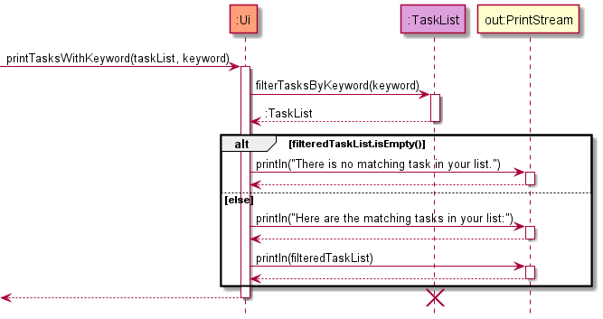

# Developer Guide

## Table of contents

* [Acknowledgements](#acknowledgements)
* [Setting up, getting started](#setting-up-getting-started)
* [Design](#design)
    * [Architecture](#architecture)
    * [UI component](#ui-component)
    * [Logic component](#logic-component)
    * [Model component](#model-component)
    * [Storage component](#storage-component)
    * [Common classes](#common-classes)
* [Documentation, logging, testing, configuration, dev-ops](#documentation-logging-testing-configuration-dev-ops)
* [Implementation](#implementation)
    * [Saving data](#saving-data)
    * [Loading data](#loading-data)
    * [Save file formatting](#save-file-formatting)
* [Appendix: Requirements](#appendix-requirements)
    * [Product scope](#product-scope)
    * [User stories](#user-stories)
    * [Use cases](#use-cases)
    * [Non-Functional Requirements](#non-functional-requirements)
    * [Glossary](#glossary)
* [Appendix: Instructions for manual testing](#appendix-instructions-for-manual-testing)

## Acknowledgements

{list here sources of all reused/adapted ideas, code, documentation, and third-party libraries -- include links to the original source as well}

## Setting up, getting started

Prerequisites: JDK 11 (use the exact version), update Intellij to the most recent version.

1. **Ensure Intellij JDK 11 is defined as an SDK**, as described [here](https://www.jetbrains.com/help/idea/sdk.html#set-up-jdk) -- this step is not needed if you have used JDK 11 in a previous Intellij project.
  * In the same dialog, you _may_ have to set the Project language level field to the SDK default option.

2. **Import the project _as a Gradle project_**, as described [here](https://se-education.org/guides/tutorials/intellijImportGradleProject.html).


3. **Verify the setup**: After the importing is complete, locate the `src/main/java/seedu/duke/Duke.java` file, right-click it, and choose `Run Duke.main()`. If the setup is correct, you should see something like the below:

```
> Task :compileJava UP-TO-DATE
> Task :processResources UP-TO-DATE
> Task :classes UP-TO-DATE

> Task :Duke.main()
    _______________________________________________________________________________
     I can't retrieve the saved task data. Creating new file..
    _______________________________________________________________________________

    _______________________________________________________________________________
     I can't retrieve the saved lesson data. Creating new file..
    _______________________________________________________________________________

    _______________________________________________________________________________
     I can't retrieve the saved module data. Creating new file..
    _______________________________________________________________________________

    _______________________________________________________________________________
       _   _       _   _   ____           ____     _   _   ____     ____   __   __ 
      | \ |"|   U |"|u| | / __"| u     U | __")uU |"|u| | |  _"\   |  _"\  \ \ / / 
     <|  \| |>   \| |\| |<\___ \/       \|  _ \/ \| |\| |/| | | | /| | | |  \ V /  
     U| |\  |u    | |_| | u___) |        | |_) |  | |_| |U| |_| |\U| |_| |\U_|"|_u 
      |_| \_|    <<\___/  |____/>>       |____/  <<\___/  |____/ u |____/ u  |_|   
      ||   \\,-.(__) )(    )(  (__)     _|| \\_ (__) )(    |||_     |||_ .-,//|(_  
      (_")  (_/     (__)  (__)         (__) (__)    (__)  (__)_)   (__)_) \_) (__) 
    _______________________________________________________________________________

```

4. Follow [this guide](https://se-education.org/guides/tutorials/intellijCodeStyle.html) to set up Intellij IDEA to the coding style that matches ours.

## Design

### Architecture


The **Architecture Diagram** given above explains the high-level design of the App.

Given below is a quick overview of main components and how they interact with each other.

**Main components of the architecture**

`Main` has two classes called `Duke` and `DukeException`.

`Duke` is responsible for:
* **At app launch:** Initializes the components in the correct sequence, and connects them up with each other.
* **At shut down:** Shuts down the components and invokes cleanup methods where necessary.

`DukeException` is responsible for:
* Manages Duke-related exceptions.

`Commons` represents a collection of classes used by multiple other components.

The rest of the App consists of four components.
* `UI`: The UI of the App.
* `Logic`: The parser and command executor.
* `Model`: Holds the various data structures of the App.
* `Storage`: Reads data from, and writes data to, the hard disk.

**How the architecture components interact with each other**

The **Sequence Diagram** below shows how the components interact with each other for the scenario where the 
user issues the command `add task homework -d mon`.


### UI component
**API** : [`Ui.java`](https://github.com/AY2122S1-CS2113T-W11-3/tp/blob/master/src/main/java/seedu/duke/ui/Ui.java)

The `Ui` component contains:
* the method `readUserResponse()` to read from the standard input.
* methods to print messages as strings to the standard output.
* constant strings, such as `LINE` and `PADDING`, which are used to format the printed messages.

The methods in the `Ui` component may call methods from `TaskList`, `LessonList` or `ModuleList` to get information from the respective components.


#### Printing tasks containing a keyword:


### Logic component

Here is the class diagram of the `Logic` component:


> 📝 **Note:** XYZ is a placeholder for specific command name (e.g., AddModuleCommand).

How the `Logic` component works:

* When `Logic` is called upon to execute a command, it uses the `Parser` class to parse the user command.
* This results in a `Command` object (more precisely, an object of one of its subclasses e.g., 
  AddModuleCommand) which is then executed.
* The `Command` can communicate with the `Model` class when it is executed (e.g. to add a module).
* If the operations above are successful, the `Command` will save the `Model` data by using the `Storage` class.
* The result is then printed to user by the `Ui` class.

### Model component

The `model` package consists of three components: `Lesson`, `Task` and `Module`.

#### Lesson component

**API** : [`Lesson.java`](https://github.com/AY2122S1-CS2113T-W11-3/tp/blob/master/src/main/java/seedu/duke/model/lesson/Lesson.java)


The `Lesson` component
* stores data specific to a lesson as entered by the user 
* stores all `Lesson` objects created by user commands in a `LessonList` object
* does not depend on any of the other three components

#### Module component

**API** [`Module.java`](https://github.com/AY2122S1-CS2113T-W11-3/tp/blob/master/src/main/java/seedu/duke/model/module/Module.java)


The `Module` component,
* stores information regarding modules added by the user and on the NUSMods API
* does not depend on any of the other three components
* `FullModuleList` stores all `Module` objects corresponding to the modules found on NUSMods
* `ModuleList` stores all user-added `Module` objects

#### Task Component

**API** [`Task.java`](https://github.com/AY2122S1-CS2113T-W11-3/tp/blob/master/src/main/java/seedu/duke/model/task/Task.java)


The `Task` component,
* stores data specific to a task as entered by the user
* stores all `Task` objects as created by user commands in a `TaskList` object
* does not depend on any of the other three components

### Storage component

**API** : [`Storage.java`](https://github.com/AY2122S1-CS2113T-W11-3/tp/blob/master/src/main/java/seedu/duke/storage/Storage.java)  

The `Storage` component makes use of the serializing methods in the `TaskList`, `LessonList`, and `ModuleList` classes to save data to the `data` folder.
It also reads data from a given path into strings which can be utilized by those 3 list classes to create a list.

The `Storage` component has methods that:
* create the files `task.txt`, `lesson.txt`, `module.txt` in the `data` folder.
* load data from the file in the given path into an array of strings representing each line of data.
* save data of a given list by overwriting the respective file in the `data` folder with serialized data.

The following sequence diagrams show how task data is [saved](#saving-data) and [loaded](#loading-data) using the Storage class.

### Common classes

## Documentation, logging, testing, configuration, dev-ops

## Implementation

### Saving data


1. The path is determined based on the class type of the list given when calling the function.
2. A FileWriter is created and subsequently used to create a BufferedWriter that points to the path.
3. A taskList is called to return the serialized data of the list.
4. BufferedWriter is used to write the serialized data into the location of the path.
5. BufferedWriter is closed and the function subsequently returns.

### Loading data


1. A FileReader is created and subsequently used to create a BufferedReader that points to the given path.
2. An ArrayList of Strings is created.
3. BufferedReader is used to read each line of data from the path and stored into the ArrayList. (with each item in the array representing 1 line in the file)
4. BufferedReader is closed and the function returns the ArrayList containing the read data.

### Save file formatting

Data for user added tasks, lessons and modules are stored in the `task.txt`, `lesson.txt` and `module.txt` files in the data folder respectively.

The format of the save files are as follows:

#### Tasks:

```text
[Completion status] | [Task title] | [Day of the week] | [Priority] | [Information]
```

* `Completion status`: "0" when not marked as done, "1" when marked as done.
* `Task title`: The full title of the task.
* `Day of the week`: The day of the week in full.
* `Priority`: The priority in caps. Possible priorities are low, medium and high.
* `Information`: The user given information for the task.

Example: `1 | CS2113 tP | Thursday | HIGH | Do Dev Guide`

#### Lessons:

```text
[Lesson title] | [Day of the week] | [Start time] | [End time] | [Lesson URL]
```

* `Lesson title`: The full title of the lesson.
* `Day of the week`: The day of the week in full.
* `Start time`: The start time of the lesson. In `HH:MM AM/PM` format.
* `End time`: The end time of the lesson. In `HH:MM AM/PM` format.
* `Lesson URL`: The user given lesson url.

Example: `CS2113 Tutorial | Friday | 02:00 PM | 04:00 PM | www.google.com`

#### Modules:

```text
[Module code] | [Module title] | [Number of MCs] | [Grade]
```

* `Module code`: The module code of the module.
* `Module title`: The title of the module.
* `Number of MCs`: The number of modular credits of the module
* `Grade`: The grade assigned to the module.

Example: `CS2113T | Software Engineering & Object-Oriented Programming | 4 | A-`

Only a minimalist version of the module information is stored in the save file. 
This is because the full module information can be very detailed and lengthy, which would be impractical to be stored in full here.
Hence, only the regularly used information for running the app is stored here.

Instead, detailed full module information will only be retrieved from the `ModuleInfo.json` file directly when needed.

## Appendix: Requirements

### Product scope

**Target Users:** 

NUS undergraduate students who prefer typing over using a mouse and proficient with using CLI.

**Needs of users:**

* Quickly manage and record tasks and lessons
* Manage modules for the semester and get module information quickly

### User stories

|Version| As a ... | I want to ... | So that I can ...|
|--------|----------|---------------|------------------|
|v1.0|user|add a task|keep track of my tasks|
|v1.0|student|add a lesson|keep track of my lessons|
|v1.0|user|list out tasks and lessons|see all my tasks and lessons|
|v1.0|user|mark a task a done|keep track of completed tasks|
|v1.0|user|delete tasks/lessons|keep my agenda clean|
|v1.0|user|delete all tasks/lessons|quickly clear my agenda|
|v1.0|user|store tasks/lessons in file(s)|retain data beyond the current instance|
|v1.0|user|find tasks/lessons by keyword|quickly locate relevant information about tasks or lessons|
|v2.0|user|attach priority to my tasks|see which tasks are of greater importance|
|v2.0|NUS student|add/delete modules|keep track of my semester|
|v2.0|NUS student|list out all the modules that I have with only the basic information|see all my modules with key information at a glance|
|v2.0|NUS student|list out all the modules that I have with detailed information|see all my modules in detail|
|v2.0|NUS student|search and browse for modules|look up for detailed information regarding a known module quickly|
|v2.0|student|save to zoom link for my lessons|quickly access my zoom lessons|
|v2.0|student|see all my tasks/lessons for today or tomorrow|quickly see work that are upcoming soon|
|v2.0|user|see all the commands the app offers|not have to constantly refer to the user guide|
|v2.0|user|sort my task in order of importance|see the important ones first|
|v2.0|NUS student|be able to keep track of my CAP score|gauge my current undergraduate performance|

### Use cases

{Describe the use cases}

### Non-Functional Requirements

{Give non-functional requirements}

### Glossary

## Appendix: Instructions for manual testing

{Give instructions on how to do a manual product testing e.g., how to load sample data to be used for testing}
