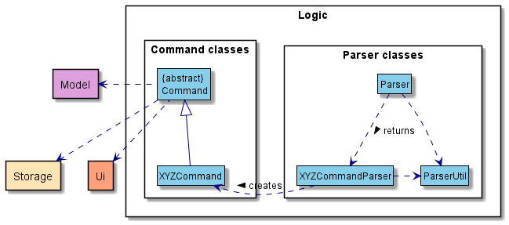
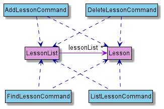
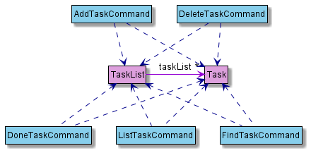

# Developer Guide

## Table of contents

* [Acknowledgements](#acknowledgements)
* [Setting up, getting started](#setting-up-getting-started)
* [Design](#design)
    * [Architecture](#architecture)
    * [UI component](#ui-component)
    * [Logic component](#logic-component)
    * [Model component](#model-component)
    * [Storage component](#storage-component)
    * [Common classes](#common-classes)
* [Documentation, logging, testing, configuration, dev-ops](#documentation-logging-testing-configuration-dev-ops)
* [Implementation](#implementation)
    * [Saving data](#saving-data)
    * [Loading data](#loading-data)
* [Appendix: Requirements](#appendix-requirements)
    * [Product scope](#product-scope)
    * [User stories](#user-stories)
    * [Use cases](#use-cases)
    * [Non-Functional Requirements](#non-functional-requirements)
    * [Glossary](#glossary)
* [Appendix: Instructions for manual testing](#appendix-instructions-for-manual-testing)

## Acknowledgements

{list here sources of all reused/adapted ideas, code, documentation, and third-party libraries -- include links to the original source as well}

## Setting up, getting started

## Design

### Architecture

The **Architecture Diagram** given above explains the high-level design of the App.

Given below is a quick overview of main components and how they interact with each other.

**Main components of the architecture**

`Main` has two classes called `Duke` and `DukeException`.

`Duke` is responsible for:
* **At app launch:** Initializes the components in the correct sequence, and connects them up with each other.
* **At shut down:** Shuts down the components and invokes cleanup methods where necessary.

`DukeException` is responsible for:
* Manages Duke-related exceptions.

`Commons` represents a collection of classes used by multiple other components.

The rest of the App consists of four components.
* `UI`: The UI of the App.
* `Logic`: The parser and command executor.
* `Model`: Holds the various data structures of the App.
* `Storage`: Reads data from, and writes data to, the hard disk.

**How the architecture components interact with each other**

The **Sequence Diagram** below shows how the components interact with each other for the scenario where the 
user issues the command `add task homework -d mon`.

### UI component

### Logic component

Here is the class diagram of the `Logic` component:

> 📝 **Note:** XYZ is a placeholder for specific command name (e.g., AddModuleCommand).

How the `Logic` component works:

* When `Logic` is called upon to execute a command, it uses the `Parser` class to parse the user command.
* This results in a `Command` object (more precisely, an object of one of its subclasses e.g., 
  AddModuleCommand) which is then executed.
* The `Command` can communicate with the `Model` class when it is executed (e.g. to add a module).
* If the operations above are successful, the `Command` will save the `Model` data by using the `Storage` class.
* The result is then printed to user by the `Ui` class.

### Model component

The `model` package consists of three components: `Lesson`, `Task` and `Module`.

#### Lesson component

**API** : [`Lesson.java`](https://github.com/AY2122S1-CS2113T-W11-3/tp/blob/master/src/main/java/seedu/duke/model/lesson/Lesson.java)

The `Lesson` component
* stores data specific to a lesson as entered by the user 
* stores all `Lesson` objects created by user commands in a `LessonList` object
* does not depend on any of the other three components

#### Module component

**API** [`Module.java`](https://github.com/AY2122S1-CS2113T-W11-3/tp/blob/master/src/main/java/seedu/duke/model/module/Module.java)

The `Module` component,
* stores information regarding modules added by the user and on the NUSMods API
* does not depend on any of the other three components
* `FullModuleList` stores all `Module` objects corresponding to the modules found on NUSMods
* `ModuleList` stores all user-added `Module` objects

#### Task Component

**API** [`Task.java`](https://github.com/AY2122S1-CS2113T-W11-3/tp/blob/master/src/main/java/seedu/duke/model/task/Task.java)

The `Task` component,
* stores data specific to a task as entered by the user
* stores all `Task` objects as createed by user commands in a `TaskList` object
* does not depend on any of the other three components

### Storage component

**API** : [`Storage.java`](https://github.com/AY2122S1-CS2113T-W11-3/tp/blob/master/src/main/java/seedu/duke/storage/Storage.java)  

The storage component makes use of the serializing methods in the `taskList`, `lessonList`, and `moduleList` classes to save data to the `data` folder.
It also reads data from a given path into strings which can be utilized by those 3 list classes to create a list.

The `Storage` component has methods that:
* create the files `task.txt`, `lesson.txt`, `module.txt` in the `data` folder.
* load data from the file in the given path into an array of strings representing each line of data.
* save data of a given list by overwriting the respective file in the `data` folder with serialized data.

The following sequence diagrams below show how task data is [saved](#saving-data) and [loaded](#loading-data) using the Storage class.

### Common classes

## Documentation, logging, testing, configuration, dev-ops

## Implementation

### Saving data

### Loading data

## Appendix: Requirements

### Product scope

{Describe the product scope}

### User stories

|Version| As a ... | I want to ... | So that I can ...|
|--------|----------|---------------|------------------|
|v1.0|new user|see usage instructions|refer to them when I forget how to use the application|
|v2.0|user|find a to-do item by name|locate a to-do without having to go through the entire list|

### Use cases

{Describe the use cases}

### Non-Functional Requirements

{Give non-functional requirements}

### Glossary

## Appendix: Instructions for manual testing]

{Give instructions on how to do a manual product testing e.g., how to load sample data to be used for testing}
