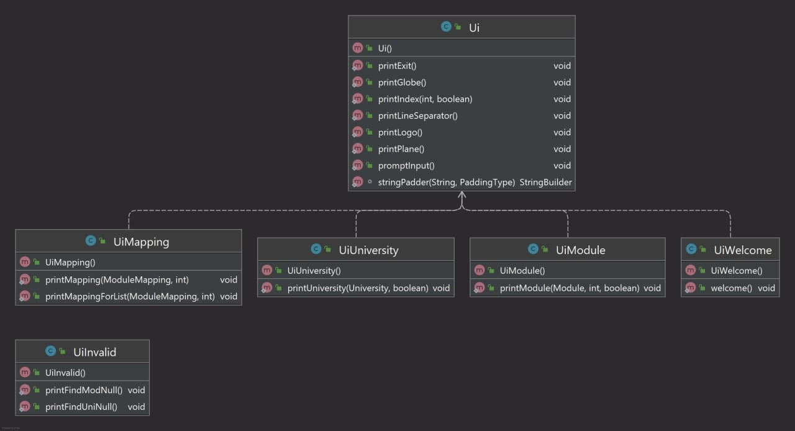

## Contents 
* __Acknowledgements__
* __Getting Started__
* __Design & Implementation__
* __Product Scope__
  1. Target user profile
  2. Value proposition
* __User Stories__
* __Non-Functional Requirements__
* __Glossary__
* __Instructions for manual testing__ 
## Acknowledgements

* __EduRec:__ For the list of possible module mappings

## Getting started 
Refer to our user guide [here](https://github.com/AY2122S1-CS2113T-T09-2/tp/blob/master/docs/UserGuide.md)

## Design & implementation

  

The ***Architecture Diagram*** above explains the high-level design of the App. 

### Main Components
The main class of SEPlanner is the `Duke` class. It is responsible for initializing the other components when the program 
gets started while handling interactions between the other components.  
The other core components of SEPlanner are:  
`Ui` : Handles the UI of SEPlanner and prints outputs to the user.  
`Parser`: Handles user inputs and pass them down to the `Command` class.  
`Command` : Handles output passed down from `Parser` based on the user inputs and execute user instructions.  
`Storage` : Loads data from, and stores data back to the user's local machine.  
`UniversityList` and `ModuleList` : Stores information about Universities and modules as well as the methods to amend and filter them.  

### Command Implementation

Step 1. When the beginner user launches the application, to see the list of all universities available for the SEP program, the user executes `list /muni` command. To see the list of all NUS modules available for the SEP program, the user can executes `list /mmod` command.

Step 2. The user then module executes `add /uni Boston University` command to call `addUniCommand(university, list)` and add his preferred university to the selected university list. The other option for the user is to execute `add /uni 4` command to call `addUniCommand(index, list)` to add to the list.

Step 3. The user executes `add /mod CS1231` command to call `addModCommand(module, list)` and add his preferred NUS module to the selected module list. The other option for the user is to execute `add /mod 81` command to call `addModCommand(index, list)` to add to the list.

Step 4. The user executes `list /suni` to see his selected university list. The user executes `list /smod` command to see his selected module list.

Step 5. The user executes `remove /mod 81` command to delete unwanted modules from see his selected module list. The user executes `remove /uni 4` command to delete unwanted university see his selected university list.

Step 6. The user executes `find /mod CS1231` to find the master index of the module. The user executes `find /mod Boston University` to find the master index of the university.

Step 7. The user executes `searchmap 4` command to see the module mapping of all modules in the selected module list in Boston University.

Step 8. The user executes `add /map 4 1` command to add the first module mapping available under Boston University.

Step 9. The user executes `remove /map 4 1` command to remove the first mapping allocated to Boston University.

Step 10. The user executes `exit` command to terminate the program.

### Ui
The Ui component consolidates and formats the output of the program before displaying it to the user
in the command line. 

The UI component 
* Displays different object types such as University, Module and Module mapping.
* Provides means of customization for display formatting. 
* Summarizes different parts of the program into callable methods.

### Storage

The storage component can implement the below features:

* Read the list of module mappings offered by each university from the CSV file.
* Read the list of NUS modules which can be mapped from the CSV file.
* Save both user's module mappings for each university and their selected NUS modules in text
  file and read them back into corresponding objects.

### University and module related classes

The following diagrams are the class diagrams of the classes:  

  
  

This component consist of the following classes: 
### University 
* Stores basic information of a university.
* Stores the unique index for each university in `index`, this index can be used to refer to a specific university in the commands.
* Stores the university name in `name`.
* Stores `ModuleMapping` objects associated to this university in an array list `list`.
* For `University` objects under the master list, `list` stores all possible module mappings from this university for the user to choose from.
* For `University` objects under the selected list by the user, `list` stores all the module mappings the user has chosen to add to this university for their SEP application.
#### UniversityList
* Stores `University` objects.
* Can be used under the following 2 circumstances:
  * Stores the master list containing all universities available for CEG SEP application. This list is directly read from an external file `University.csv`.
  * Stores the selected list containing all universities added by the user. This list can be amended by the user, and all change to it will be stored under `data/selectedUniversities.txt`.
* Contains methods to search, filter, or amend the list based on command from the user. 
#### Module 
* Stores basic information of a module.
* For NUS modules, stores the unique index for each module in `index`, this index can be used to refer to a specific module in the commands.
* Stores the module code in `moduleCode`.
* Stores the module name in `moduleName`.
* Stores the modular credits of this module in `moduleCredits`.
#### ModuleList
* Stores `Module` objects.
* Can be used under the following 2 circumstances:
  * Stores the master list of all NUS modules available for the users to choose from.
  * Stores the selected list unique to each user based on the modules they choose to take.

#### ModuleMapping 
* Stores 2 `Module` objects as a pair of module mapping.
* Stores the local NUS module in `localModule`.
* Stores the partner university module in `mappedModule`.

### Parser Component

The parser component is made up of the following classes:
* Identify the command word and invoke the respective argument parser for the command.
* Handle the arguments and return the respective Command object.
#### Parser
This is the main parser class that will handle raw inputs and identify command words and invoke the respective command parsers.
#### AddCommandParser, RemoveCommandParser, FindCommandParser, SearchMapCommandParser, HelpCommandParser, ExitCommandParser
These class when invoked, will handle the flags and arguments and invoke the specific Command classes and handle the arguments.

## Product scope
### Target user profile

__SEPlanner__ is targeted at Computer Engineering students in NUS planning for their Student Exchange Program (SEP). 

### Value proposition

Student Exchange Program is one of the most stressful and difficult things to plan for in a NUS students life. 
With multiple sources of information and a frustrating webpage to navigate, SEPlanner aims to organise 
a list of potential exchange Universities based on the users study plan, module requirements and personal preference.

## User Stories

|Version| As a ... | I want to ... | So that I can ...|
|--------|----------|---------------|------------------|
|v1.0|new user|see the list of possible schools for exchange|view my options for SEP|
|v1.0|new user|see the list of available NUS modules|decide on which NUS modules I want to complete during SEP|
|v1.0|beginner user|add a University to my preferred list|view the Universities that I am interested in|
|v1.0|beginner user|add a NUS Module to my preferred list|save my module preferences for the future|
|v1.0|beginner user|list down all Universities in my preferred list|keep track of my target schools for SEP|
|v1.0|beginner user|list down all NUS modules in my preferred list|keep track of the list of NUS modules I want to complete during SEP|
|v1.0|beginner user|delete a University from the selected list|remove the University that I am not interested in|
|v1.0|beginner user|delete a module from the selected list|remove the module that I do not consider to enrol in the future|
|v1.0|user|enter commands and arguments to the application|interact with the application on the command line in an efficient way
|v2.0|familiar user|save my university and module information|maintain access to my information when I restart the application|
|v2.0|new user|view the program instructions|refer to them when I forget how to use the application|
|v2.0|familiar user|find a University by name|locate a University without having to go through the entire list|
|v2.0|familiar user|search the available module mappings for a University based on the selected module list|get a list of module mappings for this university based on my selected modules|
|v2.0|familiar user|add a pair of module mapping for a university|save a module mapping under the university that I selected|
|v2.0|familiar user|delete a mapping pair of module for a university|remove a module mapping under a selected university|
|v2.0|familiar user|pass in University as command argument using its index in the master list|access the exact University I want without having to type out its full name and facing bugs caused by typo|

## Non-Functional Requirements

{Give non-functional requirements}

## Glossary

* *glossary item* - Definition
* *Master University List* The list of all partner universities.
* *Master Module List* - The list of all NUS modules available for mapping.
* *Selected University List* - The list of partner universities the user selected.
* *Selected Module List* - The list of modules the user selected.

## Instructions for manual testing

{Give instructions on how to do a manual product testing e.g., how to load sample data to be used for testing}
