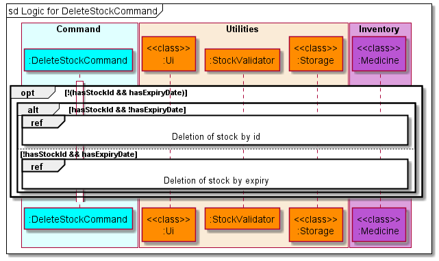
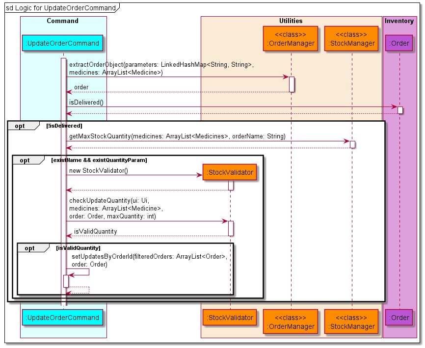

# Developer Guide

## Table of Contents

* [Acknowledgements](#Acknowledgements)
* [Setting up, getting started](#Setting-up,-getting-started)
    * [Setting up](#setting-up)
    * [Before writing code](#before-writing-code)
* [Design](#Design)
    * [Architecture](#Architecture)
    * [Command](#Command)
    * [Utilities](#Utilities)
    * [Inventory](#Inventory)
    * [Errors](#Errors)

* [Implementation](#Implementation)
    * [Main Logic](#Main-Logic)
    * [AddStockCommand](#AddStockCommand)
    * [AddDispenseCommand](#AddDispenseCommand)
    * [AddOrderCommand](#AddOrderCommand)
    * [DeleteStockCommand](#DeleteStockCommand)
    * [DeleteDispenseCommand](#DeleteDispenseCommand)
    * [DeleteOrderCommand](#DeleteOrderCommand)
    * [ListCommand](#ListCommand)
    * [UpdateStockCommand](#UpdateStockCommand)
    * [UpdateDispenseCommand](#UpdateDispenseCommand)
    * [UpdateOrderCommand](#UpdateOrderCommand)
* [Product scope](#Product-scope)
* [Target user profile](#Target-user-profile)
* [Value proposition](#Value-proposition)
* [User Stories](#User-Stories)
* [Non-Functional Requirements](#Non-Functional-Requirements)
* [Glossary](#Glossary)
* [Instructions for manual testing](#Instructions-for-manual-testing)

## Acknowledgements

* Inspiration for App Idea and OOP Structure :https://github.com/se-edu/addressbook-level2
* Inspiration for User Guide: https://se-education.org/addressbook-level3/UserGuide.html
* Inspiration for Developer Guide: https://se-education.org/addressbook-level3/DeveloperGuide.html
* PlantUML Tutorial: https://se-education.org/guides/tutorials/plantUml.html

## Setting up, getting started

### Setting up

1. Fork [this](https://github.com/AY2122S1-CS2113T-T10-1/tp/) repo, and clone the fork into your computer.
2. Ensure that you have [IntelliJ IDEA](https://www.jetbrains.com/idea/download/#section=windows)
   and [JDK 11](https://docs.aws.amazon.com/corretto/latest/corretto-11-ug/downloads-list.html) installed.
3. Configure the JDK
    * Follow the guide
      at [se-edu/guides IDEA: Configuring the JDK](https://se-education.org/guides/tutorials/intellijJdk.html) to ensure
      Intellij is configured to use JDK 11.
4. Import the project as a Gradle project
    * Follow the
      guide [se-edu/guides IDEA: Importing a Gradle project](https://se-education.org/guides/tutorials/intellijImportGradleProject.html)
      to import the project into IDEA.
    * Note: Importing a Gradle project is slightly different from importing a normal Java project.
5. Verify the setup
    * Locate the file `src/main/java/MediVault.java` then run the `MediVault.main()` and try a few commands
    * Run the [test](https://se-education.org/addressbook-level3/Testing.html) to ensure they all pass.

### Before writing code

1. Configure the coding style
    * If using IDEA, follow the
      guide [se-edu/guides IDEA: Configuring the code style](https://se-education.org/guides/tutorials/intellijCodeStyle.html)
      to set up IDEA’s coding style to match ours.
2. Set up CI
    * This project comes with a GitHub Actions config files (in `.github/workflows folder`). When GitHub detects those
      files, it will run the CI for your project automatically at each push to the `master` branch or to any PR. No set
      up required.

## Design

### Architecture

### Command

The **Command** class diagram above shows how **Command** interact with other classes in MediVault.

The Command Component consists of **17** subclasses where each subclass represents a command feature.

Let `*` be either of the three class: `Stock`, `Order` or `Dispense`.

* `Add*Command`: Adds a new `*` information into MediVault.
* `Delete*Command`: Removes the visibility of the `*` record in MediVault.
* `List*Command`: Lists the `*` records.
* `Update*Command`: Updates the `*` information.
* `ReceiveOrderCommand`: Marks an order as received and adds the ordered medication into the current stocks.
* `ArchiveCommand`: Archives all the records before a given date.
* `PurgeCommand`: Wipes all record in MediVault.
* `HelpCommand`: Shows the help page.
* `ExitCommand`: Exits MediVault.

### Utilities

The class diagram below shows how the validator classes in implemented to help ensure that the user input is
valid. `StockValidator`, `DispenseValidator` and `OrderValidator` inherits from `MedicineValidator`. The class methods
are also shown in the diagram.

{combine ui, storage, parser, comparators?}

### Inventory

The class diagram below shows how the objects in MediVault is implemented. `Stock`, `Dispense`
and `Order` inherits from the abstract `Medicine` class. The attributes that each object has is also shown in the
diagram.

### Errors

## Implementation

### Main Logic

The main application logic shows how the commands are handled throughout the application. Below is the outline of the
logic:

* MediVault is called by the `main` method which calls the constructor of MediVault. Data is then loaded from the
  `Storage` class to the application.
* MediVault gets the user input via the `Ui` class and uses the `CommandParser` class to parse the input given by the
  user.
* The parameters will be parsed to a `LinkedHashMap` to make the parameters easily accessible.
* If a valid command is received, the `CommandParser` will call the `Command` object constructor and return the object
  to MediVault.
* MediVault will then invoke the `execute()` function of the `Command` object to execute the command.
* Should there be an invalid command, `CommandParser` will throw `InvalidCommand` and MediVault will display the error
  message using the `Ui` class.

Given below is the sequence diagram for the interactions within the main application logic.

### AddStockCommand

MediVault initialises a AddStockCommand when CommandParser identifies the `addstock` or  `add` in the stock mode.

* MediVault adds medicine stock when the `parameter` and `parameterValues` provided by the user are valid.
* User will not be able to input medication if `max_quantity` is less than `quantity`.
* User will not be able to input medication if the same name exist and the `expiry_date` is same.
* MediVault will ignore the `description` and `max_quantity` of user input if the same medication name already exist.

The sequence diagram for AddStockCommand is shown below.

### AddDispenseCommand

MediVault initialises a AddDispenseCommand when CommandParser identifies the `adddispense` or  `add` in the dispense
mode.

* MediVault adds dispense when the `parameter` and `parameterValues` provided by the user are valid.
* MediVault will update the quantity left in the stock automatically after dispense.
* MediVault will dispense medication with the earliest date if there are medication with multiple expiry date.
* User will not be able to dispense medication if the quantity is more than the total stock quantity.

The sequence diagram for AddDispenseCommand is shown below.

### AddOrderCommand

MediVault initialises an AddOrderCommand class when CommandParser identifies the
`addorder` or the `add` keyword in the `order` mode.

* MediVault adds order information when `parameter` and `parameterValues` provided by the user are valid.
* As the order date is an optional parameter, MediVault will use the date the order was placed as the default date.
* User will not be unable to add order if the order quantity exceeds maximum stock quantity.

The sequence diagram for AddOrderCommand is shown below.

### DeleteStockCommand

MediVault initialises an DeleteStockCommand class when CommandParser identifies the
`deletestock` or the `delete` keyword in the `stock` mode.

* MediVault allow for deletion of stock by stock id through `deletestock i/STOCK_ID`.
* MediVault allow for deletion of stock by expiry date through `deletestock e/EXPIRY_DATE`.
* MediVault delete medicine stock information when parameter and parameterValues provided by the user are valid.
* MediVault perform a check to determine if it is executing deletion by stock id or deletion by expiry and executes
  accordingly.

The sequence diagram for DeleteStockCommand is shown below.

After MediVault determines that it is executing deletion by stock id, it will execute accordingly.

The sequence diagram for deletion by stock id is shown below.

After MediVault determines that it is executing deletion by expiry date, it will execute accordingly.

The sequence diagram for delete by expiry date is shown below.

### DeleteDispenseCommand

MediVault initialises a DeleteDispenseCommand when CommandParser identifies the `deletedispense` or  `delete` in the
dispense mode.

* MediVault delete dispense when the `parameter` and `parameterValues` provided by the user are valid.
* MediVault will delete dispense based on the user input of `DISPENSE_ID`.
* MediVault will add dispense quantity to the stock quantity after successful deletion of dispense.
* User will not be able to delete dispense if the total quantity after dispense will be more than the maximum quantity.

The sequence diagram for DeleteDispenseCommand is shown below.

### DeleteOrderCommand

MediVault initialises a DeleteOrderCommand when CommandParser identifies the `deleteorder` or  `delete` in the order
mode.

* MediVault delete order when the `parameter` and `parameterValues` provided by the user are valid.

The sequence diagram for DeleteOrderCommand is shown below.

### ListCommand

There are three variations of the list command.

1. `liststock`
2. `listdispense`
3. `listorders`

The sequence diagram below shows how the list operation works in general.

Note: Replace `*` in the diagram with `Stock`, `Dispense` or `Order` depending on the command entered.

All three variations of `list` are similar as they are implemented by iterating through the `Medicine` ArrayList and
filtering out the respective object types. If the parameter `sort` or `rsort` is provided, the respective constructor of
the `Comparator` classes will be invoked to help sort the ArrayList. For the rest of the valid command parameters,
MediVault will do a **contains** comparison for strings and **equals** comparison for integers as well as dates except
for `expiring` and `low` parameters where it will do a **less than or equal** comparison. `getAttributeValue()`
represents all the get methods available in each of the respective classes. At the end of the execution the
respective `print()` method from the `Ui` class will be called to display the respective tables.

### UpdateStockCommand

MediVault initialises an UpdateStockCommand class when CommandParser identifies the
`updatestock` or the `update` keyword in the `stock` mode.

* MediVault checks if `parameters` and `parameterValues` provided by the user are valid.
* MediVault conducts another validation check on the provided `quantity`,`max_quantity` and `expiry`
  against the stored medicine stock information.

The sequence diagram for UpdateStockCommand is shown below.

MediVault adds a new _stock_ record when a user updates contains the `n/NAME` parameter. The old stock record still
exists in MediVault, but it will not be visible to user when listed. This approach solves the issue when a user is
unable to delete a _
dispense_ record when the medicine _stock_ name gets updated.

### UpdateDispenseCommand

MediVault initialises an UpdateDispenseCommand class when CommandParser identifies the
`updatedispense` or the `update` keyword in the `dispense` mode.

* MediVault checks if the `parameters` and `parameterValues` provided by the user are valid.
* When a user updates dispense information containing either `n/NAME`, `q/QUANTITY` or both, MediVault restores the
  dispensed stocks or dispense more stocks depending on the user input.

The sequence diagram for UpdateDispenseCommand is shown below.

MediVault adds a new _dispense_ record when a user updates contains either the `n/NAME`, `q/QUANTITY`
parameter or both. The old _dispense_ record is permanently removed from MediVault. This approach solves the issue when
a user dispenses a medication with an amount that is more than the current batch of stock with the same _stock_ id but
less than the total stock quantity. MediVault will correctly add new _dispense_ records with the corresponding _stock_
Id.

### UpdateOrderCommand

MediVault initialises an UpdateOrderCommand class when CommandParser identifies the
`updateorder` or the `update` keyword in the `order` mode.

* MediVault checks if the `parameters` and `parameterValues` provided by the user are valid.
* MediVault restricts updating of order information that are already **delivered**.

The sequence diagram for UpdateOrderCommand is shown below.

## Product scope

### Target user profile

* pharmacist handling storing, ordering and dispensing of medication
* has a need to manage large number of stocks in the pharmacy
* may forget how much medicine stock is left in the pharmacy
* is a fast typist

### Value proposition

{Describe the value proposition: what problem does it solve?}

## User Stories

|Version| As a ... | I want to ... | So that I can ...|
|--------|----------|---------------|------------------|
|v1.0|new user|see usage instructions|refer to them when I forget how to use the application|
|v2.0|user|find a to-do item by name|locate a to-do without having to go through the entire list|

## Non-Functional Requirements

{Give non-functional requirements}

## Glossary

* `parameter` - Prefixes for MediVault to understand the type of information user provides.
* `parameter values` - The actual information provided by the user for a given `parameter` type.

## Instructions for manual testing

{Give instructions on how to do a manual product testing e.g., how to load sample data to be used for testing}
