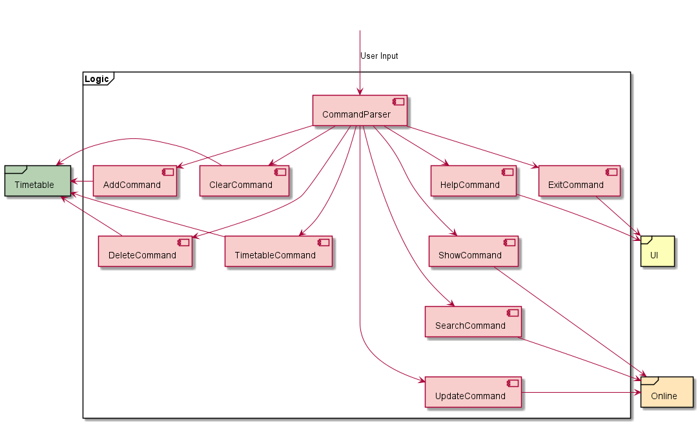
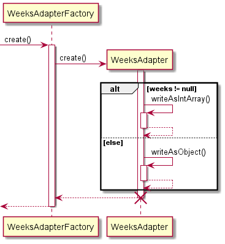
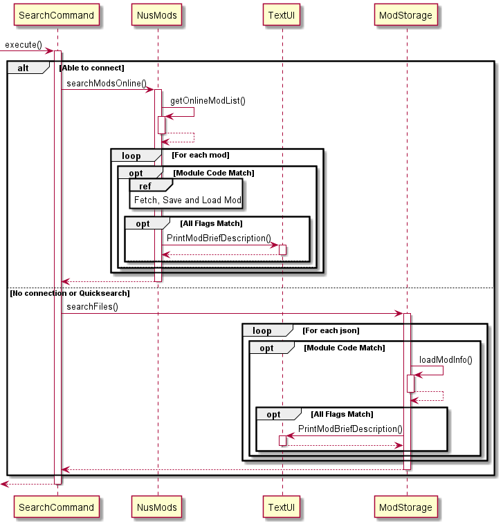
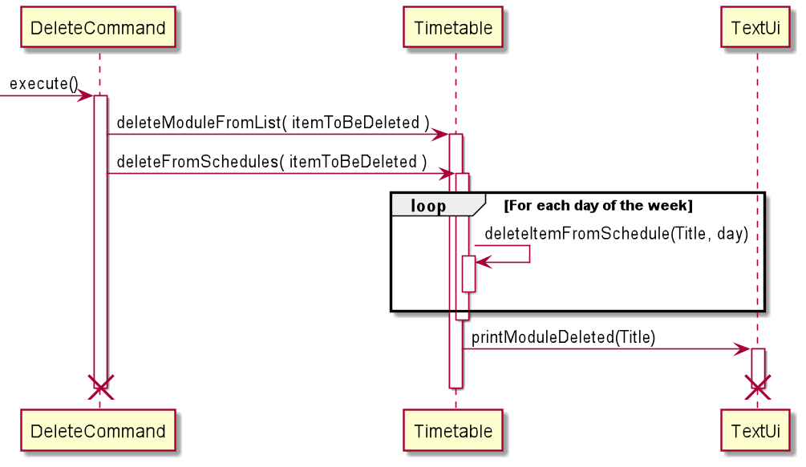

# Developer Guide

## UNIMods


**UniMods** is a light-weight Command Line Interface (CLI) Application that provides a means for students to plan for
their academic journey in NUS. This guide details the implementation design and architecture that UniMods was built
upon.

## Contents

- [Acknowledgements](#acknowledgements)
- [Setting up, getting started](#setting-up-getting-started)
- [Design](#design)
    * [Architecture](#architecture)
    * [UI component](#ui-component)
    * [Logic component](#logic-component)
    * [Online component](#online-component)
    * [Timetable component](#timetable-component)
    * [Storage component](#storage-component)
- [Implementation](#implementation)
    * [Fetching Module Data](#fetching-module-data)
      * [Parsing of weeks via Gson](#parsing-and-saving-of-weeks-via-gson)
    * [Search/ Show/ Update Functions](#searchshowupdate-module-feature)
      * [Search](#search)
      * [Show](#show)
      * [Update](#update)
- [Appendix: Requirements](#appendix-requirements)
    * [Product scope](#product-scope)
    * [User stories](#user-stories)
    * [Use cases](#use-cases)
    * [Non-Functional Requirements](#non-functional-requirements)
    * [Glossary](#glossary)

## Acknowledgements
* [Gson](https://github.com/google/gson/) for reading and writing of JSON files.
* [Thread](https://stackoverflow.com/questions/31758872/how-to-handle-different-data-types-with-same-attribute-name-with-gson)
from StackOverflow with a simple method to parse a JSON field with a variable data type. 

## Setting up, getting started

1. Ensure you have Java 11 or above installed in your Computer.
2. Download the latest unimods.jar from [here](https://github.com/AY2122S1-CS2113T-W12-2/tp/releases).
3. Copy the file to the folder you want to use as the home folder for your NUS Mods Lite.
4. Open your CLI of choice and run `java -jar unimods.jar`.
5. Type the command in the command box and press Enter to execute it. Some example commands you can try:
    - `help` : to list all the commands with their description
    - `search <module_code>` : lists module code based on the given partial regex
    - `show <module_code>`: displays the module information
    - `add <module_code>` : to add the module to the timetable
    - `delete <module_code>` : to remove the module from the timetable
    - `timetable` : lists all modules added to the timetable
    - `exit` : Exits the app.
    - Refer to the [User Guide](https://ay2122s1-cs2113t-w12-2.github.io/tp/UserGuide.html) for details of each command.

## Design

### Architecture

The Architecture Diagram given below explains the high-level design of the App. 
Given below is a quick overview of main components and how they interact with each other.


<div style="page-break-after: always;"></div>

#### Main components of the architecture
**UniMods**

>  **UniMods** has one class called `UniMods`. It is responsible for
>  - At app launch: Initializes the components in the correct sequence, and connects them up with each other.

<br>

**Commons**
> **Commons** represents a collection of classes used by multiple other components.
The rest of the App consists of five components:
> - **UI**: The UI of the App.
> - **Logic**: The command executor.
> - **Timetable**: Holds the timetable data in memory
> - **Storage**: Reads data from, and writes data to, the hard disk.
> - **Online**: Fetches data from the NUSMods API online for up to date information

<br>

<div style="page-break-after: always;"></div>

### UI component
The **UI** component consists of the `AddUI`, `TextUi`, `TimetableUI` and `TranscriptUi` components.


> The `TextUi` component is the most general purpose component and is called from `UniMods`, `Logic`, `Storage` 
and `Online`.
> 
> The `AddUI` component is called only from `Logic`, specifically by the `AddCommand`.
> 
> The `TimetableUI` component is called from `Timetable`.
> 
> The `TranscriptUi` component is called only from `Logic`, specifically by the `TranscriptCommand`.

<br>

<div style="page-break-after: always;"></div>

### Logic component
The **Logic** component consists of the `CommandParser` , as well as all the valid commands : 
`AddCommand`,  `ClearCommand`, `DeleteCommand`, `ExitCommand`, `HelpCommand`, `SearchCommand`, 
`ShowCommand`, `TimetableCommand` and the `UpdateCommand` classes.



> Converts user input into a `Command` object using the `CommandParser` component.
>
> If the user inputs a search command with **flags**, convert **flags** into a `SearchFlags` object using the `FlagParser` component.
>
>Instantiates `Commands` through `CommandParser` which each have unique `execute()` methods that execute their function.


<br>

<div style="page-break-after: always;"></div>

### Online component
The **Online** component consists of only `NusMods`.


> Attempts to retrieve module information from NUSMods API using the `NusMods` component and prints it using the `UI`
> component.
> 
> If unable to do so, it attempts to do so through the `Storage` component.

<br>

<div style="page-break-after: always;"></div>

### Timetable component
The **Timetable** component consists of `Timetable`, `TimetableItem`, `TimetableLesson` and `TimetableUserItem` classes.


> `Timetable` stores all timetable information, including weekly schedule, modules taken and the current semester
> 
> `TimetableLesson`, and `TimetableUserItem` extends from `TimetableItem`. They are stored in the timetable schedule to differentiate between different type of schedule items

<br>

<div style="page-break-after: always;"></div>

### Storage component
The **Storage** component consists of the `ModStorage`, `ProfileStorage` and `TimetableStorage` components. Much like
their names suggest, they handle the storage of Mods, Profiles and Timetables respectively.


> `ModStorage` is primarily called by the `Online` component when there is a lack of internet connectivity. It is also
> called through `Logic` manually by the user executing a `SearchCommand` with a quick flag.
> 
> `ProfileStorage` is called through the main `UniMods` component on startup when no prior profile information can be
> found.
> 
> `TimetableStorage` is called by the `UniMods` component to handle saving and loading of timetables.

<div style="page-break-after: always;"></div>

## Implementation
This section covers the important details on how some features are implemented.

<br>

### Fetching Module Data
Each module is converted from the JSON fetched from the **NUSMods API** into a Java Object using the gson library.
Since the JSON format utilized by the API contains nested objects, the final implementation of the `Module` objects 
emulates that of the JSON, with each `Module` containing an `Attributes` object and an array of `Semester` objects, 
`Semester` containing an array of `Lesson` objects, and  `Lesson` containing an array of `Weeks` objects.


<div style="page-break-after: always;"></div>

#### Parsing and Saving of Weeks via Gson
Gson was unable to parse the weeks key as provided by the NUSMods API as the value expected for the key can be of two different data types.

```json
{
"classNo": "16",
"startTime": "1600",
"endTime": "1700",
"weeks": [1, 2, 3, 4, 5, 6, 7, 8, 9, 10, 11, 12, 13],
"venue": "E-Learn_C",
"day": "Friday",
"lessonType": "Tutorial",
"size": 21,
"covidZone": "Unknown"
}
```

An example of a lesson in the *timetable* array in a normal semester, where *weeks* contains an array.

```json
{
"classNo": "03",
"startTime": "1530",
"endTime": "1730",
"weeks": {
"start": "2022-06-23",
"end": "2022-07-28"
},
"venue": "E-Learn_C",
"day": "Thursday",
"lessonType": "Laboratory",
"size": 25,
"covidZone": "Unknown"
}
```

An example of a lesson in the *timetable* array in the special term, where *weeks* contains an object with its own 
*start* and *end* keys.

By default Gson does not handle keys that have multiple data types. If `Weeks` is defined as an object, Gson will throw 
an error when parsing normal semester lessons as it expects an array, and similarly, if weeks is defined as an array 
in `Lessons` then Gson will throw an error when parsing Special term lessons as it expects an object instead.

```
@JsonAdapter(WeeksAdapterFactory.class)
private Weeks weeks
```

By utilizing a TypeAdapter for Weeks in Lessons, a  custom deserialization method for Gson to use for this specific key 
was implemented.


Using `peek()`, Gson checks if *weeks* is an array or an object. From there it utilizes the deserialization method for 
the specific data type. The key difference is that while *weeks* can be an array in the JSON, when deserialized it is 
always an object that contains three variables, *weeks*, *start* and *end*. If it was originally an array, then the 
array be written into the *weeks* array in the object itself, and *start* and *end* will be null. If it was an object, 
then *start* and *end* will be written, but *weeks* will be null.



Similarly for saving weeks for the `Timetable` JSON, a custom serialization method is used that checks which specific 
data type to serialize it as. If *weeks* is not null, then Gson writes it as an array despite it being an object. 
This is to maintain consistency with the JSON format retrieved from the **NUSMods API** which allows Gson to 
successfully deserialize the timetable JSON when it is loaded.  Otherwise it writes it as an object as usual.

<br>

<div style="page-break-after: always;"></div>

### Search/Show/Update module feature
This feature is implemented using the `ModStorage` and the `NusMods` classes.

The following implemented functions are utilized heavily:
`NusMods`:
* `getOnlineModList()` : gets a list of mods from the NUSMods API.
* `getOnlineModInfo()` : using a module code, get detailed information about that

`ModStorage`:
* `saveModInfo()` : saves a fetched JSON into local storage.
* `searchFiles()` : attempts to search from all JSONs in the local data folder.
* `loadModInfo()` : directly loads the JSON with the specified module code.

<br>

<div style="page-break-after: always;"></div>

#### Search



<div style="page-break-after: always;"></div>

*Fetch, Save and Load Mod*


Utilizes `getOnlineModList()` to get all mods from online. If the module code contains the search term or matches the 
level flag if inputted, `getOnlineModInfo()` is used to fetch the full data for further comparison with the remaining 
flags. `saveModInfo()` is always used after fetching a JSON to keep the local database as up to date as possible. 
If the module matches the search term and all flags, then it is printed. If either `getOnlineModList()` or 
`getOnlineModInfo()` fail at the start, then `searchFiles()` will execute instead to fetch data locally.

<br>

<div style="page-break-after: always;"></div>

#### Show


Similar to search, except it directly uses `getOnlineModInfo()` instead. If the module exists, then it will be printed. 
Again, `saveModInfo()` is always used after fetching a JSON to keep the local database as up to date as possible. 
If `getOnlineModInfo()` fails at the start, then `loadModInfo()` will execute instead.

<br>

<div style="page-break-after: always;"></div>

#### Update


Fetches the JSON from all mods in the NUSMods database. Utilizes `getOnlineModList()` to get all mods from online. 
`getOnlineModInfo()` and `saveModInfo()` is run for every mod in the list to update all mods in the local database.

<br>

<div style="page-break-after: always;"></div>

### Maintaining Timetable

#### Initialization


Fetches locally stored timetable JSON, utilizing Gson to convert it to a `TimetableDto` object. `toTimetable()` function is then called to convert `TimetableDto` to a `Timetable` object, where schedule info is merged to easier access.

In the event that the JSON save file is empty or does not exist, a new empty `Timetable` object is created

<br>

<div style="page-break-after: always;"></div>

#### Save


`Timetable` is converted to a `TimetableDto` object in order to separate different `TimetableItem` types. The `TimetableDto` object is then saved to a local json file via Gson.

<br>

<div style="page-break-after: always;"></div>

#### Add


If AddCommand is executed with a `LESSON` flag, `fetchModule()` will be executed. Module data will be fetched similar to the process of getting module detail in [Search](#fetch,-save-and-load-mod),
and for each existing lesson type, details of the lesson will be printed through the `getLessonDetails()` method.
For each lessonType, `getCommand()` is utilized to collect input of the Lesson to be added into the timetable.

If AddCommand is executed with a `EVENT` flag, `getEvent()` will be executed. Which subsequently calls `addEvent()` to add 
event to the timetable.

<br>

<div style="page-break-after: always;"></div>

#### Delete Modules or Tasks from Timetable


Delete command can be executed to delete a module or a task that was added to the timetable. The delete command is executed by calling the `deleteModuleFromList()` function on the current timetable.
Next, the `deleteFromSchedules()` is run which in turn, calls another function `deleteItemFromSchedule` for all days of the week to delete the module and task from the daily schedule.At last, the `printModuleDeleted()` function is executed to print a statement of successful deletion of the module or the task from the timetable. 
<br>

<div style="page-break-after: always;"></div>

#### Remove from Transcript

Removing modules and their grades from the transcript follows a systematic step-by-step process. It first fetches the module to check if its valid module code. 
Next, the current Profile of the user is captured by calling the `getProfileInUse()` function and then the `removeModuleFromTrascnript()` is called with the moduleCode that is to be deleted. 
This function checks every module present in the list of stored modules and deletes the one which is same as the passed module.
After deletion, the `printModuleRemoved` function is called from the `TextUi` class to print the message of successful deletion of the module from the transcript.
<br>
<br>

<div style="page-break-after: always;"></div>

#### Show Timetable


Viewing the timetable follows a systematic step-by-step process. It first calls `printScheduleHours()`
to print the horizontal-axis (hourly timeslot) for the grid-like timetable visualisation.
It then prints three lines of information for each day, the Title, type and venue for each scheduled item.
This is done within `printLine(LineType)`, which internally calls `addInfoToString`, which adds the Title/Type/Venue
varying information to the string to be printed depending on which `printLine(LineType)` was called.
Finally, it prints all the modules taken, together with their exam dates, and the total number of MCs taken,
by incrementing a counter for each module tracked within the timetable instance's `modules` array.

<br>

<div style="page-break-after: always;"></div>

#### Checking Pre-requisite

The pre-requisite tree for a particular module can be found under `prerequisiteTree` in the JSON obtained from NUSMods API.
The pre-requisite tree varies from module to module and can be deeply recursive.

Example of deeply recursive pre-requisite tree (CS4243):
```json
"prereqTree": {
    "and": [
      {
        "or": [
          "CS1020",
          {
            "and": [
              {
                "or": [
                  "CS2030",
                  "CS2113",
                  "CS2113T"
                ]
              },
              "CS2040"
            ]
          }
        ]
      },
      {
        "or": [
          "MA1101R",
          "MA1311",
          "MA1508E",
          "MA1513"
        ]
      },
      {
        "or": [
          "MA1102R",
          "MA1505",
          "MA1507",
          {
            "and": [
              "MA1511",
              "MA1512"
            ]
          },
          "MA1521"
        ]
      },
      {
        "or": [
          "EE2012",
          "EE2012A",
          "MA2216",
          "ST1131",
          "ST1131A",
          "ST1232",
          "ST2131",
          "ST2334"
        ]
      }
    ]
  },
```

Compared to a simple pre-requisite tree (CS2040)
```json
"prereqTree": "CS1010"
```

<div style="page-break-after: always;"></div>

To determine if the user meets the pre-requisites the following sequence takes place:


Checking if the user has met the module's prerequisite utlises the same `fetchMod` explored earlier 
in [Search](#search). If the module code given is valid, the module's prerequisite tree is checked for satisfiability
given the user's `ModuleRecord` found in his `Profile`. 

The sequence for checking if the pre-requisite tree is satisfied is complicated and is shown as follows:


Checking for Tree Satisfaction involves recursive calls of `isAndTreeSatisfied()` and `isOrTreeSatisfied()`, 
since each  Tree can consists of several
sub-trees. Each tree has a condition (AND/OR) that determines the logic of checking for satisfaction.
This recursive method has to be implemented this way due to huge variations in pre-requisites for different
modules.


<br>

<div style="page-break-after: always;"></div>

## Appendix: Requirements

<br>

### Product Scope

Target user profile:
* prefers desktop apps over other types
* is a student at NUS

Value proposition: Works both online and offline.

### User Stories

Priorities: High (must have) - `* * *`, Medium (nice to have) - `* *`, Low (unlikely to have) - `*`

| Priority | As a...   | I want to...                                                    | So that I can...                                                       |
| -------- | ----------| ----------------------------------------------------------------| ---------------------------------------------------------------------- |
| `* * *`  | user      | add mods to my timetable                                        | add mods that I intend to take                                         |
| `* * *`  | user      | delete mods from my timetable                                   | remove mods that I am not taking                                       |
| `* * *`  | user      | search for mods by module codes                                 | know which mods are offered under a pillar                             |
| `* * *`  | user      | check which mods are S/U-able                                   | plan how to use my S/Us for the semester                               |
| `* * *`  | user      | check module workloads                                          | plan how to use my modules                                             |
| `* * *`  | user      | check which semester the module is offered in                   | plan in which semester to take it                                      |
| `* * *`  | user      | check the total number of MC's taken for a particular semester  | know if I have to overload                                             |
| `* * *`  | user      | check whether my upcoming class is a tutorial, lecture or lab   | know what type of class it is                                          |
| `* * *`  | user      | save my timetable to a local file                               | any updates made are persisted                                         |
| `* * *`  | new user  | use the 'help' command                                          | view the list of all possible commands and their description           |
| `* * *`  | user      | use the 'clear' command to delete all modules from the timetable| start afresh and make a new timetable                                  |
| `* *`    | user      | check the exam date of modules                                  | plan for my exams                                                      |
| `* *`    | user      | filter mods by level                                            | find mods by difficulty level                                          |
| `* *`    | user      | keep a record of past modules taken                             | refer back to it at any time                                           |
| `* *`    | user      | monitor the number of MCs taken since enrolling                 | know if I meet my degree requirements                                  |
| `* *`    | user      | add my own events to the timetable                              | better visualise my schedule for the day/week                          |
| `* *`    | user      | search for and list all of my related personal tasks added      | find some of my tasks                                                  |
| `* *`    | user      | check the venue of my classes                                   | know where to go for my classes                                        |
| `* *`    | user      | check mod prerequisites                                         | know if I am eligible to take a mod that I intend to take              |
| `* *`    | user      | delete my personal tasks                                        | clear tasks that I have finished                                       |
| `* *`    | user      | rename my personal tasks                                        | rename it without deleting and re-adding it                            |
| `* *`    | user      | update my personal tasks                                        | update it without deleting and re-adding it                            |
| `* *`    | user      | filter the modules by the number of MCs                         | view only the modules that fit under my MC limit                       |
| `* *`    | user      | access module information while offline                         | view relevant information on the module even while offline             |
| `* *`    | user      | notified if the current lesson that I'm adding clashes with     | be aware of any potential clashes in my timetable                      |
| `* *`    | user      | input the grades scored in various modules                      | know my overall semester result                                        |
| `* *`    | user      | enter the command 'calculate cap'                               | see my CAP according to all grades that I have scored in the past mods |
| `* *`    | user      | keep a record of all modules which I have S/Ued                 | refer back to them at any time                                         |
| `* *`    | user      | remove modules and grades from the transcript                   | edit my transcript in case I make a mistake in adding my grades        |
| `* *`    | user      | view my unofficial transcript                                   | track my degree progress and view the modules I have completed.        |
| `* *`    | user      | stop an update command                                          | cancel it without waiting 10 minutes                                   |
| `* *`    | user      | stop a search command                                           | cancel it without waiting any longer                                   |

### Use Cases
#### **Use case: Search for and show a module**

**MSS**
1. User searches for modules.
2. UniMods shows a list of modules matching the search terms.
3. User requests to show a specific module in the list.
4. UniMods shows module information for that module. <br>
Use case ends.

**Extensions**
* 1a. No matching mods are found. <br>
Use case ends.
* 1b. User cancels search with `ENTER`. <br>
Use case ends.
* 3a. User mistypes name of module and mistyped module code does not exist. <br>
Use case ends.

<br>

#### **Use case: Update local database**

**MSS**
1. User runs update command.
2. UniMods updates local data.

**Extensions**
* 1a. User is offline. <br>
  Use case ends.
* 1a. User cancels update with `ENTER`. <br>
  Use case ends.

<br>

### Non-Functional Requirements

1. Should work on any _mainstream OS_ as long as it has Java `11` or above installed.
2. Should be able to perform local search operations, even on 12000+ module JSONs quickly.
3. Should be easily usable by someone who has not used CLI before.

### Glossary

* **Mainstream OS:** Windows, *nix, MacOS