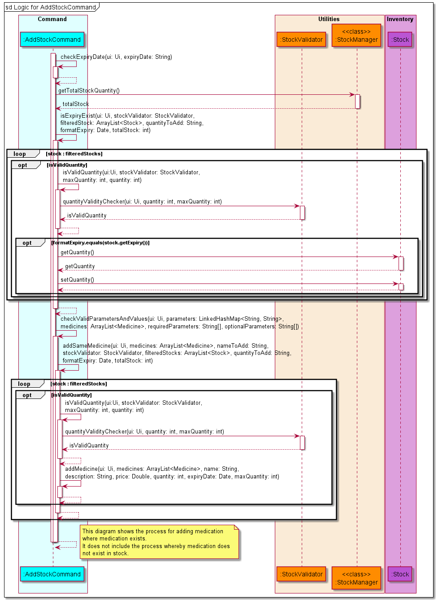
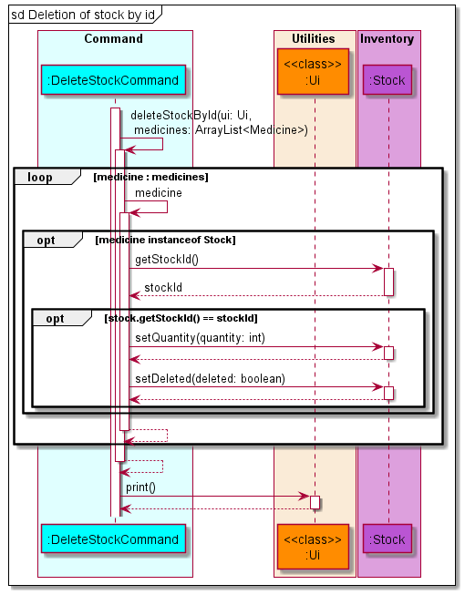
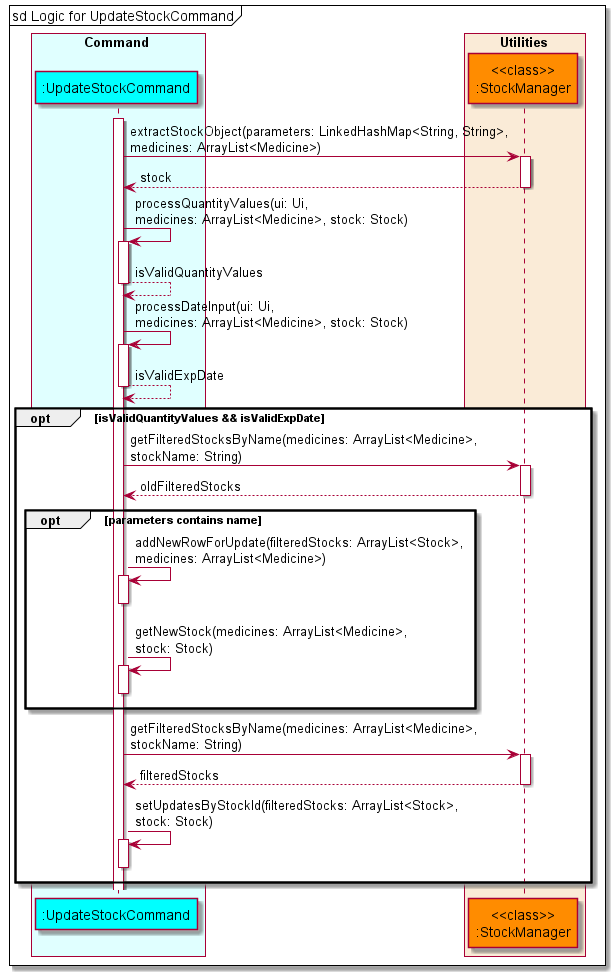

# Developer Guide

## Table of Contents

* [Introduction](#introduction)
* [Acknowledgements](#Acknowledgements)
* [Setting up and getting started](#Setting-up and getting-started)
    * [Setting up](#setting-up)
    * [Before writing code](#before-writing-code)
* [Design](#Design)
    * [Architecture](#Architecture)
    * [Command](#Command)
    * [Utilities](#Utilities)
    * [Inventory](#Inventory)
    * [Errors](#Errors)
* [Implementation](#Implementation)
    * [Main Logic](#Main-Logic)
    * [AddStockCommand](#AddStockCommand)
    * [AddPrescriptionCommand](#AddPrescriptionCommand)
    * [AddOrderCommand](#AddOrderCommand)
    * [DeleteStockCommand](#DeleteStockCommand)
    * [DeletePrescriptionCommand](#DeletePrescriptionCommand)
    * [DeleteOrderCommand](#DeleteOrderCommand)
    * [ListCommand](#ListCommand)
    * [UpdateStockCommand](#UpdateStockCommand)
    * [UpdatePrescriptionCommand](#UpdatePrescriptionCommand)
    * [UpdateOrderCommand](#UpdateOrderCommand)
* [Product scope](#Product-scope)
* [Target user profile](#Target-user-profile)
* [Value proposition](#Value-proposition)
* [User Stories](#User-Stories)
* [Non-Functional Requirements](#Non-Functional-Requirements)
* [Glossary](#Glossary)
* [Instructions for manual testing](#Instructions-for-manual-testing)

## Introduction
MediVault is a Command Line Interface (CLI) application that will help to manage medication supplies within a pharmacy.
It is an integrated solution that provides real-time tracking of stock, orders and prescribing of medication. The
purpose of this guide is to help developers set up and continue with the development of MediVault past version 2.0.

## Acknowledgements

* Inspiration for App Idea and OOP Structure: https://github.com/se-edu/addressbook-level2
* Inspiration for User Guide: https://se-education.org/addressbook-level3/UserGuide.html
* Inspiration for Developer Guide: https://se-education.org/addressbook-level3/DeveloperGuide.html
* PlantUML Tutorial: https://se-education.org/guides/tutorials/plantUml.html

## Setting up and getting started

### Setting up

1. Fork [this](https://github.com/AY2122S1-CS2113T-T10-1/tp/) repo, and clone the fork into your computer.
2. Ensure that you have [IntelliJ IDEA](https://www.jetbrains.com/idea/download/#section=windows)
   and [JDK 11](https://docs.aws.amazon.com/corretto/latest/corretto-11-ug/downloads-list.html) installed.
3. Configure the JDK
    * Follow the guide
      at [se-edu/guides IDEA: Configuring the JDK](https://se-education.org/guides/tutorials/intellijJdk.html) to ensure
      Intellij is configured to use JDK 11.
4. Import the project as a Gradle project
    * Follow the
      guide [se-edu/guides IDEA: Importing a Gradle project](https://se-education.org/guides/tutorials/intellijImportGradleProject.html)
      to import the project into IDEA.
    * Note: Importing a Gradle project is slightly different from importing a normal Java project.
5. Verify the setup
    * Locate the file `src/main/java/MediVault.java` then run the `MediVault.main()` and try a few commands
    * Run the [test](https://se-education.org/addressbook-level3/Testing.html) to ensure they all pass.

### Before writing code

1. Configure the coding style
    * If using IDEA, follow the
      guide [se-edu/guides IDEA: Configuring the code style](https://se-education.org/guides/tutorials/intellijCodeStyle.html)
      to set up IDEA’s coding style to match ours.
2. Set up CI
    * This project comes with a GitHub Actions config files (in `.github/workflows folder`). When GitHub detects those
      files, it will run the CI for your project automatically at each push to the `master` branch or to any PR. No set
      up required.

## Design

### Architecture

### Command

The **Command** class diagram above shows how **Command** interact with other classes in MediVault.

The Command Component consists of **17** subclasses where each subclass represents a command feature.

Let `*` be either of the three class: `Stock`, `Prescription` or `Order`.

* `Add*Command`: Adds a new `*` information into MediVault.
* `Delete*Command`: Removes the visibility of the `*` record in MediVault.
* `List*Command`: Lists the `*` records.
* `Update*Command`: Updates the `*` information.
* `ReceiveOrderCommand`: Marks an order as received and adds the ordered medication into the current stocks.
* `ArchiveCommand`: Archives all the records before a given date.
* `PurgeCommand`: Wipes all record in MediVault.
* `HelpCommand`: Shows the help page.
* `ExitCommand`: Exits MediVault.

### Utilities

The class diagram below shows how the validator classes is implemented to help ensure that the user input is
valid. `StockValidator`, `PrescriptionValidator` and `OrderValidator` inherits from `MedicineValidator`. The class
methods are also shown in the diagram.

{combine ui, storage, parser, comparators?}

### Inventory

The class diagram below shows how the objects in MediVault is implemented. `Stock`, `Prescription`
and `Order` inherits from the abstract `Medicine` class. The attributes that each object has is also shown in the
diagram.

### Errors

- `InvalidCommandException` will be thrown when the user enters an invalid command.
- `InvalidDataException` will be thrown when MediVault encountered invalid data in the data files.

## Implementation

### Main Logic

The main application logic shows how the commands are handled throughout the application. Below is the outline of the
logic:

* MediVault is called by the `main` method which calls the constructor of MediVault. Data is then loaded from the
  `Storage` class to the application.
* MediVault gets the user input via the `Ui` class and uses the `CommandParser` class to parse the input given by the
  user.
* The parameters will be parsed to a `LinkedHashMap<String, String>` to make the parameters easily accessible.
* If a valid command is received, the `CommandParser` will call the `Command` object constructor and return the object
  to MediVault.
* MediVault will then invoke the `execute()` function of the `Command` object to execute the command.
* Should there be an invalid command, `CommandParser` will throw `InvalidCommandException` and MediVault will display
  the error message using the `Ui` class.

Given below is the sequence diagram for the interactions within the main application logic.

### AddStockCommand

MediVault creates an `AddStockCommand` object when CommandParser identifies `addstock` or `add` in `stock`
mode.

* MediVault adds medicine stock when the `parameter` and `parameterValues` provided by the user are valid.
* Users will not be able to input medication if `max_quantity` is less than `quantity`.
* Users will not be able to input medication if the same name exist and the `expiry_date` is same.
* MediVault will ignore the `description` and `max_quantity` of user input if the same medication name already exist.

The sequence diagram for `AddStockCommand` is shown below.

### AddPrescriptionCommand

MediVault creates an `AddPrescriptionCommand` object when CommandParser identifies `addprescription` or  
`add` in `prescription` mode.

* MediVault adds the prescription when the `parameter` and `parameterValues` provided by the user are valid.
* MediVault will update the quantity left in the stock automatically after prescribing.
* MediVault will prescribe medication with the earliest date if there are medication with multiple expiry dates.
* Users will not be able to prescribe medication if the quantity is more than the total stock quantity.

The sequence diagram for `AddPrescriptionCommand` is shown below.

### AddOrderCommand

MediVault creates an `AddOrderCommand` object when CommandParser identifies `addorder` or the `add` keyword 
in `order` mode.

* MediVault adds order information when `parameter` and `parameterValues` provided by the user are valid.
* As the order date is an optional parameter, MediVault will use the date the order was placed as the default date.
* Users will not be unable to add orders if the order quantity exceeds maximum stock quantity.

The sequence diagram for `AddOrderCommand` is shown below.

### DeleteStockCommand

MediVault creates an `DeleteStockCommand` object when CommandParser identifies `deletestock` or the `delete` keyword
in `stock` mode.

* MediVault allows deletion of a stock by stock id through `deletestock i/STOCK_ID`.
* MediVault allows deletion of stocks by expiry date through `deletestock expiring/EXPIRY_DATE`.
* MediVault deletes medicine stock information when `parameter` and `parameterValues` provided by the user are valid.
* MediVault performs a check to determine if it is executing deletion by stock id or deletion by expiry and executes
  accordingly.

The sequence diagram for `DeleteStockCommand` is shown below.

After MediVault determines that it is executing deletion by stock id, it will execute accordingly. Currently, it only
allows for deletion of 1 stock at a time. 

The sequence diagram for deletion by stock id is shown below.

After MediVault determines that it is executing deletion by expiry date, it will execute accordingly. The behaviour of
this command is to delete all stock that have <= specified date. This is because we would want to delete all expired 
stock and if a date is specified, all the date before will also be expired hence implement deletion of <= date.

The sequence diagram for delete by expiry date is shown below.

### DeletePrescriptionCommand

MediVault creates a `DeletePrescriptionCommand` object when CommandParser identifies `deleteprescription` or 
`delete` in `prescription` mode.

* MediVault deletes the prescription when the `parameter` and `parameterValues` provided by the user are valid.
* MediVault will delete the prescription based on the user input of `PRESCRIPTION_ID`.
* MediVault will add the prescription quantity to the stock quantity after successful deletion of prescription.
* User will not be able to delete prescriptions if the total quantity after prescription will be more than the maximum
  quantity.

The sequence diagram for `DeletePrescriptionCommand` is shown below.

### DeleteOrderCommand

MediVault creates a `DeleteOrderCommand` object when CommandParser identifies `deleteorder` or  `delete` in `order`
mode.

* MediVault deletes the order when the `parameter` and `parameterValues` provided by the user are valid.

The sequence diagram for `DeleteOrderCommand` is shown below.

### ListCommand

There are three variations of the list command.

1. `liststock`
2. `listprescription`
3. `listorders`

The sequence diagram below shows how the `list` operation works in general.

Note: Replace `*` in the diagram with `Stock`, `Prescription` or `Order` depending on the command entered.

All three variations of `list` are similar as they are implemented by iterating through the `Medicine` ArrayList and
filtering out the respective object types. If the parameter `sort` or `rsort` is provided, the respective constructor of
the `Comparator` classes will be invoked to help sort the ArrayList. For the rest of the valid command parameters,
MediVault will do a **contains** comparison for strings and **equals** comparison for integers as well as dates except
for `expiring` and `low` parameters where it will do a **less than or equal** comparison. `getAttributeValue()`
represents all the get methods available in each of the respective classes. At the end of the execution the
respective `print()` method from the `Ui` class will be called to display the respective tables.

### UpdateStockCommand

MediVault creates an `UpdateStockCommand` object when CommandParser identifies `updatestock` or 
the `update` keyword in `stock` mode.

* MediVault checks if `parameters` and `parameterValues` provided by the user are valid.
* MediVault conducts another validation check on the provided `quantity`,`max_quantity` and `expiry`
  against the stored medicine stock information.

The sequence diagram for `UpdateStockCommand` is shown below.

MediVault adds a new stock record when a user updates contains the `n/NAME` parameter. The old stock record still
exists in MediVault, but it will not be visible to user when listed. This approach solves the issue when a user is
unable to delete a prescription record when the medicine stock name gets updated.

### UpdatePrescriptionCommand

MediVault initialises an `UpdatePrescriptionCommand` class when CommandParser identifies 
`updateprescription` or the `update` keyword in `prescription` mode.

* MediVault checks if the `parameters` and `parameterValues` provided by the user are valid.
* When a user updates prescription information containing either `n/NAME`, `q/QUANTITY` or both, MediVault restores the
  prescribed stocks or prescribes more stocks depending on the user input.

The sequence diagram for `UpdatePrescriptionCommand` is shown below.

MediVault adds a new prescription record when a user updates contains either the `n/NAME`, `q/QUANTITY`
parameter or both. The old prescription record is permanently removed from MediVault. This approach solves the issue
when a user prescription a medication with an amount that is more than the current batch of stock with the same stock
id but less than the total stock quantity. MediVault will correctly add new prescription records with the
corresponding stock id.

### UpdateOrderCommand

MediVault initialises an `UpdateOrderCommand` class when CommandParser identifies
`updateorder` or the `update` keyword in `order` mode.

* MediVault checks if the `parameters` and `parameterValues` provided by the user are valid.
* MediVault restricts updating of order information that are already **delivered**.

The sequence diagram for UpdateOrderCommand is shown below.

## Product scope

### Target user profile

* Pharmacist handling storing, ordering and dispensing of medication
* Has a need to manage large number of stocks in the pharmacy
* May forget how much medicine stock is left in the pharmacy
* Is a fast typist

### Value proposition

{Describe the value proposition: what problem does it solve?}

## User Stories

|Version| As a ... | I want to ... | So that I can ...|
|--------|----------|---------------|------------------|
|v1.0|new user|see usage instructions|refer to them when I forget how to use the application|
|v2.0|user|find a to-do item by name|locate a to-do without having to go through the entire list|

## Non-Functional Requirements

{Give non-functional requirements}

## Glossary

* `parameter` - Prefixes for MediVault to understand the type of information user provides.
* `parameter values` - The actual information provided by the user for a given `parameter` type.

## Instructions for manual testing

{Give instructions on how to do a manual product testing e.g., how to load sample data to be used for testing}
