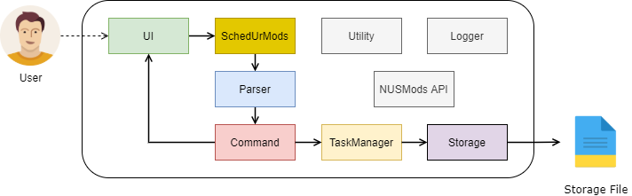
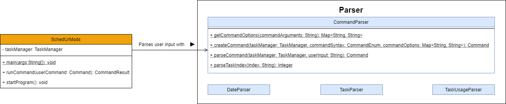
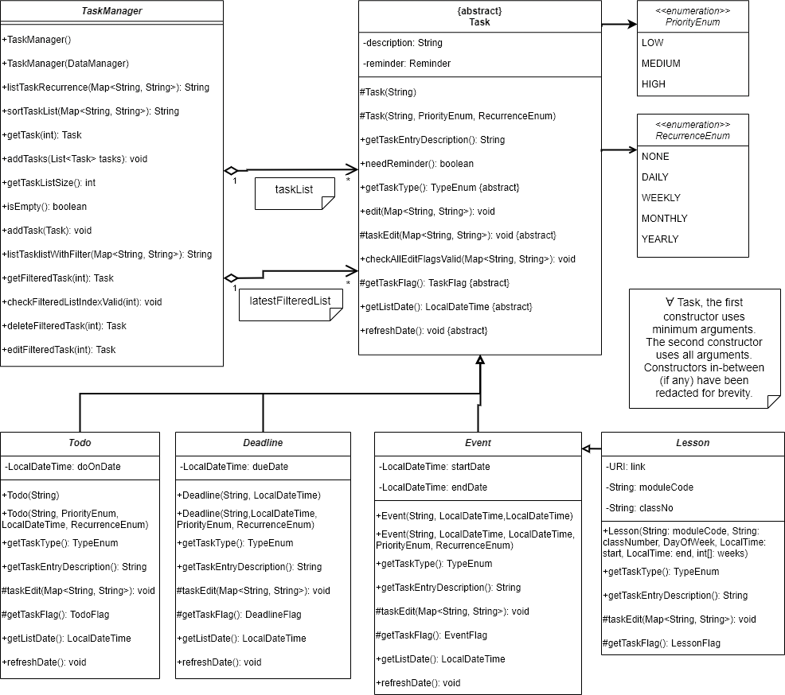
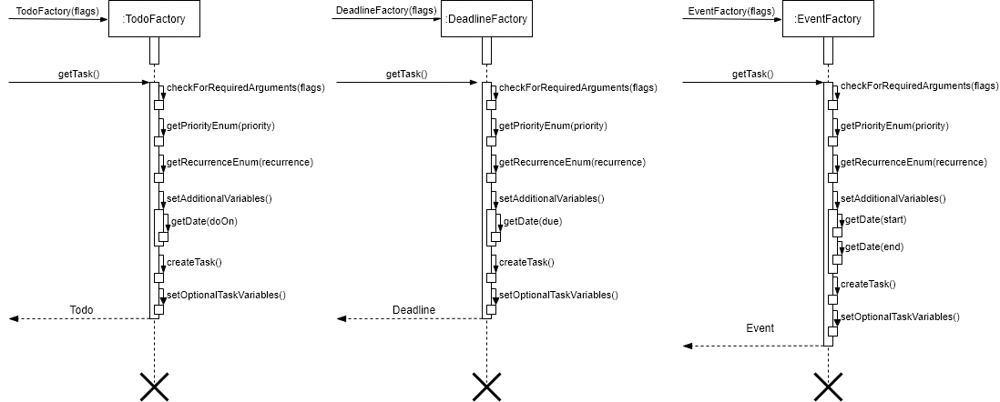
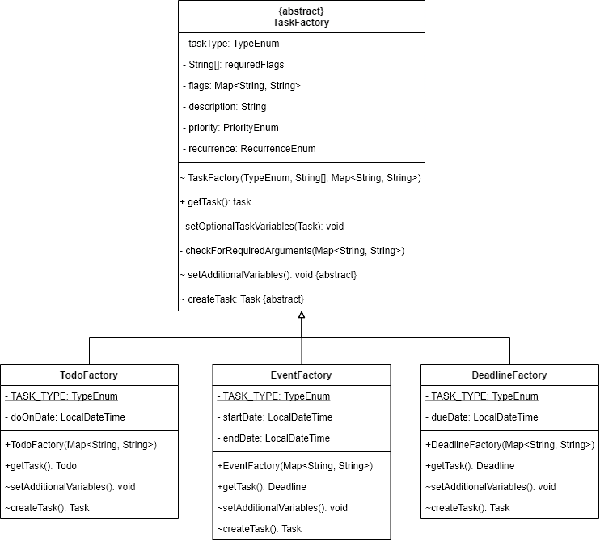

# SchedUrMods Developer Guide <a id="scrollToHere"></a>

- [1. Introduction](#1-introduction)
  - [1.1 Purpose](#11-purpose)
  - [1.2 Acknowledgments](#12-acknowledgements)
- [2. Setting up, getting started](#2-setting-up-getting-started)
  - [2.1 Pre-requisites](#21-pre-requisites)
  - [2.2 Download the project on your computer](#22-download-the-project-on-your-computer)
  - [2.3 Setting up the project in IntelliJ](#23-setting-up-the-project-in-intellij)
- [3. Design](#3-design)
  - [3.1 Architecture](#31-architecture)
  - [3.2 UI Component](#32-ui-component)
  - [3.3 Parser Component](#33-parser-component)
  - [3.4 Command Component](#34-command-component)
  - [3.5 TaskManager Component](#35-taskmanager-component)
  - [3.5 Storage Component](#36-storage-component)
  - [3.7 Logger Component](#38-logger-component)
  - [3.8 NUSMods API Component](#39-nusmods-api-component)
- [4. Implementation](#4-implementation)
  - [4.1 Task Factories](#41-task-factories)
  - [4.2 Filtering the tasklist](#42-filtering-the-tasklist)
- [5. Appendix: Requirements](#5-appendix-requirements)
  - [5.1 Product scope](#51-product-scope)
  - [5.2 User stories](#52-user-stories)
  - [5.3 Non-Functional Requirements](#53-non-functional-requirements)
  - [5.4 Glossary](#54-glossary)
- [6. Appendix: Instructions for manual testing](#6-appendix-instructions-for-manual-testing)
  
## 1. Introduction
**SchedUrMods** is a desktop application for NUS students who wish to manage 
their assignments and semester-related information via CLI (command-line interface).
If you can type fast, SchedUrMods can help you manage your daily tasks faster than 
traditional GUI application.

**SchedUrMods** is written in `Java 11` and utilises the **Object-Oriented Programming (OOP)** 
paradigm to provide the following benefits during the development of the application. 

- Modularity for easier troubleshooting
- Reuse of code through inheritance 
- Flexibility through polymorphism

### 1.1 Purpose
This developer guide is intended for software developers, designers, or testers who wish
to contribute to the development of the **SchedUrMods** application. 

The guide provides an overall architectural view of **SchedUrMods** and describes the 
implementation of key features of the application that is supplemented with easy to understand
UML diagrams.

### 1.2 Acknowledgements
This section provides a list 3rd-party libraries adapted in the development of **SchedUrMods**.

1. [iCal4J](http://ical4j.github.io/)
2. [Gson](https://github.com/google/gson)
3. [Apache Commons IO](https://commons.apache.org/proper/commons-io/)
4. [Checkstyle](https://checkstyle.sourceforge.io/)
5. [JUnit](https://junit.org)
6. [Google Material Icons](https://google.github.io/material-design-icons/)

## 2. Setting up, getting started
This section provides instructions on how to set up the development environment of the **SchedUrMods** application.

### 2.1 Pre-requisites
Please ensure that you have the following software installed, prior to setting up the project:

1. IDE: [`IntelliJ IDEA`](https://www.jetbrains.com/idea/download/)
   1. Development platform used for the development for the application.
2. JDK: [`Java 11`](https://docs.aws.amazon.com/corretto/latest/corretto-11-ug/downloads-list.html)
   1. Programming language the application is written in.
3. Revision Control: [`SourceTree`](https://www.sourcetreeapp.com/)
   1. Version control software used by development team.

### 2.2 Download the project on your computer
Please follow the following steps below to download the project file on your computer:

1. Click [here](https://github.com/AY2122S1-CS2113T-W13-3/tp) to access the Github repository of the **SchedUrMods** application. 
2. **Fork** and **Clone** the repository using `SourceTree`.

### 2.3 Setting up the project in IntelliJ
Please follow the following steps below to set up the project in `IntelliJ`:

1. Launch `IntelliJ` application.
   1. On the toolbar, click on `file` and then `Open...`.
   2. Find and select the project folder that was previously downloaded.
2. Configure the **Project SDK** to use `Java 11`
   1. On the toolbar, click on `file` and then `Project Structure...`
   2. Select `Project`
      1. Configure `Project SDK:` to use `Java 11`.
      2. Configure `Project language level:` to use `SDK default`.
3. Verify the setup:
   1. After completing steps **1** and **2**, right-click on the following java class 
   `\src\main\java\seedu\SchedUrMods.java` and select `Run SchedUrMods.main()`
   2. Assuming the project is set up correctly, you should see the following display in the terminal:
   
```
 _____        _                _  _   _       ___  ___            _
/  ___|      | |              | || | | |      |  \/  |           | |
\ `--.   ___ | |__    ___   __| || | | | _ __ | .  . |  ___    __| | ___
 `--. \ / __|| '_ \  / _ \ / _` || | | || '__|| |\/| | / _ \  / _` |/ __|
/\__/ /| (__ | | | ||  __/| (_| || |_| || |   | |  | || (_) || (_| |\__ \
\____/  \___||_| |_| \___| \__,_| \___/ |_|   \_|  |_/ \___/  \__,_||___/
-------------------------------------------------------------------------
Command-Line Interface for NUSMODS                               (v2.1.0)
-------------------------------------------------------------------------
[user]:
```
      
## 3. Design
### 3.1 Architecture
<p align="center">
    
</p>

The Architecture Diagram above shows the high-level design of **SchedUrMods** 
and how **SchedUrMods** main components are connected.

**Main components of the architecture**

`SchedUrMods` contains the main method of the application. It is responsible for,
- **At app launch**: Initializes the components in the correct sequence, and connects them up with each other.
- **While app is running**: Reads user input and outputs the appropriate command result.
- **At shut down**: Shuts down the components and invokes cleanup methods where necessary.

The rest of the App consists of seven main components.
- `UI`: Handles user input and displaying of messages on the terminal.
- `Parser`: Interpret user input and decides which `Command` is to be executed.
- `Command`: Collection of user command classes + Handles command execution
- `Storage`: Reads data from, and writes data to, the hard disk.
- `Utility`: Collection of classes used by multiple other components.
- `Logger`: Handles the logging throughout all classes
- `NUSMods API`: Communicate with NUSMods server to pull module related information.

**How the architecture components interact with each other**

The **Sequence Diagram** below shows how the components interact with each other for the 
scenario where the **user inputs any valid command** in to the application.

<p align="center">
    
</p>

### 3.2 UI Component
The **main API** of this component is specified in [`Ui.java`](https://github.com/AY2122S1-CS2113T-W13-3/tp/blob/master/src/main/java/seedu/duke/ui/Ui.java)

<p align="center">
    
</p>

The UI Component consists of the `Ui.java` class, which handles all user input and output operations within the 
**SchedUrMods** application. The application structure (i.e. logo, borders, cursor...) is also defined in this 
class as constant `String` variables to improve readability of the class and allow changes to be made
to the general user interface easier.

The `Ui.java` class implements the below functionalities using the following methods:
- `printLogo`: Prints the application logo when the application is launched.
- `printCursor`: Prints the user's cursor to indicate point of entering commands.
- `readInput`: Obtain user input entered as a `String` to be parsed later on.
- `printMessage`: Prints the system generated messages (i.e. command execution, errors, exceptions...)
in a pre-defined formatting.

### 3.3 Parser Component
The **main API** of this component is specified in [`CommandParser.java`](https://github.com/AY2122S1-CS2113T-W13-3/tp/blob/master/src/main/java/seedu/duke/parser/CommandParser.java)

<p align="center">
    
</p>

The Parser Component consists of `CommandParser.java` and other additional helper parsers such as `DateParser.java`, 
`TaskParser.java`, and `TaskUsageParser.java` classes. Importantly, the `CommandParser.java` class is responsible 
for parsing the user's input and generating the correct `Command` object to be returned to the `SchedUrMods` class.

Any flags and arguments present in the user's input are extracted out and stored in a `Map<String, String>` as a 
flag to argument keyset. This `Map` is then parsed as a parameter during the creation of the `Command` object along
with the **main command** converted into a `CommandEnum`.

The `CommandParser.java` class implements the below functionalities using the following methods:
- `getCommandOptions`: Converts the command arguments entered by the user into a `Map<String, String>` variable. 
The purpose of this is to enable direct and easier access to flags based on the name.
- `createCommand`: Creates the correct `Command` based on the main command and any flags or arguments it may have.
- `parseCommand`: Parent method that calls the above methods after splitting and sanitising the user's input into
a `CommandEnum` variable for the **main command** and a `Map<String, String>` variable for the flags or arguments 
associated with it.

### 3.4 Command Component
<p align="center">
    
</p>

The `Command` component consists of an abstract class `Command` that all commands should inherit from. There are then 3 seperate types of Commands.
 - `XYZCommand`: These are commands that do not interact with `TaskManager` and need no flags. e.g. the 'bye' command.
 - `XYZTaskManagerCommand`: These are commands that perform a function with `TaskManager` based on the flags that are entered in the `Map<String, String>` e.g. the 'edit' or 'sort' command.
 - `TaskCommand` these are commands that add Tasks to the `TaskManager`. individual TaaskCommands will inherit from this class and set the `TaskFactory` and Task usage e.g. the 'Deadline' command.
   >💡 **Note**: The `ModuleCommand` is implemented with `XYZTaskManagerCommand` instead of `TaskCommand` as it does **not** use a `TaskFactory`.  

On executing the command (`executeCommand()` called), the `CommandResult` should be returned with 2 variables. `message` is the message to be printed back to the user and `isExited` is whether the program should exit after this command.

### 3.5 TaskManager Component
<p align="center">
    
</p>

The `TaskManager` component is what manages all the Tasks in the program.  
In `TaskManager`, there are 2 lists. `taskList` and `latestFilteredList`.
- `taskList`: corresponds to the list of all tasks currently stored in the `TaskManager`.
- `latestFilteredList`: corresponds to the latest list that was printed by the `list` command.
   - This list was created to make it easier for users to delete and edit tasks as they can use the index in `latestFilteredList`. E.g. if they wanted to delete all `low` priority tasks, they can list with a filter of `low` priority and delete all those tasks.

When listing tasks. `refreshDate()` is called before listing tasks. This is to enure that all dates are recurred to the latest date if they have a `recurrence` that is not `none`.
The `Task` object is what is managed by the `TaskManager`. 
 - Each Task has a `description`, `priority` and `recurrence` with concrete Tasks adding any additional variables and formatting the `getTaskEntryDescription()` method respectively.
 - They also each have their own `TaskFlag` class which includes a list of all valid flags for agruments in creating the specific task.
   - This is used in the '`checkAllEditFlagsValid()` in the `edit` command function in editing tasks to ensure that all the flags entered by the user are correct for the respective task.  
 - `taskEdit()` is to be overridden to check the `Map<String, String>` for the respective flags in the concrete `Taskflag` and edit the parameters in the concrete `Task` object respectively.

### 3.6 Storage Component
<p align="center">
    
</p>

The Storage is handled by the `DataManager` class.
 - All of the objects are initialised on starting the program in `SchedUrMods` class.
 - The `DataManager` class takes in a `FileCreator` which creates the file for storing the Task data.
 - The `TaskManager` class takes in a `DataManager` and loads the `taskList` using the DataManager. It also adds the `DataManager` as an `Observer` so that it can update the `DataManager` whenever `taskList` changes.
 - The `DataManager` has been designed with **Dependency injection** in mind so that programmers would know what objects are required for each class.
   >💡 **Note**: `TaskManager` can be initialised without any `DataManager` as an argument. In which case it would still work albeit without any storage functionality. (useful for testing)

<p align="center">
    
</p>

 - Whenever a Create, Read or Update function is performed in TaskManager on `taskList`, the `updateObservers()` function should be called so that `DataManager` can write the updated `taskList` to the Task save file.
 - Because `taskList` is created in `DataManager` and returned to `TaskManager` (as seen in the first sequence diagram), there is no need to constantly pass the `taskList` as an argument to `DataManager` when calling `update()` as they **both** have the same reference to `taskList`.
 - The Tasks are stored in a `json` format in the file `data/tasks.dat` and are parsed using the [`Gson`](https://github.com/google/gson) library.

>💡 **Note**: The storage component has been implemented using the [Observer Design Pattern](https://en.wikipedia.org/wiki/Observer_pattern) where `TaskManager` implements `Subject` and `DataManager` implements `Observer`.

### 3.8 Logger Component
 - The Logger has been implemented with the `java.util.logging` library.
 - It's designed to be as easy to use as possible where in order to log any message, you only have to use `Log.<severity>(message)`.
   - E.g. `Log.info("this is an info log")`.
 - The logger will automatically log your message in the following format:
```
[YYYY-MM-dd HH:mm:ss] [full.class.path]
SEVERITY: Log Message Here 
```
- The way the logger gets the class name is by using the `Thread.currentThread().getStackTrace()` function to determine which class called the log function.
- All individual class loggers are stored in a hashmap `Map<String, Logger>` where if a class name is not already in the hashmap on calling any log function, it will be added automatically.
- All log messages above `Level.SEVERE` will be printed to console and all log messages above `Level.FINE` will be added to the log file `log.txt`.

### 3.9 NUSMods API Component

The major parts of this component lies within the nusmods package.

The parsing logic is implemented in the NusModsParser class, which exposes the following public API,

- `getLessons`: Obtain an array of Lesson objects given a module code and a lesson number. 
This relies on either local cache or network being available.

Additionally, the auxiliary class `Semester` implements complement utility for handling NUS semesters and offers two-way
conversion between java time API and semesters. The enumeration class `Semester` exposes the following APIs,

- `getSemester`: Get the semester at a certain time, or at the current instant.
- `fromInt`: Convert the integer representation from NUSMods API response to the enumeration.
- `getWeekLength`: Get the number of weeks in a certain semester.
- `acadWeeksToRealWeeks`: Convert academic weeks to real weeks.
- `getStartingMonday`: Get the starting Monday of a specific semester, or the current semester.

## 4. Implementation

### 4.1 Task Factories
<p align="center">
    
</p>

`Todo`, `Deadline` and `Event` Tasks are created using Task factories.
 - All Task factories inherit from the abstract `TaskFactory` class and are created using similar steps:
   1. It firstly checks that all the required flags for making the concrete Task are present and throws `RequiredArgmentNotProvidedException` if a flag is missing.
   2. It then initialises the `description`, `priority` and `recurrence`. 
   3. From there it sets any additional variables that are present in the concrete Task.
   4. It creates the task and sets the `priority` and `recurrence` if they are not `null`
   5. It returns the created concrete Task.

<p align="center">
    
</p>

The `TaskFactory` has been designed using the [Factory Method Pattern](https://en.wikipedia.org/wiki/Factory_method_pattern#UML_class_diagram). It was also designed to be easily extendable to allow for more concrete Task factories to be easily added. Each set of variables are initialised in their respective factories. e.g. `priority` is a `Task` variable so it's initialised and set in `TaskFactory` while `dueDate` is a `Deadline` variable so it's initialised and set in `DeadlineFactory`.

1. To extend the `TaskFactory`, you should create a constructor which takes in a `Map<String, String> flags` argument and define `TypeEnum taskType` and `String[] requiredFlags` as constants.
2. From there you have to override the `setAdditionalVariables()` function to set any new variables that are unique to the concrete Task you want to impelment.
3. override `createTask()` to return the constructed Task (you can ignore `priority` and `recurrence` as they are set in `TaskFactory`)
4. optional: you may override `getTask()` to return the concrete Task instead of the abstract `Task`.

The Class diagrams for the different Tasks:  
  

Fixed values such as priority and recurrence are stored as an enum to ensure standardisation and that there are no invalid values being stored. The TaskTypes are also stored as an enum so that we can easily get the taskType when we have the task (and by extension the name of the task) for anything to do with parsing.  
  

The creation of tasks with the td, deadline r event cmmands are done using their respecive Task Factories  
  
The sequence diagram above shows the creation of a Todo Task using TodoFactory.
1. It checks if it has the required arguments and then throws an exception for any required argument that does not exist e.g. description.
1. After that it parses the dates, priority and recurrence arguments into the appropriate objects that are stored in the Task object
1. Finally, it calls getConstructor() with the parameters. getConstructor()'s logic will find and call the appropriate Task constructor and return the Task created.  

The same logical structure is used in the Deadline and Event factories.  

### 4.2 Filtering the tasklist

The sequence diagram and description below shows the process of filtering the user's tasklist that is managed
by the `TaskManager.java` class.

<p align="center">
    
</p>

**Step 1**: When the `ListCommand` receives the call to be executed by the main class `SchedUrMods`, it will proceed to call the `listTasklistWithFilter()` method 
and input the command arguments stored as a flag-argument `Map<String, String>`, in this case the **filters** entered by the user, 
that was previously sanitised by the `CommandParser`.

**Step 2**: The `listTasklistWithFilter()` method will then loop through all the **filters** and check the validity of the filters
currently stored in the flag-argument `Map<String, String>`.

**Step 3**: For each valid filter found, the respective filter functions will be called and will filter out all the tasks that
do not match the filter specified by the user. For instance, if the filter flag equals to `type` and it's corresponding mapped
value is `Todo`, then the method `filterListByTaskType()` will filter out all the tasks who do not have task type equals to `Todo`,
and return a filtered tasklist with only `Todo` tasks.

**Step 4**: The returned filtered tasklist will be reused for the remaining filters present in the flag-argument `Map<String, String>`
of the filters to allow for multi-level filter to increase the filtering depth for the user to locate specific tasks
that matches multiple filters.

**Step 5**: Once the `listTasklistWithFilter()` method has looped through all the filters stored in the `Map<String, String>`,
it will call the `getListTasklistWithFilterMessage()` method along with the final filtered tasklist to obtain a nicely 
pre-formatted `String` containing a neat list of the final filtered tasks that matched all the filtering criteria.

**Step 6**: A `CommandResult` object is then created and stores the `String` containing the filtered tasklist
as the command execution message to be handled by the `Ui` and displayed to the user on the terminal interface.

## 5. Appendix: Requirements

### 5.1 Product scope
**Target User Profile**

The target user profile of **SchedUrMods** are NUS students from all faculties.

**Needs of Target Users**

- Prefer CLI interface as opposed to GUI interface.
- Needs a quick way to manage their homework and assignments.
- Needs a quick way to launch lesson zoom links.
- Needs a quick way to view semester timetable.

### 5.2 User stories
**Priorities**: High (must have) - `* * *`, Medium (nice to have) - `* *`, Low (unlikely to have) - `*`

| Priority | As a ... | I want to ... | So that I can ...|
|----------|----------|---------------|------------------|
|`* * *`|new user|see usage instructions|refer to them when I forget how to use the application|
|`* * *`|new user|update my timetable via NUSMODS automatically|stop keeping track of changes made on NUSMODS|
|`* * *`|user|add tasks to my tasklist|track all of my tasks I have easily|
|`* * *`|user|view all my tasks in my tasklist|know which tasks are soon to be due|
|`* *`|user|have different kinds of task types|know the nature of my task|
|`* *`|user|set priorities to tasks in my tasklist|know which tasks are more important than others|
|`* *`|user|set a task to recur automatically|reduce the number of times I need to update the tasklist|
|`* *`|user|add zoom links to a lesson task|save time spent finding the zoom link|
|`* *`|user|launch zoom links from the application|save time opening browser|
|`* *`|user|filter my tasklist|find tasks that match a certain criteria quickly|
|`* *`|user|view the upcoming recurrences of a task|plan my schedule accordingly|
|`* *`|user|sort my tasklist by priority|view the most important tasks I have at the top of the tasklist|
|`* *`|user|edit my tasks|reduce the number of times I have to add new tasks|
|`* *`|user|set reminders for my tasks|will not forget if I have a task upcoming|
|`*`|user|have tab completion|reduce the time spent typing commands|

### 5.3 Non-Functional Requirements

1. Should work on any mainstream OS as long as it has Java 11 or above installed.
2. Should be able to hold up to 100 tasks without a noticeable sluggishness in performance for typical usage.
3. A user with above average typing speed for regular English text (i.e. not code, not system admin commands) 
should be able to accomplish most of the tasks faster using commands than using the mouse.

### 5.4 Glossary

* *Mainstream OS* - Windows, Linux, Unix, OS-X

## 6. Appendix: Instructions for manual testing

### Launch and Exit
Initial Launch:
1. Download the **SchedUrMods** latest JAR file [here](https://github.com/AY2122S1-CS2113T-W13-3/tp) and copy it into an empty folder.
2. Launch a terminal from the folder containing the **SchedUrMods** JAR file.
3. Type `java -jar SchedUrMods.jar` into the terminal to start **SchedUrMods**.

    **Expected Output**: The welcome screen of the **SchedUrMods** application (Logo + User Interface)
    with the corresponding correct version number.

    ```
     _____        _                _  _   _       ___  ___            _
    /  ___|      | |              | || | | |      |  \/  |           | |
    \ `--.   ___ | |__    ___   __| || | | | _ __ | .  . |  ___    __| | ___
    `--.  \ / __|| '_ \  / _ \ / _` || | | || '_| | |\/| | / _ \  / _` |/ __|
    /\__/ /| (__ | | | ||  __/| (_| || |_| || |   | |  | || (_) || (_| |\__ \
    \____/  \___||_| |_| \___| \__,_| \___/ |_|   \_|  |_/ \___/  \__,_||___/
    -------------------------------------------------------------------------
    Command-Line Interface for NUSMODS                               (v2.1.0)
    -------------------------------------------------------------------------
    [user]:
    ```

Exiting the application:
1. Type `bye` into the terminal to exit **SchedUrMods**.

   **Expected Output**: Message indicating that the program is exiting.

    ```
    -------------------------------------------------------------------------
    [user]: bye
    || Exiting program!
    -------------------------------------------------------------------------
    ```

### Listing the Tasklist
**Case A**: Tasklist is empty
1. Type `list`

   **Expected Output**: Warning message informing user that the tasklist is empty.

**Case B**: Tasklist is not empty
1. Type `list`

   **Expected Output**: List of the user's tasks that was added before.

### Filtering the Tasklist

>💡 **Note**: If none of the filters match, only the header of the tasklist will be returned.

**Case A**: By task type
1. Type `list --type todo`

   **Expected Output**: List of all the `Todo` type tasks.
2. Type `list --type deadline`

   **Expected Output**: List of all the `Deadline` type tasks.
3. Type `list --type event`

   **Expected Output**: List of all the `Event` type tasks.

**Case B**: By priority
1. Type `list --priority low`

   **Expected Output**: List of all the tasks with priority `low`.
2. Type `list --priority medium`

   **Expected Output**: List of all the tasks with priority `medium`
3. Type `list --priority high`

   **Expected Output**: List of all the tasks with priority `high`

**Case C**: By recurrence
1. Type `list --recur none`

   **Expected Output**: List of all the tasks do not recur.
2. Type `list --recur daily`

   **Expected Output**: List of all the tasks that recurs `daily`
3. Type `list --recur weekly`

   **Expected Output**: List of all the tasks that recurs `weekly`
4. Type `list --recur monthly`

   **Expected Output**: List of all the tasks that recurs `monthly`
5. Type `list --recur yearly`

   **Expected Output**: List of all the tasks that recurs `yearly`

### Sorting the Tasklist

>💡 **Pre-requisite**: Add at least 1 tasks of each task type and priority, and name all task descriptions
> after the letters of the alphabets.

**Case A**: Sort by task type
1. Type `sort --by type`

   **Expected Output**: Message informing user that the tasklist has been sorted by task type.
2. Type `list`

   **Expected Output**: All tasks with same task types are now grouped together in the tasklist.

**Case B**: Sort by description
1. Type `sort --by description`

   **Expected Output**: Message informing user that the tasklist has been sorted in alphabetical order.
2. Type `list`

   **Expected Output**: All tasks are now sorted alphabetically.

**Case B**: Sort by priority
1. Type `sort --by priority`

   **Expected Output**: Message informing user that the tasklist has been sorted by priority.
2. Type `list`

   **Expected Output**: All tasks are now sorted from highest to lowest priority.

### Viewing the recurrence of a task

>💡 **Pre-requisite**: Add 1 task into the tasklist with a recurrence value of `daily`. The recurrence
> value can be modified and changed to  test the correctness of the recurrence feature.

**Case A**: Task is a non-recurring task
1. Type `list <task id of a non-recurring task>`

   **Expected Output**: Warning message telling the user that the selected task is non-recurring and to choose another task.

**Case B**: Task is a recurring task
1. Type `list <task id of a recurring task>`

    **Expected Output**: The next 4 recurrences of the task that are in increments of the type of recurrence.

