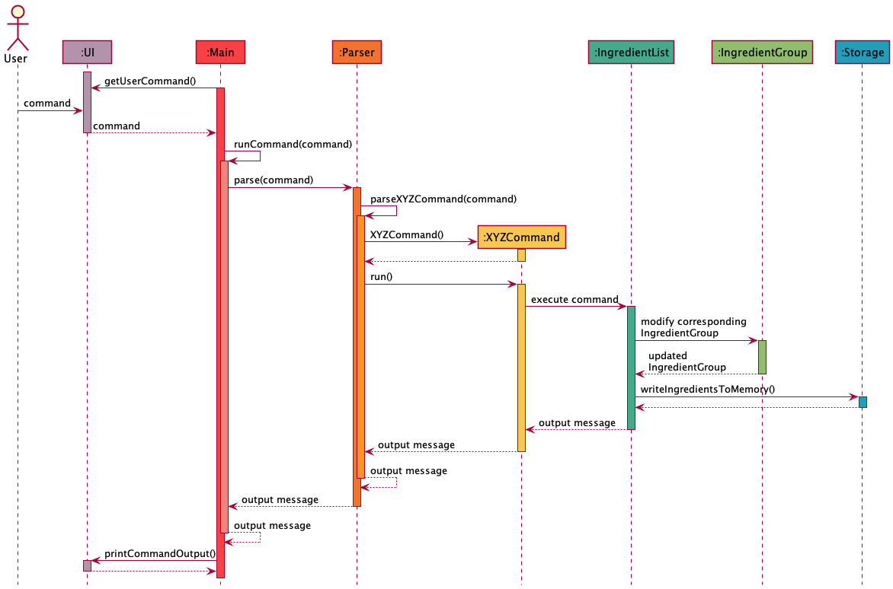
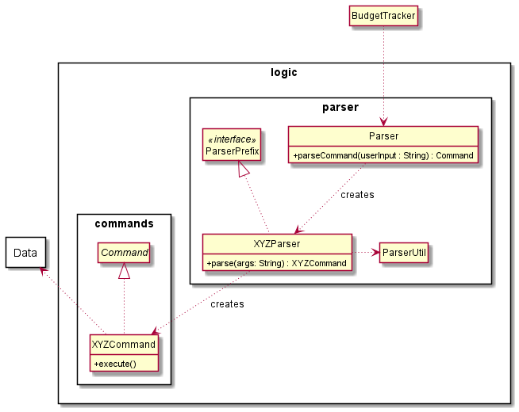
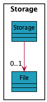
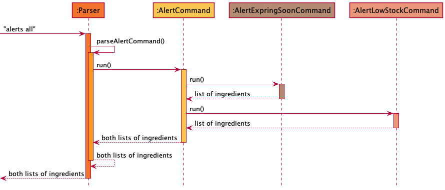
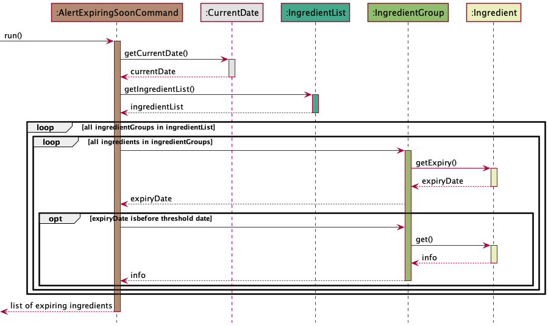
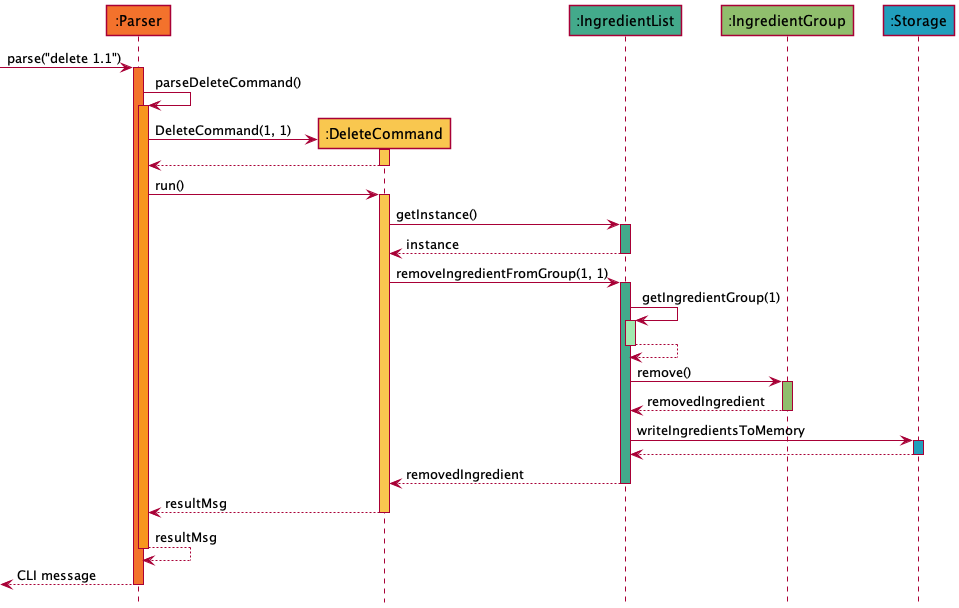
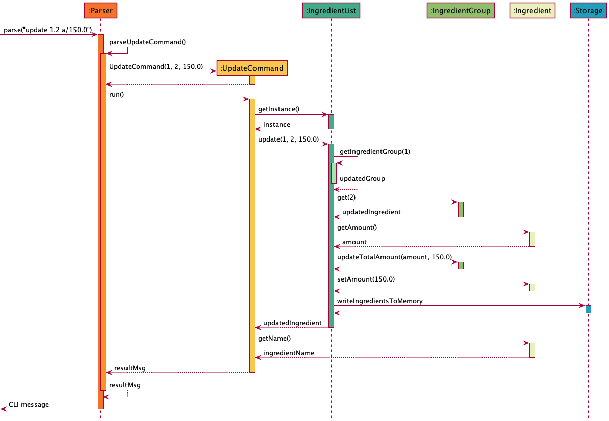

# Developer Guide for SITUS

## Acknowledgements

{list here sources of all reused/adapted ideas, code, documentation, and third-party libraries -- include links to the original source as well}
* [AB3 Developer Guide](https://se-education.org/addressbook-level3/DeveloperGuide.html) - Reference
* [HighWater Design Specification Document](http://www.cci.drexel.edu/seniordesign/2016_2017/HighWater/HighWaterDesignDocument.pdf) - Reference
* [FDsys System Design Document](https://www.govinfo.gov/media/FDsys_Architecture.pdf) - Reference

## Table of contents
[1. Introduction](#1-introduction) <br>
&nbsp;&nbsp;[1.1. Purpose](#11-purpose) <br>
&nbsp;&nbsp;[1.2. Audience](#12-audience) <br>
[2. First-time setup](#2-first-time-setup) <br>
&nbsp;&nbsp;[2.1. Prerequisites](#21-prerequisites) <br>
&nbsp;&nbsp;[2.2. Setting up the project on the computer](#22-setting-up-the-project-on-the-computer) <br>
&nbsp;&nbsp;[2.3. Running the program for the first time](#23-running-the-program-for-the-first-time) <br>
[3. Design](#3-design) <br>
&nbsp;&nbsp;[3.1. System architecture](#31-system-architecture) <br>
&nbsp;&nbsp;[3.2. UI component](#32-ui-component) <br>
&nbsp;&nbsp;[3.3. Parser component](#33-parser-component) <br>
&nbsp;&nbsp;[3.4. Command component](#34-command-component) <br>
&nbsp;&nbsp;[3.5. IngredientList component](#35-ingredientlist-component) <br>
&nbsp;&nbsp;[3.6. Storage component](#36-storage-component) <br>
[4. Implementation](#4-implementation) <br>
&nbsp;&nbsp;[4.1. Alerts](#41-alerts) <br>
&nbsp;&nbsp;[4.2. Alerts](#42-deleting-ingredients) <br>
[5. Product scope](#5-product-scope) <br>
[6. User stories](#6-user-stories) <br>
[7. Non-functional requirements](#7-non-functional-requirements) <br>
[8. Instructions for manual testing](#8-instructions-for-manual-testing)<br>

## 1. Introduction

### 1.1. Purpose
This document specifies the architectural and software design decisions in the implementation of the Smart Inventory
Tracking and Updating System (SITUS).

### 1.2. Audience
The intended audience for this document are developers looking to introduce new functionalities based on their needs.

## 2. First-time setup
### 2.1. Prerequisites
1. **Java JDK 11** installed on computer
2. **IntelliJ IDEA** most recent version

### 2.2. Setting up the project on the computer
1. Clone **[this](https://github.com/AY2122S1-CS2113T-T09-3/tp.git)** repo onto your computer.
2. Open IntelliJ (if you are not in welcome screen, click **`File`** > **`Close Project`** to close the existing project first).
3. Set up the correct JDK 11 for IntelliJ.
   1. Click **`File`** > **`Project Structure..`** > **`Project`**.
   2. Click the arrow drop-down button in **`Project SDK`**.
   3. Choose **`11 Amazon Correcto version 11.0.12`**.
   4. In the same dialog, set the Project language level field to the SDK default option.
   5. Click **`Apply`** and **`OK`**.
4. Click **`File`** > **`Open`** 
5. Locate and select the cloned project directory.
6. Accept all defaults as prompted by IntelliJ.

### 2.3. Running the program for the first time
1. Run the main SITUS program in `src/main/java/seedu.situs/Situs`.
2. Key in a few commands to make sure the program works.
>:exclamation: **Note**: Before proceeding with step 3, make sure all the contents in the file `data/ingredients.txt`
> are fully deleted. The Junit tests in step 3 will not pass if there are contents already in the storage file.
3. Run the Junit tests in `/src/test/java/seedu.situs` to make sure the programs passes all tests.


## 3. Design

### 3.1. System Architecture


The **_Architecture Diagram_** above explains the high-level design of the application.


The App consists of 6 major components:
* `Main`: Initializes and connects the components together
* `UI`: Class that deals with the interaction with the user.
* `Parser`: Class that processes inputs and executes commands.
* `Command`: A set of classes covering the functionalities of the App.
* `IngredientList`: Class that holds the information of ingredients.
* `Storage`: Reads data from, and writes data

**Interaction between architecture components**

The _sequence diagram_ below shows how the components interact with each other given a scenario where the user 
enters the input `add n/carrot a/1 e/2021-11-12`



Each of the 5 components (apart from `main`) can be found in their respective packages.

### 3.2. UI component

The **UI** component can be found in the `UI` package. The UI reads commands from the user, sends the command to `Main` to be executed and prints an output message upon completion of the command or if an error occurred.

### 3.3. Parser component

The **Parser** component can be found in the `parser` package. 

The package consists of the `Parser` class, which parses the command input by the user and executes the required `XYZCommand` class (`XYZ` is henceforth used as a placeholder for the specific command name, e.g. `AddCommand`).

### 3.4. Command component

The **Command** component can be found in the `command` package

The package consists of an abstract class `Command` and classes named `XYZCommand`. `Command` has only one abstract method, `run()`. All `XYZCommand` classes inherit from `Command` and implement `run()` to execute the corresponding commands. 

The class diagram below shows the relationships between `Parser`, `Command` and `XYZCommand`.



A quick overview of how a command is parsed and executed is as such:
* The command entered by the user is passed to `Parser`.
* `Parser` calls its `parseXYZCommand()` method with the command entered by the user as its parameter.
* `parseXYZCommand()` creates an instance of the corresponding `XYZCommand` class and calls its `run()` method.
* Thus, the command entered by the user is executed.

### 3.5. IngredientList component

The **IngredientList** component can be found in the `ingredients` package

Below is a partial class diagram of the `IngredientList` component


The `IngredientList` class 
* receives stored data(if any) from `Storage` when the first command is executed
* stores each group of `Ingredient` objects in `IngredientGroup`, grouped by their `name`
* sends the stored data to the `Storage` class for storage after command execution 

Each of the `Ingredient` objects contains information about an ingredient, namely its `name`, `amount` in stock and the `expiry` date.

### 3.6. Storage component

The **Storage** component can be found in the `Storage` package

Below is a partial class diagram of the `Storage` component



The `Storage` class
* loads/makes storage data file in memory when its constructor is called.
* has a public method to return the `ArrayList` of `Ingredient` type in the storage file.
* has a public method can take an `ArrayList` of `Ingredient` to write to the memory file.

The two public methods mentioned above are the most essential for the storage capablility of the program.
`IngredientList` object will only use `loadIngredientsFromMemory()` and `writeIngredientsToMemory()` methods
of the storage class only when there is a change in the ingredient list of the program.

## 4. Implementation

### 4.1. Alerts

Alerts are displayed automatically on startup, and when the user enters the command to display alerts. There are 3 types of commands:
* `alerts all`: displays alerts for both alert types below
* `alerts expiry`: displays alerts for ingredients expiring within a threshold number of days
* `alerts stock`: displays alerts for ingredients with stock lower than a threshold amount

The user is able to call any of the 3 methods on their own, while on startup, the `alerts all` command is automatically called via the `AlertCommand` class.

The sequence diagram for when the user inputs `alerts all` is shown below.



All constructors for the command classes are called right before the relevant `run()` methods, as in `new XXXCommand().run()`. These are not shown in the diagram for simplicity. 

The `alerts all` command is passed into the `parser` class's `parse` command, which invokes the `parseAlertsCommand` method.

Next, an `AlertCommand` class is instantiated and `run` is called. This further calls 2 classes and runs them
1. The `AlertExpiringSoonCommand` class: Returns a list of ingredients expiring by a calculated date 
2. The `AlertLowStockCommand` class: Returns a list of ingredients with stock lesser than the threshold 

Each of the classes returns a String after `run`, which the `AlertCommand` class sends back to the parser to be returned.

The sequence diagram for the `AlertExpiringSoonCommand.run()` is shown below. The user can also call this via `alerts expiry`



The current date is obtained via the `CurrentDate` class, with which the threshold number of days is added to obtain the threshold date.

The expiry date of `Ingredient` object in each `IngredientGroup` in the `IngredientList` class is taken and compared to the threshold date. 
The information of the `Ingredient` is taken note of to be printed when the function returns.

For `AlertLowStockCommand`, it is less complicated, and the sequence diagram shown below. The user can also call this via `alerts stock`


The `totalAmount` for each `IngredientGroup` in the `IngredientList` is obtained and compared to the threshold amount. The 
information of the `IngredientGroup` is taken note of to be printed when the function is returned.

### 4.2. Deleting ingredients

Delete is performed on individual ingredients within the ingredient groups. For example, the current ingredient inventory is
```
1. Carrot | Total Amount: 12.2 kg
	Amount Left: 10.0 kg | Expiry Date: 23/12/2021
	Amount Left: 2.2 kg | Expiry Date: 25/12/2021

2. Potato | Total Amount: 7.1 kg
	Amount Left: 5.0 kg | Expiry Date: 25/12/2021
	Amount Left: 2.1 kg | Expiry Date: 12/11/2021

3. Beef | Total Amount: 5.1 kg
	Amount Left: 5.1 kg | Expiry Date: 01/02/2022
```
Then, calling `delete n/ carrot e/ 25/12/2021` will remove the second entry in the `carrot` category.
The sequence diagram below illustrates the above command example



### 4.3. Updating ingredients
Updating is performed on individual ingredients within the ingredient groups. For example, the current ingredient inventory is
```
1. Carrot | Total Amount: 18.7 kg
	Amount Left: 10.0 kg | Expiry Date: 23/12/2021
	Amount Left: 2.2 kg | Expiry Date: 25/12/2021
	Amount Left: 6.5 kg | Expiry Date: 02/01/2022

2. Potato | Total Amount: 7.1 kg
	Amount Left: 5.0 kg | Expiry Date: 25/12/2021
	Amount Left: 2.1 kg | Expiry Date: 12/11/2021
```
Then, calling `update n/carrot a/1.9 e/25/12/2021` will update the second entry in the carrot category. The sequence diagram 
below illustrates the above command example.



After individual ingredient has been updated, the ingredient inventory list is
```
1. Carrot | Total Amount: 18.4 kg
	Amount Left: 10.0 kg | Expiry Date: 23/12/2021
	Amount Left: 1.9 kg | Expiry Date: 25/12/2021
	Amount Left: 6.5 kg | Expiry Date: 02/01/2022

2. Potato | Total Amount: 7.1 kg
	Amount Left: 5.0 kg | Expiry Date: 25/12/2021
	Amount Left: 2.1 kg | Expiry Date: 12/11/2021
```

### 4.4. Subtracting ingredients
Subtracting is performed on ingredient groups. For example, the current ingredient inventory is
```
1. Carrot | Total Amount: 31.0 kg
   Amount Left: 10.0 kg | Expiry Date: 23/12/2021
   Amount Left: 1.9 kg | Expiry Date: 25/12/2021
   Amount Left: 6.5 kg | Expiry Date: 02/01/2022
   Amount Left: 12.6 kg | Expiry Date: 05/01/2022

2. Potato | Total Amount: 7.1 kg
   Amount Left: 5.0 kg | Expiry Date: 25/12/2021
   Amount Left: 2.1 kg | Expiry Date: 12/11/2021
```
Then, calling subtract n/carrot a/17.5 will subtract 17.5 kgs from the total amount of carrots (29 kgs). 
The sequence diagram below illustrates the above command example.

[ADD DIAGRAM]

After ingredient group has been updated, the ingredient inventory list is
```
1. Carrot | Total Amount: 13.5 kg
   Amount Left: 0.9 kg | Expiry Date: 02/01/2022
   Amount Left: 12.6 kg | Expiry Date: 05/01/2022

2. Potato | Total Amount: 7.1 kg
   Amount Left: 5.0 kg | Expiry Date: 25/12/2021
   Amount Left: 2.1 kg | Expiry Date: 12/11/2021
```

## 5. Product scope

**Target user profile**:
* manages food stock and needs to track a significant number of ingredients/ food items (e.g. a restaurant inventory manager)
* is proficient at typing
* is comfortable with CLI apps

**Value proposition**: track large amounts of ingredients simply through typing commands faster than a GUI driven application

## 6. User stories

|Version| As a ... | I want to ... | So that I can ...|
|--------|----------|---------------|------------------|
|v1.0|new user|see usage instructions|refer to them when I forget how to use the application|
|v1.0|user|view my inventory|save time/labour|
|v1.0|user|add new ingredients|keep track of new ingredients|
|v1.0|user|remove ingredients|stop tracking ingredients that are no longer in use|
|v1.0|user|update ingredient amount|change the amount of an ingredient if I have bought/ used some|
|v2.0|user|receive alerts of ingredients expiring|use the ingredients before they expire and avoid wastage|
|v2.0|user|receive alerts of ingredients that are running out|place orders to replenish stock preemptively|
|v2.0|user|determine the threshold for alerts myself|adjust when I receive alerts based on demand and supply|
|v2.0|user|find stock of an ingredient by name|view stock of an ingredient without having to go through the entire list|
|v2.0|user|subtract stock from current inventory according to the restaurant's usage|automatically update inventory's stock|

## 7. Non-functional requirements

1. Should work on any *mainstream OS* (Windows, Linus, macOS or Unix) with Java `11` or above installed.
2. Users proficient at typing should be able to complete tasks faster using commands than using a mouse with a GUI.

## 8. Instructions for manual testing

### Setting up 
Refer to the [first time setup section](#2-first-time-setup) and follow the steps to run SITUS on your device. For the following sections, refer to the [user guide](UserGuide.md) for information on how to use the different commands.

### Testing features

#### Adding ingredients
1. Add ingredients using the `add` command with the correct format.
2. Use `list` to ensure ingredients you added are shown.
3. Test case: `add n/NAME a/AMOUNT` <br>
Expected: No ingredient is added and an error message is shown.
4. Try other incorrect add commands with different parameters missing <br>
Expected: Similar to previous.

#### Deleting ingredients
1. Use the same list from the previous section. 
2. Test case: `delete 0` <br>
Expected: No ingredient is deleted and an error message is shown.
3. Test case: `delete 1` <br>
Expected: The first ingredient is deleted.

#### Updating ingredients
1. Similar to adding ingredients, first use `update` correctly for an existing ingredient.
2. Next, test `update` with missing parameters <br>
Expected: No ingredient is updated and an error message is shown.
