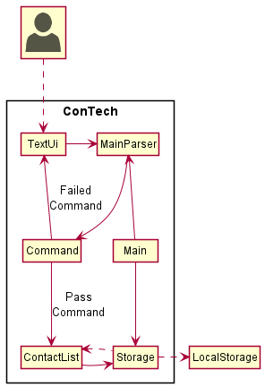
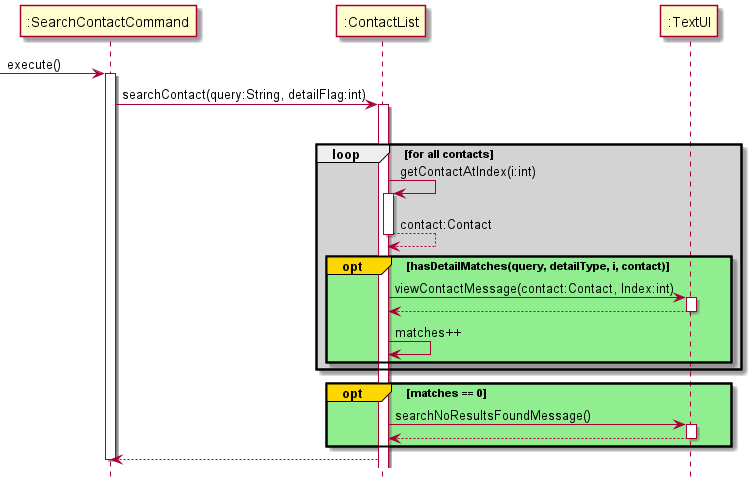
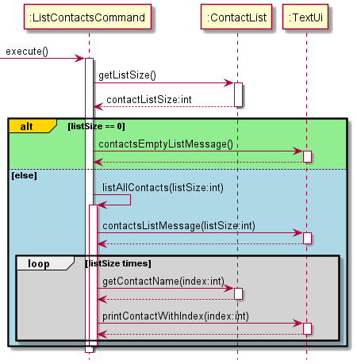

# Developer Guide

### Table of Content
- [Acknowledgements](#acknowledgements)
- [Design](#design)
  - [System Architecture](#sys-arch)
  - [TextUi](#text-ui)
  - [MainParser](#main-parser)
  - [Command](#command)
  - [ContactList](#contact-list)
  - [Storage](#storage)
- [Implementation](#implementation)
  - [Supported contact details](#supported-details) 
  - [Adding a contact](#Add)
  - [Viewing a contact](#View)
  - [Editing a contact](#Edit)
  - [Deleting a contact](#Delete)
  - [Searching a contact](#Search)
  - [Listing all contacts](#List)
- [Product Scope](#scope)
  - [Target user profile](#target)
  - [Value proposition](#value)
- [User Stories](#stories)
- [Non-Function Requirements](#nf-req)
- [Glossary](#glossary)
- [Instructions for manual testing](#manual-test)

## Acknowledgements

- Inspiration for App Idea and OOP Structure: AddressBook (Level 2)  
  https://github.com/se-edu/addressbook-level2
- Inspiration for User Guide and Developer Guide: AddressBook (Level 3)  
  https://se-education.org/addressbook-level3/DeveloperGuide.html  
  https://se-education.org/addressbook-level3/UserGuide.html
- Converting text for ConTech:  
  https://patorjk.com/software/taag/#p=display&f=Graffiti&t=Type%20Something%20
- GitHub Markdown Emoji Syntax for User Guide:  
  https://github.com/ikatyang/emoji-cheat-sheet/blob/master/README.md
- PlantUML Tutorial:  
  https://se-education.org/guides/tutorials/plantUml.html

{list here sources of all reused/adapted ideas, code, documentation, and third-party libraries -- include links to the original source as well}

## Design

### System Architecture

The above **System Architecture** diagram shows the high-level design of ConTech.

On launch, the `Main` class initialises the app components in the correct sequence and links them up
with each other, in the correct sequence.

ConTech comprises five main components, namely:
- `TextUi`: Command Line User Interface of ConTech.
- `MainParser`: Parser to parser user inputs from `TextUi` for `Command`.
- `Command`: Command to be executed upon input parsing.
- `ContactList`: Data structure to store `Contact`s while running ConTech.
- `Storage`: Reads from and writes to [`LocalStorage`](#local-storage).

**How the architecture components interact with each other**

The five main components interact with each other, as shown in the sequence diagram below
for the example: `view 2`

### TextUi
### MainParser
The `MainParser` component is responsible for making sense of the user's inputs. It functions as the
not only the identifier for commands, but also calls its relevant sub-parsers to further destructure
the inputs, allowing ConTech to perform its commands.

The diagram below shows a sequence diagram of how `MainParser` works, and a reference diagram is used
to indicate that further parsing is done by sub-parsers for each different command type. This reference diagram
will be referred to later on.

### Command
### ContactList
### Storage
**API** :`Storage.java`

The `Storage` component is responsible for saving both contacts data and personal contact data locally inside the file 
paths, `data/contacts.txt` and `data/me.txt`. `Storage` is also responsible for loading these data back into their 
corresponding `ContactList` and `Contact` objects. It is thus dependent on the classes, `ContactList` and 
`Contact`.

## Implementation

### Supported Contact Details
The currently supported contact details are provided in the table below:

|Flag|Detail of contact|
|----|------|
|`-n`|Name|
|`-g`|Github username|
|`-l`|LinkedIn handle|
|`-te`|Telegram handle|
|`-tw`|Twitter handle|
|`-e`|Email|

### Viewing a contact: `view`
This feature is processed using `ViewContactCommand`. Whenever a user wants to view a specific contact from the 
contact list, user can input `view [INDEX]` with the index of the desired contact displayed from the `list` feature. 
`ViewContactCommand` is then created in the `MainParser` and executed in `Duke`.
The sequence diagram below illustrates the `execute()` function in `ViewContactCommand`.

### Editing a contact: `edit`
This feature is processed using `EditContactParser` under `MainParser`. In order to edit a contact in the contact list, 
a user must enter a command in the form `edit [CONTACT INDEX] [DETAILS WITH FLAGS]` where the details with flags are 
specified in the form `-flag detail` with up to 6 details i.e. `-g github-username -tw twitter_handle`. The user input
will be parsed by `EditContactParser` methods `getIndexToStore` and `parseContactDetails` to obtain a String array with
the details to be edited. An `EditContactCommand` with the specified parameters will then be created and executed in 
`Duke`. The sequence diagram below shows how the whole process is carried out.

### Deleting a contact: `rm`
This feature is processed using the `DeleteContactCommand`. Whenever the user wants to remove a contact from the contact
list using the `rm` command, `DeleteContactCommand` is created in the `MainParser` and executed in`Duke`. The sequence 
diagram below shows how the `execute()` function of `DeleteContactCommand` works. 

### Searching a contact: `search`
This feature is processed using `SearchContactParser` under `MainParser`. In order to edit a contact in the contact list,
a user must enter a command in the form `search [FLAG] [SEARCH QUERY]`. If no flag is specified, the search will be done
on contact names buy default. From the user input, the search query and the search flag are obtained from the 
`parseSearchQuery` and the `getDetailFlag` methods respectively. A `SearchContactCommand` with the specified parameters
will be created and executed in `Duke`. The sequence diagram below shows how the whole process is carried out.

### Listing all contacts: `ls`
This feature is processed using `MainParser`. The control is sent to `ListContactsCommand` under `Command` to execute the
command which uses a loop to get the Contact object at every available index and print it using the `printContactWithIndex`
function in `TextUi` class.

## Product scope
### Target user profile
- Has a need to store a significant amount of computing-related contacts
- Prefers and is familiar with Command Line Interface (CLI) applications
- Has many contacts that use common computing platforms, such as: Github, Linkedin, Twitter, Telegram, and Email
- Can type fast and prefers typing to mouse interactions

### Value proposition

As computing professionals are often on their computer, ConTech allows them to have a platform to 
manage their computing-related contacts locally and efficiently, without the need to use 
additional devices or platforms.

## User Stories

|Version| As a ... | I want to ... | So that I can ...|
|--------|----------|---------------|------------------|
|v1.0|programmer|add my colleague's account usernames|easily access it|
|v1.0|programmer|edit my colleague's account usernames|update it if there is a change|
|v1.0|programmer|save contact data locally on my hard drive|access it without internet|
|v1.0|programmer|view various contact details of my colleague|contact him easily on different platforms|
|v1.0|programmer|see the names and index of saved contacts|know the contacts I have saved|
|v1.0|programmer|delete a specific contact||
|v1.0|programmer|be able to copy and paste the displayed contact's URLs|visit the contact's accounts|
|v2.0|programmer|save my personal details|the application is aware of the user|
|v2.0|forgetful user|be able to search for my contacts by name|find their contact details|

## Non-Functional Requirements

- Should work on any [*mainstream Operating Systems*](#os) as long as Java `11` or higher has been installed on it
{Give non-functional requirements}

## Glossary

* **Mainstream Operating Systems** - Windows, macOS, *NIX
* **LocalStorage** - Refers to user's hard disk storage

## Instructions for manual testing

{Give instructions on how to do a manual product testing e.g., how to load sample data to be used for testing}
