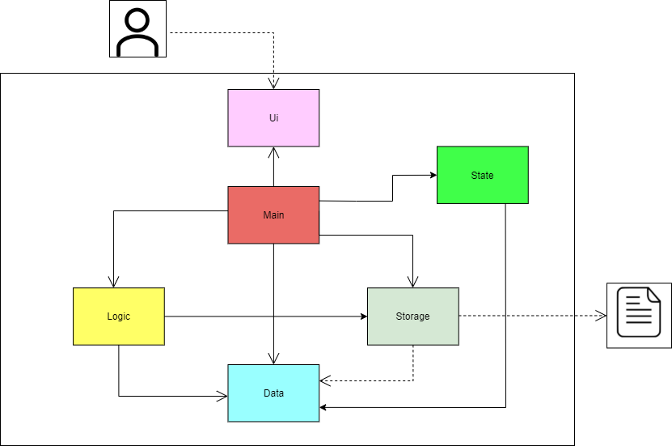

# Developer Guide

* [Acknowledgements](#acknowledgements)
* [Getting Started](#getting-started)
* [Design](#design)
  * [Architecture](#architecture)
* [Appendix: Requirements](#appendix-requirements)
  * [Product Scope](#product-scope)
  * [User Stories](#user-stories)
  * [Non-functional Requirements](#non-functional-requirements)

## Acknowledgements

{list here sources of all reused/adapted ideas, code, documentation, and third-party libraries -- include links to the original source as well}

## Getting Started

This is a project for a greenfield Java project. CCA Manager is a CLI application, and it is designed to help CCA's manage their administrative issues.

Prerequisites: JDK 11, update Intellij to the most recent version.

## Design

### Architecture

The **architecture diagram** above presents a high-level overview of CCA Manager.

**Components of the architecture**

* `UI`: UI of CCA Manager
* `Parser`: Parses user inputs into commands
* `Training`: Stores training details as `TrainingSchedule` objects in `TrainingList`
* `Members`: Stores member details as `Member` objects in `MemberList`
* `Attendance`: Object that links a `Member` to a `TrainingSchedule`
* `MemberStorage`: Reads data from, and writes data to, the hard disk

**Components Interaction**

The *sequence diagram* below shows how various components of the architecture interact with one another when a user inputs a **valid** command `"add /m Bob /s A01231234B /p 98765432"`

### **Note:**
* `makeMemberEntry()`: Creates a member in the memberList.
* `writeMemberFile()`: Writes the data to the csv file.

The *sequence diagram* below shows how various components of the architecture interact with one another when a user inputs a **valid** command `"delete /m 1"`

### **Note:**
* `getKeywordStatus()`: Gets the keyword value from the Keyword enum class.
* `deleteMember(members, entry)`: Deletes the member from the memberList.
* `deleteMemeber(memberNumber)`: Deletes the member using the index number provided by the user.
* `writeMemberFile()`: Writes the data to the csv file.

The sections below give more details of each component.

### Attendance component
**API** : [`Attendance.java`](https://github.com/AY2122S1-CS2113T-F12-4/tp/blob/master/src/main/java/seedu/duke/attendance/Attendance.java)

The `Attendance` component,
* instantiates an `Attendance` object comprising of 1 `Member` object and 1 `TrainingSchedule` object.
* stores inputted `Attendance` objects in a list as an `ArrayList<Attendance>` in `AttendanceList` class.
* stores the `AttendanceList` object in a csv file with the help of `AttendanceStorage`.

###[Proposed] Storage component 
#### **Proposed Implementation**
**API** : ['Storage.java']()

The `Storage` component consists of 3 sub-components, corresponding to `member storage` , `attendance storage` 
and `training schedule storage`

The `member storage` component,
* can save members' data in CSV format and read them back into the `MemberList` object 
* automatically adds to DukeMembers.csv whenever a new member is added to the `MemberList` object.
* automatically edits to DukeMembers.csv whenever member details are edited in the `MemberList` object.
* automatically deletes to DukeMembers.csv whenever a member is deleted from the `MemberList` object.

The `attendance storage` component,
*can save attendance data in CSV format and read them back into the `AttendanceList` object.
*automatically deletes to AttendanceStorage.csv whenever a member is deleted from the `AttendanceList` object.

The `training schedule` component
*can save trainings schedules and read them back into the `TrainingList` object. 
*automatically deletes in the file whenever a training schedule is deleted from the `TrainingList` object

**API** : [`Member.java`](https://github.com/AY2122S1-CS2113T-F12-4/tp/blob/master/src/main/java/seedu/duke/member/Member.java)

The `Member` component,
* instantiates an `MemberList` object comprising of 0 `Member` object.
* stores inputted `Member` objects in a list as an `ArrayList<Member>` in `MemberList` class.
* stores the `MemberList` object in a csv file with the help of `MemberStorage`.

## Appendix: Requirements
### Product scope
#### **Target user profile**

* Is in an administrative position for a CCA in NUS, and deals with the book-keeping of CCA information
* Has the need to centralize and record a multitude of CCA information *(member details, training schedules, etc.)* 
* Is comfortable with the use of CLI such as `cmd.exe`
* Prefers typing to mouse interactions
* Prefers the use of desktop apps for CCA administrative matters over other alternatives *(mobile app, etc.)*
* Can type fast

#### **Value proposition**
User can update CCA information faster than using a GUI, and offers a centralized platform to store all relevant CCA information

### User Stories

|Version| As a ... | I want to ... | So that I can ...|
|--------|----------|---------------|------------------|
|v1.0|CCA Leader|Add member details|Keep a record of all active members and know how to contact them|
|v1.0|CCA Leader|Edit member details|Keep the details of active members updated and accurate|
|v1.0|CCA Leader|Delete member details|Reduce clutter by removing entries for members no longer in the CCA (Graduated,Quit,etc.)|
|v1.0|CCA Leader|Add training schedule|Record an upcoming training and its details for reference|
|v1.0|CCA Leader|Edit training schedule|Update details of an upcoming training in case of any sudden changes (Venue,Date/Time,etc.)|
|v1.0|CCA Leader|Delete training schedule|Remove any erroneous trainings (Cancelled training,etc.)|
|v1.0|CCA Leader|Add attendance|Keep track of which members attended which training sessions|
|v1.0|CCA Leader|Delete attendance|Remove any erroneous attendance (Listed member as present when he was not,etc.)|
|v1.0|CCA Leader|Export data to .csv|Keep a backup of updated CCA information and make use of Excel formulas and macros to help with book-keeping|
|v1.0|CCA Leader|Import data from .csv|Automatically read saved CCA information|

### Non-Functional Requirements

1. CCA Manager should work on any modern OS which has `Java 11` installed
2. CCA Manager should be able to record a lot of data without noticeable performance issues
3. A User with above average typing speed should be able to get tasks done faster with the use of CCA Manager compared to using a mouse

## Appendix: Manual Testing

### Setup
1. Download the latest release from [here](https://github.com/AY2122S1-CS2113T-F12-4/tp/releases)

### Initial Launch
1. Place `tP.jar` in your folder of choice
2. Run CCA Manager by calling `java -jar tP.jar` on `cmd`

### Running Commands
1. You can refer to the list of commands [here](https://github.com/AY2122S1-CS2113T-F12-4/tp/blob/master/docs/UserGuide.md)
2. Upon a successful command run, data will be saved to `DukeMembers.csv`

### Exit
1. Call `bye` to exit CCA Manager
