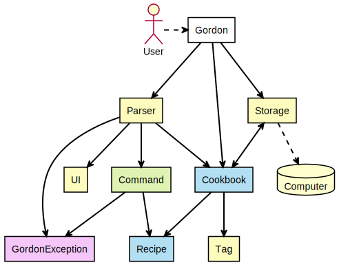
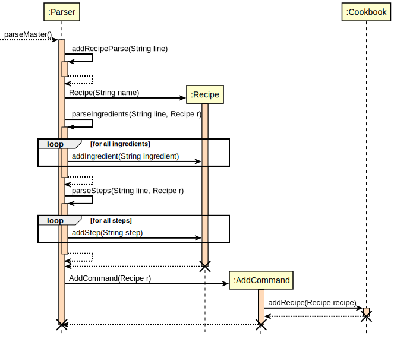
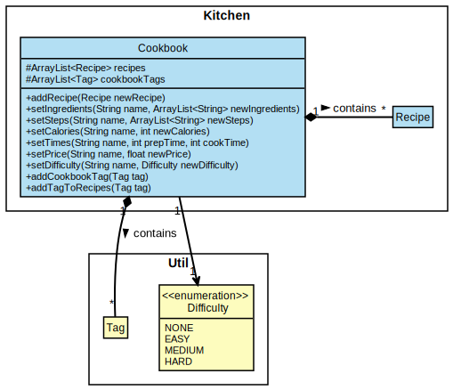
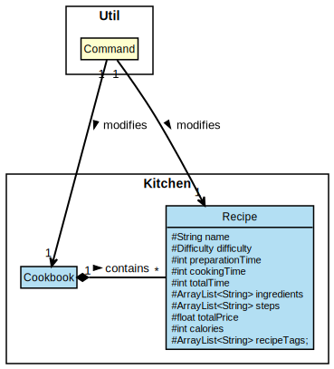
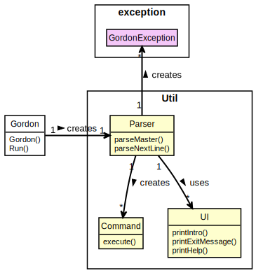
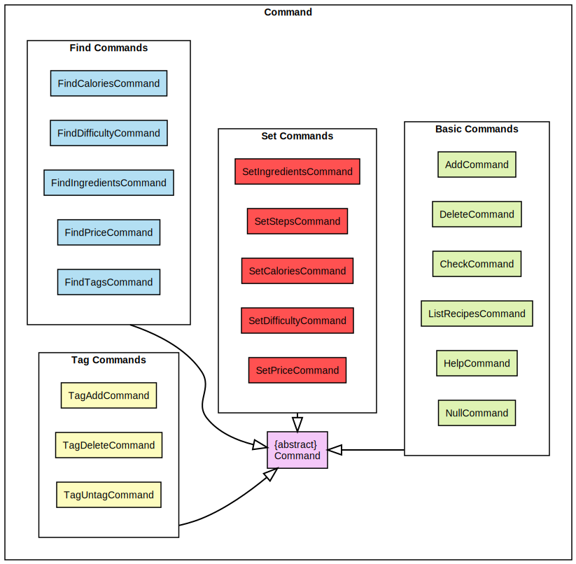
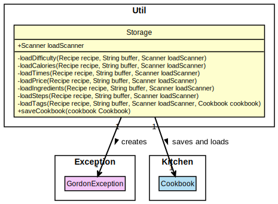
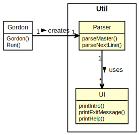

# Developer Guide

## Acknowledgements

{list here sources of all reused/adapted ideas, code, documentation, and third-party libraries -- include links to the original source as well}

## Getting started

### Recommended software (for optimal compatibility)

* Github
* Sourcetree (for version control)
* IntelliJ IDEA (IDE)
* Amazon Coretto

### Setting up this project in your computer

1. **On GitHub, fork this repo by clicking on the fork button**
1. **In Sourcetree, clone the fork into your computer**
   1. Open a new tab
   1. Select the clone button at the top of the menu
   1. Key in the details of this repository
1. **Configure the JDK:** Follow the guide [Project Configuration/ SDKs](https://www.jetbrains.com/help/idea/sdk.html) to ensure that Intellij is configured to use JDK 11.
1. **Import the project as a Gradle project:** Follow the guide [Intellij IDEA: Importing a Gradle project
   ](https://se-education.org/guides/tutorials/intellijImportGradleProject.html)
1. **Verify the setup:**
   1. Run the seedu.address.Main and try a few commands.
   1. Run the tests to ensure they all pass.

## Design & Implementation

### Architecture

The Diagram above explains how the App is designed and will function

Given below we have a quick overview of all the main components of Gordon as well as how these pieces interact with each other

*Main Components*

`Main` contains both `main` and `run`. It is responsible for:

1. Once the App is launched, `main` will call `run` to initialize the necessary components for the App to function properly
2. On exit, the App will print the corresponding messages and execute the necessary cleanup methods.

The App is organized by the `command`, `exception`, `kitchen`, and `util` packages that represent a collection of various different components that are deal with different parts of the functions of the App

1. `command`: Contains all the `XYZ_Command` components that deal with the inputs that the user is able to make.
2. `exception`: Contains all the the `GordonException` component that is used throughout the App
3. `kitchen`: Contains the `Cookbook` and `Recipe` components that deal with the management of the cookbook
4. `util`: Contains the `Difficulty`, `Parser`, `Tag` and `UI` components that deal with the functionality of the App

*How do these components interact with each other*

The Sequence Diagram below will show how the components interact with each other for the scenario where the user issues the command `add`.

### Kitchen component

The Diagram below is the class diagram for the `Cookbook` and `Recipe` Classes in the ``Kitchen`` package

`COOKBOOK`

`RECIPE`

The `Cookbook` Class is instantiated by the `Gordon` Class, and manages the recipes and tags of the cookbook.
The `Recipe` Class is instantiated by the `Parser` Class, and contains methods to update an existing recipe.

The `Cookbook` class consists of 2 main attributes
1. The array `recipes` that stores all the main recipes currently in Gordon.
2. The array `cookbookTags` that stores all the tags currently in Gordon.

The `Kichen` package can be classified into 3 main functionalities:

1. Recipe Management : 
  - Add recipes using the `addRecipe` method in `Cookbook`.
  - Remove recipes using the `removeRecipe` method in `Cookbook`.
  - Check whether a recipe exist using the `checkRecipe` method in `Cookbook`.
  - Replace ingredients in a recipe using the `setIngredients` method in `Cookbook` that calls the `replaceIngredients` method in `Recipe`.
  - Replace steps in a recipe using the `setSteps` method in `Cookbook` that calls the `replaceSteps` method in `Recipe`.
  - Add calories to a recipe using the `setCalories` method in `Cookbook` that calls the `setCalories` method in `Recipe`.
  - Add price to a recipe using the `setPrice` method in `Cookbook` that calls the `setPrice` method in `Recipe`.
  - Add preparation time to a recipe using the `setTimes` method in `Cookbook` that calls the `setTimes` method in `Recipe`.
  - Add difficulty level to a recipe using the `setDifficulty` method in `Cookbook` that calls the `setDifficulty` method in `Recipe`.

2. Tag Management :
  - Add a new tag to the `cookbookTags` array using the `addCookbookTag` method in `Cookbook`.
  - Delete a tag from the `cookbookTags` array using the `deleteCookbookTag` method in `Cookbook`.
  - Add a recipe to the list of recipes associated with a particular tag using the `appendRecipeToCookbookTag` method
  - Remove a recipe from the list of recipes associated with a particular tag using the `deleteRecipeToCookBookTag` method
  - Add a tag to a recipe using the `addTagToRecipes` method in `Cookbook` that calls the `addTagToRecipe` method in `Recipe`.
  - Delete a tag from a recipe using the `deleteTagFromRecipes` method that calls the `deleteTagFromRecipe` method in `Recipe`.
  - List all tags in the `cookbookTags` array using the `listCookBookTags` method in `Cookbook`.
  - Check whether a particular tag exists using the `doesCookBookTagExist` method in `Cookbook`.

3. Filter Recipes : 
  - Filter recipes in the `recipes` array by ingredients using the `filterByIngredients` method in `Cookbook`.
  - Filter recipes in the `recipes` array by tags using the `filterByTags` method in `Cookbook`.
  - Filter recipes in the `recipes` array by difficulty using the `filterByDifficulty` method in `Cookbook`.
  - Filter recipes in the `recipes` array by price using the `filterByPrice` method in `Cookbook`.
  - Filter recipes in the `recipes` array by calories using the `filterByCalories` method in `Cookbook`.
  - Filter recipes in the `recipes` array by time using the `filterByTime` method in `Cookbook`.

### Parser component

The diagram below is the class diagram for the `Parser` class

Functions of the Parser class:
* Reads in user input by implementing the `Scanner` class
  * The parseMaster() method parses through the user's input to find the best match for the user's intended command
  * The corresponding command is then returned to the `Gordon` class
* Prints responses to the console by implementing the `UI` class

### Command component

The Diagram below is the class diagram for the Command Class

The `Command` class contains all the basic functionality of the Gordon cookbook, and is the Class that executes specific commands given by the user.

The `Command` class can be classified into 4 main functionalities:

1. Basic Commands: 
   * The Commands that are required for the basic feature set of the Gordon cookbook are contained here
   * `AddCommand` is where the `addRecipe` feature is executed
   * `CheckCommand` is where the `checkRecipe` feature is executed
   * `DeleteRecipeCommand` is where the `deleteRecipe` feature is executed
   * `ListRecipesCommand` is where the `listRecipes` feature is executed
   * `HelpCommand` is where the `help` feature is executed
2. Find Commands:
   * The Commands that are required for the `find` feature of Gordon are contained here
   * `FindCaloriesCommand` is where the `find` /calories feature of gordon is executed 
   * `FindDifficultyCommand` is where the `find` /difficulty feature of gordon is executed
   * `FindIngredientsCommand` is where the `find` /ingredients feature of gordon is executed
   * `FindPriceCommand` is where the `find` /price feature of gordon is executed
3. Set Commands:
   * The Commands that are required for the `set` feature of Gordon are contained here
   * `SetCaloriesCommand` is where the `set` /calories feature of gordon is executed
   * `SetDifficultyCommand` is where the `set` /difficulty feature of gordon is executed
   * `SetPriceCommand` is where the `set` /price feature of gordon is executed
4. Tag Commands:
   * The Commands that are required for the  `tag` feature of Gordon are contained here
   * `TagAddCommand` is where the `tag` feature of gordon is executed
   * `TagDeleteCommand` is where the `deleteTag` feature of gordon is executed
   * `TagUntagCommand` is where the `untag` feature of gordon is executed

### Storage component

The Diagram below is the class diagram for the Storage Class

Functions of the Storage class:
* When Gordon is launched, loads the recipes and tags stored in `saveFile.txt` using the `Scanner` Class.
* When Gordon exits, saves the recipes the list of recipes and tags in `Cookbook` to `saveFile.txt`.

### UI Component

The Diagram below is the class diagram for the UI Class

Functions of the UI Class:
* Prints launch message when Gordon is first launched
* Prints exit message upon the command `exit`
* Prints help message upon the command `help`

### Tag Component
The `Tag` class contains the basic functionalities related to a _Tag_, and encapsulates the behavior of a _Tag_.
1. `getTagName` returns the _Tag Name_.
2. `containsAssociatedRecipeNames` checks for the existence of a particular _Recipe Name_ within a _Tag_.
3. `addAssociatedRecipeName` adds a _Recipe Name_ to the `ArrayList<String>` containing all such names. 
4. `removeAssociatedRecipeName` removes a _Recipe Name_ from the `ArrayList<String` containing all such names.

## Product scope
### Target user profile

* NUS Students who stay in a Hall
* Cooks on a regular basis  
* Has Ingredients for cooking readily available
* Is familiar with a command line interface  
* Can type relatively fast  
* Prefers a desktop application to a mobile application

### Value proposition

A digital cookbook that works in Command-Line Interface that can provide all the necessary functions faster than from a typical mouse/GUI drive App

## User Stories

|Priority|Version| As a ... | I want to ... | So that I can ...|
|--------|--------|----------|---------------|------------------|
|***|v1.0|new user|see usage instructions|refer to them when I forget how to use the application|
|***|v1.0|user|exit the program|do other tasks in the command line|
|***|v1.0|user|check my stored recipes|refer to them while cooking|
|***|v1.0|user|add recipes to my cookbook|try them in the future|
|***|v1.0|user|delete recipes from my cookbook|remove recipes I'm no longer interested in|
|***|v1.0|user|list out all the recipes|see all of the recipes in my cookbook|
|**|v2.0|disorganised user|find recipes by ingredient|see what recipes I can make with the food in my pantry|
|**|v2.0|health-conscious user|find recipes by calorie count|eat healthier by managing calories|
|**|v2.0|budget-conscious user|find recipes by pricing|go for the most cost-efficient recipe|
|**|v2.0|cooking newbie user|find recipes by difficulty|choose the difficulty of the recipe depending on my skill level|
|**|v2.0|organised user|find recipes by my own tags|sort by my own metric|
|**|v2.0|user|save and load my recipes from memory|refer to them whenever I want to|
|*|v2.0|developer|add my own functionality to Gordon in a modular fashion|improve the app to my needs|

## Use Cases

**Use case: `help`**

**MSS:**
1. User opens Application
2. User does not know the commands
3. Gordon provides a list of commands
4. User can now use the App

Use case ends.

**Use case: `exit`**

**MSS:**
1. User requests to exit program
2. Program exits.

Use case ends

**Use case: `add`**

**MSS:**
1. User requests to add a recipe to Gordon
2. User inputs the necessary commands
3. Gordon adds the recipe to the cookbook

Use case ends.

**Extensions**
* The command given was invalid
  * Gordon shows an error message
  * Use case resumes on step 1

**Use case: `deleteRecipe`**

**MSS:**
1. User requests a list of all recipes
2. Gordon shows a list of all recipes
3. User requests to delete a specific recipe
4. Gordon deletes that recipe.

Use case ends.

**Extensions**
* The list is empty
  * Use case ends
* The given index is invalid
  * Gordon shows an error message
  * Use case resumes from step 2

**Use case: `listRecipes`**

**MSS:**
1. User requests to see all their recipes
2. Gordon shows a list of all currently stored recipes

Use case ends.

**Extensions**
* The list is empty.
    * Use case ends.

**Use case: `check`**

**MSS:**
1. User requests to check a specific recipe
2. Gordon brings up the specified recipe for the user to peruse

Use case ends.

**Extensions**
* The recipe does not exist.
    * Use case ends.
* Input was entered incorrectly
  * Use case resumes from step 1

**Use case: `find`**

**MSS:**
1. User has a large cookbook
2. User searches for a specific recipe by either keyword, calories, difficulty, ingredients, price or tags.
3. Gordon returns a list of all the recipes which contain what the user is looking for
4. User checks the recipe for cooking

Use case ends.

**Extensions** 
* The list is empty
  * Use case ends
* No recipe contains the keyword
  * Gordon shows an error message
  * Use case resumes from step 2

**Use case: `tag`**

**MSS:** 
1. User wants to sort the recipes with their own metric
2. User requests to add a tag to a specific recipe
3. Gordon tags the recipe
4. User can now find the recipe by tag

Use case ends.

**Extensions**
* The given recipe does not exist
  * Gordon shows an error message
  * Use case resumes from step 2

**Use case: `untag`**

**MSS:**
1. User wants to remove a tag from a specific recipe
2. Gordon removes the tag from the recipe
3. User can now add a different tag to that recipe

Use case ends.

**Extensions**
* The tag does not exist
    * Use case ends.

**Use case: `deleteTag`**

**MSS:**
1. User wants to delete a master tag from the database
2. Gordon deletes the master tag from the cookbook

Use case ends.

**Extensions**
* The tag does not exist
    * Use case ends.

## Non-Functional Requirements

1. Should work on any mainstream OS as long as it has Java `11` or above installed.
2. It should be able to hold thousands of recipes without any slowdown in performance
3. A user with above average typing speed should be able to key in recipes faster than using a typical mouse/GUI application

## Glossary

* *Mainstream OS* - Windows, MacOS, Linux, Unix

## Instructions for manual testing

{Give instructions on how to do a manual product testing e.g., how to load sample data to be used for testing}
