# Developer Guide

## Table of Content

- [1. Introduction](#1-introduction)
    * [1.1 Purpose](#11-purpose)
    * [1.2 Acknowledgements](#12-acknowledgements)
    * [1.3 Using this Guide](#13-using-this-guide)
- [2. Setting up](#2-setting-up)
    * [2.1 Setting up the project in your computer](#21-setting-up-the-project-in-your-computer)
        + [2.1.1 Prerequisite](#211-prerequisite)
        + [2.1.2 Getting the project files](#212-getting-the-project-files)
        + [2.1.3 Setting up on IntelliJ IDEA](#213-setting-up-on-intellij-idea)
        + [2.1.4 Configuring the Coding Style](#214-configuring-the-coding-style)
- [3. Design](#3-design)
    * [3.1 Architecture](#31-architecture)
    * [3.2 UI Component](#32-ui-component)
    * [3.3 Parser Component](#33-parser-component)
    * [3.4 Command Component](#34-command-component)
    * [3.5 Module Component](#35-module-component)
    * [3.6 Content Component](#36-content-component)
    * [3.7 Active Recall Component](#37-active-recall-component)
    * [3.8 Storage Component](#38-storage-component)
- [4. Implementation](#4-implementation)
    * [4.1 Timetable Feature](#41-timetable-feature)
    * [4.2 Active Recall](#42-active-recall-implementation)
    * [4.3 Workspace](#43-workspace-implementation)
    * [4.4 Conflict Manager](#44-conflict-manager-implementation)
    * [4.5 Storage](#45-storage-implementation)
        + [4.5.1 Initialize Storage](#451-initialize-storage-implementation)
        + [4.5.2 Loading Storage](#452-loading-storage-implementation)
        + [4.5.3 Execute CommandResult with Storage](#453-execute-commandresult-with-storage-implementation)
    * [4.6 Adding Content](#46-adding-content-implementation)
    * [4.7 Deleting Content](#47-deleting-content-implementation)
- [5. Documentation, Logging, Testing and DevOps](#5-documentation-logging-testing-and-devops)
    * [5.1 Documentation](#51-documentation)
    * [5.2 Logging](#52-logging)
    * [5.2 Logging](#52-logging)
    * [5.3 Testing](#53-testing)
    * [5.4 DevOps](#54-devops)
- [Appendix A: Product Scope](#appendix-a-product-scope)
- [Appendix B: User Stories](#appendix-b-user-stories)
- [Appendix C: Non Functional Requirements](#appendix-c-non-functional-requirements)
- [Appendix D: Instructions for Manual Testing](#appendix-d-instructions-for-manual-testing)

## 1. Introduction

**Welcome to TermiNUS!**

**TermiNUS** is a CLI (command line interface) program for NUS students who wish to consolidate their NUS academic needs such as schedules, questions and notes for the modules that they are taking. With TermiNUS, it aims to aid students and improve their learning experiences while studying in NUS.

**TermiNUS** is written in **Java 11** and uses the Object-Oriented Programming (OOP) paradigm which
provides us with means to structure a software program into organized and reusable pieces of codes,
making it more efficient for future improvements and revisions.

### 1.1 Purpose

This developer guide is for any developers who wish to contribute to **TermiNUS**. It contains the
overall architecture design of **TermiNUS** and it displays our main features implementation details
with the rationale and consideration for each. As of now, the guide is written for the current
release version of `TermiNUS of v2.1`.

### 1.2 Acknowledgements

We would like to thank the following projects and repositories for assisting in the development of 
TermiNUS.

- [**GSON:** Providing the JSON parsing capabilities for the main file.](https://github.com/google/gson)
- [**OpenPDF:** Providing PDF exporting capabilities for notes.](https://github.com/LibrePDF/OpenPDF)
- [**AddressBook-3:** Providing a guide on writing the guides you are reading now.](https://se-education.org/addressbook-level3/)


### 1.3 Using this Guide

Along the way you might encounter several icons. These icons will provide you with different types of information that you may find useful.

> 💡 Take note when you see this icon, as it might tell you something important.

> 📝 **Note:** This icon represents additional information that might be useful when using our application.

Lastly, text that is blue like this [example](#test), are clickable links that will bring you to the relevant part of this developer guide.

## 2. Setting up

### 2.1 Setting up the project in your computer

#### 2.1.1 Prerequisite

Before setting up the project, please do ensure you have the following items installed.

- [JDK 11](https://docs.aws.amazon.com/corretto/latest/corretto-11-ug/downloads-list.html)
- [IntelliJ IDEA](https://www.jetbrains.com/idea/download/)

`Java Development Kit ver 11 (JDK 11)` is the **environment / programming language** in which
TermiNUS is written with and `IntelliJ IDEA` will be the **integrated development environment (
IDE)** platform for us to write the programming codes on.

#### 2.1.2 Getting the project files

Go to [link](https://github.com/AY2122S1-CS2113T-T10-2/tp) and retrieve the `TermiNUS project file`.
You can do so by **forking** the project and **cloning** a copy into your computer.

To learn more about github fork-clone feature please follow the guide
on [link](https://docs.github.com/en/get-started/quickstart/fork-a-repo).

#### 2.1.3 Setting up on IntelliJ IDEA

1. Open the application `IntelliJ IDEA`.
2. Inside `IntelliJ IDEA` navigate to `open project` button
    1. On the top left of the app, `File`&rarr;`Open...`
3. Locate and select the folder containing the files for **Terminus** that you have downloaded
   earlier on.
4. Change the **Project SDK** that IntelliJ IDEA will be using.
    1. On the top left of the app, `File`&rarr;`Project Structure...`
    2. Under **Project SDK:** section, find and select JDK version 11.
       Eg: `Amazon Corretto version 11.0.12`.
    3. Under **Project language level:**, select `SDK default`.
5. Verifying the setup
    1. After performing the steps above, locate the file `src/main/java/terminus/Terminus.java`,
       right-click and select `Run 'Terminus.main()'`.
    2. If everything is correctly set up, you should see the following terminal.
   
   ```
    Welcome to TermiNUS!
    You have no schedule for today.
    
    Type any of the following to get started:
    > exit
    > help
    > module
    > go
    > timetable
    
    [] >>>  
   ```

#### 2.1.4 Configuring the Coding Style

Import the coding style xml file into your IntelliJ IDEA.

You can download the `xml` file [here](https://github.com/google/styleguide/blob/gh-pages/intellij-java-google-style.xml).

1. Go to IntelliJ IDEA settings page.
    1. Located at the **top-right** of the app, click on the gear icon and select `Settings...`.
2. Under the settings page, locate the `Code Style` tab.
    1. `Editor`&rarr;`Code Style`
3. Once you are at the `Code Style` tab, you will need to import the `xml` file.
    1. At the `Scheme` section, select the gear icon and select `Import Scheme`
       &rarr;`IntelliJ IDEA code style XML`.
    2. Locate and select the `xml` file that you have downloaded earlier.
    3. Once done, select `Apply` then `OK`.
4. Now your IntelliJ IDEA should follow our Coding Style.

> 💡 IntelliJ IDEA have certain shortcut key to aid in auto-formatting of code.
> Once you are done with a piece of code, highlight the section you have just written and press the
> key `CTRL + SHIFT + L`.

## 3. Design

### 3.1 Architecture
This section will provide insight to the general overview of **TermiNUS**'s architecture.

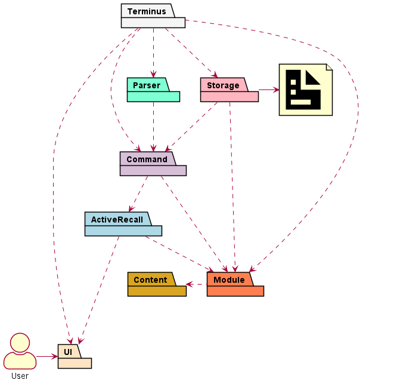  

The Architecture Diagram above describes the high-level design of **TermiNUS** and 
how the different components interact with each other. Below we will provide a quick overview of 
each component involved.  

The `Terminus` class is the main entry point of the application and contains the `main` method used 
by Java as the starting function.

The `Terminus` class main responsibilities include:
- Initializing various components required for the program to run.
- Requesting the specific modules to load data from file into the program.
- Performing any data entry saving and clean up when the program is going to terminate.

The rest of **TermiNUS** consists of 7 other components:
- `UI`: Manages the input and output of **TermiNUS**.
- `Parser`: Parses the user inputs and their arguments.
- `Command`: Execute the required commands and store the output.
- `Module`: Manage the multiple different types of `Content`
- `Content`: Stores and Provides user information.
- `Storage`: Reads the data, and writes data back to the hard disk.

Below contains some example sequence diagram to help illustrate the general program flow and 
how the many object interact with one another in `TermiNUS`.  

The first diagram shows the constructor of `Terminus` class running to initialize essential Modules 
such as `UI` and `Parser`.  

  

The next sequence diagram shows the loading of user data into `Terminus`.  

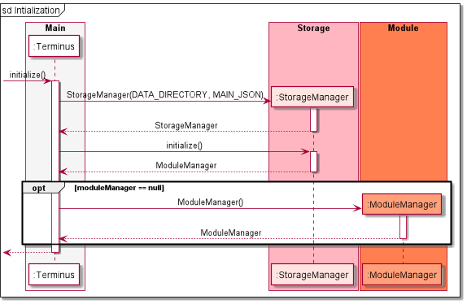  

The next sequence diagram shows an instance of command execution.


The next sequence diagram show the termination of `Terminus`  


  
### 3.2 UI Component


The Ui Component consists of the `Ui` class which handles all input and output operations within 
TermiNUS application. To reduce coupling, we have used `Ui` on only the main runner `Terminus`, and 
the Active Recall `GameEnvironment`. If future features require the extended use of `Ui`, they may 
call `getInstance()` from `Ui` to get the same singleton class as both `GameEnvironment` and 
`Terminus`.

The `Ui` implements the following functionality:
- Printing large custom banners with moving to new workspaces.
- Getting of user input through `getUserInput()` and `requestCommand()`.
- Printing string arrays to the output through `printSection()`.


### 3.3 Parser Component
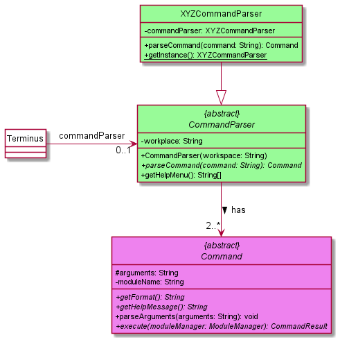

The CommandParser Component consist of the `CommandParser` and multiple `XYZCommandParser`, 
each representing a specific type command parser. The `CommandParser` will receive a command in 
`parseCommand` function and check the according `HashMap<String, Command>` before 
returning the according `Command` object back. 

The `CommandParser` implements the following functionality:
- Parsing the command string and giving the respective `Command` object. 
- Keeps track of the workspace.
- Provides functionality to list all commands for the help `Command`.


### 3.4 Command Component
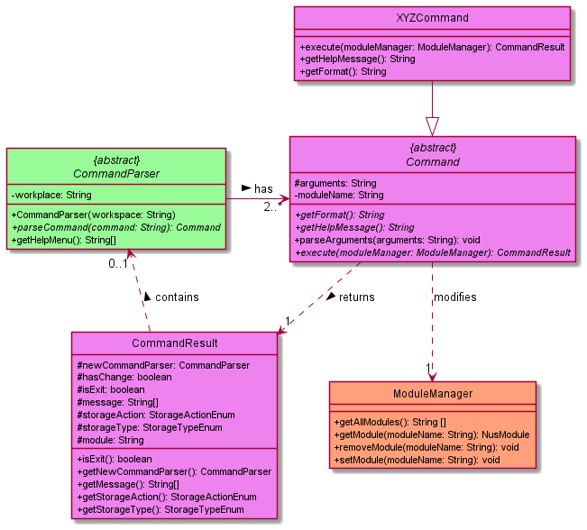

The Command Component `Command` class, `CommandResult` class and multiple `XYZCommand` 
each representing a specific type of command. Each `Command` will `parseArguments` and set them 
to private variables, and then `execute` would run specific operation specified by `XYZCommand`.
The `Command` would then modify the required changes in `ModuleManager` and 
store the resulting output message in `CommandResult`.   

The `CommandResult` will contains certain attributes that will indicate certain operations:
- Contains a `message` to be printed as the output for the `Command`.
- Contains the `newCommandParser` required to switch workspaces.
- Indicate the if file operations are required and the corresponding actions.
- Tracks if the program should terminate.


### 3.5 Module Component

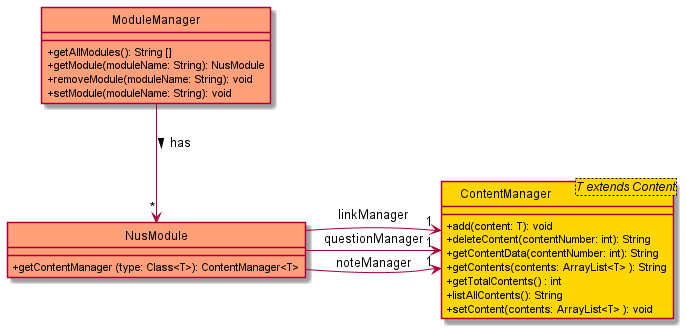

The Module Components consists of the `ModuleManager` which contains a collection of `NusModule` and
maps a module name to a specific `NusModule`.
The `NusModule` consist of `ContentManager` which help to manage `Content`.
The `ContentManager` accepts a `Content` type generic which is from the Content Component

The `ModuleManager` implements the below functionality:
- Add, delete or retrieve a specific `NusModule`.
- List all module names.
- Grants access to the different types of content stored by `NusModule`.

### 3.6 Content Component
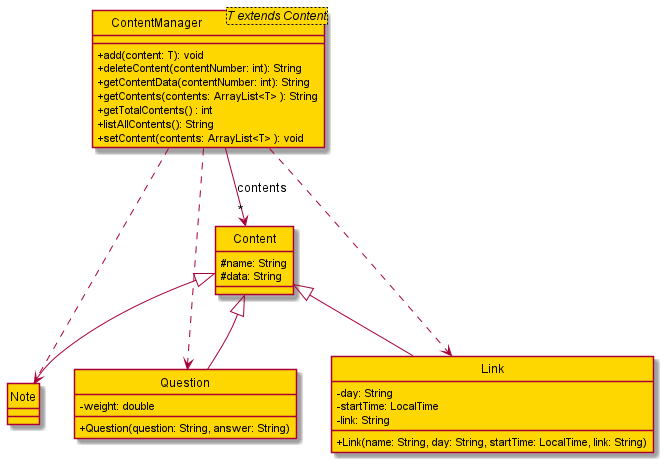

The Content Component consist of objects such as `Link`, `Question` and `Note`
which inherit from the abstract `Content` class. The `ContentManager` allows a generic 
`<T extends Content>` which must belong to the `Content` type or its children. The 
`ContentManager` manages an `ArrayList` of Content type and provide the following functionality:
- Adding of any Content type.
- Removing any Content.
- Accessing the Content and the inner data attribute.
- Getting the total number of content.
- Listing all contents.
- Accessing the arraylist of contents.

### 3.7 Active Recall Component
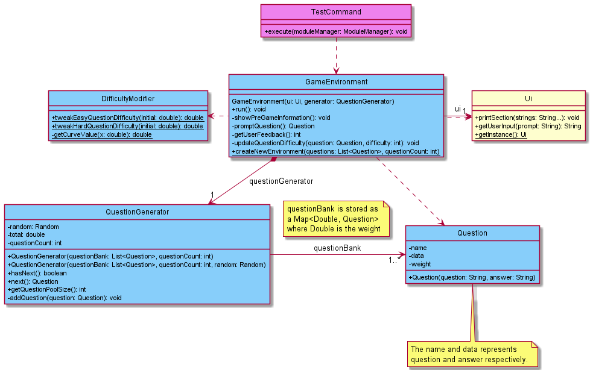

The Active Recall Component consists of the `GameEnvironment` as the centre of the design.
The `GameEnvironment` consists of a `QuestionGenerator` which will only exist if there is a 
`GameEnvironment`, and a `Ui` instance to handle user input and printing of information. The 
decision to re-use the `Ui` is to allow easier upgrades to the `Ui` if there is a need in the 
future.

The `QuestionGenerator` takes in a list of `Question` and a maximum question count to randomly
generate questions based on `Random`. If `Random` is not provided, a new `Random` with a random seed
will be created to generate the `Question` order.

The `DifficultyModifier` is a utility class used to calculate and tweak the weights of `Question`
after the user has provided feedback on the difficulty of the question. It uses a 
[logistic curve](https://en.wikipedia.org/wiki/Logistic_function) to calculate the change in weight.

For further details on the implementation, head to 
[4.2 Active Recall Implementation](#42-active-recall-implementation).

### 3.8 Storage Component


The StorageManager handles any file I/O operations of TermiNUS.

The `StorageManager` component:

- can create folder for each module provided by the user.
- can save / load modules, schedules and links data in / from a `.json` file.
- can save / load notes into / from multiple `.txt` files.
- can filters invalid data loaded from a `.json` file.

`TermiNUS` saved these data as either a `.json` or `.txt` file so users will be able to edit saved
data easily with any available text editor.


## 4. Implementation

This section introduces the specific implementation details and design consideration of some features in TermiNUS.


### 4.1 Timetable Feature
The timetable feature aims to provide users a single command to access all the schedules they store in different modules within TermiNUS.
This feature would ease users in accessing a compilation of all their schedule, instead of having to access all the individual module workspaces.


#### 4.1.1 Current Implementation
The following sequence diagram shows how the timetable feature works:
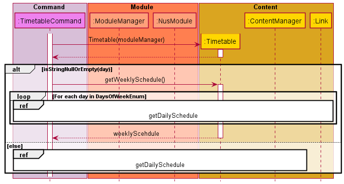

The timetable feature is one of TermiNUS' features which can be accessed from the main workspace.

The `timetable` feature has 2 variations:
- **Daily** Timetable
- **Weekly** timetable.

The timetable feature is facilitated by the `TimetableCommand`.
By running the command `timetable` with the relevant parameter, the `MainCommandParser` will construct a new `TimetableCommand`.
This `TimetableCommand` will be used to execute the user's timetable instruction.


Given below is an example usage scenario showing how the `TimetableCommand` behaves at each step.

**Step 1:** User executes the command `timetable` from the main workspace.
A new `TimetableCommand` will be generated by the `MainCommandParser`

**Step 2:** The application invokes `TimetableCommand#execute()` to execute the user's instruction

**Step 3:** During the execution, `TimetableCommand#execute()` will generate a new `Timetable`.
`TimetableCommand#parseArguments()` will also be invoked to acquire the user arguments, if any.
If user argument exists, then `TimetableCommand#execute()` will invoke `Timetable#getDailySchedule()`, as it is a Daily Timetable Instruction. 
Otherwise, `Timetable#getWeeklySchedule()` will be invoked instead to facilitate the Weekly TimetableInstruction.

**Step 4:** Once the relevant `Timetable` method has been invoked, it will first construct a `ModuleManager` and invokes `ModuleManager#getAllModules()` to get all the user's modules.
The application will iterate through all the user's modules and invoke `ModuleManager#getContentManager()` for each of the user's modules.

**Step 5:** Once the `ContentManager` has been acquired, the application will invoke `ContentManager#getContents()` to acquire all the `Link` objects stored by the user.
For each `Link`, the application will invoke `Link#getDay()` to allow the filtering out of `Link` objects which has a different `day` attribute from the user request.

Note: If the instruction type is a Daily Timetable Instruction, then Step 5 will only be executed once for a specific day. 
Otherwise, for a Weekly Timetable Instruction, the process in Step 5 will be repeated for each day in the `DaysOfWeekEnum`.
Once all the relevant `Link` objects have been collected, the application will sort all the user `Link` according to its `startTime` to allow a more convenient viewing.


#### 4.1.2 Design Consideration

This section shows the design considerations that were taken into account when implementing the Timetable feature.

**Aspect: Accessibility of Timetable**

| Approach | Pros | Cons |
|----------|------|------|
| Accessed in the main workspace | Generates a compiled timetable of all user schedules | Requires to gather links from all content managers |
| Accessed under each module | Easier to implement, as links are gathered from one content manager | Functionality might not be as useful for users |

**Chosen Solution:** Accessed in the main workspace, as we decided that organizing and creating a compiled timetable of all the available user schedules will be better for user experience.
Moreover, implementing a timetable for each module might be slightly redundant as a view schedule command could offer a similar functionality albeit not sorted out.


### 4.2 Active Recall Implementation

This section details the technical implementation of Active Recall.

To view the high-level diagram, head to 
[3.7 Active Recall Component](#37-active-recall-component).

#### 4.2.1 Current Implementation


The overall sequence flow is shown above.


**Step 1:** When the user executes the `TestCommand`, the `GameEnvironment` will be created with the
static method `GameEnvironment.createNewEnvironment()`, where it will handle the creation of
`QuestionGenerator` as well. 

**Step 2:** The `QuestionGenerator` creates a `NavigableMap<Double, Question>` to store all the 
questions, where the `Double` is the `question.getWeight() + total`, where total is the current sum 
of all the weights currently in the bank. The rationale for the `NavigableMap` and key value will be
explained at `promptQuestion()` below.

**Step 3:** The newly created `GameEnvironment` will be returned to `TestCommand` where it would 
call the `run` method within the object.

**Step 4:** The `showPreGameInformation()` method will print the information once on the current Active Recall 
session, such as the actual question pool size, and may include more information and statistics in 
the future.


**Step 5:** Next, the `run()` method will start a loop and check if there are questions in the local 
`questionGenerator` to ensure that the session can continue. After which, the `promptQuestion()` is 
called, where the next question is pulled from `questionGenerator.next()` and displayed to the user.

**Step 6:** Within the `next()` method in the `QuestionGenerator`, it will find a random `double` 
number from `0` to `total`, and look up a `Question` that is closest to the value. When the 
<kbd>Enter</kbd> key is pressed by the user, the answer is then displayed and the `promptQuestion()` 
passes the `Question` object back to the `run()` method.

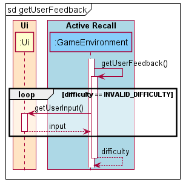

**Step 7:** The program now runs `getUserFeedback()` to collect user feedback, and return
the difficulty back to `run()` after cleaning the input. This is also when the user can decide if 
they wish to quit the session, and if they do, the difficulty value will be set to `EXIT_CODE = -1`.

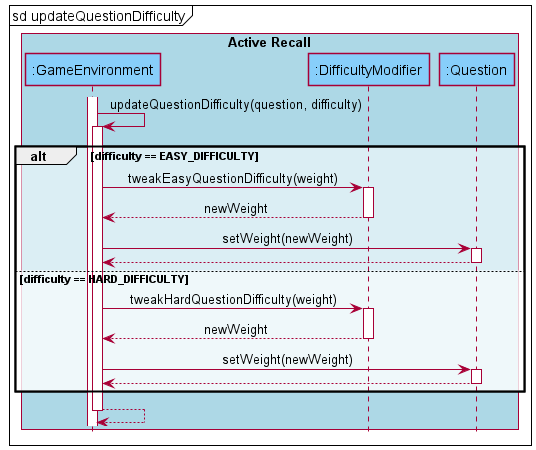

**Step 8:** If the `difficulty` is checked to be the `EXIT_CODE`, the loop will break and return. Otherwise, the
`Question`'s difficulty will now be changed in the `updateQuestionDifficulty(question, difficulty)` 
method, where we use the difference between the extremes and the current difficulty to apply into 
the logistic curve to determine the amount to increase or decrease the weight of the randomness by.

**Step 9:** Once the adjustment of weights of the question is done, **Step 5 to 9** is repeated if 
there are questions left inside `QuestionGenerator`. Otherwise, the Active Recall session will be terminated, 
and the input will be passed back to the `CommandParser`.

#### 4.2.2 Design Consideration

The reason for using `NavigableMap` to generate questions was because it provides a method called 
`.higherEntry(key)`, which guarantees a `Question` is returned provided the value never exceeds 
the total weight of the question pool (which should never happen as the random number generator can 
only generate between `0` and `total`).

**Aspect: Hiding the answer from the user**

| Approach | Pros | Cons |
|----------|------|------|
| Enter Key | Allows user to reveal the answer at their own pace | Requires user input |
| Timer | No user input | Might reveal answers too early or late |

**Chosen Solution:** Enter Key, as it is the most effective way to ensure the answer does not get 
revealed unless the user intents to view it.

**Aspect: Questions randomness needs to be re-weighed.**

| Approach | Pros | Cons |
|----------|------|------|
| Change weights by a fixed amount | Simple to implement | Easy questions might never ever appear again. |
| Change weights with logistics curve | Weights don't increase/decrease out of control | Requires curve calibration |
| Use ELO/Glicko | Questions have fair share | Requires questions to "compete" against each other |

**Chosen Solution:** Logistic curve, as it ensures once the user finds a hard question easy, it 
would quickly move down a difficulty and vice versa. We will continue to seek user feedback and 
tweak the curve parameters if needed.


The parameters of the logistic curve can be viewed here:
[https://www.desmos.com/calculator/qefovvnuhx](https://www.desmos.com/calculator/qefovvnuhx).


### 4.3 Workspace Implementation

This workspace feature aims to provide users with a better experience in navigating the different
features TermiNUS has to offer, and caters for both users which enjoy using a particular feature or
prefer typing commands in a single step.

#### 4.3.1 Current Implementation
The workspace feature was implemented with the idea of a single command input as well as a multiple 
step input. For example, running 3 separate commands `go Module` -> `note` -> 
`add "Content Name" "Content"` would perform the same functionality as a single command 
`go Module note add "Content Name" "Content"`. This workspace feature implemented in the Command and 
CommandParser component.


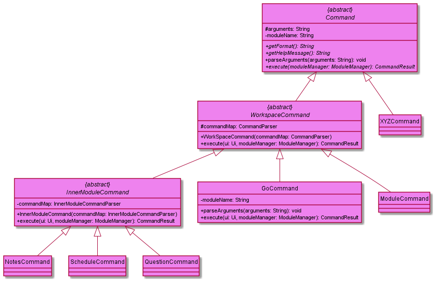

The `Command` class in fact has an abstract child `WorkspaceCommand` and grandchild 
`InnerModuleCommand` that inherit from it. In general, aside from the `Command` classes in the 
diagram, all other `XYZCommand` children simply inherit from `Command` itself. Each `Command` child 

The `WorkspaceCommand` class which inherits from `Command` and requires a `CommandParser` in its 
constructor as this command helps with the workspace implementation. When the command is executed,
it will check if there are any arguments to the command. If there are arguments, it will pass the 
remaining arguments the initialised `commandMap` and attempt to parse and execute the command. 
In the case of error, an exception will be thrown and caught in the `Terminus` class. 
In the case where there is no arguments, the program will store the `commandMap` in the 
`CommandResult` `additionalData` attribute and returns that `CommandResult` to the `Terminus` class.
The `Terminus` class checks if the `CommandResult` contains a `additionData` and replaces its own 
`CommandParser` with the `CommandParser` stored in `additionalData`. This command helps `Terminus` 
to change and beware of workspace changes

The `InnerModuleCommand` class inherits from the `WorkspaceCommand`. 
It functions identical the `WorkspaceCommand` but has some subtle differences such as requiring a 
`InnerModuleCommandParser` which inherits from a `CommandParser` but can store another 
attribute called `moduleName`. The `InnerModuleCommand` `execute` function will set the initialized 
`InnerModuleCommandParser`'s`moduleName` attribute using its own stored `moduleName` attribute.
This `InnerModuleCommand` purpose to enable any `InnerModuleCommandParser` to be aware of which 
module and pass this module to any of the subsequent commands it may parse.

The `GoCommand` in particular is a special `WorkspaceCommand` which has a unique feature that sets 
the `ModuleWorkspaceCommandParser` class `workspace` attribute to a specific module name and after
validating that the module exists. This command starts the storing of the module name that the 
subsequent commands may use identify the module data to retrieve.


The `CommandParser` class has an abstract child `InnerModuleCommandParser` class that inherit from 
it. Other than the `CommandParser` classes mentioned in the diagram above, all other 
`XYZCommandParser` inherit from the `CommandParser` class directly. Each `CommandParser` class 
contains a `HashMap<String, Command>` which helps in parsing and return the specific `Command` 
object back.

The `InnerModuleCommandParser` functions similar to a regular `CommandParser` but stores and 
extra attribute called `moduleName`. This attribute will be set in all `Commands` that are parsed 
with the `parseCommand` function. The `moduleName` allows all it's `Commands` to be aware of which 
module they need to retrieve the stored data.

The `ModuleWorkspaceCommandParser` is a special `CommandParser` that sets the `moduleName` 
attribute for all the subsequent commands, so that they become aware of what module they are 
modifying.

To explain the concept, more clearly we will be explaining how the input from the user
`go Module note add "Content Name" "Content"` will be executed.

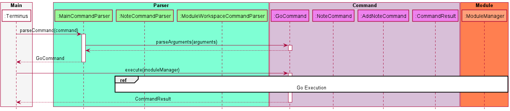

**Step 1:** After receiving the user input in `Terminus`, `MainCommandParser` is called to parse the input 
with the `parseCommand` function which return the specific `Command` class. In this case `GoCommand` 
is returned. The Command Parsers function by stripping commands down layer by layer. Note the 
remaining arguments is `Module note add "Content Name" "Content"`. The `GoCommand` will execution 
will be shown in `Go Execution` below.


**Step 2:** The `GoCommand` executes and validates the module name stored as the `moduleName` attribute of 
the `GoCommand` and sets the workspace of the stored `commandMap` with the value of the module name.
This is done so via the `setWorkspace` function, and for this scenario the workspace for
`ModuleWorkspaceCommandParser` is set. Note the remaining arguments is 
`note add "Content Name" "Content"` and the module name is `Module`.

**Step 3:** Similar to step 1 but with a different `CommandParser`, the 
`ModuleWorkspaceCommandParser` parses the remaining arguments from `GoCommand` as a command 
and sets the `NoteCommand`'s `moduleName` attribute to the value of the module name stored in its 
workspace. It then runs the `NoteCommand` `execute` function. 
Note the remaining arguments is `add "Content Name" "Content"` and the module name is `Module`
> 📝 **Note:** If the remaining arguments is empty, `ModuleWorkspaceCommandParser` will be stored 
> inside of `CommandResult` and returned to `Terminus`. `Terminus` will then replace its 
> `commandParser` with `ModuleWorkspaceCommandParser`, changing the workspace. This would be the 
> same as running the command `go Module` without any further arguments.


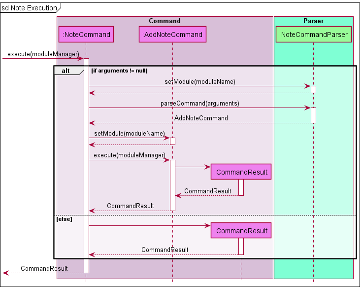

**Step 4:** Similar to step 1, the `NoteCommand` `setsModule` for the `NoteCommandParser` that is 
stored in the `commandMap` attribute and parses the remaining arguments 
`add "Content Name" "Content"` which results in a `AddNoteCommand`. The `execute` function of 
`AddNoteCommand` performs the needed modification to the `NusModule` for the module with the name 
`Module`(This is not shown to prevent confusion). The `execute` function then returns 
a `CommandResult` that is propagated to `Terminus`.
> 📝 **Note:** If the remaining arguments is empty, `NoteCommandParser` will be stored
> inside of `CommandResult` and returned to `Terminus`. `Terminus` will then replace its
> `commandParser` with `NoteCommandParser`, changing the workspace. This would be the
> same as running the command `go Module note` without any further arguments.

#### 4.3.2 Design considerations
This section shows the design considerations that were taken into account when implementing 
the command parsing.  
Aspect: **Usability for other fellow developers**
Since a `Command` class is required for almost all functionalities in TermiNUS ensuring that the 
Custom commands and Command Parsers should be easy for others to implement.  

| Approach | Pros | Cons|
| ---  |---|---|
| Single Command Parser with all Commands inherit from a single `Command` Class, a large switch statement to separate commands.| Easy to implement and `execute` function for each class has higher flexibility as they can have different arguments| When extending to multilevel workspace can be tedious to implement.|
| Multiple Command Parsers each with its own set of commands, require separate managing. | Easy to create new workspace and add command specific the to workspace.| Implementation can be tedious and difficult to upgrade and manage. |  

Eventually the team decide to go with the second implementation, as we require multi-level 
workspaces and would like to create our own workspace for each feature. Aside from that the 
`Command` provides common functionality that many commands need hence reducing repetition of code.


### 4.4 Conflict Manager Implementation

The following sequence diagram illustrates how the conflict manager feature works:
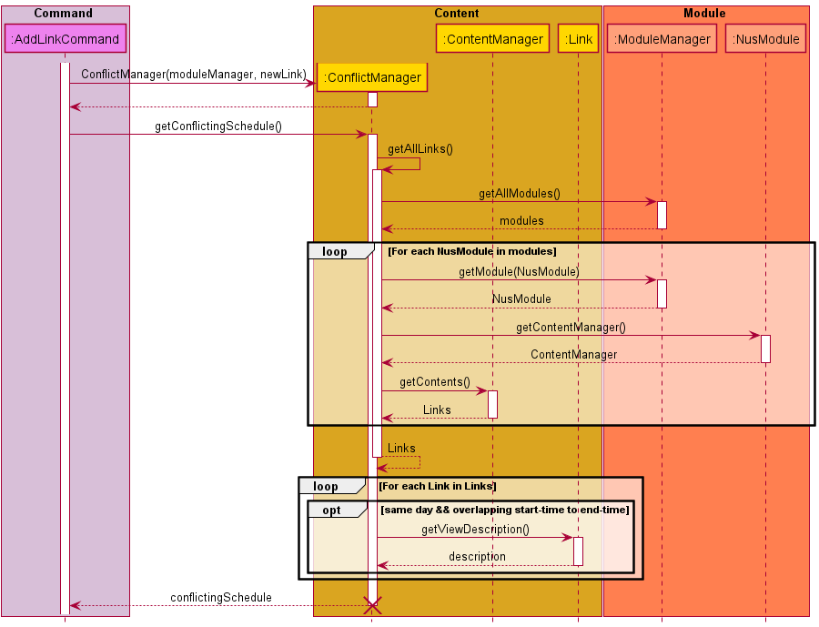

Conflict Manager is a default TermiNUS feature which complements the basic add Link feature.
This feature will automatically list out all the conflicting `Link` objects with the newly added `Link` when user executes `addLinkCommand`

The conflict feature is facilitated by the `ConflictManager`.
There is no need for users to run a specific command to execute the Conflict Manager as the application will implement the Conflict Manager by default
when users try to add a new Link within their modules.

Given below is an example usage scenario showing how the `ConflictManager` behaves at each step.

**Step 1:** When user executes `addLinkCommand` from  workspace.
A new `ConflictManager` will be generated by the `addLinkComand`

**Step 2:** The application invokes `ConflictManager#getConflictingSchedule()` to get all the conflicting Link with the newly added Link

**Step 3:** During the current invocation, the `ConflictManager` will self-invoke `getAllLinks` to store all the possible conflicting links in an `Arraylist`.

**Step 4:** Once `ConflictManager#getAllLinks` has been invoked, it will first construct a `ModuleManager` and invokes `ModuleManager#getAllModules()` to get all the user's modules.
The application will iterate through all the user's modules and invoke `ModuleManager#getContentManager()` for each of the user's modules.

**Step 5:** Once the `ContentManager` has been acquired, the application will invoke `ContentManager#getContents()` to acquire all the `Link` objects stored by the user.
All the `Link` objects will be stored in the `ArrayList` created in Step 3.

**Step 6:** The `ArrayList` of `Link` objects will be iterated through and filtered. 
If the newly added `Link` object has the same `day` attribute and overlapping `startTime` and `endTime` as the current `Link` being filtered, then the `Link` description will be appended to a `StringBuilder`.

**Step 7:** The `StringBuilder` object will be converted to a `String` object before being returned to `ConflictManager` and `AddLinkCommand`.
Then the `AddLinkCommand` will display all the conflicting schedule during its execution


#### 4.4.2 Design Consideration

This section shows the design considerations that were taken into account when implementing the Conflict Manager feature.

**Aspect: Accessibility of Conflict Manager**

| Approach | Pros | Cons |
|----------|------|------|
| Accessed like other commands | Allows users to view conflicts anytime | Users might not be aware of conflicting schedules upon adding |
| Integrated to Add Schedule | Users will be aware of conflicting schedules upon adding | Slightly challenging for users to identify conflicts at any given time |

**Chosen Solution:** Integrated to Add Schedule, as we would like to notify users immediately when a conflict occurs.
We hope that all users are aware of the conflicts as soon as possible, so that conflicts can be resolved quickly. 
Although it is slightly challenging to identify conflicts when not adding a new schedule,
we think that the timetable feature can help in identifying conflicts manually.

### 4.5 Storage Implementation

To view the high-level diagram, head to [3.8 Storage](#38-storage-component).

#### 4.5.1 Initialize Storage Implementation

This section details the technical information of `StorageManager` when `Terminus` create the `StorageManager`.

##### 4.5.1.1 Current Implementation


**Step 1:** When TermiNUS gets executes, it will need to initialise a `StorageManager` that handles
any file I/O operations.

**Step 2:** `Terminus` will need to provide a path for the **main directory** where all data are stored
and the **main json file** where the `module`,`question` and `schedule` are stored.

> 📝 **Note:** The **main directory** is **hardcoded** within TermiNUS that has the filepath of the directory
> where TermiNUS was executed from. The main directory will be named **data** and the **main json**
> file will be located within the **data** folder and it is named as **main.json**.

**Step 3:** When calling the construct of `StorageManager`, it will create different storage type objects
to handle different storage type file I/O operations. They are `NoteStorage`, `JsonStorage`, `PdfStorage` and
`FolderStorage`.

| Storage Type  | Explanation                                                                                                                |
|---------------|----------------------------------------------------------------------------------------------------------------------------|
| NoteStorage   | Handles any `Note` related file I/O operations.                                                                            |
| JsonStorage   | Handles any main `.json` file related I/O operations.                                                                      |
| FolderStorage | Handles any `Module` related file I/O operations. As `Module` in TermiNUS is stored as a folder in the **data** directory. |
| PdfStorage    | Handles any `.pdf` file related I/O operations. Mainly the `export` command within the `note` workspace.                   |

##### 4.5.1.2 Design Consideration

**Aspect: Different types of storage.**

| Approach                                                                                | Pros                                                                          | Cons                                                                                                     |
|-----------------------------------------------------------------------------------------|-------------------------------------------------------------------------------|----------------------------------------------------------------------------------------------------------|
| 2 Types of Storage that handles either file or folder only                              | More consolidated classes.                                                    | Mix handling of third party operations such as `gson` and `pdfWriter` with the base file I/O operations. |
| Current implementation of 4 different types of Storage differs by its files operations. | More catered operations that allows the base file I/O to be in another class. | Multiple Storage to be referenced in StorageManager, higher probability of failed initialization.        |

**Chosen Solution:** Current approach with the 4 different types of storage. Allowing all base functionality
of file I/O operations using `NIO2` to be in its own class which is in the `Storage` class. As for the rest
of the storage type class to inherit the functionality of the `Storage` class while adding their own
checks and third party imports on top of it.

#### 4.5.2 Loading Storage Implementation

This section details the technical information of `StorageManager` when `Terminus` loads data in the `data` directory.

##### 4.5.2.1 Current Implementation


**Step 1:** TermiNUS will call the method `initialise()` for `StorageManager` that will proceed to load
any data from the main `data` directory.

**Step 2:** Firstly, `StorageManager` will attempt to create the main `data` directory follow by the `main.json` file
, only if they have not been created yet. This is to ensure that on the **first** time execution of TermiNUS, 
all necessary file and folder are created.

> 📝 **Note:** The `createFolder()` and `createFile()` uses checks from `Files.notExists(:Path)` before
> creating the folder and file using `Files.createDirectories(:Path)` and `Files.createFile(:Path)` respectively.


**Step 3:** After, ensuring that all required folder and file are created, it will proceed to load any data
from the `main.json` file into a `ModuleManager` object using `gson` libraries.

**Step 4:** However, if the `main.json` file does not contain any data due to the `main.json` file being
created in **step 2**, it will create a new `ModuleManager` object and return it back to TermiNUS.

**Step 5:** After loading the data into `ModuleManager` from the `main.json` file, it will proceed to filter any 
invalid data using a `FilterManager`. The `FilterManager` will iterate through each data in `ModuleManager`
and removes the invalid ones.

> 📝 **Note:** From this point onwards, the ModuleManager will only contain valid data that matches the
> criteria set by TermiNUS. One example of the filter done by `FilterManager` is **module code** of `NusModule` cannot have spaces.

**Step 6:** With the validated `ModuleManager`, it will load any `Note` data for each `NusModule` in `ModuleManager` from its respective **module** folder.
The **nus module** mentioned here are the ones currently in the `ModuleManager` and the folder containing the `Note` file
has the name of the **nus module**.

> 📝 **Note:** The nus modules in the `main.json` file represents the `NusModule` that should be in TermiNUS when
> TermiNUS gets executed. Any other folder within the main `data` directory with its name not
> in `ModuleManager` will be ignored.

> 📝 **Note:** Any `Note` file that causes an error while performing file I/O operations, that `Note` file
> will be ignored and the program will proceed to load the next `Note` file if any.

**Step 7:** Once the `Note` has been loaded into `ModuleManager` under each of its respective `NusModule`, 
it will return this `ModuleManager`.

**Step 8:** And finally, `StorageManager` will return this `ModuleManager` back to `Terminus`.

##### 4.5.2.2 Design Consideration

**Aspect: Creates missing folder of existing NusModule.**

| Approach                                                                    | Pros                                                                | Cons                                                                                  |
|-----------------------------------------------------------------------------|---------------------------------------------------------------------|---------------------------------------------------------------------------------------|
| Create a folder for the `NusModule` if its folder does not exists.          | Synchronize folder data with current `ModuleManager` data.          | Extra file I/O operations needed.                                                     |
| Do nothing and proceed to check for the next `NusModule` in `ModuleManager` | No need to perform additional file I/O operation to create folders. | Current `NusModule` in `ModuleManager` does not reflect in the main `data` directory. |

**Chosen Solution:** Do not create the missing folders of existing `NusModule` in `ModuleManager`. By performing 
the additional filo I/O operation to create a folder may result in an IO Exception due to not being able to
create the specified folder. Due to this, it may abort loading of any notes for any other `NusModule` in
ModuleManager. Secondly, this method is meant to load existing data and not to create any data that is not
the main `data` directory or the `main.json` file.

#### 4.5.3 Execute CommandResult with Storage Implementation

This section details the technical information of `StorageManager` when `Terminus` performs required file I/O operations stated in `CommandResult` after an execution of a `Command`.

##### 4.5.3.1 Current Implementation


**Step 1:** When `Terminus` executes a `Command`, a `CommandResult` will be returned. The `CommandResult` contains
information of the `Command` execution and this includes any additional file I/O operations needed. If `CommandResult.hasChanges()` returns
a **True**, it determines a file I/O operation is needed.

**Step 2:** If a file I/O operation is needed, `Terminus` will call the method `executeCommandResult()` in `StorageManager` that
handles the extraction of information in `CommandResult` and parses the information to its respective Storage types for further
processing.

**Step 3:** Once done, `StorageManager` will return to `Terminus` and this concludes the file I/O 
requirements from the execution of a `Command`.

##### 4.5.3.2 Design Consideration

**Aspect: Split by StorageAction or StorageType first.**

| Approach             | Pros                                                                                        | Cons                                                                                                              |
|----------------------|---------------------------------------------------------------------------------------------|-------------------------------------------------------------------------------------------------------------------|
| StorageAction first. | File I/O grouped by similar changes performed.                                              | Need to handle different types of file. For example, folder and file creation are both different calls in `NIO2`. |
| StorageType first.   | Group by the objects requirements in Terminus. Decoupling of file I/O operations is easier. | In the future, many different file types may result in multiple Storage class needed.                             |

**Chosen Solution:** Separate file I/O operation by the type of file involved first which is the solution of
StorageType first. This means that each Storage type have a higher decoupling from one another.

### 4.6 Adding Content Implementation

This section details the technical information of adding a `Content` into `ContentManager`.

#### 4.6.1 Current Implementation

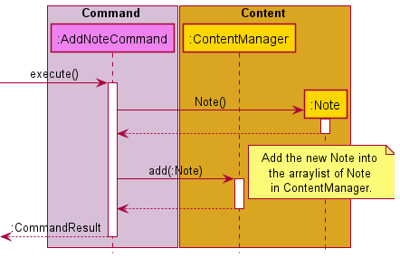

> 📝 **Note:** For the other `Content` type such as `Question` and `Schedule`, they follow the same logic
> flow as the diagram shown above. Simply replace the `AddNoteCommand` and `Note` to their respective 
> `Content` type.

**Step 1:** When the `AddNoteCommand` receives the call to `execute()` from the `CommandParser`, it will
proceed to add the new `Note` into its `ContentManager`.

**Step 2:** Firstly, it will create a new `Note` object with the specified arguments for it.

**Step 3** Next, `AddNoteCommand` will pass the newly created `Note` object into `ContentManager` for it to 
store in its arraylist of `Note`.

**Step 4** Upon, the successful execution of adding the new `Note` into `ContentManager`, it will return a `CommandResult` with
its respective message for user `Ui` response purposes.

#### 4.6.2 Design Consideration

**Aspect: Checks arguments in ContentManager or the AddCommand.**

| Approach                           | Pros                                                                      | Cons                                                                      |
|------------------------------------|---------------------------------------------------------------------------|---------------------------------------------------------------------------|
| Checks argument in AddCommand.     | Ease the workload on ContentManager.                                      | Add command can no longer be a generic command used by all Content types. |
| Checks argument in ContentManager. | Command do not need to understand the criteria of a valid Content object. | Introduces a lengthy if-else for each Content type in Terminus.           |

**Chosen Solution:** To validate arguments in the AddCommand instead. This is due to the generic type of
`ContentManager` that may lead to nested conditions if the arguments are checked within the `ContentManager`.

### 4.7 Deleting Content Implementation

This section details the technical information of deleting a `Content` from `ContentManager`.

#### 4.7.1 Current Implementation


**Step 1:** When the `DeleteCommand` receives the call to `execute()` it will proceed to remove the
specified `Content` by its **content number** from the `ContentManager`.

**Step 2:** Within `ContentManager`, it will check if the provided **content number** is within range
of the arraylist.

**Step 3:** Once the `Content` has been removed from the arraylist, it will return the removed `Content` name
for user `Ui` response purposes.

#### 4.7.2 Design Consideration

**Aspect: To pass the content number as the exact index in the arraylist or the index viewed from the view command.**

| Approach                          | Pros                                                                                                                                                                | Cons                                                                                                                            |
|-----------------------------------|---------------------------------------------------------------------------------------------------------------------------------------------------------------------|---------------------------------------------------------------------------------------------------------------------------------|
| Pass by array index.              | Generic use of `deleteContent()` could be possible for any other `Command` that requires a removal of a certain `Content`.                                          | Could be confusing as the arraylist is not known only to the `DeleteCommand`.                                                   |
| Pass by content number from view. | All indexes used in Terminus will be retrieved from the view command, hence the content number is the only number involved in any `Command` that requires an index. | Internal usage to remove an element in the arraylist could not use the `deleteContent()` unless it adds a 1 to the given index. |

**Chosen Solution:** To avoid the mixing up of content number and array index, we decided to pass the content number
into `ContentManager` where it will subtract the given number by 1 to get the index number for the arraylist.

## 5. Documentation, Logging, Testing and DevOps

This section details how we document, log, test and perform development operations.

### 5.1 Documentation

Our User Guide and Developer Guide are written in Markdown, and are rendered by GitHub Pages.

All diagrams in this Developer Guide are generated with PlantUML.

### 5.2 Logging

We wrap the default `java.util.logging.Logger` in Java in `terminus.common.TerminusLogger`, 
providing us easier access to logging information for debugging and error message displaying. By
default, TermiNUS will not print any logging information to the terminal, and will log anything 
equal to or above `Level.INFO` into the file `terminus.log` in the same directory the user ran the 
application.

### 5.3 Testing

Testing is done with JUnit testing, and we have added Jacoco as a Gradle plugin to monitor test code
coverage.

Before pushing and creating a pull request, please ensure no existing JUnit tests fail, as well as 
ensure new test cases are written to maintain a high code coverage.

### 5.4 DevOps

Building and testing can be done with Gradle, and all integration testing is done with GitHub 
Actions in the GitHub repository.

All pull requests are also checked with Codecov to ensure that overall code coverage does not drop.
You may monitor your Codecov progress in your pull request if you successfully passed all the tests.

## Appendix A: Product Scope

### A.1 Target User Profile

- Students in NUS.
- Wants to enhance their learning experience.
- Has difficulty managing academic materials in NUS.
- Prefers command-line desktop applications.
- Able to type fast.

### A.2 Value Proposition

- Helps the target user organise their academic materials.
- Find any conflicts in the schedules from the target user.
- Aids in learning better using Active Recall.
- Consolidate all notes into a PDF for referencing purposes while studying.
- Organise academic materials for different modules.
- Portable and works offline.


## Appendix B: User Stories  

| Version | As a ... | I want to ... | So that I ... |
|---------|----------|---------------|---------------|
| 1.0 | disorganized student | be able to store my zoom links somewhere|  can easily view my links when required.|
| 1.0 | student |  be able to retrieve my zoom links easily| can easily find them when required.|
| 1.0 | student | be able to remove zoom links from my regular schedule | can fix any finished lessons. |
| 1.0 | student |  be able to add notes taken during lecture| do no need to manage it physically myself.|
| 1.0 | student | be able to delete my notes | can re-organize information taken down by me.|
| 1.0 | student | be able to view the notes taken during lecture | can refer to them easily.|
| 1.0 | student | be able to exit the app properly | can shut down my computer. |
| 1.0 | student |  view all available commands in the app | know what commands are there in the application.|
| 1.0 | student |  store my data persistently | can use the application properly. |
| 2.0 | organised student |  categorize my notes to specific modules | can extract information only from that module I specified.|
| 2.0 | learned student | add questions and answers | can view them later.|
| 2.0 | student | be able to view my lessons for the day | can check my schedule for that day.|
| 2.0 | student |  be reminded when my next class is |  would not miss any class accidentally.|
| 2.0 | student | be able to extract the notes into a pdf format | can view on my phone outside of the app.|
| 2.0 | student | be able to view my questions and answers | can revise on my module. |
| 2.0 | student |  be able to organize my questions and answers into different topics | can find what I want easily.|
| 2.0 | student | be able to delete my questions and answers | can delete the ones that are irrelevant. |
| 2.0 | student | be able to extract information from one computer to the other | am able to sync information between multiple devices. |
| 2.0 | student |  be able to create categories for my notes | can organize my notes better. |
| 2.0 | student |  ensure that my timetables have no clashes | can have exams are on different timings / days.|
| 2.0 | student |  edit a text file instead of within a terminal for lengthy texts | can use my favourite text editor to edit instead. |
| 2.0 | student | view changes edited in the saved text file on the terminal | don't have to restart the program. |
| 2.0 | student | be able to view my lessons for the week | can check my schedule for that week. |


## Appendix C: Non Functional Requirements  

1. The application should work on any _major operating systems_ (OS) such as Windows,Linux and macOS that have `Java 11` installed.
2. Users with fast typing speed should be able to add and remove content more easily and faster as compared to using mouse.
3. The application should be easy to learn and use with the User Guide and/or Developer Guide.
4. The application should be responsive to user input.

## Appendix D: Instructions for Manual Testing

### D.1: Launch and Shutdown

#### Initial Launch

1.  Download the jar file and copy it into an empty folder.
2.  Open a new terminal and navigate to the directory containing `TermiNUS.jar`.
3.  Enter the command `java -jar TermiNUS.jar` to launch **TermiNUS**.
4.  The program will display a welcome message and **TermiNUS** will be ready for use.


#### Shutdown

1.  To exit **TermiNUS**, enter the `exit` command.

<br/>


### D.2: Workspace Navigation

1. When users run a program or enter a new workspace, a welcome instruction indicating the navigable workspaces will be displayed.
2. Users can also use the `help` command to check the navigable workspace(s).
3. It is important to take note that workspaces such as `question`, `note`, and `schedule` can only be accessed from the `go` workspace
4. Test case performed in the `main` workspace: `go cs2113T`

    Expected: Users will be navigated to the `go` workspace, where they can now access the `question`, `note`, or `schedule` workspaces.
5. Test case performed in the `go` workspace: `schedule`

    Expected: Users will be navigated to the `schedule` workspace, where they can now use the `schedule` functionalities.
6. Incorrect commands to try:
   
    a. `go` (No module is specified)

    b. `go X` (Where X is not an existing user module)

> 💡 Advanced users can navigate to sub-workspaces using a single command. E.g. `go cs2113T schedule`

<br/>


### D.3: Timetable Feature

1. The `timetable` features can only be used from the main workspace.
2. Test case: `timetable`

   Expected: User's schedule for the week will be displayed.
3. Test case: `timetable Tuesday`

   Expected: User's schedule for Tuesday will be displayed.
4. Incorrect commands to try:

   a. `timetable today` (Today is not a valid day)

   b. `timetable 1` (1 is not a valid day)

<br/>


### D.4: Module Workspace

1. Navigate to the `module` workspace from the main workspace.
2. Users can now `add`, `view`, `delete` or `update` their modules.
3. Test case: `add cs2106`

    Expected: Users will have a new module, cs2106.
4. Test case: `view`

    Expected: All the user's modules will be displayed.
5. Test case: `delete 1`

    Expected: The user module at index 1 will be deleted.
6. Test case: `update 1 "cs2105"`
   
    Expected: The user module at index 1 will be updated to cs2105.
7. Incorrect commands to try:

    a. `add` (No new module is created)

    b. `delete 0` (Invalid index for deletion)

    c. `update 0 "cs2101"` (Invalid module index to be updated)

<br/>


### D.5: Accessing a Specific Module

1. From the main workspace, use `go` to access a specific module.
2. A specific module will be accessed when users enter the `go` workspace.
3. Workspaces such as `question`, `note`, and `schedule` can now be accessed.
4. Test case: `go cs2105`

    Expected: User will now access the cs2105 module
5. Incorrect commands to try:
   
    a. `go` (No module is specified)

    b. `go X` (Where X is not an existing user module)

<br/>


### D.6: Accessing the Question Workspace

1. Prerequisite: User has to access a module and operate in the `go` workspace
2. User can access the question workspace using the `question` command
3. Test case: `question`

    Expected: Navigate to the `question` workspace
4. Other incorrect commands to try:

    a. `question A` (Trailing "A" is not a valid command)

    b. `question 1` (Trailing "1" is not a valid command)

    c. `question` from the main workspace (Question workspace can not be accessed from the main workspace)

<br/>


### D.7: Add Question

1. Prerequisite: User has to be in the question workspace
2. User can add a new question using the `add` command
3. Test case: `add "What is 1+1 ?" "2"`
    
    Expected: A new question "What is 1+1 ?" is added to the list of questions.
4. Other incorrect commands to try:

   a. `add What is 1+1 ? 2` (The use of quotes for questions and answers is mandatory)

   b. `add "What is 1+1 ?"` (An answer must be present for the new question)

   c. `add` (A pair of question and answer must be present for an add command)

<br/>


### D.8: View Questions

1. Prerequisite: User has to be in the question workspace
2. User can view all the available questions using the `view` command
3. Test case: `view`

   Expected: All the questions for the module will be displayed.
4. Test case: `view 1`

   Expected: The question at index 1 for the module will be displayed.
5. Other incorrect commands to try:

   a. `view 0` (The index 0 is invalid)

   b. `view X` (Where X is a negative number, a word, or a number exceeding the number of questions in the workspace)

   c. `view` from the main workspace (To view questions, execute `view` from the question workspace)

<br/>


### D.9: Delete Question

1. Prerequisite: User has to be in the question workspace
2. User can delete selected question(s) using the `delete` command
3. Test case: `delete 1`

   Expected: Delete the question at index 1.
4. Other incorrect commands to try:

   a. `delete 0` (The index 0 is invalid)

   b. `delete X` (Where X is a negative number, a word, or a number exceeding the number of questions in the workspace)

   c. `delete` (The delete command has to be followed by a valid index)

<br/>


### D.10: Test Feature

1. Prerequisite: User has to be in the question workspace
2. User can ask themselves questions using the `test` feature
3. Test case: `test`

   Expected: Users will be prompted with the available questions.
4. Other incorrect commands to try:

   a. `test` from the main workspace (The test feature can only be accessed from the question workspace)

<br/>


### D.11: Accessing the Note Workspace

1. Prerequisite: User has to access a module and operate in the `go` workspace
2. User can access the note workspace using the `note` command
3. Test case: `note`

   Expected: Navigate to the `note` workspace
4. Other incorrect commands to try:

   a. `note A` (Trailing "A" is not a valid command)

   b. `note 1` (Trailing "1" is not a valid command)

   c. `note` from the main workspace (Note workspace can not be accessed from the main workspace)

<br/>


### D.12: Add Note

1. Prerequisite: User has to be in the note workspace
2. User can add a new note using the `add` command
3. Test case: `add "cs2113 tutorial" "SLAP your code"`

   Expected: A new note titled "cs2113 tutorial", with "SLAP your code" as its content is added to the list of notes.
4. Other incorrect commands to try:

   a. `add cs2113 tutorial SLAP your code` (The use of quotes for note title and content is mandatory)

   b. `add "cs2113 tutorial"` (Content must be present for the new note)

   c. `add` (A pair of note title and content must be present for an add command)

<br/>


### D.13: View Notes

1. Prerequisite: User has to be in the note workspace
2. User can view all the available notes using the `view` command
3. Test case: `view`

   Expected: All the notes for the module will be displayed.
4. Test case: `view 1`

   Expected: The note at index 1 for the module will be displayed.
5. Other incorrect commands to try:

   a. `view 0` (The index 0 is invalid)

   b. `view X` (Where X is a negative number, a word, or a number exceeding the number of notes in the workspace)

   c. `view` from the main workspace (To view notes, execute `view` from the note workspace)

<br/>


### D.14: Delete Note

1. Prerequisite: User has to be in the note workspace
2. User can delete selected note(s) using the `delete` command
3. Test case: `delete 1`

   Expected: Delete the note at index 1.
4. Other incorrect commands to try:

   a. `delete 0` (The index 0 is invalid)

   b. `delete X` (Where X is a negative number, a word, or a number exceeding the number of notes in the workspace)

   c. `delete` (The delete command has to be followed by a valid index)

<br/>


### D.15: Export Notes

1. Prerequisite: User has to be in the note workspace
2. User can export all the notes in a pdf format using the `export` command
3. Test case: `export`

    Expected: All the notes will be exported in a pdf format.
4. Other incorrect commands to try:

   a. `export X` (Where X is any trailing number or word)

   b. `export` from the main workspace (The export command must be executed in the note workspace)

<br/>


### D.16: Accessing the Schedule Workspace

1. Prerequisite: User has to access a module and operate in the `go` workspace
2. User can access the schedule workspace using the `schedule` command
3. Test case: `schedule`

   Expected: Navigate to the `schedule` workspace
4. Other incorrect commands to try:

   a. `schedule A` (Trailing "A" is not a valid command)

   b. `schedule 1` (Trailing "1" is not a valid command)

   c. `schedule` from the main workspace (Schedule workspace can not be accessed from the main workspace)

<br/>


### D.17: Add Schedule

1. Prerequisite: User has to be in the schedule workspace
2. User can add a new schedule using the `add` command
3. Test case: `add "CS2113T Lecture" "Friday" "16:00" "2" "https://zoom.us/test"`

   Expected: A new schedule for CS2113T Lecture on Friday from 16.00 for 2 hours with "https://zoom.us/test" link is added to the list of schedules.
4. Other incorrect commands to try:

   a. `add "Friday" "16:00" "2" "https://zoom.us/test"` (Any missing arguments will result in an invalid command)

   b. `add CS2113T Lecture Friday 16:00 2 https://zoom.us/test` (Any missing quotes will result in an invalid command)

   c. `add` (All arguments must be present for a valid add command)

<br/>


### D.18: View Schedules

1. Prerequisite: User has to be in the schedule workspace
2. User can view all the schedules using the `view` command
3. Test case: `view`

   Expected: All the schedules for the module will be displayed.
4. Test case: `view 1`

   Expected: The schedule at index 1 for the module will be displayed.
5. Other incorrect commands to try:

   a. `view 0` (The index 0 is invalid)

   b. `view X` (Where X is a negative number, a word, or a number exceeding the number of schedules in the workspace)

   c. `view` from the main workspace (To view schedules, execute `view` from the schedule workspace)

<br/>


### D.19: Delete Schedule

1. Prerequisite: User has to be in the schedule workspace
2. User can delete selected schedule(s) using the `delete` command
3. Test case: `delete 1`

   Expected: Delete the schedule at index 1.
4. Other incorrect commands to try:

   a. `delete 0` (The index 0 is invalid)

   b. `delete X` (Where X is a negative number, a word, or a number exceeding the number of schedules in the workspace)

   c. `delete` (The delete command has to be followed by a valid index)

<br/>


### D.20: Help Feature

1. Users can use the `help` command to show all the available commands in the workspace.
2. The `help` messages might differ in different workspaces.
3. Test case: `help`

    Expected: All available commands and their format in the workspace will be displayed.
4. Other incorrect commands to try:
    
    a. `help X` (Where X is any trailing number or word)

<br/>


### D.21: Navigate to Previous Workspace

1. Prerequisite: User must have accessed any workspaces other than the main workspace.
2. To return to the previous workspace, user can use the `back` command.
3. Test case: `back`

    Expected: Navigate to the previous workspace.
4. Other incorrect commands to try:

    a. `back X` (Where X is any trailing number or word)

    b. `back` from the main workspace (The back command cannot be used in the main workspace)

<br/>
