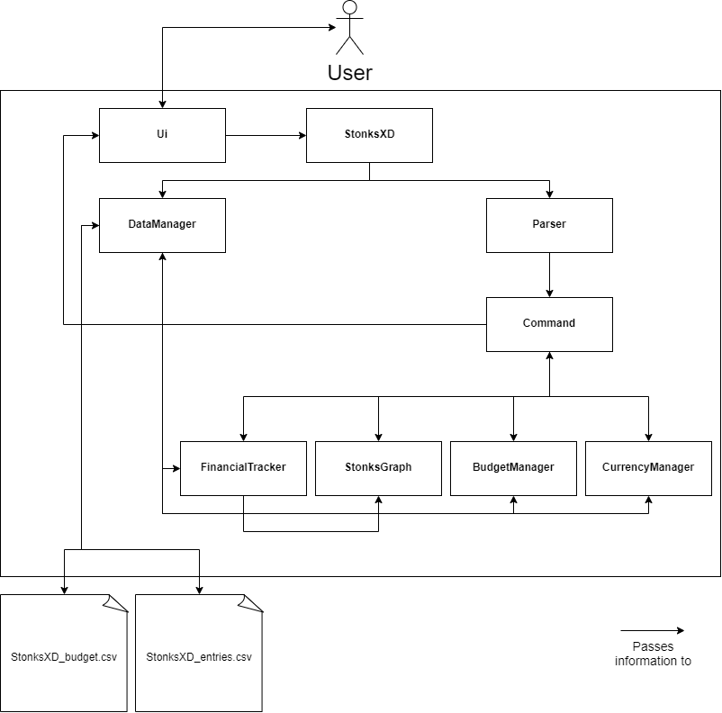

# Developer Guide

## Acknowledgements
Snippets of code from Baeldung’s guide to unit testing of system.out.println() with junit were used.

Source: https://www.baeldung.com/java-testing-system-out-println

Snippets of code from addressbook-level2’s Parser.java were used.

Source: https://github.com/se-edu/addressbook-level2/blob/master/src/seedu/addressbook/parser/Parser.java

## Design & implementation
{Describe the design and implementation of the product. Use UML diagrams and short code snippets where applicable.}
### Architecture

The __Architecture Diagram__ above explains the high-level design of the StonksXD app.
Given below is a quick overview of the main components of the application and how they interact with each other:
 

`Ui` is the class responsible for interfacing with the user. 
It receives user input and passes it to`StonksXD`.
It also receives data from `Command` to output to the user.

`User` &harr; `Ui` &rarr; `StonksXD`

`Ui` &larr; `Command`

 

`StonksXD` is the main class of the app. It has 2 main functions: 
1. Upon opening the app, it loads saved data by calling `DataManager`. Before closing the app, it calls `DataManager` again to save data.
2. Runs a loop receiving new user input from `Ui` and passing it to `Parser`.

`StonksXD` &rarr; `DataManager`

`Ui` &rarr; `StonksXD` &rarr; `Parser`

 

`Parser` is the class responsible for interpreting the user input. 
It ensures the appropriate input format, and passes the input data to the appropriate command.

`StonksXD` &rarr; `Parser` &rarr; `Command`

 

`Command` is the class responsible for the execution of all commands.
It contains child classes for all possible commands.
It interacts with `FinancialTracker` and `BudgetManager` to execute commands, before sending information to `Ui` for output.

`Parser` &rarr; `Command` &harr; `FinancialTracker`

`Parser` &rarr; `Command` &harr; `BudgetManager`

`Ui` &larr; `Command`

 

`FinancialTracker` is the class containing and handling all income and expense entries input by the user.
It interacts with `Command` to execute tasks, and writes to `DataManager` to save its data.
It also retrieves data from `DataManager` when the program is loaded.

`Command` &harr; `FinancialTracker`

`FinancialTracker` &harr; `DataManager`

 

`BudgetManager` is the class containing and handling all budget information.
It interacts with `Command` to execute tasks, and writes to `DataManager` to save its data.
It also retrieves data from `DataManager` when the program is loaded.

`Command` &harr; `BudgetManager`

`BudgetManager` &harr; `DataManager`

 

`DataManager` is the class responsible for reading data from the `StonksXD_entries.csv` and `StonksXD_budget.csv` files upon boot up,
and writing save data to the files before terminating the program.
It interacts with `FinancialTracker` and `BudgetManager` and receives commands from `StonksXD`.

`FinancialTracker` &harr; `DataManager`

`BudgetManager` &harr; `DataManager`

`DataManager` &larr; `StonksXD_data.csv`

The sections below provide more information on the respective components.

---

### Ui Component
Ui contains a Scanner object that takes in user inputs from the command line.
The Ui’s main role is to provide feedback whenever the user enters a command through the form of messages. It also 
handles the indexing of each element in the listing methods before printing out to the standard output for users to see.

The image below illustrates the sequence diagram in the context of listing methods
which includes listExpense, listIncome and listFind.

---

### Command Component

The `Command` class is a parent class that contains all the basic command features required to operate on incoming income or expense data.

Each method is abstracted into an appropriate child class (for e.g. `AddExpenseCommand`) in accordance with SLAP and OOP rules to handle only one function.

After obtaining the attributes of an entry from the `entry` class and the required command given by the user from the `parser` class, it directs the inputs to the respective methods for execution.

The image below shows the sequence diagram of how the `AddExpenseCommand` class is used and the other classes involved with it as well.

---

### Parser component

The `Parser` class is in charge of converting user input to a command. It is also in charge of converting important 
information such as users' entries to easy-to-store data, and vice versa.

#### Implementation

`Parser` mainly uses regex to parse items. Here are the uses of regex in the `Parser` class.
1. To determine if user inputs are in the correct format. 
2. To split up user input to their respective parameters with the help of flags such as `a/` and `d/`. 
3. To determine if data from the `csv` files are in the correct format.
4. To split up data from the `csv` files into their respective parameters with the help of commas since our data are
stored in `csv` files.

### Budget Component

The Budget component consists mainly of the `BudgetManager` class and the `Budget` class.

 

The `BudgetManager` class is the main class containing all methods relating to budget operations.
On the other hand, the `Budget` class is the parent class of all the budget categories. 
There are currently 7 child classes of `Budget` (i.e. 7 legal budget categories in the program).

 

How the Budget compoment works:
- Upon start-up, a new `BudgetManager` is initialised in `StonksXD`.
- `BudgetManager` initialises all `Budget` sub-classes with respective budget limit values loaded from `DataManager`.
- When an entry is added by the user, `BudgetManager` parses the category input by the user and calls the relevant `Budget` sub-class.
- The `handleBudget` method is performed on the `Budget` sub-class.
- The relevant budgeting information is then sent to the `Ui` class for printing.

 

Below is a sequence diagram of the Budget component when `handleBudget` is executed:

_------Work in Progress------_

---

### Graphing Component
Below is a class diagram to show the classes that interacts with StonksGraph. When the ShowGraphCommand is called it would call the execute method
which calls the constructor of StonksGraph to generate a graph based on current year values, these values are calculated based on the data in FinancialTracker.
The constructed StonksGraph will then be printed out by the Ui class through the printGraph method.

#### Class Diagram

In the following section all coordinates will be in the form of (Row from the top, Column from the left) and coordinates mark with X is a don't care.

Description of graphing component
1. The graphing component consists mainly of the StonksGraph class which contains a 20 by 100 2d array.
2. When first initialised, the StonksGraph constructor will call setBorder() which will loop through the 2d array and set
   all border characters as the given border character 'x' while keeping the others as the char blank.
3. It then calculates the balance of the financial tracker using the calculateBalance() method and write the value with its descriptor starting from coordinate (2,4).
4. Next it calls the drawReport() method, first it writes the title "Your Yearly Report" at coordinate (5,4).
   Then it writes the separator at (6,X), followed by a legend at (2,75) the top right. It also writes the x-axis with its month labels.
5. It then calls the getMonthlyIncomeBreakdown(currentYear()) and getMonthlyExpenseBreakdown(currentYear()) methods to retrieve all total expenses and total incomes
   for the current year when the user is using the app.
6. Using this 24 data set in total (12months for both expenses and incomes) it will calculate the scale for each bar unit
7. Then it plots the bar graph based on whichever column it looped through using the drawBar() method.

---

Below is a sequential diagram for the constructor of StonksGraph that shows the different method calls when a new StonksGraph object is instantiated.

#### Sequential Diagram

---

### Data storage Component
The saving and loading of data is handled by the `DataManager` class. Data will be saved and loaded from 
`StonksXD_Entries.csv` and `StonksXD_Settings.csv`, which will be located in the same directory as the program. 

- `StonksXD_Entries.csv` will be storing users' income and expense entries.
- `StonksXD_Settings.csv` will be storing users' budget values, threshold value and currency setting.

`DataManager` requires an instance of the `Parser`, `FinancialTracker`, `Ui`, `CurrencyManager` and `BudgetManager` 
at the moment of creation. 

- When saving data into the csv files, `DataManager` uses Java's `FileWriter` and `BufferedWriter` class to 
interact with the csv file.
- When loading data from the csv files, `DataManager` uses Java's `FileInputStream` and `Scanner` to interact with 
the csv file. 

The image below illustrates the class diagram in the context of data saving and loading.

#### Saving
This process will occur after every user command to ensure data security.

When saving data,
1. The main class (StonksXD) will call `saveAll()` which causes `DataManager` to start saving data.
2. `DataManager` will call `saveEntries()`, to save all the expense and income entries into `StonksXD_Entries.csv` 
first.
3. A `FileWriter` to `StonksXD_Entries.csv` is created. A `BufferedWriter` is then created using the created 
`FileWriter`. Using `BufferedWriter` should make the saving process more efficient since multiple writes will 
take place. 
4. The `csv` header will be written to `StonksXD_Entries.csv`. 
The header: entry_type,entry_description,amount,category,date
5. `DataManager` will obtain all the expenses that Stonks XD is tracking from `FinancialTracker`.
6. For each expense, it will be converted to a `String` with each field being separated by a comma in `Parser`.
The `String` will then be written to `StonksXD_Entries.csv`.
7. Repeat step 5 and step 6 for incomes. (This process is omitted in the sequence diagram as it is 
a repeat.)
8. Close the `BufferedWriter` and return from `saveEntries()`, deleting both the `FileWriter` and `BufferedWriter`.
9. `DataManager` will now call `saveSettings()`, to save the users' budget values, threshold value and currency setting 
into `StonksXD_Settings.csv`. (This process will be shown in a separate sequence diagram to reduce complexity 
and confusion. The steps will carry on after showing the sequence diagrams.)

The sequence diagrams below illustrate the saving process (note that the diagrams are not exhaustive).

10. Create a `FileWriter` to `StonksXD_Settings.csv`. Followed by the `BufferedWriter`.
11. The `csv` header will be written to `StonksXD_Settings.csv`.
The header: currency,threshold,food,transport,medical,bills,entertainment,misc,overall
12. The users' budget values, threshold value and currency setting will be converted to a `String` with each 
important field separated by a comma in `Parser`. The `String` will then be written to `StonksXD_Settings.csv`.
13. Close the `BufferedWriter` and return from `saveSettings()`, deleting both the `FileWriter` and `BufferedWriter`.
14. Now all entries and settings are saved. Control is returned to main.

#### Loading
This process will occur the moment Stonks XD starts to run.

When loading data,
1. The main class (StonksXD) will call `loadAll()` which causes `DataManager` to start loading data.
2. `DataManager` will call `loadSettings()`, to load users' budget values, threshold value and currency setting first.
   1. `DataManager` will look for `StonksXD_Settings.csv` and create a `FileInputStream`. If file cannot be found, a new
   `StonksXD_Settings.csv` will be created and the loading process for settings will end here.
   2. A `Scanner` is created using the `FileInputStream` to read from `StonksXD_Settings.csv`.
   3. `Scanner` reads the first line which should be the `csv` header. If the header is found to be corrupted, an error
   message will be shown to the user through `Ui`. Error messages are constants in the `Message` class.
   4. `Scanner` reads the second line (let's call it `data`) which should contain all the settings. If there is something 
   wrong with the format or there is no second line at all, an error will be shown and the settings will not be loaded.
   5. `Parser` will take in `data` and return the `CurrencyType`.
   6. The `CurrencyType` will then be loaded into `CurrencyManager`.
   7. `Parser` will take in `data` again and return the `thresholdValue`.
   8. The `thresholdValue` will then be loaded into `BudgetManager`.
   9. Now `DataManager` will be loading the users' budget values. (this process will not be shown in the sequence 
   diagram below to reduce complexity)
   10. `Parser` will take in `data` again and return an `ArrayList<double>`. Each double representing the budget value 
   for an expense category.
   11. Each budget value will be loaded into their respective categories in `BudgetManager`.
3. `DataManager` will now call `loadEntries()`, to load users' expense and income entries (this process is omitted 
from the sequence diagram to reduce complexity).
   1. `DataManager` will look for `StonksXD_Entries.csv` and create a `FileInputStream`. If file cannot be found, a new
      `StonksXD_Entries.csv` will be created and the loading process for settings will end here.
   2. A `Scanner` is created using the `FileInputStream` to read from `StonksXD_Entries.csv`.
   3. `Scanner` reads the first line which should be the `csv` header. If the header is found to be corrupted, an error
      message will be shown to the user through `Ui`. Error messages are constants in the `Message` class.
   4. `Scanner` will now read line by line till the end of file. For every line, `DataManager` will pass it to `Parser` to 
   attempt to convert it to either an expense or an income. If it can be converted, it will be loaded into 
   `FinancialTracker`. If the line cannot be understood by `Parser`, it will be deemed as a corrupted line, and it will
   not be loaded.
   5. When the end of line is reached, `DataManager` will let the users know if there are any corrupted lines. At this 
   point, all valid entries are loaded already.
4. Now all entries and settings are loaded. Control is returned to main.

The sequence diagram below illustrates the loading process (note that the diagram is not exhaustive).

## Product scope
### Target user profile

{Describe the target user profile}

### Value proposition

{Describe the value proposition: what problem does it solve?}

## User Stories

|Version| As a ... (role)| I want to ... (Function)| So that I can … (Benefit)|
|--------|----------|---------------|------------------|
|v1.0|New User|List out all possible commands|Know what I can key into the CLI interface|
|v1.0|User|Be able to record my spendings|Keep track of all my expenses|
|v1.0|User|View all expense entries|See which spending I can cut down on and better manage my finances|
|v1.0|User|Delete my expense entries|Delete wrong entries due to possible typos|
|v1.0|User|View total expense|See if I need to reduce my spending in the future|
|v1.0|User|Delete my income entries|Delete wrong entries due to possible typos|
|v1.0|Worker|Create income entries|Keep track of my total income and not spend more than that amount|
|v1.0|User|See all income entries|Have an understanding of income history|
|v1.0|User|View total income|Know what my spending limits are|
|v2.0|User|Have my entries saved into the hard disk automatically|My data would not be lost when I close the application|
|v2.0|User|Convert income / expense entries to different currencies|Do not have to manually convert currencies|
|v2.0|User|View my expenditure in the form of bar charts|Gain more useful insights on my overall financial situation|
|v2.0|Frugal spender|Set monthly budgets (overall budget and categorical budgets)|Plan my spending in advance|
|v2.0|Large spender|Receive reminders when I am about to overspend|Cut back on my spending|
|v2.0|Big spender|Get assistance readjusting my budget when I overspend|Can minimize the damage of spending too much|
|v2.0|Financially conscious user|Receive daily tips on saving, budgeting and spending|Can be more frugal and wiser with my financial decisions|
|v2.0|Long term user|See my account net balance|Can make appropriate plans / adjustments for the future|
|v2.0|User|Find expense / income entry with keyword search|Narrow down the entries I want to see|
|v2.0|User|See expenditure each month|Budget how much I need each month|
|v2.0|User|See income earned each month|Be more motivated to save|
|v2.0|User|Clear all my entries|Start afresh|

## Non-Functional Requirements

- Accessibility requirements: the application should be accessible by anyone with the `.jar` file
- Constrains: the CSV files created by the application should be able to run on different machines running the same application
- Fault tolerance requirements: the application should handle inputs with a reasonable amount of errors
- Interoperability requirements: the application should run on macOS, Windows and Linux operating systems
- Stability requirements: Application should run without internet so that user can access the application anywhere without having to connect to the internet

## Glossary

* *glossary item* - Definition

## Instructions for manual testing

###Initial start-up guide:

1. Ensure that you have Java 11 or above installed.

2. Download the latest version of `StonksXD.jar` from [here](https://github.com/AY2122S1-CS2113T-T12-3/tp/releases).

3. Copy the file to the folder you want to use as the home folder for your `StonksXD`.

4. Open the Command-Line interface (CLI) and navigate to the directory where you saved the `.jar` file and run `java -jar tp.java` in the command line. `StonksXD` will start up.

###Testing Guide:

Below are a few types of testing that you can perform:

- Manual Testing
- JUnit Testing
- Gradle Daemon Testing
- I/O Re-direction Testing

### Manual Testing

This is a non-exhaustive list of some common manual tests that can given as commands during run-time to test code defensibility:

- ####_Adding Income/ Expense entries_
  1. Test Case: `add_ex d/DESCRIPTION a/AMOUNT c/CATEGORY`. 

     Expected : Adds an expense item to the list. Displays confirmation message with timestamp.
  
   
  
  2. Test Case: `add_ex` but leave `d/`, `/a`, `/c` or all  empty. 

     Expected : No item is added. Error message displayed showing correct syntax.
  
   
  
  3. Test Case: `add_ex` but give non-existent category for `/c`.
     Expected : No item added. Error message displayed showing available categories.

- ####_Delete Income/ Expense entries_
  1. Pre-requisite: List expense or income using `list_ex`/ `list_in. Must have one or more entries.
  
   
  
  2. Test Case: `del_in i/1` or `del_ex i/1` 

     Expected : Deletes the 1st entry in Income/ Expense list. Displays confirmation message.
  
   
  
  3. Test Case: `del_in i/0`, `del_in i/ABC` or `del_in i/-3`. 

     Expected : Displays error message saying invalid index.

   

  4. Test Case: `del_in i/x` where x is larger than list size.
     Expected : Similar error message as before.

- ####_List Income/ Expense entries_
  1. Test Case: `list_ex` or `list_in` 

     Expected : Lists all entries added so far.
  
   
  
  2. Test Case: `list_ex` or `list_in` but no items in both lists.
     Expected : Displays message saying no items in list.

### JUnit Testing 

JUnit testing modules are available in the test folder. They can be run separately or all together based on developer requirements.

Below is a list of the currently available tests:

- _CommandTest:_ Tests if commands like add, delete, list etc. are calling their respective methods and providing with the appropriate parameters.

- _DataManagerTest:_ Tests the data saving function of program.

- _DukeTest:_ Used as driver to run main().

- _ExpenseTest:_ Tests if expense entries are processed correctly into their appropriate attributes.

- _IncomeTest:_ Tests if income entries are processed into their appropriate attributes.

- _FinancialTrackerTest:_ 

### Gradle Daemon Testing

Intellij comes with an in-built Gradle Daemon that can be used to run the following test:

- `.\gradlew test` to check if all test files have passed.
- `.\graldew checkStyleTest` to check if test files comply with certain coding standards and conventions.
- `.\gradlew checkStyleMain` to check if main program complies with all JAVA coding standards.
 

### I/O Re-direction Testing

This form of testing involves loading sample data stored in the `text-ui-test` folder. It can be performed as follows:

1. Enter new sample data or use the pre-existing test data that can be found in the `input.txt` file.

3. Open CLI terminal and navigate to the `text-ui-test` directory using the following command - `cd /text-ui-test`

2. Run `.\runtest.bat` in CLI and see if you receive the message `"Test Passed!"`.

3. The IDE will compare the output in the `EXPECTED.TXT` and `ACTUAL.TXT` files to see if they are exactly the same to pass this test.