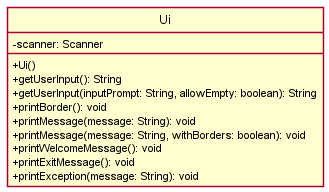
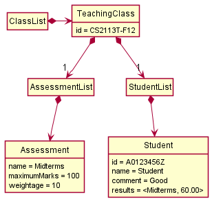
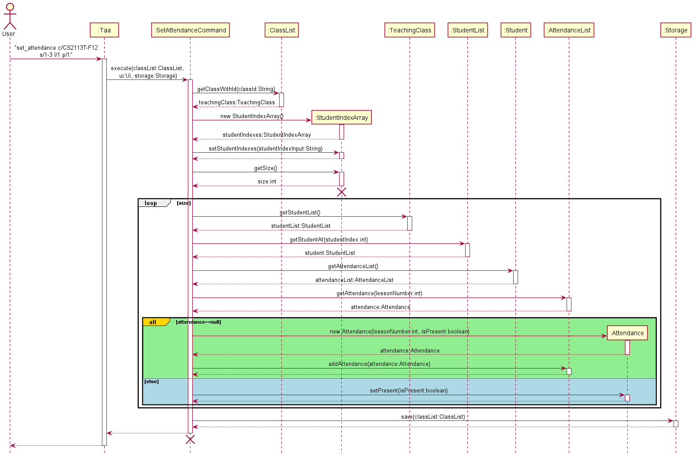

# Developer Guide
* [Acknowledgements](#acknowledgements)
* [Design](#design)
  * [Architecture](#architecture)
  * [Taa Component](#taa-component)
  * [Ui Component](#ui-component)
  * [Parser Component](#parser-component)
  * [Command Component](#command-component)
  * [ClassList Component](#classlist-component)
  * [Util Component](#util-component)
  * [Storage Component](#storage-component)
* [Implementation](#implementation)
  * [Add Class](#add-class)
  * [Add Student](#add-student)
  * [Add Assessment](#add-assessment)
  * [Set Mark](#set-mark)
  * [Set Attendance](#set-attendance)
  * [List Attendance](#list-attendance)
  * [List Lesson Attendance](#list-lesson-attendance)
  * [Delete Attendance](#delete-attendance)
* [Project scope](#product-scope)
* [User Stories](#user-stories)
* [Non-Functional Requirements](#non-functional-requirements)
* [Glossary](#glossary)

## Acknowledgements

List of sources/references:
* [GSON](https://github.com/google/gson/) - Read and write JSON files.
* [Address Book (Level 4)](https://se-education.org/addressbook-level4/) - Provide samples of User Guide (UG) and Developer Guide (DG).

## Design
### Architecture

The _Architecture Diagram_ shown above illustrates the high-level design of the Application.

**Overview of components**
* `Main`
  * On app launch: Creates and runs an instance of `Taa`.
* `Taa`
  * On creation: Initializes the `UI` and `Storage` components.
  * On run: Loads persistent data from `Storage`, receives user input from `UI`, and uses `Parser` to parse the user input.
* `UI`
  * Handles UI operations.
* `Parser`
  * Handles input parsing and determines which command to run.
* `Command`
  * Defines how a command is to be executed.
* `ClassList`
  * Contains a list of `TeachingClass` objects currently being managed by the app.
* `Util`
  * Contains useful methods (e.g. Check if a string is integer/double, convert string to integer/double).
* `Storage`
  * Handles data storage operations (e.g. Reading from and writing to data file).

 

**Interaction between components**

The _Architecture Sequence Diagram_ shown above shows how the components usually interact with each other.

 

### Taa Component

The `Taa` class is the starting point of the application. It stores a `ClassList` object which represents the current
classes that the application is keeping track of. It also initialises the `Ui` and `Storage` objects to handle user
interactions and persistent data storage respectively.

 

### Ui Component

The `Ui` class handles all user interactions in the application.

`Ui` implements the following functionalities:
* Print messages with a standard output format.
* Print exception messages with a standard output format.
* Read user input through the `getUserInput` method.

 

### Parser Component

The `Parser` class provides methods to parse a user input and returns a `Command` object which represents the command that
the user wishes to execute, and verify the validity of a value or provided by the user or read from `Storage`.

`Parser` implements the following functionalities:
* Parse a user input string and returning the respective `Command` object.
* Check if a value is valid (e.g. Does not contain any illegal characters).

 

### Command Component

The `Command` class is an _abstract_ class inherited by other command classes such as `AddClassCommand`, `EditClassCommand`,
`DeleteClassCommand`, `HelpCommand`, etc.

`Command` implements the following functionalities:
* Check the validity of arguments provided by the user through the `checkArgument` method.
* Perform the logic of the command run by the user through the `execute` method.
* Return a string representing the different command usage syntax.

 

### ClassList Component

The `ClassList` class contains data of all classes saved within it. It provides methods to allow other classes to access
the various data within it.

`ClassList` implements the following functionalities:
* Add/Delete `TeachingClass` objects within the list.
* Return all `TeachingClass` objects within the list.

 

### Util Component

The `Util` class provides common utility methods.

`Util` implements the following functionalities:
* Check if string can be converted to `int`, `double`, or `boolean`.
* Create a file (including its parent directories, if necessary).
* Check if file exists.
* Check if path is a file or folder.
* Return the absolute path of given a path.

 

### Storage Component

The `Storage` class handles all data file operations in the application. It depends on the `StorageDeserializer` to
deserialize the data read from the JSON file. `StorageDeserializer` is an _abstract_ class inherited by other deserializer
classes such as `ClassListDeserializer`, `TeachingClassDeserializer`, `StudentListDeserializer`, etc.

`Storage` implements the following functionalities:
* Save `ClassList` into a JSON file.
* Read and parse JSON file into a `ClassList` object.
* Filter out invalid data read from the JSON file.

 

## Implementation
### Add Class
The sequence diagram shown below illustrates how the `add_class` command works:

Below is an example scenario of how the add class feature behaves at each step: 
* Step 1 - The user executes `add_class i/CS2113T-F12 n/Tutorial Group F12` to add a class. The `add_class` command calls the
`AddClassCommand.execute` method.
* Step 2 - Within `AddClassCommand.execute`, `ClassList.getClassWithId("CS2113T-F12")` is called to ensure that
there is no existing class with ID `CS2113T-F12`.
* Step 3 - If no existing class with ID `CS2113T-F12` is found, a new `TeachingClass` object with ID and name set to `CS2113T-F12`
and `Tutorial Group F12` respectively.
* Step 4 - Then, `ClassList.addClass` is called to add the newly created `TeachingClass` object into the `classes` ArrayList
within `ClassList`.

 

### Add Student
The sequence diagram shown below illustrates how the `add_student` command works:

Below is an example scenario of how the add student feature behaves at each step: 
* Step 1 - The user executes `add_student c/CS2113T-F12 i/A0217978J n/Jonny Lims` to add a student. The `add_student` 
  command calls the `AddStudentCommand.execute` method.
* Step 2 - Within `AddStudentCommand.execute`, `ClassList.getClassWithId("CS2113T-F12")` is 
  called to ensure that there is an existing class with ID `CS2113TT-F12`.
* Step 3 - If an existing class with code `CS2113T-F12` is found, a new `Student` object with id and name set to 
  `A0217978J` and `Jonny Lims` respectively.
* Step 4 - Then, `StudentList.addStudent` is called to add the newly created `Student` 
  object into the `students` ArrayList within `StudentList`. Below is an object diagram showing the state after 
  completion of the `add_student` command.

  

 

### Add Assessment
The sequence diagram shown below illustrates how the `add_assessment` command works:

Below is an example scenario of how the add assessment feature behaves at each step:
* Step 1 - The user executes `add_assessment c/cs2113t n/midterms m/20 w/10` to add an assessment. The `add_assessment`
  command calls the `AddAssessmentCommand.execute` method.
* Step 2 - Within `AddAssessmentCommand.execute`, `ClassList.getClassWithId("cs2113t")` is called to ensure that there
  is an existing class with code `cs2113t`.
* Step 3 - If an existing class with code `cs2113t` is found, the `MAXIMUM_MARKS` and `WEIGHTAGE` arguments are checked
  to ensure that they are valid.
* Step 4 - If the `MAXIMUM_MARKS` and `WEIGHTAGE` arguments are valid, a new `Assessment` object with name,
  maximum marks and weightage set to `midterms`, `20` and `10` respectively is created under the existing `TeachingClass` with
  code `cs2113t`. Then, `AssessmentList.addAssessment` is called to add the newly created `Assessment` object into the
  `assessments` ArrayList within `AssessmentList`.
* Step 5 - Within `AssessmentList.addAssessment`, the name of the newly created `Assessment` object is checked to ensure
  there is no existing assessment with name `midterms`. At the same time, the weightage of the newly created
  `Assessment` object is also checked to ensure that the total weightage of the assessments in the `cs2113t` class
  will not exceed 100 with the addition of the weightage of the newly created `Assessment` object.
* Step 6 - If the name and weightage of the newly created `Assessment` object are valid, the newly created `Assessment`
  object is added into the `assessments` ArrayList within `AssessmentList`.

 

### Set Mark
The sequence diagram shown below illustrates how the `set_mark` command works:

Below is an example scenario of how the set mark feature behaves at each step:
* Step 1 - The user executes `set_mark c/CS2113T-F12 s/1 a/Midterms m/60` to set the mark of a student for an assessment.
  The `set_mark` command calls the `SetMarkCommand.execute` method.
* Step 2 - Within `SetMarkCommand.execute`, `ClassList.getClassWithId("CS2113T-F12")` is called to ensure that there
  is an existing class with code `CS2113T-F12`.
* Step 3 - `ClassList.getStudentList` and `ClassList.getAssessmentList` are called to get the respective lists.
* Step 4 - `assessmentList.getAssessment("Midterms")` is called to retrieve the respective `Assessment` object.
* Step 5 - If the `Assessment` object for `Midterms` exists, `studentList.getStudentAt(1)` is to retrieve the `Student` object.
* Step 6 - If the `Student` object exists, `student.setMarks("Midterms", 60)` is called to set the mark of the student
  for `Midterms`. Below is an object diagram showing the state after completion of the set_mark command.

#### Marks storage
The `marks` are stored inside each `Student` object under the `results` HashMap, with the `marks` as a value that is 
mapped by the `assessmentName`. We chose to use this way of storage as the `marks` are unique for each `Student` as well
as each `Assessment`. Special consideration was taken to preserve the `marks` if the `Assessment` had the name changed. 
This means that if an `Assessment` had the name changed from `Midterms` to `OP1`, the `assessmentName` key in the 
`results` HashMap of each `Student` would also follow the change.

Q: Why not use Marks as a separate Class?  
A: The reason is that the HashMap could accomplish the same thing as a separate `Mark` object.  
Detailed here is an alternative implementation using a separate Class to implement `Mark`:  
Creating a `Mark` object to fit our purposes would require creation of a `MarkList` as an attribute in `Student` which 
would store the `Mark` objects in an ArrayList. The `Mark` object would then contain the `assessmentName` as a String 
and `mark` as a double attribute. The `MarkList` would be empty in the beginning and only be populated by 
`SetMarkCommand`, which would create a new`Mark` object when called. To ensure that the same `Assessment` does not have 
two different `Mark` objects, a check would have to be done using a getter function that depends on the `assessmentName`
attribute in `Mark` to retrieve any currently existing objects with the same `assessmentName` as the input. The creation
of the new `Mark` object would only proceed if the getter retrieves a null. In order to have the implementation of 
changing the `assessmentName` whenever an `Assessment` object has its `name` attribute changed, one can simply use the
same getter as above to retrieve the `Mark` object with the old `assessmentName` and call a setter to change it to the
new `assessmentName`.
Included below are an updated Class and Object Diagram showing this implementation.  ClassDiagram: 
   ObjectDiagram: 

 

### Set Attendance
The sequence diagram shown below illustrates how the `set_attendance` command works:

Below is an example scenario of how the set attendance feature behaves at each step:
* Step 1 - The user executes `set_attendance c/CS2113T-F12 s/1-3 l/1 p/1` to set an attendance to `Present` for students 
at index `1-3`, lesson number `1`. The `set_attendance` command calls the `setAttendanceCommand.execute` method.
* Step 2 - The range of student indexes or selected student indexes are transformed into an array of the consisting
student indexes. In this case, a `studentIndexArray` [1,2,3] is set using the `setStudentIndexes` method.
* Step 3a - If no existing attendance object with lesson number `1` for student at index `1` is found, a new 
`attendance` object with lesson number `1` and attendance record `Present` is set as its lesson number and attendance 
record respectively.
* Step 3b - Otherwise, the existing attendance record of the `attendance` object with student at index `1` and lesson 
number `1` is set to `Present`.
* Step 4 - `attendanceList.addAttendance` is called to add the newly created `attendance` object into the `attendances` 
ArrayList within `attendanceList`.
* Step 5 - Steps 2-4 are repeated for each element in the `studentIndexArray`. For our example, steps 2-4 are repeated 
for students at index `2` and `3`.

 

### List Attendance
The sequence diagram shown below illustrates how the `list_attendance` command works:

Below is an example scenario of how the set attendance feature behaves at each step:
* Step 1 - The user executes `list_attendance c/CS2113T-F12 s/1` to list the attendance of student at index `1` for 
different lessons. The `list_attendance` command calls the `listAttendanceCommand.execute` method.
* Step 2 - `classList.getClassWithId` is called to obtain the `teachingClass` object with `classId` `CS2113T-F12`.
* Step 3 - `teachingClass.getStudentList` is called to obtain `studentList` object, containing the ArrayList of students
for the class.
* Step 4 - `studentList.getStudentAt` is called to obtain the `student` object at `studentIndex` `1`.
* Step 5 - `student.getAttendanceList` is called to obtain the `attendanceList` object, containing the ArrayList of 
attendances of different lessons for student at index `1` in `CS2113T-F12` class.

 

### List Lesson Attendance
The sequence diagram shown below illustrates how the `list_lesson_attendance` command works:

Below is an example scenario of how the set attendance feature behaves at each step:
* Step 1 - The user executes `list_lesson_attendance c/CS2113T-F12 l/1` to list the class attendance for lesson number
`1`. The `list_lesson_attendance` command calls the `listLessonAttendanceCommand.execute` method.
* Step 2 - `classList.getClassWithId` is called to obtain the `teachingClass` object with `classId` `CS2113T-F12`.
* Step 3 - `teachingClass.getStudentList` is called to obtain `studentList` object, containing the ArrayList of students
  for the class.
* Step 4 - The constructor `LessonAttendanceList()` is called to create a `lessonAttendanceList` object.
* Step 5 - `lessonAttendanceList.setLessonAttendances` is called to populate an ArrayList in the `lessonAttendanceList` 
object with existing student attendances from class `CS2113T-F12`, lesson number `1`.

 

### Delete Attendance
The sequence diagram shown below illustrates how the `delete_attendance` command works:

Below is an example scenario of how the set attendance feature behaves at each step:
* Step 1 - The user executes `delete_attendance c/CS2113T-F12 s/1-3 l/1` to delete an attendance for students
  at index `1-3`, lesson number `1`. The `delete_attendance` command calls the `deleteAttendanceCommand.execute` method.
* Step 2 - The range of student indexes or selected student indexes are transformed into an array of the consisting
  student indexes. In this case, a `studentIndexArray` [1,2,3] is set using the `setStudentIndexes` method.
* Step 3 - The existing `attendance` object with student at index `1` and lesson number `1` is removed from 
`attendanceList` through the `attendanceList.deleteAttendance` method.
* Step 4 - Steps 2-3 are repeated for each element in the `StudentIndexArray`. For our example, steps 2-4 are repeated
  for students at index `2` and `3`.

 

## Product scope
### Target user profile

* Teaching assistant who has a need to manage a significant number of students and their information.
* Prefers desktop app over other types of apps.
* Can type fast.
* Prefers typing to mouse interactions.
* Reasonably comfortable using CLI apps.

### Value proposition

* Manage student information faster than a typical mouse/GUI driven app.

## User Stories

|Version| As a ... | I want to ... | So that I can ...|
|--------|----------|---------------|------------------|
|v1.0|Teaching Assistant|Add class|Keep track of all the classes that I am teaching|
|v1.0|Teaching Assistant|Add student|Keep track of students taking the class|
|v1.0|Teaching Assistant|Add assessment|Monitor what assessments there are in the class|
|v1.0|Teaching Assistant|Set marks|Record how much marks students score for the assessment|
|v1.0|Teaching Assistant|Set attendance|Monitor the attendance of students|
|v1.0|Teaching Assistant|Calculate the average marks of an assessment|Estimate the capabilities of students|
|v2.0|Teaching Assistant|Edit class|Change class details (e.g. ID and name)|
|v2.0|Teaching Assistant|Delete class|Remove unnecessary data and reduce clutter|
|v2.0|Teaching Assistant|Edit student|Change any student's information|
|v2.0|Teaching Assistant|Delete student|Remove students who are no longer part of the class|
|v2.0|Teaching Assistant|Edit assessment|Change the name or weightage of the assessment|
|v2.0|Teaching Assistant|Delete assessment|Remove a particular assessment from the class|
|v2.0|Teaching Assistant|Edit marks|Modify the marks of the student for a particular assessment|
|v2.0|Teaching Assistant|Delete marks|Remove the marks entry of a student for a particular assessment|
|v2.0|Teaching Assistant|Delete attendance|Remove the attendance entry of a student|

## Non-Functional Requirements
1. Should work on any mainstream OS as long as it has `Java 11` installed.
2. A user with above average typing speed for regular English text (i.e. not code, not system admin commands) should 
be able to accomplish most of the tasks faster using commands than using the mouse.

## Glossary
* Mainstream OS: Windows, Linux, Unix, OS-X
