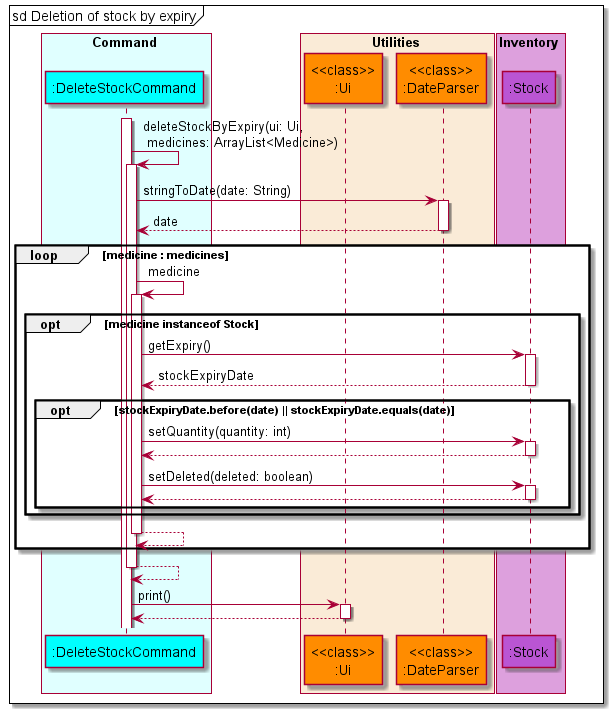
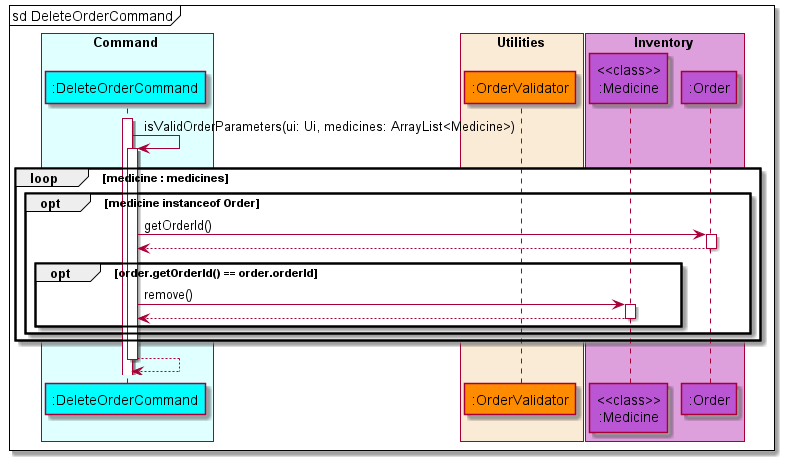

# Developer Guide

## Acknowledgements

{list here sources of all reused/adapted ideas, code, documentation, and third-party libraries -- include links to the
original source as well}

## Design

### Architecture

### Command

### Utilities

{combine ui, storage, parser, comparators?}

### Inventory

### Errors

## Implementation

### Main Logic

The main application logic shows how the commands are handled throughout the application. Below is the outline of the
logic:

* MediVault is called by the `main` method which calls the constructor of MediVault. Data is then loaded from the
  `Storage` class to the application.
* MediVault gets the user input via the `Ui` class and uses the `CommandParser` class to parse the input given by the
  user.
* The parameters will be parsed to a `LinkedHashMap` to make the parameters easily accessible.
* If a valid command is received, the `CommandParser` will call the `Command` object constructor and return the object
  to MediVault.
* MediVault will then invoke the `execute()` function of the `Command` object to execute the command.
* Should there be an invalid command, `CommandParser` will throw `InvalidCommand` and MediVault will display the error
  message using the `Ui` class.

Given below is the sequence diagram for the interactions within the main application logic.

### AddStockCommand

MediVault initialises a AddStockCommand when CommandParser identifies the `addstock` or  `add` in the stock mode.

* MediVault adds medicine stock when the `parameter` and `parameterValues` provided by the user are valid.
* User will not be able to input medication if `max_quantity` is less than `quantity`.
* User will not be able to input medication if the same name exist and the `expiry_date` is same.
* MediVault will ignore the `description` and `max_quantity` of user input if the same medication name already exist.

The sequence diagram for AddStockCommand is shown below.

### AddDispenseCommand

MediVault initialises a AddDispenseCommand when CommandParser identifies the `adddispense` or  `add` in the dispense
mode.

* MediVault adds dispense when the `parameter` and `parameterValues` provided by the user are valid.
* MediVault will update the quantity left in the stock automatically after dispense.
* MediVault will dispense medication with the earliest date if there are medication with multiple expiry date.
* User will not be able to dispense medication if the quantity is more than the total stock quantity.

The sequence diagram for AddDispenseCommand is shown below.

### DeleteStockCommand

MediVault initialises an DeleteStockCommand class when CommandParser identifies the
`deletestock` or the `delete` keyword in the `stock` mode.

* MediVault allow for deletion of stock by stock id through `deletestock i/STOCK_ID`.
* MediVault allow for deletion of stock by expiry date through `deletestock e/EXPIRY_DATE`.
* MediVault delete medicine stock information when parameter and parameterValues provided by the user are valid.
* MediVault perform a check to determine if it is executing deletion by stock id or deletion by expiry and executes
  accordingly.

The sequence diagram for DeleteStockCommand is shown below.

After MediVault determines that it is executing deletion by stock id, it will execute accordingly.

The sequence diagram for deletion by stock id is shown below.

After MediVault determines that it is executing deletion by expiry date, it will execute accordingly.

The sequence diagram for delete by expiry date is shown below.

### DeleteDispenseCommand

MediVault initialises a DeleteDispenseCommand when CommandParser identifies the `deletedispense` or  `delete` in the
dispense mode.

* MediVault delete dispense when the `parameter` and `parameterValues` provided by the user are valid.
* MediVault will delete dispense based on the user input of `DISPENSE_ID`.
* MediVault will add dispense quantity to the stock quantity after successful deletion of dispense.
* User will not be able to delete dispense if the total quantity after dispense will be more than the maximum quantity.

The sequence diagram for DeleteDispenseCommand is shown below.

### DeleteOrderCommand

MediVault initialises a DeleteOrderCommand when CommandParser identifies the `deleteorder` or  `delete` in the order
mode.

* MediVault delete order when the `parameter` and `parameterValues` provided by the user are valid.

The sequence diagram for DeleteOrderCommand is shown below.

### ListCommand

There are three variations of the list command.

1. `liststock`
2. `listdispense`
3. `listorders`

The sequence diagram below shows how the list operation works in general.

Note: Replace `*` in the diagram with `Stock`, `Dispense` or `Order` depending on the command entered.

All three variations of `list` are similar as they are implemented by iterating through the `Medicine` ArrayList and
filtering out the respective object types. If the parameter `sort` or `rsort` is provided, the respective constructor of
the `Comparator` classes will be invoked to help sort the ArrayList. For the rest of the valid command parameters,
MediVault will do a **contains** comparison for strings and **equals** comparison for integers as well as dates except
for `expiring` and `low` parameters where it will do a **less than or equal** comparison. `getAttributeValue()`
represents all the get methods available in each of the respective classes. At the end of the execution the
respective `print()` method from the `Ui` class will be called to display the respective tables.

### UpdateStockCommand

MediVault initialises an UpdateStockCommand class when CommandParser identifies the
`updatestock` or the `update` keyword in the `stock` mode.

* MediVault updates medicine stock information when `parameter` and `parameterValues` provided by the user are valid.
* MediVault conducts another validation check on the provided `quantity`,`max_quantity` and `expiry`
  against the stored medicine stock information.

The sequence diagram for UpdateStockCommand is shown below.

MediVault modifies the `STOCK_ID` when a user tries to update a medicine name. The old record still exists in MediVault,
but it will not be visisble to user when listed. This approach solves the issue when a user is unable to delete a _
dispense_ record when the medicine _stock_ name gets updated.

## Product scope

### Target user profile

* pharmacist handling storing, ordering and dispensing of medication
* has a need to manage large number of stocks in the pharmacy
* may forget how much medicine stock is left in the pharmacy
* is a fast typist

### Value proposition

{Describe the value proposition: what problem does it solve?}

## User Stories

|Version| As a ... | I want to ... | So that I can ...|
|--------|----------|---------------|------------------|
|v1.0|new user|see usage instructions|refer to them when I forget how to use the application|
|v2.0|user|find a to-do item by name|locate a to-do without having to go through the entire list|

## Non-Functional Requirements

{Give non-functional requirements}

## Glossary

* `parameter` - Prefixes for MediVault to understand the type of information user provides.
* `parameter values` - The actual information provided by the user for a given `parameter` type.

## Instructions for manual testing

{Give instructions on how to do a manual product testing e.g., how to load sample data to be used for testing}
