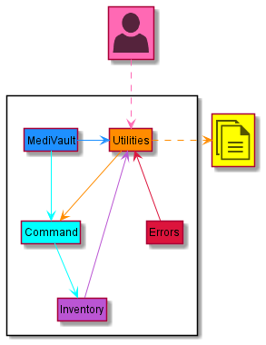

# Developer Guide

## Introduction

MediVault is a Command Line Interface (CLI) application that will help to manage medication supplies within a pharmacy.
It is an integrated solution that provides real-time tracking of stock, orders and prescribing of medication. The
purpose of this guide is to help developers set up and continue with the development of MediVault past version 2.0.

## Acknowledgements

* Inspiration for App Idea and OOP Structure: https://github.com/se-edu/addressbook-level2
* Inspiration for User Guide: https://se-education.org/addressbook-level3/UserGuide.html
* Inspiration for Developer Guide: https://se-education.org/addressbook-level3/DeveloperGuide.html
* PlantUML Tutorial: https://se-education.org/guides/tutorials/plantUml.html

## Contents

* [Glossary](#glossary)
* [Setting up environment](#setting-up-environment)
    * [Setting up](#setting-up)
    * [Before writing code](#before-writing-code)
* [Design](#design)
    * [Architecture](#architecture)
    * [Command](#command)
    * [Utilities](#utilities)
    * [Inventory](#inventory)
    * [Errors](#errors)
* [Implementation](#implementation)
    * [Main Logic](#main-logic)
    * [List Command](#list-command)
    * [Stock Commands](#stock-commands)
        * [AddStockCommand](#addstockcommand)
        * [DeleteStockCommand](#deletestockcommand)
        * [UpdateStockCommand](#updatestockcommand)
    * [Prescription Commands](#prescription-commands)
        * [AddPrescriptionCommand](#addprescriptioncommand)
        * [DeletePrescriptionCommand](#deleteprescriptioncommand)
        * [UpdatePrescriptionCommand](#updateprescriptioncommand)
    * [Order Commands](#order-commands)
        * [AddOrderCommand](#addordercommand)
        * [DeleteOrderCommand](#deleteordercommand)
        * [UpdateOrderCommand](#updateordercommand)
        * [ReceiveOrderCommand](#receiveordercommand)
    * [Archive Commands](#archive-commands)
        * [ArchivePrescriptionCommand](#archiveprescriptioncommand)
        * [ArchiveOrderCommand](#archiveordercommand)
* [Product Scope](#product-scope)
    * [Target user profile](#target-user-profile)
    * [Value proposition](#value-proposition)
* [User Stories](#user-stories)
* [Non-Functional Requirements](#non-functional-requirements)
* [Instructions for manual testing](#instructions-for-manual-testing)

## Glossary

## Setting up environment

### Setting up

### Before writing code

## Design

### Architecture

The **Architecture Diagram** for MediVault is shown below.

A quick overview of the main components and how they interact with each other is given below.

The main class that runs MediVault is called `MediVault`. It is responsible for,
* At program launch: Initializes the components in the correct sequence, and connects them up with each other.
* At shut down: Shuts down the components and invokes cleanup methods where necessary.

The rest of the program consist of four components.
* `Command`: Executes command based on the user input that is processed by `Utilities`
  component. The list of commands can be found in our User Guide [here](UserGuide.md).
* `Utilities`: Contains important driver classes for MediVault
  * includes `parser`, `ui`, `storage` and `comparators`.
* `Inventory`: Contains a collection of classes used by MediVault to represent
different medication information.
* `Errors`: Contains collection of classes that handles exceptions during execution of MediVault.
### Command

The **Command** class diagram above shows how **Command** interact with other classes in MediVault.

The Command Component consists of **18** subclasses where each subclass represents a command feature.

Let `*` be either of the three class: `Stock`, `Prescription` or `Order`.

* `Add*Command`: Adds a new `*` information into MediVault.
* `Delete*Command`: Removes the visibility of the `*` record in MediVault.
* `Update*Command`: Updates the `*` information.
* `List*Command`: Lists the `*` records.
* `ReceiveOrderCommand`: Marks an order as received and adds the ordered medication into the current stocks.
* `ArchivePresciptionCommand`: Archives all the prescription records before a given date.
* `ArchiveOrderCommand`: Archives all the order records before a given date.
* `PurgeCommand`: Wipes all records in MediVault.
* `HelpCommand`: Shows the help page.
* `ExitCommand`: Exits MediVault.

### Utilities

The class diagram below shows how the validator classes is implemented to help ensure that the user input is
valid. `StockValidator`, `PrescriptionValidator` and `OrderValidator` inherits from `MedicineValidator`. The class
methods are also shown in the diagram.

### Inventory

The class diagram below shows how the objects in MediVault is implemented. `Stock`, `Prescription`
and `Order` inherits from the abstract `Medicine` class. The attributes that each object has is also shown in the
diagram.

### Errors

- `InvalidCommandException` will be thrown when the user enters an invalid command.
- `InvalidDataException` will be thrown when MediVault encountered invalid data in the data files.

## Implementation

### Main Logic

The main application logic shows how the commands are handled throughout the application. Below is the outline of the
logic:

* MediVault is called by the `main` method which calls the constructor of MediVault. Data is then loaded from the
  `Storage` class to the application.
* MediVault gets the user input via the `Ui` class and uses the `CommandParser` class to parse the input given by the
  user.
* The parameters will be parsed to a `LinkedHashMap<String, String>` to make the parameters easily accessible.
* If a valid command is received, the `CommandParser` will call the `Command` object constructor and return the object
  to MediVault.
* MediVault will then invoke the `execute()` function of the `Command` object to execute the command.

> :warning: Warning
> * Should there be an invalid command, `CommandParser` will throw `InvalidCommandException` and MediVault will display the error message using the `Ui` class.

Given below is the sequence diagram for the interactions within the main application logic.

### List Command

There are three variations of the list command.

1. `liststock`
2. `listprescription`
3. `listorders`

The sequence diagram below shows how the `list` operation works in general.

> :information_source: Replace `*` in the diagram with `Stock`, `Prescription` or `Order` depending on the command entered.

* All three variations of `list` are similar as they are implemented by iterating through the `Medicine` ArrayList and
  filtering out the respective object types.
* If the parameter `sort` or `rsort` is provided, the respective constructor of the `Comparator` classes will be invoked
  to help sort the ArrayList.
* For the rest of the valid command parameters, MediVault will do a **contains** comparison for strings and **equals**
  comparison for integers as well as dates except for `expiring` and `low` parameters where it will do a **less than or
  equal** comparison.
* `getAttributeValue()` represents all the get methods available in each of the respective classes. At the end of the
  execution the respective `print()` method from the `Ui` class will be called to display the respective tables.

### Stock Commands

#### AddStockCommand

#### DeleteStockCommand

#### UpdateStockCommand

MediVault creates an `UpdateStockCommand` object when CommandParser identifies `updatestock` or
the `update` keyword in `stock` mode.
> :information_source: Note:
> * MediVault checks if `parameters` and `parameterValues` provided by the user are valid.
> * MediVault conducts another validation check on the provided `quantity`,`max_quantity` and `expiry`
against the stored medicine stock information.

The sequence diagram for `UpdateStockCommand` is shown below.

MediVault adds a new stock record when a user updates contains the `n/NAME` parameter. The old stock record still
exists in MediVault, but it will not be visible to user when listed. This approach solves the issue when a user is
unable to delete a prescription record when the medicine stock name gets updated.

### Prescription Commands

#### AddPrescriptionCommand

#### DeletePrescriptionCommand

#### UpdatePrescriptionCommand

MediVault initialises an `UpdatePrescriptionCommand` class when CommandParser identifies
`updateprescription` or the `update` keyword in `prescription` mode.

> :information_source: Note
> * MediVault checks if the `parameters` and `parameterValues` provided by the user are valid.
> * When a user updates prescription information containing either `n/NAME`, `q/QUANTITY` or both, MediVault restores the 
prescribed stocks or prescribes more stocks depending on the user input.

The sequence diagram for `UpdatePrescriptionCommand` is shown below.

MediVault adds a new prescription record when a user updates contains either the `n/NAME`, `q/QUANTITY`
parameter or both. The old prescription record is **permanently removed** from MediVault. 

This approach solves the issue when a medication is prescribed to a user with an amount that is 
**more than** the current batch of stock with the same Stock ID but **less than** the total 
stock quantity. 
> :bulb: MediVault automatically adds new prescription records when a medication is prescribed
> from stocks with different Stock IDs.

### Order Commands

#### AddOrderCommand

#### DeleteOrderCommand

#### UpdateOrderCommand

MediVault initialises an `UpdateOrderCommand` class when CommandParser identifies
`updateorder` or the `update` keyword in `order` mode.

> :information_source: Note:
> * MediVault checks if the `parameters` and `parameterValues` provided by the user are valid.
> * MediVault restricts updating of order information that are already **delivered**.

The sequence diagram for UpdateOrderCommand is shown below.

### ReceiveOrderCommand

### Archive Commands

#### ArchivePrescriptionCommand

#### ArchiveOrderCommand

## Product Scope

### Target user profile

* Pharmacist handling storing, ordering and dispensing of medication
* Has a need to manage large number of stocks in the pharmacy
* May forget how much medicine stock is left in the pharmacy
* Is a fast typist

### Value proposition

{Describe the value proposition: what problem does it solve?}

## User Stories

|Version| As a ... | I want to ... | So that I can ...|
|--------|----------|---------------|------------------|
|v1.0|pharmacist|list out all of the medicines currently on shelf| know the current quantity of the medicines on shelf
|v1.0|manager|be able to purge all data|start afresh
|v1.0|user|be able to exit the program|shutdown my computer
|v1.0|pharmacist|list the price of each medication| am aware of the price of each medication
|v1.0|pharmacist| be able to sort medication by price|recommend the customer the cheapest one if he asks
|v2.0|manager|see the pending orders to reflect in my current stocks|I won't double order on the same medication
|v2.0|pharmacist|search for records by a specific customer|I can see all his prescriptions
|v2.0|manager|be able to check who dispense what medication|know who is responsible for the prescription

## Non-Functional Requirements

{Give non-functional requirements}

## Instructions for manual testing

{Give instructions on how to do a manual product testing e.g., how to load sample data to be used for testing}