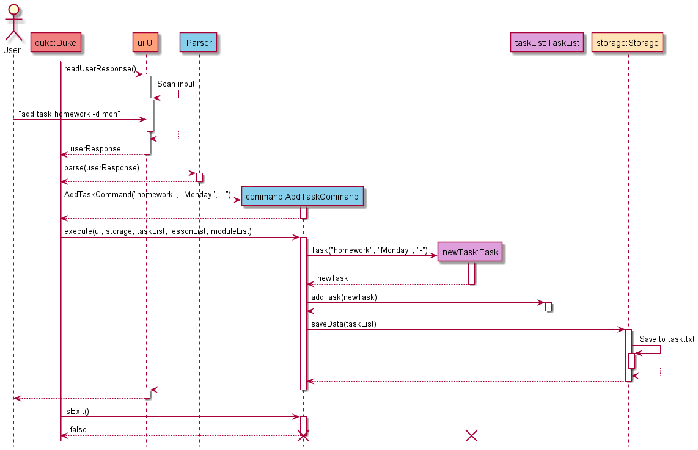
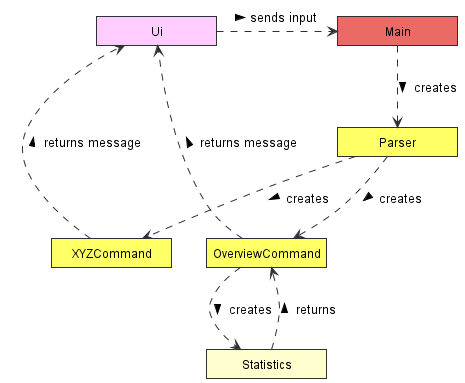

# Developer Guide

## Table of contents

* [Acknowledgements](#acknowledgements)
* [Setting up, getting started](#setting-up-getting-started)
* [Design](#design)
    * [Architecture](#architecture)
    * [UI component](#ui-component)
    * [Logic component](#logic-component)
    * [Model component](#model-component)
    * [Storage component](#storage-component)
    * [Common classes](#common-classes)
* [Documentation, logging, testing](#documentation-logging-testing)
    * [Documentation](#documentation)
    * [Logging](#logging)
    * [Testing](#testing) 
* [Implementation](#implementation)
    * [Saving data](#saving-data)
    * [Loading data](#loading-data)
    * [Save file formatting](#save-file-formatting)
* [Appendix: Requirements](#appendix-requirements)
    * [Product scope](#product-scope)
    * [User stories](#user-stories)
    * [Non-Functional Requirements](#non-functional-requirements)
    * [Glossary](#glossary)
* [Appendix: Instructions for manual testing](#appendix-instructions-for-manual-testing)
  * [Testing commands for tasks](#testing-commands-for-tasks)
  * [Testing commands for lessons](#testing-commands-for-lessons)
  * [Testing commands for modules](#testing-commands-for-modules)

## Acknowledgements

The documentation and class organization of this project is done with some reference to the [AB-3 repository](https://github.com/se-edu/addressbook-level3).

## Setting up, getting started

Prerequisites: JDK 11 (use the exact version), update Intellij to the most recent version.

1. **Ensure Intellij JDK 11 is defined as an SDK**, as described [here](https://www.jetbrains.com/help/idea/sdk.html#set-up-jdk) -- this step is not needed if you have used JDK 11 in a previous Intellij project.
  * In the same dialog, you _may_ have to set the Project language level field to the SDK default option.

2. **Import the project _as a Gradle project_**, as described [here](https://se-education.org/guides/tutorials/intellijImportGradleProject.html).


3. **Verify the setup**: After the importing is complete, locate the `src/main/java/seedu/duke/Duke.java` file, right-click it, and choose `Run Duke.main()`. If the setup is correct, you should see something like the below:

```
> Task :compileJava UP-TO-DATE
> Task :processResources UP-TO-DATE
> Task :classes UP-TO-DATE

> Task :Duke.main()
    _______________________________________________________________________________
     I can't retrieve the saved task data. Creating new file..
    _______________________________________________________________________________

    _______________________________________________________________________________
     I can't retrieve the saved lesson data. Creating new file..
    _______________________________________________________________________________

    _______________________________________________________________________________
     I can't retrieve the saved module data. Creating new file..
    _______________________________________________________________________________

    _______________________________________________________________________________
       _   _       _   _   ____           ____     _   _   ____     ____   __   __ 
      | \ |"|   U |"|u| | / __"| u     U | __")uU |"|u| | |  _"\   |  _"\  \ \ / / 
     <|  \| |>   \| |\| |<\___ \/       \|  _ \/ \| |\| |/| | | | /| | | |  \ V /  
     U| |\  |u    | |_| | u___) |        | |_) |  | |_| |U| |_| |\U| |_| |\U_|"|_u 
      |_| \_|    <<\___/  |____/>>       |____/  <<\___/  |____/ u |____/ u  |_|   
      ||   \\,-.(__) )(    )(  (__)     _|| \\_ (__) )(    |||_     |||_ .-,//|(_  
      (_")  (_/     (__)  (__)         (__) (__)    (__)  (__)_)   (__)_) \_) (__) 
    _______________________________________________________________________________

```

Follow [this guide](https://se-education.org/guides/tutorials/intellijCodeStyle.html) to set up Intellij IDEA to the coding style that matches ours.

## Design

### Architecture


The **Architecture Diagram** given above explains the high-level design of the App.

> 📝 **Note:** `DukeException` class is not shown in the diagram for simplicity's sake.

Given below is a quick overview of main components and how they interact with each other.

**Main components of the architecture**

`Main` has two classes called `Duke` and `DukeException`.

`Duke` is responsible for:
* **At app launch:** Initializes the components in the correct sequence, and connects them up with each other.
* **At shut down:** Shuts down the components and invokes cleanup methods where necessary.

`DukeException` is responsible for:
* Manages Duke-related exceptions.

`Commons` represents a collection of classes used by multiple other components.

The rest of the App consists of four components.
* `UI`: The UI of the App.
* `Logic`: The parser and command executor.
* `Model`: Holds the various data structures of the App.
* `Storage`: Reads data from, and writes data to, the hard disk.

**How the architecture components interact with each other**

The **Sequence Diagram** below shows how the components interact with each other for the scenario where the 
user issues the command `add task homework -d mon`.



### UI component
**API** : [`Ui.java`](https://github.com/AY2122S1-CS2113T-W11-3/tp/blob/master/src/main/java/seedu/duke/ui/Ui.java)

The `Ui` component contains:
* the method `readUserResponse()` to read from the standard input.
* methods to print messages as strings to the standard output.
* constant strings, such as `LINE` and `PADDING`, which are used to format the printed messages.

The methods in the `Ui` component may call methods from `TaskList`, `LessonList` or `ModuleList` to get information from the respective components.



#### Printing tasks containing a keyword:


### Logic component

Here is the class diagram of the `Logic` component:


> 📝 **Note:** XYZ is a placeholder for specific command name (e.g., AddModuleCommand).

How the `Logic` component works:

* When `Logic` is called upon to execute a command, it uses the `Parser` class to parse the user command.
* This results in a `Command` object (more precisely, an object of one of its subclasses e.g., 
  AddModuleCommand) which is then executed.
* The `Command` can communicate with the `Model` class when it is executed (e.g. to add a module).
* If the operations above are successful, the `Command` will save the `Model` data by using the `Storage` class.
* The result is then printed to user by the `Ui` class.

### Model component

The `model` package consists of three components: `Lesson`, `Task` and `Module`.

#### Lesson component

**API** : [`Lesson.java`](https://github.com/AY2122S1-CS2113T-W11-3/tp/blob/master/src/main/java/seedu/duke/model/lesson/Lesson.java)


The `Lesson` component
* stores data specific to a lesson as entered by the user 
* stores all `Lesson` objects created by user commands in a `LessonList` object
* does not depend on any of the other three components

#### Module component

**API** [`Module.java`](https://github.com/AY2122S1-CS2113T-W11-3/tp/blob/master/src/main/java/seedu/duke/model/module/Module.java)


The `Module` component,
* stores information regarding modules added by the user and on the NUSMods API
* does not depend on any of the other three components
* `FullModuleList` stores all `Module` objects corresponding to the modules found on NUSMods
* `ModuleList` stores all user-added `Module` objects

#### Task Component

**API** [`Task.java`](https://github.com/AY2122S1-CS2113T-W11-3/tp/blob/master/src/main/java/seedu/duke/model/task/Task.java)


The `Task` component,
* stores data specific to a task as entered by the user
* stores all `Task` objects as created by user commands in a `TaskList` object
* does not depend on any of the other three components

### Storage component

**API** : [`Storage.java`](https://github.com/AY2122S1-CS2113T-W11-3/tp/blob/master/src/main/java/seedu/duke/storage/Storage.java)  

The `Storage` component makes use of the serializing methods in the `TaskList`, `LessonList`, and `ModuleList` classes to save data to the `data` folder.
It also reads data from a given path into strings which can be utilized by those 3 list classes to create a list.

The `Storage` component has methods that:
* create the files `task.txt`, `lesson.txt`, `module.txt` in the `data` folder.
* load data from the file in the given path into an array of strings representing each line of data.
* save data of a given list by overwriting the respective file in the `data` folder with serialized data.

The following sequence diagrams show how task data is [saved](#saving-data) and [loaded](#loading-data) using the Storage class.

### Common classes

The ["Commons" folder](https://github.com/AY2122S1-CS2113T-W11-3/tp/tree/master/src/main/java/seedu/duke/commons) stores classes that assist in the functioning of the various features of the application.

#### Core

* The `CommandFlag` class 
  * stores string constants representing flags to be used in user inputs.


* The `CommandFormat` class 
  * stores string constants representing formats for user commands. 
  * provides a method that creates a ready-to-print string that suggests selected command formats for the user.


* The `CommandType` class 
  * stores enumerations for command types. 
  * provides a method to convert a command word into a `CommandType`.


* The `DayOfTheWeek` class 
  * stores enumerations for the Day of the Week. 
  * provides methods to check the validity of a Day of the Week input and convert it into a `DayOfTheWeek`.


* The `Grade` class 
  * stores a predefined array of possible grades.
  * provides a method to check the validity of a Grade input.


* The `Messages` class 
  * stores string constants for simple success and error messages to be printed to users. (usually 1 liners)


* The `Priority` class 
  * stores enumerations for task priority. 
  * provides methods to check the validity of a priority input and convert it into a `Priority`.
  
#### Utility

* The `DayUtil` class contains utility methods that makes use of the `DayOfTheWeek` variable of a class.


* The `JsonUtil` class contains utility methods that make use of the `ModuleInfo.Json` file.


* The `LinkUtil` class contains utility methods that help in launching URLs.


* The `StringUtil` class contains utility methods that manipulates strings.


* The `TimeUtil` class contains utility methods that are related to Time.

## Documentation, logging, testing

### Documentation

**Style Guidance:**

* [Java Coding Standard](https://se-education.org/guides/conventions/java/basic.html)
* [Markdown Coding Standard](https://se-education.org/guides/conventions/markdown.html)

**Diagrams:**

For our developer guide diagrams, we use PlantUML. Here is a [guide](https://se-education.org/guides/tutorials/plantUml.html) on how to set it up on Intellij.

### Logging

Logging was performed to record whether Duke is initializing properly.
Admittedly, this could be improved to record some of the more important operations.
Implementation-wise, the current logging is designed to be scalable following [AB-3](https://github.com/se-edu/addressbook-level3).

### Testing

This project has various tests that deal with different components and features of the application.
The predominant types of test used for this project are Unit and Hybrid (Unit+Integration) tests.

#### Running Tests

* Method 1: Using the Intellij JUnit test runner
  * Right-click on the `src/test/java folder` and choose `Run 'All Tests'`
  * To run only selected, right-click on the class or package and choose `Run 'TEST_NAME'`

* Method 2: Using Gradle
  * Open a console and run the command `gradlew clean test` (Mac/Linux: `./gradlew clean test`)

## Implementation

### Saving data


1. The path is determined based on the class type of the list given when calling the function.
2. A FileWriter is created and subsequently used to create a BufferedWriter that points to the path.
3. A taskList is called to return the serialized data of the list.
4. BufferedWriter is used to write the serialized data into the location of the path.
5. BufferedWriter is closed and the function subsequently returns.

### Loading data


1. A FileReader is created and subsequently used to create a BufferedReader that points to the given path.
2. An ArrayList of Strings is created.
3. BufferedReader is used to read each line of data from the path and stored into the ArrayList. (with each item in the array representing 1 line in the file)
4. BufferedReader is closed and the function returns the ArrayList containing the read data.

### Save file formatting

Data for user added tasks, lessons and modules are stored in the `task.txt`, `lesson.txt` and `module.txt` files in the data folder respectively.

The format of the save files are as follows:

#### Tasks:

```text
[Completion status] | [Task title] | [Day of the week] | [Priority] | [Information]
```

* `Completion status`: "0" when not marked as done, "1" when marked as done.
* `Task title`: The full title of the task.
* `Day of the week`: The day of the week in full.
* `Priority`: The priority in caps. Possible priorities are low, medium and high.
* `Information`: The user given information for the task.

Example: `1 | CS2113 tP | Thursday | HIGH | Do Dev Guide`

#### Lessons:

```text
[Lesson title] | [Day of the week] | [Start time] | [End time] | [Lesson URL]
```

* `Lesson title`: The full title of the lesson.
* `Day of the week`: The day of the week in full.
* `Start time`: The start time of the lesson. In `HH:MM AM/PM` format.
* `End time`: The end time of the lesson. In `HH:MM AM/PM` format.
* `Lesson URL`: The user given lesson url.

Example: `CS2113 Tutorial | Friday | 02:00 PM | 04:00 PM | www.google.com`

#### Modules:

```text
[Module code] | [Module title] | [Number of MCs] | [Grade]
```

* `Module code`: The module code of the module.
* `Module title`: The title of the module.
* `Number of MCs`: The number of modular credits of the module
* `Grade`: The grade assigned to the module.

Example: `CS2113T | Software Engineering & Object-Oriented Programming | 4 | A-`

Only a minimalist version of the module information is stored in the save file. 
This is because the full module information can be very detailed and lengthy, which would be impractical to be stored in full here.
Hence, only the regularly used information for running the app is stored here.

Instead, detailed full module information will only be retrieved from the `ModuleInfo.json` file directly when needed.

## Appendix: Requirements

### Product scope

**Target Users:** 

NUS undergraduate students who prefer using a CLI application over GUI to manage their undergraduate activities and education.

**Needs of users:**

* Quickly manage and record tasks, lessons and modules
* Get module information of modules on demand

### User stories

|Version| As a ... | I want to ... | So that I can ...|
|--------|----------|---------------|------------------|
|v1.0|user|add a task|keep track of my tasks|
|v1.0|student|add a lesson|keep track of my lessons|
|v1.0|user|list out tasks and lessons|see all my tasks and lessons|
|v1.0|user|mark a task a done|keep track of completed tasks|
|v1.0|user|delete tasks/lessons|keep my agenda clean|
|v1.0|user|delete all tasks/lessons|quickly clear my agenda|
|v1.0|user|store tasks/lessons in file(s)|retain data beyond the current instance|
|v1.0|user|find tasks/lessons by keyword|quickly locate relevant information about tasks or lessons|
|v2.0|user|attach priority to my tasks|see which tasks are of greater importance|
|v2.0|NUS student|add/delete modules|keep track of my semester|
|v2.0|NUS student|list out all the modules that I have with only the basic information|see all my modules with key information at a glance|
|v2.0|NUS student|list out all the modules that I have with detailed information|see all my modules in detail|
|v2.0|NUS student|search and browse for modules|look up for detailed information regarding a known module quickly|
|v2.0|student|save and launch URLs for my lessons|quickly open my lesson URLs|
|v2.0|student|see all my tasks/lessons for today or tomorrow|quickly see work that are upcoming soon|
|v2.0|user|see all the commands the app offers|not have to constantly refer to the user guide|
|v2.0|user|sort my task in order of importance|see the important ones first|
|v2.0|NUS student|be able to keep track of my CAP score|gauge my current undergraduate performance|

### Non-Functional Requirements

* The application should work on the major operating systems (Windows, Mac and Linux) if it has Java 11 installed.
* The application should be able to perform each command within 1 second.
* The application should allow users who are comfortable with typing to perform tasks faster than with on an application with a GUI.

### Glossary

CLI: Command Line Interface

GUI: Graphical User Interface

## Appendix: Instructions for manual testing

* [Testing commands for tasks](#testing-commands-for-tasks)
* [Testing commands for lessons](#testing-commands-for-lessons)
* [Testing commands for modules](#testing-commands-for-modules)

### Testing commands for tasks

#### Adding a task

Test case: `add task CS2113T assignment -d tue -i add feature -p low`

Expected output: The task is successfully added and a message with the added task is displayed.

#### Adding a task without required flags

Test case: `add task CS2113T assignment`

Expected output: A message is displayed about missing flags in the input.

#### Adding a task with empty title

Test case: `add task -d tue -i add feature`

Expected output: A message is displayed that the title cannot be blank.

#### Listing all tasks

Test case: `list task`

Expected output: The full list of tasks is displayed.

#### Listing tasks sorted by priority

Test case: `list task priority`

Expected output: The full list of tasks is displayed, sorted according to the priority assigned for each task (HIGH, MEDIUM or LOW).

#### Listing tasks on a day of the week

Test case: `list task tue`

Expected output: A list of tasks on Tuesday is displayed.

#### Listing tasks with invalid day of the week

Test case: `list task t`

Expected output: A message is displayed stating that the wrong format is used for the command.

#### Finding tasks with keyword

Test case: `find task assignment`

Expected output: A message is displayed with the tasks that contain the keyword.

#### Finding tasks with empty keyword

Test case: `find task`

Expected output: A message is displayed stating that the wrong format is used for the command.

#### Marking a task as done

Test case: `done task 1`

Expected output: The task is successfully marked as done and a message with the task marked as done is displayed.

#### Marking a task with invalid index

Test case: `done task 0`

Expected output: A message is displayed stating that the index of the task entered is invalid.

#### Marking a task with an index that is not a number

Test case: `done task m`

Expected output: A message is displayed stating that the index of the task entered is not a number.

#### Deleting a task

Test case: `delete task 1`

Expected output: The task is successfully deleted and a message with the deleted task is displayed.

#### Deleting a non-existent task

Test case: `delete task 0`

Expected output: A message is displayed stating that the index of the task entered is invalid.

#### Deleting a task with an index that is not a number

Test case: `delete task m`

Expected output: A message is displayed stating that the index of the task entered is not a number.

### Testing commands for lessons

#### Adding a lesson

Test case: `add lesson CS2113T tutorial -d wed -s 11:00 -e 12:00 -l zoom.us/a19b3jkdjk93`

Expected output: The lesson is successfully added and a message with the added lesson is displayed.

#### Adding a lesson without required flags

Test case: `add lesson CS2113T tutorial`

Expected output: A message is displayed about missing flags in the input.

#### Adding a lesson with empty title

Test case: `add lesson -d mon -s 11:00 -e 12:00`

Expected output: A message is displayed that the title cannot be blank.

#### Listing lessons

Test case: `list lesson`

Expected output: The full list of lessons is displayed.

#### Listing lessons on a day of the week

Test case: `list lesson wed`

Expected output: A list of lessons on Wednesday is displayed. 

#### Finding lessons with keyword

Test case: `find lesson tutorial`

Expected output: A message is displayed with the lessons that contain the keyword.

#### Finding lessons with empty keyword

Test case: `find lesson`

Expected output: A message is displayed stating that the wrong format is used for the command.

#### Deleting a lesson

Test case: `delete lesson 1`

Expected output: The lesson is successfully deleted and a message with the deleted lesson is displayed.

#### Deleting a non-existent lesson

Test case: `delete lesson 0`

Expected output: A message is displayed stating that the index of the lesson entered is invalid.

#### Deleting a lesson with an index that is not a number

Test case: `delete lesson m`

Expected output: A message is displayed stating that the index of the lesson entered is not a number.

#### Launching a lesson with a URL

Test case: `launch lesson 1`

Expected output: The lesson's URL is launched in a browser if it exists. Otherwise, a message is displayed stating that no link is provided.

### Testing commands for modules

#### Adding a module

Test case: `add module CS2113T`

Expected output: The module is successfully added and a message with the added module is displayed.

#### Adding a module that is already in the list

Test case: `add module CS2113T`, then `add module CS2113T` again

Expected output: When attempting to add the module a second time, a message stating that the module has already been added is displayed.

#### Adding a module with an invalid module code

Test case: `add module CS211`

Expected output: A message stating that the module does not exist is displayed.

#### Listing modules

Test case: `list module`

Expected output: A list of all modules added is displayed.

#### Listing modules with details

Test case: `list module verbose`

Expected output: A list of all modules and their details is displayed.

#### Finding information for a module

Test case: `find module CS2113T`

Expected output: The module is successfully added and a message with information for the module is displayed.

#### Finding information for a module with an invalid module code

Test case: `find module CS211`

Expected output: A message stating that the module does not exist is displayed.

#### Deleting a module

Test case: `delete module CS2113T`

Expected output: The module is successfully deleted and a message with information for the module is displayed.

#### Deleting a module with invalid code or a module not in the list

Test case: `delete module CS123`

Expected output: A message is displayed stating that the module is not in the list.
