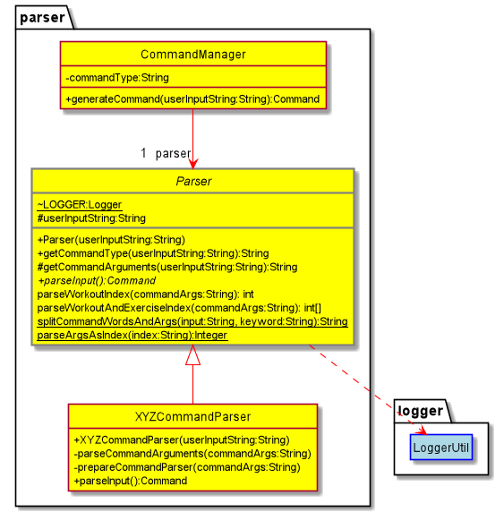
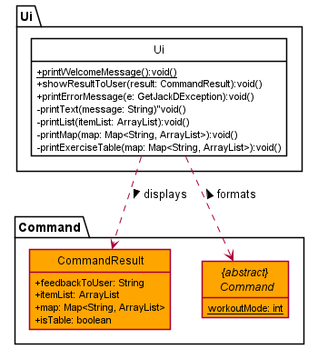

# Developer Guide

- [Acknowledgements](#acknowledgements)
- [Design & Implementation](#design--implementation)
  - [Data Component](#data-component)
  - [Storage Component](#storage-component)
  - [Command Component](#command-component)
  - [Command Manager Component](#parser--commandmanager-component)
- [Logging & Documentation](#logging--documentation)
- [Appendix A: Product Scope](#appendix-a-product-scope)
  - [Target User Profile](#target-user-profile)
  - [Value Proposition](#value-proposition)
- [Appendix B: User Stories](#appendix-b-user-stories)
- [Appendix C: Non-Functional Requirements](#appendix-c-non-functional-requirements)
- [Appendix D: Glossary](#appendix-d-glossary)
- [Appendix E: Instructions for manual testing](#appendix-e-instructions-for-manual-testing)
    - [Launch and Shutdown](#launch-and-shutdown)
    - [Saving data](#saving-data)

## Acknowledgements

- Libraries used: [Jackson](https://github.com/FasterXML/jackson), [JUnit5](https://github.com/junit-team/junit5), [Ascii Table](https://mvnrepository.com/artifact/de.vandermeer/asciitable)

## Design & implementation

### Basic Architecture

__Note:__ Lines in this diagram denote that the component has references to most classes inside the component the arrow
is pointing towards, whereas dotted lines denote dependencies.
* `Ui` : In charge of reading user input and printing the results on the terminal.
* `Main` : Main of whole application.
* `Storage` : In charge of storing and loading user data from the json file.
* `Data` : Contains data of all workouts the user has added.
* `Parser` : Parses user input and returns Command object.
* `Command` : Holds all information related to a type of command and can be executed.
* `Logger` : Contains method to set up the logger for each class.
* `Exceptions` : Contains all specialized exceptions created for this application.

The `Main` component is run by`GetJackd.java` while the rest of the components are run by the respective classes
inside their packages.

Basic sequence of events:
1. User inputs data which is read by `Ui` inside `Main`
2. `Main` passes the input to  `Parser` which returns a `Command`
3. The `Command` is executed.
   * If the command edits the `Data` component (e.g. create a Workout) then `Storage` reflects the changes
     in the json file.
4. `Ui` acknowledges the command and shows the result of the Command if any.

Below is a high-level sequence diagram showing the `create` Command

**`showResultToUser(CommandResult)`

### Data Component

Location : `seedu.duke.data`

__Note:__
* `WorkoutList` : List of all Workout Routines.
* `Workout` : A specific Workout Routine e.g. "Leg day" could be a routine created for exercises that focus on legs.
* `DeadlineWorkout` : Workout with a deadline attached to it.
* `Exercise` : A specific exercise eg. "Squats" could be an exercise added to "Leg day." 

The `data` component defines the format in which data is temporarily stored while the application is running.
As seen in the figure above, the highest level of abstraction is the `WorkoutList` which stores all the workout routines
that the user has currently stored. Next, the `Workout` refers to a Workout Routine and stores a variable number of 
exercises (in the form of an `Exercise` object). Lastly, `Exercise` stores the exercise with attributes:
* `description` corresponding to the name of the exercise.
* `reps` corresponding to the number of times the exercise is done in a given set.
* `sets` corresponding to the number of times the whole exercise is repeated.

__Storage.models__: `addToWorkoutListModel(WorkoutModel workout)` and `addToWorkoutModel(ExerciseModel exercise)` from the `storage.models` component
are called in the methods of `Workout` and `Exercise` respectively. This causes the dependency on `WorkoutModel` and `WorkoutListModel` as seen in the UML Diagram.
These methods are required to convert the current `WorkoutList` into a `WorkoutListModel` which can then be easily converted
into a json String with the help of a `ObjectMapper` from the [Jackson](https://github.com/FasterXML/jackson) Library.
Below is a sequence diagram showing how this all happens:

1. First `convertAllWorkoutsToStorageModel()` is called when the whole `WorkoutList` is to be converted into its model counterpart.
   1. For each `Workout` in the `WorkoutList`, its `convertToWorkoutStorageModel()` method is called.
   2. In this method a new `WorkoutModel` is created which acts as the model counterpart for this `Workout` object.
      1. For each `Exercise` in this `Workout` object, its `convertToExerciseStorageModel(WorkoutModel)` is called.
      2. In this method a new `ExerciseModel` is created which acts as the model counterpart for this `Exercise` object.
      3. Each `ExerciseModel` created this way is added to the `WorkoutModel`.
   3. Each `WorkoutModel` created this way is added to the `WorkoutListModel`.
2. Once all `Workout` objects are converted to `WorkoutModel` objects, the `WorkoutListModel` has all the data which was in 
   the `WorkoutList` and now can be converted into a json String to be stored in the json File.

### Storage Component

Location: `seedu.duke.storage`

__Note:__
* `Storage` : Deals with loading tasks from the json file and saving tasks in the json file.
* `JsonUtil` : Handles functions required to convert Java Objects to JSON objects and vice versa using the Jackson Library.

The `Storage` component,
- can save workout list data in json format, and read them back into corresponding Java objects.
- depends on some classes in the `Models` component within Storage (because the Storage component can only save/retrieve objects that belong to the Model).

### Command Component

Location : `seedu.duke.command`

__Note:__

* `Command` : Deals with executing user commands on `workout` and `workoutList`.
* `XYZExerciseCommand` are child classes which inherit from the `Command` class and implement/execute exercise related
commands.
* `XYZWorkoutCommand` are child classes which inherit from the `Command` class and implement/execute workout related
commands.
* `XYZCommand` are child classes which inherit from the `Command` class and implement/execute miscellaneous commands.

`ExitCommand` is also one of the commands that checks whether the command called from `main()` is an exitCommand or not.

Exercise commands
* `AddExerciseCommand` : To add a new exercise to a workout.
* `DisplayExerciseCommand` : To display all the exercises in a workout.
* `MarkExerciseAsDoneCommand` : To mark an exercise of a user given index as completed in a workout. 
* `RemoveExerciseCommand` : To remove an exercise from the workout based on user given indices.
* `EditExerciseCommand` : To edit an exercise in a workout based on user given indices.

Workout commands
* `CreateWorkoutCommand` : To create a new workout.
* `DeleteWorkoutCommand` : To delete an existing workout.
* `EnterWorkoutCommand` : To enter inside a workout in order to make necessary changes pertaining to that workout.
* `ExitWorkoutCommand` : To exit from a workout to the main page.
* `ListWorkoutsCommand` : To list all the workouts.
* `RecommendWorkoutCommand` : To suggest pre-set workouts based on user given difficulty level.

Miscellaneous commands
* `ClearCommand` : To clear all the exercises in a workout or all the workouts.
* `HelpCommand` : To display the help message for a particular command when typed incorrectly.
* `IncorrectCommand` : To show error message when command is invalid.
* `SearchCommand` : To list all workouts or exercises matching the keyword.

The basic `Command` parent class mainly has a method to execute necessary actions involving the `workout` 
and `workoutList`, storage of data and the user interface.

Most commands require the use of `workoutIndex` and `exerciseIndex` to execute commands for the user mentioned 
workout/exercise. However, there are other commands which do not need them such as `HelpCommand`, `ListWorkoutsCommand` 
and a few more.

### Parser / CommandManager Component
Location: `seedu.duke.parser`

__Note:__
* `CommandManager` : Creates command objects based on User input
* `Parser` : Deals with processing raw user input and returns information to the Command Manager on what commands to create

The `CommandManager` component deals with taking the raw input String from the user and making sense of it.
It's primary purpose is to take the user input and create a Command object corresponding to the user input. 

The `generateCommand()` method in the CommandManager class creates a Parser object based on the type of command the user entered.
The parser will then extract the relevant information and command arguments from the input String, then create a new Command object
with the correct parameters.

The basic `Parser` parent class has all the required methods to:
* Identify the type of command the user inputs
* Extract the command arguments

`XYZCommandParser` are child classes which inherit from the `Parser` class and implement command-specific parsing and Command creation.

Not all the Commands will have a defined Parser, as some commands do not take arguments and will always execute the same way
(e.g. `bye` or `list`)

Other commands that require parsing the command arguments in different ways, such are extracting exercise and workout index, will require
further processing. This additional processing is defined by each Command's corresponding Parser.

### Ui Component

Location: `seedu.duke.ui`

__Note:__
* `CommandResult` : Contains all the information we want to display to the user.
* `Command` : Abstract class that tells us whether we are in the main level or in a workout.
* `Ui` : Handles the display of information to the user.

In the Ui class, `withIndent` is true if the user is in `workoutMode`, false otherwise.

## Logging & Documentation

* [Logger Guide](Logging.md)
* [Documentation Guide](Documentation.md)

## Appendix A: Product scope
### Target user profile

- Has a need to plan and remember their workouts quickly
- Prefer desktop apps over other types
- Can type fast
- Comfortable using CLI apps

### Value proposition: 
Manage fitness routines quickly

## Appendix B: User Stories

|Version| As a ... | I want to ... | So that I can ...|
|--------|----------|---------------|------------------|
|v1.0|new user|see usage instructions|refer to them when I forget how to use the application|
|v1.0|fit user|create my own workouts|follow the workouts that I created|
|v1.0|over-ambitious user|delete my workouts|remove really hard workouts that I thought I could do but realised I couldn't|
|v1.0|user|store all workout routines I created|jump straight into my previous workouts when I open the app
|v2.0|busy user|enter into workouts|add exercises without the workout index parameter and save time|
|v2.0|unfit user|be suggested workouts|so that I can follow them to achieve basic fitness|
|v2.0|forgetful user| be constantly reminded of the syntax for commands|easily correct any incorrect input while using the app|
|v2.0|user|modify an existing exercise in a workout|constantly update my routine|
|v2.0|user who finds it hard to find motivation to complete workouts|be able to set deadlines for my workouts|set a goal for myself|
|v2.0|user|have my workouts sorted according to deadline|complete my workouts on time and meet my fitness goals|
|v2.0|busy user|clear all my current workouts or all the exercises in a workout|make a new workout plan without having to delete one by one|

## Appendix C: Non-Functional Requirements

* Should work on any mainstream OS as long as it has java `11` or above installed.
* A user with above average typing speed for regular English text should be able to accomplish most of the tasks faster using GetJackD than using another equivalent GUI application.
* Able to store data in a file so that user data can be saved.

## Appendix D: Glossary

* *CLI* - Command Line Interface
* *Ui* - User Interface
* *GUI* - Graphical User Interface
* *Mainstream OS* - Windows, MacOS, Linux, Unix

## Appendix E: Instructions for manual testing

Given below are instructions to test the app manually. 

>⚠️ **Note**: These instructions only provide a starting point for testers to work on; testers are expected to do more exploratory testing.

### Launch and Shutdown

1. Setup and Launch
    - Download the latest release of Get Jack'd from [here](https://github.com/AY2122S1-CS2113T-F12-2/tp/releases/)
    - Place `GetJackd.jar` in the folder of your choice.
    - Navigate to the folder where `GetJackd.jar` is saved and run `java -jar GetJackd.jar` in your terminal
2. Shutdown
    - enter `bye` to exit the app. 

### Recommending workouts

1. Recommending workouts based on difficulty
    - Prerequisites: None.
    - Test Case: `recommend beginner`

      Expected: All beginner recommended workouts are displayed and added to the workout list.
    - Test Case: `recommend intermediate 1`

      Expected: No recommended workouts displayed and added to the list. Error details shown in the output.
    - Test Case: `recommend propro`, `recommend 123`, `...`

      Expected: Similar to previous.

2. Recommended workouts inside workout mode
    - Prerequisites: Enter into a workout mode using `enter` command.
    - Test Case: `recommend intermediate` inside a workout mode

      Expected: All intermediate recommended workouts are displayed and added to the workout list.
    - Test Case: `recommend novice`

      Expected: No workouts deleted. Error details shown in the output.
    - Test Case: `recommend testdifficulty`, `recommend 123`, `...`

      Expected: Similar to previous.

### Editing an exercise

1. Editing an exercise in a workout
   - Prerequisites: List all exercises using the `display` command. Multiple exercises in list.
   - Test Case: `edit 1, 1, Squats, 5 10`

     Expected: Exercise 1 from workout 1 has been edited to "Squats" with 5 sets and 10 reps. List is updated.
   - Prerequisites: Enter into a workout mode using `enter 2` command. Inside workout 2 now.
   - Test Case: `edit 1, Lunges, 2 20` inside a workout mode 

     Expected: Exercise 1 from workout 2 has been edited to "Lunges" with 2 sets and 20 reps. List is updated.
   - Test Case: `edit 1, 2, Bench Press, 5 10 15`

     Expected: No exercises edited. Error details shown in the output.
   - Test Case: `edit x,y, testexercise, 2 10`, `edit 123`, `...` (where x or y is larger than the list size or less than or equal to 0)

     Expected: Similar to previous.

### Entering a Workout
1. Entering into a workout
   * Prerequisites: List all workouts using the `list` command. Atleast one workout in list.
   * Test Case: `enter 1`
   * Expected: Message showing that you have entered into the first workout. Now you can repeat test cases from other commands without including the `workoutIndex`.   (e.g. `edit 1, Bench Press, 5 10`)

### Clearing all workouts or exercises

1. Clearing all workouts 
   - Prerequisites: List all workouts using the `list` command. Multiple workouts in list.
   - Test Case: `clear workout`
    
     Expected: All workouts in the application is deleted. List is empty.
   - Prerequisites: Enter into a workout mode using `enter` command.
   - Test Case: `clear workout` inside a workout mode
     
     Expected: All workouts in the application is deleted. List is empty.
   - Test Case: `clear workout 1`
    
     Expected: No workouts deleted. Error details shown in the output.
   - Test Case: `clear workouthello`, `clear workout 123`, `...`
   
     Expected: Similar to previous.

2. Clearing all exercises in a specified workout
   - Prerequisites: List all exercises in a workout using the `display` command. Multiple exercises in list.
   - Test Case: `clear exercise 1`
   
     Expected: All exercises in the first indexed workout is deleted. List is empty.
   - Prerequisites: Enter into a workout mode using `enter` command.
   - Test Case: `clear exercise` inside a workout mode.
   
     Expected: All exercises inside workout mode is deleted. List is empty.
   - Test Case: `clear exercise 0`
   
     Expected: No exercises deleted. Error details shown in the output.
   - Test Case: `clear exercisehello`, `clear exercise x`, `...` (where x is larger than the list size or x is less than or equal to 0)
   
     Expected: Similar to previous.

### Saving data

1. Dealing with a corrupt data file
    - Simulate a corrupt JSON file by removing 1 of the `{ }`, `[ ]`, `" "` or `,`.
    - **Expected**: Error message will be shown on the terminal and the app will stop running.

2. Dealing with invalid data fields within data file
    - Simulate a JSON file with invalid data input by replacing either the `deadline`, `sets` or `reps` data field with 
a string.
    - **Expected**: Similar to previous.

3. Automatic saving of data after every change 
    - Create a new Workout or add an exercise to an existing workout.
    - Force close the app by closing the Terminal Window.
    - Reopen the app and enter the commands `list` (if you created a new workout) or `display [workout index]` if you
added a new exercise to an existing workout. 
    - **Expected**: The new workout/exercise created will be displayed with all other existing workouts and exercises.