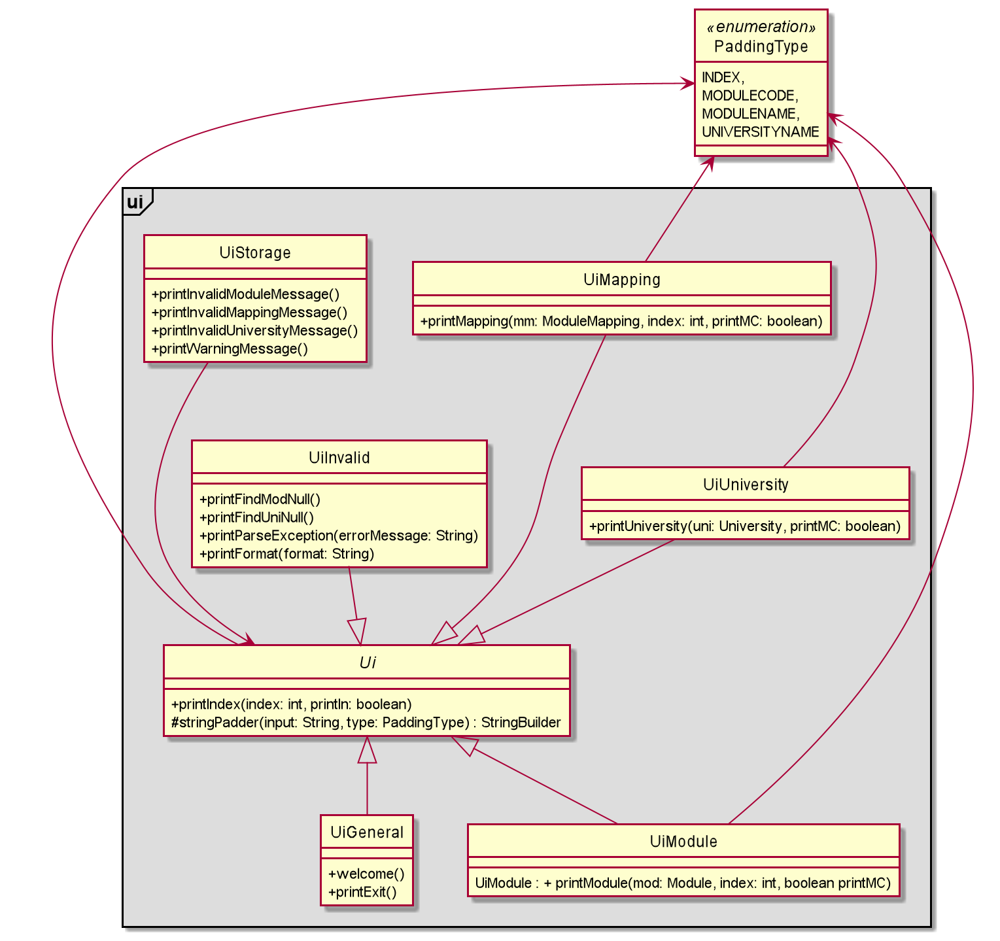
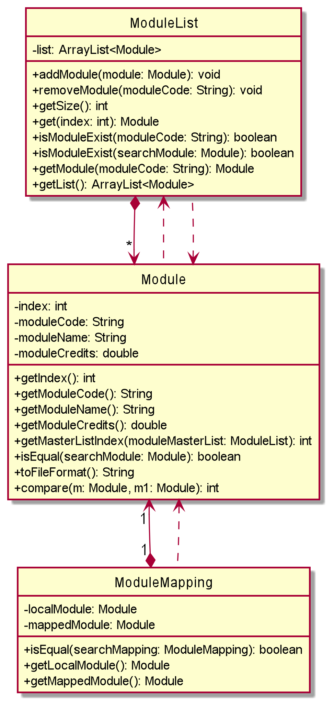
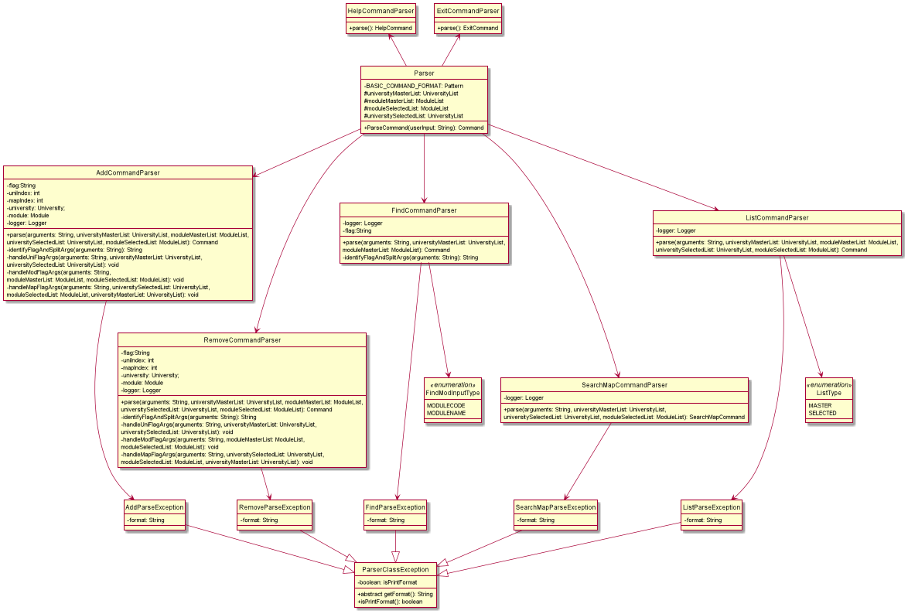

## Contents 
* [About SEPlanner](#about-seplanner)
* [Acknowledgements](#acknowledgements)
* [Getting Started](#getting-started)
* [Design & Implementation](#design--implementation)
  * [Main Components](#main-components) 
  * [Command Implementation](#command-implementation)
    * [AddModCommand](#addmodcommand)
    * [AddUniCommand](#addunicommand)
    * [AddMapCommand](#addmapcommand)
    * [RemoveModCommand](#removemodcommand)
    * [RemoveUniCommand](#removeunicommand)
    * [RemoveMapCommand](#removemapcommand)
    * [ListModCommand](#listmodcommand)
    * [ListUniCommand](#listunicommand)
    * [FindModCommand](#findmodcommand)
    * [FindUniCommand](#findunicommand)
    * [SearchMapCommand](#searchmapcommand)
    * [HelpCommand](#helpcommand)
    * [ExitCommand](#exitcommand)
  * [User Interface](#user-interface)
  * [Storage](#storage)
  * [University and module related classes](#university-and-module-related-classes)
    * [University](#university)
    * [UniversityList](#universitylist)
    * [Module](#module)
    * [ModuleList](#modulelist)
    * [ModuleMapping](#modulemapping)
  * [Parser Component](#parser-component)
    * [Parser](#parser)
    * [AddCommandParser](#addcommandparser)
    * [RemoveCommandParser](#removecommandparser)
    * [FindCommandParser](#findcommandparser)
    * [SearchMapCommandParser](#searchmapcommandparser)
    * [HelpCommandParser](#helpcommandparser)
    * [ExitCommandParser](#exitcommandparser)
* [Product Scope](#product-scope)
  * [Target User Profile](#target-user-profile)
  * [Value Proposition](#value-proposition)
* [User Stories](#user-stories)
* [Non-Functional Requirements](#non-functional-requirements)
* [Glossary](#glossary)
* [Instructions for manual testing](#instructions-for-manual-testing)
  * [Launch and shutdown](#launch-and-shutdown)
  * [Getting Help](#getting-help)
  * [Getting university list and module list](#getting-university-list-and-module-list)
  * [Finding a university](#finding-a-university)
  * [Finding a module](#finding-a-module)
  * [Adding a university](#adding-a-university)
  * [Adding a mapping](#adding-a-mapping)
  * [Searching for a mapping](#searching-for-a-mapping)
  * [Removing a university](#removing-a-university)
  * [Removing a module](#removing-a-module)
  * [Removing a mapping](#removing-a-mapping)
  * [Saving data](#saving-data)
* [Possible future updates](#possible-future-updates)
  * [Automatically update database](#automatically-update-database)
  * [Move database online for better security](#move-database-online-for-better-security)
  * [Include more information on partner universities](#include-more-information-on-partner-universities)
  * [Integrate SEP application process](#integrate-sep-application-process)
  * [Bring SEPlanner to students from other faculties](#bring-seplanner-to-students-from-other-faculties)

## About SEPlanner

SEPlanner is a lightweight **desktop application** for Computer Engineering undergraduates from the National University of Singapore (NUS)
to plan for their **Student Exchange Program (SEP)**, optimized for use via **Command Line Interface** (CLI).   

## Acknowledgements

* __EduRec:__ For the list of possible module mappings
* __AB3:__ For the format of the user guide and developer guide

## Getting started 

Refer to our user guide [here](https://ay2122s1-cs2113t-t09-2.github.io/tp/UserGuide.html#quick-start).

## Design & implementation

<p align = "center">
  
</p>

The ***Architecture Diagram*** above explains the high-level design of the App. 

### Main Components

The main class of SEPlanner is the `Seplanner` class. It is responsible for initializing the other components when the program 
gets started while handling interactions between the other components.  
The other core components of SEPlanner are:  
`Ui` : Handles the UI of SEPlanner and prints outputs to the user.  
`Parser` : Handles user inputs and passes them down to the `Command` class.  
`Command` : Handles output passed down from `Parser` based on the user inputs and execute user instructions.  
`Storage` : Loads data from, and stores data back to the user's local machine.  
`UniversityList` and `ModuleList` : Stores information about Universities and modules as well as the methods to amend and filter them.

### Command Interaction 

<p align = "center">

</p>

The sequence diagram above illustrates the flow through our program structure when the user input `add /uni 1` 
is entered.  

When the user runs the `add /uni 1` action on the parser class, the parser class calls the `addUniCommand` method 
in the `addUniCommand` class by passing the university with master index `1` to it.  

The `addUniCommand` class then  
1. calls the `selectedUniversityList#addUniversity` method in the model class 
by passing the university to implement the action.
2. calls the `updateSelectedUniversity` method in the storage class 
by passing the selected university list to update the stored selected list
3. calls `printUniversity` in the UI class.
by passing the university to display the message of adding the selected university to the user.
 
### Command Implementation

#### API : [`Command.java`](https://github.com/AY2122S1-CS2113T-T09-2/tp/blob/master/src/main/java/seplanner/commands/Command.java)

<p align = "center">

</p>


#### AddModCommand
When the `AddModCommand` constructor is called in the `AddModCommand` class. It will call the `addModule` method in the `moduleList` class under Model, adding the module in the selected module list. Then it will call the `updateSelectedModuleList` method in the storage class to update the selected list with the new module added. Finally, it will call the `printModule` method in the `UiModule` class to print the message of adding the module to the user.

#### AddUniCommand
When the `AddUniCommand` constructor is called in the `AddUniCommand` class. It will call `addUniversity` method in the `universityList` class under Model, adding the university in the selected university list. Then it will call the `updateSelectedUniversityList` method in the storage class to update the selected list with the new university added. Finally, it will call the `printUniversity` method in the `UiUniversity` class to print the message of adding the university to the user.

#### AddMapCommand 
When the `addMapCommand` constructor is called in the `AddMapCommand` class. It will call the `addMapping` method in the `university` class under Model, adding the mapping under the selected university in the selected university list. Then it will call the `updateSelectedUniversity` method in the storage class to update the selected list with the new mapping added. Finally, it will call the `printUniversity` method in the `UiMapping` class to print the message of adding the mapping to the user.

#### RemoveModCommand 
When the `RemoveModCommand` constructor is called in the `RemoveModCommand` class. It will call the `removeModule` method in the `moduleList` class under Model, removing the module in the selected module list. Then it will call the `updateSelectedModuleList` method in the storage class to update the selected list with the module removed. Finally, it will call the `printModule` method in the `UiModule` class to print the message of removing the module to the user.

#### RemoveUniCommand 
When the `RemoveUniCommand` constructor is called in the `RemoveUniCommand` class. It will call `removeUniversity` method in the `universityList` class under Model, removing the university in the selected university list. Then it will call the `updateSelectedUniversityList` method in the storage class to update the selected list with the university removed. Finally, it will call the `printUniversity` method in the `UiUniversity` class to print the message of removing the university to the user.

#### RemoveMapCommand 
When the `RemoveMapCommand` constructor is called in the `RemoveMapCommand` class. It will call the `removeMapping` method in the `university` class under Model, removing the mapping under the selected university in the selected university list. Then it will call the `updateSelectedUniversity` method in the storage class to update the selected list with the mapping removed. Finally, it will call the `printUniversity` method in the `UiMapping` class to print the message of removing the mapping to the user.

#### ListModCommand 
When the `ListModCommand` constructor is called in the `ListModCommand` class. It will call the `getSize()` method in the `moduleList` class to check if the list is empty: if the list is empty, it prints the error message. If the list is not empty, it calls the `printModule` method in the `UiModule` class in a loop to print all modules found.

#### ListUniCommand 
When the `ListUniCommand` constructor is called in the `ListUniCommand` class. It will call the `getSize()` method in the `UniversityList` class to check if the list is empty: if the list is empty, it prints the error message. If the list is not empty, it checks the type of university list chosen. If the master list is chosen, the `printMasterList` method is called, which calls `printUniversity` method in the `UiUniversity` class to print out all universities in the master list. If the selected list is chosen, `printSelectedList` is called, which calls `printUniversity` method in the `UiUniversity` class to print out all universities in the selected list and calls `listAllMappings` method in the `universityList` class to print all module mappings under each university as well.

#### FindModCommand 
When the `FindModCommand` constructor is called in the `FindModCommand` class. It will get the list of module results by searching in the `moduleMasterList`. Then it checks if the result list is empty: if the result list is empty, it calls the `printFindModNull` method in the `UiInvalid` class to print the error message. If the result list is not empty, it calls the `printModule` method in the `UiModule` class in a loop to print all modules found.

#### FindUniCommand 
When the `FindUniCommand` constructor is called in the `FindUniCommand` class. It will get the list of university results by searching in the `universityMasterList`. Then it checks if the result list is empty: if the result list is empty, it calls the `printFindUniNull` method in the `UiInvalid` class to print the error message. If the result list is not empty, it calls the `printUniversity` method in the `UiUniversity` class in a loop to print all universities found.

#### SearchMapCommand 
When the `SearchMapCommand` constructor is called in the `SearchMapCommand` class, it will check if `isAll` is true. If `isAll` is true, the `printMappings` method will be called, which prints all mappings from the selected module list for all universities in the selected university list by calling the `printIndex` method in the Ui class and `listSelectedMappings` method in the University class. If isAll is false, it will call the `printMappings` method to print out only the mappings for the selected university only.  
The following sequence diagram illustrates how the whole process is carried out.
<p align = "center">

</p>

#### HelpCommand 
When the `HelpCommand` constructor is called in the `HelpCommand` class. It will print out all commands available for SEPlanner.

#### ExitCommand 
When the `ExitCommand` constructor is called in the `ExitCommand` class. It will call the `printExit` method in the `UiGeneral` class to exit the program.

### User Interface

#### API : [`Ui.java`](https://github.com/AY2122S1-CS2113T-T09-2/tp/blob/master/src/main/java/seplanner/ui/Ui.java)

The Ui component consolidates and formats the output of the program before displaying it to the user
in the command line. 

<p align = "center">

</p>

The above class diagram illustrates the relationship between the classes within the Ui components.

The Ui class is the parent of every other class in the package.
* Contains helper methods for the other Ui classes.
* Provides means of printing constants.

The `UiInvalid` class contains methods for printing messages from the Parser component.

The `UiMapping` class contains methods for printing module mappings. 

The `UiModule` class contains methods for printing modules. 

The `UiUniversity` class contains methods for printing universities. 

The `UiWelcome` class contains a method for printing the welcome greeting. 

The `UiInvalid` class contains methods to display error messages to the user. 

The `UiStorage` class contains methods to display error messages from the Storage component to the user. 

<p align = "center">

</p>

The sequence diagram above illustrates how the classes in the Ui package interact when a `printUniversity()` call is made from outside the package.
In the `printUniversity()` Method,
1. `printIndex` is called from the Ui class.
2. Within `printIndex`, we display the index, then do a self-invocation on stringPadder within the Ui class to pad the string to line up the text after. 
3. After printing the index, print the university name, then depending on the boolean printMC, we pad it again with stringPadder before displaying the Module Credits. 


### Storage

#### API : [`Storage.java`](https://github.com/AY2122S1-CS2113T-T09-2/tp/blob/master/src/main/java/seplanner/storage/Storage.java)

<p align = "center">

</p>

The Storage component can implement the below features:

* Read the list of module mappings offered by each university from the CSV file.
* Read the list of NUS modules that can be mapped from the CSV file.
* Save both the user's module mappings for each university and their selected NUS modules in text
  file and read them back into corresponding objects.

The purpose of each class in the storage component, except the `Storage` class, is to handle a specific file. The `Storage` 
class is used to link all the other classes. This is done by creating an object of other classes, to access all the necessary
methods required.

The classes `SelectedUniversityStorage` and `SelectedModuleStorage` are responsible for reading and updating the text files
storing your selected university list and your selected module list. These classes inherit from the `UserStorage` class as the `loadFile` function
is identical other than the file path. The private methods in both classes filter out the invalid data found while reading the 
text files.

The classes `UniversityStorage` and `ModuleStorage` are responsible for extracting the Master University List and Master Module List
from the CSV type files (`University.csv` and `modules.csv`) stored in the resources root.

### University and module related classes

#### API : [`University.java`](https://github.com/AY2122S1-CS2113T-T09-2/tp/blob/master/src/main/java/seplanner/universities/University.java)
#### API : [`Module.java`](https://github.com/AY2122S1-CS2113T-T09-2/tp/blob/master/src/main/java/seplanner/modules/Module.java)

The following diagram is the class diagram of the university related classes:

<p align = "center">

</p>

This component consist of the following classes:  

#### University 

* Stores basic information of a university.
* Stores the unique index for each university in `index`, this index can be used to refer to a specific university in the commands.
* Stores the university name in `name`.
* Stores `ModuleMapping` objects associated with this university in an array list `list`.
* For `University` objects under the master list, `list` stores all possible module mappings from this university for the user to choose from.
* For `University` objects under the selected list by the user, `list` stores all the module mappings the user has chosen to add to this university for their SEP application.

#### UniversityList

* Stores `University` objects.
* Can be used under the following 2 circumstances:
  * Stores the master list containing all universities available for CEG SEP application. This list is directly read from an external file `University.csv`.
  * Stores the selected list containing all universities added by the user. This list can be amended by the user, and all changes to it will be stored under `data/selectedUniversities.txt`.
* Contains methods to search, filter, or amend the list based on the command from the user.
* There can be 2 `University` objects for the same university, one stored in each of the lists mentioned above. The object stored in the master list contains all the possible module mappings for this university based on our database, while the object stored in the selected list 
stores the mappings added by the user. These 2 objects cannot be used interchangeably. While holding reference onto one of the objects, the user needs to call the method `getUniversity(universityName)` to access the corresponding object from the other list.

The following diagram is the class diagram for the module related classes:  

<p align = "center">

</p>

This component consist of the following classes:  

#### Module 

* Stores basic information of a module.
* For NUS modules, stores the unique index for each module in `index`, this index can be used to refer to a specific module in the commands.
* Stores the module code in `moduleCode`.
* Stores the module name in `moduleName`.
* Stores the modular credits of this module in `moduleCredits`.

#### ModuleList

* Stores `Module` objects.
* Can be used under the following 2 circumstances:
  * Stores the master list of all NUS modules available for the users to choose from.
  * Stores the selected list unique to each user based on the modules they choose to take.

#### ModuleMapping 

* Stores 2 `Module` objects as a pair of module mapping.
* Stores the local NUS module in `localModule`.
* Stores the partner university module in `mappedModule`.

### Parser Component

#### API : [`Parser.java`](https://github.com/AY2122S1-CS2113T-T09-2/tp/blob/master/src/main/java/seplanner/parser/Parser.java)

The parser component is made up of the following classes:

<p align = "center">

</p>

Parser component is used to make do the following:
* Identify the command word and invoke the respective argument parser for the command.
* Handle the arguments and return the respective Command object.
* Ensures that the command, flags and, arguments are entered in the correct format.  

#### Parser

* This is the main parser class that will handle raw inputs and identify command words and invoke the respective command parsers instance and returns the respective `Command` object.

#### ParseCondition

* This class contains methods used by various parser classes to verify that the inputs are valid.

#### AddCommandParser

* This object when invoked, will first identify the flag `/uni`, `/mod` or `/map`. Once the flag is identified, the arguments corresponding to the flags will be extracted.
* For `/uni` the argument should either be an integer representing `<UNI_INDEX>` or a String representing `<UNI_NAME>`.
A new `University` object will be created and passed as an argument to the constructor for `AddUniCommand`.
* For `/mod` the argument should either be an integer representing `<MOD_INDEX>` or a String representing `<MODULE_CODE>`.
A `Module` object will be duplicated from the Master Module List and passed as an argument to the constructor for `AddModCommand`.
* Both the `/uni` and `/mod` flag will be checking for the type of inputs passes in and handling them accordingly.
* For `/map` the argument should be two integers representing `<UNI_INDEX>` and `<MAPPING_INDEX>` and will be passed into the constructor for `AddMapCommand`.

#### RemoveCommandParser

* This object when invoked, will first identify the flag `/uni`, `/mod` or `/map`. Once the flag is identified, the arguments corresponding to the flags will be extracted.
* For `/uni` the argument should either be an integer representing `<UNI_INDEX>` or a String representing `<UNI_NAME>`.
The `University` object representing the particular university from the Selected University List will be passed as an argument to the constructor for `RemoveUniCommand`.
* For `/mod` the argument should either be an integer representing `<MOD_INDEX>` or a String representing `<MODULE_CODE>`.
The `Module` object represents the particular module from Selected Module List and is passed as an argument to the constructor for `RemoveModCommand`.
* Both the `/uni` and `/mod` flag will be checking for the type of inputs passes in and handling them accordingly.
* For `/map` the argument should be two integers representing `<UNI_INDEX>` and `<MAPPING_INDEX>` and will be passed into the constructor for `RemoveMapCommand`.

#### FindCommandParser

* This object when invoked, will first identify the flag `/uni`, `/code` or `/mod`. Once the flag is identified, a String representing `<KEYWORD>` is extracted and passed as an argument to the constructor for `FindUniCommand` or `FindModCommand`.

#### SearchMapCommandParser

* This object when invoked, will take the first argument and determine if it is an integer representing `<UNI_INDEX>` or the flag `all` and pass it to the constructor for `SearchMapCommand`.

#### HelpCommandParser

This object will return an instance of `HelpCommand`.

#### ExitCommandParser

This object will return an instance of `ExitCommand`.

#### ParserClassException

* This is an abstract class inherited from Java 11's `ParseException` and its children objects are thrown when an input is detected as invalid. 
* Each command word has its respective `ParserClassException` with its format inside.
* On top of the parameters for `ParseException`, an additional boolean variable is required to identify when the user has made a format error in the command and the correct format will be output to the user.
* Any instance of this exception will be caught in the main method of the `Seplanner` class.

## Product scope

### Target User Profile

__SEPlanner__ is targeted at Computer Engineering students in the National University of Singapore planning for their Student Exchange Program (SEP). 

### Value Proposition

Student Exchange Program is one of the most stressful and difficult things to plan for in an NUS students life. 
With multiple sources of information and a frustrating webpage to navigate, SEPlanner aims to organize 
a list of potential exchange Universities based on the user's study plan, module requirements, and personal preference.

## User Stories

|Version| As a ... | I want to ... | So that I can ...|
|--------|----------|---------------|------------------|
|v1.0|new user|see the list of possible schools for exchange|view my options for SEP|
|v1.0|new user|see the list of available NUS modules|decide on which NUS modules I want to complete during SEP|
|v1.0|beginner user|add a university to my preferred list|view the universities that I am interested in|
|v1.0|beginner user|add an NUS module to my preferred list|save my module preferences for the future|
|v1.0|beginner user|list down all universities in my preferred list|keep track of my target schools for SEP|
|v1.0|beginner user|list down all NUS modules in my preferred list|keep track of the list of NUS modules I want to complete during SEP|
|v1.0|beginner user|delete a university from the selected list|remove the university that I am not interested in|
|v1.0|beginner user|delete a module from the selected list|remove the module that I do not consider to enroll in the future|
|v1.0|user|enter commands and arguments to the application|interact with the application on the command line in an efficient way
|v2.0|familiar user|save my university and module information|maintain access to my information when I restart the application|
|v2.0|new user|view the program instructions|refer to them when I forget how to use the application|
|v2.0|familiar user|find a university by name|locate a university without having to go through the entire list|
|v2.0|familiar user|search the available module mappings for a university based on the selected module list|get a list of module mappings for this university, based on my selected modules|
|v2.0|familiar user|add a pair of module mapping for a university|save a module mapping under the university that I selected|
|v2.0|familiar user|delete a mapping pair of modules for a university|remove a module mapping under a selected university|
|v2.0|familiar user|pass in university as command argument using its index in the master list|access the exact university I want without having to type out its full name and facing bugs caused by typo|
|v2.1|familiar user|add a university to the selected list by name or index|store a university entering either its name or index|
|v2.1|familiar user|add a module to the selected list by code or index|store a module entering either its code or index|
|v2.1|familiar user|remove a university to the selected list by name or index|delete a university entering either its name or index|
|v2.1|familiar user|remove a module to the selected list by code or index|delete a module entering either its code or index|
|v2.1|familiar user|search the mappings for all universities in the selected list|browse through all modules mappings for my selected universities|
|v2.1|familiar user|find a module by name or code|locate a module without having to go through the entire list|

## Non-Functional Requirements

* SEPlanner must operate with full functionality on all mainstream operating systems: Windows, macOS, and Ubuntu with Java 11 installed. 
* It should offer a streamlined experience using the command line interface primarily. 
* It should be fast and responsive (No more than 1000ms between user input and program output).
* It should be significantly faster than the default Student Exchange Program application portal on myEduRec. 

## Glossary

* *Master University List* The list of all partner universities.
* *Master Module List* - The list of all NUS modules available for mapping.
* *Selected University List* - The list of partner universities that the user selected along with the user's selected module mappings
                               for each university
* *Selected Module List* - The list of NUS modules the user selected.
* *CSV* - Comma-separated Values
* *SEP* - Student Exchange Programme
* *NUS* - National University of Singapore

## Instructions for manual testing

<div markdown="block" class="alert alert-info"> :information_source: **Note:**
These instructions only provide a starting point for testers to work on; testers are expected to do more exploratory testing.
</div>

### Launch and shutdown

1. Initial launch
   1. Download the jar file and copy it into an empty folder.
   2. Open a terminal at the folder containing the jar file.
   3. Run the command `java -jar seplanner.jar`
      Expected: The welcome ASCII art will display.
   4. Resize the terminal to fit the welcome ASCII.

2. Shutdown
   1. Enter the command `exit`.
      Expected: The exit ASCII art will display.

### Getting help
1. Get help for the user about the program.
   1. Test case: `help`

      Expected: The command list will be printed to the console.

### Getting university list and module list
1. Listing the Master University List.
   1. Test case: `list /muni`

      Expected: The entire list of universities is printed.

2. Listing the Master Module List
   1. Test case: `list /mmod`

      Expected: The entire list of modules is printed.

3. Listing the Selected University List.
   1. Test case: `list /suni`

      Expected: The user's selected university list is displayed.

4. Listing the Selected Module List.
   1. Test case: `list /smod`

      Expected: The user's selected module list is displayed.

5. Dealing with wrong flags.
   1. Test case: `list /mod`

      Expected: No list will be printed. An error message indicating wrong flags is shown, together with the correct format for the `list` command.

6. Dealing with an incorrect format.
   1. Test case: `list`

      Expected: No list will be printed. An error message indicating missing flags is shown, together with the correct format for the `list` command.

### Finding a university
1. Finding a university by name.
    1. Test case: `find /uni Boston University`

       Expected: The related information for Boston University is printed.
   2. Test case: `find /uni abc`

      Expected: No university is found. Error message is printed to indicate university is not available.
   
2. Dealing with wrong flags.
    1. Test case: `find /uniname`

       Expected: An error message indicating wrong flags is shown, together with the correct format for `find` command.

3. Dealing with an incorrect format.
    1. Test case: `find`

       Expected: An error message indicating missing flags is shown, together with the correct format for `list` command.

### Finding a module
1. Finding a module by name.
    1. Test case: `find /mod Discrete Structures`

       Expected: The related information for Discrete Structures is printed.
    2. Test case: `find /mod abc`

       Expected: No module is found. An error message is printed to indicate university is not available.
2. Finding a module by code.
    1. Test case: `find /code CS1231`

       Expected: The related information for CS1231 is printed.
    2. Test case: `find /code abc`

    Expected: No module is found. An error message is printed to indicate university is not available.

2. Dealing with wrong flags.
    1. Test case: `find /modname`

       Expected: An error message indicating wrong flags is shown, together with the correct format for `find` command.

3. Dealing with an incorrect format.
    1. Test case: `find`

       Expected: An error message indicating missing flags is shown, together with the correct format for `list` command.

### Adding a university

1. Adding a university by index.
   1. Prerequisites: Delete the data folder and restart the program.
   2. Test case: `add /uni 1`
      
      Expected: University with index 1 is added to the Selected University List. A success message is shown.
   3. Test case: `add /uni 0`

      Expected: No university is added. An error message is printed to indicate university is not available.

   4. Test case: `add /uni 81`

      Expected: No university is added. An error message is printed to indicate university is not available.

2. Adding a university by university name.
   1. Prerequisites: Delete the data folder and restart the program.
   2. Test case: `add /uni University of California`
   
      Expected: University of California is added to Selected University List. A success message is shown.

   3. Test case: `add /uni random_string`

      Expected: No university is added. An error message is printed to indicate university is not available.

3. Adding a duplicate university by index.
   1. Prerequisites: Delete the data folder and restart the program. Run the command `add /uni 34`.
   2. Test case: `add /uni 34`
      
      Expected: No university is added. An error message indicating duplicate university is shown.
    
4. Adding a duplicate university by university name.
   1. Prerequisites: Delete the data folder and restart the program. Run the command `add /uni University of Toronto`.
   2. Test case: `add /uni University of Toronto`

      Expected: No university is added. An error message indicating duplicate university is shown.
   
5. Dealing with missing argument.
    1. Test case: `add /uni`

       Expected: No university will be added. An error message indicating missing arguments is shown, together with the correct format for `add` command.

    2. Test case: `add`
  
       Expected: No university will be added. An error message indicating missing arguments is shown, together with the correct format for `add` command.

6. Dealing with incorrect flags.
   1. Test case: `add /muni 34`

      Expected: No university will be added. An error message indicating wrong flags is shown, together with the correct format for `add` command.

### Adding a module

1. Adding a module by index.
   1. Prerequisites: Delete the data folder and restart the program.
   2. Test case: `add /mod 1`

       Expected: Module with index 1 is added to the Selected Module List. A success message is shown.
   
   3. Test case: `add /mod 0`

       Expected: No module is added. An error message is printed to indicate the module is not available.

   4. Test case: `add /mod 806`

      Expected: No module is added. An error message is printed to indicate the module is not available.

2. Adding a module by module code.
   1. Prerequisites: Delete the data folder and restart the program.
   2. Test case: `add /mod CS1010`

      Expected: University of California is added to Selected Module List. A success message is shown.

   3. Test case: `add /mod random_string`

      Expected: No module is added. An error message is printed to indicate the module is not available.

3. Adding a duplicate module by index.
   1. Prerequisites: Delete the data folder and restart the program. Run the command `add /mod 34`.
   2. Test case: `add /mod 34`

      Expected: No module is added. An error message indicating duplicate module is shown.

4. Adding a duplicate module by module code.
   1. Prerequisites: Delete the data folder and restart the program. Run the command `add /mod CS3230`.
   2. Test case: `add /uni CS3230`

      Expected: No module is added. An error message indicating duplicate module is shown.

5. Dealing with missing argument.
   1. Test case: `add /mod`

      Expected: No module will be added. An error message indicating missing arguments is shown, together with the correct format for the `add` command.

   2. Test case: `add`

      Expected: No module will be added. An error message indicating missing arguments is shown, together with the correct format for the `add` command.

6. Dealing with incorrect flag.
   1. Test case: `add /mmod 34`

      Expected: No module will be added. An error message indicating wrong flags is shown, together with the correct format for the `add` command.
   
### Adding a mapping

   1. Adding a mapping for a selected university and module
      1. Prerequisites: Module and University have been added and potential mapping is available via the `searchmap` command. Run the command `add /uni 75` and `add /mod 1`
      2. Test case: `add /map 75 1`

         Expected: Mapping will be added to the Selected University List under the respective university. A success message is shown. Run the command `list /suni` to verify.
   
   2. Adding a module mapping to an unselected university and selected module. 
      1. Prerequisites: Delete the data folder and restart the program. Run the command `add /mod 1`
      2. Test case: `add /map 75 1`
      
         Expected: No mapping will be added. An error message indicating the university not selected is shown.
   
   3. Adding a non-existent mapping to a university. 
      1. Prerequisites: Module and University have been added and potential mapping is available via the `searchmap` command. Run the command `add /uni 75`
      2. Test Case: `add /map 75 1`
      
         Expected: No mapping will be added. An error message indicating invalid mapping is shown.
       
   4. Dealing with missing argument.
       1. Test case: `add /map`

          Expected: No mapping will be added. An error message indicating missing arguments is shown, together with the correct format for the `add` command.

       2. Test case: `add`

          Expected: No module will be added. An error message indicating missing arguments is shown, together with the correct format for the `add` command.
      
   5. Dealing with incorrect flags.
       1. Test case: `add /mmap 34 3`

          Expected: No module will be added. An error message indicating wrong flags is shown, together with the correct format for the `add` command.

### Searching for a mapping

1. Searching for a module mapping for a university with mappings to user's selected modules.
   1. Prerequisite: Modules must be added to the Selected Module List with the `add` command. Run the command `add /mod 1`.
   2. Test case: `searchmap 75`

      Expected: List of potential mappings for the particular university is displayed.
   3. Test case: `searchmap 0`
   
      Expected: No mappings will be listed. An error message indicating invalid university is shown. 
   4. Test case: `searchmap 81`

      Expected: No mappings will be listed. An error message indicating invalid university is shown.
2. Dealing with missing arguments.
   1. Test case: `searchmap`
   
      Expected: No mappings will be listed. An error message indicating missing arguments is shown, together with the correct format for the `searchmap` command.

### Removing a university

1. Removing a university by index.
    1. Prerequisites: Run the command `add /uni 1`
    2. Test case: `remove /uni 1`

       Expected: University with index 1 is removed from the Selected University List. A success message is shown.
    3. Test case: `remove /uni 0`

       Expected: No university is removed. An error message is printed to indicate the university is not available.

    4. Test case: `remove /uni 81`

       Expected: No university is removed. An error message is printed to indicate the university is not available.

2. Removing a university by university name.
    1. Prerequisites: Run the command `add /uni University of California`
    2. Test case: `remove /uni University of California`

       Expected: University of California is removed from Selected University List. A success message is shown.

    3. Test case: `remove /uni random_string`

       Expected: No university is removed. An error message is printed to indicate the university is not available.

3. Removing an unselected university by index.
    1. Prerequisites: Delete the data folder and restart the program.
    2. Test case: `remove /uni 34`

       Expected: No university is removed. An error message is printed to indicate the university is not available.

4. Removing an unselected university by university name.
    1. Prerequisites: Delete the data folder and restart the program.
    2. Test case: `remove /uni University of Toronto`

       Expected: No university is removed. An error message is printed to indicate the university is not available.

5. Dealing with missing argument.
    1. Test case: `remove /uni`

       Expected: No university will be removed. An error message indicating missing arguments is shown, together with the correct format for the `remove` command.

    2. Test case: `remove`

       Expected: No university will be removed. An error message indicating missing arguments is shown, together with the correct format for the `remove` command.

6. Dealing with incorrect flag.
    1. Test case: `remove /muni 34`

       Expected: No university will be removed. An error message indicating wrong flags is shown, together with the correct format for the `remove` command.

### Removing a module

1. Removing a module by index.
    1. Prerequisites: Run the command `add /mod 1`
    2. Test case: `remove /mod 1`

       Expected: University with index 1 is removed from the Selected Module List. A success message is shown.
    3. Test case: `remove /mod 0`

       Expected: No module is removed. An error message is printed to indicate the module is not available.

    4. Test case: `remove /mod 810`

       Expected: No module is removed. An error message is printed to indicate the module is not available.

2. Removing a module by module code.
    1. Prerequisites: Run the command `add /mod CS3230`
    2. Test case: `remove /mod CS3230`

       Expected: University of California is removed from Selected Module List. A success message is shown.

    3. Test case: `remove /mod random_string`

       Expected: No module is removed. An error message is printed to indicate the module is not available.

3. Removing an unselected module by index.
    1. Prerequisites: Delete the data folder and restart the program.
    2. Test case: `remove /mod 34`

       Expected: No module is removed. An error message is printed to indicate the module is not available.

4. Removing an unselected module by module code.
    1. Prerequisites: Delete the data folder and restart the program.
    2. Test case: `remove /mod CS1010`

       Expected: No module is removed. An error message is printed to indicate the module is not available.

5. Dealing with missing argument.
    1. Test case: `remove /mod`

       Expected: No module will be removed. An error message indicating missing arguments is shown, together with the correct format for the `remove` command.

    2. Test case: `remove`

       Expected: No module will be removed. An error message indicating missing arguments is shown, together with the correct format for the `remove` command.

6. Dealing with incorrect flag.
    1. Test case: `remove /mmod 34`

       Expected: No module will be removed. An error message indicating wrong flags is shown, together with the correct format for the `remove` command.

### Removing a mapping

1. Removing a mapping for a selected university and module
    1. Prerequisites: Delete the data folder and restart the program. Run the command `add /uni 75`, `add /mod 1` and `add /map 75 1`.
    2. Test case: `remove /map 75 1`

       Expected: Mapping will be removed to the Selected University List under the respective university. A success message is shown. Run the command `list /suni` to verify.

2. Removing a non-existent mapping from a selected university.
    1. Prerequisites: Delete the data folder and restart the program. Run the command `add /uni 34`
    2. Test case: `remove /map 34 2`

       Expected: No mapping is removed. An error message indicating invalid mapping is shown.

3. Removing a mapping from an unselected university.
    1. Prerequisites: Delete the data folder and restart the program.
    2. Test case: `remove /map 34 2`

       Expected: No mapping is removed. An error message indicating the university not selected is shown.

4. Dealing with missing argument.
    1. Test case: `remove /map`

       Expected: No mapping will be removed. An error message indicating missing arguments is shown, together with the correct format for the `remove` command.

    2. Test case: `remove`

       Expected: No module will be removed. An error message indicating missing arguments is shown, together with the correct format for the `remove` command.

5. Dealing with incorrect flag.
    1. Test case: `remove /mmap 34 3`

       Expected: No module will be removed. An error message indicating wrong flags is shown, together with the correct format for the `remove` command.

### Saving data
1. Dealing with missing directory
    1. Missing `data` directory
       
       Expected: New directory will be created along with two empty text files inside.
    2. Missing `log` directory
       
       Expected: New directory will be created along with an empty log file inside.
   
2. Dealing with missing file
    1. Missing `selectedModules.txt` file
       
       Expected: New empty text file is created in the `data` directory.
    2. Missing `selectedUniversities.txt` file
       
       Expected: New empty text file is created in the `data` directory.
    3. Missing `logs.log` file
       
       Expected: New empty text file is created in the `log` directory.

3. Dealing with corrupted data
    1. Invalid module in `selectedModules.txt`
   
       Prerequisites: 
       ```
       ACC2706 # Managerial Accounting # 4.0
       CS1261B # Discrete Structures # 4.0
       ```
       
       File content after run:
       ```
       ACC2706 # Managerial Accounting # 4.0
       ```
       
       Expected: Error message printed to the console indicating that invalid modules are found and warning the user not to tamper with the file.
       
    2. Invalid module mapping in `selectedUniversities.txt`
   
       Prerequisites:
       ```
       Boston University
       CS1261B # Discrete Structures # 4.0 # MET CS 249 # Discrete Mathematics # 3.0
       ```
       
       File content after run:
       ```
       Boston University
       ```

       Expected: Error message printed to the console indicating that invalid mappings are found and warning the user not to tamper with the file.
       
    3. Invalid university in `selectedUniversities.txt`
   
       Prerequisites:
       ```
       Aarhus University
       Buston University
       CS1231 # Discrete Structures # 4.0 # MET CS 248 # Discrete Mathematics # 3.0
       ```
       
       File content after run:
       ```
       Aarhus University
       ```

       Expected: Error message printed to the console indicating that invalid university names are found and warning the user not to tamper with the file.
       
4. Dealing with duplicate data
    1. Duplicate modules in `selectedModules.txt`
   
       Prerequisites:
       ```
       ACC2706 # Managerial Accounting # 4.0
       CS1231 # Discrete Structures # 4.0
       CS1231 # Discrete Structures # 4.0
       CS1231 # Discrete Structures # 4.0
       MKT1705 # Principles of Marketing # 4.0
       ```
       
       File content after run:
       ```
       ACC2706 # Managerial Accounting # 4.0
       CS1231 # Discrete Structures # 4.0
       MKT1705 # Principles of Marketing # 4.0
       ```

       Expected: Error message printed to the console indicating that invalid modules are found and warning the user not to tamper with the file.

    2. Duplicate module mappings in `selectedUniversities.txt`
   
       Prerequisites:
       ```
       Aarhus University
       Boston University
       CS1231 # Discrete Structures # 4.0 # MET CS 248 # Discrete Mathematics # 3.0
       CS1231 # Discrete Structures # 4.0 # MET CS 248 # Discrete Mathematics # 3.0
       CS1231 # Discrete Structures # 4.0 # MET CS 248 # Discrete Mathematics # 3.0
       ```
       
       File content after run:
       ```
       Aarhus University
       Boston University
       CS1231 # Discrete Structures # 4.0 # MET CS 248 # Discrete Mathematics # 3.0
       ```

       Expected: Error message printed to the console indicating that invalid mappings are found and warning the user not to tamper with the file.
    
    3. Duplicate universities in `selectedUniversities.txt`
   
       Prerequisites:
       ```
       Aarhus University
       Boston University
       CS1231 # Discrete Structures # 4.0 # MET CS 248 # Discrete Mathematics # 3.0
       CS1231 # Discrete Structures # 4.0 # CAS CS131 # Combinatoric Structures # 4.0
       Boston University
       CS1231 # Discrete Structures # 4.0 # MET CS 248 # Discrete Mathematics # 3.0
       ```
       
       File content after run:
       ```
       Aarhus University
       Boston University
       CS1231 # Discrete Structures # 4.0 # MET CS 248 # Discrete Mathematics # 3.0
       CS1231 # Discrete Structures # 4.0 # CAS CS131 # Combinatoric Structures # 4.0
       ```
    
       Expected: Error message printed to the console indicating that invalid university names are found and warning the user not to tamper with the file.


## Possible future updates
### Automatically update database
Currently, data for universities and mappings are directly retrieved from the EduRec website provided by NUS and stored in CSV files.
There is no current way to automatically update the data retrieved. As such, one of the future updates the team can look into will be to
retrieve the data from EduRec automatically such that the universities, modules, and mappings in the database will always be up-to-date.
### Move database online for better security
Data entered by users (selected module and university list) are currently only stored in the user's local machine. This introduces a certain
amount of uncertainty to the users since the data might be easily corrupted or lost if the local machine malfunctions, thus the team should also
look into storing all the data on the cloud such that data from the users can be stored more safely.
### Include more information on partner universities
SEPlanner's current database includes crucial information for SEP planning, such as universities, NUS modules, and corresponding module mappings.
These data are chosen for the first 2 versions of the app since the process of accessing these data on EduRec is extremely slow and unorganized.
However, there is other information which is not included in SEPlanner right now, including the time of exchange for each partner university, number of
vacancies, etc. Information mentioned here is not provided by EduRec, and is easy for the user to access. However, it will be good for the team to include
all these details in future versions of SEPlanner, so that the application itself will be providing sufficient information for an NUS CEG student for his/her SEP application.
### Integrate SEP application process
SEPlanner provides the users with a fast and easy experience to organize the mappings and universities for SEP, but SEPlanner alone is not enough for users to complete their SEP application. Unfortunately, after the planning
is done, users will still have to return to EduRec to submit their actual SEP application (which is extremely slow and inefficient as mentioned). The team
could look into further integration with EduRec in the future, and perform the application for users as well. This will make SEPlanner itself a sufficient
app for the entire SEP planning and applying process.
### Bring SEPlanner to students from other faculties
The current version is only designed for CEG students from NUS, the team can further improve in the future by including more details for students from other
faculties, and a graphical interface, thus making SEPlanner the go-to choice for every single NUS student planning for their SEP.
