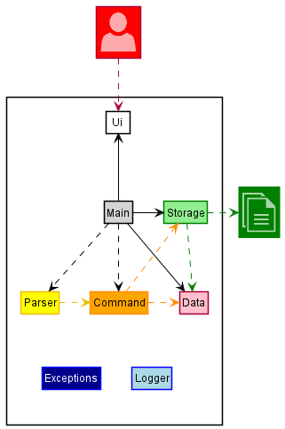
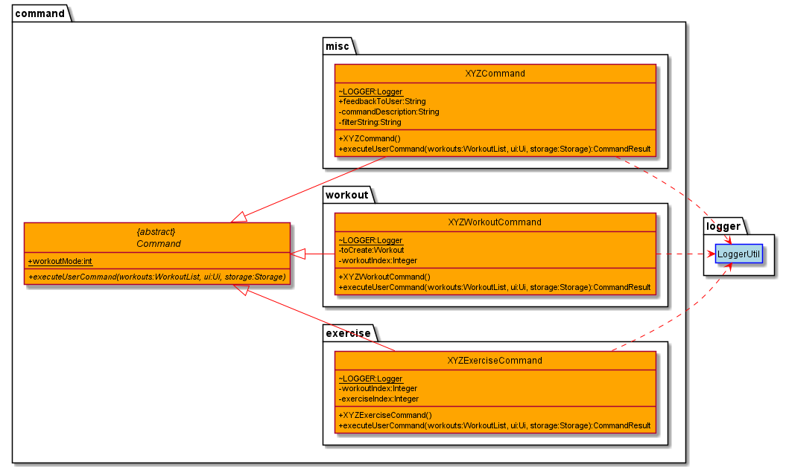

# Developer Guide

- [Acknowledgements](#acknowledgements)
- [Design & Implementation](#design--implementation)
  - [Data Component](#data-component)
  - [Storage Component](#storage-component)
  - [Command Component](#command-component)
  - [Command Manager Component](#commandmanager-component)
- [Product Scope](#product-scope)
  - [Target User Profile](#target-user-profile)
  - [Value Proposition](#value-proposition)
- [User Stories](#user-stories)
- [Non-Functional Requirements](#non-functional-requirements)
- [Glossary](#glossary)
- [Instructions for manual testing](#instructions-for-manual-testing)

## Acknowledgements

- Libraries used: [Jackson](https://github.com/FasterXML/jackson), [JUnit5](https://github.com/junit-team/junit5)

## Design & implementation

### Basic Architecture

__Note:__
* `GetJackd` : Main of whole application.
* `Ui` : In charge of reading user input and printing the results on the terminal.
* `WorkoutList` : Contains list of all workouts the user has added.
* `Storage` : In charge of storing and loading user data.
* `CommandManager` : Parses user input and returns Command object.
* `Command` : Holds all information related to a type of command and can be executed.
* `LoggerUtil` : Contains method to set up the logger for each class.

Basic sequence of events:
1. User inputs data which is read by `Ui` inside `GetJackd`
2. `GetJackd` makes a new `CommandManager` Object
3. The user input is passed into `CommandManager` which parses it to return a `Command`
4. The `Command` object is executed.
5. `Ui` acknowledges the command and shows the result of the Command if any.

### Data Component

Location : `seedu.duke.data`

__Note:__
* `WorkoutList` : List of all Workout Routines.
* `Workout` : A specific Workout Routine eg. "Leg day" could be a routine created for exercises that focus on legs.
* `Exercise` : A specific exercise eg. "Squats" could be an exercise added to "Leg day." 

The `data` component defines the format in which data is temporarily stored while the application is running.
As seen in the figure above, the highest level of abstraction is the `WorkoutList` which stores all the workout routines
that the user has currently stored. Next, the `Workout` refers to a Workout Routine and stores a variable number of 
exercises (in the form of an `Exercise` object). Lastly, `Exercise` stores the exercise with attributes:
* `description` corresponding to the name of the exercise.
* `reps` corresponding to the number of times the exercise is done in a given set.
* `sets` corresponding to the number of times the whole exercise is repeated.

__Storage.models__: `addToWorkoutListModel(WorkoutModel workout)` and `addToWorkoutModel(ExerciseModel exercise)` from the `storage.models` component
are called in the methods of `Workout` and `Exercise` respectively. This causes the dependency on `WorkoutModel` and `WorkoutListModel` as seen in the UML Diagram.

### Storage Component

Location: `seedu.duke.storage`

__Note:__
* `Storage` : Deals with loading tasks from the json file and saving tasks in the json file.
* `JsonUtil` : Handles functions required to convert Java Objects to JSON objects and vice versa using the Jackson Library.

The `Storage` component,
- can save workout list data in json format, and read them back into corresponding Java objects.
- depends on some classes in the `Models` component within Storage (because the Storage component can only save/retrieve objects that belong to the Model).

### Command Component

Location : `seedu.duke.command`

__Note:__

* `Command` : Deals with executing user commands on `workout` and `workoutList`.
* `XYZExerciseCommand` are child classes which inherit from the `Command` class and implement/execute exercise related
commands.
* `XYZWorkoutCommand` are child classes which inherit from the `Command` class and implement/execute workout related
commands.
* `XYZCommand` are child classes which inherit from the `Command` class and implement/execute miscellaneous commands.

`ExitCommand` is also one of the commands that checks whether the command called from `main()` is an exitCommand or not.

Exercise commands
* `AddExerciseCommand` : To add a new exercise to a workout.
* `DisplayExerciseCommand` : To display all the exercises in a workout.
* `MarkExerciseAsDoneCommand` : To mark an exercise of a user given index as completed in a workout. 
* `RemoveExerciseCommand` : To remove an exercise of a user given index from the workout.

Workout commands
* `CreateWorkoutCommand` : To create a new workout.
* `DeleteWorkoutCommand` : To delete an existing workout.
* `EnterWorkoutCommand` : To enter inside a workout in order to make necessary changes pertaining to that workout.
* `ExitWorkoutCommand` : To exit from a workout to the main page.
* `ListWorkoutsCommand` : To list all the workouts.
* `RecommendWorkoutCommand` : To suggest pre-set workouts based on user given difficulty level.

Miscellaneous commands
* `HelpCommand` : To display the help message for a particular command when typed incorrectly.
* `IncorrectCommand` : To show error message when command is invalid.
* `SearchCommand` : To list all workouts or exercises matching the keyword.

The basic `Command` parent class mainly has a method to execute necessary actions involving the `workout` 
and `workoutList`, storage of data and the user interface.

Most commands require the use of `workoutIndex` and `exerciseIndex` to execute commands for the user mentioned 
workout/exercise. However, there are other commands which do not need them such as `HelpCommand`, `ListWorkoutsCommand` 
and a few more.

### CommandManager Component
Location: `seedu.duke.parser`

__Note:__
* `CommandManager` : Creates command objects based on User input
* `Parser` : Deals with processing raw user input and returns information to the Command Manager on what commands to create

The `CommandManager` component deals with taking the raw input String from the user and making sense of it.
It's primary purpose is to take the user input and create a Command object corresponding to the user input. 

The `generateCommand()` method in the CommandManager class creates a Parser object based on the type of command the user entered.
The parser will then extract the relevant information and command arguments from the input String, then create a new Command object
with the correct parameters.

The basic `Parser` parent class has all the required methods to:
* Identify the type of command the user inputs
* Extract the command arguments

`XYZCommandParser` are child classes which inherit from the `Parser` class and implement command-specific parsing and Command creation.

Not all the Commands will have a defined Parser, as some commands do not take arguments and will always execute the same way
(e.g. `bye` or `list`)

Other commands that require parsing the command arguments in different ways, such are extracting exercise and workout index, will require
further processing. This additional processing is defined by each Command's corresponding Parser.

## Product scope
### Target user profile

- has a need to plan and remember their workouts quickly
- Prefer desktop apps over other types
- Can type fast
- Comfortable using CLI apps

### Value proposition: 
Manage fitness routines quickly

## User Stories

|Version| As a ... | I want to ... | So that I can ...|
|--------|----------|---------------|------------------|
|v1.0|new user|see usage instructions|refer to them when I forget how to use the application|
|v1.0|fit user|create my own workouts|follow the workouts that I created|
|v1.0|over-ambitious user|delete my workouts|remove really hard workouts that I thought I could do but realised I couldn't|
|v2.0|busy user|enter into workouts|add exercises without the workout index parameter and save time|
|v2.0|unfit user|be suggested workouts|so that I can follow them to achieve basic fitness|
|v2.0|forgetful user| be constantly reminded of the syntax for commands|so that I can easily correct any incorrect input while using the app|

## Non-Functional Requirements

* Able to store data in a file so that user data can be saved.

## Glossary

* *glossary item* - Definition

## Instructions for manual testing

{Give instructions on how to do a manual product testing e.g., how to load sample data to be used for testing}
