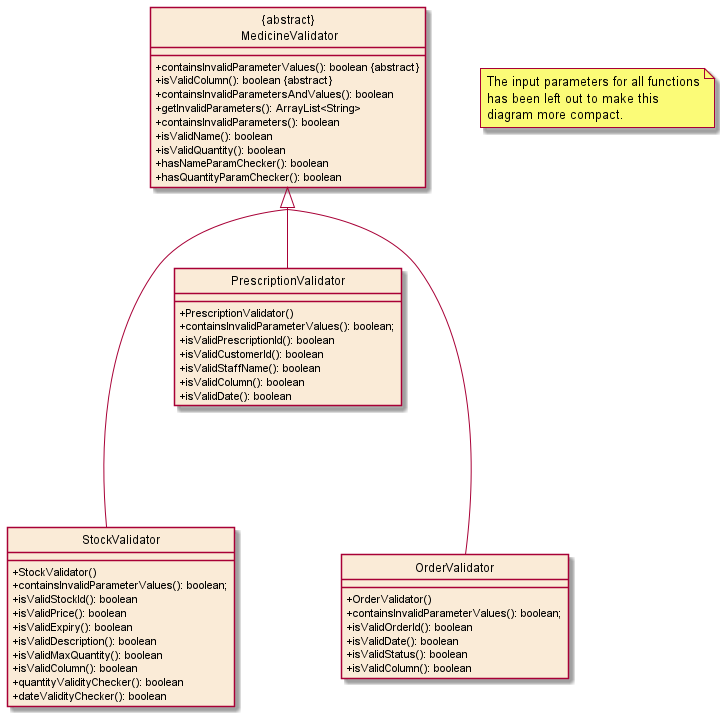
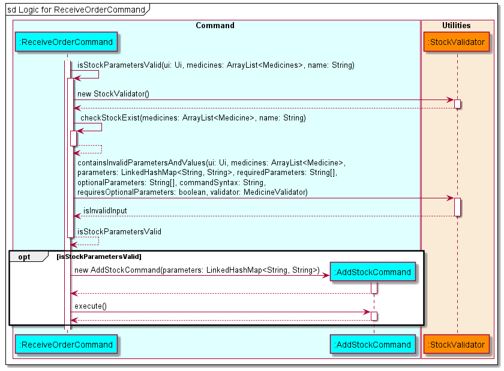

# Developer Guide

## Introduction

MediVault is a Command Line Interface (CLI) application that will help to manage medication supplies within a pharmacy.
It is an integrated solution that provides real-time tracking of stock, prescriptions and orders. The
purpose of this guide is to help developers set up and continue with the development of MediVault past version 2.0.

## Acknowledgements

* Inspiration for App Idea and OOP Structure: https://github.com/se-edu/addressbook-level2
* Inspiration for User Guide: https://se-education.org/addressbook-level3/UserGuide.html
* Inspiration for Developer Guide: https://se-education.org/addressbook-level3/DeveloperGuide.html
* PlantUML Tutorial: https://se-education.org/guides/tutorials/plantUml.html

## Contents

* [Glossary](#glossary)
* [Setting up environment](#setting-up-environment)
    * [Setting up](#setting-up)
    * [Before writing code](#before-writing-code)
* [Design](#design)
    * [Architecture](#architecture)
    * [Command](#command)
    * [Utilities](#utilities)
    * [Inventory](#inventory)
    * [Errors](#errors)
* [Implementation](#implementation)
    * [Main Logic](#main-logic)
    * [List Command](#list-command)
    * [Stock Commands](#stock-commands)
        * [AddStockCommand](#addstockcommand)
        * [DeleteStockCommand](#deletestockcommand)
        * [UpdateStockCommand](#updatestockcommand)
    * [Prescription Commands](#prescription-commands)
        * [AddPrescriptionCommand](#addprescriptioncommand)
        * [DeletePrescriptionCommand](#deleteprescriptioncommand)
        * [UpdatePrescriptionCommand](#updateprescriptioncommand)
    * [Order Commands](#order-commands)
        * [AddOrderCommand](#addordercommand)
        * [DeleteOrderCommand](#deleteordercommand)
        * [UpdateOrderCommand](#updateordercommand)
        * [ReceiveOrderCommand](#receiveordercommand)
    * [Archive Commands](#archive-commands)
        * [ArchivePrescriptionCommand](#archiveprescriptioncommand)
        * [ArchiveOrderCommand](#archiveordercommand)
* [Product Scope](#product-scope)
    * [Target user profile](#target-user-profile)
    * [Value proposition](#value-proposition)
* [User Stories](#user-stories)
* [Non-Functional Requirements](#non-functional-requirements)
* [Instructions for manual testing](#instructions-for-manual-testing)

## Glossary

## Setting up environment

### Setting up

1. Fork [this](https://github.com/AY2122S1-CS2113T-T10-1/tp/) repo, and clone the fork into your computer.
2. Ensure that you have [IntelliJ IDEA](https://www.jetbrains.com/idea/download/#section=windows)
   and [JDK 11](https://docs.aws.amazon.com/corretto/latest/corretto-11-ug/downloads-list.html) installed.
3. Configure the JDK
    * Follow the guide
      at [se-edu/guides IDEA: Configuring the JDK](https://se-education.org/guides/tutorials/intellijJdk.html) to ensure
      Intellij is configured to use JDK 11.

4. Import the project as a Gradle project
    * Follow the
      guide [se-edu/guides IDEA: Importing a Gradle project](https://se-education.org/guides/tutorials/intellijImportGradleProject.html)
      to import the project into IDEA.
    * Note: Importing a Gradle project is slightly different from importing a normal Java project.
5. Verify the setup
    * Locate the file `src/main/java/MediVault.java` then run the `MediVault.main()` and try a few commands
    * Run the [test](https://se-education.org/addressbook-level3/Testing.html) to ensure they all pass.

### Before writing code

1. Configure the coding style
    * If using IDEA, follow the
      guide [se-edu/guides IDEA: Configuring the code style](https://se-education.org/guides/tutorials/intellijCodeStyle.html)
      to set up IDEA’s coding style to match ours.
2. Set up CI
    * This project comes with a GitHub Actions config files (in `.github/workflows folder`). When GitHub detects those
      files, it will run the CI for your project automatically at each push to the `master` branch or to any PR. No set
      up required.
## Design

### Architecture

The **Architecture Diagram** for MediVault is shown below.

A quick overview of the main components and how they interact with each other is given below.

The main class that runs MediVault is called `MediVault`. It is responsible for,
* At program launch: Initializes the components in the correct sequence, and connects them up with each other.
* At shut down: Shuts down the components and invokes cleanup methods where necessary.

The rest of the program consist of four components.
* `Command`: Executes command based on the user input that is processed by `Utilities`
  component. The list of commands can be found in our User Guide [here](UserGuide.md).
* `Utilities`: Contains important driver classes for MediVault
  * includes `parser`, `ui`, `storage` and `comparators`.
* `Inventory`: Contains a collection of classes used by MediVault to represent
different medication information.
* `Errors`: Contains collection of classes that handles exceptions during execution of MediVault.

### Command

The **Command** class diagram above shows how **Command** interact with other classes in MediVault.

The Command Component consists of **18** subclasses where each subclass represents a command feature.

Let `*` be either of the three class: `Stock`, `Prescription` or `Order`.

* `Add*Command`: Adds a new `*` information into MediVault.
* `Delete*Command`: Removes the visibility of the `*` record in MediVault.
* `Update*Command`: Updates the `*` information.
* `List*Command`: Lists the `*` records.
* `ReceiveOrderCommand`: Marks an order as received and adds the ordered medication into the current stocks.
* `ArchivePresciptionCommand`: Archives all the prescription records before a given date.
* `ArchiveOrderCommand`: Archives all the order records before a given date.
* `PurgeCommand`: Wipes all records in MediVault.
* `HelpCommand`: Shows the help page.
* `ExitCommand`: Exits MediVault.

### Utilities

The class diagram below shows how the validator classes is implemented to help ensure that the user input is
valid. `StockValidator`, `PrescriptionValidator` and `OrderValidator` inherits from `MedicineValidator`. The class
methods are also shown in the diagram.

### Inventory

The class diagram below shows how the objects in MediVault is implemented. `Stock`, `Prescription`
and `Order` inherits from the abstract `Medicine` class. The attributes that each object has is also shown in the
diagram.

### Errors

- `InvalidCommandException` will be thrown when the user enters an invalid command.
- `InvalidDataException` will be thrown when MediVault encountered invalid data in the data files.

## Implementation

### Main Logic

The main application logic shows how the commands are handled throughout the application. Below is the outline of the
logic:

* MediVault is called by the `main` method which calls the constructor of MediVault. Data is then loaded from the
  `Storage` class to the application.
* MediVault gets the user input via the `Ui` class and uses the `CommandParser` class to parse the input given by the
  user.
* The parameters will be parsed to a `LinkedHashMap<String, String>` to make the parameters easily accessible.
* If a valid command is received, the `CommandParser` will call the `Command` object constructor and return the object
  to MediVault.
* MediVault will then invoke the `execute()` function of the `Command` object to execute the command.

> :warning: Warning
> * Should there be an invalid command, `CommandParser` will throw `InvalidCommandException` and MediVault will display the error message using the `Ui` class.

Given below is the sequence diagram after `run()` is called for the interactions within the main application logic.

### List Command

There are three variations of the list command.

1. `liststock`
2. `listprescription`
3. `listorders`

The sequence diagram below shows how the `list` operation works in general.

> :information_source: Replace `*` in the diagram with `Stock`, `Prescription` or `Order` depending on the command entered.

* All three variations of `list` are similar as they are implemented by iterating through the `Medicine` ArrayList and
  filtering out the respective object types.
* If the parameter `sort` or `rsort` is provided, the respective constructor of the `Comparator` classes will be invoked
  to help sort the ArrayList.
* For the rest of the valid command parameters, MediVault will do a **contains** comparison for strings and **equals**
  comparison for integers as well as dates except for `expiring` and `low` parameters where it will do a **less than or
  equal** comparison.
* `getAttributeValue()` represents all the get methods available in each of the respective classes. At the end of the
  execution the respective `print()` method from the `Ui` class will be called to display the respective tables.

### Stock Commands

#### AddStockCommand

MediVault creates an `AddStockCommand` object when CommandParser identifies `addstock` or `add` in `stock`
mode.
> :information_source: Note:
> * MediVault adds medicine stock when the `parameter` and `parameterValues` provided by the user are valid.
> * Users will not be able to input medication if `max_quantity` is less than `quantity`.
> * MediVault will ignore the `price`, `description` and `max_quantity` of user input if the same medication name and expiry date already exist.
> * MediVault will ignore the `description` and `max_quantity` of user input if the same medication name already exist.

The sequence diagram for `AddStockCommand` is shown below.

#### DeleteStockCommand

MediVault creates an `DeleteStockCommand` object when CommandParser identifies `deletestock` or the `delete` keyword
in `stock` mode.

* MediVault allows deletion of a stock by specifying stock id.
* MediVault allows deletion of expiring stocks by specifying an expiry date.

> :information_source: Note:
> * MediVault deletes medicine stock information when `parameter` and `parameterValues` provided by the user are valid.
> * MediVault performs a check to determine if it is executing deletion by stock id or deletion by expiry then executes
  accordingly.

The sequence diagram for `DeleteStockCommand` is shown below.

After MediVault determines that it is executing deletion by stock id, it will execute accordingly. Currently, it only
allows for deletion of 1 stock at a time.

The sequence diagram for deletion by stock id is shown below.

After MediVault determines that it is executing deletion by expiry date, it will execute accordingly. The behaviour of
this command is to delete all stock that have <= specified date. This is because we would want to delete all expired
stock and if a date is specified, all the date before will also be expired hence implement deletion of <= date.

The sequence diagram for delete by expiry date is shown below.

#### UpdateStockCommand

MediVault creates an `UpdateStockCommand` object when CommandParser identifies `updatestock` or
the `update` keyword in `stock` mode.

> :information_source: Note:
> * MediVault checks if `parameters` and `parameterValues` provided by the user are valid.
> * MediVault conducts another validation check on the provided `quantity`,`max_quantity` and `expiry`
against the stored medicine stock information.

The sequence diagram for `UpdateStockCommand` is shown below.

MediVault adds a new stock record when a user updates contains the `n/NAME` parameter. The old stock record still
exists in MediVault, but it will not be visible to user when listed. This approach solves the issue when a user is
unable to delete a prescription record when the medicine stock name gets updated.

### Prescription Commands

#### AddPrescriptionCommand

MediVault creates an `AddPrescriptionCommand` object when CommandParser identifies `addprescription` or  
`add` in `prescription` mode.

> :information_source: Note:
> * MediVault adds the prescription when the `parameter` and `parameterValues` provided by the user are valid.
> * MediVault will update the quantity left in the stock automatically after prescribing.
> * MediVault will prescribe medication with the earliest date if there are medication with multiple expiry dates.
> * Users will not be able to prescribe expired medication.
> * Users will not be able to prescribe medication if the quantity is more than the total stock quantity.

The sequence diagram for `AddPrescriptionCommand` is shown below.

#### DeletePrescriptionCommand

MediVault creates a `DeletePrescriptionCommand` object when CommandParser identifies `deleteprescription` or
`delete` in `prescription` mode.

> :information_source: Note:
> * MediVault deletes the prescription when the `parameter` and `parameterValues` provided by the user are valid.
> * MediVault will delete the prescription based on the user input of `PRESCRIPTION_ID`.
> * MediVault will add the prescription quantity to the stock quantity after successful deletion of prescription.
> * User will not be able to delete prescriptions if the total quantity after prescription will be more than the maximum
  quantity.

The sequence diagram for `DeletePrescriptionCommand` is shown below.

> :bulb: If the stock is deleted, MediVault will recover the stock and add the prescription quantity to the stock.

#### UpdatePrescriptionCommand

MediVault initialises an `UpdatePrescriptionCommand` class when CommandParser identifies
`updateprescription` or the `update` keyword in `prescription` mode.

> :information_source: Note
> * MediVault checks if the `parameters` and `parameterValues` provided by the user are valid.
> * When a user updates prescription information containing either `n/NAME`, `q/QUANTITY` or both, MediVault restores the 
prescribed stocks or prescribes more stocks depending on the user input.

The sequence diagram for `UpdatePrescriptionCommand` is shown below.

MediVault adds a new prescription record when a user updates contains either the `n/NAME`, `q/QUANTITY`
parameter or both. The old prescription record is **permanently removed** from MediVault. 

This approach solves the issue when a medication is prescribed to a user with an amount that is 
**more than** the current batch of stock with the same Stock ID but **less than** the total 
stock quantity. 

> :bulb: MediVault automatically adds new prescription records when a medication is prescribed
> from stocks with different Stock IDs.

### Order Commands

### AddOrderCommand

MediVault creates an `AddOrderCommand` object when CommandParser identifies `addorder` or the `add` keyword
in `order` mode.

* MediVault adds order information when `parameter` and `parameterValues` provided by the user are valid.
* As the order date is an optional parameter, MediVault will use the date the order was placed as the default date.
* Users will not be unable to add orders if the order quantity exceeds maximum stock quantity.

The sequence diagram for `AddOrderCommand` is shown below.

#### DeleteOrderCommand

MediVault creates a `DeleteOrderCommand` object when CommandParser identifies `deleteorder` or  `delete` in `order`
mode.

> :information_source: Note
> * MediVault deletes the order when the `parameter` and `parameterValues` provided by the user are valid.

The sequence diagram for `DeleteOrderCommand` is shown below.

#### UpdateOrderCommand

MediVault creates an `UpdateOrderCommand` object when CommandParser identifies
`updateorder` or the `update` keyword in `order` mode.

> :information_source: Note:
> * MediVault checks if the `parameters` and `parameterValues` provided by the user are valid.
> * MediVault restricts updating of order information that are already **delivered**.

The sequence diagram for `UpdateOrderCommand` is shown below.

### ReceiveOrderCommand

MediVault creates an `ReceiveOrderCommand` object when CommandParser identifies
`receiveorder` or the `receive` keyword in `order` mode.

> :information_source: Note:
> * MediVault will add the order to stock if the `parameters` and `parameterValues` provided by the user are valid.
> * `ReceiveOrderCommand` will call `AddStockCommand` once the `parameters` and `parameterValues` are validated.
> * If the order contains a medication already in stock, the `d/DESCRIPTION` and `m/MAX_QUANTITY` will be ignored
> and existing values will be used.

The sequence diagram for `ReceiveOrderCommand` is shown below.

### Archive Commands

#### ArchivePrescriptionCommand

MediVault creates an `ArchivePrescriptionCommand` object when CommandParser identifies `archiveprescription` or the 
`archive` keyword in `prescription` mode.

* MediVault archives prescription records by specifying a date.
* MediVault will remove prescription records that have date <= specified date and output it into the file named 
`data/prescription_archive.txt`

> :information_source: Note:
> * MediVault archive prescription information when `parameter` and `parameterValues` provided by the user are valid.
> * MediVault will output prescription information into a user readable format in `data/prescription_archive.txt`.
> * To modify the format, edit the code in `toArchiveFormat()` method in the Prescription Class.

The sequence diagram for ArchivePrescriptionCommand is shown below.

#### ArchiveOrderCommand

MediVault creates an `ArchiveOrderCommand` object when CommandParser identifies `archiveorder` or the
`archive` keyword in `order` mode.

* MediVault archives order records by specifying a date.
* MediVault will remove only DELIVERED order records that have date <= specified date and output it into the file named
`data/order_archive.txt`

> :information_source: Note:
> * MediVault archive order information when `parameter` and `parameterValues` provided by the user are valid.
> * MediVault will output order information into a user readable format in `data/prescription_archive.txt`.
> * To modify the format, edit the code in `toArchiveFormat()` method in the Order Class.

The sequence diagram for ArchiveOrderCommand is shown below.

## Product Scope

### Target user profile

* Pharmacist handling storing, ordering and dispensing of medication
* Has a need to manage large number of stocks in the pharmacy
* May forget how much medicine stock is left in the pharmacy
* Is a fast typist

### Value proposition

{Describe the value proposition: what problem does it solve?}

## User Stories

|Version| As a ... | I want to ... | So that I can ...|
|--------|----------|---------------|------------------|
|v1.0|pharmacist|list out all of the medicines currently on shelf| know the current quantity of the medicines on shelf
|v1.0|manager|be able to purge all data|start afresh
|v1.0|user|be able to exit the program|shutdown my computer
|v1.0|pharmacist|list the price of each medication| am aware of the price of each medication
|v1.0|pharmacist| be able to sort medication by price|recommend the customer the cheapest one if he asks
|v2.0|manager|see the pending orders to reflect in my current stocks|I won't double order on the same medication
|v2.0|pharmacist|search for records by a specific customer|I can see all his prescriptions
|v2.0|manager|be able to check who dispense what medication|know who is responsible for the prescription

## Non-Functional Requirements

{Give non-functional requirements}

## Instructions for manual testing

{Give instructions on how to do a manual product testing e.g., how to load sample data to be used for testing}