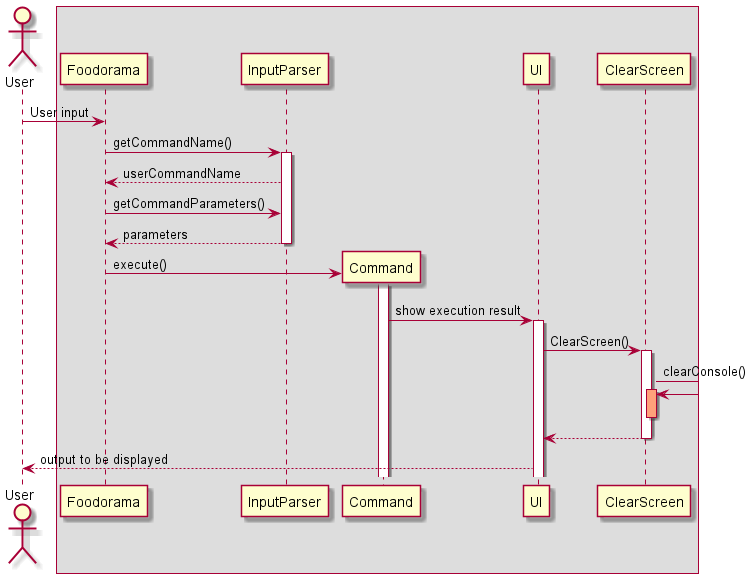
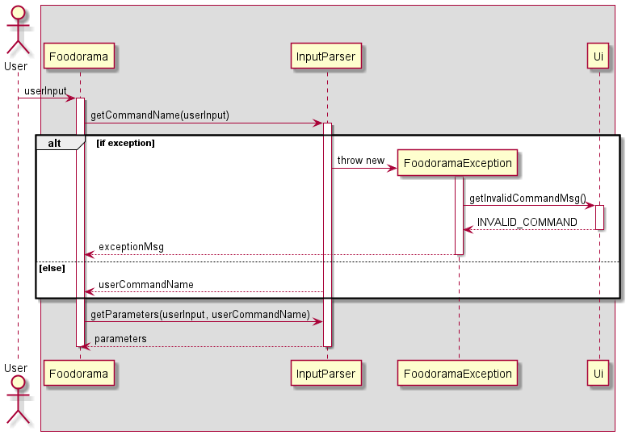
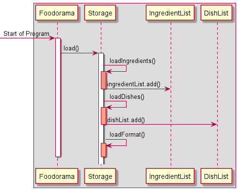
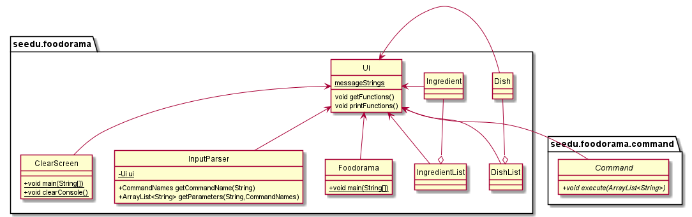

# Food-O-Rama Developer Guide ✍

## 🌑 Introduction
*Food-O-Rama* is a Java based Command-Line-Interface (CLI) application.

This Developer Guide serves to inform developers on the design and implementation of
*Food-O-Rama* to assist them in the development process of APIs. It also helps them 
realise the target user profile that motivated us to build this application.

## 🧾 Table of Contents

* [Acknowledgements](#-acknowledgements)
* [Setting Up & Getting Started](#-setting-up--getting-started)
* [Design & Implementations](#-design--implementation)
  * [General Flow](#general-flow)
  * [Input Parsing](#input-parsing)
  * [Storage](#storage)
  * [Data Structures](#data-structures)
  * [User-Interface Component](#user-interface-component)
  * [Exceptions](#exceptions)
  * [Command Abstraction](#command-abstraction)
* [Product Scope](#-product-scope)
  * [Target User Profile](#target-user-profile)
  * [Value Proposition](#value-proposition)
* [User Stories](#-user-stories)
* [Non-Functional Requirements](#-non-functional-requirements)
* [Glossary](#-glossary)
* [Instructions for Manual Testing](#-instructions-for-manual-testing)

## 👍 Acknowledgements

* [AddressBook Level-3](https://se-education.org/addressbook-level3/) for User Guide and Developer Guide reference.
* [PlantUML](https://plantuml.com/) for creation of UML diagrams.
* [Java-Clear-Console](https://www.delftstack.com/howto/java/java-clear-console/) for reference on clearing terminal.

## ⭐ Setting Up & Getting Started
1. Fork *Food-O-Rama*'s repository from [here](https://github.com/AY2122S1-CS2113T-W11-4/tp).
2. Clone the repository into your computer.
3. Import the project into your IDE.
4. For optimal results, it is recommended to use JDK 11.

## 📔 Design & Implementation

This section brings developers through the general flow of the programme, the various components involved, and the overall design of their
implementation.

### General Flow

Describes the step-by-step sequence from User Input to the Output.



* User is greeted by welcome screen.
* User begins typing inputs.
* Inputs get parsed by InputParser returning the appropriate Command.
* Command gets executed and respective output gets displayed.
* Once user is done using the application, he can send an exit message prompting a goodbye message.
* Application exits.

### Input Parsing

The `InputParser` class is responsible for deconstructing User Inputs to identify Commands and Parameters for execution.



* Gets command name of user input by checking if the users input starts with any of the strings that are defined for commands (add dish, list dish, help etc.).
* Throws an exception if no matching command is found.
* Takes rest of user input as parameterString.
* Based on command name splits the parameterString into respective parameters to respective command classes for execution.

### Storage

The `Storage` class is responsible for the reading and writing of *Food-O-Rama* data. Data is stored as .txt files under *'Data'* folder.

* After every operation writes the names of the Ingredient, weight of Ingredient Stored and weight of Ingredient Wasted, into a text file called `ingredients.txt`.
* After every operation writes the names of the Dish, weight of Dish Waste and constituents of the Dish if there are any, into a text file called `dishes.txt`.

#### Loading Data


* At the start of the program, Duke calls `Storage.load()`
  * This method in the `Storage` class is responsible for invoking `loadIngredients()`, `loadDishes()` and `loadFormat()`
* After accessing `ingredients.txt`, `ingredientList.add()` is called for every ingredient that exists in the list and is added to the active
ArrayList, `IngredientList.ingredientList`
* Then, after accessing `dishes.txt`, `dishList.add()` is called for every dish that exists in the list and is added to the active
  ArrayList, `DishList.dishList`
* Finally, the method also sets up the `formats.txt` file that contains all the relevant formats in which the data is saved along with examples
  * This is present in the load method as opposed to the write method as it only needs to be called once per run of *Food-O-Rama*
  
❕ *Note: `dishes.txt`,`ingredients.txt` and `formats.txt` can be found in the `data` folder from the root directory.*    

#### Saving Data


* After every command, Duke calls `Storage.write(Ingredient)`, then `Storage.write(Dish)`.
  * This method in the `Storage` class is responsible for writing to the respective text file depending on the mode.
* `Storage.write()` will access the respective text file and save to its respective save format.


* ❕ **Save Formats:**
  * Dishes
    * `DISH_NAME | DISH_WASTAGE | DISH_WASTAGE / NUM_OF_LINKED_INGREDIENTS | LIMIT | INGREDIENTS_LINKED`
    * ❕ Limit is -1 if limit has not been defined.
    * ❕ DISH_WASTAGE / NUM_OF_LINKED_INGREDIENTS is DISH_WASTAGE if no ingredients have been linked.
  * Ingredients
    * `INGREDIENT_NAME | INGREDIENT_STORAGE | INGREDIENT_WASTAGE | LIMIT`
    * ❕ Limit is -1 if limit has not been defined.

### Data Structures

The `Dish`, `DishList`, `Ingredient` and `IngredientList` classes are responsible for the handling and 
manipulation of the *Food-O-Rama* data.


* The `Dish` class contains the Dish's Name, its wastage and its constituents.
* The `Ingredient` class contains the Ingredient's Name, the weight of Ingredient in storage, the weight of Ingredient
wasted as well as the weight of Ingredient wasted from Dish wastage.
* The `DishList` class comprises an array of `Dish` along with Sort and Graph functions.
* The `IngredientList` class comprises an array of `Ingredient` along with Sort and Graph functions.
  * The Sort function arranges Dishes / Ingredients in descending order of their wastage.
  * The Graph function visualises the wastage of Dishes / Ingredients for easier analysis.

### User-Interface Component



The `Ui` Class is responsible for the printing of interactive messages whenever a user types an input. It handles print messages to the Command Line Interface from when the program loads, to after every input by the user and finally when the user exits the program.

The interface of the program utilizes the ClearScreen class to clear the terminal after every user input through the built-in `ProcessBuilder` Java class. Such a feature allows greater readability and focus for the user as the terminal will not be cluttered with past commands.
`Ui` will call `ClearScreen.clearConsole()` method to clear the terminal.

The ProcessBuilder class will send a respective command to the terminal depending on the Operating System of the user.
The command it sends to the terminal is as follows:
* `cls` for Windows CMD Terminals.
* `clear` for Linux/MacOS Terminals.

`ClearConsole()` Code Snippet:

```
 public static void clearConsole() {
        try {
            // Get current operating system
            String getOS = System.getProperty("os.name");

            if (getOS.contains("Windows")) {
                // Try clear for Windows
                // "/c" - execute string as command, "cls" -  Clear terminal
                ProcessBuilder pb = new ProcessBuilder("cmd", "/c", "cls");
                Process startProcess = pb.inheritIO().start();
                startProcess.waitFor();
            } else {
                // Try clear for MacOS/Linux
                // "clear" - Clear terminal
                ProcessBuilder pb = new ProcessBuilder("clear");
                Process startProcess = pb.inheritIO().start();
                startProcess.waitFor();
            }
        } catch (Exception e) {
            System.out.println(e);
        }
    }
```

### Exceptions

The `FoodoramaException` class is responsible for handling errors such as unrecognised user commands and 
improper parameters. It does so by calling the `Ui` class to print error messages that prompt the User to 
type in correct Commands/Parameters.

### Command Abstraction


* Different Command Classes that perform different tasks by calling various functions of the Object Classes.  
* All inherit from an abstract `Command` class with one execute method that takes an Arraylist<String> as input.

## 📂 Product Scope

Provides Developers with insights into our intended customers and the background to the problem to which
*Food-O-Rama* finds a solution.

### Target User Profile

Restaurant owners who will delegate their Inventory Management to Managers who are fast typists with experience in using
the Command Line Interface.

### Value Proposition

By presenting the wastage statistics, we can help restaurant owners figure out which dishes are contributing the most to
wastage at the restaurant. This way, they can allocate their resources more efficiently to better doing dishes. Thus we 
are reducing time wastage due to cooking of excess dishes and also saving money from purchasing unnecessary ingredients. 
Therefore, there’s a two-fold saving. Additionally, we are also contributing to reducing Singapore's contribution to 
global food wastage.


## 🎤 User Stories

Brings developers through the requirements of Users the *Food-O-Rama* team considered when building this programme.

| Version | As a ... | I want to ... | So that I can ... |
| -------- | ---------- | --------------- | ------------------ |
| v1.0 | Restaurant owner | Delete an entry for a particular dish | Change the tracking to adapt to a change in my menu |
| v1.0 | Restaurant owner | Use a help function | Get familiar with the application |
| v1.0 | Restaurant owner | Add an ingredient to be tracked | Keep track of the ingredient storage |
| v1.0 | Restaurant owner | Add a dish to be tracked | Track its wastage and its ingredients’ wastage |
| v1.0 | Restaurant owner | Add the weight of wastage of a dish | Know how much of a certain dish is being wasted |
| v1.0 | Restaurant owner | Calculate the Ingredients and Dishes wasted | Plan for future meal services to reduce food wastage |
| v2.0 | Restaurant owner | Find a particular Ingredient/Dish | Do not have to look through a long list of ingredients/dishes |
| v2.0 | Restaurant owner | Sort the Ingredients in descending order of Wastage | Determine which ingredients are wasted the most |
| v2.0 | Restaurant owner | Sort the Dishes in descending order of Wastage | Determine which dishes are wasted the most |
| v2.0 | Restaurant owner | Clear all the Dishes and/or Ingredients present in my data | Restart my data collection |
| v2.0 | Restaurant owner | View a graph of wastage for my Dishes and Ingredients | Understand the wastage trends of Dishes and Ingredients at a glance |
| v2.0 | Restaurant owner | Refresh my Command Line Interface after every User Command | Not have a cluttered terminal and instead focus on my tasks |

## 🚦 Non-Functional Requirements

* *Work offline:* User should be able to use *Food-O-Rama* without the need for Internet Access.
* *Cross-platform:* *Food-O-Rama* should be able to run on Windows, macOS and Linux operating systems without crashing.
* *Exceptions handling:* *Food-O-Rama* should be able to handle exceptions caused by User keying in erroneous inputs 
without crashing.
* *Accessibility:* Users with the .jar file should be able to use *Food-O-Rama* .

## 📒 Glossary

* <i>Mainstream OS </i> - Windows, Linux, Unix, OS-X.
* <i>Ingredient </i> - The basic unit required to create any Dish.
* <i>Dish </i> - Food prepared using a combination of Ingredients.
* <i>Wastage </i> - Weight of Dish or Ingredient wasted.

## 🧪 Instructions for Manual Testing

* For Manual Testing, you can write sample data into data text files (`dishes.txt` & `ingredients.txt`).
* Write data in appropriate format
  * Dishes: [DISH_NAME] | [WEIGHT_IN_KG (dishWaste)] | [dishWaste divided by number of constituents] | [Wastage limit (if present else -1)] | [ingredient 1|ingredient 2|etc]
    * Example: chicken rice|2.0|1.0|17.7|chicken|rice
  * Ingredients: [INGR_NAME] | [WEIGHT_IN_KG (ingrStored)] | [WEIGHT_IN_KG (ingrWasted)] | [Wastage limit (if present else -1)]
    * Example:chicken|2.33|1.0|22.2
* The appropriate formats are also present in a text file called formats.txt for your usage

