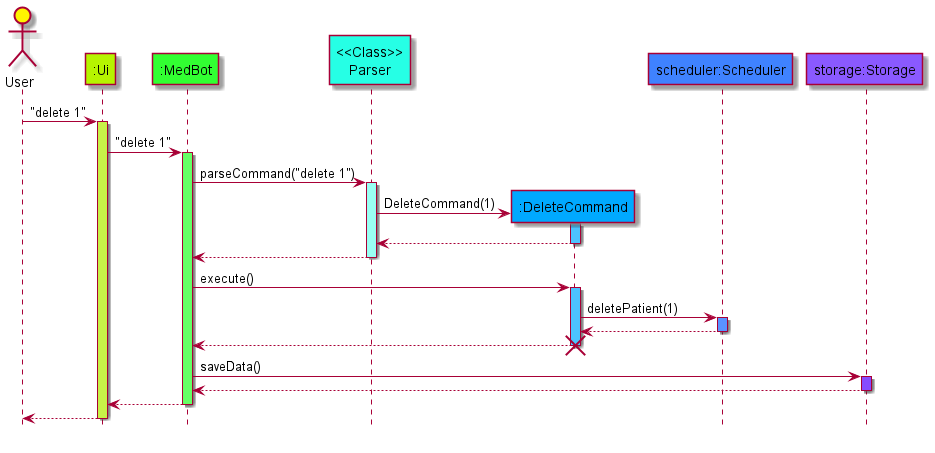
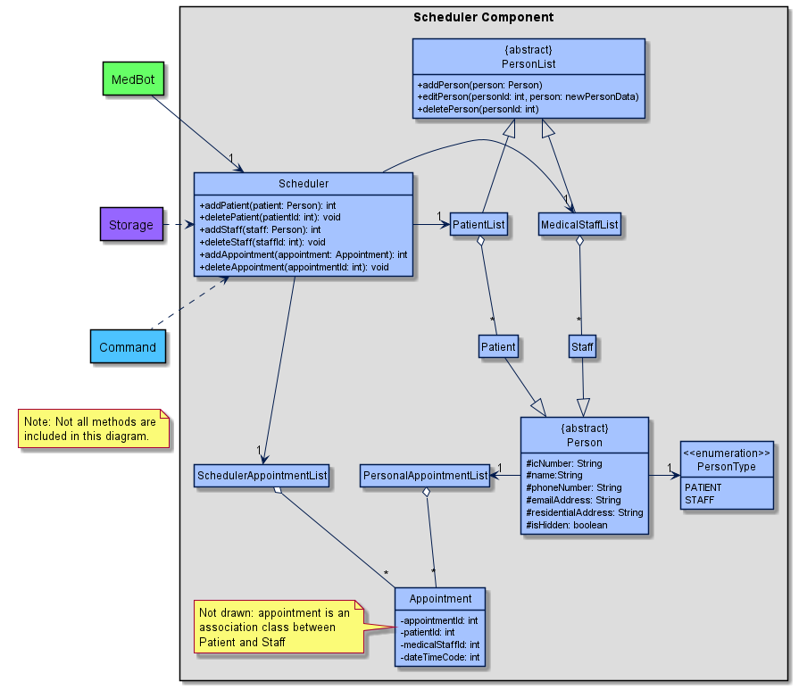

# Developer Guide

## Table of Content

- [1. Acknowledgements](#1-acknowledgements)
- [2. Introduction](#2-introduction)
- [3. Design](#3-design)
    - [3.1 Architecture](#31-architecture)
        - [3.1.1 Main Components](#311-main-components)
        - [3.1.2 Component Interaction](#312-component-interaction)
    - [3.2 Ui Component](#32-ui-component)
    - [3.3 Parser Component](#33-parser-component)
    - [3.4 Scheduler Component](#34-scheduler-component)
    - [3.5 Storage Component](#35-storage-component)
    - [3.6 Command Class](#36-command-class)
- [4. Implementation](#4-implementation)
    - [4.1 Switch View Feature](#41-switch-view-feature)
    - [4.2 Find Feature](#42-find-feature)
    - [4.3 Edit Feature](#43-edit-feature)
    - [4.4 Appointment Management](#44-appointment-management)
- [Appendix A: Product Scope](#appendix-a-product-scope)

## 1. Acknowledgements

* [SE-EDU AB3 Developer Guide Format](https://se-education.org/addressbook-level3/DeveloperGuide.html)

## 2. Introduction

MedBot is a Command Line Interface (CLI) application for head nurses to manage patients’ personal information, and
scheduler appointments between them and medical staff.

## 3. Design

### 3.1 Architecture

Given below is a quick overview of the main components of MedBot and how they interact with one another.

#### 3.1.1 Main Components


The main class of MedBot is the `MedBot` class. It is responsible for initialising the other core components of MedBot
at application startup and for handling the interactions between these components.

The 4 core components of MedBot are:

* `Ui`: Handles the UI of MedBot.
* `Parser`: Parses user inputs and creates `Command` objects.
* `Scheduler`: Holds data in memory and contains the methods to read and write to it.
* `Storage`: Loads data from, and stores data to the hard disk.

In addition, the `Command` class facilitates the execution of user instructions.

#### 3.1.2 Component Interaction

Given below is a simplified sequence diagram of how the core components of MedBot interact with each other when the user
inputs the command `delete 1`.



### 3.2 Ui Component

The Ui Component is handled by the `Ui` class. It is the main class that a user directly interacts with. This class is
responsible for reading user inputs and printing outputs to users.

The `Ui` class serves as an abstraction over these smaller classes:

* `PersonUi`: Handles the Ui for persons
    * `PatientUi`: Inherits `PersonUi` to handle patient-related Ui
    * `StaffUi`: Inherits `PersonUi` to handle staff-related Ui
* `SchedulerUi`: Handles the Ui for schedulers.

How `Ui` works:

* After user input is parsed by `Parser`, depending on the current `viewType`, the `Ui` will call methods from
  different `Ui` subclasses
    * When `viewType` is `PATIENT_INFO`, `PatientUi` methods are called.
    * When `viewType` is `MEDICAL_STAFF_INFO`, `StaffUi` methods are called.
    * When `viewType` is `SCHEDULER`, `SchedulerUi` methods are called.

Given below is a sequence diagram of how the `Ui` component works after the `Parser`
parses `help delete` input given by a user.


### 3.3 Parser Component

The Parser Component is responsible for parsing the user input and returning the corresponding command class to be
executed.

Here's a partial class diagram to better illustrate the Parser Component:


How the `Parser` component works:

* When `Parser` is called by MedBot to parse the user input, it will call the view specific parser `XYZCommandParser`
  depending on the current view type (`XYZ` is a placeholder for the specific command name eg. `PatientCommandParser`).
* The `XYZCommandParser` will then create and return the corresponding
  `XYZcommand` object by utilising the `ParserUtils` to help it process the user input.

The sequence diagram below better illustrates the working process described above:


<em>(User is trying to add a patient's information in the PatientInfoView)</em>

### 3.4 Scheduler Component

The Scheduler Component is responsible for the storage and modification of patient, staff and appointment information.

Here is a partial class diagram to better illustrate the Scheduler Component.



#### Scheduler Class

The `Scheduler` class consists of 3 internal lists, `patientList`, `medicalStaffList` and `schedulerAppointmentList`,
that store patient, staff and appointment information respectively. It has various public methods for the viewing and
modification of the information stored in the lists, and for the interfacing between the Scheduler and Storage
components. A `Scheduler` class object is instantiated upon MedBot startup.

#### How the Scheduler component works:

* When MedBot calls the `.execute(Scheduler, Ui)` method of a `Command` object, a corresponding method of the
  `Scheduler` object will be called.
* This method will then view or modify the patient, staff or appointment information as specified.

For example:

* When the `.execute(Scheduler, Ui)` method of an `AddStaffCommand` object is called, the `addStaff(Person)` method of
  the `Scheduler` object will be called.
* The `addStaff(Person)` method will then add the `Person` to the `medicalStaffList`

### 3.5 Storage Component

The Storage component is responsible for the storage of all patient and staff personal information, and appointment
details. It creates a directory MedBotData (if it doesn't already exist), and the text files MedBotData/patient.txt,
MedBotData/staff.txt and MedBotData/appointment.txt.

Here's a partial class diagram to better illustrate the Storage component:


#### How the Storage component works:

* When MedBot calls its `interactWithUser()` method, it initializes the `StorageManager` class
    * this initializes the `PatientStorage`, `StaffStorage` and `AppointmentStorage` classes.
* These three classes inherit from the `Storage` class.
* The `PatientStorage`, `StaffStorage` and `AppointmentStorage` objects will call the inherited `loadStorage()` method
  and read their respective text data files and read them back into the corresponding objects.
* After a command is executed, the object of `StorageManager` will call its `saveToStorage` method and thus call
  the `saveData()` method for all three inherited `Storage` objects, thus writing the storage data into the respective
  data text files.

### 3.6 Command Class

The Command class and its subclasses are responsible for handling the execution of user input.

Each individual Command object includes:

* `isExit()`: Return true only if it is an `ExitCommand` .
* `execute(Scheduler, Ui)`: Using the `Ui` class and data from the `Scheduler` to execute and print out the result to
  the user.
* Various attributes specific to the command, some common ones:
    * `id`: The id of `Person`/`Appointment` object to execute the command on.
    * `viewType`: The current `ViewType` of the program.

Three major types of Commands:

1. `Person` commands: to interact with person objects.
2. `Appointment` commands: to interact with the appointment between doctors/nurses and patients.
3. General commands: included are `help`, `exit`, `switch`, `getCurrentView`.

Given below are class diagrams of how the `Command` class and its subclasses are implemented.

#### Command class and general commands


#### Person-related commands


#### Appointment-related commands


## 4. Implementation

This section describes some noteworthy details on how certain features are implemented.

### 4.1 Switch view feature

#### Implementation

The switch view mechanism is heavily linked to the `Parser` class. By having a
`ViewType` enumeration property in `Parser`, the view of the console can be switched by executing the
appropriate `SwitchCommand` class, which modifies the corresponding `ViewType`
of the `Parser`. The 3 possible views and the corresponding user input commands are as follows:

* `switch p` or `switch 1` - switches to the patient info view.
* `switch m` or `switch 2` - switches to the medical staff info view.
* `switch s` or `switch 3` - switches to the scheduler view.
* `switch` - will switch to another view depending on the current view.

Each command evokes the `Parser#setViewType(ViewType)` method, which will set the corresponding
`ViewType` property in the `Parser` class. Additionally, the `Ui#clearConsoleFromIde` method will
be evoked, which performs a pseudo clear of the console before printing a message that indicates
the user has switched view.

#### Design Considerations:

**Aspect: How console is cleared:**
* Alternative 1(Current Choice)
  * Perform a pseudo-clear using multiple `System.lineSeparator()` to move the current console outputs
    upwards.
    * Pros: Easy to implement, system independent
    * Cons: Only works for terminals up to a certain size (bigger terminals can still see previous console outputs)
  * Perform an actual clear using the `ProcessBuilder` / `Runtime` class in java.
    * Pros: Size of terminal doesn't matter since it actually clears the console.
    * Cons: More complex implementation, need to consider different sets of implementation for different OSes,
            does not work on IDE.
    

### 4.2 Find feature

#### Functionality

This command will find a list of `Person` that match the given attributes in a table format.

#### Implementation

The `find` feature is facilitated by the `FindPersonCommand` class. It extends from `Command` class and overrides
the `execute()` method to achieve the desired functionality.

The example below gives a direction on how this command behaves.

Step 1.
<br>
A User execute the `find n/John` command. The `Parser#parseCommand()` method will parse this command and eventually
returns a `new FindPatientCommand()` object.

Step 2.
<br>
The `MedBot#interactWithUser()` method will run the `execute()` method in the `new FindPatientCommand()` object.

Step 3.
<br>
The `execute()` method will call `PersonList#findPersons()` method with the parameter `n/John` passed in.

Step 4.
<br>
`PersonList#findPersons()` will check all the `persons` list and returns all `Person` in the list whose name contains
the string `john`. The attribute match is case-insensitive.

Step 5.
<br>
The filtered `Person` list is then passed into the `Ui` class to be displayed into a table format through
`Ui#getFindPatientsMessage()`.

### 4.3 Edit feature

#### Functionality

This command will edit a specified `Person` object with the attributes given in the command.

#### Implementation

The `edit` feature is facilitated by the `EditPersonCommand` class. It extends from `Command` class and overrides
the `execute()` method to achieve the desired functionality.

The example below gives a direction on how this command behaves.

Step 1.
<br>
A User execute the `edit n/John` command when the attribute `Parser#viewType` is `PATIENT_INFO`.
The `Parser#parseCommand()` method will parse this command and eventually returns a `new EditPatientCommand()` object.

Step 2.
<br>
The `MedBot#interactWithUser()` method will run the `execute()` method in the `new EditPatientCommand()` object.

Step 3.
<br>
The `execute()` method will call `PersonList#editPerson()` method with the new `Person` object having the parameter
`n/John` passed in. (All other attributes of the object are set to `null`)

Step 4.
<br>
`PersonList#editPerson()` will attempt to replace all attributes of the old `Person`
object with the non-null attributes given in the new `Person`.

Step 5.
<br>
The edited `Person` is then passed into the `Ui` class to be displayed through`Ui#getEditPatientMessage()`.

### 4.4 Appointment management

#### Functionality

The appointment management feature is designed to allow head nurses to schedule appointments between medical staff and
patients while ensuring that there are no appointment clashes for both staff and patients.

Below is a list of key design considerations for this feature:

* Upon adding/editing an appointment, MedBot will check if the new appointment clash with an existing appointment and
  prevent such additions/edits.
* Users should be able to edit the date/time of appointments to reschedule appointments, or to fix mistakes.
    * Users should also be able to change the staff involved in that appointment for cases where the original staff is
      not available, or to fix mistakes.
    * Users should also be able to change the patient involved in that appointment to allow for the rearranging of
      appointments, or to fix mistakes.
* Users should be able to view a list of all appointments in the system.
* Users should be able to view a list of all appointments for a particular patient/staff.

#### Implementation

Appointment management is performed by the `Scheduler` class and involves the storage and modification of `Appointment`
class objects. Appointments are managed on an hourly basis.

The `Appointment` class is an association class between `Patient` and `Staff`, with additional `appointmentId` and
`dateTimeCode` attributes. It is stored in the `SchedulerAppointmentList` class object in the `Scheduler` class and in
`PersonalAppointmentList` class objects in each `Person` class object.

The `SchedulerAppointmentList` object keeps track of all appointments in the system. This allows for the viewing of all
appointments in the system. The object consists of a `HashMap` that stores `Appointment` objects with their
`appointmentId` as their key, this prevents the system having multiple `Appointment` objects of the same
`appointmentId`.

The `PersonalAppointmentList` object in each `Person` class object keeps track of the appointments of that person. This
allows for the viewing of all appointments of that person. The object consists of a `TreeSet` that stores `Appointment`
objects with their `dateTimeCode` as the comparable value. This prevents the system from adding clashing appointments to
a patient/staff and allows their appointments to be listed by their date.

Below is a simplified sequence diagram of the `addAppointment(Appointment)` method in the `Scheduler` class:


## Appendix A: Product scope

### Target user profile

Head nurses who prefer using Command Line Interface(CLI) instead of traditional Graphical User Interface (GUI)
for their daily jobs

### Value proposition

1. Easily manage patient info, consultation requirements
2. Easily manage nurse/doctor schedules
3. Assign nurses/doctors to visit patients at specific times

## Appendix B: User Stories

|Version| As a ... | I want to ... | So that I can ...|
|--------|----------|---------------|------------------|
|v1.0|new user|see usage instructions|refer to them when I forget how to use the application|
|v1.0|user|add a new patient's information|track new patients admitted to the hospital|
|v1.0|user|remove a patient's information|discharged patients will no longer be tracked by the system|
|v1.0|user|edit a patient's information|rectify data entry errors or reflect changes in personal details|
|v2.0|user|add appointment timeslots for medical staff|easily administer their visiting hours|
|v2.0|user|be informed if there are any conflicting visiting timings for medical staff|reschedule to more appropriate timings.
|v2.0|user|edit appointment timeslots for medical staff|account for changes in schedule of the medical staff|
|v2.0|user|see all available appointment timeslots for medical staff|I will not assign any conflicting timings|
|v2.0|user|filter appointments by date/time|I can decide how to assign new appointments more quickly|

## Appendix C: Non-Functional Requirements

1. Should work on any *mainstream OS* as long as it has Java `11` or above installed.
2. A user with above average typing speed for regular English text (i.e. not code, not system admin commands) 
   should be able to accomplish most of the tasks faster using commands than using the mouse.
3. Should be able to hold up to a thousand appointments and patient/staff records without any noticeable decrease in
   performance.

## Appendix D: Glossary

* *Mainstream OS* - Windows, Linux, Unix, OS-X

## Appendix E: Instructions for manual testing

Here are the instructions to perform manual testing of the application:

### Launch and exit

1. Initial launch
    1. Please follow the instructions in
       the [Quick Start Guide](https://github.com/AY2122S1-CS2113-T13-1/tp/blob/master/docs/UserGuide.md#quick-start-guide)
       to launch the application.
    2. Enter `exit` to quit MedBot.

### Switching Views

1. Switching between the different views of MedBot
    1. Test case: `switch`
       Expected: MedBot will switch to the next view, in this order:
       (PATIENT_INFO --> MEDICAL_STAFF_INFO --> SCHEDULER --> PATIENT_INFO)
    2. Test case: `switch m` when in PATIENT_INFO view or SCHEDULER view Expected: MedBot will switch to
       MEDICAL_STAFF_INFO view, and print:
    ``` 
    ___ _____ _   ___ ___  
    / __|_   _/_\ | __| __| 
    \__ \ | |/ _ \| _|| _|  
    |___/_|_/_/_\_\_| |_|   
    |_ _| \| | __/ _ \      
    | || .` | _| (_) |     
    |___|_|\_|_|_\___/    __
    \ \ / /_ _| __\ \    / /
    \ V / | || _| \ \/\/ / 
    \_/ |___|___| \_/\_/  

    View has been switched to MEDICAL_STAFF_INFO
    ```
    4. Test case: `switch 3` when in the `SCHEDULER` view Expected: View remains the same,
       prints: `You are already in the Scheduler view.`
    5. Test case (invalid command): `switch 100`, `switch abc`, ... Expected: View remains the same,
       prints: `Invalid view type code.`

### Get current view

1. Get the current view type of MedBot
    1. Test case: `get view` when in the `SCHEDULER` view Expected: `You are currently in the Scheduler's View.`

### Accessing user guide

1. Prints out useful information on how to use MedBot. Help information is dependent on the current view.
    1. Test case: `help` in SCHEDULER view. Expected:
    ```
    Here are the list of commands:

    help
    add
    list
    view
    edit
    find
    delete
    get view
    switch
    exit

    To obtain more information on each command and their respective required inputs, type:
    help [COMMAND]

    *Note that all commands will remove any '|' inputs for format parsing purposes. For 
    examples of the expected output, please refer to the actual user guide.
    ```
    2. Test case: `help add` in PATIENT_INFO view Expected:
    ```
    Adds a patient to the patient list.
    Format:
    add i/PATIENT_IC [n/NAME] [p/PHONE_NUMBER] [e/EMAIL] [a/ADDRESS]
    ```
    3. Test case (Invalid commands): `help abc` in any view Expected: `Unable to parse command.`

### Patient/Medical Staff Information Commands

1. The commands for `PATIENT_INFO_VIEW` and `STAFF_INFO_VIEW` are the same, but apply to patients and staff
   respectively.
   `PATIENT_INFO_VIEW` examples will be used here, but feel free to test the same commands for `STAFF_INFO_VIEW`.
2. Note that the Patient ID/STAFF ID will be dependent on the existing patients/staff that exist in MedBot. But they
   will be unique.
3. The expected output of the test cases below assumes that the commands are executed in the order that they are
   presented.

#### Adding a patient

1. Adds a patient to the patient list.
    1. Test case: `add i/S7812345X n/John Doe p/87654321 e/john.doe@gmail.com a/John Street, block 1234, #01-01`
       Expected:
    ```
    Added patient with Patient ID: 1
    IC: S7812345X
    Name: John Doe
    H/P: 87654321
    Email: john.doe@gmail.com
    Address: John Street, Block 1234, #01-01
    ```
    2. Test case: `add e/jimbob@hotmail.com n/jIm boB`
       Expected:
    ```
    Added patient with Patient ID: 2
    IC: 
    Name: Jim Bob
    H/P: 
    Email: jimbob@hotmail.com
    Address: 
    ```
    3. Test case `add n/Raven Darkholme i/S8912345A`
       Expected:
    ```
    Added patient with Patient ID: 3
    IC: S8912345A
    Name: Raven Darkholme
    H/P: 
    Email: 
    Address: 
    ```

    4. Test case (Invalid command): `add h/`
       Expected: `"h/" is not a valid attribute specifier`
    5. Test case (Invalid command): `add i/S7812345X`
       Expected: `The patient with IC S7812345X is already in the record.`

#### Delete a patient

1. Deletes a patient from the list.
    1. Test case: `delete 3`
       Expected: `Patient with id 3 deleted from system.`
    2. Test case: `delete 4`
       Expected: `No Patient with ID 4 found.`
    3. Test case (Invalid command): `delete asd`
       Expected: `ID not specified or not a number.`

#### View a patient's information

1. View a patient's information.
    1. Test case: `view 2`
       Expected:
    ```
    Here's the requested patient:

    Patient ID: 2
    IC: 
    Name: Jim Bob
    H/P: 
    Email: jimbob@hotmail.com
    Address: 
    ```
    2. Test case (Invalid command): `view 89`
       Expected: `No Patient with ID 89 found.`

//TODO check if link works

#### Hide a patient

1. Hides a patient in the list. Refer to [this](#List-infromation-of-all-current-patients) on how `hide` affects `list`
    1. Test case: `hide 2`
       Expected: `The patient with ID: 2 is now hidden.`
    2. Test case: `hide 1`
       Expected: `The patient with ID: 1 is now hidden.`
    3. Test case (Invalid command): `hide ab`
       Expected: `ID not specified or not a number.`

#### Show a patient

1. Show a previously hidden patient in the list. Refer to [this](#List-infromation-of-all-current-patients) on
   how `show` affects `list`
    1. Test case: `show 1`
       Expected: `The patient with ID: 1 is now not hidden.`
    2. Test case: `show ab`
       Expected: `ID not specified or not a number.`

#### List information of all current patients

1. List all patients in the patient list.
2. `list` shows all non-hidden patients.
3. `list -h` shows all hidden patients.
    1. Test case: `list`
       Expected:
    ```
    Here is a list of all patients:
    For full details of each patient, please use the command "view PATIENT_ID"
    ----------------------------------------------------------------------------------------------------- 
    |  ID  | IC Number |         Name         | Phone No. |        Email         |       Address        | 
    ----------------------------------------------------------------------------------------------------- 
    | 1    | S7812345X | John Doe             | 87654321  | john.doe@gmail.com   | John Street, Bloc... | 
    ----------------------------------------------------------------------------------------------------- 
    ```
    2. Test case: `list -h`
       Expected:
    ```
    Here is a list of all patients:
    For full details of each patient, please use the command "view PATIENT_ID"
    ----------------------------------------------------------------------------------------------------- 
    |  ID  | IC Number |         Name         | Phone No. |        Email         |       Address        | 
    ----------------------------------------------------------------------------------------------------- 
    | 2    |           | Jim Bob              |           | jimbob@hotmail.com   |                      | 
    ----------------------------------------------------------------------------------------------------- 
    ```
    3. Test case: `list -l`
       Expected: `Parameter type specified is not valid.`

#### Edit information of a patient

1. Edits a patient's personal information.
    1. Test case: `edit 1 p/99999999 n/John Xavier Doe `
       Expected:
    ```
    Patient ID: 1
    IC: S7812345X
    Name: John Xavier Doe
    H/P: 99999999
    Email: john.doe@gmail.com
    Address: John Street, Block 1234, #01-01
    ```
    2. Test case (Invalid command): `edit 898 n/BOb`
       Expected: `No Patient with ID 898 found.`

#### Find patients based on attributes

1. Search for (non-hidden) patients whose attributes contain the given search query.
    1. Test case: `find i/12345`
       Expected:
    ```
    Patient ID: 1
    IC: S7812345X
    Name: John Xavier Doe
    H/P: 99999999
    Email: john.doe@gmail.com
    Address: John Street, Block 1234, #01-01
    ```
    2. Test case (Invalid command): `find g/`
       Expected: `The specifier g/ is invalid.`

### Scheduler Commands

* Run the following commands before running the `Scheduler` commands to populate the patient and medical staff lists
  with more data:
    1. `switch 1`
    2. `add n/Sasha Alexander i/S8367812K p/91238765 a/Mauville City 2nd Street`
    3. `switch 2`
    4. `add n/Doctor One i/S8754321B p/81819191 a/American Gardens Building West 81st Street e/doctorone@hospital.net`
    5. `add n/Nurse One i/S9171234D p/91234566 a/Petalburg City Route 103 e/nurseone@hospital.net`
    6. `switch 3`

#### Adding an appointment

1. Adds an appointment to the scheduler list. MedBot will check if there are any clashes in the appointments and display
   and error message if there are any.
2. The format for DATE_TIME is DDMMYY hhmm. I.e. 9 February 2021, 0800HRS should be written as 090221 0800
3. Do note that the appointments are managed at an hourly basis. For example, any appointments set to any time between
   0800HRS and 0859HRS will be treated as an appointment from 0800HRS to 0859HRS. No subsequent appointment can then be
   scheduled for either the patient and the medical staff during that window.
    1. Test case: `add p/1 s/1 d/011221 0900`
       Expected:
    ```
    Added appointment with Appointment Id: 1
    Patient ID: 1
    Staff ID: 1
    Date/Time: 01 Dec 21 0900HRS
    ```
    2. Test case: `add p/1 s/2 d/011221 1000`
       Expected:
    ```
    Added appointment with Appointment Id: 2
    Patient ID: 1
    Staff ID: 2
    Date/Time: 01 Dec 21 1000HRS
    ```
    3. Test case: `add p/1 s/2 d/011221 1105`
       Expected:
   ```
   Added appointment with Appointment Id: 3
   Patient ID: 2
   Staff ID: 2
   Date/Time: 01 Dec 21 1100HRS
   ```
    4. Test case (Invalid): `add p/2 s/1 d/011221 0900`
       Expected: `Staff unavailable, appointment 1 at that time. `
    5. Test case (Invalid): `add p/1 s/2 d/01122123`
       Expected: `Incorrect Date/Time format.`

#### Delete an appointment

1. Delete an appointment from the scheduler.
    1. Test case: `delete 2`
       Expected: `deleted appointment with Id: 2`
    2. Test case: `delete 89`
       Expected: `No appointment with ID 89 found.`

//TODO format change?? for output

#### Editing an appointment's information

1. Edit an appointment's information
    1. Test case: `edit 3 s/1`
       Expected:
    ```
    Appointment 3 changed to Appointment Id: 3
    Patient ID: 2
    Staff ID: 1
    Date/Time: 01 Dec 21 1100HRS
    ```
    2. Test case (Invalid): `edit 3 d/011221 0900`
       Expected: `Staff unavailable, appointment 1 at that time.`

#### Viewing an appointment's information

1. View an appointment's information
    1. Test case: `view 1`
       Expected:
    ```
    Appointment Id: 1
    Patient ID: 1
    Staff ID: 1
    Date/Time: 01 Dec 21 0900HRS
    ```
    2. Test case (Invalid): `view 9`
       Expected: `No appointment with ID 9 found.`

#### Listing information of all appointments

1. List the information of all appointments, including those of hidden patients and medical staff.
    1. Test case: `list`
       Expected:
    ```
    Here is a list of all appointments:
    -------------------------------------------------------------------------------------------------- 
    |  ID  |     Date/Time     | Patient ID |     Patient Name     | Staff ID |      Staff Name      | 
    -------------------------------------------------------------------------------------------------- 
    | 1    | 01 Dec 21 0900HRS | 1          | John Xavier Doe      | 1        | Doctor One           | 
    | 3    | 01 Dec 21 1100HRS | 2          | Jim Bob              | 1        | Doctor One           | 
    -------------------------------------------------------------------------------------------------- 
    ```

### Saving data

    1. Dealing with missing or corrupted data files


    //TODO to preload MedBot with some data right away.... 
