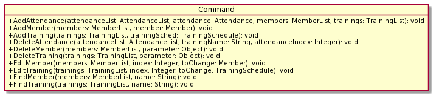
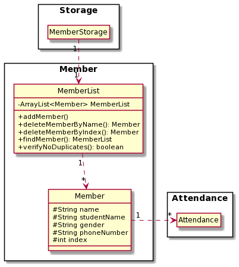
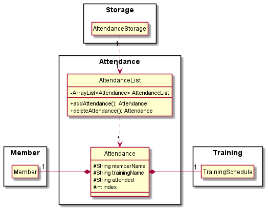

# Developer Guide

* [Introduction](#introduction)
* [Acknowledgements](#acknowledgements)
* [Setting Up](#setting-up)
* [Design](#design)
  * [Architecture](#architecture)
  * [UI](#ui-component)
  * [Parser](#parser-component)
  * [Entry](#entry-component)
  * [Command](#command-component)
  * [Member](#member-component)
  * [Training](#training-component)
  * [Attendance](#attendance-component)
  * [Storage](#storage-component)
* [Restrictions](#restrictions)
* [Appendix: Requirements](#appendix-requirements)
  * [Product Scope](#product-scope)
  * [User Stories](#user-stories)
  * [Non-functional Requirements](#non-functional-requirements)
  
## Introduction

CCA Manager is a **simple and easy to use** organisational planner for CCAs (Co-Curricular Activities) in NUS. It is 
designed specifically for students who are key appointment holders of such CCAs. Features include **storing and tracking
of information** on CCA members, training schedules and attendance records which can be accessed quickly via a Command
Line Interface (CLI). CCA Manager aims to **centralise and optimize** all CCA-related information, so that you can focus on
improving other aspects of the CCA.

**CCA Manager** is written in `Java 11` and designed with OOP (Object Oriented Programming) as a guideline to help design a modular and organized structure for the application.

Prerequisites: JDK 11, update Intellij to the most recent version.

## Acknowledgements
* SE-EDU
  1. [AB3 Developer Guide Format](https://se-education.org/addressbook-level3/DeveloperGuide.html)
  2. [AB3 User Guide Format](https://se-education.org/addressbook-level3/UserGuide.html)
  3. [AB3 Appendix: Requirements](https://se-education.org/addressbook-level3/DeveloperGuide.html#appendix-requirements)
  4. [AB2 Code Basics](https://github.com/se-edu/addressbook-level2)
* [PlantUML](https://plantuml.com/)

## Setting Up

**CCA Manager** is written in `Java 11`, which you can download [here](https://docs.aws.amazon.com/corretto/latest/corretto-11-ug/downloads-list.html).

You can retrieve the latest JAR version of **CCA Manager** [here](https://github.com/AY2122S1-CS2113T-F12-4/tp/releases)

You can retrieve the source code for **CCA Manager** [here](https://github.com/AY2122S1-CS2113T-F12-4/tp). You can refer [here](https://docs.github.com/en/repositories/creating-and-managing-repositories/cloning-a-repository) 
to learn how to fork and clone the repository of **CCA Manager** into your local workstation.

We recommend the use of [IntelliJ](https://www.jetbrains.com/idea/download) when working on **CCA Manager**.

## Design

### Architecture

The **architecture diagram** above presents a high-level overview of CCA Manager.

**Components of the architecture**

* [`UI`: UI of CCA Manager](#ui-component)
* [`Parser`: Parses user inputs into `keywords`](#parser-component)
* [`Entry`: Converts `keywords` from `Parser` into `commands` to run](#entry-component)
* [`Command`: Executes a command based on `keyword` given](#command-component)
* [`Members`: Stores member details as `Member` objects in `MemberList`](#member-component)
* [`Training`: Stores training details as `TrainingSchedule` objects in `TrainingList`](#training-component)
* [`Attendance`: Object that links a `Member` to a `TrainingSchedule`](#attendance-component)
* [`Storage`: Stores details of `Members`, `Training` and `Attendance` in hard disk space](#storage-component)

**Components Interaction**

The *sequence diagram* below shows how various components of the architecture interact with one another when a user inputs a **valid** command `"add /m Bob /s A01231234B /p 98765432"`

### **Note:**
* Examples below have their arguments removed for the sake of brevity
* `waitForQuery()`: Blocks until a user input is received.
* `getKeywordStatus()`: Given user input, return the `keyword`.
* `getMemberDetails()`: Given user input, return a `Member` object with all information from user input.
* `addMember()`: Calling a class that creates a new `Member` object and adds it to the MemberList `members`.
* `members.addMember()`: Adds a Member `member` to MemberList `members`.
* `writeMemberFile()`: Writes the content of MemberList `members` to the File `memberFiles`, which should be a `.csv` file in hard drive.

The *sequence diagram* below shows how various components of the architecture interact with one another when a user inputs a **valid** command `"delete /m 1"`

### **Note:**
* `getKeywordStatus()`: Gets the keyword value from the Keyword enum class.
* `deleteMember(members, entry)`: Deletes the member from the memberList.
* `deleteMemeber(memberNumber)`: Deletes the member using the index number provided by the user.
* `writeMemberFile()`: Writes the data to the csv file.

The sections below give more details of each component.

### UI Component

*Hint: You can click on the Application Programming Interface (API) links to be redirected to its source code!*

**API** : [Ui](https://github.com/AY2122S1-CS2113T-F12-4/tp/blob/master/src/main/java/seedu/duke/Ui.java)

The `Ui` component handles the **output display** of **CCA Manager**. Whenever the user enters a command, the `Ui` class will print a message corresponding to the user input.
**Current Functionalities**:
* Display message on start-up.
* Help message when user inputs `--help`.
* Listing of `Members` in `MemberList`.
* Listing of `Training` in `TrainingList`.
* Listing of `Attendance` in `AttendanceList`.
* Displaying error messages on invalid command inputs.
* Displaying success messages on valid command inputs.

### Parser Component

**API** : [Parser](https://github.com/AY2122S1-CS2113T-F12-4/tp/blob/master/src/main/java/seedu/duke/Parser.java)

The `Parser` component handles the **input parsing** of **CCA Manager**. User input is parsed to produce a `keyword` and corresponding inputs, such as `index` , `name`, etc. are identified.

A `keyword` is an identifier used by **CCA Manager** to determine what operation (`add`, `edit`, `delete` or `list`) to do.

**Current Functionalities**:
* Retrieving `keyword` from user input.
* Create a `TrainingSchedule` object from user input.
* Create a `Member` object from user input.
* Create a `Attendance` object from user input.

### Entry Component

**API** : [Entry](https://github.com/AY2122S1-CS2113T-F12-4/tp/blob/master/src/main/java/seedu/duke/Entry.java)

The `Entry` component performs a `command` based on the `keyword` given. If the user enters an invalid command, for example, the `Entry` component will direct the `Ui` component
to print an error message. It uses simple `switch-case` statements to handle the different `keyword` received.

### Command Component

**API** : [Command](https://github.com/AY2122S1-CS2113T-F12-4/tp/tree/master/src/main/java/seedu/duke/command)

The `Command` component directly interacts with the `Member`, `Training` or `Attendance` component based on the `keyword` given in order to perform a specific operation.

**Current Functionalities**
* Adding `Member` to `MemberList` in [Member Component](#member-component).
* Adding `TrainingSchedule` to `TrainingList` in [Training Component](#training-component).
* Adding `Attendance` to `AttendanceList` in [Attendance Component](#attendance-component).
* Deleting `Member` from `MemberList` in Member Component.
* Deleting `TrainingSchedule` from `TrainingList` in Training Component.
* Deleting `Attendance` from `AttendanceList` in Attendance Component.
* Editing a field in `Member`
* Editing a field in `Training`
* Finding a specific `Member` in `MemberList`
  * `Search by index` and `Search by member name` is supported.
* Finding a specific `TrainingSchedule` in `TrainingList`
  * `Search by index` and `Search by training name` is supported.

<!-- @@author Teckwhye -->
### Member Component

**API** : [Member](https://github.com/AY2122S1-CS2113T-F12-4/tp/tree/master/src/main/java/seedu/duke/member)

The `Member` component,
* instantiates an `MemberList` object comprising 0 `Member` objects.
* stores inputted `Member` objects in a list as an `ArrayList<Member>` in `MemberList` class.
* stores the `MemberList` object in a csv file with the help of `MemberStorage`.

 <!-- @@author -->

### Training Component

**API** : [Training](https://github.com/AY2122S1-CS2113T-F12-4/tp/tree/master/src/main/java/seedu/duke/training)

The `Training` component consists of `TrainingList` and `TrainingSchedule`. Information regarding Trainings, such as `name`, `date/time` and `venue` are handled by the `Training` component.

**Current Functionalities**

The `Training` component,
* instantiates a `TrainingList` object of 0 `TrainingSchedule` objects
  * `TrainingSchedules` in a `TrainingList` hold an `Index` that **CCA Manager** uses in relevant commands, such as `delete by index` or `find by index`
* `TrainingSchedule` is an object that holds the information of CCA information, such  as:
  * Training Name
  * Training Date
  * Training Venue

### Attendance component

**API** : [Attendance](https://github.com/AY2122S1-CS2113T-F12-4/tp/tree/master/src/main/java/seedu/duke/attendance)

The `Attendance` component,
* instantiates an `Attendance` object comprising of 1 `Member` object and 1 `TrainingSchedule` object.
* stores inputted `Attendance` objects in a list as an `ArrayList<Attendance>` in `AttendanceList` class.
* stores the `AttendanceList` object in a csv file with the help of `AttendanceStorage`.

### Storage component

**API** : [Storage]()

The `Storage` component consists of 3 sub-components, corresponding to `member storage` , `attendance storage` 
and `training schedule storage`

The `member storage` component
* can save members' data in CSV format and read them back into the `MemberList` object.
* automatically adds to DukeMembers.csv whenever a new member is added to the `MemberList` object.
* automatically edits to DukeMembers.csv whenever member details are edited in the `MemberList` object.
* automatically deletes to DukeMembers.csv whenever a member is deleted from the `MemberList` object.

The `attendance storage` component
* can save attendance data in CSV format and read them back into the `AttendanceList` object.
* automatically deletes to AttendanceStorage.csv whenever a member is deleted from the `AttendanceList` object.

The `training schedule` component
* can save trainings schedules and read them back into the `TrainingList` object. 
* automatically deletes in the file whenever a training schedule is deleted from the `TrainingList` object.

## Restrictions
# IMPORTANT!
One restriction of the current implementation (`v2.1`) of **CCAManager** is that the user input cannot contain any commas.

This is because data is saved in a `.csv` file, which uses commas as field delimiters. Hence, if user input were to contain commas, this may cause data to be imported inaccurately during the loading of existing files at start-up.

## Appendix: Requirements
### Product scope
#### **Target user profile**

* Is in an administrative position for a CCA in NUS, and deals with the book-keeping of CCA information
* Has the need to centralize and record a multitude of CCA information *(member details, training schedules, etc.)* 
* Is comfortable with the use of CLI such as `cmd.exe`
* Prefers typing to mouse interactions
* Prefers the use of desktop apps for CCA administrative matters over other alternatives *(mobile app, etc.)*
* Can type fast

#### **Value proposition**
User can update CCA information faster than using a GUI, and offers a centralized platform to store all relevant CCA information

### User Stories

|Version| As a ... | I want to ... | So that I can ...|
|--------|----------|---------------|------------------|
|v1.0|CCA Leader|Add member details|Keep a record of all active members and know how to contact them|
|v1.0|CCA Leader|Edit member details|Keep the details of active members updated and accurate|
|v1.0|CCA Leader|Delete member details|Reduce clutter by removing entries for members no longer in the CCA (Graduated,Quit,etc.)|
|v1.0|CCA Leader|Add training schedule|Record an upcoming training and its details for reference|
|v1.0|CCA Leader|Edit training schedule|Update details of an upcoming training in case of any sudden changes (Venue,Date/Time,etc.)|
|v1.0|CCA Leader|Delete training schedule|Remove any erroneous trainings (Cancelled training,etc.)|
|v1.0|CCA Leader|Export data to .csv|Keep a backup of updated CCA information and make use of Excel formulas and macros to help with book-keeping|
|v1.0|CCA Leader|Import data from .csv|Automatically read saved CCA information|
|v2.0|CCA Leader|Add attendance|Keep track of which members attended which training sessions|
|v2.0|CCA Leader|Delete attendance|Remove any erroneous attendance (Listed member as present when he was not,etc.)|
|v2.0|CCA Leader|Find member|Find specific members if I need any of their details.|
|v2.0|CCA Leader|Find training name|Filter out which Trainings I want to find out about.|

### Non-Functional Requirements

1. CCA Manager should work on any modern OS which has `Java 11` installed
2. CCA Manager should be able to record a lot of data without noticeable performance issues
3. A User with above average typing speed should be able to get tasks done faster with the use of CCA Manager compared to using a mouse

## Appendix: Manual Testing

### Setup
1. Download the latest release from [here](https://github.com/AY2122S1-CS2113T-F12-4/tp/releases)

### Initial Launch
1. Place `CCAManager.jar` in your folder of choice.
2. Run `cmd.exe` 
3. Run CCA Manager by calling `java -jar CCAManager.jar` on `cmd.exe`
   1. Note that `cmd.exe` must be in the directory of `CCAManager.jar`

### Running Commands
1. You can refer to the list of commands [here](https://ay2122s1-cs2113t-f12-4.github.io/tp/UserGuide.html)
2. Upon a successful command run, data will be saved to `DukeMembers.csv`

### Exit
1. Call `bye` to exit CCA Manager.
