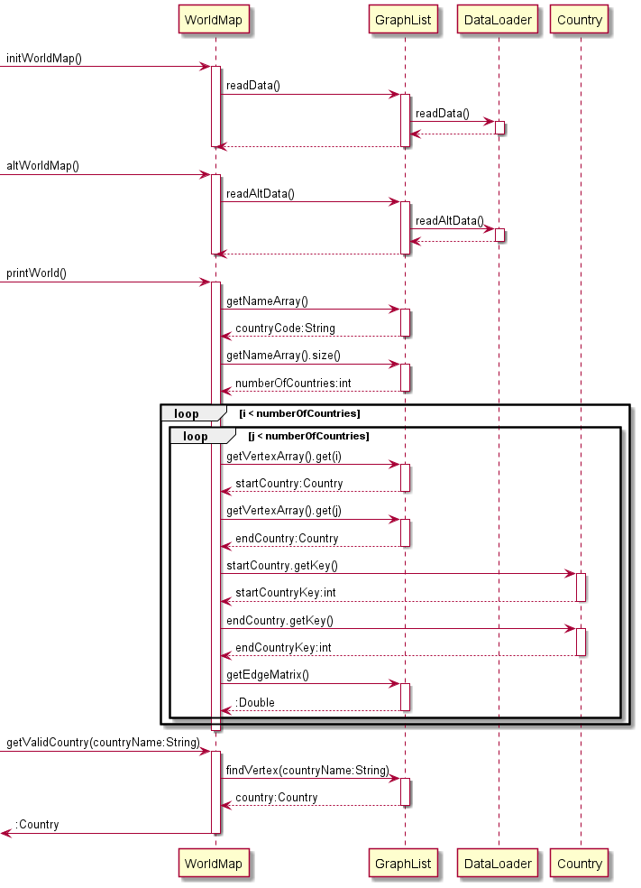
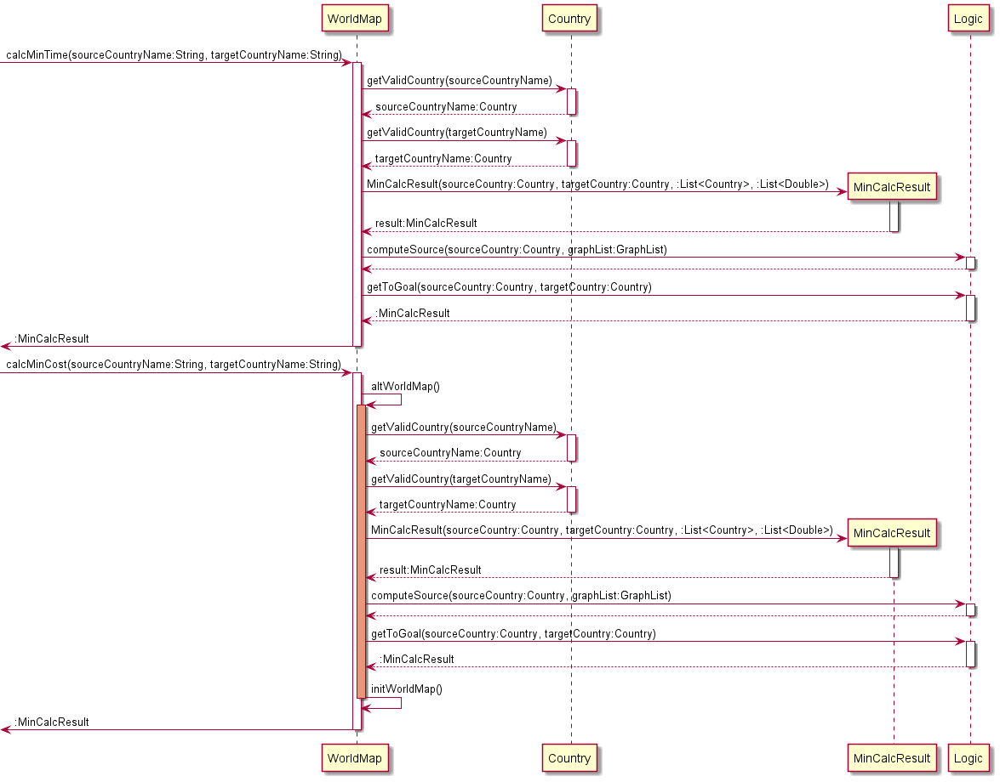
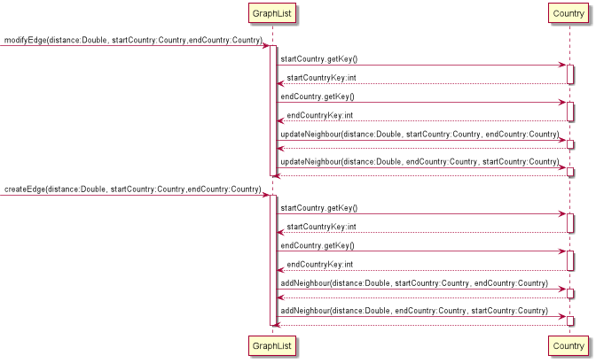
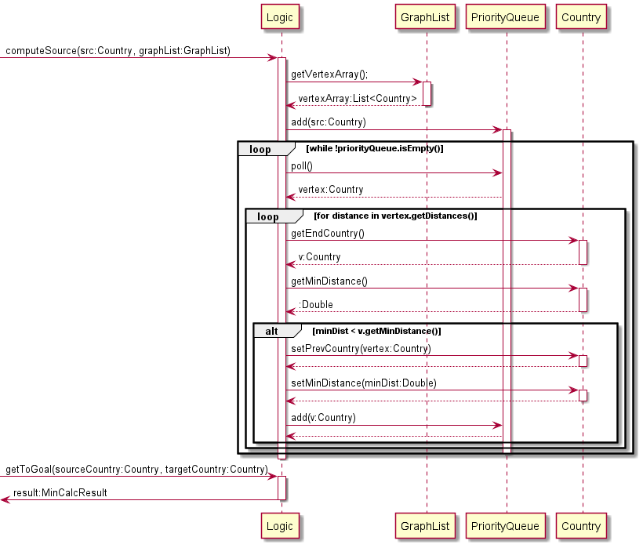

# Traveller Developer Guide


## Preface
Traveller is a travel planner app that is designed to help holidaymakers like you optimise your trips!

It is created for individuals who prefer to use a Command Line Interface (CLI) over a Graphical User Interface (GUI),
while still retaining the ease of use of a GUI.

Use Traveller so that you can plan your trips with ease and focus on what matters most: Fun!

### Purpose of developer guide
This developer guide is for developers of Traveller and documents the structure and implementation of Traveller.
Developers are recommended to read this guide to understand the code architecture of Traveller before contributing to
the application.

Use the Table of Contents below to easily navigate to the section you desire.

### Legend

|Icon|Explanation|
|:---:|:---:|
||Shows more information regarding this guide or the development of Traveller.|
||Shows useful tips when developing Traveller.|
||Shows potential problems when developing Traveller.|

---

## Table of Contents
* [1. Design & Implementation](#1-design--implementation)
  * [1.1. World Map](#11-world-map)
    * [1.1.1. `WorldMap` class](#111-worldmap-class)
    * [1.1.2. `GraphList` class](#112-graphlist-class)
    * [1.1.3. `Logic` class](#113-logic-class)
    * [1.1.4. `DataLoader` class](#114-dataloader-class)
  * [1.2. Main Traveller](#12-main-traveller)
    * [1.2.1. `Traveller` class](#121-traveller-class)
    * [1.2.2. `Parser` class](#122-parser-class)
    * [1.2.3. `TripsList` class](#123-tripslist-class)
    * [1.2.4. `Ui` class](#124-ui-class)
    * [1.2.5. `SaveLoader` class](#125-saveloader-class)
* [2. Product Scope](#2-product-scope)
  * [2.1. Target User Profile](#21-target-user-profile)
  * [2.2. Value Proposition](#22-value-proposition)
* [3. User Stories](#3-user-stories)
* [4. Non-Functional Requirements](#4-non-functional-requirements)
* [5. Glossary](#5-glossary)
* [6. Instructions for Manual Testing](#6-instructions-for-manual-testing)

## 1. Design & Implementation
Traveller's design can be broken down into 2 main components: The World Map, and the Main Traveller code, 
as illustrated in figure 1 below.
The World Map is the part of the application that handles the calculation of the shortest time/cost 
(collectively referred to as distance in this guide) between countries, 
while the Main Traveller code handles the interaction with users, and the general logic of the application.

<p align="center">
  
</p>
<div style="text-align: center;">Figure 1: Design Overview of Traveller</div>

### 1.1. World Map
The World Map is 1 of the 2 major components of the Traveller project.
It implements a key feature of the application, which is to find the shortest travel path from 1 country to another.
As shown in figure 2, the World Map consists of 4 sub-components, the [`WorldMap`](#111-worldmap-class) class, 
[`GraphList`](#112-graphlist-class) class, [`Logic`](#113-logic-class) class, and [`DataLoader`](#114-dataloader-class) 
class.
Additionally, the World Map uses 3 other classes to pass data around, the `Country` class, the `Distance` class, and 
the `MinCalcResult` class.


<div style="text-align: center;">Figure 2: Design of the World Map</div>


These 4 sub-components are implemented to maintain an internal graph of countries and distances. Dijkstra's algorithm 
is then performed on this graph to obtain the shortest travel path from 1 country to another.

#### 1.1.1. WorldMap class
The `WorldMap` class is the main overarching class for the World Map component of the project. 
It instantiates all its subsequent classes, `GraphList`, `DataLoader`, and `Logic`. 

Its main functionalities are in the `calcMinDistance` function which calculates the least distance to get from a given source 
to destination country. Similarly, the `calcMinCost` function calculates the least cost. 
Then, the function then reads either *time.txt* or *cost.txt* and runs `computeSource` and `getToGoal`, 
both from the `Logic` class.

As a side note, `initWorldMap` initialises the main World Map which is based on distances, 
while `altWorldMap` boots up a side World Map based on the flight cost paths.     

NOTE: As of V2.1 `EditMap` is no longer used. 


<div style="text-align: center;">Figure 3.1: World Map Sequence Diagram Part 1</div>


<div style="text-align: center;">Figure 3.2: World Map Sequence Diagram Part 2</div>
(The diagrams are split into 2 parts to ensure higher picture resolution)

The `initWorldMap` command is called which then processes the flight data by calling `readData`, with the data
corresponding to the flight times. Alternatively, to process the flight costs data, the The `altWorldMap` command 
processes the costs-based World Map. `getValidCountry` ensures the given country is valid by checking against the 
current database in the system.

The breakdown of more complicated functionalities illustrated by Figure 3 is summarised below.

**`printWorld` method**
1. `getNameArray()` returns the array of country codes in String form.
2. Subsequently, `getNameArray().size()` returns the size of the array which is the corresponding number of countries.
3. The double nested for-loop iterates through all pairs of countries and returns the distance between all pairs by 
calling the `getEdgeMatrix()` which looks up the distances inside the corresponding matrix `EdgeMatrix`.

**`calcMinTime` and `calcMinCost` methods**
1. The source and destination country are firstly checked to ensure they are valid through `getValidCountry()`.
2. `MinCalcResult` is then instantiated which passes in the two countries and a blank list which will eventually 
contain the shortest path, whether cost or time-based.
3. `computeSource()` and `getToGoal()` is then used to find the shortest path between the two countries, which is then 
returned by the function as a `MinCalcResult` class.

> Both functions `calcMinTime` and `calcMinCost` are based off the same parent function,
> with the main difference being that `calcMinCost` needs to initialise the alternative World Map and re-boots the
> original, time-based World Map just before the function returns, thereby restoring the World Map back to its original
> time-based state.


#### 1.1.2. GraphList class
The `GraphList` class is based off the `WorldMap` overarching class and translate it into a more simplistic graph 
format, namely referring to its components as vertices and edges.
It instantiates subsequent ArrayLists like `vertexArray` of Country type and `nameArray` of String type.

Its main functionalities are `addVertex` and `findVertex` which are then accessed by classes like `DataLoader` and 
`WorldMap`. 

Also, functions like `createEdge` link it to the Country class and calls the subsequent function `addNeighbour`, 
creating a bidirectional edge for both countries of interest. 
Similarly, the `modifyEdge` function calls the subsequent function `updateNeighbour` from the Country class. 
The list of distances are all stored in a matrix which is called by `getEdgeMatrix` by the `WorldMap` class.


<div style="text-align: center;">Figure 4: Graph List Sequence Diagram</div>

> Both functions `modifyEdge` and `createEdge` have a very similar flow and structure.
> While `modifyEdge` desires to update the path and hence calls `updateNeighbour`, `createEdge` desires to add a new
> path into the existing database and hence calls `addNeighbour`.

The breakdown of these functionalities as illustrated by Figure 4 is summarised below.

**`modifyEdge` and `createEdge` methods**
1. Calling `getKey()` for both the starting and ending country returns the unique tags for the corresponding countries,
which is then used to access and hence update the corresponding path linking both countries. 
2. `updateNeighbour()` (or `addNeighbour()`) is then called on both countries to ensure the bi-directional edge is 
correctly updated (or added to the existing database).

#### 1.1.3. Logic class
The `Logic` class is the main class driving the logic from the overarching `WorldMap` class. 
Namely, it runs Dijkstra's algorithm on the given WorldMap.

This is done through both of its functionalities which need to be called together. 
`computeSource()` runs Dijkstra's algorithm from the given starting country and 
expands outwards to all other countries, yielding the least distances to all other countries as well. 
Then, `getToGoal()` backtracks from the target country to trace the shortest path to the source country, 
in reverse order. Note that `getToGoal()` returns an object of `MinCalcResult` type.


<div style="text-align: center;">Figure 5: Logic Sequence Diagram</div>

The breakdown as illustrated by Figure 5 is summarised below.
1. Firstly, `computeSource()` calls `getVertexArray()` which returns the list of all countries presently in the database.
2. A `PriorityQueue` is then utilised which starts from the initial source country and expands to all other countries, 
returning the shortest paths across the entire network of countries, in other words the implementation of Dijkstra's 
algorithm.
3. Then, `getToGoal()` is a backtracking mechanism searching from the destination country back towards the country of 
origin, and the function eventually returns an object of `MinCalcResult` class.

#### 1.1.4. DataLoader class
The `DataLoader` class reads in data from *time.txt* or *cost.txt* to create the vertices and edges in `GraphList`.
Its main function is the `readData` or `readAltData` function which passes the relevant lines in 
*time.txt* or *cost.txt* to either `loadCountries` or `loadDistances` to create vertexes or edges respectively.

NOTE: As of V2.1 *time.txt* and *cost.txt* are integrated into the jar file, read
[here](#6-instructions-for-manual-testing) to see what they contain.

While `DataLoader` is hardcoded to accept only 5 countries at its implementation, it is possible to increase this 
number by changing the variable `numberOfCountries` in the class. Reading on, `numberOfCountries` might be used as a
variable number.


<div style="text-align: center;">Figure 6: DataLoader Sequence Diagram</div>

The first line of *time.txt* or *cost.txt* contains the 5 country codes, which are read added as vertexes.
The remaining lines contain the country to country distances, which are in a lower triangular matrix, and are added as 
edges between the vertexes. The total number of lines in each text file is the same number as `numberOfCountries(5)`.

Each loop shown in the sequence diagram helps to facilitate the reading of the data 
according to how it is written in *time.txt* and *cost.txt*. 

1. The main loop ensures that only `numberOfCountries(5)` lines of text is read. 
2. The loop in `loadCountries()` ensures that only `numberOfCountries(5)` vertexes is added to the 
`graphList`. 
3. The loop in `loadDistances()` ensures that data is read as a lower triangular matrix of length 
`numberOfCountries - 1 (4)`, to ensure that duplicate edges are not added.

> Trivial points are omitted from the sequence diagram to keep it more concise.
> For example, 
> 1. Getting the reference of `sourceCountry:Country` and `destinationCountry:Country` 
> from the `countryArray`. 
> 2. The parsing of each newline read from `scanner` to ensure that the data is read
> properly. To read more about how data in *time.txt* and *cost.txt* is saved and thus parsed/read, 
> [click here](#61-data-file). 
> 3. The passing of the filePath that is also not shown in the sequence diagram is purely for 
> exception handling and does not affect functionality.

> As *time.txt* and *cost.txt* are both read in a specific way, 
> there are certain things to take note when modifying it.
> 1. Country codes must only be 3 letters.
> 2. Distances must be numbers as it will be parsed into a double.
> 3. **numberOfCountries** should be changed to the number of countries on the first line.
> 4. Total number of lines in both text files must be **numberOfCountries**.
> 
>  Invalid information that cannot be read by DataLoader will result in the 
> disregard of the **entire** text file and the **exiting** of Traveller.
> Please follow the format as stated above for [manual testing](#6-instructions-for-manual-testing).

### 1.2. Main Traveller
The Main Traveller is the other of the 2 major components of the Traveller project.
It implements the essential CRUD features of the application.
As shown in Figure 7 below, the Main Traveller consists of 5 sub-components: the Traveller class, Parser class, 
TripsList class, Ui class, and Storage class.
Additionally, the `Command` class is used to execute various actions in the various sub-components.


<div style="text-align: center;">Figure 7: Design of the Main Traveller</div>

Details of each of the sub-components can be found in the subsequent sub-sections.

#### 1.2.1. Traveller class
The root class of the whole project. The 2 major components of Traveller (World Map and 
Main Traveller) is initialized here. 
Sub-components of Main Traveller is also initialized here.

The class has a run function which is called to run the whole application. The steps taken in each iteration of the run
function is detailed below.

1. User input is read by the `Ui`.
2. User input is passed to the `Parser` for processing to output an executable `Command`.
3. `Command` is executed.
4. Any errors associated with [Main Traveller](#12-main-traveller) will be caught here.
5. Repeat Steps 1 to 4.

#### 1.2.2. Parser class
The `Parser` class processes raw user input to return a `Command` object, which can be executed to execute the action
specified by the command.
It's main function is the `parse` function, which takes in a user input string obtained by a `Ui` object and output the 
`Command` object. Figure 8 below illustrates the code of the `parse` function via a sequence diagram.

<p align="center">
  
</p>
<div style="text-align: center;">Figure 8: Parser Sequence Diagram</div>

The steps illustrated by Figure 8 is summarised below.
1. The `parse` command is called once per iteration of the main `run` loop in `Traveller`.
2. Based on the user input, `parse` calls a private `parseAbcCommand`, which parses the user input for each available
command.
3. `parseAbcCommand` returns a `Command` object, which is returned by `parse`.
4. This `Command` object can then be executed to perform actions on the state of Traveller, such as creating new trips, 
viewing trips, or deleting trips.
5. If there is an error encountered by `parse` when processing user input, a corresponding `TravellerException` will be
thrown.

An example of an iteration elaborated above in Figure 8 is detailed here:

1. The user enters `add-day myFabulousTrip /day 3`.
2. Parser parses the user input string. 
   1. Parser first separates the command word used (In this case `add-day`), before further parsing the 
   rest of the string.
   2. If the command word is not recognised, an exception will be thrown. 
   3. Starting from left to right, trip name `myFabulousTrip` and other field values (In this case `3`) 
   are then detected and stored.
3. These field values are then checked for validity. Exceptions will be thrown if the field values are not valid.
   1. In this case, the field value `3` will be checked to ensure it is a non-negative integer. 
4. Using the parsed field values, the relevant command object will be created.
   1. In this case, the `add-day` command object will be created using field values `myFabulousTrip` and `3`.
5. The parser will return this command object for the `run` function in the `Traveller` class to execute.


>  Validity checks are also performed on user input to ensure there are no illegal inputs executed. These validity checks
are detailed below. Do note that the parser is meant to only check if the format of user input is valid.
Checks on whether the command itself is a valid one (E.g. Whether there is enough space left in a day when the
`add-item` command is called) should be done elsewhere.
> * All fields must be filled up. Leading and trailing whitespaces are removed too. As such, if the field value contains
just whitespaces, then it will be counted as an empty field.
> * Trip names cannot contain `/` or be the string `all`.
>   * Rationale: `/` are used to indicate a field flag in the user input. Having trip names containing `/` will
potentially cause the parser to mistake the trip name for a field.
>   * Rationale: `all` is used to view all trips by the `view` command. This eliminates the possibility of confusing
the parser on whether to show all trips or just the trip with name `all` when the `view all` command is passed.
> * Day index must be a non-negative integer.
> * Item index must be a non-negative integer.
> * Time field value should be in a valid 24hr format (A 4-digit value ranging from 0000 to 2359).
> * When adding days using `add-day`, the days added should be a positive integer.


#### 1.2.3. TripsList class
The `TripsList` class is the main class to store the data.
This includes:

1. `Trip`
2. `Day`
3. `Item`

It contains functions that can help control the data inside the list. 
`addTrip` function will create a new space and store the data in it, while the `deleteTrip` function will delete and 
clear the data from the list. `getTrip` and `getTripIndex` can return the specific `Trip` data by giving the name 
or the index of the Also, the `getSize` functions will return the size of the `TripsList`.
Currently, a maximum of 30 days can be added per trip, and a maximum of 50 items can be added per day.


<p align="center">
  
</p>
<div style="text-align: center;">Figure 9: TripsList Diagram</div>

#### 1.2.4. Ui class
The `Ui` class processes the interactions with users. The functions in `Ui` class will be called in `command` and then 
print messages in the interface.

<p align="center">
  
</p>
<div style="text-align: center;">Figure 10: Ui Diagram</div>

The steps illustrated by Figure 10 is summarised now.
1. Run the `printWelcome` to greet the users.
2. Read user input and pass it to the `Parser`
3. Functions in `Ui` will be repeatedly called by `Command` class.

#### 1.2.5. SaveLoader class
The `SaveLoader` class handles the reading and writing of the save file which stores the existing trips when Traveller 
is exited.
It contains two main functions `readSave()` and `writeSave()`. While `readSave()` is called at the start of Traveller,
`writeSave()` is called whenever a command from user is received and executed, and when Traveller is exited.

> The function `writeSave()` is called whenever is command from user is received and
> executed to ensure that even if Traveller crashes due to unforeseen circumstances, the save data will always be up to
>  date. (Suggestion from [Issue #139](https://github.com/AY2122S1-CS2113T-W13-1/tp/issues/139).)

The save file in *save/save.txt* stores the minimum number of commands to recreate the same trip list that was 
saved previously.

Loading the save file is similar to the main `run` function of Traveller, as the function reads each line of 
*save.txt* and executes the corresponding command.

Following the loading of the save file, writing of the save file is handled as shown below.


<div style="text-align: center;">Figure 11: Save Sequence Diagram</div>

The functions `getSaveTrip()`, `getSaveDay()` and `getSaveItem()` return strings that corresponds to the 
command that will be executed in order to add a trip, day or item to the TripsList, DaysList or ItemsList respectively.

> Trivial points are omitted from the sequence diagram to keep it more concise.
> To read up more on what the `SaveLoader` class writes, take a look at the `getSaveX` functions from the `Trip` class
> as shown in the diagram.
> 
>  Invalid commands that are in *save.txt* will be disregarded and not be 
> read/executed.
> This may result in other following commands to become invalid as well. (Eg. A previous existing trip not being 
> created due to an edited save.
> Resulting in days/items belonging to that trip becoming invalid.) As *SaveLoader* writes *save.txt* based on the 
> existing trips when Traveller is closed, invalid commands in *save.txt* will be deleted.

## 2. Product Scope
The product scope section details the overarching plan for this project and how it will be marketed.

### 2.1. Target User Profile
This section provides a list of what our target user should be like.

The target use is one that...
* has a need to plan a trip.
* want to optimise a flight.
* would like to design detailed travel plans.
* prefers desktop and CLI over apps and GUI.
* is familiar with CLI.
* can type fast.

### 2.2. Value Proposition
This section states the unique selling points of Traveller.

Traveller allows users to...
* plan trips easily where a direct flight is not available, giving the shortest route based on time or cost.
* manage trips and itinerary faster than a GUI based app.

## 3. User Stories
This section provides the user stories that were implemented as part of version 1.0 and 2.0 of Traveller.

|Version| As a ... | I want to ... | So that I can ...|
|--------|----------|---------------|------------------|
|v1.0|user|add a trip|
|v1.0|user|delete a trip|remove a trip that is no longer relevant|
|v1.0|user|view all trips and details|manage all my trips and details|
|v1.0|user|edit a trip|remove outdated details and add new details at the same time|
|v1.0|frequent traveller|create multiple trips and itineraries|plan multiple trips at once|
|v2.0|new user|have a help function|know at a glance all the functions and how to use them|
|v2.0|trip planner|add items in an itinerary according to time|plan a detailed trip|
|v2.0|trip planner|delete items in an itinerary|remove things that I won't be doing during the trip|
|v2.0|detailed planner|edit items in an itinerary|make quick changes to my trip itinerary|
|v2.0|user|change the criteria of shortest path|plan a trip according to time, distance, or price|

## 4. Non-Functional Requirements
This section details the requirements needed for Traveller to work.

1. Should work on any _mainstream OS_ as long as it has Java `11` installed.
2. Should be able to hold up to 30 trips without any noticeable lag.

## 5. Glossary

* **CLI** - Command Line Interface
* **GUI** - Graphical User Interface
* **Mainstream OS** - Windows, Linux, macOS
* **CRUD** - Create, Read, Update, Delete

## 6. Instructions for manual testing

### 6.1 Data file

The data file *time.txt* or *cost.txt* can be modified following the formatting stated [here](#114-dataloader-class).

To test out the effectiveness of the implemented algorithm, you can add 0 to the distance matrix to tell Traveller that
there is no flight between the two countries (no edge between the vertexes).

The data file *time.txt* contains the following text:
```
SIN|MLY|CHN|JPN|SKR
1
2|3.1
999|5|6
7.1|8.2|9.2|10.2
```
Element11 (Row 1, Column 1) is the distance from SIN to MLY (and vice versa).

Element32 (Row 3, Column 2) is the distance from MLY to JPN (and vice versa).

Similarly, the data file *cost.txt* contains the following text:
```
SIN|MLY|CHN|JPN|SKR
100
150|300
999|500|400
701|801|901|1001
```

With the release of v2.1, both data files have been integrated into the jar file in our 
[release](https://github.com/AY2122S1-CS2113T-W13-1/tp/releases). For manual testing and modifying of these files, do
look to our public [repo](https://github.com/AY2122S1-CS2113T-W13-1/tp), where the files can be found under the
*resources* folder. You will then have to rebuild the jar file to test it as an executable or directly within your
desired IDE.

### 6.2 Save file
The save file *save/save.txt* can be modified following the formatting stated [here](#125-saveloader-class) and the corresponding command formats
which can be found in our [UserGuide](https://ay2122s1-cs2113t-w13-1.github.io/tp/UserGuide.html).
