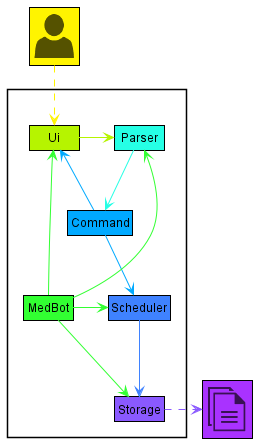

# Developer Guide
* [Acknowledgements](#acknowledgements)
* [Design](#design)
* [Implementation](#implementation)
* [Project scope](#product-scope)
* [User Stories](#user-stories)
* [Non-Functional Requirements](#non-functional-requirements)
* [Glossary](#glossary)

## Acknowledgements

{list here sources of all reused/adapted ideas, code, documentation, and third-party libraries -- include links to the original source as well}

## Design
### Architecture

 
_Figure 1. Architecture Diagram_ 
 
The _Architecture Diagram_ shown above explains the high-level design of the Application. 
 
**Overview of components**
* `Main`
  * On app launch: Creates and runs an instance of `Duke`.
* `UI`
  * Handles UI operations.
* `Taa`
  * On creation: Initializes the `UI` and `Storage` components.
  * On run: Loads data saved in `Storage`, receives and processes user input from `UI`.
* `Command`
  * Defines how a command is to be executed.
* `Model`
  * Represents a collection of classes that holds the data of the application in-memory.
  * Includes: `ModuleList`, `Modules`, `StudentList` , `Student`, `AssessmentList` , `Assessment`, `AttendanceList` , `Attendance`
* `Storage`
  * Handles data storage operations (e.g. Reading from and writing to data file).
* `Commons`
  * Represents a collection of classes used by other components.
  * `Parser`: Used to translate user input into a `Command` and to parse an argument string into its various values.
  * `Util`: Contains utility functions used by other classes.

 

**Interactions between components**
 

 
_Figure 2. An example of interactions between components for `add_module c/CS2113T n/Software Engineering`._

## Implementation
### Add module
The add module mechanism is facilitated by `AddModuleCommand`. It extends `Command` and uses `ModuleList` which stores
module internally as an ArrayList `modules`. 

`AddModuleCommand` implements the following methods:
* `AddModuleCommand#execute(moduleList:ModuleList, ui:Ui, storage:Storage)` - Performs operations for the command.

`ModuleList` implements the following methods:
* `ModuleList#getSize()` - Returns the no. of modules currently in the list.
* `ModuleList#getModules()` - Returns an ArrayList containing all the modules.
* `ModuleList#getModule(code:String)` - Returns a module with a particular code.
* `ModuleList#isValidIndex()` - Checks if an index is valid w.r.t the `modules` ArrayList.
* `ModuleList#addModule(module:Module)` - Adds a module to the `modules` ArrayList.
* `ModuleList#getModuleAt(index:int)` - Returns a `Module` object at the specified `index` within the `modules` ArrayList.

Below is an example scenario of how the add module feature behaves at each step: 
* Step 1 - The user executes `add_module c/CS2113T n/Software Engineering` to add a module. The `add_module` command calls
the `AddModuleCommand#execute` method. Within `AddModuleCommand#execute`, `ModuleList#getModule("CS2113T")` is called to
ensure that there is no existing module with code `CS2113T`.
* Step 2 - If no existing module with code `CS2113T` is found, a new `Module` object with code and name set to `CS2113T`
and `Software Engineering` set as its code and name respectively. Then, `ModuleList#addModule` is called to add the newly
created `Module` object into the `modules` ArrayList within `ModuleList`.

## Product scope
### Target user profile

* Teaching assistant who has a need to manage a significant number of students and their information
* prefers desktop app over other types
* can type fast
* prefers typing to mouse interactions
* is reasonably comfortable using CLI apps

### Value proposition

* Manage student information faster than a typical mouse/GUI driven app

## User Stories

|Version| As a ... | I want to ... | So that I can ...|
|--------|----------|---------------|------------------|
|v1.0|new user|see usage instructions|refer to them when I forget how to use the application|
|v2.0|user|find a to-do item by name|locate a to-do without having to go through the entire list|

## Non-Functional Requirements

{Give non-functional requirements}

## Glossary

* *glossary item* - Definition
