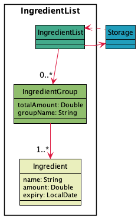

# Developer Guide for SITUS

## Acknowledgements

{list here sources of all reused/adapted ideas, code, documentation, and third-party libraries -- include links to the original source as well}
* [AB3 Developer Guide](https://se-education.org/addressbook-level3/DeveloperGuide.html) - Reference
* [HighWater Design Specification Document](http://www.cci.drexel.edu/seniordesign/2016_2017/HighWater/HighWaterDesignDocument.pdf) - Reference
* [FDsys System Design Document](https://www.govinfo.gov/media/FDsys_Architecture.pdf) - Reference

## Table of contents
[1. Introduction](#1-introduction)  
&nbsp;&nbsp;[1.1. Purpose](#11-purpose)  
&nbsp;&nbsp;[1.2. Audience](#12-audience)  
[2. First-time setup](#2-first-time-setup)  
&nbsp;&nbsp;[2.1. Prerequisites](#21-prerequisites)  
&nbsp;&nbsp;[2.2. Setting up the project on the computer](#22-setting-up-the-project-on-the-computer)  
[3. Design](#3-design)  
&nbsp;&nbsp;[3.1. Architecture](#31-architecture)  
[4. Implementation](#4-implementation)  
&nbsp;&nbsp;[4.1. Alerts](#41-alerts)  

## 1. Introduction

### 1.1. Purpose
This document specified the architectural and software design decisions in the implementation of the Smart Inventory
Tracking and Updating System (SITUS).

### 1.2. Audience
The intended audience for this document are developers looking to introduce new functionalities based on their needs.

## 2. First-time setup
### 2.1. Prerequisites
1. **Java JDK 11** installed on computer
2. **IntelliJ IDEA** most recent version

### 2.2. Setting up the project on the computer
1. Clone **this** repo onto your computer.
2. Open IntelliJ (if you are not in welcome screen, click **`File`** > **`Close Project`** to close the existing project first).
3. Set up the correct JDK 11 for IntelliJ.
   1. Click **`File`** > **`Project Structure..`** > **`Project`**.
   2. Click the arrow drop-down button in **`Project SDK`**.
   3. Choose **`11 Amazon Correcto version 11.0.12`**.
   4. In the same dialog, set the Project language level field to the SDK default option.
   5. Click **`Apply`** and **`OK`**.
4. Click **`File`** > **`Open`** 
5. Locate and select the cloned project directory.
6. Accept all defaults as prompted by IntelliJ.
## 3. Design

### 3.1. System Architecture

The **_Architecture Diagram_** above explains the high-level design of the application.

The App consists of 6 major components:
* `Main`: Initializes and connects the components together
* `UI`: Class that deals with the interaction with the user.
* `Parser`: Class that processes inputs and executes commands.
* `Command`: A set of classes covering the functionalities of the App.
* `IngredientList`: Class that holds the information of ingredients.
* `Storage`: Reads data from, and writes data

**Interaction between architecture components**

The _sequence diagram_ below shows how the components interact with each other given a scenario where the user 
enters the input `add n/carrot a/1 e/2021-11-12`

<<insert sequence diagram here>>

Each of the 5 components (apart from `main`) can be found in their respective packages.

### 3.2 UI component

The **UI** component can be found in the `UI` package.

<<description here>>

### 3.3 Parser component

The **Parser** component can be found in the `parser` package

<<description here>>

### 3.4 IngredientList component

The **IngredientList** component can be found in the `ingredients` package

Below is a partial class diagram of the `IngredientList` component

The `IngredientList` class 
* receives stored data(if any) from `Storage` when the first command is executed
* stores all of the `Ingredient` objects in an ArrayList. 
* sends the stored data to the `Storage` class for storage after command execution 

Each of the `Ingredient` objects contains information about an ingredient, namely its `name`, `amount` in stock and the `expiry` date.

### 3.5 Storage component

The **Storage** component can be found in the `Storage` package

### 3.6 Command component

The **Command** component can be found in the `command` package

The package consists of an abstract class `command` and `classes` corresponding to each functionality.

## 4. Implementation

{Describe the design and implementation of the product. Use UML diagrams and short code snippets where applicable.}

### 4.1. Alerts

Alerts are displayed automatically on startup, and when the user enters the command to display alerts. There are 3 types of commands:
* `alerts all`: displays alerts for both alert types below
* `alerts expiry`: displays alerts for ingredients expiring within a threshold number of days
* `alerts stock`: displays alerts for ingredients with stock lower than a threshold amount

The user is able to call any of the 3 methods on their own, while on startup, the `alerts all` command is automatically called via the `AlertCommand` class.

The sequence diagram for when the user inputs `alerts all` is shown below.

<<sequence diagram>>

All constructors for the command classes are called right before the relevant `run()` methods, as in `new XXXCommand().run()`. These are not shown in the diagram for simplicity. 

The `alerts all` command is passed into the `parser` class's `parse` command, which invokes the `parseAlertsCommand` method.

Next, an `AlertCommand` class is instantiated and `run` is called. This further calls 2 classes and runs them
1. The `AlertExpiringSoonCommand` class: Gets the current date from the `CurrentDate` class, adds the threshold and calls the `ExpireCommand` class with the calculated date.
   The `ExpireCommand` class's `run` method looks for the ingredients expiring before the calculated date 
2. The `AlertLowStockCommand` class: It's `run` method looks for ingredients with amounts less than the specified threshold. 

Each of the classes returns a String after `run`, which the `AlertCommand` class sends back to the parser to be returned.

## Product scope
### Target user profile

{Describe the target user profile}

### Value proposition

{Describe the value proposition: what problem does it solve?}

## User Stories

|Version| As a ... | I want to ... | So that I can ...|
|--------|----------|---------------|------------------|
|v1.0|new user|see usage instructions|refer to them when I forget how to use the application|
|v2.0|user|find a to-do item by name|locate a to-do without having to go through the entire list|

## Non-Functional Requirements

{Give non-functional requirements}

## Glossary

* *glossary item* - Definition

## Instructions for manual testing

{Give instructions on how to do a manual product testing e.g., how to load sample data to be used for testing}
