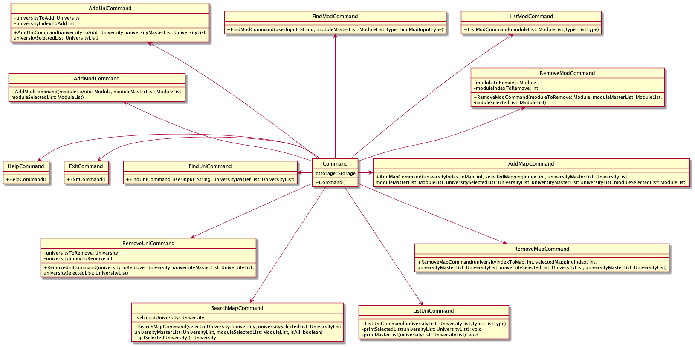

# Developer Guide

## Acknowledgements

{list here sources of all reused/adapted ideas, code, documentation, and third-party libraries -- include links to the original source as well}

## Design & implementation

###General Flow


* User is greeted by welcome screen
* User begins typing inputs
* Inputs get parsed by input parser returning the appropriate command
* Command gets executed and respective output gets displayed
* Once user is done using the application, he can send a bye message prompting a goodbye message
* Application ends

###Input parsing
* Gets command name of user input by checking if the users input starts with any of the strings that are defined for commands (add dish, list dish, help etc.)
* Throws an exception if no matching command is found
* Takes rest of user input as parameterString
* Based on command name splits the parameterString into respective parameters to respective command classes for execution

###Storage
* After every operation writes the names of the Ingredient weight of ingredient stored, weight of ingredient wasted, into a text file called ingredients.txt
* After every operation writes the names of the dish, weight of dish waste,constituents of the dish if there are any, into a text file called dish.txt


###Data Structures


### Ui Component


The `Ui` Class is responsible for the printing of interactive messages whenever a user types an input. It handles print messages to the Command Line Interface from when the program loads, to after every input by the user and finally when the user exits the program.

The interface of the program utilizes the ClearScreen class to clear the terminal after every user input through the built-in `ProcessBuilder` Java class. Such a feature allows greater readability and focus for the user as the terminal will not be cluttered with past commands.
`Ui` will call `ClearScreen.clearConsole()` method to clear the terminal.

The ProcessBuilder class will send a respective command to the terminal depending on the Operating System of the user.
The command it sends to the terminal is as follows:
* `cls` for Windows CMD Terminals
* `clear` for Linux/MacOS Terminals

`ClearConsole()` Code Snippet:
```
 public static void clearConsole() {
        try {
            // Get current operating system
            String operatingSystem = System.getProperty("os.name");

            if (operatingSystem.contains("Windows")) {
                // Try clear for Windows
                ProcessBuilder pb = new ProcessBuilder("cmd", "/c", "cls");
                Process startProcess = pb.inheritIO().start();
                startProcess.waitFor();
            } else {
                // Try clear for MacOS/Linux
                ProcessBuilder pb = new ProcessBuilder("clear");
                Process startProcess = pb.inheritIO().start();
                startProcess.waitFor();
            }
        } catch (Exception e) {
            System.out.println(e);
        }
    }
```
###Exceptions
Handles errors such as unrecognised user commands and improper parameters by calling UI to print error messages that prompt user to type in correct commands/parameters


###Command abstraction



* Different Command Classes that perform different tasks by calling various functions of Objects  
* All inherit from an abstract Command class with one execute method that takes a Arraylist<String> as input


## Product scope
### Target user profile

Restaurant owners who will delegate their Inventory Management to Managers who are fast typists with experience in using
the Command Line Interface.

### Value proposition

By presenting the wastage statistics, we can help restaurant owners figure out which dishes are contributing the most to
wastage at the restaurant. This way, they can allocate their resources more efficiently to better doing dishes. Thus we 
are reducing time wastage due to cooking of excess dishes and also saving money from purchasing unnecessary ingredients. 
Therefore, there’s a two fold saving. Additionally, we are also contributing to reducing Singapore's contribution to 
global food wastage.


## User Stories

|Version| As a ... | I want to ... | So that I can ...|
|--------|----------|---------------|------------------|
|v1.0|Restaurant owner|Delete an entry for a particular dish|Change the tracking to adapt to a change in my menu|
|v1.0|Restaurant owner| Use a help function|Get familiar with the application|
|v1.0|Restaurant owner|Add a ingredient to be tracked|Keep track of the ingredient storage|
|v1.0|Restaurant owner|Add a dish to be tracked|Track its wastage and its ingredients’ wastage|
|v1.0|Restaurant owner|Add the weight of wastage of a dish|Know how much of a certain dish is being wasted|
|v1.0|Restaurant owner|Calculate the Ingredients and Dishes wasted|Plan for future meal services to reduce food wastage|
|v2.0|Restaurant owner|Find a particular Ingredient/Dish|Do not have to look through a long list of ingredients/dishes|
|v2.0|Restaurant owner|Sort the Ingredients in descending order of Wastage|Determine which ingredients are wasted the most|
|v2.0|Restaurant owner|Sort the Dishes in descending order of Wastage|Determine which dishes are wasted the most|
|v2.0|Restaurant owner|Clear all the Dishes and/or Ingredients present in my data|Restart my data collection|
|v2.0|Restaurant owner|View a graph of wastage for my Dishes and Ingredients|Understand the wastage trends of Dishes and Ingredients at a glance|
|v2.0|Restaurant owner|Refresh my Command Line Interface after every User Command|Not have a cluttered terminal and instead focus on my tasks|
## Non-Functional Requirements

* Work offline: User should be able to use Food-O-Rama without the need for internet service
* Cross-platform: Food-O-Rama should be able to run on Windows, macOS and Linux operating systems
* Exceptions handling: Food-O-Rama should be able to handle exceptions caused by User keying in erroneous inputs 
without crash
* Accessibility: Users with the .jar file should be able to use Food-O-Rama 


## Glossary

* <i>Mainstream OS </i> - Windows, Linux, Unix, OS-X
* <i>Ingredient </i> - The basic unit required to create any Dish
* <i>Dish </i> - Food prepared using a combination of Ingredients
* <i>Wastage </i> - Weight of Dish or Ingredient wasted

## Instructions for manual testing

{Give instructions on how to do a manual product testing e.g., how to load sample data to be used for testing}
