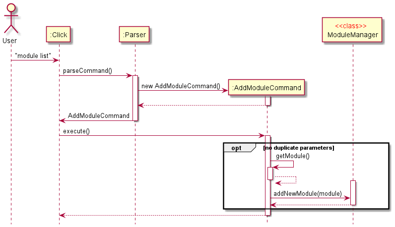
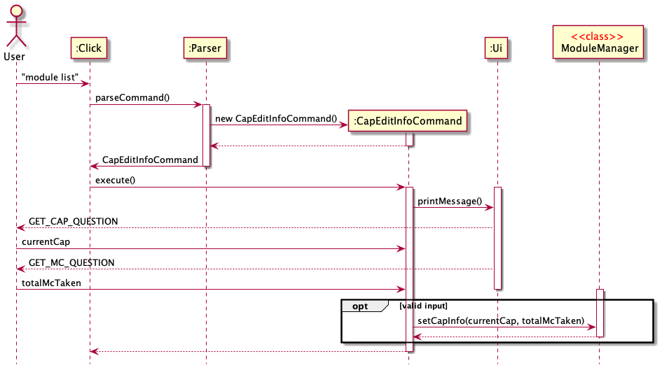
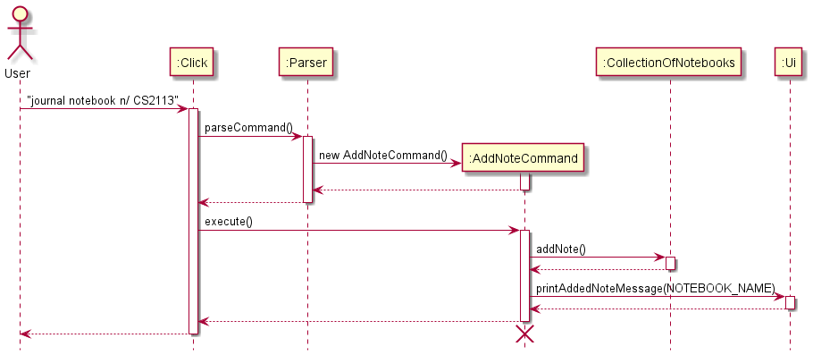
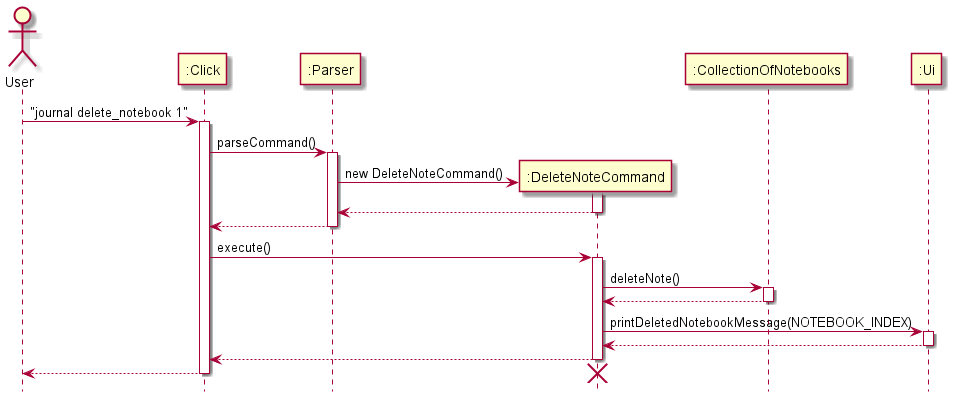
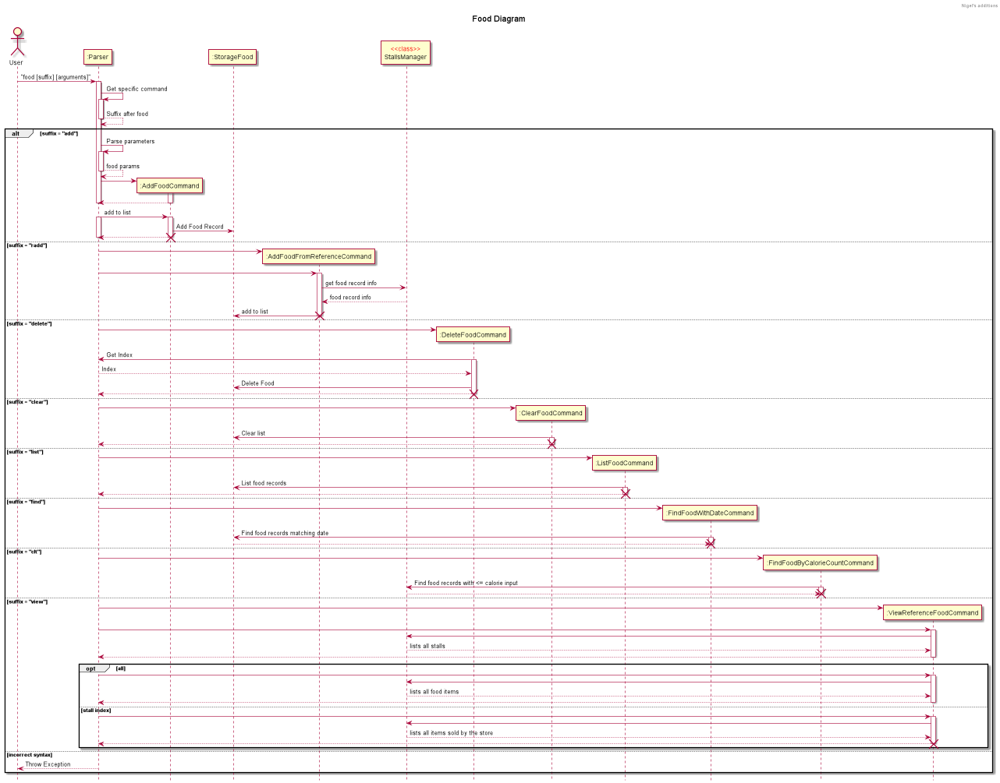

# Click - Developer Guide

## Table of Contents

[Acknowledgements](#acknowledgements)
1. [Introduction](#1-introduction)\
1.1 [Background](#11-background)\
1.2 [Purpose](#12-purpose)\
1.3 [Scope](#13-scope)
2. [Setting Up](#2-setting-up)\
2.1 [Prerequisite](#21-prerequisite)\
2.2 [Setting up the Project in Your Computer](#22-setting-up-the-project-in-your-computer)
3. [Design](#3-design)\
3.1 [Architecture](#31-architecture)\
3.2 [Ui Component](#32-ui-component)\
3.3 [Logic Component](#33-logic-component)\
3.4 [Model Component](#34-model-component)\
3.5 [Storage Component](#35-storage-component)\
3.6 [Help Component](#36-help-component)
4. [Implementation](#4-implementation)\
4.1 [Module-related Features](#41-module-related-features)\
4.2 [Zoom-related Features](#42-zoom-related-features)\
4.3 [Calendar-related Features](#43-calendar-related-features)\
4.4 [Journal-related Features](#44-journal-related-features)\
4.5 [Food-related Features](#45-food-related-features)\
4.6 [Help Command](#46--help-command)\
4.7 [Exit Command](#47-exit-command)\
4.8 [Logging](#48-logging)
5. [Automated Testing](#5-automated-testing)

[Appendices](#appendices)\
[Appendix A: Product Scope](#appendix-a-product-scope)\
[Appendix B: User Stories](#appendix-b-user-stories)\
[Appendix C: Non-Fucntional Requirements](#appendix-c-non-functional-requirements)\
[Appendix D: Glossary](#appendix-d-glossary)\
[Appendix E: Instructions for Manual Testing](#appendix-e-instructions-for-manual-testing)


## Acknowledgements

`Click` was inspired by the skeleton code and documentation (UG and DG) of [AddressBook Level-3](https://se-education.org/addressbook-level3/).

## 1. Introduction

### 1.1 Background

Click is a Java-based Command-Line Application targeted at Computing students at NUS. 

Click aims to provide an all-in-one platform for students to:
1. Manage modules and zoom links
1. Manage tasks and compile them onto a calendar
1. Manage journals and notebooks
1. Manage food intake and consumption

### 1.2 Purpose

This guide aims to give you a big-picture view of how our application operates. From the macro view on how Click runs its main program,
to the micro view on  how  we  translate sentence input to an object with attributes.

By sharing this information, we appreciate feedback on any ways we can improve the functionality or documentation in order to give you the best experience on Click.

### 1.3 Scope

This document describes the software architecture, software design requirement, implementation and testing for Click. This guide is mainly for software developers, designers, and software engineers that are going to work on Click.

## 2. Setting Up

### 2.1 Prerequisite

1. JDK `11`
2. IntelliJ IDEA

### 2.2 Setting up the Project in Your Computer

1. Fork [this repository](https://github.com/AY2122S1-CS2113T-T09-4/tp) and clone the fork to your computer.
2. Open IntelliJ IDEA (if you are not in the welcome screen, close the existing project by clicking `File` > `Close Project`)
3. Set up the correct JDK version:\
i. Click `File` > `Project Structure`. Under `Project Setting`, choose `Project` > `Project SDK`.\
ii. If `JDK 11` is listed in the dropdown, select it. Otherwise, click `+ Add SDK` > `JDK...` and select the directory where you installed `JDK 11`.\
iii. Click `OK`.
4. Click `Import Project`.
5. Locate the `buid.gradle` file in the repository you have cloned and select it. Click `OK`.
6. Click `OK` to accept the default setting.
7. Verify the setup:\
i. Go to `src/main/java/seedu.duke.Click`, run `Click.main()` and try out a few commands.\
ii. Go to `src/test/java/seedu.duke` and run `Tests in seedu.duke` to ensure they all pass.

## 3. Design

### 3.1. Architecture

This section is designed to demonstrate our software design description, and aims to provide you with an overall guidance to the architecture of Click.

The following sequence diagram illustrates a command call by the user to Click. 
The steps are as follows:

1. When the user runs Click, a greeting would be printed to the user
2. User enters some input which may be a command
3. The command entered by the user would be parsed\
   3.1. If command, go ahead and execute it respectively\
   3.2. If not, throw exception and ask for input again
4. Parser returns control to Click


You should note that this is a general overview of the Click functionality, and the `:Command` entity simply represents a Command to be called by the Parser.
Another point for you to note is the difference between a Click exception and other exceptions. Click, as aptly referenced from our project, has unique
exceptions that belong to our program. For instance, invalid dates extending beyond a  student's  matriculation,  or a  lack of entries when adding a journal. 
This is different from that of an "other" exception, which could be briefly categorized as a general exception. For instance, a `NumberFormatException` on the parsing
of a String to an Integer.

### 3.2. UI Component

The `UI` package contains the `Ui` class, which deals with interactions with the user.

The `UI` component:
* Takes in user commands
* Formats messages and prints out responses

### 3.3. Logic Component

1. `Click` uses `Parser` class to parse the user command.
2. `Parser` checks if the command is valid or not, splits the user input into interpretable portions, and returns the respective commands with arguments.
3. All commands inherit from the abstract class `Command` with  `execute()` method. 
4. Command interacts with models, `Storage` to carry out user's command.
5. Command also makes use of `UI` to display the messages to the user.

### 3.4. Model Component

#### 3.4.1 Module-related models

Module-related commands are managed by `ModuleManager`, which directly interacts with `StorageModule`. 
`StorageModule` in turn makes use of `ParserModule` to format and retrieve the module-related information. The following diagram illustrates how the classes related to module interact with each other.


#### 3.4.2 Food-related models

Food-related commands operate on a list of `FoodRecord`, and a `StorageFood` object. The following diagram  illustrates
how the storage in a text file, and the current food list interact with each other.
`StorageFood` object contains static methods to read and write data from said list.
The saving of data from the list to the storage file is elaborated further in the diagram below.


Additionally, StallsManager is implemented to support the `food view` commands, which include a reference food court
, Technoedge.

This class includes all stalls, food items sold by the store as well as the calorie count for the food items.
Furthermore, methods that involve sorting and filtering food items by calorie count and name are implemented in StallsManager
for the user to easily find items.

### 3.5. Storage Component

The storage of `Click` refers to storing files of user's data into respective local subdirectory in a local directory called `storage`, which is in the same directory as the project root.

The respective `.txt` files corresponding to the different features of click are held in their respective subfolder.

For example, `food.txt` would be found under `storage/fooddata/`.

### 3.6 Help Component

#### Command-syntax interaction on runtime for Help Command

The following diagram illustrates the  interactions between the functional class `ClassPackageReader` and
a particular command `ClickCommand`.


A class package reader  is implemented in order to:
1.  Read classes from a specified package
1.  Get names of all classes declared
1.  Filter out the classes that are not commands by inheritance
1.  Collect the commands in a set
1.  Iterate through all other listed packages and merge the sets
1.  Sort the filtered commands by alphabetical order for readability
1.  Read the specific syntax  of a command, and print it to the user

The abstract class `Command` has the following methods which
implement steps 3 & 4:
1. `public int compare(Command command1, Command command2){...}`
   >This comparator is used in the
   `ClassPackageReader` to sort out the Commands by name, and is further elaborated in Logic.
1. `public void printClassNameAndSyntax()`
   > This function splits the name of the class by upper and lower case, and also to remove the
   "command" word at the end of the class.

Next, we decided to run the `ClassPackageReader` through a package rather than iterate through all classes.
The former is better than the latter considering our implementation of the commands. For instance, all module-
related commands are grouped together in the `module` package, food-related commands in `food` etc. \
Thus, by accessing the packages and filtering out the commands, the `ClassPackageReader` presents the name of the command
and the syntax in a readable format to the user.

Do note that the packages have to be manually input by the developers.
However, the core functionality of Click is already partitioned nicely into the packages and hence we do not expect
many updates over the lifeline of this project.

## 4. Implementation

This  section provides  the mechanisms of the many features of Click, where you can find documentation for the features as well
as code examples.

### 4.1. Module-related Features

#### 4.1.1 Adding a Module

This feature allows user to add a new Module. If the creation is successful, a confirmation message on the newly created Module will be displayed to the user.

The command for listing all modules is implemented by the `AddModuleCommand` class that extends `Command`.

When the user types `module add c/CS2113T n/Software Engineering m/4 e/A`, the following sequence of steps will then occur:

1. User executes `module add c/CS2113T n/Software Engineering e/A`\
   i. `Click` receives user's input.\
   ii. `Parser` calls `parser.parseCommand(userInput)` to parse user's input into a `Command`.
2. Create `AddModuleCommand` object.
3. Execute command.\
   i. `AddModuleCommand` finds `indexOfCode`, `indexOfName`, `indexOfMc` and `indexOfExpectedGrade` in user's input\
   ii. `AddModuleCommand` checks if there are duplicate prefixes in the command or not. If yes, throw `DuplicateModuleParamException`\
   iii. `AddModuleCommand` calls `getModule()` to create a new `module` based on user's input\
   iv. `AddModuleCommand` calls `moduleManager.addNewModule(module)` to add the new `module` to the module list\
   v. `AddModuleCommand` prompts the successful message to the user.

The sequence diagram below summarizes how adding a module works:



#### 4.1.2 Removing a Module

This feature allows user to remove a Module created in the past. If the deletion is successful, a confirmation message on the Module deletion will be displayed to the user.

The command for listing all modules is implemented by the `DeleteModuleCommand` class that extends `Command`.

When the user types `module delete 2`, the following sequence of steps will then occur:

1. User executes `module delete 2`\
   i. `Click` receives user's input.\
   ii. `Parser` calls `parser.parseCommand(userInput)` to parse user's input into a `Command`.
2. Create `DeleteModuleCommand` object.
3. Execute command.\
   i. `DeleteModuleCommand` finds the index of the module to be deleted in user's input.\
   ii. `DeleteModuleCommand` calls `moduleManager.deleteModule(moduleIndex)` to delete the specified module and print the message to the user.


#### 4.1.3 Listing All Modules

This feature allows user to view all Modules.

The command for listing all modules is implemented by the `ListModuleCommand` class that extends `Command`.

When the user types `module list`, the following sequence of steps will then occur:

1. User executes `module list`\
   i. `Click` receives user's input.\
   ii. `Parser` calls `parser.parseCommand(userInput)` to parse user's input into a `Command`.
2. Create `ListModuleCommand` object.
3. Execute command.\
   i. `ListModuleCommand` calls `storage.StorageModule.readDataFromFile()` to read Module-related data from the storage file.\
   ii. `ListModuleCommand` check if there are any Modules in the list. If not, prints the message of having no modules then return.\
   iii. `ListModuleCommand` prompts the message to list the Modules to the user and prints out the Modules line by line.

The sequence diagram below summarizes how listing modules work:


#### 4.1.4 Edit CAP Information

This feature allows user to edit the information related to the CAP.

The command for editing CAP information is implemented by the `CapEditInfoCommand` class that extends `Command`.

When the user types `cap edit`, the following sequence of steps will then occur:

1. User executes `module list`\
   i. `Click` receives user's input.\
   ii. `Parser` calls `parser.parseCommand(userInput)` to parse user's input into a `Command`.
2. Create `CapEditInfoCommand` object.
3. Execute command.\
   i. `CapEditInfoCommand` calls `ui.printMessage()` to print the `GET_CAP_QUESTION` to the user\
   ii. `CapEditInfoCommand` gets the current CAP from the user. If the CAP is illegal, `CapEditInfoCommand` throws `IllegalCurrentCapException`\
   iii. `CapEditInfoCommand` calls `ui.printMessage()` to print the `GET_MC_QUESTION` to the user\
   iv. `CapEditInfoCommand` gets the total MC taken from the user. If the total MC taken is illegal, `CapEditInfoCommand` throws `IllegalTotalMcTakenException`.\
   v. `CapEditInfoCommand` calls `ui.printMessage()` to print the confirmation to the user\
   vi. `CapEditInfoCommand` calls `moduleManager.setCapInfo()` to save the data.

The sequence diagram below summarizes how editing CAP information work:



#### 4.1.5 Get Expected CAP

This feature allows user to view the information related to the CAP and the expected CAP.

The command for getting expected CAP is implemented by the `GetExpectedCapCommand` class that extends `Command`.

When the user types `cap expected`, the following sequence of steps will then occur:

1. User executes `module list`\
   i. `Click` receives user's input.\
   ii. `Parser` calls `parser.parseCommand(userInput)` to parse user's input into a `Command`.
2. Create `GetCapCommand` object.
3. Execute command.\
   i. `GetCapCommand` calls `moduleManager.getExpectedCap()` to get the expected CAP.
   ii. If the expected CAP return is not a number, `GetCapCommand` calls `ui.printMessage` to prompt the `MESSAGE_MISSING_CAP_INFO` to the user.
   iii. Else, `GetCapCommand` calls ui.printMessage` to print the information related to the CAP and the expected CAP to the user.

### 4.2 Zoom related features

#### 4.2.1 Showing all available zoom links

This command is implemented by the `ShowZoomLinks` class. The basic functionality of this command is to access the data stored on the local drive to display the relevant zoom links along with the module codes.
The `ShowZoomLinks` class extends `Command`.

Syntax: `zoom list`

The following diagram explains the sequence of execution for the zoom list command. 


#### 4.2.2 Adding a new zoom link

This command is implemented by the `AddZoomCommand` class. The basic functionality of this command is to write a new zoom link to a local storage file and associate it to the relevant module code. The `AddZoomCommand`
class extends `Command`.

Syntax: `zoom add [MODULE_CODE] [LINK]`
Example: `zoom add CS2113T https://nus.sg/testlink`

The following diagram explains the sequence of execution for the add zoom command. 


#### 4.2.3 Open a zoom link

this command is implemented by the `OpenZoomLink` class. The basic functionality of this command is to open the zoom link associated to the particular module. The `OpenZoomLink` class extends `Command`

Syntax: `zoom open [MODULE_CODE]`
Example: `zoom open CS2113T`


### 4.3 Calendar-related Features

#### 4.3.1 Displaying the calendar

This feature allows the user to view a calendar with tasks and lectures.

The command for displaying the calendar for a specific month is implemented by the `DisplayCommand` class that extends `Command`.

Given below is an example of how the display calendar mechanism behaves at each step.

1. The user enters the command `calendar display 10-2021`. This command is then sent for parsing in the `Click` class to `parseCommand` method in the `Parser` class. The `parseCommand` method first splits the entire command into an array `todoArguments` containing `calendar`, `display` and `10-2021`.
2. The string `calendar` from the first index of todoArguments is checked against switch cases and is found to match `COMMAND_CALENDAR` which is the constant string "calendar". Upon finding this match, the string from the second index `todoArguments`is further split based on the delimiter of a single white space. The string `display` id checked against possible suffixes and `Command` object `DisplayCommand` is returned to the `Click` class.
3. `Click` class then calls the method `execute` of `DisplayCommand` class. `DisplayCommand` extends `Command` class and has three steps in its `execute` method.\
         i. The `parseCalendarCommand` is first called, and it returns the year and month values after splitting `10-2021` into `10` and `2021`. This is put together into an YearMonth object `inputYearMonth`
      >  **NOTE:** The input is validated first and if the input date given is invalid, i.e., the month not between 1-12, then the calendar for the current month is displayed.
   
      ii. The `inputYearMonth` is passed into `Ui` class method `printCalenderTitle` and this prints out the title of that month with the month name and the year. In this example, it will display as given in the figure below.
     
     
      iii. Then, the method `arrangeTaskList` in `Schedule` class is called, and it takes in `storage.tasksList` (the TaskList object with all the currently stored tasks drawn from storage), `calendarTasks` (an ArrayList<ArrayList<String>> object initialized with empty ArrayLists of type String), `month` (the month input by the user, which in this example is the integer `10`) and year `month` (the year input by the user, which in this example is the integer `2021`), and adds the tasks to the days in the empty String ArrayLists initialized before in `calendarTasks`.
     
      iv.The method `arrangeLectureList` is also called, and the process is same as in the previous step, except with `storage.lectureList` and `calendarLecture` replacing the first two input parameters of `arrangeTaskList`.
     
      v.Then, the method `displayCalendar` in `Schedule` class is called, and it takes in `inputYearMonth` (the YearMonth object created from the month and year parsed from the user input), the `calendarTasks` (that was filled with the tasks for each day in the Step (iii)) and `calendarLecture` (that was filled with the lectures for each day in the Step (iv)). The method `displayCalendar` performs the necessary logic to print out the calendar.
  >  **NOTE:** Two tasks and two lectures are displayed for each day based on the order in which the user added them, and if there are more, they will show as and when the user deletes the tasks/lectures that are currently displayed.

The below sequence diagram shows the execution process of the calendar display feature.


**Calendar Design Considerations**

The following design considerations were kept in mind while implementing the calendar display feature,
- Aspect: Calendar visual display
    - Alternative 1: Display two tasks and two lectures at any time.
        - Pros : The calendar displayed would appear even and solution is easier to implement.
        - Cons: All the tasks and lectures not displayed.
    - Alternative 2: Set the size of the calendar to accommodate the largest number of tasks and lectures for a particular day. For example, if a day has 8 tasks and lectures and that is the highest amongst all the days, then the calendar would change to show all 8 for this day and the remaining days would have filled display up till how many tasks and lectures they have and the remaining spots empty.
        - Pros : The calendar displayed would show all the tasks and lectures.
        - Cons: Difficult to implement.

#### 4.3.2 Adding a Task

This feature allows user to add a new Task.

The command for adding a task is implemented by the `AddTodoCommand` class that extends `Command`.

Given below is an example of how the add task mechanism behaves at each step.

1. User executes `calendar todo n/RANDOMNAME d/10-10-2021`\
   i. `Click` receives user's input.\
   ii. `Parser` calls `parser.parseCommand(userInput)` to parse user's input into a `Command`.
2. `AddTodoCommand` object is created.
3. Execution of the command.\
   i. `AddTodoCommand` gets the task description as well as the date from the user's input after it is parsed by `parseTodoCommand()` of `ParserSchedule`.
   ii. `AddTodoCommand` calls `Todo()` to create a new `Todo` object based on user's input.\
   iii. `AddTodoCommand` calls `checkIfDateValid()` to throw an exception if the date given byg the user is invalid.\
   iv. `AddTodoCommand` calls `addTask()` to add the `Todo` object created to `storage.tasksList`.\
   v. `AddTodoCommand` prints the successful message to the user.
   vi. `AddTodoCommand` calls `StorageTasks.writeTaskList(storage.tasksList)` to save the new data to the storage file.

Below is an activity diagram for the execution of this feature.


#### 4.3.3 Adding a Lecture

This feature allows user to add a new Lecture.

The command for adding a lecture is implemented by the `AddLectureCommand` class that extends `Command`.

Given below is an example of how the add lecture mechanism behaves at each step.

1. User executes `calendar lecture m/CS2113T s/10-10-2021 e/30-10-2021`\
   i. `Click` receives user's input.\
   ii. `Parser` calls `parser.parseCommand(userInput)` to parse user's input into a `Command`.
2. `AddLectureCommand` object is created.
3. Execution of the command.\
   i. `AddLectureCommand` gets the lecture module code as well as the start date and end date from the user's input after it is parsed by `parseLectureCommand()` of `ParserSchedule`.
   ii. `AddLectureCommand` calls `Lecture()` to create a new `Lecture` object based on user's input.\
   iii. `AddLectureCommand` performs checks to determine if the start date is before the end date as given by the user, and if it is not, then the exception `LectureIncorrectDateException` is thrown.\
   iv. `AddLectureCommand` calls `addLecture()` to add the `Lecture` object created to `storage.lectureList`.\
   v. `AddLectureCommand` prints the successful message to the user.
   vi. `AddLectureCommand` calls `StorageLecture.writeLectureList(storage.lectureList)` to save the new data to the storage file.

#### 4.3.4 Listing All Tasks

This feature allows user to view all Tasks.

The command for listing all tasks is implemented by the `ListTasksCommand` class that extends `Command`.

Given below is an example of how the list task mechanism behaves at each step.

1. User executes `calendar list task`\
   i. `Click` receives user's input.\
   ii. `Parser` calls `parser.parseCommand(userInput)` to parse user's input into a `Command`.
2. `ListTasksCommand` object is created.
3. Execution of the command.\
   i. `ListTasksCommand` calls `StorageTasks.readTaskList()` to read Task-related data from the storage file.\
   ii. `ListTasksCommand` calls `printTaskList(tasks.getTaskList())` of `Ui` package to print out the tasks to the user.

#### 4.3.5 Listing All Lectures

This feature allows user to view all Lectures.

The command for listing all lectures is implemented by the `ListLecturesCommand` class that extends `Command`.

Given below is an example of how the list lecture mechanism behaves at each step.

1. User executes `calendar list lec`\
   i. `Click` receives user's input.\
   ii. `Parser` calls `parser.parseCommand(userInput)` to parse user's input into a `Command`.
2. `ListLecturesCommand` object is created.
3. Execution of the command.\
   i. `ListLecturesCommand` calls `StorageLecture.readLectureList()` to read Lecture-related data from the storage file.\
   ii. `ListLecturesCommand` calls `printLectureList(lectures.getLectureList())` of `Ui` package to print out the tasks to the user.

#### 4.3.6 Deleting a Task

This feature allows user to delete a Task created in the past.

The command for deleting a task is implemented by the `DeleteTaskCommand` class that extends `Command`.

Given below is an example of how the "delete task" mechanism behaves at each step.

1. User executes `calendar delete task 1`\
   i. `Click` receives user's input.\
   ii. `Parser` calls `parser.parseCommand(userInput)` to parse user's input into a `Command`.
2. `DeleteTaskCommand` object is created.
3. Execution of the command.\
   i. `DeleteTaskCommand` checks if the index as gotten from `getTaskIndex()` of `Parser` class is in the task list and if it not then `CalendarIndexNotFoundException()` is thrown.\
   ii. `DeleteTaskCommand` calls `deleteTask(this.index)` for the index of the task as given by the user to delete the task.\
   iii. The "delete successful" message is printed to the user.\
   iv. `DeleteTaskCommand` calls `StorageTasks.writeTaskList(Storage.tasksList)` to save the new data to the storage file.

Below is a sequence diagram that demonstrates this feature.


#### 4.3.7 Deleting a Lecture

This feature allows user to delete a Lecture created in the past.

The command for deleting a task is implemented by the `DeleteLectureCommand` class that extends `Command`.

Given below is an example of how the "delete lecture" mechanism behaves at each step.

1. User executes `calendar delete lec 1`\
   i. `Click` receives user's input.\
   ii. `Parser` calls `parser.parseCommand(userInput)` to parse user's input into a `Command`.
2. `DeleteLectureCommand` object is created.
3. Execution of the command.\
   i. `DeleteLectureCommand` checks if the index as gotten from `getLectureIndex()` of `Parser` class is in the task list and if it not then `LectureIndexNotFoundException()` is thrown.\
   ii. `DeleteLectureCommand` calls `deleteLecture(this.index)` for the index of the lecture as given by the user to delete the lecture.\
   iii. "Delete successful" message is printed to the user.\
   iv. `DeleteLectureCommand` calls `StorageLecture.writeLectureList(Storage.lectureList)` to save the new data to the storage file.

#### 4.3.8 Editing a Task

This feature allows user to edit a Task created in the past.

The command for editing a task is implemented by the `EditTasksCommand` class that extends `Command`.

Given below is an example of how the edit task mechanism behaves at each step.

1. User executes `calendar edit task 1`\
   i. `Click` receives user's input.\
   ii. `Parser` calls `parser.parseCommand(userInput)` to parse user's input into a `Command`.
2. `EditTasksCommand` object is created.
3. Execution of the command.\
   i. `EditTasksCommand` checks if the index as gotten from `getTaskIndexForEdit()` of `Parser` class is in the task list and if it not then `CalendarIndexNotFoundException()` is thrown.\
   ii. `EditTasksCommand` prompts the user to enter the command to add a todo task and parses the command using `parseTodoCommand()` The date given by the user is checked with `checkIfDateValid(date)` and if the date is incorrect then an exception is thrown.\
   iii. `EditTasksCommand` calls `editTask()` to edit the task.\
   iv. Edit successful message is printed back to the user.\
   iv. `EditTasksCommand` calls `StorageTasks.writeTaskList(Storage.tasksList)` to save the new data to the storage file.

### 4.4 Journal-related Features
This segment focuses on describing the implementation of journaling-related features, the functionality of the 
commands as well as the design considerations taken.

#### 4.4.1 Add notebook feature

The command for adding notebook is implemented by the `AddNoteCommand` class that extends `Command`.

Given below is an example of how the add notebook mechanism behaves at each step.

1. User inputs `journal notebook n/CS2113` \
   i. `Click` receives the input. \
   ii. `Parser` calls `parser.parseCommand(userInput)` to parse the input.
2. Create `AddNoteCommand` object.
3. AddNoteCommand execution. \
   i. `AddNoteCommand` calls `ParserJournal.parseAddNoteCommand(userInput)` which returns the notebook name. \
   ii. `AddNoteCommand` calls `storage.collectionOfNotebooks.addNote(noteName, "none")`. Here the parameters are the
   notebook name, and the tag name which is "none" by default. \
   iii. `AddNoteCommand` calls `ui.printAddedNoteMessage` and passes in notebook name as parameter to convey
   successful addition of notebook. \
   iv. `AddNoteCommand` calls `StorageNotes.writeCollectionOfNotebooks(storage.collectionOfNotebooks)` to write the new 
   data to
   the storage file.




#### 4.4.2 Add entry feature

The command for adding entry is implemented by the `AddEntryCommand` class that extends `Command`.

Given below is an example of how the add entry mechanism behaves at each step.

1. User inputs `journal entry n/CS2113 e/HW`\
   i. `Click` receives the input. \
   ii. `Parser` calls `parser.parseCommand(userInput)` to parse the input. 
2. Create `AddEntryCommand` object.
3. AddEntryCommand execution. \
   i. `AddEntryCommand` calls `ParserJournal.parseAddEntryCommand(userInput)` which returns the notebook name and entry
   name as a
   string array. \
   ii. `AddEntryCommand` calls `storage.collectionOfNotebooks.getNotesArrayList` to get an ArrayList of notebook 
   objects. \
   iii. Traverses through all notebooks in the array list using a for loop. \
   iv. If a notebook has name same as the notebook name in input got after parsing then `AddEntryCommand` calls
   `storage.collectionOfEntries.addEntry(NOTEBOOK_NAME, ENTRY_NAME)` to add the entry. \
   v. `AddEntryCommand` calls `ui.printAddedEntryMessage(ENTRY_NAME)` to print a message that the entry has been 
   added. \
   vi. `AddEntryCommand` calls `StorageEntries.writeEntries(storage.collectionOfEntries, storage)` to write the new
   data to the storage file.


#### 4.4.3 List notebooks and entries

The command for adding notebook is implemented by the `ListJournalCommand` class that extends `Command`.
The command for listing is implemented by the `ListJournalCommand` class that extends `Command`.

A list of notebooks along with their entries will be displayed.

Given below is an example of how the list mechanism behaves at each step.

1. User inputs `journal list` \
   i. `Click` receives the input.\
   ii. `Parser` calls `parser.parseCommand(userInput)` to parse the input.
2. Create `ListJournalCommand` object. 
3. ListJournalCommand execution. \
   i. `ListJournalCommand` calls `storage.collectionOfNotebooks.getNotesArrayList()` which returns an array list of
   Notebook objects. \
   ii. `ListJournalCommand` calls `storage.collectionOfEntries.getEntriesArrayList()` which returns an array list of
   Entry objects. \
   iii. `ListJournalCommand` then prints all the notebooks with their entries.

#### 4.4.4 Deleting notebook

The command for deleting notebook is implemented by the `DeleteNoteCommand` class that extends `Command`.
The notebook along with all its entries will be deleted.

Given below is an example of how  "delete notebook" mechanism behaves at each step.

1. User inputs `journal delete_notebook 1` \
   i. `Click` receives the input. \
   ii. `Parser` calls `parser.parseCommand(userInput)` to parse the input.
2. Create `DeleteNoteCommand` object.
3. DeleteNoteCommand execution. \
   i. `DeleteNoteCommand` calls `ParserJournal.parseDeleteNoteCommand(userInput)` to get index of notebook to
   delete. \
   ii. `DeleteNoteCommand` checks if index of notebook is in list. If not, throws the
   exception InvalidNotebookIndexException(). \
   iii. `DeleteNoteCommand` calls `storage.collectionOfNotebooks.deleteNote(indexOfNotebookToDelete, storage)` to 
   delete the notebook. \
   iv. `DeleteNoteCommand` calls `ui.printDeletedNotebookMessage(indexOfNotebookToDelete)`to indicate that the 
   notebook has been deleted. \
   v. `DeleteNoteCommand` calls `StorageNotes.writeCollectionOfNotebooks(storage.collectionOfNotebooks)` to write 
   the new
   data to the storage file. 



#### 4.4.5 Deleting Entry

The command for deleting entry is implemented by the `DeleteEntryCommand` class that extends `Command`.

Given below is an example of how the "delete entry" mechanism behaves at each step.

1. User inputs `journal delete_entry n/CS2113 e/HW` \
   i. `Click` receives the input. \
   ii. `Parser` calls `parser.parseCommand(userInput)` to parse the input.
2. Create `DeleteEntryCommand` object.
3. DeleteEntryCommand execution. \
   i. `DeleteEntryCommand` calls `ParserJournal.parseDeleteEntryCommand(userInput, storage)` to get notebook name and
   entry name. \
   ii. `DeleteEntryCommand` calls `storage.collectionOfEntries.getEntriesArrayList()` which returns an array list of
   Entry objects.\
   iii. Traverses entries. If notebook name and entry name match that of Entry object in list, calls `entries.remove(indexOfEntry)`
   to delete the entry. If entry to delete doesn't exist then throws `EntryDoesNotExistException()`. \
   iv. `DeleteEntryCommand` calls `StorageEntries.writeEntries(storage.collectionOfEntries, storage)` to write the new
   data to the storage file. \
   v. `DeleteEntryCommand` calls `printDeletedEntryMessage()` to convey that entry has been deleted successfully.

#### 4.4.6 Tagging Notebook

The command for tagging notebook is implemented by the `TagNotebookCommand` class that extends `Command`.


Given below is an example usage of how tag notebook mechanism behaves at each step.

1. User inputs `journal tag n/1 t/important` \
   i. `Click` receives the input. \
   ii. `Parser` calls `parser.parseCommand(userInput)` to parse the input.
2. Create `TagNotebookCommand` object.
3. TagNotebookCommand execution. \
i. `TagNotebookCommand` calls `ParserJournal.parseTagNotebookCommand(userInput, storage)` to get notebook index and
   tag name. \
   ii. `TagNotebookCommand` calls `storage.collectionOfNotebooks.getNotesArrayList()` which returns an array list of
   Notebook objects. \
   iii. `TagNotebookCommand` calls `notes.get(NOTEBOOK_INDEX)` to get the required Note object at the index in the
   array list. \
   iv. `TagNotebookCommand` calls `noteToBeTagged.tag(TAG_NAME, storage)` to tag the notebook. \
   v. `TagNotebookCommand` calls `printTaggedNotebookMessage()` to convey that the notebook has been tagged
   successfully. 

**Notebook Design Considerations**

The following design considerations were kept in mind while implementing the tag notebook feature,
- Aspect: How to store tag
   - Alternative 1: Store the tag as private string in every Notebook
      - Pros : Easy to access for printing.
      - Cons: Not optimized in terms of complexity for finding operation and needs more work for scaling the 
        application.
   - Alternative 2: Store as a Hash Table with the key as the tag and value as `Notebook`
      - Pros : Better time complexity since more optimized.
      - Cons: Takes up storage space.
   
#### 4.4.7 Finding Notebook by tag

The command for finding notebook by a tag is implemented by the `FindNotebooksByTagCommand` class that extends
`Command`.

Given below is an example of how the find notebook by tag mechanism behaves at each step.

1. User inputs `journal find tag_name` \
   i. `Click` receives the input. \
   ii. `Parser` calls `parser.parseCommand(userInput)` to parse the input.
2. Create `FindNotebooksByTagCommand` object.
3. FindNotebooksByTagCommand execution. \
   i. `FindNotebooksByTagCommand` calls `ParserJournal.parseTagForFinding(userInput)` to get tag name. \
   ii. `FindNotebooksByTagCommand` calls `storage.collectionOfNotebooks.getNotesArrayList()` which returns an array 
   list of
   Notebook objects. \
   iii. If tag name matches tag name of any Notebook objects in the array list then the notebook name is displayed.

### 4.5 Food related features

This segment focuses on describing the implementation of food-related features,
the functionality of the commands as well as the design considerations taken.

To begin, consider how a food command is parsed from user input.

##### Sequence diagram when food is parsed

The following diagram displays the interactions between the classes when the user enters a command starting with
"food".\
Do note that important calls are left out of this diagram (command execution), and the parser replaces Click for this.
A high level view of command execution is covered in [Architecture](#31-architecture)\
You should take note of the interactions between the constructed command classes, and the current list it's
iterating over - `WhatIAteTodayList`, especially the updates shown after the  end of every  command. An update is
defined as a manual overwrite over the text file saved in the user's hard disk. \
By convention, this text file is saved
in the directory `fooddata` in `storage`, with the text file named aptly as `food.txt`. \
Additionally, `StallsManager` 
is referenced in multiple commands, for instance `food radd`. This is due to the nature of the class, which contains the
information of a food court, which includes the Stall name, and food items sold by each store.



#### 4.5.2 Feature List

> **Note**: the methods invoked in the following commands are visually depicted in the sequence  diagram,
> and thus only the general functionality  is discussed, as  well as the design considerations taken.

##### Adding Food Record 

`food add n/Samurai Burger c/433`

This feature allows user to add a new Food Record.
Tags `n/` `c/` stand for name and calorie count respectively.

As depicted in the [class diagram](#342-food-related-models), the user's input undergoes the following sequence when it's
converted to a food record to be added to the user's list.
1. `Parser` invokes `parseFoodRecord` which takes in the `inputString`
1. `storage` accesses it's `whatIAteTodayList` and calls it's `addToList` method, adding the
   record to the list
1.  As the parameter `isSilent` in  `addToList` is `false`, 
    the user would be shown a message acknowledging an addition of data
1. `StorageFood` saves the list to `food.txt` in <kbd>storage/fooddata</kbd>


##### Removing Food Record

`food delete [INDEX]`

This feature allows user to remove a Food Record created in the past.

Similar to [adding a food record](#adding-food-record), the following steps are taken when deleting a food record.
1. `indexToDelete` is extracted from `inputString` by a dedicated method
1. A `FoodRecord` `toDelete` is then retrieved from `storage`, which has a `whatIAteTodayList` reference, by\
   the `getList()` method, and retrieves the desired food record using `indexToDelete`
1. `deleteFoodRecordAndSave` is then called, which does the following:
   1. remove `toDelete` from `storage`
   1. print a message to the user indicating that the record is deleted
   1. call `saveList` method in `StorageFood` to update the `food.txt` file


##### Listing All Food Records

`food list`

This feature allows user to view all Food Records, which would be particularly useful for deleting items.
```

	__________________________________________________
	1st,You consumed  Samurai Burger , which has a calorie count of : 433 on Sunday, 7 November 2021!
	You consumed 433 calories in total!
	                    ...
	__________________________________________________
```
Upon viewing the output of this feature, you may notice that it prints out a suffix along with the index of the
items. Additionally, a line corresponding to the sum of calories recorded.

To understand how these user-oriented additions were implemented, consider the execution path of food list.\
When this feature is called, the following steps take place:
1. `storage` accesses `whatIAteTodayList` by reference
1. `whatIAteTodayList` invokes the `printList` method, with the `withMessages` parameter having a `true` value

In particular, this method iterates through the list, and invokes the method `printIndexWithSuffix` to tag the correct
suffix with each index.\
Note that with each item iterated in the list, the corresponding calorie count is added to a `calorieSum` variable which
stores the sum so far.\
Following that, since `withMessages` is true, the user interface `Ui` would indicate the `calorieSum`
calculated.

These additions were not trivial, and were made with readability and user-oriented focus of Click in mind.

##### Finding food records given a date

`food find [DATE]`

This feature also relies on the `storage` component in the following sequence:
1. `Parser` filters out the relevant part of the user input relating to `LocalDate` type,
   and a `DateTimeFormatter` formats that portion into a `dateInput`
1. `storage` accesses `whatIAteTodayList` by reference
1. `whatIAteTodayList` invokes its method `printFoodWithFoundDate`, taking `dateInput` as an input, which does the following:
   1. Create a temporary `WhatIAteList`
   1. Call `addRecordIfFound`, which iterates through the current list and matches records with the same date as `dateInput`
   1. Print out the temporary list, along with a nicely formatted date string of `FormatStyle.FULL`, representing
   the full string of a month rather than the conventional MM format.\
      For example, `Nice, I found the items you ate on Sunday, 7 November 2021`
      
Again, the formatting was carefully considered to be user-oriented and readable.

##### Clearing food list

`food clear`

This feature allows users to clear their Food List. 

`storage` accesses `whatIAteTodayList` by reference, and calls it's `clearList` method, clearing all entries from the list

Following that, `StorageFood` invokes `saveList` to update the `food.txt` file.

##### Viewing from a reference list

This section covers the implementation, and design consideration of features that involve a reference list.

A reference list is represented by [StallsManager](#342-food-related-models), which contains all the information of items sold by a store in
a food court, as well as the name of the store.

Additionally, a reference list has multiple features, namely

1. `food view`
1. `food view [STORE_INDEX]`
1. `food view all`

The `ViewReferenceFoodCommand` compares the user input to the correct syntax and executes the corresponding command.
All three commands listed are implemented by methods contained in `StallsManager`, with the following execution path:
1. `storage` accesses `reference`, which is a reference list
1. `reference` then accesses a particular food court reference, Technoedge, by the method `getTechnoEdge()`
1. `reference` then invokes the corresponding command by calling the one of the three methods stored in Technoedge reference.

The implementation of the three methods is similar to  [Food List](#listing-all-food-records).
However, they differ in the scale of the commands. `food list` operates simply by reading the user's current list.
Subsets of `food view` commands operate on the reference list `StallsManager`, which is identified by Technoedge name.

In particular, all the date corresponding to Technoedge food court is already saved into the system by arrays of strings,
added in by the developer team (us). 

This data is found from [NUS OCA](https://uci.nus.edu.sg/oca/retail-dining/well-certification/),
and imported manually by us.

Click parses the relevant data from the strings into food records for the user to interact with. 
This functionality can be read from our [user guide](./UserGuide.md)

##### Saving food list on successful command

The storage on hard-disk would be automatically
updated on every successful command entered by the user.

The interworking of this is described in detail in [architecture](#342-food-related-models).

### 4.6  Help command

This segment focuses on describing the not so-simple implementations behind what would otherwise
be considered a simple feature. An interesting point for you to note before exploring this portion 
would be the runtime-analysis of classes  done by the compiler, which reads the classes from the
source code and extracts the syntax. This is perhaps more functional than printing out a string
concatenating all command syntax, which is left as a task for the developers. The following segment discusses the different activation paths of help.

#### Developer help command
The developer team (we) can enter `help rt` in intellij to activate the runtime mode of help, which is further elaborated in the following sections.
Following that, we manually run `help rt`, and transfers the sorted command names and syntax onto a string, which is printed to the user on `help`.


#### For the user
The user simply enters `help` to have the user interface `Ui` print out the help message,


After considering the different functionalities of the `help` command as well as the runtime mode of help,
the following section would elaborate on how the runtime mode works, and how we integrate this into generating the help message for the user.

#### 4.6.2 Logic of Help Command

After describing the [architecture](#36-help-component) of the help command, this portion will then describe the sequence of activation by
the developer when parsing a `help rt` command. Take the following sequence diagram for reference.


The sequence diagram provides a high-level view on how the entities interact. You should notice the interaction between
`ClassPackageReader` and the `Command` entities, where the former gets the syntax of the latter by having a class as
input. This translates into a scalable option on addition of commands, where a syntax attribute is required to be present
in an empty constructor rather than concatenating additional syntax onto a constant String variable.
That bit is done by the developers, to create a functional hard-coded string that is guaranteed to work on the user's end.

We reviewed the high-level functionality of `ClassPackageReader`, but it is also important for developers to take note of how
this class works on a lower-level. The function described here is `getCommandsAndPrintSyntax()`
1. Get classes from given packages, have each package converted into a Set of Classes.
1. Merge all the Sets together
1. Filter out the classes that are not Commands by inheritance, and add them into a List
1. Sort classes in List by name
1. For each command in List, (non-command classes are excluded in previous step)
    1. Get the declared method of abstract class Command `printClassNameAndSyntax()`
    1. Create default constructor of command and invoke the method given in (i)
    
You should take note that by step 5, this help functionality relies heavily on a _default constructor_. 
>Thus, 
when writing new `Commands`, a default constructor that contains no parameters has to overwrite the `syntax` element
in abstract class `Command`. This ensures that the  method creation and invocation of method in step 5 would be ready
to execute.

#### 4.6.3 Design considerations of Help Command

##### Aspect:  How to implement Help feature    

| \ | Alternative 1 (current choice): Reads the name and syntax from the Classes | Alternative 2 (previous choice): Prints all available commands from a String, hard-coding every syntax and printing |
|---|---|---|
| Pros | 1. Dynamic, works well and sorts the names by order as long as the constructor is included for a command<br>2. Very readable and testable due to sorted names<br>3. OOP implementation with overloaded methods and branching on inheritance<br>4. The user gets to easily view *ALL*  possible commands with a single word | 1. Easy to implement, just adding all available commands into a String and print it out<br>2. Relatively fewer lines of code (LoC)<br>3. User gets specific syntax with command entered |
| Cons | 1. Possible deprecated methods (`Class.getMethod`, `Class.getDeclaredConstructor`) which may be outdated, however,<br>  are still functional<br>2. Many more lines of code  (LoC) for implementation <br>3. The user  is bombarded with *ALL* possible commands with a single word | 1. Hard-coding and sorting help commands manually is a chore<br>2. User still has to remember the command in order to access the syntax |

While alternative 1 works when run on intellij as all `.class` files are found easily in `src/`, it does not work when running with a `.jar` file. This was caught with early bug testing by the developer team.

This issue is easily solved with alternative 2, which simply outputs a hard-coded string message to the user.

We decided to include both alternatives in our code with the runtime mode, which is activated by `help rt` and is not included in the user guide to not confuse the user.

Thus, the following steps are taken to combine both the pros of the alternatives. 
1. Developer opens `Click` on intellij
1. Developer enters `help rt` to generate sorted help message string
1. Developer copies and pastes the string into `Messages`, storing the help message


This ensures that:
1. All commands and syntax are read accordingly / no commands are missed out
1. Commands are sorted for readability and functionality (adds are group together etc)
1. The `help` command works on a `.jar` file.

### 4.7. Exit Command

This feature allows user to terminate the program. 

The command for terminating the program is implemented by the `ExitCommand` class that extends `Command`

When the user types `exit`, the following sequence of steps will then occur:
1. User executes `exit`\
i. `Click` receives user's input.\
ii. `Parser` calls `parser.parseCommand(userInput)` to parse user's input into a `Command`.
2. Create `ExitCommand` object.
3. Execute command.\
i. `ExitCommand` calls `ui.printGoodBye()` to print the goodbye message to the user.\
ii. `ExitCommand` calls `System.exit(0)` to terminate the program.

  
### 4.8. Logging

Logging in the application refers to storing exceptions, warnings and messages that occur during the execution of the program. It was included to help developers to identify bugs and to simplify their debugging process.

The `java.util.logging` package is used for logging. The logging mechanism is managed by the `ClickLogger` class through the `logger` attribute and all information is logged into a log file, `logs/ClickLogs.log`.

Logging Levels:

* `Level.SEVERE`: a serious failure, which prevents normal execution of the program, for end users and system administrators.
* `Level.WARNING`: a potential problem, for end users and system administrators.
* `Level.INFO`: reasonably significant informational message for end users and system administrators.
* `Level.CONFIG`: hardware configuration, such as CPU type.
* `Level.FINE`, `Level.FINER`, `Level.FINEST`: three levels used for providing tracing information for the software developers.

`ClickLogger` follows Singleton Pattern. Therefore, other classes can access the `logger` by calling `ClickLogger.getNewLogger()`.

Example of usage:

```Java

public class Click {

   private static Logger logger;
   
   // ...

   private static void run() {
      logger = ClickLogger.getNewLogger();
      logger.info(RUNNING_CLICK_LOG_MESSAGE);
      
      // ...
   }
}
```

## 5. Automated Testing

We use JUnit testing to ensure that the operations of `Click` meet the expected behavior.

There are two ways to run tests.

**Method 1: Using IntelliJ JUnit test runner**
* To run all tests, right-click on the `src/test/java` directory and choose `Run 'All Tests'`
* To run a subset of tests, you can right-click on a test package, a test class, or a test and choose `Run 'ABC'`

**Method 2: Using Gradle**
* To run all tests, open a console and run the command `gradlew clean test` (MacOS/Linus: `./gradlew clean test`)


## Appendices 

### Appendix A: Product scope

**Target user profile**:

* Computing student at NUS.
* Reasonably comfortable using CLI.
* Student taking multiple modules.
* Has a need to manage food consumption.
* Has a need to schedule tasks and lecture timings.
* Has a need to view calendar with tasks and lecture timings.
* Enjoys journaling.
* Has a need for an easy way to access zoom links for lectures.

**Value proposition**:

* Allows for Computing students to conveniently manage studies and lifestyle.
* An easy-to-use all-in-one application for managing modules, tracking food
  consumption, task and lecture scheduling, journaling, and CAP planning.


### Appendix B: User Stories

|Version| As a ... | I want to ... | So that I can ...|
|--------|----------|---------------|------------------|
|v1.0|new user|see the list of commands|know how to use the application|
|v1.0|user|add a new module|keep track of the module I'm going to take this semester|
|v1.0|user|list all modules|get the information about my modules|
|v1.0|user|delete recorded module|remove a module I'm not taking from the list|
|v1.0|user|display a calendar|view all my tasks|
|v1.0|user|add a todo task|to keep track of tasks I need to complete|
|v1.0|user|delete a todo task|delete a task I have completed/am not going to do|
|v1.0|user|list all tasks|get the information about my tasks|
|v1.0|user|add food i've eaten to a list|view what food items I've eaten so far|
|v1.0|user|have quick access to my zoom links|access zoom links for various modules|
|v1.0|user|list all food items recorded|view the record of food items eaten|
|v1.0|user|clear the list of food items|start a new list every week|
|v1.0|user|see a list of all zoom links|so that I can see all my links at one place
|v2.0|user|edit my CAP information|record my current CAP and the total MC taken that contribute to the CAP|
|v2.0|user|get expected CAP based on my CAP information and my modules|revise my module planning to meet my expectation|
|v2.0|user|display a calendar with lectures and tasks|view all my tasks and lectures in a calendar view|
|v2.0|user|add a lecture|know which lectures I have on which days|
|v2.0|user|delete a lecture|delete a lecture that I am not going to do|
|v2.0|user|edit a task|I do not have to delete a task which I just want to make minor changes to|
|v2.0|user|list all lectures|get the information about my lectures|
|v2.0|user|add a notebook|to help me journal|
|v2.0|user|add an entry to a notebook|to help me journal|
|v2.0|user|delete notebook|allows me to delete notebook if I don't need it|
|v2.0|user|delete entry|allows me to delete entry I don't need it|
|v2.0|user|list notebooks and entries|to keep track of my journal and view notebooks and entries|
|v2.0|user|tag notebook|so I can organize my journal better|
|v2.0|user|find notebook by tag|so I can find similar notebooks|
|v2.0|user|refer to a list of foods sold at my current place of food consumption|view the food options available|
|v2.0|user|add a food item from a reference list|don't need to type out the food name and calorie count manually|
|v2.0|user| tag what I ate with a date|record down the date I've eaten the item(s)|
|v2.0|user|search the date to see what food items I've consumed|find what food items i've consumed on that day|
|v2.0|user|search for food items from a reference list with calorie count <= given amount|plan my diet for the day ahead|
|v2.0|user|add zoom links for modules|so that I can organise based on my modules
|v2.0|user|edit zoom links for modules|so that I can change my links
|v2.0|user|open zoom links from command line|so that I can easily access my zoom links


### Appendix C: Non-Functional Requirements

1. Should work an any mainstream OS as long as it has Java `11` or above installed.
2. A user with above average typing speed for regular English text (i.e. not code, not system admin commands) should be able to accomplish most of the tasks faster using commands than using the mouse.
3. Should not require user to install program file/dependencies.
4. Should work for a single user.
5. Should be able to run without Internet connection.

### Appendix D: Glossary

**CAP**: Cumulative Average Point

**MC**: modular credit

**Mainstream OS**: Windows, Linux, Unix, OS-X

### Appendix E: Instructions for Manual Testing

This section gives you some guidance for the testers to manually test `Click`.

There are two categories of the user-testable features:
* Positive test cases
* Negative test cases

For the positive test cases, just simply follow the UserGuide in the sequence from 3.0 on to 3.6.

Here are the negative test cases you can test:

* **Invalid general commands:**
   * Empty command: ` `
   * Not supported command: `avengers assemble`
   
* **Invalid Module-related commands:**
   * Invalid module commands:
      * Missing module command type: `module`
      * Wrong module command type: `module a`
      * Missing cap command type: `cap`
   * Invalid add module commands:
      * Missing command arguments: `module add`
      * Invalid order arguments: `module add n/Software Engineering c/CS2113T`
      * Missing module code: `module add c/ n/Software Engineering`
      * Invalid modular credit: `module add c/CS2113 n/Software Engineering m/four`
      * Invalid expected grade: `module add c/CS2113 n/Software Engineering m/4 e/J`
   * Invalid delete module commands:
      * Invalid number format: `module delete one`
      * Invalid module index: `module delete -1`
      * Invalid module index: `module delete [INDEX_OUT_OF_BOUND]`
   * Invalid CAP information:
      * Provide the current CAP which is not a real number (e.g. `four`)
      * Provide the current CAP which is not in the range [0.0 - 5.0] (e.g. `6`)
      * Provide the total MC taken which is not a positive integer (e.g. `4.5`)

* **Invalid Zoom-related commands:**
   * Invalid zoom commands:
      * Missing zoom suffix: `zoom`
      * Wrong zoom suffix: `zoom a`
   * Invalid add zoom commands:
      * Wrong module: `zoom add a`
      * Invalid link format: `zoom add CS2113T www.google.com`
   * Invalid open module commands:
      * Missing arguments: `zoom open`
      * Invalid module: `zoom open a`

* **Invalid Food-related commands:**
   * Wrong divider order : dividers in wrong sequence
   * Invalid food command type : `food`
   * Wrong food command type : `food a`
   * Invalid number format : expected number, input anything else
   * Missing parameters : include divider, no parameters

   * Invalid `food radd` commands:
      * Invalid index : `store_index` <= 0, `item_index` <= 0
      * Index not found : when either index is not found from reference list

   * Invalid `food delete` commands:
      * Invalid index : when index is not found in list

   * Invalid `food find` commands:
      * Invalid date entered : when format of `dd-mm-yyyy` is not adhered to

   * Invalid `food view` commands:
      * Invalid index : `store_index` not found in reference list
      
* **Invalid Calendar-related commands:**
   * Invalid display commands:
      * `calendar display`
      * `calendar display 22-2021` (note that this command will show a warning and then display calendar for current
        month)
   * Invalid add task commands:
      * `calendar todo n/abc`
      * `calendar todo n/ d/10-10-2021`
      * `calendar todo n/abc d/`
      * `calendar todo n/abc d/22-22-2021`
   * Invalid add lecture commands:
      * `calendar lecture m/ s/10-10-2021 e/10-10-2021`
      * `calendar lecture m/CS2113T s/10-10-2021 e/10-10-2021` (when CS2113T module has not been added yet)
      * `calendar lecture m/CS2113T s/ e/10-10-2021`
      * `calendar lecture m/CS2113T s/10-10-2021 e/`
      * `calendar lecture m/CS2113T s/10-10-2021 e/09-10-2021` (end date before start date)
   * Invalid delete task commands:
      * `calendar delete`
      * `calendar delete task`
      * `calendar delete task -1`
      
* **Invalid Journal-related commands:**
   * Invalid add notebook commands:
      * `journal notebook`
      * `journal notebook cs`
      * `journal notebook n/`
   * Invalid add entry commands:
      * `journal entry`
      * `journal entry n/`
   * Invalid delete notebook commands:
      * `journal delete_notebook 0`
      * `journal delete_notebook`
   * Invalid delete entry commands:
      * `journal delete_entry n/ e/`
   * Invalid tag commands:
      * `journal tag`

