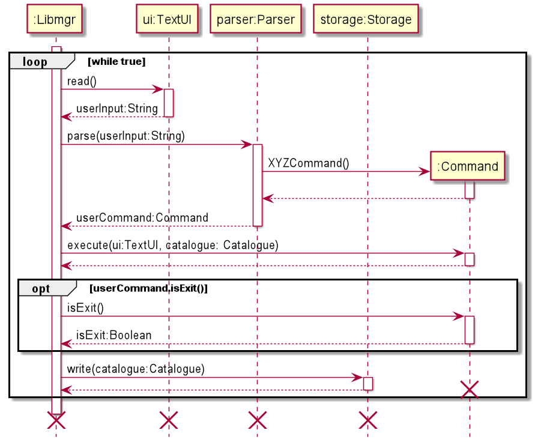
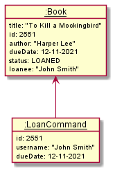

# Developer Guide

Libmgr is a desktop app for managing the inventory of libraries, optimised for use via a Command Line Interface (CLI). 
Designed for fast typists, it can help to augment the day-to-day tasks of a librarian and can help them to get tasks done in an efficient manner.

This document is meant to assist developers in better understanding the inner workings of the program.

- [Acknowledgements](#acknowledgements)
- [Setting up the project](#setting-up-the-project)
- [Design](#design)
  - [Architecture](#architecture)
  - [Commands Component](#commands-component)
  - [Data Component](#data-component)
  - [Storage Component](#storage-component)
  - [UI Component](#ui-component)
  - [Common Package](#common-component)
- [Implementation](#implementation)
  - [Add Command](#add-command)
  - [Edit Command](#edit-command)
  - [Search Command](#search-command)
  - [Loan Command](#loan-command)
  - [Deadline Command](#deadline-command)
  - [Storage Processes](#storage-processes)
    - [Reading from file and deserializing](#reading-from-file-and-deserializing)
    - [Serializing and writing to file](#serializing-and-writing-to-file)
- [Appendix A: Product Scope](#appendix-a-product-scope)
  - [Target user profile](#target-user-profile)
  - [Value proposition](#value-proposition)
- [Appendix B: User Stories](#appendix-b-user-stories)
- [Appendix C: Non-Functional Requirements](#appendix-c-non-functional-requirements)
- [Appendix D: Instructions For Manual Testing](#appendix-d-instructions-for-manual-testing)

## Acknowledgements

The format of this developer guide was adapted from [SE-EDU AddressBook Level 3 Developer Guide](https://github.com/se-edu/addressbook-level3/blob/master/docs/DeveloperGuide.md)

Libmgr also makes use of the following third-party libraries:
- [Jackson Databind](https://mvnrepository.com/artifact/com.fasterxml.jackson.core/jackson-databind/2.13.0) Provides serialization and deserialization to and from JSON (Apache 2 License)
- [Jackson Annotations](https://mvnrepository.com/artifact/com.fasterxml.jackson.core/jackson-annotations/2.13.0) Provides serialization and deserialization to and from JSON (Apache 2 License)
- [Jackson Datatype JSR310](https://mvnrepository.com/artifact/com.fasterxml.jackson.datatype/jackson-datatype-jsr310/2.13.0) Adds support to Jackson Databind for Java 8 Date/Time API (Apache 2 License)

## Setting up the project

### Prerequisites

Before setting up the project locally, ensure you have installed the following:
- Java JDK 11
- IntelliJ IDEA

> ⚠ **Caution**: Follow the steps in the following guide precisely. Things will not work out if you deviate in some steps.

First, **fork** this repo, and **clone** the fork into your computer.

If you plan to use Intellij IDEA (highly recommended):

1. **Configure the JDK**: Follow the guide _[[se-edu/guides] IDEA: Configuring the JDK](https://se-education.org/guides/tutorials/intellijJdk.html)_ to ensure Intellij is configured to use **JDK 11**.
2. **Import the project as a Gradle project**: Follow the guide _[[se-edu/guides] IDEA: Importing a Gradle project](https://se-education.org/guides/tutorials/intellijImportGradleProject.html)_ 
to import the project into IDEA.
   _⚠ Note: Importing a Gradle project is slightly different from importing a normal Java project._
3. **Verify the setup**:
   1. Run the `seedu.duke.Libmgr` and try a few commands. 
   2. Run the tests to ensure they all pass.

## Design

This section provides an overview of the design architecture and design of the various components of Libmgr. 

### Architecture

The following __*Architecture Diagram*__ provides a high level visualization of the interaction between the various components of the app.
Further elaboration  is given below.

The base `Libmgr` class consists of the main method which is responsible for:
- Application launch: initializing the components in the correct order and setting up the data containers effectively.
- Applicaiton teardown: shutting down the components, perform cleaning up and closing of processes where necessary.

Beyond that, the libmgr application contains a number of other components:
- `ui`: Contains TextUI, the class which handles user interaction through the command line UI .
- `data`: Contains the library catalogue and various item classes that form the data of the app along with all relevant operations.
- `commands`: Contains various command classes that facilitate the execution of commands and a parser class that parses user inputs.
- `storage`: Reads data from, and writes data to the hard disk.
- `common`: Contains a collection of classes used by multiple other components, such as exceptions and messages.

#### Application Launch

The above sequence diagram depicts how the components interact with each other when the program is first started.

1. A `TextUI` object is created which then prints the logo and a welcome message.
2. The `Catalogue` container is created in order to store all items.
3. A `Parser` object is created.
4. A `Storage` handler is created, before having `read()` called to load in existing data from `data/data.json` (if applicable).

#### Component Interaction

The above sequence diagram shows the interactions occurring each time a command is issued by the user.

1. `Libmgr` uses the `TextUI` class to obtain the user input.
2. `Libmgr` then uses `Parser` to parse the user input.
3. A `Command` object is returned based on the user input.
4. `Libmgr` then calls the `execute()` method of the `Command` object which performs all the logic as defined by the command
5. The exit condition is checked by computing whether the `isExit()` method of the current `Command` object returns true. If it is computed as true, the loop is broken out of and the program quits.
6. `Libmgr` lastly calls the `write()` method of the `Storage` object which writes the current state of teh items in the `Catalogue` container to `data/data.json`

### Commands component

The above partial class diagrams illustrate the classes inside the commands component that correspond to specific functionalities. 

The commands component consists of a `commands` package. Inside the package are the following classes: 
1. A main `Parser` class to process all the commands 
2. An abstract `Command` class, from which all other individual command classes inherit from
3. Individual Command classes, each corresponding to a specific command based on the user input
   1. `AddAudioCommand`
   2. `AddBookCommand`
   3. `AddCommand`
   4. `AddMagazineCommand`
   5. `AddMiscellaneousCommand`
   6. `AddVideoCommand`
   7. `DeadlineCommand`
   8. `EditAudioCommand`
   9. `EditBookCommand`
   10. `EditCommand`
   11. `EditMagazineCommand`
   12. `EditMiscellaneousCommand`
   13. `EditVideoCommand`
   14. `ErrorCommand`
   15. `ExitCommand`
   16. `HelpCommand`
   17. `InfoCommand`
   18. `ListCommand`
   19. `LoanCommand`
   20. `RemoveCommand`
   21. `ReserveCommand`
   22. `ReturnCommand`
   23. `SearchCommand`
   24. `UnknownCommand`
   25. `UnreserveCommand`
   
Each individual command class overwrites the `execute(TextUI ui, Catalogue catalogue)` method in the abstract `Command` class 
to implement its own execution functionality. 

### Data Component

The data component consists of a `data` package which holds classes that allows the categorisation of items into different types.
- Audio
- Books
- Magazines
- Videos
- Miscellaneous

Additionally, this component also holds a `Catalogue` class, which acts as a container for all items and also provides functionality to perform operations on them.

### Storage Component

The storage component contains the `Storage` and `JsonFactory` classes.
- `Storage` holds the functionality to write the current state of the catalogue to the `data.json` file. It also reads from the `data.json` file if one is found, if not a new empty file is created
- `JsonFactory` contains all the logic for deserializing the `Catalogue` object into JSON so that it can be written into a file. Likewise, it also contains the logic for serializing the `Catalogue` object when provided JSON.
Furthermore, it also contains error checking to ensure that malformed or corrupted data is not processed.

> ℹ️The directory and filename of the JSON file is defined within the `Storage` class 
The default value is set to `./data/data.json`

### UI Component

The UI component consists of a single `TextUI` class and is responsible for retrieving user inputs and displaying user feedback such as successful execution of commands, results of queries or details about exceptions.

### Common component

Classes used by multiple components are located in the `common` package.
- `LibmgrException` is the main exception class for the app.
- `Status` enumeration contains the possible values for `Status` of items, which include `AVAILABLE`, `RESERVED` and `LOANED`
- `Messages` contains information, warning and error messages

## Implementation

### Add Command

The following diagram shows the sequence diagram and the object diagram of the addition of a book.
Firstly the user types in an add command.

The example which is shown in the above diagrams is the addition of a book with the title `1984`, ID `91` and authored by `George Orwell`, 
with the full command being `add b t/1984 i/91 a/George Orwell`

1. The `main()` method within `Libmgr` calls `parser.parse()`, supplying the full line of input entered by the user.
2. Within `parser.parse()`, `parser.extractArgs()` is called on the line of user input, generating a `HashMap<String, String>`  
In this instance, the hashmap will contain the following entries

|Key (String)|Value (String)|
|---|---|
|null|add b|
|t|1984|
|i|91|
|a|George Orwell|

3. It then checks the value associated with the `null` key in order to determine which `Command` to generate, in this case the `AddBookCommand` is generated
4. The newly created `AddBookCommand` object is returned by the `parser`
5. `AddBookCommand.execute()` is executed by `Libmgr` which performs two checks, whether there are missing arguments and whether there are additional arguments supplied, outputting the relevant warning messages afterwards.
6. If both checks pass, a new `Book` object is created with values stored in the `HashMap<String, String>` variable.
7. Lastly this new `Book` object is passed to the `Catalogue` object which along with the `Catalogue.add()` method. 

### Edit Command

The Edit Command class handles the functionality to change a specific attribute of an item in the catalogue. The sequence diagram above
shows the execution when the title attribute of a book with id 123 to "Harry Potter". 

Firstly, the user types in the edit command: `edit 123 t/Harry Potter`. 
1. The `main()` method in Libmgr calls `parser.parse()`, supplying the full line of input entered by the user. 
2. Within `parser.parse()`, `parser.extractArgs(input)` is called, which processes the string into a `HashMap<String, String>` variable.   
In this instance, the hashmap contains the following entries: 

|Key (String)|Value (String)|
|---|---|
|null|edit 123|
|t|Harry Potter|

3. Since the command word `edit` is detected, a new `EditCommand` object is returned by the `parser`. 
4. The `execute(ui, catalogue)` method of `EditCommand` is called, which further calls the `handlesEditCommand(ui, catalogue)` method.
5. In the `handlesEditCommand(ui, catalogue)` method, the `processArgs(catalogue)` method is called, which processes the value associated with 
   the `null` key, to check if the user inputted a valid item id and to retrieve the item associated with that id from the catalogue. 
6. In this case, since a valid `Book` object with id 123 exists in the catalogue, a new `EditBookCommand` object is created, which then calls its own
   `execute(ui, catalogue)` and `handlesEditBookCommand(ui, catalogue)` methods. 
7. The method `processArgs()` is performed to extract "Harry Potter", the new title of the book. Checks are also performed to ascertain if the attribute
   to be edited is missing, if there are no valid arguments supplied, or if invalid arguments are supplied, outputting the relevant warning messages for each. 
8. In this case, since all checks pass, the `setTitle(title)` method of the existing `Book` object with id 123 is called, and its `title` attribute is edited to 
   "Harry Potter". 

### Search Command 

The Search class handles the functionality to search items based on multiple searching keywords.
Such keywords include "id", "category", "status", and "title". This sequence diagram shows the interactions occuring
when the command "search c/book s/loaned" is executed.
1. `Libmgr` calls `parse()` method in `parser` object, which returns a searchCommand object.
2. `Libmgr` calls `execute()` method in `searchCommand` object, which calls a `handleSearch()` in itself.
3. `searchCommand` performs several checks on the args, by calling several methods.
4. `searchCommand` creates four ArrayList of `Item` called [num]Match, i.e., fourMatch/threeMatch/twoMatch/oneMatch respectively.
5. `searchCommand` calls `getAllItems()` method in `catalogue` object, which returns an ArrayList of all objects in `catalogue`.
6. `searchCommand` loops through all items from `catalogue`, calls `checkMatches()` method on each item.
7. Items with certain number of matches are inserted into one of the four corresponding [num]Match ArrayList.
8. `searchCommand` then loops through each of four ArrayList, starting from fourMatch, ending with oneMatch, to print out all items in each ArrayList.

### Loan Command

The Loan Command class handles the functionality to loan a specific item and change its attributes accordingly.

This sequence diagram shows the interactions occurring each time a user wants to loan an item.
1. `Libmgr` calls `execute()` method in `LoanCommand` object.
2. `LoanCommand` calls the `handleLoanCommand()` in itself.
3. `LoanCommand` calls the `getItem()` in `Catalogue` using the specific id given.
4. `LoanCommand` checks the status of the item.
5. When the item status is `AVAILABLE` the loan is successful and the item's attributes change accordingly.
6. When the item status is `RESERVED` the loan is successful only if the username matches the item's loanee.
7. When the item status is `LOANED` the loan is unsuccessful.

This object diagram shows an example when `LoanCommand` is being called to loan out a book with the details 
shown in the diagram.

When the `LoanCommand` is executed, it will change the attributes of this book such that:
1. `status: null` changes to `status: LOANED`
2. `loanee: null` changes to `loanee: "John Smith"`
3. `dueDate: null` changes to `dueDate: 12-11-2021`

### Deadline Command

The Deadline Command class handles the functionality to list the items according to their due dates.

This sequence diagram shows the interactions occurring each time a user wants to loan an item.
1. `Libmgr` calls `execute()` method in `DeadlineCommand` object.
2. `DeadlineCommand` calls the `handleDeadlineCommand()` in itself.
3. `DeadlineCommand` checks the description of the command given by the user.
4. If the deadline description is `today`, it will print all items that are due today.
5. If the deadline description is `overdue`, it will print all items that are overdue (due before today).
6. If the deadline description is a specific date, it will print all items that are due by the date given.
7. If the deadline description is outside the listed three above, it will throw an exception and print 
   the error message accordingly.

### Storage Processes

#### Reading from file and deserializing

When `Libmgr` is started at each runtime, it performs an operation to find existing `data.json` file within a specified directory, and attempt to load in the data stored within into the catalogue.

The following sequence diagram shows the process of reading from the data file, along with an explanation of the steps.

1. Within `Libmgr.main()`, when the program is first started, it creates a new `Storage` object. 
2. The `Storage` object then attempts to confirm the presence of the data file in the specified directory
   1. If the file exists, it returns a java `File` object pointing to `data.json`
   2. If the file does not exist, it creates a new `data.json` file in the default directory and stores an empty catalogue within
3. Afterwards, the `Storage` object creates a new `JsonFactory` object.
4. Lastly, `Libmgr.main()` calls `Storage.read()` which reads data from the `data.json` file and calls `jsonFactory.fromJson()` to deserialize the data within into an array list of items.
If the `data.json` file contains errors, is malformed or corrupted, the user will be informed.
5. This array list is then passed as an argument when the `catalogue.setItemsArrayList()` method is called, recreating the previous state of the catalogue

#### Serializing and writing to file

Upon the completion of every command input by the user, `libmgr` will serialize the contents within the catalogue and store it in `data.json`.
This ensures that an up-to-date copy of the catalogue is always recorded into `data.json`.

The following sequence diagram shows the process of serialization and writing to file, along with the explanation of the steps.

1. After completing execution of each command, `Libmgr.main()` will call the `storage.write()` method in order to store the current state of the catalogue.
2. The `Storage` object in turn calls `jsonFactory.toJson()` for each of the five item types (audio, book, magazine, video, miscellaneous) in order to serialize all items within the catalogue
3. The `Storage` object then outputs the data in `JSON` format to `data.json` through a java `FileWriter` object.

> ℹ️ The default directory where `data.json` is located is `./data/data.json`   This can be modified within the `Storage` class.

> ℹ️ Users and developes are allowed to manually edit the `data.json` file with tools such as text editors, but are strongly recommended to exercise caution regarding formatting and spelling, as a small error can result in corrupting the entire file's structure.

> ⚠️As the `data.json` file is updated after completing execution of each command, if a corrupted `data.json` file is loaded and the user/developer wishes to retain the file, terminate the programme immediately, **do not** execute any commands other than `exit`

> ⚠️ **Do not** make changes to the `data.json` while `libmgr` is running. Any changes made while running will not be reflected by `libmgr` and such changes may be overwritten.

---
## Appendix A: Product scope
### Target user profile

Library staff who prefer keyboard inputs and require a text based application to quickly track and update 
the details of library items within their catalogue.

### Value proposition

This product aims to streamline the process of managing the book catalogues within their library. 
It will allow library staff to track their items, such as finding out their status, as well as update their 
catalogue quickly. Designed for fast typists, it also allows staff to track, update and manage their 
inventory more efficiently.

## Appendix B: User Stories

|Version| As a ... | I want to ... | So that I can ...|
|--------|----------|---------------|------------------|
|v1.0|librarian|add items to the catalogue|keep the full catalogue up to date|
|v1.0|librarian|remove items from the catalogue|keep the full catalogue up to date|
|v1.0|librarian|update the status of an item when it is loaned out|keep the full catalogue up to date|
|v1.0|librarian|update the status of an item when it is returned|keep the full catalogue up to date|
|v1.0|librarian|check the list of items available in the library|get an overview what items are still present within the library|
|v1.0|librarian|check the list of items on loan|expect what items are going to be returned soon|
|v1.0|librarian|check the list of all items in the library|get an overview of the full inventory of the library|
|v2.0|librarian|categorise different items into media forms. (E.g. book, magazine, audio, video)|better manage my catalogue|
|v2.0|librarian|edit the details of existing items on the catalogue|keep the full catalogue up to date|
|v2.0|librarian|reserve and unreserve an item by updating its status|set aside an item for a user beforehand|
|v2.0|librarian|search for specific items by their title or ID|retrieve the details of items I need|
|v2.0|librarian|check the list of items on reservation|make an item available for others to loan|
|v2.0|librarian|loan an item for a person specified by their username|track who is in possession of a item currently|
|v2.0|librarian|reserve an item for a person specified by their username|
|v2.0|librarian|view the list of items are due to be returned today|keep track of what items are expected to be returned today| 
|v2.0|librarian|view the list of overdue items|inform people to return them|
|v2.1|librarian|view the list of items that are due to be returned on a specific date|get a list of expected returns in the future|
|v2.1|librarian|search items by their categories (Book, CD, Magazine, etc)|easily sort through the inventory|
|v2.1|librarian|retain the items information|keep the details without re-entering it everytime I start the application||
|v2.1|librarian|search items using multiple parameters (title, id, status, category, etc)|narrow down the items based on certain parameters|
|v2.1|librarian|edit the details of the items simultaneously|quickly make changes to the details of each item|
|v2.1|librarian|track miscellaneous items|also record items that are not categorised as audio, books, magazines or videos|
|v2.1|librarian|display the information of the library stats|get a rough gauge about the usage of the library's assets|

## Appendix C: Non-Functional Requirements

1. Should work on Windows, macOSX and Linux as long as it has Java 11 or above installed.
2. A user with above average typing speed for regular English text (i.e. not code, not system admin commands) should be able to accomplish most of the tasks faster using commands than using the mouse.

## Appendix D: Instructions for manual testing

### Launch and Shutdown

- Initial Launch
  1. Download the latest [`libmgr.jar`](https://github.com/AY2122S1-CS2113-T16-1/tp/releases) and move it into a separate directory or folder
  2. Ensure that Java 11 has been installed and configured on your device.
  3. Open a command prompt or terminal and run the command `java -jar libmgr.jar`.
- Shutdown
  1. Type `exit` to quit the program.

### Loading Data

If you wish to start the program while retaining data:
1. Within the folder that contains `libmgr.jar`, create a subdirectory called `data`.
2. Ensure that the JSON file containing the program data is named `data.json` and move it to the `data` subdirectory. The full path should be `./data/data.json`
3. Start the program with the command mentioned [above](#launch-and-shutdown).

> ⚠️ If the program shows an error regarding malformed or corrupted data files, and you wish to retain the current state of the data file, exit the program immediately and **do not** run any other commands,
otherwise, the data file may be overwritten. Afterwards, use a text editor to make any changes before restarting the program.

### Running Commands

Refer to the list of commands shown in the user guide. Alternatively, type `help` to get an overview of the list of commands and their usage.

