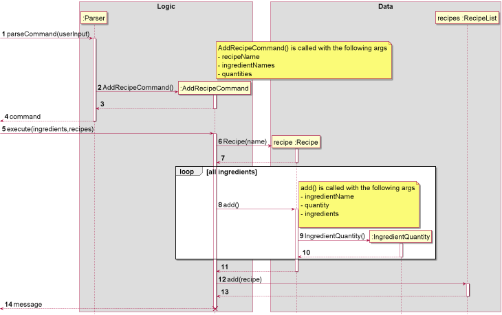
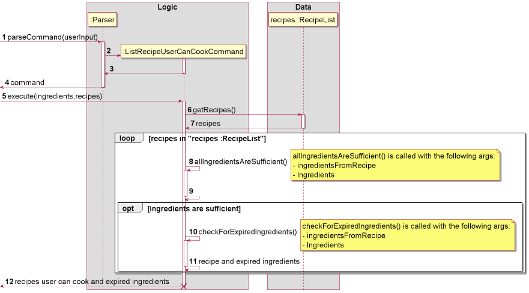

# Developer Guide

## Acknowledgements

{list here sources of all reused/adapted ideas, code, documentation, and third-party libraries -- include links to the original source as well}

## Design

### Data
**API** : [Data.java](https://github.com/AY2122S1-CS2113-T16-3/tp/tree/master/src/main/java/expiryeliminator/data)

 - The `Data` Component,
     - Stores a list of `Recipe` objects, in the form of `RecipeList`
     - Stores a list of `IngredientStorage`, in the form of `IngredientRepository`
 - Each `Recipe` has its ingredients and respective quantities stored in `IngredientQuantity`
 - The `Ingredient Storage` separates a specific ingredient into batches of quantities, 
   according to the expiry date.
 - `Ingredient` stores the information of the ingredients, which are its name and unit, 
   e.g. Chicken and grams.

## Implementation
This section describes how the features are implemented.

### Add Recipe Feature

The add recipe feature is performed by `RecipeList`. It adds a `Recipe` and its respective 
ingredients to the `RecipeList`.

Here is the sequence diagram for how add recipe works if the correct input is given and 
all ingredients exist in the `Ingredient Repository`.

 `Recipe` checks if an ingredient exists in the `Ingredient Repository` before
 adding the ingredient into the `Recipe`. If it doesn't exist, `Recipe` adds 
 the ingredient into the `Ingredient Repository` without any quantity and expiry date, 
 and it reminds the user to update the units of the ingredients.

The reason for this implementation is so that the user doesn't have to manually add the ingredients,
as the ingredient has to be in the `Ingredient Repository` for the [cooked 
recipe feature](#cooked-recipe-feature) to work

> **Note** : Here are a few cases where an error will be returned, and the `Recipe` 
> will not be saved.
>
> - the `Recipe` already exists in the `RecipeList`,
> - A number less than 1 is entered for one of the quantity of the ingredients of the `Recipe`.
> - Two same ingredients in one `Recipe`.

 

### Delete Recipe Feature

The delete recipe feature is performed by `RecipeList`. It deletes a `Recipe` from the `RecipeList`.

Here is the sequence diagram for how delete recipe works if the `Recipe` exists in the `RecipeList`.

> **Note** : If the `Recipe` doesn't exist in the `RecipeList`, an error will be returned.

 

### Cooked Recipe Feature

The cooked recipe feature is performed by `Recipe`. It deletes a certain quantity of ingredients in the
`Ingredient Repository` based on the quantities of ingredients in the `Recipe`.

Here is the sequence diagram for how cooked recipe works if the amount of ingredients in the `Ingredient Repository`
is sufficient to be deducted.

The feature leaves the responsibility of dealing with expired ingredients to the user, and
will remove ingredients starting from the earliest batch of ingredients. (ingredients that 
expire the soonest, including those that are already expired.)

> **Note** : Here are a few cases where an error will be returned, and the quantities of the ingredients in the
> `Ingredient Repository` will not be updated.
> 
> - The `Recipe` does not exist in the `RecipeList`
> - There is insufficient ingredients in the `Ingredient Repository` for the `Recipe` to be cooked.

 

###List Recipes User Can Cook Feature

The list recipe user can cook feature is performed by the `ListRecipeUserCanCookCommand`.
It returns a list of recipes that the user can cook with the ingredients the user currently
have.

Here is the sequence diagram for how list recipe user can cook works

The feature will indicate that the `Recipe` can be cooked even if some of the ingredients have
expired. However, it will inform the user that there are expiring ingredients. The responsibility
of dealing with expired ingredients is left to the user.

The feature will inform the user if there is insufficient ingredients to cook any `Recipe` or if 
there is no `Recipe` in the `RecipeList`.

 

## Product scope
### Target user profile

Young adults who are living in their own home.

### Value proposition

{Describe the value proposition: what problem does it solve?}

## User Stories

|Version| As a ... | I want to ... | So that I can ...|
|--------|----------|---------------|------------------|
|v1.0|user|add an ingredient|record what ingredients I have|
|v1.0|user|delete an ingredient|remove ingredients that I no longer have|
|v1.0|user|increment quantities for a particular ingredient|record how much of that ingredient I have|
|v1.0|user|decrement quantities for a particular ingredient|know how many ingredients are left|
|v1.0|user|list the ingredients with quantities and expiry dates|know the ingredients I have at a glance|
|v1.0|user|view the quantities for a particular ingredient|know how much of a specific ingredient I have|
|v1.0|user|list ingredients expiring within the week|know which ingredients I should use up first|
|v1.0|user|list ingredients that have expired already|know which ingredients to throw away|
|v1.0|user|add the expiry date for a specific ingredient|record when it must be used by|
|v1.0|new user|see usage instructions|refer to them when I forget how to use the application|
|v1.0|user|add a recipe and its constituent ingredients|keep track of what I want to cook|
|v1.0|user|delete a recipe|retain only recipes I want|
|v2.0|user|be able to indicate that I have cooked a recipe|keep my ingredient repository accurate|
|v2.0|user|list recipes i can cook based on the ingredients I have|save time on checking the ingredients I have|
|v2.0|user|generate a shopping list for a particular recipe/recipes|know what ingredients to buy|
|v2.0|user|delete all ingredients that have expired at one go|all ingredients I keep track of are not expired|

## Non-Functional Requirements

{Give non-functional requirements}

## Glossary

* *glossary item* - Definition

## Instructions for manual testing

{Give instructions on how to do a manual product testing e.g., how to load sample data to be used for testing}
