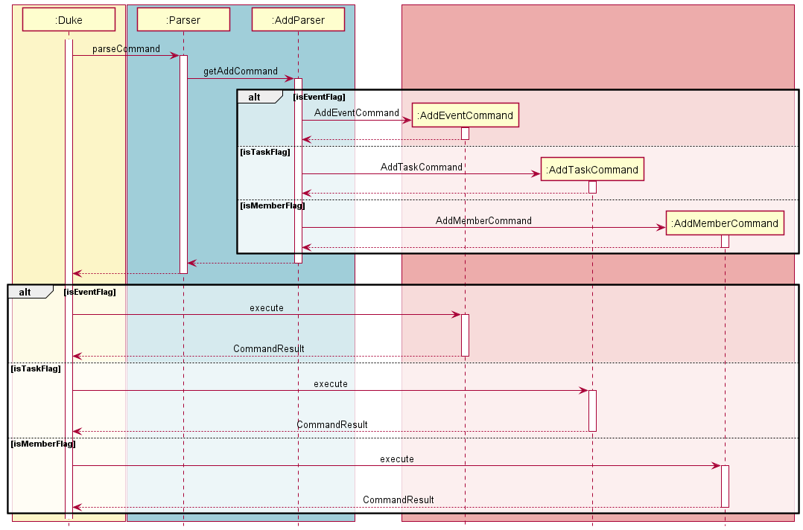
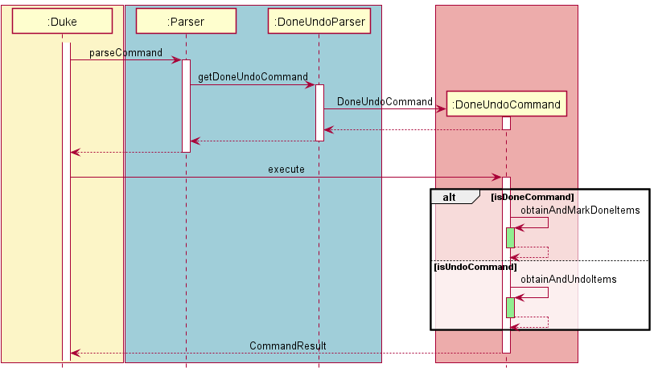
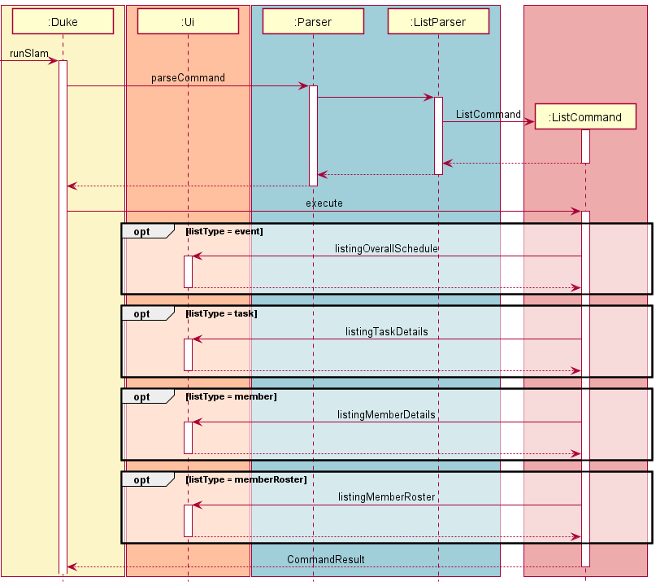
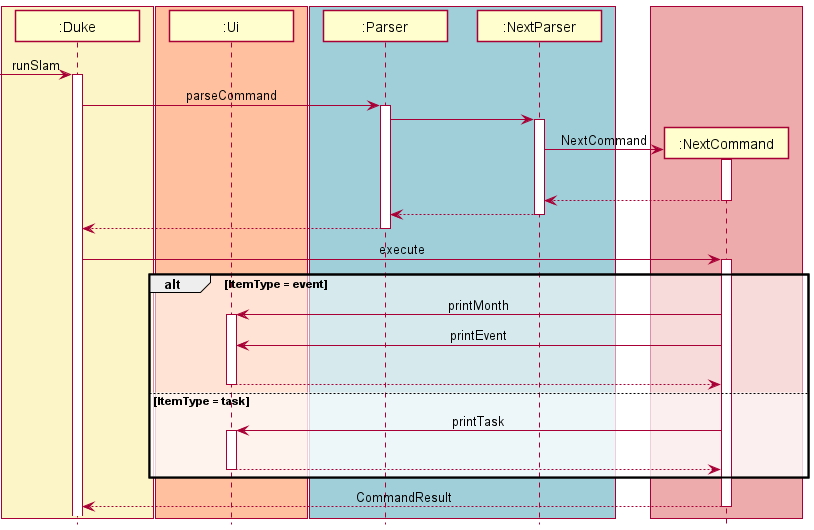
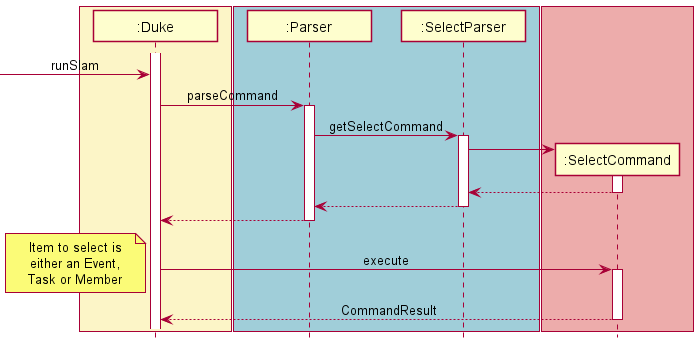

# Developer Guide
Welcome to **SLAM**! **SLAM** is a desktop application for student group leaders in NUS to manage their group events, tasks, members and various activities. This application allows you to effectively plan and manage the organisation of events by allowing users to create and add such events to their schedule. Leading up to the actual date and time of the event, committee heads can add tasks (e.g. meetings, purchase of logistics) to complete under each event to keep track of progress. Group members can also be added and assigned to these tasks. This application uses a Command Line Interface (CLI); that is, the application is operated by typing commands into a Command Box.

---
# Table of Contents
1. [Introduction](#Introduction)
   1. [Purpose of This Guide](#Purpose-of-Developer-Guide)
2. [Acknowledgements](#Acknowledgements)
3. [Design](#Design)
   1. [Architecture](#Architecture)
   2. [Ui component](#Ui-component)
   3. [Logic component](#Logic-component)
   4. [Storage component](#Storage-component)
4. [Implementation](#Implementation)
   1. [Add Functionality](#Add-Functionality)
   2. [Done and Undo Functionality](#Done-and-Undo-Functionality)
   3. [List Functionality](#List-Functionality)
   4. [Next Functionality](#Next-Functionality)
   5. [Update Functionality](#Update-Functionality)
   6. [Select Functionality](#Select-Functionality)
6. [Product Scope](#Product-scope)
   1. [Target user profile](#Target-user-profile)
   2. [Value proposition](#Value-proposition)
7. [User Stories](#User-Stories)
8. [Non-Functional Requirements](#Non-Functional-Requirements)
9. [Glossary](#Glossary)
10. [Instructions for manual testing](#Instructions-for-manual-testing)


## Introduction

SLAM is a **command line interface application** for student group leaders in NUS to **manage their group 
events, tasks and members**, without the need for much programming knowledge. This application allows student leaders to plan and manage the organisation 
of various events by allowing users to add custom events to their schedule. Users can add tasks to complete 
under each event and keep track of the progress of such tasks and events. 
These tasks also have group members assigned to them from a user-generated roster of members. 
The simple interaction between the **User** and the **command line interface application** makes SLAM an extremely user friendly
and usable event planner for student leaders.

### Purpose of Developer Guide
To give an overview on the application, namely overall architecture, implementation design rational, and specificities
in the algorithms used within SLAM. To get a good grasp of how the application works, it is recommended to look at the Overall Architecture
section of this guide.

## Acknowledgements

1. Software Engineering Education ([SE-EDU](https://se-education.org/))
   1. [AddressBook (Level 2)](https://github.com/se-edu/addressbook-level2) for providing us with ideas on how to implement a more OOP-oriented project  
   2. [AddressBook (Level 3)](https://github.com/se-edu/addressbook-level3) for providing us with references on how to better structuer and format our User and Developer Guides

## Design

This section describes some noteworthy details on how certain features are designed and implemented within SLAM.

### Architecture
Below displays how the overall flow and implementation of the application is executed.


The architecture of the entire application revolves around a few different components.
* `Ui` : This component is responsible for the information displayed to the user from the command line interface.
* `Parser` : This component parses the different data keyed in from the user and prepares the relevant data required to execute the commands.
* `Commands` : These components executes the different commands parsed by the parser from the inputs of the User.
* `Items` : Represents the different types of items (events, tasks and members) that can be assigned and implemented within the application.
* `Storage` : Manages the writing and reading of data to and from the disk.

The interaction of all the different components within the application can be depicted as such.


### Ui component

**API**: `Ui.java`

Below is a brief class diagram of the UI component


The UI component,
* executes the different user commands using the `Logic` component.
* looks out for changes in the `Command` and `Parser` classes so that the UI can be updated to display to the user the latest data of the application.
* Manages the access to the `Scanner` object that reads user input.
* is the bridge between the user and the `Logic` component.
* contains all the methods for printing to the User.

### Logic component

**API**: `Parser.java` 

Below is a partial class diagram that shows na overview of the `Logic` component.


How the `Logic` component works:
1. When `Logic` is called upon to execute a command it uses the abstract `Parser` class to parse the UserCommand.
2. The `Parser` then calls the specified abstract `Parser` class to be called. For example, `DeleteParser` will be command when a `delete` command is keyed in by the user.
3. `DeleteParser` will then parse the necessary information from the Users input.
4. This results in  `Command` object (more precisely, an object of one of its subclasses e.g. `DeleteCommand`) being returned.
5. `Duke` then calls `execute()` within the `Command` object which then executes the specified command.
6. Upon the completion of `execute()` an object of type `CommandResult` is returned to `Duke` and the feedback is displayed to the User
7. Within the `Parser` classes, all the input of the User will also be checked to ensure that no error messages come up during execution

### Storage component

**API**: `Storage.java`


#### Save Functionality


How the `save` functionality works:
1. When the `save` method is called, `StorageFile` constructs a new `File` object using the configured `DEFAULT_FILE_PATH`.
2. The presence of the `File` object on the local system is checked. The `data` directory and `slamData.txt` file wil be created if they are absent.
3. The `Member` objects in the provided `memberRoster` will be encoded into a list of `String` objects via the `encodeMemebersList` method.
4. The `Event` objects in the provided `eventCatalog` along with their respective lists of `Task` objects will be encoded into a list of `String` objects via `encodeEventsList`.
5. The `writeToFile` method will be called to write the encoded lists of `String` data into the `.txt` save file locally for future uses of the program.

#### Load Functionality


How the `load` functionality works:
1. When the `loadSaveFile` method is called, `StorageFile` constructs a new `File` object using the configured `DEFAULT_FILE_PATH`.
2. The returned `File` object will then be parsed into an `ArrayList<String>` of `encodedLines` through the `getStringsFromFile` method.
3. If the detected line contains data regarding a `Member` or `Event` object, the `StorageFile` instance will decode and construct the `Member` and `Event` objects, adding them to the global `MemberRoster` and `EventCatalog` respectively.
4. If the detected line contains data regarding a `Task` object:
   1. The `decodedTask` object will be decoded from the respective line and returned via `decodeTaskFromString`.
   2. The `decodedTask` will be added to the `Event` object's list of tasks within the global `eventCatalog`.
   3. `Member` objects in the global `memberRoster` that this `decodedTask` contains will also have their list of tasks updated to contain this `decodedTask`.

>💡 When decoding an invalid line (possibly from unwanted edits to `slamData.txt` by the user), `loadSaveFile` will throw an appropriate exception and provide feedback regarding the invalid line to the user.

## Implementation

This section aims to explain the specfic application functionalities and the interactions between the classes and their methods

>💡 The lifeline of the objects should terminate at the destroy marker (`X`), however due to a limitation of the PlantUML software, the lifeline extends beyond the destroy marker.

### Commands

The commands represent the different tasking that the application can complete and the different user specific functionalities within the application

Here is a brief overview of the different Commands
* List
* Next
* Update
* Delete
* Select
* Find
* Add
* Help
* DoneUndo
* Bye

#### Add Functionality


How Add works:
1. When the `Parser` class parses `add` as the command from the user, a new `Command` object is created by the `AddParser` method `getAddCommand`. This method will create an `AddEventCommand`, `AddTaskCommand` or `AddMemberCommand` object depending on the user input. 
2. The `getAddCommand` method will parse through the user command to obtain the item flag, which will signify if the user is adding an event, task or member. It will also obtain the attributes of the item the user is adding and parse them into the `AddCommand` object it creates.
3. The `AddCommand` constructor would then initialize the item attributes obtained from `getAddCommand`. 
4. After creating the `AddCommand` object, the object is then returned to `Parser` and on to `Duke`.
5. `Duke` then calls the `execute` method in the specific `AddCommand` object. This adds either an event or a task to the overall `eventCatalog`, or a member to the overall `memberRoster`. It will also return a `CommandResult` object to `Duke` which would print out a message corresponding to the item added.
6. When adding an item, an event `-e`, task `-t` or member `-m` flag should follow after the `add` command. This should be followed by their respective attributes as shown below. 
7. The attributes of an event are `n/TITLE`, `d/DATE_AND_TIME`, `v/VENUE` and `b/BUDGET`.
8. The attributes of a task are `n/TITLE` and `d/DATE_AND_TIME`. A task can only be added after at least one event and at least one member has been added. 
9. The attribute of a member is just their name, but multiple members can be added at once using a comma and a space `, ` separating the names. 

#### Done and Undo Functionality


How Done and Undo work:
1. When the `Parser` class parses `done` or `undo` as the command from the user, a new `DoneUndoCommand` object is created by the `DoneUndoParser` method `getDoneUndoCommand`.
2. The `getDoneUndoCommand` method will parse through the user command to determine if it is a `done` or an `undo` command, as well as if the item is a `task` or an `event`. It will also retrieve the indexes of the items. 
3. The `DoneUndoCommand` constructor initializes the array of integers representing the indexes of the items to mark as `done` or `undo`.
4. After creating the `DoneUndoCommand` object, the object is then returned to `Parser` and on to `Duke`. 
5. `Duke` then calls the `execute` method in the `DoneUndoCommand` object. This method would either mark the corresponding items as done or undone. Two lists will be created; one of items with changes made and the other with items that are unchanged. These lists will be displayed to the user.
6. When marking or un-marking an item, the item flag `-e` or `-t` has to be followed after the `done` or `undo` command. 
7. To mark or un-mark a task, an event has to be selected previously using the `select` command. 
8. The item flag is then followed by integers representing the indexes of the items to be marked or unmarked, separated by spaces. 

#### List Functionality

Below is a brief overview of how the list Functionality works.



How List works:
1. Duke will call `Parser` to parse through the user inputs, when `list` is detected, `ListParser` will be called.
2. `ListParser` will parse through the user inputs, and create a new `ListCommand` object, which will be returned to Duke.
7. `Duke` then calls the `execute` method in `ListCommand` which will then return an object of type `CommandResult` and would print out the list corresponding to the `listType` in chronological order.
8. list can display 4 types of list depending on the `listType` .
9. `list -e` : to list the Overall Schedule .
10. `list -m` : to list all the members in the Overall Members List.
11. `list -t [Event_Num]` : to display all the tasks in a unique Event.
12. `list -m e/[Event Index] t/[Task Index]` : to display all the members involved in a specific task.

#### Next Functionality

Below is a brief overview of how the next Functionality works.



How Next works:
1. When `next` is input by the User, the `Parser` class will call `NextParser`.
2. The `NextParser` class will check and parse the user input, to see which item, to user wants to see next.
3. The `NextParser` then creates a `NextCommand` object, and sets the relevant date based on the parsed user input.
4. `Duke` then calls `execute` within the `NextCommand` where in it will display the most upcoming event or task depending on the user input.
5. `-t [Event_Index]` will display next upcoming task and `-e` will display next upcoming event.

#### Update Functionality


How Updating works:
1. When the `Parser` class parses `update` it will call `UpdateParser` where the Type of the update will be determined
2. Based on the Type of update (Whether updating `event details` or `task details`) the `UpdateParser` through the `Ui` will get the relevant information from the user
3. Once the relevant information is parsed `UpdateParser` will create a new `UpdateCommand` based on the type of update (eg. `UpdateEventCommand` to update details of an event)
6. `Duke` then calls the `execute`  method in the respective `UpdateCommand` where the updates will be implemented
8. Once all the updates are completed, `UpdateCommand` will return a `postUpdateMessage()` along with `CommandResult` object to show the User the result of the Updates


#### Select Functionality



How Selecting works:
1. When the `Parser` class parses `select` as the command from the user via `parseCommand`, it will call `getSelectCommand` from `SelectParser`.
2. `SelectParser` then determines what type of `Item` is to be selected, namely either `Event`, `Task`, or `Member`.
3. Based on the type of `Item`, `SelectParser` determines the index of the `Item` to be chosen, and returns a new `SelectCommand` with the `Item` type and index.
4. `SelectCommand` then calls on `execute` with the `Item` type and index and displays the details of that `Event`, `Task`, or `Member`.

## Product scope
### Target user profile

The target user profile for our application are university Student leaders, who are required to manage various club events and peope
1. Is a student leader of multiple groups
2. Has to plan multiple event within a given AY
3. Has many members to account for
4. Is comfortable typing and using the CLI

### Value proposition

This application helps to organise the details of multiple events and tasks for various student leaders. As student leaders
people often have to manage not only the multiple extra-curricular groups they are involved in but also their own studies. 
This can often be a hassle and difficult for student leaders to manage, thus this program aims to directly deal with this issue
and provide Student leaders, with an application to cater to their specific managerial needs.

## User Stories

|Version| As a ... | I want to ... | So that I can ...|
|--------|----------|---------------|------------------|
|v1.0|Head of a committee|Add events with their dates and timings to my schedule|Keep track of their dates and times|
|v1.0|Head of a committee|Add tasks with their dates and timings to my schedule|Keep track of their respective deadlines|
|v1.0|Head or member of a committee|Have an overview of the upcoming events and tasks in chronological order|Plan my schedule and prioritise my time|
|v1.0|Head of a committee with many events|Find an event by its title|Have a quick glance of the event without having to go through the entire list|
|v1.0|Head or member of a committee|Save the schedule of tasks and events|Avoid retyping all my events and tasks whenever I start SLAM|
|v1.0|Head or member of a committee|View the next upcoming event|Know how much time I have to prepare myself for it|
|v1.0|Head of a committee|Delete events and tasks|Remove events and tasks that I no longer need|
|v1.0|Head of a committee|Update events and tasks|Edit outdated information regarding these events/tasks with updated ones|
|v1.0|Head of a committee|Mark events and tasks as done|Keep track of what events and tasks that the committee has completed|
|v1.0|Head of a committee|Un-mark events and tasks as done|Undo any events and tasks that I might have accidentally marked as done|
|v2.0|Head of a committee|Add tasks under an event|Keep track of what tasks there are to complete for each specific event|
|v2.0|Head of a committee|Add members to my roster|Keep track of committee members that I have to work with|
|v2.0|Head of a committee|Delete members from my roster|Remove members that are no longer part of the committee|
|v2.0|Head of a committee|Assign members to tasks|Delegate work effectively|
|v2.0|Head of a committee|View all the tasks assigned to a member|Keep track of that member's workload|
|v2.0|Head of a committee|View all the members assigned to a task|Determine whether there is enough manpower allocated for the task|
|v2.0|Head or member of a committee|Have a calendar view of my next event|Have a better sense of when the next event is happening|

## Non Functional Requirements

1. Should work on any *mainstream OS* as long as it has java `11` or above installed.
2. Should be able to hold up to 100 different events without noticeable issues, developing with the application.
3. User with above average typing speed, should be able to manage, and use the application to plan and organise events faster than other event planning applications.

## Glossary

* **Mainstream OS** -  Windows, Linux, Unix, OS-X

## Instructions for manual testing

Given below are the instructions to test the app manually: 

> 💡**Note:** These instructions only provide a starting point for testers to work on; testers are expected to do more _exploratory_ testing.

###Launch and shutdown

####Initial launch

1. Ensure that `Java 11` is installed on your computer.
2. Download the jar file from [here](https://github.com/AY2122S1-CS2113T-W12-3/tp/) and copy it into an empty folder.
3. Open up a new terminal within this folder and enter the following command: `java -jar SLAM.jar`.
4. The program should detect that this is the first time the program is being run from the lack of save data detected.
5. Terminate the program using `bye` and you should see a new directory created called `data` that contains a `slamData.txt` file.

#####Managing members

Adding members can be achieved through the use of the `add` command.

- **Test case:** `add -m John Doe`
- **Expected:**

```
Member added: JOHN DOE
```

SLAM does not allow member names with numbers in them. However, certain non-alphabet characters are allowed.

- **Test case:** `add -m John Doe`
- **Expected:**

```
Member added: JANE TAN JR.
```

Deleting members can be achieved with the use of the `delete` command.

- **Test case:** `delete -m JANE TAN JR.`
- **Prerequisite:** `JANE TAN JR.` is in the member roster.
- **Expected:** 

```
This member has been removed: JANE TAN JR.
```

Other incorrect member deletion commands to try are: 

- **Test case:** `delete -m Jimmy Tan`
- **Prerequisite:** `Jimmy Tan` is not in the roster.
- **Expected:**

```
No matching names found!
```

- **Test case:** `delete John Doe` 
- **Expected:** 

```
Please indicate a flag:
-e for Event
-t for Task
-m for Member
```

#### Managing events

##### Adding events

Adding events can be achieved through the use of the `add` command. 

- **Test case:** `add -e n/Tembusu Concert d/19-02-2022 2000 v/MPH b/1000`
- **Expected:** Program will prompt for an optional description for the event to be entered. after optional description has been entered. Event will be successfully added.

```
Event added: Tembusu Concert
Total number of events = 1
```

Below are a list of additional test cases for incorrect input regarding event addition to try and their expected results: 

- **Test case:** `add -e`
  - **Expected:** No event is added. Error details shown in the message printed on the CLI.
- **Test case:** `add -e asdf asdf`
   - **Expected:** No event is added. Error details regarding a missing field will be printed on the CLI.

##### Deleting events

Deleting events can be achieved through the use of the `delete` command. 

- **Test Case:** `delete -e 1`
- **Prerequisite:** There is at least one event in the catalog. 
- **Expected:** The first event (at index 0) within the catalog is deleted.

```
This event has been removed: Tembusu Concert
```

Below are a list of additional test cases for incorrect input regarding event deletion to try and their expected results:

- **Test case:** `delete -e 1` when there are 0 events in the catalog.
  - **Expected:** No event is deleted. Error details shown in the message printed on the CLI.
- **Test case:** `delete -e`
  - **Expected:** No event is deleted. Error details shown in the message printed on the CLI.

##### Updating events

The attributes of an event can be updated using the `update` command. 

- **Test case:** `update 1` followed by `n/New Title`
- **Prerequisite:** There is at least one event in the catalog.
- **Expected:** The first event (at index 0) within the catalog is updated with a new title called `New Title`.

Other attributes within the event can also be updated through the instructions printed on the CLI when using the `update` command. 

Below are a list of additional test cases for incorrect input regarding the updating of events: 

- **Test case:** `update 2` when there is only 1 event in the catalog.
   - **Expected:** Non-existent event cannot be updated. Error details shown in the message printed on the CLI.
- **Test case:** `update asdf`
   - **Expected:** No event is updated. Error details shown in the message printed on the CLI.
- **Test case:** `update 1` followed by `n/` when there is at least one event in the catalog.
   - **Expected:** Event 1 is not updated as a new title is not provided. Error details shown in the message printed on the CLI.

##### Viewing next events

Viewing the next chronological event can be achieved through the `next` command. 

- **Test case:** `next -e`
- **Prerequisite:** At least 1 event is in the catalog.
- **Expected:** A calendar view of the date of the next event, along with some of its details will be printed on the CLI. 

A test case for incorrect input regarding the viewing of the next event will be as such: 

- **Test case:** `next -e`
- **Prerequisite:** No event is in the catalog.
- **Expected:** No next event is displayed. Error details shown in the message printed on the CLI.

##### Listing events

To list all the events in the catalog, the `list` command can be used.

- **Test case:** `list -e`
- **Prerequisite:** At least 1 event is in the catalog.
- **Expected:** A list of all the events in the catalog will be printed out with their respective indexes. The list of events will be sorted in chronological order.

A test case for incorrect input regarding the viewing of the next event will be as such:

- **Test case:** `list -e`
- **Prerequisite:** No event is in the catalog.
- **Expected:** An empty list of events will be displayed.

##### Selecting events

An event can be selected using the `select` command.

- **Test Case:** `select -e 1`
- **Prerequisite:** There is at least one event in the catalog.
- **Expected:** The first event (at index 0) within the catalog is selected and more details about it will be printed out on the CLI.

A test case for incorrect input regarding the selection of the event will be as such: 

- **Test case:** `select -e 1`
- **Prerequisite:** No event is in the catalog.
- **Expected:** No event will be selected. Error details shown in the message printed on the CLI.

##### Finding events

An event within the catalog can be found via it's `title` using the `find` command. 

- **Test case:** `find -e Tembusu c`
- **Prerequisite:** 
  - There are three events in total in the event catalog.
  - The first event has the title `Tembusu Concert` in the event catalog.
  - The second event has a title that does not contain the search query e.g. `Festival`. 
  - The third event has the title `Tembusu Camp` in the event catalog.
- **Expected:** Search results for both events with their respective indexes in the catalog will be returned and printed out on the CLI.

```
Here are the events found:
1. Tembusu Concert
3. Tembusu Camp
```

##### Marking an event as done/undone

Events can be marked as done or undone using done and undo command respectively.

To mark an event / events as done:
- **Test case:** `done -e 1 2`
- **Prerequisite:**
  - There are two events in total in the event catalog.
  - Both events are not marked as done.
- **Expected:** The first and second event (at index 0 and 1) will be marked as done.
```
Nice! I have marked these items as done:
[E][X] Tembusu Concert (at: 19 Feb 2022 - 20:00)
[E][X] Tembusu Camp (at: 20 Feb 2022 - 08:00)
--------LIST UPDATED-----------
```
To mark an event / events as undone:
- **Test case:** `undo -e 1 2`
- **Prerequisite:**
    - There are two events in total in the event catalog.
    - Both events are marked as done.
- **Expected:** The first and second event (at index 0 and 1) will be marked as undone.
```
Okay, I have unmarked these items:
[E][ ] Tembusu Concert (at: 19 Feb 2022 - 20:00)
[E][ ] Tembusu Camp (at: 20 Feb 2022 - 08:00)
--------LIST UPDATED-----------
```

A test case for incorrect input when trying to mark an event as done is as such:
- **Test case:** `done -e 1`
- **Prerequisite:**
  - There is at least one event in the catalog
  - The event (at index 0 in this example) has already been marked as done prior to this.
- **Expected:** The event cannot be marked as done again. Error details shown in the message will be printed on the CLI.

A test case for incorrect input when trying to mark an event as undone is as such:
- **Test case:** `undo -e abc`
- **Prerequisite:** There is at least one event in the catalog.
- **Expected:** The event cannot be marked as undone as `abc` is not a valid index and should be a number instead. Error details shown in the mesage will be printed in the CLI.

#### Managing tasks

##### Adding tasks

Adding tasks can be achieved through the use of the `add` command.

- **Test case:** `add -t n/Buy stage lights d/10-12-2021 1600`
- **Prerequisite:** 
  - One event is present in the catalog. This event has no tasks created under it.
  - At least one member is present in the roster.
- **Expected:** Program will prompt for an optional description of the task to be added. After which, there will be a prompt to select the event the task will be assigned to, followed by a prompt to select the member to be assigned to the task. After which, the following message should be observed. 

```
Task added: Buy stage lights
Total number of tasks in this event = 1
```

Below are a list of additional test cases for incorrect input regarding task addition to try and their expected results:

- **Test case:** `add -t`
    - **Expected:** No event is added. Error details shown in the message printed on the CLI.
- **Test case:** `add -t asdf asdf`
    - **Expected:** No event is added. Error details regarding a missing field will is printed on the CLI.
- **Test case:** `add -t n/Buy stage lights d/10-12-2021 1600` with no event in the catalog.
  - **Expected:** Unable to add task. Error requiring an event to be first created will be printed on the CLI.
- **Test case:** `add -t n/Buy stage lights d/10-12-2021 1600` with no member in the roster.
  - **Expected:** Unable to add task. Error requiring a member to be first added to the roster will be printed on the CLI.

##### Deleting tasks

Deleting tasks can be achieved through the use of the `delete` command.

- **Test Case:** `delete -t 1`
- **Prerequisite:** 
  - There is at least one event in the catalog. This event is selected using the `select` command.
  - The selected event has at least one task created under it. 
- **Expected:** The first task (at index 0) within event's list of tasks is deleted.

```
This task has been removed: Buy stage lights
```

Below are a list of additional test cases for incorrect input regarding task deletion to try and their expected results:

- **Test case:** `delete -t 1` when there are 0 tasks under the selected event.
    - **Expected:** No task is deleted. Error details shown in the message printed on the CLI.
- **Test case:** `delete -t 1` without having an event selected.
    - **Expected:** No task is deleted. Error details shown in the message printed on the CLI.

##### Viewing next task

Viewing the next chronological task can be achieved through the `next` command.

- **Test case:** `next -t 1`
- **Prerequisite:** There is 1 event in the catalog. This event contains at least one task.
- **Expected:** Details regarding the next chronological task will be printed on the CLI.

A test case for incorrect input regarding the viewing of the next event will be as such:

- **Test case:** `next -t`
  - **Expected:** No next task is displayed as the index of the event it is created under is not provided. Error details shown in the message printed on the CLI.
- **Test case:** `next -t 1` when there is only one event in the catalog that contains no tasks.
  - **Expected:** No next task is displayed. Error details shown in the message printed on the CLI.

##### Listing tasks

To list all the tasks in the catalog, the `list` command can be used.

- **Test case:** `list -t 1`
- **Prerequisite:** There is 1 event in the catalog. This event contains at least one task.
- **Expected:** A list of all the tasks under the provided event will be printed out with their respective indexes. The list of tasks will be sorted in chronological order.

A test case for incorrect input regarding the viewing of the next event will be as such:

- **Test case:** `list -t`
  - **Expected:** No tasks will be listed as no event index is provided. Error details shown in the message printed on the CLI.
- **Test case:** `list -t 2`
  - **Prerequisite:** There is only 1 event in the catalog. 
  - **Expected:** No tasks will be listed as the event index provided is invalid. Error details shown in the message printed on the CLI.

##### Selecting tasks
    
A task can be selected using the `select` command.

- **Test Case:** `select -t 1`
- **Prerequisite:** 
  - There is at least one event in the catalog.
  - This event is selected.
  - This event contains at least one task. 
- **Expected:** The first task (at index 0) within the task is selected and more details about it will be printed out on the CLI.

A test case for incorrect input regarding the selection of the task will be as such:

- **Test case:** `select -t`
- **Expected:** No task will be selected. Error details shown in the message printed on the CLI.

##### Marking a task as done/undone 

Tasks can be marked as done or undone using `done` and `undo` command respectively.

To mark a task/tasks as done:

- **Test case:** `done -t 1 2`
- **Prerequisite:**
    - There is one event with two tasks in the catalog.
    - The event is selected.
    - Both tasks in that event are not marked as done (i.e. marked as undone). 
- **Expected:** The first and second tasks (at index 0 and 1) will be marked as done.

```
Nice! I have marked these items as done: 
[T][X] Buy stage lights (at: 10 Dec 2021 - 16:00)
[T][X] Hold meeting (at: 12 Dec 2022 - 10:00)
--------LIST UPDATED-----------
```

To mark a task/tasks as undone: 

- **Test case:** `undo -t 1 2`
- **Prerequisite:**
    - There is one event with two tasks in the catalog.
    - The event is selected.
    - Both tasks in that event are marked as done (i.e. marked as undone).
- **Expected:** The first and second tasks (at index 0 and 1) in the event will be marked as undone.

```
Okay, I have unmarked these items: 
[E][ ] Buy stage lights (at: 10 Dec 2021 - 16:00)
[E][ ] Hold meeting (at: 12 Dec 2022 - 10:00)
--------LIST UPDATED-----------
```

A test case for incorrect input when trying to mark a task as done is as such:

- **Test case:** `done -t 1`
- **Prerequisite:**
    - There is at least one event in the catalog containing one task. 
    - The event is not selected. 
- **Expected:** The task cannot be marked as done as there is no event selected. Error details shown in the message will be printed on the CLI.

A test case for incorrect input when trying to mark a task as undone is as such: 

- **Test case:** `done -t asdf`
- **Prerequisite:**
    - There is at least one event in the catalog containing one task.
    - The event is selected.
- **Expected:** The task cannot be marked as done as there is an invalid task index is provided. Error details shown in the message will be printed on the CLI.


#### Saving data 

As much as SLAM strongly discourages users from modifying save data directly, should lines within the save data be modified in a manner that invalidates the data saved in that line, starting up the program with such corrupted data should produce an exception message with feedback on the line in `slamData.txt` causing the issue. 

Should this be the case, to avoid SLAM overwriting data after the corrupted lines, the tester can forcefully terminate the program using `ctrl + c` and fix corrupted line the save file. 
